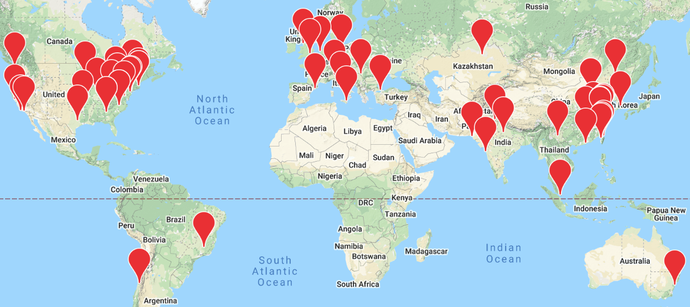

<div align="left">
  
</div>

# D2L.ai: Interactive Deep Learning Book with Multi-Framework Code, Math, and Discussions

[](http://ci.d2l.ai/job/d2l-en/job/master/)

[Book website](https://d2l.ai/) | [STAT 157 Course at UC Berkeley, Spring 2019](http://courses.d2l.ai/berkeley-stat-157/index.html) | Latest version: v0.16.6

<h5 align="center"><i>The best way to understand deep learning is learning by doing.</i></h5>

<p align="center">
  
  
  
  
</p>

This open-source book represents our attempt to make deep learning approachable, teaching you the concepts, the context, and the code. The entire book is drafted in Jupyter notebooks, seamlessly integrating exposition figures, math, and interactive examples with self-contained code.

Our goal is to offer a resource that could
1. be freely available for everyone;
1. offer sufficient technical depth to provide a starting point on the path to actually becoming an applied machine learning scientist;
1. include runnable code, showing readers how to solve problems in practice;
1. allow for rapid updates, both by us and also by the community at large;
1. be complemented by a forum for interactive discussion of technical details and to answer questions.

## Universities Using D2L
<p align="center">
  
</p>


## Cool Papers Using D2L

1. [**Descending through a Crowded Valley--Benchmarking Deep Learning Optimizers**](https://arxiv.org/pdf/2007.01547.pdf). R. Schmidt, F. Schneider, P. Hennig. *International Conference on Machine Learning, 2021*

1. [**Universal Average-Case Optimality of Polyak Momentum**](https://arxiv.org/pdf/2002.04664.pdf). D. Scieur, F. Pedregosan. *International Conference on Machine Learning, 2020*

1. [**2D Digital Image Correlation and Region-Based Convolutional Neural Network in Monitoring and Evaluation of Surface Cracks in Concrete Structural Elements**](https://www.mdpi.com/1996-1944/13/16/3527/pdf). M. Słoński, M. Tekieli. *Materials, 2020*

1. [**GluonCV and GluonNLP: Deep Learning in Computer Vision and Natural Language Processing**](https://www.jmlr.org/papers/volume21/19-429/19-429.pdf). J. Guo, H. He, T. He, L. Lausen, M. Li, H. Lin, X. Shi, C. Wang, J. Xie, S. Zha, A. Zhang, H. Zhang, Z. Zhang, Z. Zhang, S. Zheng, and Y. Zhu. *Journal of Machine Learning Research, 2020*

1. [**Detecting Human Driver Inattentive and Aggressive Driving Behavior Using Deep Learning: Recent Advances, Requirements and Open Challenges**](https://ieeexplore.ieee.org/stamp/stamp.jsp?arnumber=9107077). M. Alkinani, W. Khan, Q. Arshad. *IEEE Access, 2020*

<details><summary>more</summary>

1. [**Diagnosing Parkinson by Using Deep Autoencoder Neural Network**](https://link.springer.com/chapter/10.1007/978-981-15-6325-6_5). U. Kose, O. Deperlioglu, J. Alzubi, B. Patrut. *Deep Learning for Medical Decision Support Systems, 2020*

1. [**Deep Learning Architectures for Medical Diagnosis**](https://link.springer.com/chapter/10.1007/978-981-15-6325-6_2). U. Kose, O. Deperlioglu, J. Alzubi, B. Patrut. *Deep Learning for Medical Decision Support Systems, 2020*

1. [**ControlVAE: Tuning, Analytical Properties, and Performance Analysis**](https://arxiv.org/pdf/2011.01754.pdf). H. Shao, Z. Xiao, S. Yao, D. Sun, A. Zhang, S. Liu, T. Abdelzaher.

1. [**Potential, challenges and future directions for deep learning in prognostics and health management applications**](https://reader.elsevier.com/reader/sd/pii/S0952197620301184?token=7261E56B97513C5D621B9B5F43CAABEC2860AE3036278C3E5264707C32DCB658077B2AFA6ED6D5CD0FB7B16770828080). O. Fink, Q. Wang, M. Svensén, P. Dersin, W-J. Lee, M. Ducoffe. *Engineering Applications of Artificial Intelligence, 2020*

1. [**Learning User Representations with Hypercuboids for Recommender Systems**](https://arxiv.org/pdf/2011.05742.pdf). S. Zhang, H. Liu, A. Zhang, Y. Hu, C. Zhang, Y. Li, T. Zhu, S. He, W. Ou. *ACM International Conference on Web Search and Data Mining, 2021*

</details>


If you find this book useful, please star (★) this repository or cite this book using the following bibtex entry:

```
@article{zhang2021dive,
    title={Dive into Deep Learning},
    author={Zhang, Aston and Lipton, Zachary C. and Li, Mu and Smola, Alexander J.},
    journal={arXiv preprint arXiv:2106.11342},
    year={2021}
}
```


## Endorsements

> <p>"In less than a decade, the AI revolution has swept from research labs to broad industries to every corner of our daily life.  Dive into Deep Learning is an excellent text on deep learning and deserves attention from anyone who wants to learn why deep learning has ignited the AI revolution: the most powerful technology force of our time."</p>
> <b>&mdash; Jensen Huang, Founder and CEO, NVIDIA</b>

> <p>"This is a timely, fascinating book, providing with not only a comprehensive overview of deep learning principles but also detailed algorithms with hands-on programming code, and moreover, a state-of-the-art introduction to deep learning in computer vision and natural language processing. Dive into this book if you want to dive into deep learning!"</p>
> <b>&mdash; Jiawei Han, Michael Aiken Chair Professor, University of Illinois at Urbana-Champaign</b>

> <p>"This is a highly welcome addition to the machine learning literature, with a focus on hands-on experience implemented via the integration of Jupyter notebooks. Students of deep learning should find this invaluable to become proficient in this field."</p>
> <b>&mdash; Bernhard Schölkopf, Director, Max Planck Institute for Intelligent Systems</b>


## Contributing ([Learn How](https://d2l.ai/chapter_appendix-tools-for-deep-learning/contributing.html))

This open source book has benefited from pedagogical suggestions, typo corrections, and other improvements from community contributors. Your help is valuable for making the book better for everyone.

**Dear [D2L contributors](https://github.com/d2l-ai/d2l-en/graphs/contributors), please email your GitHub ID and name to d2lbook.en AT gmail DOT com so your name will appear on the [acknowledgments](https://d2l.ai/chapter_preface/index.html#Acknowledgments). Thanks.**


## License Summary

This open source book is made available under the Creative Commons Attribution-ShareAlike 4.0 International License. See [LICENSE](LICENSE) file.

The sample and reference code within this open source book is made available under a modified MIT license. See the [LICENSE-SAMPLECODE](LICENSE-SAMPLECODE) file.

[Chinese version](https://github.com/d2l-ai/d2l-zh) | [Discuss and report issues](https://discuss.d2l.ai/) | [Code of conduct](CODE_OF_CONDUCT.md) | [Other Information](INFO.md)

