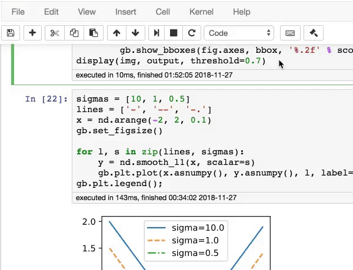

# Dive into Deep Learning (D2L Book)

[](http://ci.d2l.ai/job/d2l-en/job/master/)

[Book website](https://d2l.ai/) | [STAT 157 Course at UC Berkeley, Spring 2019](http://courses.d2l.ai/berkeley-stat-157/index.html)


<h5 align="center"><i>The best way to understand deep learning is learning by doing.</i></h5>

<p align="center">
  
</p>


This open-source book represents our attempt to make deep learning approachable, teaching you both the concepts, the context, and the code. 

This is a resource that could (1) be freely available for everyone; (2) offer sufficient technical depth to provide a starting point on the path to actually becoming an applied machine learning scientist; (3) include runnable code, showing readers how to solve problems in practice; (4) allow for rapid updates, both by us and also by the community at large; and (5) be complemented by a forum for interactive discussion of technical details and to answer questions.

If you find this book useful, please star (★) this repository or cite this book using the following bibtex entry:

```
@book{zhang2020dive,
    title={Dive into Deep Learning},
    author={Aston Zhang and Zachary C. Lipton and Mu Li and Alexander J. Smola},
    note={\url{https://d2l.ai}},
    year={2020}
}
```

## Contribute ([learn how](https://d2l.ai/chapter_appendix-tools-for-deep-learning/contributing.html))

This open source book has benefited from pedagogical suggestions, typo corrections, and other improvements from community contributors. Your help is valuable for making the book better for everyone. We will [acknowledge](https://d2l.ai/chapter_preface/index.html#Acknowledgments) each D2L contributor in the book and send a free book (hard copy) to the *first 100 contributors* when it is published.

**Dear [D2L contributors](https://github.com/d2l-ai/d2l-en/graphs/contributors), please email your GitHub ID, name, and mailing address to d2lbook.en@gmail.com. Thanks.**

[Chinese version](https://github.com/d2l-ai/d2l-zh) | [Discuss and report issues](https://discuss.mxnet.io/)

## License Summary

This open source book is made available under the Creative Commons Attribution-ShareAlike 4.0 International License. See the LICENSE file.

The sample and reference code within this open source book is made available under a modified MIT license. See the LICENSE-SAMPLECODE file.

[Other Information](INFO.md)
