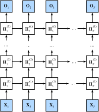

# Deep Recurrent Neural Networks

Up to now, we have only discussed recurrent neural networks with a single unidirectional hidden layer. In deep learning applications, we generally use recurrent neural networks that contain multiple hidden layers. These are also called deep recurrent neural networks. Figure 6.11 demonstrates a deep recurrent neural network with $L$ hidden layers. Each hidden state is continuously passed to the next time step of the current layer and the next layer of the current time step.

In time step $t$, we assume the mini-batch input is given as $\boldsymbol{X}_t \in \mathbb{R}^{n \times d}$ (number of examples: $n$, number of inputs: $d$). The hidden state of hidden layer $\ell$ ($\ell=1,\ldots,T$) is $\boldsymbol{H}_t^{(\ell)}  \in \mathbb{R}^{n \times h}$ (number of hidden units: $h$), the output layer variable is $\boldsymbol{O}_t \in \mathbb{R}^{n \times q}$ (number of outputs: $q$), and the hidden layer activation function is $\phi$. The hidden state of hidden layer 1 is calculated in the same way as before:

$$\boldsymbol{H}_t^{(1)} = \phi(\boldsymbol{X}_t \boldsymbol{W}_{xh}^{(1)} + \boldsymbol{H}_{t-1}^{(1)} \boldsymbol{W}_{hh}^{(1)}  + \boldsymbol{b}_h^{(1)}),$$

Here, the weight parameters $\boldsymbol{W}_{xh}^{(1)} \in \mathbb{R}^{d \times h} and \boldsymbol{W}_{hh}^{(1)} \in \mathbb{R}^{h \times h}$ and bias parameter $\boldsymbol{b}_h^{(1)} \in \mathbb{R}^{1 \times h}$ are the model parameters of hidden layer 1.

When $1 < \ell \leq L$, the hidden state of hidden layer $\ell$ is expressed as follows:

$$\boldsymbol{H}_t^{(\ell)} = \phi(\boldsymbol{H}_t^{(\ell-1)} \boldsymbol{W}_{xh}^{(\ell)} + \boldsymbol{H}_{t-1}^{(\ell)} \boldsymbol{W}_{hh}^{(\ell)}  + \boldsymbol{b}_h^{(\ell)}),$$

Here, the weight parameters $\boldsymbol{W}_{xh}^{(\ell)} \in \mathbb{R}^{h \times h} and \boldsymbol{W}_{hh}^{(\ell)} \in \mathbb{R}^{h \times h}$ and bias parameter $\boldsymbol{b}_h^{(\ell)} \in \mathbb{R}^{1 \times h}$ are the model parameters of hidden layer $\ell$.

Finally, the output of the output layer is only based on the hidden state of hidden layer $L$:

$$\boldsymbol{O}_t = \boldsymbol{H}_t^{(L)} \boldsymbol{W}_{hq} + \boldsymbol{b}_q,$$

Here, the weight parameter $\boldsymbol{W}_{hq} \in \mathbb{R}^{h \times q}$ and bias parameter $\boldsymbol{b}_q \in \mathbb{R}^{1 \times q}$ are the model parameters of the output layer.

Just as with multilayer perceptrons, the number of hidden layers $L$ and number of hidden units $h$ are hyper parameters. In addition, we can create a deep gated recurrent neural network by replacing hidden state computation with GRU or LSTM computation.

## Summary

* In deep recurrent neural networks, hidden state information is continuously passed to the next time step of the current layer and the next layer of the current time step.

## Exercises

* Alter the model in the ["Implementation of a Recurrent Neural Network from Scratch"](rnn-scratch.md) section to create a recurrent neural network with two hidden layers. Observe and analyze the experimental phenomena.

## Scan the QR Code to [Discuss](https://discuss.mxnet.io/t/2369)

