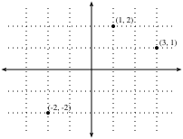
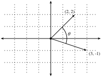
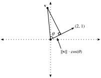
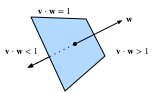
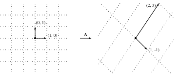

# Geometry and Linear Algebraic Operations
:label:`sec_geometry-linear-algebraic-ops`

In :numref:`sec_linear-algebra`, we encountered the basics of linear algebra
and saw how it could be used to express common operations for transforming our data.
Linear algebra is one of the key mathematical pillars
underlying much of the work that we do in deep learning
and in machine learning more broadly.
While :numref:`sec_linear-algebra` contained enough machinery
to communicate the mechanics of modern deep learning models,
there is a lot more to the subject.
In this section, we will go deeper,
highlighting some geometric interpretations of linear algebra operations,
and introducing a few fundamental concepts, including of eigenvalues and eigenvectors.

## Geometry of Vectors
First, we need to discuss the two common geometric interpretations of vectors,
as either points or directions in space.
Fundamentally, a vector is a list of numbers such as the Python list below.

```{.python .input}
#@tab all
v = [1, 7, 0, 1]
```

Mathematicians most often write this as either a *column* or *row* vector, which is to say either as

$$
\mathbf{x} = \begin{bmatrix}1\\7\\0\\1\end{bmatrix},
$$

or

$$
\mathbf{x}^\top = \begin{bmatrix}1 & 7 & 0 & 1\end{bmatrix}.
$$

These often have different interpretations,
where data examples are column vectors
and weights used to form weighted sums are row vectors.
However, it can be beneficial to be flexible.
As we have described in :numref:`sec_linear-algebra`,
though a single vector's default orientation is a column vector,
for any matrix representing a tabular dataset,
treating each data example as a row vector
in the matrix
is more conventional.

Given a vector, the first interpretation
that we should give it is as a point in space.
In two or three dimensions, we can visualize these points
by using the components of the vectors to define
the location of the points in space compared
to a fixed reference called the *origin*.  This can be seen in :numref:`fig_grid`.


:label:`fig_grid`

This geometric point of view allows us to consider the problem on a more abstract level.
No longer faced with some insurmountable seeming problem
like classifying pictures as either cats or dogs,
we can start considering tasks abstractly
as collections of points in space and picturing the task
as discovering how to separate two distinct clusters of points.

In parallel, there is a second point of view
that people often take of vectors: as directions in space.
Not only can we think of the vector $\mathbf{v} = [3,2]^\top$
as the location $3$ units to the right and $2$ units up from the origin,
we can also think of it as the direction itself
to take $3$ steps to the right and $2$ steps up.
In this way, we consider all the vectors in figure :numref:`fig_arrow` the same.


:label:`fig_arrow`

One of the benefits of this shift is that
we can make visual sense of the act of vector addition.
In particular, we follow the directions given by one vector,
and then follow the directions given by the other, as is seen in :numref:`fig_add-vec`.


:label:`fig_add-vec`

Vector subtraction has a similar interpretation.
By considering the identity that $\mathbf{u} = \mathbf{v} + (\mathbf{u}-\mathbf{v})$,
we see that the vector $\mathbf{u}-\mathbf{v}$ is the direction
that takes us from the point $\mathbf{v}$ to the point $\mathbf{u}$.


## Dot Products and Angles
As we saw in :numref:`sec_linear-algebra`,
if we take two column vectors $\mathbf{u}$ and $\mathbf{v}$,
we can form their dot product by computing:

$$\mathbf{u}^\top\mathbf{v} = \sum_i u_i\cdot v_i.$$
:eqlabel:`eq_dot_def`

Because :eqref:`eq_dot_def` is symmetric, we will mirror the notation
of classical multiplication and write

$$
\mathbf{u}\cdot\mathbf{v} = \mathbf{u}^\top\mathbf{v} = \mathbf{v}^\top\mathbf{u},
$$

to highlight the fact that exchanging the order of the vectors will yield the same answer.

The dot product :eqref:`eq_dot_def` also admits a geometric interpretation: it is closely related to the angle between two vectors.  Consider the angle shown in :numref:`fig_angle`.


:label:`fig_angle`

To start, let's consider two specific vectors:

$$
\mathbf{v} = (r,0) \; \text{and} \; \mathbf{w} = (s\cos(\theta), s \sin(\theta)).
$$

The vector $\mathbf{v}$ is length $r$ and runs parallel to the $x$-axis,
and the vector $\mathbf{w}$ is of length $s$ and at angle $\theta$ with the $x$-axis.
If we compute the dot product of these two vectors, we see that

$$
\mathbf{v}\cdot\mathbf{w} = rs\cos(\theta) = \|\mathbf{v}\|\|\mathbf{w}\|\cos(\theta).
$$

With some simple algebraic manipulation, we can rearrange terms to obtain

$$
\theta = \arccos\left(\frac{\mathbf{v}\cdot\mathbf{w}}{\|\mathbf{v}\|\|\mathbf{w}\|}\right).
$$

In short, for these two specific vectors,
the dot product combined with the norms tell us the angle between the two vectors. This same fact is true in general. We will not derive the expression here, however,
if we consider writing $\|\mathbf{v} - \mathbf{w}\|^2$ in two ways:
one with the dot product, and the other geometrically using the law of cosines,
we can obtain the full relationship.
Indeed, for any two vectors $\mathbf{v}$ and $\mathbf{w}$,
the angle between the two vectors is

$$\theta = \arccos\left(\frac{\mathbf{v}\cdot\mathbf{w}}{\|\mathbf{v}\|\|\mathbf{w}\|}\right).$$
:eqlabel:`eq_angle_forumla`

This is a nice result since nothing in the computation references two-dimensions.
Indeed, we can use this in three or three million dimensions without issue.

As a simple example, let's see how to compute the angle between a pair of vectors:

```{.python .input}
#@tab mxnet
%matplotlib inline
from d2l import mxnet as d2l
from IPython import display
from mxnet import gluon, np, npx
npx.set_np()

def angle(v, w):
    return np.arccos(v.dot(w) / (np.linalg.norm(v) * np.linalg.norm(w)))

angle(np.array([0, 1, 2]), np.array([2, 3, 4]))
```

```{.python .input}
#@tab pytorch
%matplotlib inline
from d2l import torch as d2l
from IPython import display
import torch
from torchvision import transforms
import torchvision

def angle(v, w):
    return torch.acos(v.dot(w) / (torch.norm(v) * torch.norm(w)))

angle(torch.tensor([0, 1, 2], dtype=torch.float32), torch.tensor([2.0, 3, 4]))
```

```{.python .input}
#@tab tensorflow
%matplotlib inline
from d2l import tensorflow as d2l
from IPython import display
import tensorflow as tf

def angle(v, w):
    return tf.acos(tf.tensordot(v, w, axes=1) / (tf.norm(v) * tf.norm(w)))

angle(tf.constant([0, 1, 2], dtype=tf.float32), tf.constant([2.0, 3, 4]))
```

We will not use it right now, but it is useful to know
that we will refer to vectors for which the angle is $\pi/2$
(or equivalently $90^{\circ}$) as being *orthogonal*.
By examining the equation above, we see that this happens when $\theta = \pi/2$,
which is the same thing as $\cos(\theta) = 0$.
The only way this can happen is if the dot product itself is zero,
and two vectors are orthogonal if and only if $\mathbf{v}\cdot\mathbf{w} = 0$.
This will prove to be a helpful formula when understanding objects geometrically.

It is reasonable to ask: why is computing the angle useful?
The answer comes in the kind of invariance we expect data to have.
Consider an image, and a duplicate image,
where every pixel value is the same but $10\%$ the brightness.
The values of the individual pixels are in general far from the original values.
Thus, if one computed the distance between the original image and the darker one,
the distance can be large.
However, for most ML applications, the *content* is the same---it is still
an image of a cat as far as a cat/dog classifier is concerned.
However, if we consider the angle, it is not hard to see
that for any vector $\mathbf{v}$, the angle
between $\mathbf{v}$ and $0.1\cdot\mathbf{v}$ is zero.
This corresponds to the fact that scaling vectors
keeps the same direction and just changes the length.
The angle considers the darker image identical.

Examples like this are everywhere.
In text, we might want the topic being discussed
to not change if we write twice as long of document that says the same thing.
For some encoding (such as counting the number of occurrences of words in some vocabulary), this corresponds to a doubling of the vector encoding the document,
so again we can use the angle.

### Cosine Similarity
In ML contexts where the angle is employed
to measure the closeness of two vectors,
practitioners adopt the term *cosine similarity*
to refer to the portion
$$
\cos(\theta) = \frac{\mathbf{v}\cdot\mathbf{w}}{\|\mathbf{v}\|\|\mathbf{w}\|}.
$$

The cosine takes a maximum value of $1$
when the two vectors point in the same direction,
a minimum value of $-1$ when they point in opposite directions,
and a value of $0$ when the two vectors are orthogonal.
Note that if the components of high-dimensional vectors
are sampled randomly with mean $0$,
their cosine will nearly always be close to $0$.


## Hyperplanes

In addition to working with vectors, another key object
that you must understand to go far in linear algebra
is the *hyperplane*, a generalization to higher dimensions
of a line (two dimensions) or of a plane (three dimensions).
In an $d$-dimensional vector space, a hyperplane has $d-1$ dimensions
and divides the space into two half-spaces.

Let's start with an example.
Suppose that we have a column vector $\mathbf{w}=[2,1]^\top$. We want to know, "what are the points $\mathbf{v}$ with $\mathbf{w}\cdot\mathbf{v} = 1$?"
By recalling the connection between dot products and angles above :eqref:`eq_angle_forumla`,
we can see that this is equivalent to
$$
\|\mathbf{v}\|\|\mathbf{w}\|\cos(\theta) = 1 \; \iff \; \|\mathbf{v}\|\cos(\theta) = \frac{1}{\|\mathbf{w}\|} = \frac{1}{\sqrt{5}}.
$$


:label:`fig_vector-project`

If we consider the geometric meaning of this expression,
we see that this is equivalent to saying
that the length of the projection of $\mathbf{v}$
onto the direction of $\mathbf{w}$ is exactly $1/\|\mathbf{w}\|$, as is shown in :numref:`fig_vector-project`.
The set of all points where this is true is a line
at right angles to the vector $\mathbf{w}$.
If we wanted, we could find the equation for this line
and see that it is $2x + y = 1$ or equivalently $y = 1 - 2x$.

If we now look at what happens when we ask about the set of points with
$\mathbf{w}\cdot\mathbf{v} > 1$ or $\mathbf{w}\cdot\mathbf{v} < 1$,
we can see that these are cases where the projections
are longer or shorter than $1/\|\mathbf{w}\|$, respectively.
Thus, those two inequalities define either side of the line.
In this way, we have found a way to cut our space into two halves,
where all the points on one side have dot product below a threshold,
and the other side above as we see in :numref:`fig_space-division`.


:label:`fig_space-division`

The story in higher dimension is much the same.
If we now take $\mathbf{w} = [1,2,3]^\top$
and ask about the points in three dimensions with $\mathbf{w}\cdot\mathbf{v} = 1$,
we obtain a plane at right angles to the given vector $\mathbf{w}$.
The two inequalities again define the two sides of the plane as is shown in :numref:`fig_higher-division`.


:label:`fig_higher-division`

While our ability to visualize runs out at this point,
nothing stops us from doing this in tens, hundreds, or billions of dimensions.
This occurs often when thinking about machine learned models.
For instance, we can understand linear classification models
like those from :numref:`sec_softmax`,
as methods to find hyperplanes that separate the different target classes.
In this context, such hyperplanes are often referred to as *decision planes*.
The majority of deep learned classification models end
with a linear layer fed into a softmax,
so one can interpret the role of the deep neural network
to be to find a non-linear embedding such that the target classes
can be separated cleanly by hyperplanes.

To give a hand-built example, notice that we can produce a reasonable model
to classify tiny images of t-shirts and trousers from the Fashion-MNIST dataset
(seen in :numref:`sec_fashion_mnist`)
en prenant simplement le vecteur entre leurs moyennes pour définir le plan de décision
et fixer à vue un seuil grossier.  Tout d'abord, nous allons charger les données et calculer les moyennes.

```{.python .input}
#@tab mxnet
# Load in the dataset
train = gluon.data.vision.FashionMNIST(train=True)
test = gluon.data.vision.FashionMNIST(train=False)

X_train_0 = np.stack([x[0] for x in train if x[1] == 0]).astype(float)
X_train_1 = np.stack([x[0] for x in train if x[1] == 1]).astype(float)
X_test = np.stack(
    [x[0] for x in test if x[1] == 0 or x[1] == 1]).astype(float)
y_test = np.stack(
    [x[1] for x in test if x[1] == 0 or x[1] == 1]).astype(float)

# Compute averages
ave_0 = np.mean(X_train_0, axis=0)
ave_1 = np.mean(X_train_1, axis=0)
```

```{.python .input}
#@tab pytorch
# Load in the dataset
trans = []
trans.append(transforms.ToTensor())
trans = transforms.Compose(trans)
train = torchvision.datasets.FashionMNIST(root="../data", transform=trans,
                                          train=True, download=True)
test = torchvision.datasets.FashionMNIST(root="../data", transform=trans,
                                         train=False, download=True)

X_train_0 = torch.stack(
    [x[0] * 256 for x in train if x[1] == 0]).type(torch.float32)
X_train_1 = torch.stack(
    [x[0] * 256 for x in train if x[1] == 1]).type(torch.float32)
X_test = torch.stack(
    [x[0] * 256 for x in test if x[1] == 0 or x[1] == 1]).type(torch.float32)
y_test = torch.stack([torch.tensor(x[1]) for x in test
                      if x[1] == 0 or x[1] == 1]).type(torch.float32)

# Compute averages
ave_0 = torch.mean(X_train_0, axis=0)
ave_1 = torch.mean(X_train_1, axis=0)
```

```{.python .input}
#@tab tensorflow
# Load in the dataset
((train_images, train_labels), (
    test_images, test_labels)) = tf.keras.datasets.fashion_mnist.load_data()


X_train_0 = tf.cast(tf.stack(train_images[[i for i, label in enumerate(
    train_labels) if label == 0]] * 256), dtype=tf.float32)
X_train_1 = tf.cast(tf.stack(train_images[[i for i, label in enumerate(
    train_labels) if label == 1]] * 256), dtype=tf.float32)
X_test = tf.cast(tf.stack(test_images[[i for i, label in enumerate(
    test_labels) if label == 0]] * 256), dtype=tf.float32)
y_test = tf.cast(tf.stack(test_images[[i for i, label in enumerate(
    test_labels) if label == 1]] * 256), dtype=tf.float32)

# Compute averages
ave_0 = tf.reduce_mean(X_train_0, axis=0)
ave_1 = tf.reduce_mean(X_train_1, axis=0)
```

Il peut être instructif d'examiner ces moyennes en détail, alors traçons ce à quoi elles ressemblent.  Dans ce cas, nous voyons que la moyenne ressemble effectivement à l'image floue d'un t-shirt.

```{.python .input}
#@tab mxnet, pytorch
# Plot average t-shirt
d2l.set_figsize()
d2l.plt.imshow(ave_0.reshape(28, 28).tolist(), cmap='Greys')
d2l.plt.show()
```

```{.python .input}
#@tab tensorflow
# Plot average t-shirt
d2l.set_figsize()
d2l.plt.imshow(tf.reshape(ave_0, (28, 28)), cmap='Greys')
d2l.plt.show()
```

Dans le deuxième cas, nous constatons à nouveau que la moyenne ressemble à une image floue d'un pantalon.

```{.python .input}
#@tab mxnet, pytorch
# Plot average trousers
d2l.plt.imshow(ave_1.reshape(28, 28).tolist(), cmap='Greys')
d2l.plt.show()
```

```{.python .input}
#@tab tensorflow
# Plot average trousers
d2l.plt.imshow(tf.reshape(ave_1, (28, 28)), cmap='Greys')
d2l.plt.show()
```

Dans une solution entièrement automatisée, nous apprendrions le seuil à partir de l'ensemble de données.  Dans ce cas, j'ai simplement fixé à la main un seuil qui semblait bon sur les données d'entraînement.

```{.python .input}
#@tab mxnet
# Print test set accuracy with eyeballed threshold
w = (ave_1 - ave_0).T
predictions = X_test.reshape(2000, -1).dot(w.flatten()) > -1500000

# Accuracy
np.mean(predictions.astype(y_test.dtype) == y_test, dtype=np.float64)
```

```{.python .input}
#@tab pytorch
# Print test set accuracy with eyeballed threshold
w = (ave_1 - ave_0).T
# '@' is Matrix Multiplication operator in pytorch.
predictions = X_test.reshape(2000, -1) @ (w.flatten()) > -1500000

# Accuracy
torch.mean((predictions.type(y_test.dtype) == y_test).float(), dtype=torch.float64)
```

```{.python .input}
#@tab tensorflow
# Print test set accuracy with eyeballed threshold
w = tf.transpose(ave_1 - ave_0)
predictions = tf.reduce_sum(X_test * tf.nest.flatten(w), axis=0) > -1500000

# Accuracy
tf.reduce_mean(
    tf.cast(tf.cast(predictions, y_test.dtype) == y_test, tf.float32))
```

## Géométrie des transformations linéaires

Grâce à :numref:`sec_linear-algebra` et aux discussions ci-dessus,
nous avons une solide compréhension de la géométrie des vecteurs, des longueurs et des angles.
Cependant, il y a un objet important que nous avons omis de discuter,
et c'est la compréhension géométrique des transformations linéaires représentées par des matrices.  L'intériorisation complète de ce que les matrices peuvent faire pour transformer des données
entre deux espaces de haute dimension potentiellement différents demande une pratique importante,
et dépasse le cadre de cette annexe.
Cependant, nous pouvons commencer à développer une intuition en deux dimensions.

Supposons que nous ayons une certaine matrice :

$$
\mathbf{A} = \begin{bmatrix}
a & b \\ c & d
\end{bmatrix}.
$$

Si nous voulons l'appliquer à un vecteur arbitraire
$\mathbf{v} = [x, y]^\top$ ,
nous multiplions et voyons que

$$
\begin{aligned}
\mathbf{A}\mathbf{v} & = \begin{bmatrix}a & b \\ c & d\end{bmatrix}\begin{bmatrix}x \\ y\end{bmatrix} \\
& = \begin{bmatrix}ax+by\\ cx+dy\end{bmatrix} \\
& = x\begin{bmatrix}a \\ c\end{bmatrix} + y\begin{bmatrix}b \\d\end{bmatrix} \\
& = x\left\{\mathbf{A}\begin{bmatrix}1\\0\end{bmatrix}\right\} + y\left\{\mathbf{A}\begin{bmatrix}0\\1\end{bmatrix}\right\}.
\end{aligned}
$$

Cela peut sembler être un calcul étrange,
où quelque chose de clair est devenu quelque peu impénétrable.
Cependant, il nous indique que nous pouvons écrire la manière dont
une matrice transforme *n'importe quel* vecteur
en fonction de la manière dont elle transforme *deux vecteurs spécifiques* :
$[1,0]^\top$ et $[0,1]^\top$.
Cela vaut la peine de s'y attarder un instant.
Nous avons essentiellement réduit un problème infini
(ce qui arrive à toute paire de nombres réels)
à un problème fini (ce qui arrive à ces vecteurs spécifiques).
Ces vecteurs sont un exemple de *base*,
où nous pouvons écrire tout vecteur dans notre espace
comme une somme pondérée de ces *vecteurs de base*.

Dessinons ce qui se passe lorsque nous utilisons la matrice spécifique

$$
\mathbf{A} = \begin{bmatrix}
1 & 2 \\
-1 & 3
\end{bmatrix}.
$$

Si nous regardons le vecteur spécifique $\mathbf{v} = [2, -1]^\top$,
nous voyons qu'il s'agit de $2\cdot[1,0]^\top + -1\cdot[0,1]^\top$,
et donc nous savons que la matrice $A$ enverra ceci à
$2(\mathbf{A}[1,0]^\top) + -1(\mathbf{A}[0,1])^\top = 2[1, -1]^\top - [2,3]^\top = [0, -5]^\top$.
Si nous suivons cette logique avec attention,
, par exemple en considérant la grille de toutes les paires de points entiers,
, nous constatons que la multiplication matricielle
peut incliner, faire pivoter et mettre à l'échelle la grille,
, mais la structure de la grille doit rester telle que vous la voyez sur :numref:`fig_grid-transform` .


:label:`fig_grid-transform`

C'est le point intuitif le plus important
à intérioriser à propos des transformations linéaires représentées par des matrices.
Les matrices sont incapables de déformer certaines parties de l'espace différemment des autres.
Tout ce qu'elles peuvent faire, c'est prendre les coordonnées originales de notre espace
et les incliner, les faire pivoter et les mettre à l'échelle.

Certaines distorsions peuvent être graves.  Par exemple, la matrice

$$
\mathbf{B} = \begin{bmatrix}
2 & -1 \\ 4 & -2
\end{bmatrix},
$$

comprime l'ensemble du plan bidimensionnel en une seule ligne.
L'identification et l'utilisation de telles transformations font l'objet d'une section ultérieure,
mais, d'un point de vue géométrique, nous pouvons constater que ces transformations sont fondamentalement différentes
des types de transformations que nous avons vus précédemment.
Par exemple, le résultat de la matrice $\mathbf{A}$ peut être "replié" sur la grille d'origine.  Les résultats de la matrice $\mathbf{B}$ ne peuvent pas l'être
car nous ne saurons jamais d'où vient le vecteur $[1,2]^\top$ - est-ce que
était $[1,1]^\top$ ou $[0, -1]^\top$?

Bien que cette image concerne une matrice $2\times2$,
rien ne nous empêche de transposer les leçons apprises à des dimensions supérieures.
Si nous prenons des vecteurs de base similaires comme $[1,0, \ldots,0]$
 et que nous voyons où notre matrice les envoie,
nous pouvons commencer à avoir une idée de la façon dont la multiplication matricielle
déforme l'espace entier dans n'importe quel espace de dimension avec lequel nous travaillons.

## Dépendance linéaire

Considérons à nouveau la matrice

$$
\mathbf{B} = \begin{bmatrix}
2 & -1 \\ 4 & -2
\end{bmatrix}.
$$

Cela comprime le plan entier pour qu'il vive sur la seule ligne $y = 2x$.
La question qui se pose maintenant est la suivante : existe-t-il un moyen de détecter ce phénomène
simplement en regardant la matrice elle-même ?
La réponse est qu'en effet, nous le pouvons.
Prenons $\mathbf{b}_1 = [2,4]^\top$ et $\mathbf{b}_2 = [-1, -2]^\top$
 comme les deux colonnes de $\mathbf{B}$.
Rappelez-vous que nous pouvons écrire tout ce qui est transformé par la matrice $\mathbf{B}$
 comme une somme pondérée des colonnes de la matrice :
comme $a_1\mathbf{b}_1 + a_2\mathbf{b}_2$.
Nous appelons cela une *combinaison linéaire*.
Le fait que $\mathbf{b}_1 = -2\cdot\mathbf{b}_2$
 signifie que nous pouvons écrire toute combinaison linéaire de ces deux colonnes
entièrement en termes de disons $\mathbf{b}_2$ puisque

$$
a_1\mathbf{b}_1 + a_2\mathbf{b}_2 = -2a_1\mathbf{b}_2 + a_2\mathbf{b}_2 = (a_2-2a_1)\mathbf{b}_2.
$$

Cela signifie que l'une des colonnes est, en un sens, redondante
car elle ne définit pas une direction unique dans l'espace.
Cela ne devrait pas trop nous surprendre
puisque nous avons déjà vu que cette matrice
réduit le plan entier à une seule ligne.
De plus, nous voyons que la dépendance linéaire
$\mathbf{b}_1 = -2\cdot\mathbf{b}_2$ rend compte de cela.
Pour rendre cela plus symétrique entre les deux vecteurs, nous l'écrirons comme suit

$$
\mathbf{b}_1  + 2\cdot\mathbf{b}_2 = 0.
$$

En général, nous dirons qu'un ensemble de vecteurs
$\mathbf{v}_1, \ldots, \mathbf{v}_k$ sont *linéairement dépendants*
s'il existe des coefficients $a_1, \ldots, a_k$ *non égaux à zéro* de sorte que

$$
\sum_{i=1}^k a_i\mathbf{v_i} = 0.
$$

Dans ce cas, nous pouvons résoudre l'un des vecteurs
en fonction d'une combinaison des autres,
et le rendre effectivement redondant.
Ainsi, une dépendance linéaire dans les colonnes d'une matrice
témoigne du fait que notre matrice
comprime l'espace à une dimension inférieure.
S'il n'y a pas de dépendance linéaire, on dit que les vecteurs sont *linéairement indépendants*.
Si les colonnes d'une matrice sont linéairement indépendantes,
aucune compression ne se produit et l'opération peut être annulée.

## Rang

Si nous avons une matrice générale $n\times m$,
il est raisonnable de se demander dans quel espace de dimension la matrice s'applique.
Un concept connu sous le nom de *rank* sera notre réponse.
Dans la section précédente, nous avons noté qu'une dépendance linéaire
témoigne de la compression de l'espace dans une dimension inférieure
et nous pourrons donc utiliser cela pour définir la notion de rang.
En particulier, le rang d'une matrice $\mathbf{A}$
 est le plus grand nombre de colonnes linéairement indépendantes
parmi tous les sous-ensembles de colonnes. Par exemple, la matrice

$$
\mathbf{B} = \begin{bmatrix}
2 & 4 \\ -1 & -2
\end{bmatrix},
$$

a $\mathrm{rank}(B)=1$, puisque les deux colonnes sont linéairement dépendantes,
mais aucune des deux colonnes n'est linéairement dépendante.
Pour un exemple plus difficile, nous pouvons considérer

$$
\mathbf{C} = \begin{bmatrix}
1& 3 & 0 & -1 & 0 \\
-1 & 0 & 1 & 1 & -1 \\
0 & 3 & 1 & 0 & -1 \\
2 & 3 & -1 & -2 & 1
\end{bmatrix},
$$

et montrer que $\mathbf{C}$ a le rang deux puisque, par exemple,
les deux premières colonnes sont linéairement indépendantes,
mais n'importe laquelle des quatre collections de trois colonnes est dépendante.

Cette procédure, telle qu'elle est décrite, est très inefficace.
Elle nécessite de regarder chaque sous-ensemble de colonnes de notre matrice donnée,
et est donc potentiellement exponentielle en nombre de colonnes.
Nous verrons plus tard une méthode plus efficace
pour calculer le rang d'une matrice, mais pour l'instant,
ceci est suffisant pour voir que le concept
est bien défini et comprendre sa signification.

## Invertibilité

Nous avons vu ci-dessus que la multiplication par une matrice avec des colonnes linéairement dépendantes
ne peut pas être annulée, c'est-à-dire qu'il n'y a pas d'opération inverse qui puisse toujours récupérer l'entrée.  Cependant, la multiplication par une matrice de rang complet
(c'est-à-dire une certaine $\mathbf{A}$ qui est $n \times n$ matrice de rang $n$),
devrait toujours pouvoir être annulée.  Considérons la matrice

$$
\mathbf{I} = \begin{bmatrix}
1 & 0 & \cdots & 0 \\
0 & 1 & \cdots & 0 \\
\vdots & \vdots & \ddots & \vdots \\
0 & 0 & \cdots & 1
\end{bmatrix}.
$$

qui est la matrice avec des uns le long de la diagonale et des zéros ailleurs.
Nous l'appelons la matrice *identité*.
C'est la matrice qui laisse nos données inchangées lorsqu'elle est appliquée.
Pour trouver une matrice qui défait ce que notre matrice $\mathbf{A}$ a fait,
nous voulons trouver une matrice $\mathbf{A}^{-1}$ telle que

$$
\mathbf{A}^{-1}\mathbf{A} = \mathbf{A}\mathbf{A}^{-1} =  \mathbf{I}.
$$

Si nous considérons ceci comme un système, nous avons $n \times n$ inconnues
(les entrées de $\mathbf{A}^{-1}$) et $n \times n$ équations
(l'égalité qui doit exister entre chaque entrée du produit $\mathbf{A}^{-1}\mathbf{A}$ et chaque entrée de $\mathbf{I}$)
donc nous devrions généralement nous attendre à ce qu'une solution existe.
En effet, dans la section suivante, nous verrons une quantité appelée le *déterminant*,
qui a la propriété que tant que le déterminant n'est pas nul, nous pouvons trouver une solution.  Nous appelons une telle matrice $\mathbf{A}^{-1}$ la matrice *inverse*.
A titre d'exemple, si $\mathbf{A}$ est la matrice générale $2 \times 2$

$$
\mathbf{A} = \begin{bmatrix}
a & b \\
c & d
\end{bmatrix},
$$

alors nous pouvons voir que l'inverse est

$$
 \frac{1}{ad-bc}  \begin{bmatrix}
d & -b \\
-c & a
\end{bmatrix}.
$$

Nous pouvons tester cela en voyant que la multiplication de
par l'inverse donné par la formule ci-dessus fonctionne en pratique.

```{.python .input}
#@tab mxnet
M = np.array([[1, 2], [1, 4]])
M_inv = np.array([[2, -1], [-0.5, 0.5]])
M_inv.dot(M)
```

```{.python .input}
#@tab pytorch
M = torch.tensor([[1, 2], [1, 4]], dtype=torch.float32)
M_inv = torch.tensor([[2, -1], [-0.5, 0.5]])
M_inv @ M
```

```{.python .input}
#@tab tensorflow
M = tf.constant([[1, 2], [1, 4]], dtype=tf.float32)
M_inv = tf.constant([[2, -1], [-0.5, 0.5]])
tf.matmul(M_inv, M)
```

### Problèmes numériques
Bien que l'inverse d'une matrice soit utile en théorie,
nous devons dire que la plupart du temps nous ne souhaitons pas
*utiliser* l'inverse de la matrice pour résoudre un problème en pratique.
En général, il existe des algorithmes beaucoup plus stables numériquement
pour résoudre des équations linéaires telles que

$$
\mathbf{A}\mathbf{x} = \mathbf{b},
$$

que de calculer l'inverse et de multiplier pour obtenir

$$
\mathbf{x} = \mathbf{A}^{-1}\mathbf{b}.
$$

De même que la division par un petit nombre peut conduire à une instabilité numérique,
peut également conduire à l'inversion d'une matrice qui est proche d'avoir un rang bas.

De plus, il est courant que la matrice $\mathbf{A}$ soit *sparse*,
c'est-à-dire qu'elle ne contienne qu'un petit nombre de valeurs non nulles.
Si nous devions explorer des exemples, nous verrions
que cela ne signifie pas que l'inverse est clairsemé.
Même si $\mathbf{A}$ était une matrice $1$ million par $1$ million
avec seulement $5$ million d'entrées non nulles
(et que nous n'avions donc besoin de stocker que ces $5$ millions),
l'inverse aura typiquement presque chaque entrée non négative,
nous obligeant à stocker toutes les $1\text{M}^2$ entrées--soit $1$ trillion d'entrées !

Bien que nous n'ayons pas le temps de nous plonger dans les problèmes numériques épineux
que l'on rencontre fréquemment lorsqu'on travaille avec l'algèbre linéaire,
nous voulons vous donner une idée de quand il faut procéder avec prudence,
et en général, éviter l'inversion en pratique est une bonne règle empirique.

## Déterminant
La vision géométrique de l'algèbre linéaire donne une manière intuitive
d'interpréter une quantité fondamentale connue sous le nom de *déterminant*.
Reprenez l'image de la grille précédente, mais avec une région en surbrillance (:numref:`fig_grid-filled` ).


:label:`fig_grid-filled`

Regardez le carré en surbrillance.  Il s'agit d'un carré dont les bords sont donnés à
par $(0, 1)$ et $(1, 0)$ et qui a donc une aire de 1.
Après que $\mathbf{A}$ ait transformé ce carré,
nous voyons qu'il devient un parallélogramme.
Il n'y a aucune raison pour que ce parallélogramme ait la même aire
que celle de départ, et en effet, dans le cas spécifique montré ici de

$$
\mathbf{A} = \begin{bmatrix}
1 & 2 \\
-1 & 3
\end{bmatrix},
$$

c'est un exercice de géométrie des coordonnées pour calculer
l'aire de ce parallélogramme et obtenir que l'aire est $5$.

En général, si nous avons une matrice

$$
\mathbf{A} = \begin{bmatrix}
a & b \\
c & d
\end{bmatrix},
$$

nous pouvons voir, après quelques calculs, que l'aire
du parallélogramme résultant est $ad-bc$.
Cette aire est appelée le *déterminant*.

Vérifions cela rapidement à l'aide d'un exemple de code.

```{.python .input}
#@tab mxnet
import numpy as np
np.linalg.det(np.array([[1, -1], [2, 3]]))
```

```{.python .input}
#@tab pytorch
torch.det(torch.tensor([[1, -1], [2, 3]], dtype=torch.float32))
```

```{.python .input}
#@tab tensorflow
tf.linalg.det(tf.constant([[1, -1], [2, 3]], dtype=tf.float32))
```

Les plus attentifs d'entre nous remarqueront
que cette expression peut être nulle ou même négative.
Pour le terme négatif, il s'agit d'une question de convention
prise généralement en mathématiques :
si la matrice renverse la figure,
nous disons que l'aire est niée.
Voyons maintenant que lorsque le déterminant est nul, nous en apprenons davantage.

Considérons

$$
\mathbf{B} = \begin{bmatrix}
2 & 4 \\ -1 & -2
\end{bmatrix}.
$$

Si nous calculons le déterminant de cette matrice,
, nous obtenons $2\cdot(-2 ) - 4\cdot(-1) = 0$.
Étant donné ce que nous avons compris ci-dessus, cela a du sens.
$\mathbf{B}$ compresse le carré de l'image originale
en un segment de ligne, qui a une surface nulle.
Et en effet, être compressé dans un espace de dimension inférieure
est la seule façon d'avoir une surface nulle après la transformation.
Nous voyons donc que le résultat suivant est vrai :
une matrice $A$ est inversible si et seulement si
le déterminant n'est pas égal à zéro.

Pour terminer, imaginons que nous ayons une figure quelconque dessinée sur le plan.
En pensant comme des informaticiens, nous pouvons décomposer
cette figure en une collection de petits carrés
de sorte que l'aire de la figure est essentiellement
juste le nombre de carrés dans la décomposition.
Si nous transformons maintenant cette figure par une matrice,
nous transformons chacun de ces carrés en parallélogrammes,
dont l'aire est donnée par le déterminant.
Nous voyons que pour toute figure, le déterminant donne le nombre (signé)
qu'une matrice met à l'échelle l'aire de toute figure.

Le calcul des déterminants pour des matrices plus grandes peut être laborieux,
mais l'intuition est la même.
Le déterminant reste le facteur
que $n\times n$ les matrices mettent à l'échelle $n$-dimensions.

## Tenseurs et opérations courantes d'algèbre linéaire

Dans :numref:`sec_linear-algebra` , nous avons introduit le concept de tenseurs.
Dans cette section, nous allons nous plonger plus profondément dans les contractions tensorielles
(l'équivalent tensoriel de la multiplication matricielle),
et voir comment elles peuvent fournir une vue unifiée
sur un certain nombre d'opérations matricielles et vectorielles.

Avec les matrices et les vecteurs, nous savions comment les multiplier pour transformer les données.
Nous devons avoir une définition similaire pour les tenseurs si nous voulons qu'ils nous soient utiles.
Pensez à la multiplication matricielle :

$$
\mathbf{C} = \mathbf{A}\mathbf{B},
$$

ou de manière équivalente

$$ c_{i, j} = \sum_{k} a_{i, k}b_{k, j}.$$ 

 Nous pouvons répéter ce schéma pour les tenseurs.
Pour les tenseurs, il n'y a pas de cas unique sur lequel
additionner qui puisse être choisi universellement,
. Nous devons donc spécifier exactement les indices sur lesquels nous voulons additionner.
Par exemple, nous pourrions considérer

$$
y_{il} = \sum_{jk} x_{ijkl}a_{jk}.
$$

Une telle transformation est appelée une *contraction de tenseurs*.
Elle peut représenter une famille de transformations bien plus flexible
que la seule multiplication matricielle.

Pour simplifier la notation,
, nous pouvons remarquer que la somme porte exactement sur les indices
qui apparaissent plus d'une fois dans l'expression,
. Les gens travaillent donc souvent avec la *notation d'Einstein*,
où la somme porte implicitement sur tous les indices répétés.
On obtient ainsi l'expression compacte :

$$
y_{il} = x_{ijkl}a_{jk}.
$$

### Exemples courants d'algèbre linéaire

Voyons combien de définitions d'algèbre linéaire
que nous avons vues auparavant peuvent être exprimées dans cette notation tensorielle compacte :

* $\mathbf{v} \cdot \mathbf{w} = \sum_i v_iw_i$
 * $\|\mathbf{v}\|_2^{2} = \sum_i v_iv_i$
 * $(\mathbf{A}\mathbf{v})_i = \sum_j a_{ij}v_j$
 * $(\mathbf{A}\mathbf{B})_{ik} = \sum_j a_{ij}b_{jk}$
 * $\mathrm{tr}(\mathbf{A}) = \sum_i a_{ii}$

 De cette façon, nous pouvons remplacer une myriade de notations spécialisées par des expressions tensorielles courtes.

### Expression dans le code
Les tenseurs peuvent également être utilisés de manière flexible dans le code.
Comme nous l'avons vu dans :numref:`sec_linear-algebra` ,
nous pouvons créer des tenseurs comme indiqué ci-dessous.

```{.python .input}
#@tab mxnet
# Define tensors
B = np.array([[[1, 2, 3], [4, 5, 6]], [[7, 8, 9], [10, 11, 12]]])
A = np.array([[1, 2], [3, 4]])
v = np.array([1, 2])

# Print out the shapes
A.shape, B.shape, v.shape
```

```{.python .input}
#@tab pytorch
# Define tensors
B = torch.tensor([[[1, 2, 3], [4, 5, 6]], [[7, 8, 9], [10, 11, 12]]])
A = torch.tensor([[1, 2], [3, 4]])
v = torch.tensor([1, 2])

# Print out the shapes
A.shape, B.shape, v.shape
```

```{.python .input}
#@tab tensorflow
# Define tensors
B = tf.constant([[[1, 2, 3], [4, 5, 6]], [[7, 8, 9], [10, 11, 12]]])
A = tf.constant([[1, 2], [3, 4]])
v = tf.constant([1, 2])

# Print out the shapes
A.shape, B.shape, v.shape
```

La sommation d'Einstein a été implémentée directement.
Les indices qui se produisent dans la sommation d'Einstein peuvent être passés comme une chaîne,
suivie des tenseurs sur lesquels on agit.
Par exemple, pour implémenter la multiplication de matrices,
, nous pouvons considérer la sommation d'Einstein vue ci-dessus
($\mathbf{A}\mathbf{v} = a_{ij}v_j$)
et supprimer les indices eux-mêmes pour obtenir l'implémentation :

```{.python .input}
#@tab mxnet
# Reimplement matrix multiplication
np.einsum("ij, j -> i", A, v), A.dot(v)
```

```{.python .input}
#@tab pytorch
# Reimplement matrix multiplication
torch.einsum("ij, j -> i", A, v), A@v
```

```{.python .input}
#@tab tensorflow
# Reimplement matrix multiplication
tf.einsum("ij, j -> i", A, v), tf.matmul(A, tf.reshape(v, (2, 1)))
```

Il s'agit d'une notation très flexible.
Par exemple, si nous voulons calculer
, ce qui s'écrit traditionnellement comme suit

$$
c_{kl} = \sum_{ij} \mathbf{b}_{ijk}\mathbf{a}_{il}v_j.
$$

il peut être implémenté via la sommation d'Einstein comme :

```{.python .input}
#@tab mxnet
np.einsum("ijk, il, j -> kl", B, A, v)
```

```{.python .input}
#@tab pytorch
torch.einsum("ijk, il, j -> kl", B, A, v)
```

```{.python .input}
#@tab tensorflow
tf.einsum("ijk, il, j -> kl", B, A, v)
```

Cette notation est lisible et efficace pour les humains,
mais encombrante si, pour une raison quelconque,
nous devons générer une contraction tensorielle par programme.
Pour cette raison, `einsum` propose une notation alternative
en fournissant des indices entiers pour chaque tenseur.
Par exemple, la même contraction tensorielle peut aussi être écrite comme suit :

```{.python .input}
#@tab mxnet
np.einsum(B, [0, 1, 2], A, [0, 3], v, [1], [2, 3])
```

```{.python .input}
#@tab pytorch
# PyTorch doesn't support this type of notation.
```

```{.python .input}
#@tab tensorflow
# TensorFlow doesn't support this type of notation.
```

L'une ou l'autre notation permet une représentation concise et efficace des contractions tensorielles dans le code.

## Résumé
* Les vecteurs peuvent être interprétés géométriquement comme des points ou des directions dans l'espace.
* Les produits scalaires définissent la notion d'angle dans des espaces de haute dimension.
* Les hyperplans sont des généralisations à haute dimension des lignes et des plans.  Ils peuvent être utilisés pour définir des plans de décision qui sont souvent utilisés comme dernière étape d'une tâche de classification.
* La multiplication matricielle peut être interprétée géométriquement comme une déformation uniforme des coordonnées sous-jacentes. Elles représentent un moyen très restreint, mais mathématiquement propre, de transformer des vecteurs.
* La dépendance linéaire est un moyen de savoir si une collection de vecteurs se trouve dans un espace de dimension inférieure à celle à laquelle on pourrait s'attendre (disons que vous avez $3$ vecteurs vivant dans un espace à $2$-dimensions). Le rang d'une matrice est la taille du plus grand sous-ensemble de ses colonnes qui sont linéairement indépendantes.
* Lorsque l'inverse d'une matrice est défini, l'inversion de matrice nous permet de trouver une autre matrice qui annule l'action de la première. L'inversion matricielle est utile en théorie, mais nécessite de la prudence en pratique en raison de l'instabilité numérique.
* Les déterminants nous permettent de mesurer à quel point une matrice étend ou contracte un espace. Un déterminant non nul implique une matrice inversible (non singulière) et un déterminant nul signifie que la matrice est non inversible (singulière).
* Les contractions tensorielles et la sommation d'Einstein fournissent une notation propre et nette pour exprimer un grand nombre des calculs que l'on voit dans l'apprentissage automatique.

## Exercices
1. Quel est l'angle entre
$$
\vec v_1 = \begin{bmatrix}
1 \\ 0 \\ -1 \\ 2
\end{bmatrix}, \qquad \vec v_2 = \begin{bmatrix}
3 \\ 1 \\ 0 \\ 1
\end{bmatrix}?
$$
2. Vrai ou faux : $\begin{bmatrix}1 & 2\\0&1\end{bmatrix}$ et $\begin{bmatrix}1 & -2\\0&1\end{bmatrix}$ sont inverses l'un de l'autre ?
3. Supposons que nous dessinions une figure dans le plan dont l'aire est $100\mathrm{m}^2$.  Quelle est l'aire après transformation de la figure par la matrice
$$
\begin{bmatrix}
2 & 3\\
1 & 2
\end{bmatrix}.
$$
4. Lesquels des ensembles de vecteurs suivants sont linéairement indépendants ?
 * $\left\{\begin{pmatrix}1\\0\\-1\end{pmatrix}, \begin{pmatrix}2\\1\\-1\end{pmatrix}, \begin{pmatrix}3\\1\\1\end{pmatrix}\right\}$
 * $\left\{\begin{pmatrix}3\\1\\1\end{pmatrix}, \begin{pmatrix}1\\1\\1\end{pmatrix}, \begin{pmatrix}0\\0\\0\end{pmatrix}\right\}$
 * $\left\{\begin{pmatrix}1\\1\\0\end{pmatrix}, \begin{pmatrix}0\\1\\-1\end{pmatrix}, \begin{pmatrix}1\\0\\1\end{pmatrix}\right\}$
 5. Supposons que vous ayez une matrice écrite sous la forme $A = \begin{bmatrix}c\\d\end{bmatrix}\cdot\begin{bmatrix}a & b\end{bmatrix}$ pour un certain choix de valeurs $a, b, c$, et $d$.  Vrai ou faux : le déterminant d'une telle matrice est toujours $0$?
6. Les vecteurs $e_1 = \begin{bmatrix}1\\0\end{bmatrix}$ et $e_2 = \begin{bmatrix}0\\1\end{bmatrix}$ sont orthogonaux.  Quelle est la condition sur une matrice $A$ pour que $Ae_1$ et $Ae_2$ soient orthogonaux ?
7. Comment pouvez-vous écrire $\mathrm{tr}(\mathbf{A}^4)$ en notation d'Einstein pour une matrice arbitraire $A$?

:begin_tab:`mxnet`
[Discussions](https://discuss.d2l.ai/t/410)
:end_tab:

:begin_tab:`pytorch`
[Discussions](https://discuss.d2l.ai/t/1084)
:end_tab:

:begin_tab:`tensorflow`
[Discussions](https://discuss.d2l.ai/t/1085)
:end_tab:
