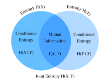

# Théorie de l'information
:label:`sec_information_theory` 

L'univers déborde d'informations. L'information fournit un langage commun par-delà les clivages disciplinaires : du sonnet de Shakespeare à l'article des chercheurs sur Cornell ArXiv, de l'impression Nuit étoilée de Van Gogh à la musique Symphonie n° 5 de Beethoven, du premier langage de programmation Plankalkül aux algorithmes d'apprentissage automatique les plus modernes. Tout doit suivre les règles de la théorie de l'information, quel que soit le format. Grâce à la théorie de l'information, nous pouvons mesurer et comparer la quantité d'informations présentes dans différents signaux. Dans cette section, nous allons étudier les concepts fondamentaux de la théorie de l'information et les applications de la théorie de l'information dans l'apprentissage automatique.

Avant de commencer, décrivons la relation entre l'apprentissage automatique et la théorie de l'information. L'apprentissage automatique vise à extraire des signaux intéressants des données et à faire des prédictions critiques.  D'autre part, la théorie de l'information étudie le codage, le décodage, la transmission et la manipulation de l'information. Par conséquent, la théorie de l'information fournit un langage fondamental pour discuter du traitement de l'information dans les systèmes d'apprentissage automatique. Par exemple, de nombreuses applications d'apprentissage automatique utilisent la perte d'entropie croisée décrite dans :numref:`sec_softmax`.  Cette perte peut être directement dérivée des considérations de la théorie de l'information.


## Information

Commençons par l'"âme" de la théorie de l'information : l'information. *L'information* peut être codée dans n'importe quoi avec une séquence particulière d'un ou plusieurs formats de codage. Supposons que nous nous donnions pour tâche d'essayer de définir une notion d'information.  Quel pourrait être notre point de départ ?

Considérons l'expérience de pensée suivante.  Nous avons un ami avec un jeu de cartes.  Il va mélanger le jeu, retourner certaines cartes et nous dire des choses sur ces cartes.  Nous allons essayer d'évaluer le contenu informatif de chaque déclaration.

Tout d'abord, il retourne une carte et nous dit : "Je vois une carte"  Cela ne nous fournit aucune information.  Nous étions déjà certains que c'était le cas et nous espérons donc que l'information sera nulle.

Ensuite, ils retournent une carte et disent : "Je vois un cœur"  Cela nous fournit quelques informations, mais en réalité, il n'y a que $4$ combinaisons différentes possibles, toutes aussi probables les unes que les autres, et nous ne sommes donc pas surpris par ce résultat.  Nous espérons que, quelle que soit la mesure de l'information, cet événement devrait avoir un faible contenu informatif.

Ensuite, ils retournent une carte et disent : "Voici le $3$ de pique."  Il s'agit d'une information supplémentaire.  En effet, il y avait $52$ résultats possibles tout aussi probables, et notre ami nous a dit lequel c'était.  Il devrait s'agir d'une quantité moyenne d'informations.

Poussons la logique à l'extrême.  Supposons qu'ils retournent finalement toutes les cartes du jeu et lisent la séquence complète du jeu mélangé.  Il existe $52!$ ordres différents pour le jeu de cartes, tous aussi probables les uns que les autres, et nous avons donc besoin de beaucoup d'informations pour savoir lequel c'est.

Toute notion d'information que nous développons doit se conformer à cette intuition.  En effet, dans les sections suivantes, nous apprendrons à calculer que ces événements ont respectivement $0\text{ bits}$, $2\text{ bits}$, $~5.7\text{ bits}$ et $~225.6\text{ bits}$ d'information.

Si nous lisons ces expériences de pensée, nous voyons une idée naturelle.  Pour commencer, plutôt que de nous soucier de la connaissance, nous pouvons partir de l'idée que l'information représente le degré de surprise ou la possibilité abstraite de l'événement. Par exemple, si nous voulons décrire un événement inhabituel, nous avons besoin de beaucoup d'informations. Pour un événement commun, nous n'aurons peut-être pas besoin de beaucoup d'informations.

En 1948, Claude E. Shannon a publié *A Mathematical Theory of Communication* :cite:`Shannon.1948` établissant la théorie de l'information.  Dans son article, Shannon a introduit pour la première fois le concept d'entropie de l'information. C'est ici que nous allons commencer notre voyage.


### Self-information

Puisque l'information incarne la possibilité abstraite d'un événement, comment faire correspondre cette possibilité au nombre de bits ? Shannon a introduit la terminologie *bit* comme unité d'information, qui a été créée à l'origine par John Tukey. Qu'est-ce qu'un "bit" et pourquoi l'utilisons-nous pour mesurer l'information ? Historiquement, un émetteur ancien ne peut envoyer ou recevoir que deux types de code : $0$ et $1$. En effet, le codage binaire est encore couramment utilisé sur tous les ordinateurs numériques modernes. Ainsi, toute information est codée par une série de $0$ et $1$. Et donc, une série de chiffres binaires de longueur $n$ contient $n$ bits d'information.

Maintenant, supposons que pour toute série de codes, chaque $0$ ou $1$ se produit avec une probabilité de $\frac{1}{2}$. Par conséquent, un événement $X$ avec une série de codes de longueur $n$, se produit avec une probabilité de $\frac{1}{2^n}$. En même temps, comme nous l'avons mentionné précédemment, cette série contient $n$ bits d'information. Alors, peut-on généraliser à une fonction mathématique qui peut transférer la probabilité $p$ au nombre de bits ? Shannon a donné la réponse en définissant l'*auto-information*

$$I(X) = - \log_2 (p),$$ 

comme les *bits* d'information que nous avons reçus pour cet événement $X$. Notez que nous utiliserons toujours des logarithmes en base 2 dans cette section. Par souci de simplicité, le reste de cette section omettra l'indice 2 dans la notation logarithmique, c'est-à-dire que $\log(.)$ fait toujours référence à $\log_2(.)$. Par exemple, le code "0010" a une information propre

$$I(\text{"0010"}) = - \log (p(\text{"0010"})) = - \log \left( \frac{1}{2^4} \right) = 4 \text{ bits}.$$ 

Nous pouvons calculer l'information propre comme indiqué ci-dessous. Avant cela, commençons par importer tous les paquets nécessaires dans cette section.

```{.python .input}
#@tab mxnet
from mxnet import np
from mxnet.metric import NegativeLogLikelihood
from mxnet.ndarray import nansum
import random

def self_information(p):
    return -np.log2(p)

self_information(1 / 64)
```

```{.python .input}
#@tab pytorch
import torch
from torch.nn import NLLLoss

def nansum(x):
    # Define nansum, as pytorch doesn't offer it inbuilt.
    return x[~torch.isnan(x)].sum()

def self_information(p):
    return -torch.log2(torch.tensor(p)).item()

self_information(1 / 64)
```

```{.python .input}
#@tab tensorflow
import tensorflow as tf

def log2(x):
    return tf.math.log(x) / tf.math.log(2.)

def nansum(x):
    return tf.reduce_sum(tf.where(tf.math.is_nan(
        x), tf.zeros_like(x), x), axis=-1)

def self_information(p):
    return -log2(tf.constant(p)).numpy()

self_information(1 / 64)
```

## Entropie

Comme l'auto-information ne mesure que l'information d'un seul événement discret, nous avons besoin d'une mesure plus généralisée pour toute variable aléatoire de distribution discrète ou continue.


### Motivation de l'entropie

Essayons d'être précis sur ce que nous voulons.  Il s'agira d'un énoncé informel de ce que l'on appelle les *axiomes de l'entropie de Shannon*.  Il s'avérera que la collection suivante d'affirmations de bon sens nous contraint à une définition unique de l'information.  Une version formelle de ces axiomes, ainsi que de plusieurs autres, peut être trouvée dans :cite:`Csiszar.2008`.

1. L'information que nous obtenons en observant une variable aléatoire ne dépend pas de ce que nous appelons les éléments, ni de la présence d'éléments supplémentaires qui ont une probabilité nulle.
2.  L'information que nous obtenons en observant deux variables aléatoires n'est pas plus que la somme des informations que nous obtenons en les observant séparément.  Si elles sont indépendantes, alors c'est exactement la somme.
3.  L'information obtenue en observant des événements (presque) certains est (presque) nulle.

Bien que la preuve de ce fait dépasse le cadre de notre texte, il est important de savoir que cela détermine de manière unique la forme que doit prendre l'entropie.  La seule ambiguïté qu'elles autorisent réside dans le choix des unités fondamentales, qui est le plus souvent normalisé en faisant le choix que nous avons vu précédemment, à savoir que l'information fournie par un seul tirage au sort équitable est un bit.

### Définition

Pour toute variable aléatoire $X$ qui suit une distribution de probabilité $P$ avec une fonction de densité de probabilité (f.d.p.) ou une fonction de masse de probabilité (f.m.p.).) $p(x)$, nous mesurons la quantité d'information attendue par le biais de l'*entropie* (ou de l'*entropie de Shannon*)

$$H(X) = - E_{x \sim P} [\log p(x)].$$ 
:eqlabel:`eq_ent_def` 

Plus précisément, si $X$ est discrète, $$H(X) = - \sum_i p_i \log p_i \text{, where } p_i = P(X_i).$$

Sinon, si $X$ est continue, nous appelons également l'entropie l'*entropie différentielle*

$$H(X) = - \int_x p(x) \log p(x) \; dx.$$ 

Nous pouvons définir l'entropie comme suit.

```{.python .input}
#@tab mxnet
def entropy(p):
    entropy = - p * np.log2(p)
    # Operator `nansum` will sum up the non-nan number
    out = nansum(entropy.as_nd_ndarray())
    return out

entropy(np.array([0.1, 0.5, 0.1, 0.3]))
```

```{.python .input}
#@tab pytorch
def entropy(p):
    entropy = - p * torch.log2(p)
    # Operator `nansum` will sum up the non-nan number
    out = nansum(entropy)
    return out

entropy(torch.tensor([0.1, 0.5, 0.1, 0.3]))
```

```{.python .input}
#@tab tensorflow
def entropy(p):
    return nansum(- p * log2(p))

entropy(tf.constant([0.1, 0.5, 0.1, 0.3]))
```

### Interprétations

Vous êtes peut-être curieux : dans la définition de l'entropie :eqref:`eq_ent_def`, pourquoi utilisons-nous l'espérance d'un logarithme négatif ? Voici quelques intuitions.

Tout d'abord, pourquoi utilisons-nous une fonction *logarithme* $\log$? Supposons que $p(x) = f_1(x) f_2(x) \ldots, f_n(x)$, où chaque fonction composante $f_i(x)$ est indépendante les unes des autres. Cela signifie que chaque $f_i(x)$ contribue indépendamment à l'information totale obtenue à partir de $p(x)$. Comme nous l'avons vu plus haut, nous voulons que la formule d'entropie soit additive sur des variables aléatoires indépendantes. Heureusement, $\log$ permet de transformer naturellement un produit de distributions de probabilité en une sommation des termes individuels.

Ensuite, pourquoi utilisons-nous un *négatif* $\log$? Intuitivement, les événements plus fréquents devraient contenir moins d'informations que les événements moins fréquents, puisque nous tirons souvent plus d'informations d'un cas inhabituel que d'un cas ordinaire. Cependant, $\log$ augmente de façon monotone avec les probabilités, et est en fait négatif pour toutes les valeurs de $[0, 1]$.  Nous devons construire une relation monotone décroissante entre la probabilité des événements et leur entropie, qui sera idéalement toujours positive (car rien de ce que nous observons ne devrait nous obliger à oublier ce que nous savons). C'est pourquoi nous ajoutons un signe négatif devant la fonction $\log$.

Enfin, d'où vient la fonction *espérance* ? Considérons une variable aléatoire $X$. Nous pouvons interpréter l'auto-information ($-\log(p)$) comme le degré de *surprise* que nous avons de voir un résultat particulier.  En effet, lorsque la probabilité s'approche de zéro, la surprise devient infinie.  De même, nous pouvons interpréter l'entropie comme la quantité moyenne de surprise que nous procure l'observation de $X$. Par exemple, imaginons qu'un système de machine à sous émette des symboles statistiques indépendants ${s_1, \ldots, s_k}$ avec des probabilités respectives de ${p_1, \ldots, p_k}$. L'entropie de ce système est alors égale à l'auto-information moyenne résultant de l'observation de chaque sortie, c'est-à-dire

$$H(S) = \sum_i {p_i \cdot I(s_i)} = - \sum_i {p_i \cdot \log p_i}.$$ 

 

### Propriétés de l'entropie

Grâce aux exemples et interprétations ci-dessus, nous pouvons déduire les propriétés suivantes de l'entropie :eqref:`eq_ent_def`. Ici, nous désignons $X$ comme un événement et $P$ comme la distribution de probabilité de $X$.

* $H(X) \geq 0$ pour tous les événements discrets $X$ (l'entropie peut être négative pour les événements continus $X$).

* Si $X \sim P$ avec une p.d.f. ou une p.m.f. $p(x)$ et que nous essayons d'estimer $P$ par une nouvelle distribution de probabilité $Q$ avec une p.d.f. ou une p.m.f., alors . $q(x)$ $$H(X) = - E_{x \sim P} [\log p(x)] \leq  - E_{x \sim P} [\log q(x)], \text{ with equality if and only if } P = Q.$$ * Si la distribution de probabilité $X \sim P$, alors $H(X)$ donne une limite inférieure du nombre moyen de bits nécessaires pour coder les symboles tirés de $P$.

* Si , alors $x$ transmet la quantité maximale d'informations si elle se répartit uniformément entre tous les résultats possibles. Plus précisément, si la distribution de probabilité $P$ est discrète avec $k$-classe $\{p_1, \ldots, p_k \}$, alors $$H(X) \leq \log(k), \text{ with equality if and only if } p_i = \frac{1}{k}, \forall i.$$ Si $P$ est une variable aléatoire continue, alors l'histoire devient beaucoup plus compliquée.  Cependant, si nous imposons en plus que $P$ soit supporté par un intervalle fini (avec toutes les valeurs entre $0$ et $1$), alors $P$ a l'entropie la plus élevée si elle est la distribution uniforme sur cet intervalle.


## Information mutuelle

Nous avons déjà défini l'entropie d'une variable aléatoire unique $X$, mais qu'en est-il de l'entropie d'une paire de variables aléatoires $(X, Y)$?  Nous pouvons considérer que ces techniques tentent de répondre au type de question suivant : "Quelles informations sont contenues dans $X$ et $Y$ ensemble par rapport à chacune séparément ?  Y a-t-il des informations redondantes ou sont-elles toutes uniques ? "

Pour la discussion suivante, nous utilisons toujours $(X, Y)$ comme une paire de variables aléatoires qui suit une distribution de probabilité conjointe $P$ avec une f.d.p. ou une f.m.p. $p_{X, Y}(x, y)$, tandis que $X$ et $Y$ suivent respectivement les distributions de probabilité $p_X(x)$ et $p_Y(y)$.


### Entropie conjointe

Comme l'entropie d'une variable aléatoire unique :eqref:`eq_ent_def`, nous définissons l'entropie *conjointe* $H(X, Y)$ d'une paire de variables aléatoires $(X, Y)$ comme

$$H(X, Y) = -E_{(x, y) \sim P} [\log p_{X, Y}(x, y)]. $$ 
:eqlabel:`eq_joint_ent_def` 

Précisément, d'une part, si $(X, Y)$ est une paire de variables aléatoires discrètes, alors

$$H(X, Y) = - \sum_{x} \sum_{y} p_{X, Y}(x, y) \log p_{X, Y}(x, y).$$ 

D'autre part, si $(X, Y)$ est une paire de variables aléatoires continues, alors nous définissons l'entropie conjointe *différentielle* comme

$$H(X, Y) = - \int_{x, y} p_{X, Y}(x, y) \ \log p_{X, Y}(x, y) \;dx \;dy.$$ 

Nous pouvons considérer que :eqref:`eq_joint_ent_def` nous indique le caractère aléatoire total de la paire de variables aléatoires.  A titre de paire d'extrêmes, si $X = Y$ sont deux variables aléatoires identiques, alors l'information dans la paire est exactement l'information dans l'une et nous avons $H(X, Y) = H(X) = H(Y)$.  À l'autre extrême, si $X$ et $Y$ sont indépendantes, alors $H(X, Y) = H(X) + H(Y)$.  En effet, nous aurons toujours que l'information contenue dans une paire de variables aléatoires n'est pas plus petite que l'entropie de l'une des deux variables aléatoires et pas plus grande que la somme des deux.

$$
H(X), H(Y) \le H(X, Y) \le H(X) + H(Y).
$$

Implémentons l'entropie conjointe à partir de zéro.

```{.python .input}
#@tab mxnet
def joint_entropy(p_xy):
    joint_ent = -p_xy * np.log2(p_xy)
    # Operator `nansum` will sum up the non-nan number
    out = nansum(joint_ent.as_nd_ndarray())
    return out

joint_entropy(np.array([[0.1, 0.5], [0.1, 0.3]]))
```

```{.python .input}
#@tab pytorch
def joint_entropy(p_xy):
    joint_ent = -p_xy * torch.log2(p_xy)
    # Operator `nansum` will sum up the non-nan number
    out = nansum(joint_ent)
    return out

joint_entropy(torch.tensor([[0.1, 0.5], [0.1, 0.3]]))
```

```{.python .input}
#@tab tensorflow
def joint_entropy(p_xy):
    joint_ent = -p_xy * log2(p_xy)
    # Operator `nansum` will sum up the non-nan number
    out = nansum(joint_ent)
    return out

joint_entropy(tf.constant([[0.1, 0.5], [0.1, 0.3]]))
```

Remarquez qu'il s'agit du même *code* que précédemment, mais que nous l'interprétons maintenant différemment en travaillant sur la distribution conjointe des deux variables aléatoires.


### Entropie conditionnelle

L'entropie conjointe définie ci-dessus représente la quantité d'informations contenues dans une paire de variables aléatoires.  C'est utile, mais souvent, ce n'est pas ce qui nous intéresse.  Prenons l'exemple de l'apprentissage automatique.  Prenons $X$ comme variable aléatoire (ou vecteur de variables aléatoires) décrivant les valeurs des pixels d'une image, et $Y$ comme variable aléatoire représentant l'étiquette de classe. $X$ devrait contenir des informations substantielles - une image naturelle est une chose complexe.  Cependant, l'information contenue dans $Y$ une fois l'image montrée devrait être faible.  En effet, l'image d'un chiffre devrait déjà contenir l'information sur le chiffre dont il s'agit, sauf si le chiffre est illisible.  Ainsi, pour continuer à étendre notre vocabulaire de la théorie de l'information, nous devons être capables de raisonner sur le contenu en information d'une variable aléatoire conditionnelle à une autre.

Dans la théorie des probabilités, nous avons vu la définition de la *probabilité conditionnelle* pour mesurer la relation entre les variables. Nous voulons maintenant définir de manière analogue l'entropie *conditionnelle* $H(Y \mid X)$.  Nous pouvons l'écrire comme suit :

$$ H(Y \mid X) = - E_{(x, y) \sim P} [\log p(y \mid x)],$$ 
:eqlabel:`eq_cond_ent_def` 

où $p(y \mid x) = \frac{p_{X, Y}(x, y)}{p_X(x)}$ est la probabilité conditionnelle. Plus précisément, si $(X, Y)$ est une paire de variables aléatoires discrètes, alors

$$H(Y \mid X) = - \sum_{x} \sum_{y} p(x, y) \log p(y \mid x).$$ 

Si $(X, Y)$ est une paire de variables aléatoires continues, alors l'entropie conditionnelle *différentielle* est définie de manière similaire comme

$$H(Y \mid X) = - \int_x \int_y p(x, y) \ \log p(y \mid x) \;dx \;dy.$$ 

 
Il est maintenant naturel de se demander comment l'entropie *conditionnelle* $H(Y \mid X)$ est liée à l'entropie $H(X)$ et à l'entropie conjointe $H(X, Y)$  En utilisant les définitions ci-dessus, nous pouvons l'exprimer clairement :

$$H(Y \mid X) = H(X, Y) - H(X).$$ 

Cela a une interprétation intuitive : l'information dans $Y$ étant donné $X$ ($H(Y \mid X)$) est la même que l'information dans $X$ et $Y$ ensemble ($H(X, Y)$) moins l'information déjà contenue dans $X$.  Cela nous donne l'information contenue dans $Y$ qui n'est pas également représentée dans $X$.

Maintenant, implémentons l'entropie conditionnelle :eqref:`eq_cond_ent_def` à partir de zéro.

```{.python .input}
#@tab mxnet
def conditional_entropy(p_xy, p_x):
    p_y_given_x = p_xy/p_x
    cond_ent = -p_xy * np.log2(p_y_given_x)
    # Operator `nansum` will sum up the non-nan number
    out = nansum(cond_ent.as_nd_ndarray())
    return out

conditional_entropy(np.array([[0.1, 0.5], [0.2, 0.3]]), np.array([0.2, 0.8]))
```

```{.python .input}
#@tab pytorch
def conditional_entropy(p_xy, p_x):
    p_y_given_x = p_xy/p_x
    cond_ent = -p_xy * torch.log2(p_y_given_x)
    # Operator `nansum` will sum up the non-nan number
    out = nansum(cond_ent)
    return out

conditional_entropy(torch.tensor([[0.1, 0.5], [0.2, 0.3]]),
                    torch.tensor([0.2, 0.8]))
```

```{.python .input}
#@tab tensorflow
def conditional_entropy(p_xy, p_x):
    p_y_given_x = p_xy/p_x
    cond_ent = -p_xy * log2(p_y_given_x)
    # Operator `nansum` will sum up the non-nan number
    out = nansum(cond_ent)
    return out

conditional_entropy(tf.constant([[0.1, 0.5], [0.2, 0.3]]),
                    tf.constant([0.2, 0.8]))
```

### Information mutuelle

Compte tenu de la configuration précédente des variables aléatoires $(X, Y)$, vous pouvez vous demander : "Maintenant que nous savons combien d'informations sont contenues dans $Y$ mais pas dans $X$, pouvons-nous demander de la même manière combien d'informations sont partagées entre $X$ et $Y$?" La réponse sera l'information *mutuelle* de $(X, Y)$, que nous écrirons $I(X, Y)$.

Plutôt que de plonger directement dans la définition formelle, exerçons notre intuition en essayant d'abord de dériver une expression pour l'information mutuelle entièrement basée sur les termes que nous avons construits auparavant.  Nous souhaitons trouver l'information partagée entre deux variables aléatoires.  Une façon d'essayer de le faire est de commencer par toutes les informations contenues dans $X$ et $Y$ ensemble, puis de retirer les parties qui ne sont pas partagées.  Les informations contenues à la fois dans $X$ et $Y$ s'écrivent comme suit : $H(X, Y)$.  Nous voulons en soustraire les informations contenues dans $X$ mais pas dans $Y$, et les informations contenues dans $Y$ mais pas dans $X$.  Comme nous l'avons vu dans la section précédente, ces informations sont données respectivement par $H(X \mid Y)$ et $H(Y \mid X)$.  Ainsi, nous avons que l'information mutuelle devrait être

$$
I(X, Y) = H(X, Y) - H(Y \mid X) - H(X \mid Y).
$$

En effet, il s'agit d'une définition valide de l'information mutuelle.  Si nous développons les définitions de ces termes et les combinons, un peu d'algèbre montre que cela équivaut à

$$I(X, Y) = E_{x} E_{y} \left\{ p_{X, Y}(x, y) \log\frac{p_{X, Y}(x, y)}{p_X(x) p_Y(y)} \right\}. $$ 
:eqlabel:`eq_mut_ent_def` 

 
Nous pouvons résumer toutes ces relations dans l'image :numref:`fig_mutual_information`.  C'est un excellent test d'intuition que de voir pourquoi les affirmations suivantes sont toutes également équivalentes à $I(X, Y)$.

* $H(X) - H(X \mid Y)$
* $H(Y) - H(Y \mid X)$
* $H(X) + H(Y) - H(X, Y)$

 
:label:`fig_mutual_information` 

 
De bien des façons, nous pouvons considérer l'information mutuelle :eqref:`eq_mut_ent_def` comme une extension de principe du coefficient de corrélation que nous avons vu dans :numref:`sec_random_variables`.  Cela nous permet de demander non seulement les relations linéaires entre les variables, mais aussi l'information maximale partagée entre les deux variables aléatoires de n'importe quel type.

Maintenant, implémentons l'information mutuelle à partir de zéro.

```{.python .input}
#@tab mxnet
def mutual_information(p_xy, p_x, p_y):
    p = p_xy / (p_x * p_y)
    mutual = p_xy * np.log2(p)
    # Operator `nansum` will sum up the non-nan number
    out = nansum(mutual.as_nd_ndarray())
    return out

mutual_information(np.array([[0.1, 0.5], [0.1, 0.3]]),
                   np.array([0.2, 0.8]), np.array([[0.75, 0.25]]))
```

```{.python .input}
#@tab pytorch
def mutual_information(p_xy, p_x, p_y):
    p = p_xy / (p_x * p_y)
    mutual = p_xy * torch.log2(p)
    # Operator `nansum` will sum up the non-nan number
    out = nansum(mutual)
    return out

mutual_information(torch.tensor([[0.1, 0.5], [0.1, 0.3]]),
                   torch.tensor([0.2, 0.8]), torch.tensor([[0.75, 0.25]]))
```

```{.python .input}
#@tab tensorflow
def mutual_information(p_xy, p_x, p_y):
    p = p_xy / (p_x * p_y)
    mutual = p_xy * log2(p)
    # Operator `nansum` will sum up the non-nan number
    out = nansum(mutual)
    return out

mutual_information(tf.constant([[0.1, 0.5], [0.1, 0.3]]),
                   tf.constant([0.2, 0.8]), tf.constant([[0.75, 0.25]]))
```

### Propriétés de l'information mutuelle

Plutôt que de mémoriser la définition de l'information mutuelle :eqref:`eq_mut_ent_def`, il vous suffit de garder à l'esprit ses propriétés notables :

* L'information mutuelle est symétrique, c'est-à-dire $I(X, Y) = I(Y, X)$.
* L'information mutuelle est non négative, c'est-à-dire $I(X, Y) \geq 0$.
* $I(X, Y) = 0$ si et seulement si $X$ et $Y$ sont indépendants. Par exemple, si $X$ et $Y$ sont indépendants, alors le fait de connaître $Y$ ne donne aucune information sur $X$ et vice versa, leur information mutuelle est donc nulle.
* Par ailleurs, si $X$ est une fonction inversible de $Y$, alors $Y$ et $X$ partagent toutes les informations et $$I(X, Y) = H(Y) = H(X).$$

### Information mutuelle ponctuelle

Lorsque nous avons travaillé sur l'entropie au début de ce chapitre, nous avons été en mesure de fournir une interprétation de $-\log(p_X(x))$ comme étant le degré de *surprise* du résultat particulier.  Nous pouvons donner une interprétation similaire au terme logarithmique de l'information mutuelle, souvent appelée *information mutuelle ponctuelle* :

$$\mathrm{pmi}(x, y) = \log\frac{p_{X, Y}(x, y)}{p_X(x) p_Y(y)}.$$ 
:eqlabel:`eq_pmi_def` 

Nous pouvons considérer que :eqref:`eq_pmi_def` mesure le degré de probabilité de la combinaison spécifique des résultats $x$ et $y$ par rapport à ce que nous attendrions de résultats aléatoires indépendants.  S'il est grand et positif, alors ces deux résultats spécifiques se produisent beaucoup plus fréquemment qu'ils ne le feraient par rapport au hasard (*note* : le dénominateur est $p_X(x) p_Y(y)$ qui est la probabilité que les deux résultats soient indépendants), tandis que s'il est grand et négatif, il représente les deux résultats se produisant beaucoup moins que ce que nous attendrions par hasard.

Cela nous permet d'interpréter l'information mutuelle :eqref:`eq_mut_ent_def` comme la quantité moyenne de surprise que nous avons eue à voir deux résultats se produire ensemble par rapport à ce que nous aurions attendu s'ils étaient indépendants.

### Applications de l'information mutuelle

L'information mutuelle est peut-être un peu abstraite dans sa définition pure, alors comment est-elle liée à l'apprentissage automatique ? Dans le traitement du langage naturel, l'un des problèmes les plus difficiles est la *résolution d'ambiguïté*, ou la question de la signification d'un mot qui n'est pas claire à partir du contexte. Par exemple, récemment, un titre d'actualité rapportait que "Amazon est en feu". Vous pouvez vous demander si l'entreprise Amazon a un bâtiment en feu ou si la forêt amazonienne est en feu.

Dans ce cas, l'information mutuelle peut nous aider à résoudre cette ambiguïté. Nous trouvons d'abord le groupe de mots qui ont chacun une information mutuelle relativement importante avec l'entreprise Amazon, comme e-commerce, technologie et en ligne. Ensuite, nous trouvons un autre groupe de mots qui ont chacun une information mutuelle relativement importante avec la forêt amazonienne, comme pluie, forêt et tropical. Lorsque nous avons besoin de désambiguïser "Amazon", nous pouvons comparer quel groupe a le plus d'occurrences dans le contexte du mot Amazon.  Dans ce cas, l'article décrirait la forêt, et rendrait le contexte clair.


## Divergence de Kullback-Leibler

Comme nous l'avons vu sur :numref:`sec_linear-algebra`, nous pouvons utiliser des normes pour mesurer la distance entre deux points dans un espace de n'importe quelle dimension.  Nous aimerions pouvoir effectuer une tâche similaire avec les distributions de probabilité.  Il existe de nombreuses façons d'y parvenir, mais la théorie de l'information en fournit une des plus belles.  Nous allons maintenant explorer la *divergence de Kullback-Leibler (KL)*, qui fournit un moyen de mesurer si deux distributions sont proches ou non.


### Définition

Étant donné une variable aléatoire $X$ qui suit la distribution de probabilité $P$ avec une p.d.f. ou une p.m.f. $p(x)$, et nous estimons $P$ par une autre distribution de probabilité $Q$ avec une p.d.f. ou une p.m.f. $q(x)$. Alors la divergence * de Kullback-Leibler (KL)* (ou * entropie relative*) entre $P$ et $Q$ est

$$D_{\mathrm{KL}}(P\|Q) = E_{x \sim P} \left[ \log \frac{p(x)}{q(x)} \right].$$ 
:eqlabel:`eq_kl_def` 

Comme pour l'information mutuelle ponctuelle :eqref:`eq_pmi_def`, nous pouvons à nouveau fournir une interprétation du terme logarithmique :  $-\log \frac{q(x)}{p(x)} = -\log(q(x)) - (-\log(p(x)))$ sera grand et positif si nous voyons $x$ beaucoup plus souvent sous $P$ que nous ne nous y attendrions pour $Q$, et grand et négatif si nous voyons le résultat beaucoup moins que prévu.  De cette façon, nous pouvons l'interpréter comme notre surprise *relative* à observer le résultat par rapport à la surprise que nous aurions à l'observer à partir de notre distribution de référence.

Implémentons la divergence KL à partir de Scratch.

```{.python .input}
#@tab mxnet
def kl_divergence(p, q):
    kl = p * np.log2(p / q)
    out = nansum(kl.as_nd_ndarray())
    return out.abs().asscalar()
```

```{.python .input}
#@tab pytorch
def kl_divergence(p, q):
    kl = p * torch.log2(p / q)
    out = nansum(kl)
    return out.abs().item()
```

```{.python .input}
#@tab tensorflow
def kl_divergence(p, q):
    kl = p * log2(p / q)
    out = nansum(kl)
    return tf.abs(out).numpy()
```

### Propriétés de la divergence de KL

Examinons quelques propriétés de la divergence de KL :eqref:`eq_kl_def`.

* La divergence KL est non symétrique, c'est-à-dire qu'il existe $P,Q$ tel que $$D_{\mathrm{KL}}(P\|Q) \neq D_{\mathrm{KL}}(Q\|P).$$
* La divergence KL est non négative, c'est-à-dire que $$D_{\mathrm{KL}}(P\|Q) \geq 0.$$ Notez que l'égalité ne vaut que lorsque $P = Q$.
* S'il existe un $x$ tel que $p(x) > 0$ et $q(x) = 0$, alors $D_{\mathrm{KL}}(P\|Q) = \infty$.
* Il existe une relation étroite entre la divergence KL et l'information mutuelle. En plus de la relation montrée dans :numref:`fig_mutual_information`, $I(X, Y)$ est aussi numériquement équivalent avec les termes suivants :
   1. $D_{\mathrm{KL}}(P(X, Y)  \ \| \ P(X)P(Y))$;
 1. $E_Y \{ D_{\mathrm{KL}}(P(X \mid Y) \ \| \ P(X)) \}$;
 1. $E_X \{ D_{\mathrm{KL}}(P(Y \mid X) \ \| \ P(Y)) \}$.

Pour le premier terme, nous interprétons l'information mutuelle comme la divergence KL entre $P(X, Y)$ et le produit de $P(X)$ et $P(Y)$, et c'est donc une mesure de la différence entre la distribution conjointe et la distribution si elles étaient indépendantes. Pour le deuxième terme, l'information mutuelle nous indique la réduction moyenne de l'incertitude sur $Y$ qui résulte de la connaissance de la valeur de la distribution de $X$. De même pour le troisième terme.


#### Exemple

Prenons un petit exemple pour voir la non-symétrie de manière explicite.

Tout d'abord, générons et trions trois tenseurs de longueur $10,000$: un tenseur objectif $p$ qui suit une distribution normale $N(0, 1)$, et deux tenseurs candidats $q_1$ et $q_2$ qui suivent des distributions normales $N(-1, 1)$ et $N(1, 1)$ respectivement.

```{.python .input}
#@tab mxnet
random.seed(1)

nd_len = 10000
p = np.random.normal(loc=0, scale=1, size=(nd_len, ))
q1 = np.random.normal(loc=-1, scale=1, size=(nd_len, ))
q2 = np.random.normal(loc=1, scale=1, size=(nd_len, ))

p = np.array(sorted(p.asnumpy()))
q1 = np.array(sorted(q1.asnumpy()))
q2 = np.array(sorted(q2.asnumpy()))
```

```{.python .input}
#@tab pytorch
torch.manual_seed(1)

tensor_len = 10000
p = torch.normal(0, 1, (tensor_len, ))
q1 = torch.normal(-1, 1, (tensor_len, ))
q2 = torch.normal(1, 1, (tensor_len, ))

p = torch.sort(p)[0]
q1 = torch.sort(q1)[0]
q2 = torch.sort(q2)[0]
```

```{.python .input}
#@tab tensorflow
tensor_len = 10000
p = tf.random.normal((tensor_len, ), 0, 1)
q1 = tf.random.normal((tensor_len, ), -1, 1)
q2 = tf.random.normal((tensor_len, ), 1, 1)

p = tf.sort(p)
q1 = tf.sort(q1)
q2 = tf.sort(q2)
```

Comme $q_1$ et $q_2$ sont symétriques par rapport à l'axe des y (c'est-à-dire $x=0$), nous nous attendons à une valeur similaire de la divergence KL entre $D_{\mathrm{KL}}(p\|q_1)$ et $D_{\mathrm{KL}}(p\|q_2)$. Comme vous pouvez le voir ci-dessous, il n'y a qu'une divergence de moins de 3% entre $D_{\mathrm{KL}}(p\|q_1)$ et $D_{\mathrm{KL}}(p\|q_2)$.

```{.python .input}
#@tab all
kl_pq1 = kl_divergence(p, q1)
kl_pq2 = kl_divergence(p, q2)
similar_percentage = abs(kl_pq1 - kl_pq2) / ((kl_pq1 + kl_pq2) / 2) * 100

kl_pq1, kl_pq2, similar_percentage
```

En revanche, vous pouvez trouver que $D_{\mathrm{KL}}(q_2 \|p)$ et $D_{\mathrm{KL}}(p \| q_2)$ sont très différents, avec environ 40% de différence comme indiqué ci-dessous.

```{.python .input}
#@tab all
kl_q2p = kl_divergence(q2, p)
differ_percentage = abs(kl_q2p - kl_pq2) / ((kl_q2p + kl_pq2) / 2) * 100

kl_q2p, differ_percentage
```

## Cross-Entropy

Si vous êtes curieux de connaître les applications de la théorie de l'information dans l'apprentissage profond, voici un exemple rapide. Nous définissons la distribution réelle $P$ avec la distribution de probabilité $p(x)$, et la distribution estimée $Q$ avec la distribution de probabilité $q(x)$, et nous les utiliserons dans le reste de cette section.

Supposons que nous devions résoudre un problème de classification binaire sur la base d'exemples de données $n$ donnés {$x_1, \ldots, x_n$}. Supposons que nous encodions $1$ et $0$ comme étiquette de classe positive et négative $y_i$ respectivement, et que notre réseau neuronal soit paramétré par $\theta$. Si notre objectif est de trouver le meilleur $\theta$ pour que $\hat{y}_i= p_{\theta}(y_i \mid x_i)$, il est naturel d'appliquer l'approche de la log-vraisemblance maximale, comme on l'a vu dans :numref:`sec_maximum_likelihood`. Plus précisément, pour les étiquettes vraies $y_i$ et les prédictions $\hat{y}_i= p_{\theta}(y_i \mid x_i)$, la probabilité d'être classé comme positif est $\pi_i= p_{\theta}(y_i = 1 \mid x_i)$. Par conséquent, la fonction de log-vraisemblance est la suivante

$$
\begin{aligned}
l(\theta) &= \log L(\theta) \\
  &= \log \prod_{i=1}^n \pi_i^{y_i} (1 - \pi_i)^{1 - y_i} \\
  &= \sum_{i=1}^n y_i \log(\pi_i) + (1 - y_i) \log (1 - \pi_i). \\
\end{aligned}
$$

Maximiser la fonction de log-vraisemblance $l(\theta)$ est identique à minimiser $- l(\theta)$, et nous pouvons donc trouver le meilleur $\theta$ à partir de là. Pour généraliser la perte ci-dessus à n'importe quelle distribution, nous avons également appelé $-l(\theta)$ la *perte d'entropie croisée* $\mathrm{CE}(y, \hat{y})$, où $y$ suit la distribution réelle $P$ et $\hat{y}$ suit la distribution estimée $Q$.

Tout ceci a été dérivé en travaillant du point de vue du maximum de vraisemblance.  Cependant, si nous regardons de près, nous pouvons voir que des termes comme $\log(\pi_i)$ sont entrés dans notre calcul, ce qui est une indication solide que nous pouvons comprendre l'expression d'un point de vue de la théorie de l'information.


### Définition formelle

Tout comme la divergence KL, pour une variable aléatoire $X$, nous pouvons également mesurer la divergence entre la distribution d'estimation $Q$ et la distribution réelle $P$ via *l'entropie croisée*,

$$\mathrm{CE}(P, Q) = - E_{x \sim P} [\log(q(x))].$$ 
:eqlabel:`eq_ce_def` 

En utilisant les propriétés de l'entropie discutées ci-dessus, nous pouvons également l'interpréter comme la somme de l'entropie $H(P)$ et de la divergence KL entre $P$ et $Q$, c'est-à-dire,

$$\mathrm{CE} (P, Q) = H(P) + D_{\mathrm{KL}}(P\|Q).$$


Nous pouvons mettre en œuvre la perte d'entropie croisée comme suit.

```{.python .input}
#@tab mxnet
def cross_entropy(y_hat, y):
    ce = -np.log(y_hat[range(len(y_hat)), y])
    return ce.mean()
```

```{.python .input}
#@tab pytorch
def cross_entropy(y_hat, y):
    ce = -torch.log(y_hat[range(len(y_hat)), y])
    return ce.mean()
```

```{.python .input}
#@tab tensorflow
def cross_entropy(y_hat, y):
    # `tf.gather_nd` is used to select specific indices of a tensor.
    ce = -tf.math.log(tf.gather_nd(y_hat, indices = [[i, j] for i, j in zip(
        range(len(y_hat)), y)]))
    return tf.reduce_mean(ce).numpy()
```

Définissez maintenant deux tenseurs pour les étiquettes et les prédictions, et calculez la perte d'entropie croisée entre eux.

```{.python .input}
#@tab mxnet
labels = np.array([0, 2])
preds = np.array([[0.3, 0.6, 0.1], [0.2, 0.3, 0.5]])

cross_entropy(preds, labels)
```

```{.python .input}
#@tab pytorch
labels = torch.tensor([0, 2])
preds = torch.tensor([[0.3, 0.6, 0.1], [0.2, 0.3, 0.5]])

cross_entropy(preds, labels)
```

```{.python .input}
#@tab tensorflow
labels = tf.constant([0, 2])
preds = tf.constant([[0.3, 0.6, 0.1], [0.2, 0.3, 0.5]])

cross_entropy(preds, labels)
```

### Propriétés

Comme nous y avons fait allusion au début de cette section, l'entropie croisée :eqref:`eq_ce_def` peut être utilisée pour définir une fonction de perte dans le problème d'optimisation. Il s'avère que les fonctions suivantes sont équivalentes :

1. Maximiser la probabilité de prédiction de $Q$ pour la distribution $P$, (c'est-à-dire, $E_{x
\sim P} [\log (q(x))]$) ;
1. minimiser l'entropie croisée $\mathrm{CE} (P, Q)$;
1. minimiser la divergence KL $D_{\mathrm{KL}}(P\|Q)$.

La définition de l'entropie croisée prouve indirectement la relation équivalente entre l'objectif 2 et l'objectif 3, tant que l'entropie des données réelles $H(P)$ est constante.


### L'entropie croisée en tant que fonction objectif de la classification multi-classes

Si nous nous plongeons dans la fonction objectif de la classification avec la perte d'entropie croisée $\mathrm{CE}$, nous constaterons que la minimisation de $\mathrm{CE}$ est équivalente à la maximisation de la fonction de log-vraisemblance $L$.

Pour commencer, supposons que l'on nous donne un ensemble de données contenant $n$ exemples, et qu'il peut être classé en $k$-classes. Pour chaque exemple de données $i$, nous représentons toute étiquette de classe $k$ $\mathbf{y}_i = (y_{i1}, \ldots, y_{ik})$ par *codage à un coup*. Plus précisément, si l'exemple $i$ appartient à la classe $j$, nous définissons la $j$-ième entrée comme étant $1$, et tous les autres composants comme étant $0$, c'est-à-dire

$$ y_{ij} = \begin{cases}1 & j \in J; \\ 0 &\text{otherwise.}\end{cases}$$ 

Par exemple, si un problème de classification multi-classes contient trois classes $A$, $B$ et $C$, les étiquettes $\mathbf{y}_i$ peuvent être codées dans {$A: (1, 0, 0); B: (0, 1, 0); C: (0, 0, 1)$}.


Supposons que notre réseau neuronal soit paramétré par $\theta$. Pour les vecteurs d'étiquettes vraies $\mathbf{y}_i$ et les prédictions $$\hat{\mathbf{y}}_i= p_{\theta}(\mathbf{y}_i \mid \mathbf{x}_i) = \sum_{j=1}^k y_{ij} p_{\theta} (y_{ij}  \mid  \mathbf{x}_i).$$

Par conséquent, la *perte d'entropie croisée* est la suivante

$$
\mathrm{CE}(\mathbf{y}, \hat{\mathbf{y}}) = - \sum_{i=1}^n \mathbf{y}_i \log \hat{\mathbf{y}}_i
 = - \sum_{i=1}^n \sum_{j=1}^k y_{ij} \log{p_{\theta} (y_{ij}  \mid  \mathbf{x}_i)}.\\
$$

D'un autre côté, nous pouvons également aborder le problème par le biais de l'estimation du maximum de vraisemblance. Pour commencer, présentons rapidement une distribution multinoulli de classe $k$. Il s'agit d'une extension de la distribution de Bernoulli de la classe binaire à la multi-classe. Si une variable aléatoire $\mathbf{z} = (z_{1}, \ldots, z_{k})$ suit une distribution multinoulli* de classe $k$ avec des probabilités $\mathbf{p} =$ ($p_{1}, \ldots, p_{k}$), c'est-à-dire $$p(\mathbf{z}) = p(z_1, \ldots, z_k) = \mathrm{Multi} (p_1, \ldots, p_k), \text{ where } \sum_{i=1}^k p_i = 1,$$, la fonction de masse de probabilité (f.m.p.) conjointe de $\mathbf{z}$ est
$$\mathbf{p}^\mathbf{z} = \prod_{j=1}^k p_{j}^{z_{j}}.$$ 

 
On peut voir que l'étiquette de chaque exemple de données, $\mathbf{y}_i$, suit une distribution multinoulli de classe $k$ avec des probabilités $\boldsymbol{\pi} =$ ($\pi_{1}, \ldots, \pi_{k}$). Par conséquent, la f.m.p. conjointe de chaque exemple de données $\mathbf{y}_i$ est $\mathbf{\pi}^{\mathbf{y}_i} = \prod_{j=1}^k \pi_{j}^{y_{ij}}.$
 . Par conséquent, la fonction de log-vraisemblance est la suivante

$$
\begin{aligned}
l(\theta)
 = \log L(\theta)
 = \log \prod_{i=1}^n \boldsymbol{\pi}^{\mathbf{y}_i}
 = \log \prod_{i=1}^n \prod_{j=1}^k \pi_{j}^{y_{ij}}
 = \sum_{i=1}^n \sum_{j=1}^k y_{ij} \log{\pi_{j}}.\\
\end{aligned}
$$

Puisque dans l'estimation du maximum de vraisemblance, nous maximisons la fonction objectif $l(\theta)$ en ayant $\pi_{j} = p_{\theta} (y_{ij}  \mid  \mathbf{x}_i)$. Par conséquent, pour toute classification multi-classes, la maximisation de la fonction de log-vraisemblance ci-dessus $l(\theta)$ est équivalente à la minimisation de la perte CE $\mathrm{CE}(y, \hat{y})$.


Pour vérifier la preuve ci-dessus, appliquons la mesure intégrée `NegativeLogLikelihood`. En utilisant les mêmes `labels` et `preds` que dans l'exemple précédent, nous obtiendrons la même perte numérique que dans l'exemple précédent jusqu'à la 5ème décimale.

```{.python .input}
#@tab mxnet
nll_loss = NegativeLogLikelihood()
nll_loss.update(labels.as_nd_ndarray(), preds.as_nd_ndarray())
nll_loss.get()
```

```{.python .input}
#@tab pytorch
# Implementation of cross-entropy loss in PyTorch combines `nn.LogSoftmax()`
# and `nn.NLLLoss()`
nll_loss = NLLLoss()
loss = nll_loss(torch.log(preds), labels)
loss
```

```{.python .input}
#@tab tensorflow
def nll_loss(y_hat, y):
    # Convert labels to one-hot vectors.
    y = tf.keras.utils.to_categorical(y, num_classes= y_hat.shape[1])
    # We will not calculate negative log-likelihood from the definition.
    # Rather, we will follow a circular argument. Because NLL is same as
    # `entropie croisée`, if we calculate cross_entropy that would give us NLL
    cross_entropy = tf.keras.losses.CategoricalCrossentropy(
        from_logits = True, reduction = tf.keras.losses.Reduction.NONE)
    return tf.reduce_mean(cross_entropy(y, y_hat)).numpy()

loss = nll_loss(tf.math.log(preds), labels)
loss
```

## Résumé

* La théorie de l'information est un domaine d'étude sur le codage, le décodage, la transmission et la manipulation de l'information.
* L'entropie est l'unité permettant de mesurer la quantité d'information présentée dans différents signaux.
* La divergence de KL peut également mesurer la divergence entre deux distributions.
* L'entropie croisée peut être considérée comme une fonction objective de la classification multi-classes. Minimiser la perte d'entropie croisée équivaut à maximiser la fonction de log-vraisemblance.


## Exercices

1. Vérifiez que les exemples de cartes de la première section ont bien l'entropie revendiquée.
1. Montrez que la divergence KL $D(p\|q)$ est non négative pour toutes les distributions $p$ et $q$. Conseil : utilisez l'inégalité de Jensen, c'est-à-dire utilisez le fait que $-\log x$ est une fonction convexe.
1. Calculons l'entropie à partir de quelques sources de données :
   * Supposons que vous regardiez la sortie générée par un singe devant une machine à écrire. Le singe appuie au hasard sur l'une des touches $44$ de la machine à écrire (vous pouvez supposer qu'il n'a pas encore découvert les touches spéciales ou la touche shift). Combien de bits de caractère aléatoire par caractère observez-vous ?
   * N'étant pas satisfait du singe, vous l'avez remplacé par une machine à écrire ivre. Il est capable de générer des mots, mais pas de façon cohérente. Au lieu de cela, il choisit un mot au hasard dans un vocabulaire de $2,000$ mots. Supposons que la longueur moyenne d'un mot soit de $4.5$ lettres en anglais. Combien de bits d'aléatoire par caractère observez-vous maintenant ?
   * Toujours mécontent du résultat, vous remplacez le compositeur par un modèle de langage de haute qualité. Le modèle de langage peut actuellement obtenir une perplexité aussi basse que $15$ points par mot. La *perplexité* d'un modèle de langue est définie comme l'inverse de la moyenne géométrique d'un ensemble de probabilités, chaque probabilité correspondant à un caractère du mot. Plus précisément, si la longueur d'un mot donné est $l$, alors $\mathrm{PPL}(\text{word}) = \left[\prod_i p(\text{character}_i)\right]^{ -\frac{1}{l}} = \exp \left[ - \frac{1}{l} \sum_i{\log p(\text{character}_i)} \right].$ Supposons que le mot test comporte 4,5 lettres, combien de bits d'aléatoire par caractère observez-vous maintenant ?
1. Expliquez intuitivement pourquoi $I(X, Y) = H(X) - H(X|Y)$.  Montrez ensuite que c'est vrai en exprimant les deux côtés comme une espérance par rapport à la distribution conjointe.
1. Quelle est la divergence de KL entre les deux distributions gaussiennes $\mathcal{N}(\mu_1, \sigma_1^2)$ et $\mathcal{N}(\mu_2, \sigma_2^2)$?

:begin_tab:`mxnet`
[Discussions](https://discuss.d2l.ai/t/420)
:end_tab:

:begin_tab:`pytorch`
[Discussions](https://discuss.d2l.ai/t/1104)
:end_tab:

:begin_tab:`tensorflow`
[Discussions](https://discuss.d2l.ai/t/1105)
:end_tab:
