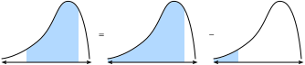
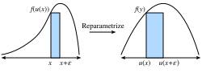
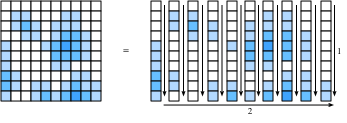

# Calcul intégral
:label:`sec_integral_calculus` 

La différentiation ne constitue que la moitié du contenu d'un enseignement traditionnel du calcul.  L'autre pilier, l'intégration, semble au départ une question plutôt disjointe : "Quelle est l'aire sous cette courbe ?"  Bien qu'apparemment sans rapport, l'intégration est étroitement liée à la différenciation via ce que l'on appelle le *théorème fondamental du calcul*.

Au niveau de l'apprentissage automatique que nous abordons dans ce livre, nous n'aurons pas besoin d'une compréhension approfondie de l'intégration. Cependant, nous allons fournir une brève introduction afin de préparer le terrain pour toutes les autres applications que nous rencontrerons plus tard.

## Interprétation géométrique
Supposons que nous ayons une fonction $f(x)$.  Pour simplifier, supposons que $f(x)$ est non négative (elle ne prend jamais une valeur inférieure à zéro).  Ce que nous voulons essayer de comprendre est le suivant : quelle est l'aire contenue entre $f(x)$ et l'axe $x$?

```{.python .input}
#@tab mxnet
%matplotlib inline
from d2l import mxnet as d2l
from IPython import display
from mpl_toolkits import mplot3d
from mxnet import np, npx
npx.set_np()

x = np.arange(-2, 2, 0.01)
f = np.exp(-x**2)

d2l.set_figsize()
d2l.plt.plot(x, f, color='black')
d2l.plt.fill_between(x.tolist(), f.tolist())
d2l.plt.show()
```

```{.python .input}
#@tab pytorch
%matplotlib inline
from d2l import torch as d2l
from IPython import display
from mpl_toolkits import mplot3d
import torch

x = torch.arange(-2, 2, 0.01)
f = torch.exp(-x**2)

d2l.set_figsize()
d2l.plt.plot(x, f, color='black')
d2l.plt.fill_between(x.tolist(), f.tolist())
d2l.plt.show()
```

```{.python .input}
#@tab tensorflow
%matplotlib inline
from d2l import tensorflow as d2l
from IPython import display
from mpl_toolkits import mplot3d
import tensorflow as tf

x = tf.range(-2, 2, 0.01)
f = tf.exp(-x**2)

d2l.set_figsize()
d2l.plt.plot(x, f, color='black')
d2l.plt.fill_between(x.numpy(), f.numpy())
d2l.plt.show()
```

Dans la plupart des cas, cette aire sera infinie ou indéfinie (considérez l'aire sous $f(x) = x^{2}$), c'est pourquoi les gens parlent souvent de l'aire entre une paire d'extrémités, disons $a$ et $b$.

```{.python .input}
#@tab mxnet
x = np.arange(-2, 2, 0.01)
f = np.exp(-x**2)

d2l.set_figsize()
d2l.plt.plot(x, f, color='black')
d2l.plt.fill_between(x.tolist()[50:250], f.tolist()[50:250])
d2l.plt.show()
```

```{.python .input}
#@tab pytorch
x = torch.arange(-2, 2, 0.01)
f = torch.exp(-x**2)

d2l.set_figsize()
d2l.plt.plot(x, f, color='black')
d2l.plt.fill_between(x.tolist()[50:250], f.tolist()[50:250])
d2l.plt.show()
```

```{.python .input}
#@tab tensorflow
x = tf.range(-2, 2, 0.01)
f = tf.exp(-x**2)

d2l.set_figsize()
d2l.plt.plot(x, f, color='black')
d2l.plt.fill_between(x.numpy()[50:250], f.numpy()[50:250])
d2l.plt.show()
```

Nous désignerons cette zone par le symbole intégral ci-dessous :

$$
\mathrm{Area}(\mathcal{A}) = \int_a^b f(x) \;dx.
$$

La variable interne est une variable fictive, un peu comme l'indice d'une somme dans un $\sum$, et peut donc être écrite de manière équivalente avec la valeur interne de votre choix :

$$
\int_a^b f(x) \;dx = \int_a^b f(z) \;dz.
$$

Il existe une façon traditionnelle d'essayer de comprendre comment nous pourrions essayer d'approximer de telles intégrales : nous pouvons imaginer prendre la région située entre $a$ et $b$ et la découper en tranches verticales $N$.  Si $N$ est grand, nous pouvons approximer la surface de chaque tranche par un rectangle, puis additionner les surfaces pour obtenir la surface totale sous la courbe.  Voyons un exemple de cette méthode en code.  Nous verrons comment obtenir la valeur réelle dans une section ultérieure.

```{.python .input}
#@tab mxnet
epsilon = 0.05
a = 0
b = 2

x = np.arange(a, b, epsilon)
f = x / (1 + x**2)

approx = np.sum(epsilon*f)
true = np.log(2) / 2

d2l.set_figsize()
d2l.plt.bar(x.asnumpy(), f.asnumpy(), width=epsilon, align='edge')
d2l.plt.plot(x, f, color='black')
d2l.plt.ylim([0, 1])
d2l.plt.show()

f'approximation: {approx}, truth: {true}'
```

```{.python .input}
#@tab pytorch
epsilon = 0.05
a = 0
b = 2

x = torch.arange(a, b, epsilon)
f = x / (1 + x**2)

approx = torch.sum(epsilon*f)
true = torch.log(torch.tensor([5.])) / 2

d2l.set_figsize()
d2l.plt.bar(x, f, width=epsilon, align='edge')
d2l.plt.plot(x, f, color='black')
d2l.plt.ylim([0, 1])
d2l.plt.show()

f'approximation: {approx}, truth: {true}'
```

```{.python .input}
#@tab tensorflow
epsilon = 0.05
a = 0
b = 2

x = tf.range(a, b, epsilon)
f = x / (1 + x**2)

approx = tf.reduce_sum(epsilon*f)
true = tf.math.log(tf.constant([5.])) / 2

d2l.set_figsize()
d2l.plt.bar(x, f, width=epsilon, align='edge')
d2l.plt.plot(x, f, color='black')
d2l.plt.ylim([0, 1])
d2l.plt.show()

f'approximation: {approx}, truth: {true}'
```

Le problème est que, bien qu'il soit possible de le faire numériquement, nous ne pouvons adopter cette approche analytique que pour les fonctions les plus simples, telles que

$$
\int_a^b x \;dx.
$$

Tout ce qui est un peu plus complexe comme notre exemple du code ci-dessus

$$
\int_a^b \frac{x}{1+x^{2}} \;dx.
$$

est au-delà de ce que nous pouvons résoudre avec une telle méthode directe.

Nous allons plutôt adopter une approche différente.  Nous allons travailler intuitivement avec la notion d'aire, et apprendre le principal outil de calcul utilisé pour trouver les intégrales : le *théorème fondamental du calcul*.   Ce sera la base de notre étude de l'intégration.

## Le théorème fondamental du calcul

Pour plonger plus profondément dans la théorie de l'intégration, introduisons une fonction

$$
F(x) = \int_0^x f(y) dy.
$$

Cette fonction mesure l'aire entre $0$ et $x$ en fonction de la façon dont nous modifions $x$.  Remarquez que c'est tout ce dont nous avons besoin puisque

$$
\int_a^b f(x) \;dx = F(b) - F(a).
$$

Il s'agit d'un encodage mathématique du fait que nous pouvons mesurer l'aire jusqu'au point d'extrémité éloigné, puis soustraire l'aire jusqu'au point d'extrémité proche, comme indiqué sur :numref:`fig_area-subtract`.


:label:`fig_area-subtract`

Ainsi, nous pouvons déterminer ce qu'est l'intégrale sur un intervalle quelconque en déterminant ce qu'est $F(x)$.

Pour ce faire, considérons une expérience.  Comme nous le faisons souvent en calcul, imaginons ce qui se passe lorsque nous déplaçons la valeur d'un tout petit peu.  D'après le commentaire ci-dessus, nous savons que

$$
F(x+\epsilon) - F(x) = \int_x^{x+\epsilon} f(y) \; dy.
$$

Cela nous indique que la fonction change par l'aire sous un minuscule éclat de la fonction.

C'est à ce moment-là que nous faisons une approximation.  Si nous regardons une minuscule tranche d'aire comme celle-ci, il semble que cette aire soit proche de l'aire rectangulaire ayant pour hauteur la valeur de $f(x)$ et pour largeur de base $\epsilon$.  En effet, on peut montrer que comme $\epsilon \rightarrow 0$ cette approximation devient de mieux en mieux.  On peut donc conclure :

$$
F(x+\epsilon) - F(x) \approx \epsilon f(x).
$$

Cependant, nous pouvons maintenant remarquer : c'est exactement le schéma que nous attendons si nous calculions la dérivée de $F$!  Nous constatons donc le fait plutôt surprenant suivant :

$$
\frac{dF}{dx}(x) = f(x).
$$

C'est le *théorème fondamental du calcul*.  Nous pouvons l'écrire sous forme développée comme suit :
$$\frac{d}{dx}\int_0^x  f(y) \; dy = f(x).$$ 
:eqlabel:`eq_ftc` 

Il prend le concept de recherche d'aires (*a priori* plutôt difficile), et le réduit à un énoncé de dérivées (quelque chose de beaucoup plus complètement compris).  Un dernier commentaire que nous devons faire est que cela ne nous dit pas exactement ce qu'est $F(x)$.  En effet, $F(x) + C$ pour tout $C$ a la même dérivée.  C'est un fait de la vie dans la théorie de l'intégration.  Heureusement, remarquez que lorsque vous travaillez avec des intégrales définies, les constantes disparaissent et ne sont donc pas pertinentes pour le résultat.

$$
\int_a^b f(x) \; dx = (F(b) + C) - (F(a) + C) = F(b) - F(a).
$$

Cela peut sembler être un non-sens abstrait, mais prenons un moment pour apprécier le fait que cela nous a donné une toute nouvelle perspective sur le calcul des intégrales.  Notre objectif n'est plus d'effectuer une sorte de processus de découpage et d'addition pour essayer de récupérer l'aire, mais de trouver une fonction dont la dérivée est la fonction que nous avons !  C'est incroyable car nous pouvons maintenant énumérer de nombreuses intégrales assez difficiles en inversant simplement le tableau de :numref:`sec_derivative_table`.  Par exemple, nous savons que la dérivée de $x^{n}$ est $nx^{n-1}$.  Ainsi, nous pouvons dire en utilisant le théorème fondamental :eqref:`eq_ftc` que

$$
\int_0^{x} ny^{n-1} \; dy = x^n - 0^n = x^n.
$$

De même, nous savons que la dérivée de $e^{x}$ est elle-même, ce qui signifie que

$$
\int_0^{x} e^{x} \; dx = e^{x} - e^{0} = e^x - 1.
$$

De cette façon, nous pouvons développer toute la théorie de l'intégration en exploitant librement les idées du calcul différentiel.  Chaque règle d'intégration dérive de ce seul fait.

## Changement de variables
:label:`subsec_integral_example` 

Tout comme pour la différentiation, il existe un certain nombre de règles qui rendent le calcul des intégrales plus facile.  En fait, chaque règle du calcul différentiel (comme la règle du produit, la règle de la somme et la règle de la chaîne) a une règle correspondante pour le calcul intégral (intégration par parties, linéarité de l'intégration et formule de changement de variables, respectivement).  Dans cette section, nous allons nous plonger dans ce qui est sans doute le plus important de la liste : la formule de changement de variables.

Tout d'abord, supposons que nous ayons une fonction qui est elle-même une intégrale :

$$
F(x) = \int_0^x f(y) \; dy.
$$

Supposons que nous voulions savoir à quoi ressemble cette fonction lorsque nous la composons avec une autre pour obtenir $F(u(x))$.  Par la règle de la chaîne, nous savons

$$
\frac{d}{dx}F(u(x)) = \frac{dF}{du}(u(x))\cdot \frac{du}{dx}.
$$

Nous pouvons transformer cela en une déclaration sur l'intégration en utilisant le théorème fondamental :eqref:`eq_ftc` comme ci-dessus.  Cela donne

$$
F(u(x)) - F(u(0)) = \int_0^x \frac{dF}{du}(u(y))\cdot \frac{du}{dy} \;dy.
$$

Si l'on rappelle que $F$ est lui-même une intégrale, le côté gauche peut être réécrit comme suit

$$
\int_{u(0)}^{u(x)} f(y) \; dy = \int_0^x \frac{dF}{du}(u(y))\cdot \frac{du}{dy} \;dy.
$$

De même, le fait de rappeler que $F$ est une intégrale nous permet de reconnaître que $\frac{dF}{dx} = f$ en utilisant le théorème fondamental :eqref:`eq_ftc`, et nous pouvons donc conclure

$$\int_{u(0)}^{u(x)} f(y) \; dy = \int_0^x f(u(y))\cdot \frac{du}{dy} \;dy.$$ 
:eqlabel:`eq_change_var` 

Ceci est la formule de *changement de variables*.

Pour une dérivation plus intuitive, considérez ce qui se passe lorsque nous prenons une intégrale de $f(u(x))$ entre $x$ et $x+\epsilon$. Pour un petit $\epsilon$, cette intégrale est approximativement $\epsilon f(u(x))$, l'aire du rectangle associé.  Maintenant, comparons cela avec l'intégrale de $f(y)$ entre $u(x)$ et $u(x+\epsilon)$. Nous savons que $u(x+\epsilon) \approx u(x) + \epsilon \frac{du}{dx}(x)$, donc l'aire de ce rectangle est approximativement $\epsilon \frac{du}{dx}(x)f(u(x))$.  Ainsi, pour que les aires de ces deux rectangles concordent, nous devons multiplier la première par $\frac{du}{dx}(x)$ comme illustré dans :numref:`fig_rect-transform`.


:label:`fig_rect-transform`

Cela nous indique que

$$
\int_x^{x+\epsilon} f(u(y))\frac{du}{dy}(y)\;dy = \int_{u(x)}^{u(x+\epsilon)} f(y) \; dy.
$$

Il s'agit de la formule de changement de variables exprimée pour un seul petit rectangle.

Si $u(x)$ et $f(x)$ sont correctement choisis, cela peut permettre le calcul d'intégrales incroyablement complexes.  Par exemple, si nous choisissons bien $f(y) = 1$ et $u(x) = e^{-x^{2}}$ (ce qui signifie $\frac{du}{dx}(x) = -2xe^{-x^{2}}$), cela peut montrer par exemple que

$$
e^{-1} - 1 = \int_{e^{-0}}^{e^{-1}} 1 \; dy = -2\int_0^{1} ye^{-y^2}\;dy,
$$

et donc en réarrangeant que

$$
\int_0^{1} ye^{-y^2}\; dy = \frac{1-e^{-1}}{2}.
$$

## A Comment on Sign Conventions

Les lecteurs attentifs remarqueront quelque chose d'étrange dans les calculs ci-dessus.  En effet, des calculs comme

$$
\int_{e^{-0}}^{e^{-1}} 1 \; dy = e^{-1} -1 < 0,
$$

peuvent produire des nombres négatifs.  Lorsque l'on pense aux aires, il peut être étrange de voir une valeur négative, et cela vaut donc la peine de creuser la question de la convention.

Les mathématiciens adoptent la notion d'aires signées.  Cela se manifeste de deux manières.  Premièrement, si nous considérons une fonction $f(x)$ qui est parfois inférieure à zéro, alors l'aire sera également négative.  Ainsi par exemple

$$
\int_0^{1} (-1)\;dx = -1.
$$

De même, les intégrales qui progressent de droite à gauche, plutôt que de gauche à droite, sont également considérées comme des aires négatives

$$
\int_0^{-1} 1\; dx = -1.
$$

L'aire standard (de gauche à droite d'une fonction positive) est toujours positive.  Tout ce qui est obtenu en la retournant (par exemple en retournant l'axe $x$ pour obtenir l'intégrale d'un nombre négatif, ou en retournant l'axe $y$ pour obtenir une intégrale dans le mauvais ordre) produira une aire négative.  Et en effet, si l'on retourne deux fois l'axe, on obtient une paire de signes négatifs qui s'annulent pour donner une aire positive

$$
\int_0^{-1} (-1)\;dx =  1.
$$

Si cette discussion vous semble familière, c'est le cas !  Dans :numref:`sec_geometry-linear-algebraic-ops`, nous avons vu comment le déterminant représentait l'aire signée de la même manière.

## Intégrales multiples
Dans certains cas, nous devrons travailler dans des dimensions supérieures.  Par exemple, supposons que nous ayons une fonction de deux variables, comme $f(x, y)$ et que nous voulions connaître le volume sous $f$ lorsque $x$ s'étend sur $[a, b]$ et $y$ sur $[c, d]$.

```{.python .input}
#@tab mxnet
# Construct grid and compute function
x, y = np.meshgrid(np.linspace(-2, 2, 101), np.linspace(-2, 2, 101),
                   indexing='ij')
z = np.exp(- x**2 - y**2)

# Plot function
ax = d2l.plt.figure().add_subplot(111, projection='3d')
ax.plot_wireframe(x.asnumpy(), y.asnumpy(), z.asnumpy())
d2l.plt.xlabel('x')
d2l.plt.ylabel('y')
d2l.plt.xticks([-2, -1, 0, 1, 2])
d2l.plt.yticks([-2, -1, 0, 1, 2])
d2l.set_figsize()
ax.set_xlim(-2, 2)
ax.set_ylim(-2, 2)
ax.set_zlim(0, 1)
ax.dist = 12
```

```{.python .input}
#@tab pytorch
# Construct grid and compute function
x, y = torch.meshgrid(torch.linspace(-2, 2, 101), torch.linspace(-2, 2, 101))
z = torch.exp(- x**2 - y**2)

# Plot function
ax = d2l.plt.figure().add_subplot(111, projection='3d')
ax.plot_wireframe(x, y, z)
d2l.plt.xlabel('x')
d2l.plt.ylabel('y')
d2l.plt.xticks([-2, -1, 0, 1, 2])
d2l.plt.yticks([-2, -1, 0, 1, 2])
d2l.set_figsize()
ax.set_xlim(-2, 2)
ax.set_ylim(-2, 2)
ax.set_zlim(0, 1)
ax.dist = 12
```

```{.python .input}
#@tab tensorflow
# Construct grid and compute function
x, y = tf.meshgrid(tf.linspace(-2., 2., 101), tf.linspace(-2., 2., 101))
z = tf.exp(- x**2 - y**2)

# Plot function
ax = d2l.plt.figure().add_subplot(111, projection='3d')
ax.plot_wireframe(x, y, z)
d2l.plt.xlabel('x')
d2l.plt.ylabel('y')
d2l.plt.xticks([-2, -1, 0, 1, 2])
d2l.plt.yticks([-2, -1, 0, 1, 2])
d2l.set_figsize()
ax.set_xlim(-2, 2)
ax.set_ylim(-2, 2)
ax.set_zlim(0, 1)
ax.dist = 12
```

Nous l'écrivons comme suit

$$
\int_{[a, b]\times[c, d]} f(x, y)\;dx\;dy.
$$

Supposons que nous souhaitions calculer cette intégrale.  Je prétends que nous pouvons le faire en calculant de manière itérative d'abord l'intégrale dans $x$ puis en passant à l'intégrale dans $y$, c'est à dire

$$
\int_{[a, b]\times[c, d]} f(x, y)\;dx\;dy = \int_c^{d} \left(\int_a^{b} f(x, y) \;dx\right) \; dy.
$$

Voyons pourquoi.

Considérons la figure ci-dessus où nous avons divisé la fonction en $\epsilon \times \epsilon$ carrés que nous indexerons avec des coordonnées entières $i, j$.  Dans ce cas, notre intégrale est approximativement

$$
\sum_{i, j} \epsilon^{2} f(\epsilon i, \epsilon j).
$$

Une fois que nous avons discrétisé le problème, nous pouvons additionner les valeurs sur ces carrés dans l'ordre que nous voulons, sans nous soucier de changer les valeurs.  Ceci est illustré sur :numref:`fig_sum-order`. En particulier, nous pouvons dire que

$$
 \sum _ {j} \epsilon \left(\sum_{i} \epsilon f(\epsilon i, \epsilon j)\right).
$$


:label:`fig_sum-order` 

La somme à l'intérieur est précisément la discrétisation de l'intégrale

$$
G(\epsilon j) = \int _a^{b} f(x, \epsilon j) \; dx.
$$

Enfin, remarquez que si nous combinons ces deux expressions, nous obtenons

$$
\sum _ {j} \epsilon G(\epsilon j) \approx \int _ {c}^{d} G(y) \; dy = \int _ {[a, b]\times[c, d]} f(x, y)\;dx\;dy.
$$

Ainsi, en mettant tout cela ensemble, nous avons que

$$
\int _ {[a, b]\times[c, d]} f(x, y)\;dx\;dy = \int _ c^{d} \left(\int _ a^{b} f(x, y) \;dx\right) \; dy.
$$

Remarquez qu'une fois discrétisée, tout ce que nous avons fait est de réorganiser l'ordre dans lequel nous avons ajouté une liste de nombres.  Cela peut donner l'impression que ce n'est rien, mais ce résultat (appelé *Théorème de Fubini*) n'est pas toujours vrai !  Pour le type de mathématiques que l'on rencontre lors de l'apprentissage automatique (fonctions continues), il n'y a pas de souci, cependant il est possible de créer des exemples où cela échoue (par exemple la fonction $f(x, y) = xy(x^2-y^2)/(x^2+y^2)^3$ sur le rectangle $[0,2]\times[0,1]$).

Notez que le choix de faire d'abord l'intégrale de $x$, puis l'intégrale de $y$ était arbitraire.  Nous aurions tout aussi bien pu choisir de faire d'abord $y$ et ensuite $x$ pour voir

$$
\int _ {[a, b]\times[c, d]} f(x, y)\;dx\;dy = \int _ a^{b} \left(\int _ c^{d} f(x, y) \;dy\right) \; dx.
$$

Souvent, nous condenserons en notation vectorielle, et dirons que pour $U = [a, b]\times [c, d]$, ceci est

$$
\int _ U f(\mathbf{x})\;d\mathbf{x}.
$$

## Changement de variables dans les intégrales multiples
Comme pour les variables simples dans :eqref:`eq_change_var`, la possibilité de changer de variables dans une intégrale de dimension supérieure est un outil essentiel.  Résumons le résultat sans dérivation.

Nous avons besoin d'une fonction qui reparamétrise notre domaine d'intégration.  Nous pouvons considérer qu'il s'agit de $\phi : \mathbb{R}^n \rightarrow \mathbb{R}^n$, c'est-à-dire toute fonction qui prend en compte $n$ variables réelles et renvoie une autre $n$.  Pour garder les expressions propres, nous supposerons que $\phi$ est *injective*, c'est-à-dire qu'elle ne se replie jamais sur elle-même ($\phi(\mathbf{x}) = \phi(\mathbf{y}) \implies \mathbf{x} = \mathbf{y}$).

Dans ce cas, nous pouvons dire que

$$
\int _ {\phi(U)} f(\mathbf{x})\;d\mathbf{x} = \int _ {U} f(\phi(\mathbf{x})) \left|\det(D\phi(\mathbf{x}))\right|\;d\mathbf{x}.
$$

où $D\phi$ est le *Jacobien* de $\phi$, qui est la matrice des dérivées partielles de $\boldsymbol{\phi} = (\phi_1(x_1, \ldots, x_n), \ldots, \phi_n(x_1, \ldots, x_n))$,

$$
D\boldsymbol{\phi} = \begin{bmatrix}
\frac{\partial \phi _ 1}{\partial x _ 1} & \cdots & \frac{\partial \phi _ 1}{\partial x _ n} \\
\vdots & \ddots & \vdots \\
\frac{\partial \phi _ n}{\partial x _ 1} & \cdots & \frac{\partial \phi _ n}{\partial x _ n}
\end{bmatrix}.
$$

En regardant de plus près, nous voyons que cette règle est similaire à la règle de la chaîne à une variable :eqref:`eq_change_var`, sauf que nous avons remplacé le terme $\frac{du}{dx}(x)$ par $\left|\det(D\phi(\mathbf{x}))\right|$.  Voyons comment nous pouvons interpréter ce terme.  Rappelez-vous que le terme $\frac{du}{dx}(x)$ existait pour indiquer de combien nous avons étiré notre axe $x$ en appliquant $u$.  Le même processus dans les dimensions supérieures consiste à déterminer de combien nous étirons la surface (ou le volume, ou l'hyper-volume) d'un petit carré (ou d'un petit *hyper-cube*) en appliquant $\boldsymbol{\phi}$.  Si $\boldsymbol{\phi}$ était la multiplication par une matrice, alors nous savons comment le déterminant donne déjà la réponse.

Avec un peu de travail, on peut montrer que le *Jacobien* fournit la meilleure approximation d'une fonction multivariable $\boldsymbol{\phi}$ en un point par une matrice de la même manière que nous pourrions l'approximer par des lignes ou des plans avec des dérivées et des gradients. Ainsi, le déterminant du jacobien reflète exactement le facteur d'échelle que nous avons identifié dans une dimension.

Il faut un peu de travail pour entrer dans les détails, alors ne vous inquiétez pas s'ils ne sont pas clairs maintenant.  Voyons au moins un exemple que nous utiliserons par la suite.  Considérons l'intégrale

$$
\int _ {-\infty}^{\infty} \int _ {-\infty}^{\infty} e^{-x^{2}-y^{2}} \;dx\;dy.
$$

Jouer directement avec cette intégrale ne nous mènera nulle part, mais si nous changeons de variable, nous pouvons faire des progrès significatifs.  Si nous laissons $\boldsymbol{\phi}(r, \theta) = (r \cos(\theta),  r\sin(\theta))$ (c'est-à-dire $x = r \cos(\theta)$, $y = r \sin(\theta)$), nous pouvons appliquer la formule de changement de variable pour voir que c'est la même chose que

$$
\int _ 0^\infty \int_0 ^ {2\pi} e^{-r^{2}} \left|\det(D\mathbf{\phi}(\mathbf{x}))\right|\;d\theta\;dr,
$$

où

$$
\left|\det(D\mathbf{\phi}(\mathbf{x}))\right| = \left|\det\begin{bmatrix}
\cos(\theta) & -r\sin(\theta) \\
\sin(\theta) & r\cos(\theta)
\end{bmatrix}\right| = r(\cos^{2}(\theta) + \sin^{2}(\theta)) = r.
$$

Ainsi, l'intégrale est

$$
\int _ 0^\infty \int _ 0 ^ {2\pi} re^{-r^{2}} \;d\theta\;dr = 2\pi\int _ 0^\infty re^{-r^{2}} \;dr = \pi,
$$

où l'égalité finale est obtenue par le même calcul que celui utilisé dans la section :numref:`subsec_integral_example`.

Nous rencontrerons à nouveau cette intégrale lorsque nous étudierons les variables aléatoires continues dans :numref:`sec_random_variables`.

## Résumé

* La théorie de l'intégration nous permet de répondre à des questions sur les aires ou les volumes.
* Le théorème fondamental du calcul nous permet de tirer parti de nos connaissances sur les dérivées pour calculer les aires en observant que la dérivée de l'aire jusqu'à un certain point est donnée par la valeur de la fonction intégrée.
* Les intégrales en dimensions supérieures peuvent être calculées en itérant des intégrales à une variable.

## Exercices
1. Qu'est-ce que $\int_1^2 \frac{1}{x} \;dx$?
2. Utilisez la formule de changement de variables pour intégrer $\int_0^{\sqrt{\pi}}x\sin(x^2)\;dx$.
3. Qu'est-ce que $\int_{[0,1]^2} xy \;dx\;dy$?
4. Utilisez la formule de changement de variables pour calculer $\int_0^2\int_0^1xy(x^2-y^2)/(x^2+y^2)^3\;dy\;dx$ et $\int_0^1\int_0^2f(x, y) = xy(x^2-y^2)/(x^2+y^2)^3\;dx\;dy$ pour voir qu'ils sont différents.

:begin_tab:`mxnet`
[Discussions](https://discuss.d2l.ai/t/414)
:end_tab:

:begin_tab:`pytorch`
[Discussions](https://discuss.d2l.ai/t/1092)
:end_tab:


:begin_tab:`tensorflow`
[Discussions](https://discuss.d2l.ai/t/1093)
:end_tab:
