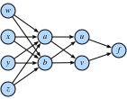
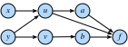

## Calcul multivariable
:label:`sec_multivariable_calculus` 

Maintenant que nous avons une compréhension assez forte des dérivées d'une fonction d'une seule variable, revenons à notre question initiale où nous considérions une fonction de perte de potentiellement des milliards de poids.

## Différenciation en dimension supérieure
Ce que :numref:`sec_single_variable_calculus` nous dit, c'est que si nous changeons un seul de ces milliards de poids en laissant tous les autres fixes, nous savons ce qui va se passer !  Ce n'est rien de plus qu'une fonction d'une seule variable, nous pouvons donc écrire

$$L(w_1+\epsilon_1, w_2, \ldots, w_N) \approx L(w_1, w_2, \ldots, w_N) + \epsilon_1 \frac{d}{dw_1} L(w_1, w_2, \ldots, w_N).$$ 
:eqlabel:`eq_part_der` 

Nous appellerons la dérivée dans une variable tout en fixant les autres variables la *dérivée partielle*, et nous utiliserons la notation $\frac{\partial}{\partial w_1}$ pour la dérivée dans :eqref:`eq_part_der`.

Maintenant, prenons ceci et changeons un peu $w_2$ en $w_2 + \epsilon_2$:

$$
\begin{aligned}
L(w_1+\epsilon_1, w_2+\epsilon_2, \ldots, w_N) & \approx L(w_1, w_2+\epsilon_2, \ldots, w_N) + \epsilon_1 \frac{\partial}{\partial w_1} L(w_1, w_2+\epsilon_2, \ldots, w_N+\epsilon_N) \\
& \approx L(w_1, w_2, \ldots, w_N) \\
& \quad + \epsilon_2\frac{\partial}{\partial w_2} L(w_1, w_2, \ldots, w_N) \\
& \quad + \epsilon_1 \frac{\partial}{\partial w_1} L(w_1, w_2, \ldots, w_N) \\
& \quad + \epsilon_1\epsilon_2\frac{\partial}{\partial w_2}\frac{\partial}{\partial w_1} L(w_1, w_2, \ldots, w_N) \\
& \approx L(w_1, w_2, \ldots, w_N) \\
& \quad + \epsilon_2\frac{\partial}{\partial w_2} L(w_1, w_2, \ldots, w_N) \\
& \quad + \epsilon_1 \frac{\partial}{\partial w_1} L(w_1, w_2, \ldots, w_N).
\end{aligned}
$$

Nous avons à nouveau utilisé l'idée que $\epsilon_1\epsilon_2$ est un terme d'ordre supérieur que nous pouvons écarter de la même manière que nous avons pu écarter $\epsilon^{2}$ dans la section précédente, avec ce que nous avons vu dans :eqref:`eq_part_der`. En continuant de cette manière, nous pouvons écrire que

$$
L(w_1+\epsilon_1, w_2+\epsilon_2, \ldots, w_N+\epsilon_N) \approx L(w_1, w_2, \ldots, w_N) + \sum_i \epsilon_i \frac{\partial}{\partial w_i} L(w_1, w_2, \ldots, w_N).
$$

Cela peut sembler confus, mais nous pouvons rendre cela plus familier en notant que la somme à droite ressemble exactement à un produit scalaire, donc si nous laissons

$$
\boldsymbol{\epsilon} = [\epsilon_1, \ldots, \epsilon_N]^\top \; \text{and} \;
\nabla_{\mathbf{x}} L = \left[\frac{\partial L}{\partial x_1}, \ldots, \frac{\partial L}{\partial x_N}\right]^\top,
$$

alors

$$L(\mathbf{w} + \boldsymbol{\epsilon}) \approx L(\mathbf{w}) + \boldsymbol{\epsilon}\cdot \nabla_{\mathbf{w}} L(\mathbf{w}).$$ 
:eqlabel:`eq_nabla_use` 

Nous appellerons le vecteur $\nabla_{\mathbf{w}} L$ le *gradient* de $L$.

L'équation :eqref:`eq_nabla_use` mérite que l'on s'y attarde un instant.  Elle a exactement le même format que celui que nous avons rencontré en une dimension, à ceci près que nous avons tout converti en vecteurs et produits scalaires.  Elle nous permet de dire approximativement comment la fonction $L$ changera en cas de perturbation de l'entrée.  Comme nous le verrons dans la section suivante, cela nous fournira un outil important pour comprendre géométriquement comment nous pouvons apprendre en utilisant les informations contenues dans le gradient.

Mais d'abord, voyons cette approximation à l'œuvre à l'aide d'un exemple.  Supposons que nous travaillions avec la fonction

$$
f(x, y) = \log(e^x + e^y) \text{ with gradient } \nabla f (x, y) = \left[\frac{e^x}{e^x+e^y}, \frac{e^y}{e^x+e^y}\right].
$$

Si nous regardons un point comme $(0, \log(2))$, nous voyons que

$$
f(x, y) = \log(3) \text{ with gradient } \nabla f (x, y) = \left[\frac{1}{3}, \frac{2}{3}\right].
$$

Ainsi, si nous voulons approximer $f$ à $(\epsilon_1, \log(2) + \epsilon_2)$, nous voyons que nous devons avoir l'instance spécifique de :eqref:`eq_nabla_use` :

$$
f(\epsilon_1, \log(2) + \epsilon_2) \approx \log(3) + \frac{1}{3}\epsilon_1 + \frac{2}{3}\epsilon_2.
$$

Nous pouvons tester cela dans le code pour voir si l'approximation est bonne.

```{.python .input}
#@tab mxnet
%matplotlib inline
from d2l import mxnet as d2l
from IPython import display
from mpl_toolkits import mplot3d
from mxnet import autograd, np, npx
npx.set_np()

def f(x, y):
    return np.log(np.exp(x) + np.exp(y))
def grad_f(x, y):
    return np.array([np.exp(x) / (np.exp(x) + np.exp(y)),
                     np.exp(y) / (np.exp(x) + np.exp(y))])

epsilon = np.array([0.01, -0.03])
grad_approx = f(0, np.log(2)) + epsilon.dot(grad_f(0, np.log(2)))
true_value = f(0 + epsilon[0], np.log(2) + epsilon[1])
f'approximation: {grad_approx}, true Value: {true_value}'
```

```{.python .input}
#@tab pytorch
%matplotlib inline
from d2l import torch as d2l
from IPython import display
from mpl_toolkits import mplot3d
import torch
import numpy as np

def f(x, y):
    return torch.log(torch.exp(x) + torch.exp(y))
def grad_f(x, y):
    return torch.tensor([torch.exp(x) / (torch.exp(x) + torch.exp(y)),
                     torch.exp(y) / (torch.exp(x) + torch.exp(y))])

epsilon = torch.tensor([0.01, -0.03])
grad_approx = f(torch.tensor([0.]), torch.log(
    torch.tensor([2.]))) + epsilon.dot(
    grad_f(torch.tensor([0.]), torch.log(torch.tensor(2.))))
true_value = f(torch.tensor([0.]) + epsilon[0], torch.log(
    torch.tensor([2.])) + epsilon[1])
f'approximation: {grad_approx}, true Value: {true_value}'
```

```{.python .input}
#@tab tensorflow
%matplotlib inline
from d2l import tensorflow as d2l
from IPython import display
from mpl_toolkits import mplot3d
import tensorflow as tf
import numpy as np

def f(x, y):
    return tf.math.log(tf.exp(x) + tf.exp(y))
def grad_f(x, y):
    return tf.constant([(tf.exp(x) / (tf.exp(x) + tf.exp(y))).numpy(),
                        (tf.exp(y) / (tf.exp(x) + tf.exp(y))).numpy()])

epsilon = tf.constant([0.01, -0.03])
grad_approx = f(tf.constant([0.]), tf.math.log(
    tf.constant([2.]))) + tf.tensordot(
    epsilon, grad_f(tf.constant([0.]), tf.math.log(tf.constant(2.))), axes=1)
true_value = f(tf.constant([0.]) + epsilon[0], tf.math.log(
    tf.constant([2.])) + epsilon[1])
f'approximation: {grad_approx}, true Value: {true_value}'
```

## Géométrie des gradients et descente de gradient
Considérons à nouveau l'expression de :eqref:`eq_nabla_use` :

$$
L(\mathbf{w} + \boldsymbol{\epsilon}) \approx L(\mathbf{w}) + \boldsymbol{\epsilon}\cdot \nabla_{\mathbf{w}} L(\mathbf{w}).
$$

Supposons que je veuille l'utiliser pour aider à minimiser notre perte $L$.  Comprenons géométriquement l'algorithme de descente de gradient décrit pour la première fois dans :numref:`sec_autograd`. Voici ce que nous allons faire :

1. Commençons par un choix aléatoire des paramètres initiaux $\mathbf{w}$.
2. Trouvez la direction $\mathbf{v}$ qui fait que $L$ diminue le plus rapidement à $\mathbf{w}$.
3. Faites un petit pas dans cette direction : $\mathbf{w} \rightarrow \mathbf{w} + \epsilon\mathbf{v}$.
4. Répétez.

La seule chose que nous ne savons pas exactement comment faire est de calculer le vecteur $\mathbf{v}$ dans la deuxième étape.  Nous appellerons une telle direction la *direction de la descente la plus abrupte*.  En utilisant la compréhension géométrique des produits scalaires de :numref:`sec_geometry-linear-algebraic-ops`, nous voyons que nous pouvons réécrire :eqref:`eq_nabla_use` comme suit

$$
L(\mathbf{w} + \mathbf{v}) \approx L(\mathbf{w}) + \mathbf{v}\cdot \nabla_{\mathbf{w}} L(\mathbf{w}) = L(\mathbf{w}) + \|\nabla_{\mathbf{w}} L(\mathbf{w})\|\cos(\theta).
$$

Notez que, par commodité, nous avons considéré que notre direction avait une longueur de un et que nous avons utilisé $\theta$ pour l'angle entre $\mathbf{v}$ et $\nabla_{\mathbf{w}} L(\mathbf{w})$. Si nous voulons trouver la direction qui fait décroître $L$ le plus rapidement possible, nous voulons que cette expression soit aussi négative que possible.  La seule façon dont la direction que nous choisissons entre dans cette équation est par le biais de $\cos(\theta)$, et nous souhaitons donc rendre ce cosinus aussi négatif que possible.  Maintenant, en rappelant la forme du cosinus, nous pouvons le rendre aussi négatif que possible en faisant $\cos(\theta) = -1$ ou, de manière équivalente, en faisant en sorte que l'angle entre le gradient et la direction que nous avons choisie soit de $\pi$ radians, ou de $180$ degrés.  La seule façon d'y parvenir est de se diriger dans la direction exactement opposée : choisissez $\mathbf{v}$ pour pointer dans la direction exactement opposée à $\nabla_{\mathbf{w}} L(\mathbf{w})$!

Cela nous amène à l'un des concepts mathématiques les plus importants de l'apprentissage automatique : la direction de la descente la plus abrupte pointe dans la direction de $-\nabla_{\mathbf{w}}L(\mathbf{w})$. Ainsi, notre algorithme informel peut être réécrit comme suit.

1. Commencez par un choix aléatoire pour les paramètres initiaux $\mathbf{w}$.
2. Calculez $\nabla_{\mathbf{w}} L(\mathbf{w})$.
3. Faites un petit pas dans la direction opposée : $\mathbf{w} \rightarrow \mathbf{w} - \epsilon\nabla_{\mathbf{w}} L(\mathbf{w})$.
4. Répétez.


Cet algorithme de base a été modifié et adapté de nombreuses façons par de nombreux chercheurs, mais le concept de base reste le même dans tous les cas.  Utilisez le gradient pour trouver la direction qui réduit la perte le plus rapidement possible, et mettez à jour les paramètres pour faire un pas dans cette direction.

## Note sur l'optimisation mathématique
Tout au long de ce livre, nous nous concentrons sur les techniques d'optimisation numérique pour la raison pratique que toutes les fonctions que nous rencontrons dans le cadre de l'apprentissage profond sont trop complexes pour être minimisées explicitement.

Cependant, il est utile d'examiner ce que la compréhension géométrique que nous avons obtenue ci-dessus nous apprend sur l'optimisation directe des fonctions.

Supposons que nous souhaitons trouver la valeur de $\mathbf{x}_0$ qui minimise une certaine fonction $L(\mathbf{x})$.  Supposons en outre que quelqu'un nous donne une valeur et nous dise que c'est la valeur qui minimise $L$.  Y a-t-il quelque chose que nous puissions vérifier pour voir si leur réponse est même plausible ?

Considérons à nouveau :eqref:`eq_nabla_use` :
$$
L(\mathbf{x}_0 + \boldsymbol{\epsilon}) \approx L(\mathbf{x}_0) + \boldsymbol{\epsilon}\cdot \nabla_{\mathbf{x}} L(\mathbf{x}_0).
$$

Si le gradient n'est pas nul, nous savons que nous pouvons faire un pas dans la direction $-\epsilon \nabla_{\mathbf{x}} L(\mathbf{x}_0)$ pour trouver une valeur de $L$ qui est plus petite.  Ainsi, si nous sommes vraiment à un minimum, cela ne peut pas être le cas !  Nous pouvons conclure que si $\mathbf{x}_0$ est un minimum, alors $\nabla_{\mathbf{x}} L(\mathbf{x}_0) = 0$.  Nous appelons les points avec $\nabla_{\mathbf{x}} L(\mathbf{x}_0) = 0$ *points critiques*.

C'est une bonne chose, car dans certains cas rares, nous *pouvons* trouver explicitement tous les points où le gradient est nul, et trouver celui qui a la plus petite valeur.

Pour un exemple concret, considérons la fonction
$$
f(x) = 3x^4 - 4x^3 -12x^2.
$$

Cette fonction a une dérivée
$$
\frac{df}{dx} = 12x^3 - 12x^2 -24x = 12x(x-2)(x+1).
$$

Les seuls emplacements possibles des minima sont à $x = -1, 0, 2$, où la fonction prend les valeurs $-5,0, -32$ respectivement, et nous pouvons donc conclure que nous minimisons notre fonction lorsque $x = 2$.  Un rapide tracé le confirme.

```{.python .input}
#@tab mxnet
x = np.arange(-2, 3, 0.01)
f = (3 * x**4) - (4 * x**3) - (12 * x**2)

d2l.plot(x, f, 'x', 'f(x)')
```

```{.python .input}
#@tab pytorch
x = torch.arange(-2, 3, 0.01)
f = (3 * x**4) - (4 * x**3) - (12 * x**2)

d2l.plot(x, f, 'x', 'f(x)')
```

```{.python .input}
#@tab tensorflow
x = tf.range(-2, 3, 0.01)
f = (3 * x**4) - (4 * x**3) - (12 * x**2)

d2l.plot(x, f, 'x', 'f(x)')
```

Cela met en évidence un fait important à connaître lorsque l'on travaille de manière théorique ou numérique : les seuls points possibles où nous pouvons minimiser (ou maximiser) une fonction auront un gradient égal à zéro, cependant, tous les points ayant un gradient de zéro ne sont pas le véritable minimum (ou maximum) *global*.

## Règle de la chaîne multivariée
Supposons que nous ayons une fonction de quatre variables ($w, x, y$ et $z$) que nous pouvons obtenir en composant de nombreux termes :

$$\begin{aligned}f(u, v) & = (u+v)^{2} \\u(a, b) & = (a+b)^{2}, \qquad v(a, b) = (a-b)^{2}, \\a(w, x, y, z) & = (w+x+y+z)^{2}, \qquad b(w, x, y, z) = (w+x-y-z)^2.\end{aligned}$$ 
:eqlabel:`eq_multi_func_def` 

De telles chaînes d'équations sont courantes lorsque l'on travaille avec des réseaux neuronaux ; il est donc essentiel de comprendre comment calculer les gradients de telles fonctions.  Nous pouvons commencer à voir des indices visuels de cette connexion dans :numref:`fig_chain-1` si nous examinons les variables directement liées les unes aux autres.


:label:`fig_chain-1`

Rien ne nous empêche de tout composer à partir de :eqref:`eq_multi_func_def` et d'écrire que

$$
f(w, x, y, z) = \left(\left((w+x+y+z)^2+(w+x-y-z)^2\right)^2+\left((w+x+y+z)^2-(w+x-y-z)^2\right)^2\right)^2.
$$

Nous pouvons alors prendre la dérivée en utilisant simplement les dérivées à une seule variable, mais si nous faisions cela, nous nous retrouverions rapidement submergés de termes, dont beaucoup sont des répétitions !  En effet, on peut voir que, par exemple :

$$
\begin{aligned}
\frac{\partial f}{\partial w} & = 2 \left(2 \left(2 (w + x + y + z) - 2 (w + x - y - z)\right) \left((w + x + y + z)^{2}- (w + x - y - z)^{2}\right) + \right.\\
& \left. \quad 2 \left(2 (w + x - y - z) + 2 (w + x + y + z)\right) \left((w + x - y - z)^{2}+ (w + x + y + z)^{2}\right)\right) \times \\
& \quad \left(\left((w + x + y + z)^{2}- (w + x - y - z)^2\right)^{2}+ \left((w + x - y - z)^{2}+ (w + x + y + z)^{2}\right)^{2}\right).
\end{aligned}
$$

Si nous voulions ensuite également calculer $\frac{\partial f}{\partial x}$, nous nous retrouverions avec une équation similaire avec de nombreux termes répétés, et de nombreux termes répétés *partagés* entre les deux dérivées.  Cela représente une quantité énorme de travail perdu, et si nous avions besoin de calculer les dérivées de cette manière, toute la révolution de l'apprentissage profond aurait été bloquée avant d'avoir commencé !


Décomposons le problème.  Nous allons commencer par essayer de comprendre comment $f$ change lorsque nous modifions $a$, en supposant essentiellement que $w, x, y$ et $z$ n'existent pas.  Nous allons raisonner comme nous l'avons fait lorsque nous avons travaillé avec le gradient pour la première fois.  Prenons $a$ et ajoutons-y une petite quantité de $\epsilon$.

$$
\begin{aligned}
& f(u(a+\epsilon, b), v(a+\epsilon, b)) \\
\approx & f\left(u(a, b) + \epsilon\frac{\partial u}{\partial a}(a, b), v(a, b) + \epsilon\frac{\partial v}{\partial a}(a, b)\right) \\
\approx & f(u(a, b), v(a, b)) + \epsilon\left[\frac{\partial f}{\partial u}(u(a, b), v(a, b))\frac{\partial u}{\partial a}(a, b) + \frac{\partial f}{\partial v}(u(a, b), v(a, b))\frac{\partial v}{\partial a}(a, b)\right].
\end{aligned}
$$

La première ligne découle de la définition de la dérivée partielle, et la deuxième découle de la définition du gradient.  Il est fastidieux, d'un point de vue notationnel, de suivre exactement l'endroit où nous évaluons chaque dérivée, comme dans l'expression $\frac{\partial f}{\partial u}(u(a, b), v(a, b))$

$$
\frac{\partial f}{\partial a} = \frac{\partial f}{\partial u}\frac{\partial u}{\partial a}+\frac{\partial f}{\partial v}\frac{\partial v}{\partial a}.
$$

Il est utile de réfléchir à la signification de ce processus. Nous essayons de comprendre comment une fonction de la forme $f(u(a, b), v(a, b))$ change de valeur en fonction d'une modification de $a$.  Il y a deux chemins par lesquels cela peut se produire : il y a le chemin où $a \rightarrow u \rightarrow f$ et celui où $a \rightarrow v \rightarrow f$.  Nous pouvons calculer ces deux contributions via la règle de la chaîne : $\frac{\partial w}{\partial u} \cdot \frac{\partial u}{\partial x}$ et $\frac{\partial w}{\partial v} \cdot \frac{\partial v}{\partial x}$ respectivement, et les additionner.

Imaginons que nous ayons un autre réseau de fonctions où les fonctions de droite dépendent de celles qui sont connectées à celles de gauche, comme le montre :numref:`fig_chain-2`.


:label:`fig_chain-2`

Pour calculer quelque chose comme $\frac{\partial f}{\partial y}$, nous devons faire la somme de tous les chemins (dans ce cas, $3$) de $y$ à $f$, ce qui nous donne la règle de la chaîne

$$
\frac{\partial f}{\partial y} = \frac{\partial f}{\partial a} \frac{\partial a}{\partial u} \frac{\partial u}{\partial y} + \frac{\partial f}{\partial u} \frac{\partial u}{\partial y} + \frac{\partial f}{\partial b} \frac{\partial b}{\partial v} \frac{\partial v}{\partial y}.
$$

La compréhension de la règle de la chaîne de cette manière sera très utile pour comprendre comment les gradients circulent dans les réseaux et pourquoi divers choix architecturaux, comme ceux des LSTM (:numref:`sec_lstm` ) ou des couches résiduelles (:numref:`sec_resnet` ), peuvent contribuer à façonner le processus d'apprentissage en contrôlant le flux des gradients.

## L'algorithme de rétropropagation

Revenons à l'exemple de :eqref:`eq_multi_func_def` la section précédente où

$$
\begin{aligned}
f(u, v) & = (u+v)^{2} \\
u(a, b) & = (a+b)^{2}, \qquad v(a, b) = (a-b)^{2}, \\
a(w, x, y, z) & = (w+x+y+z)^{2}, \qquad b(w, x, y, z) = (w+x-y-z)^2.
\end{aligned}
$$

Si nous voulons calculer, par exemple, $\frac{\partial f}{\partial w}$, nous pouvons appliquer la règle de la chaîne multi-variable pour voir :

$$
\begin{aligned}
\frac{\partial f}{\partial w} & = \frac{\partial f}{\partial u}\frac{\partial u}{\partial w} + \frac{\partial f}{\partial v}\frac{\partial v}{\partial w}, \\
\frac{\partial u}{\partial w} & = \frac{\partial u}{\partial a}\frac{\partial a}{\partial w}+\frac{\partial u}{\partial b}\frac{\partial b}{\partial w}, \\
\frac{\partial v}{\partial w} & = \frac{\partial v}{\partial a}\frac{\partial a}{\partial w}+\frac{\partial v}{\partial b}\frac{\partial b}{\partial w}.
\end{aligned}
$$

Essayons d'utiliser cette décomposition pour calculer $\frac{\partial f}{\partial w}$.  Remarquez que tout ce dont nous avons besoin ici, ce sont les différents partiels à une étape :

$$
\begin{aligned}
\frac{\partial f}{\partial u} = 2(u+v), & \quad\frac{\partial f}{\partial v} = 2(u+v), \\
\frac{\partial u}{\partial a} = 2(a+b), & \quad\frac{\partial u}{\partial b} = 2(a+b), \\
\frac{\partial v}{\partial a} = 2(a-b), & \quad\frac{\partial v}{\partial b} = -2(a-b), \\
\frac{\partial a}{\partial w} = 2(w+x+y+z), & \quad\frac{\partial b}{\partial w} = 2(w+x-y-z).
\end{aligned}
$$

Si nous écrivons cela en code, cela devient une expression assez facile à gérer.

```{.python .input}
#@tab all
# Compute the value of the function from inputs to outputs
w, x, y, z = -1, 0, -2, 1
a, b = (w + x + y + z)**2, (w + x - y - z)**2
u, v = (a + b)**2, (a - b)**2
f = (u + v)**2
print(f'    f at {w}, {x}, {y}, {z} is {f}')

# Compute the single step partials
df_du, df_dv = 2*(u + v), 2*(u + v)
du_da, du_db, dv_da, dv_db = 2*(a + b), 2*(a + b), 2*(a - b), -2*(a - b)
da_dw, db_dw = 2*(w + x + y + z), 2*(w + x - y - z)

# Compute the final result from inputs to outputs
du_dw, dv_dw = du_da*da_dw + du_db*db_dw, dv_da*da_dw + dv_db*db_dw
df_dw = df_du*du_dw + df_dv*dv_dw
print(f'df/dw at {w}, {x}, {y}, {z} is {df_dw}')
```

Cependant, notez que cela ne facilite toujours pas le calcul de quelque chose comme $\frac{\partial f}{\partial x}$.  La raison en est la *façon* dont nous avons choisi d'appliquer la règle de la chaîne.  Si nous regardons ce que nous avons fait ci-dessus, nous avons toujours gardé $\partial w$ dans le dénominateur lorsque nous le pouvions.  De cette façon, nous avons choisi d'appliquer la règle de la chaîne en voyant comment $w$ changeait toutes les autres variables.  Si c'était ce que nous voulions, ce serait une bonne idée.  Cependant, repensez à notre motivation issue de l'apprentissage profond : nous voulons voir comment chaque paramètre modifie la *perte*.  En substance, nous voulons appliquer la règle de la chaîne en gardant $\partial f$ au numérateur chaque fois que nous le pouvons !

Pour être plus explicite, notons que nous pouvons écrire

$$
\begin{aligned}
\frac{\partial f}{\partial w} & = \frac{\partial f}{\partial a}\frac{\partial a}{\partial w} + \frac{\partial f}{\partial b}\frac{\partial b}{\partial w}, \\
\frac{\partial f}{\partial a} & = \frac{\partial f}{\partial u}\frac{\partial u}{\partial a}+\frac{\partial f}{\partial v}\frac{\partial v}{\partial a}, \\
\frac{\partial f}{\partial b} & = \frac{\partial f}{\partial u}\frac{\partial u}{\partial b}+\frac{\partial f}{\partial v}\frac{\partial v}{\partial b}.
\end{aligned}
$$

Notez que cette application de la règle de la chaîne nous oblige à calculer explicitement $\frac{\partial f}{\partial u}, \frac{\partial f}{\partial v}, \frac{\partial f}{\partial a}, \frac{\partial f}{\partial b}, \; \text{and} \; \frac{\partial f}{\partial w}$.  Rien ne nous empêche d'inclure également les équations :

$$
\begin{aligned}
\frac{\partial f}{\partial x} & = \frac{\partial f}{\partial a}\frac{\partial a}{\partial x} + \frac{\partial f}{\partial b}\frac{\partial b}{\partial x}, \\
\frac{\partial f}{\partial y} & = \frac{\partial f}{\partial a}\frac{\partial a}{\partial y}+\frac{\partial f}{\partial b}\frac{\partial b}{\partial y}, \\
\frac{\partial f}{\partial z} & = \frac{\partial f}{\partial a}\frac{\partial a}{\partial z}+\frac{\partial f}{\partial b}\frac{\partial b}{\partial z}.
\end{aligned}
$$

et ensuite de suivre l'évolution de $f$ lorsque nous changeons *n'importe quel* nœud du réseau entier.  Mettons cela en œuvre.

```{.python .input}
#@tab all
# Compute the value of the function from inputs to outputs
w, x, y, z = -1, 0, -2, 1
a, b = (w + x + y + z)**2, (w + x - y - z)**2
u, v = (a + b)**2, (a - b)**2
f = (u + v)**2
print(f'f at {w}, {x}, {y}, {z} is {f}')

# Compute the derivative using the decomposition above
# First compute the single step partials
df_du, df_dv = 2*(u + v), 2*(u + v)
du_da, du_db, dv_da, dv_db = 2*(a + b), 2*(a + b), 2*(a - b), -2*(a - b)
da_dw, db_dw = 2*(w + x + y + z), 2*(w + x - y - z)
da_dx, db_dx = 2*(w + x + y + z), 2*(w + x - y - z)
da_dy, db_dy = 2*(w + x + y + z), -2*(w + x - y - z)
da_dz, db_dz = 2*(w + x + y + z), -2*(w + x - y - z)

# Now compute how f changes when we change any value from output to input
df_da, df_db = df_du*du_da + df_dv*dv_da, df_du*du_db + df_dv*dv_db
df_dw, df_dx = df_da*da_dw + df_db*db_dw, df_da*da_dx + df_db*db_dx
df_dy, df_dz = df_da*da_dy + df_db*db_dy, df_da*da_dz + df_db*db_dz

print(f'df/dw at {w}, {x}, {y}, {z} is {df_dw}')
print(f'df/dx at {w}, {x}, {y}, {z} is {df_dx}')
print(f'df/dy at {w}, {x}, {y}, {z} is {df_dy}')
print(f'df/dz at {w}, {x}, {y}, {z} is {df_dz}')
```

Le fait que nous calculions les dérivées de $f$ en revenant vers les entrées plutôt qu'en allant des entrées vers les sorties (comme nous l'avons fait dans le premier extrait de code ci-dessus) est ce qui donne à cet algorithme son nom : *backpropagation*.  Notez qu'il y a deux étapes :
1. Calculer la valeur de la fonction, et les partiels à pas unique de l'avant vers l'arrière.  Bien que cela n'ait pas été fait ci-dessus, cela peut être combiné en une seule *passe avant*.
2. Calculez le gradient de $f$ de l'arrière vers l'avant.  Nous appelons cela le *backward pass*.

C'est précisément ce que tous les algorithmes d'apprentissage profond mettent en œuvre pour permettre le calcul du gradient de la perte par rapport à chaque poids du réseau en une seule passe.  C'est un fait étonnant que nous ayons une telle décomposition.

Pour voir comment encapsuler cela, jetons un coup d'œil rapide à cet exemple.

```{.python .input}
#@tab mxnet
# Initialize as ndarrays, then attach gradients
w, x, y, z = np.array(-1), np.array(0), np.array(-2), np.array(1)

w.attach_grad()
x.attach_grad()
y.attach_grad()
z.attach_grad()

# Do the computation like usual, tracking gradients
with autograd.record():
    a, b = (w + x + y + z)**2, (w + x - y - z)**2
    u, v = (a + b)**2, (a - b)**2
    f = (u + v)**2

# Execute backward pass
f.backward()

print(f'df/dw at {w}, {x}, {y}, {z} is {w.grad}')
print(f'df/dx at {w}, {x}, {y}, {z} is {x.grad}')
print(f'df/dy at {w}, {x}, {y}, {z} is {y.grad}')
print(f'df/dz at {w}, {x}, {y}, {z} is {z.grad}')
```

```{.python .input}
#@tab pytorch
# Initialize as ndarrays, then attach gradients
w = torch.tensor([-1.], requires_grad=True)
x = torch.tensor([0.], requires_grad=True)
y = torch.tensor([-2.], requires_grad=True)
z = torch.tensor([1.], requires_grad=True)
# Do the computation like usual, tracking gradients
a, b = (w + x + y + z)**2, (w + x - y - z)**2
u, v = (a + b)**2, (a - b)**2
f = (u + v)**2

# Execute backward pass
f.backward()

print(f'df/dw at {w.data.item()}, {x.data.item()}, {y.data.item()}, '
      f'{z.data.item()} is {w.grad.data.item()}')
print(f'df/dx at {w.data.item()}, {x.data.item()}, {y.data.item()}, '
      f'{z.data.item()} is {x.grad.data.item()}')
print(f'df/dy at {w.data.item()}, {x.data.item()}, {y.data.item()}, '
      f'{z.data.item()} is {y.grad.data.item()}')
print(f'df/dz at {w.data.item()}, {x.data.item()}, {y.data.item()}, '
      f'{z.data.item()} is {z.grad.data.item()}')
```

```{.python .input}
#@tab tensorflow
# Initialize as ndarrays, then attach gradients
w = tf.Variable(tf.constant([-1.]))
x = tf.Variable(tf.constant([0.]))
y = tf.Variable(tf.constant([-2.]))
z = tf.Variable(tf.constant([1.]))
# Do the computation like usual, tracking gradients
with tf.GradientTape(persistent=True) as t:
    a, b = (w + x + y + z)**2, (w + x - y - z)**2
    u, v = (a + b)**2, (a - b)**2
    f = (u + v)**2

# Execute backward pass
w_grad = t.gradient(f, w).numpy()
x_grad = t.gradient(f, x).numpy()
y_grad = t.gradient(f, y).numpy()
z_grad = t.gradient(f, z).numpy()

print(f'df/dw at {w.numpy()}, {x.numpy()}, {y.numpy()}, '
      f'{z.numpy()} is {w_grad}')
print(f'df/dx at {w.numpy()}, {x.numpy()}, {y.numpy()}, '
      f'{z.numpy()} is {x_grad}')
print(f'df/dy at {w.numpy()}, {x.numpy()}, {y.numpy()}, '
      f'{z.numpy()} is {y_grad}')
print(f'df/dz at {w.numpy()}, {x.numpy()}, {y.numpy()}, '
      f'{z.numpy()} is {z_grad}')
```

Tout ce que nous avons fait ci-dessus peut être fait automatiquement en appelant `f.backwards()`.


## Hessiennes
Comme pour le calcul à une variable, il est utile de considérer les dérivées d'ordre supérieur afin de comprendre comment nous pouvons obtenir une meilleure approximation d'une fonction qu'en utilisant uniquement le gradient.

Il y a un problème immédiat que l'on rencontre lorsqu'on travaille avec des dérivées d'ordre supérieur de fonctions de plusieurs variables, et c'est qu'il y en a un grand nombre.  Si nous avons une fonction $f(x_1, \ldots, x_n)$ de $n$ variables, alors nous pouvons prendre $n^{2}$ de nombreuses dérivées secondes, notamment pour tout choix de $i$ et $j$:

$$
\frac{d^2f}{dx_idx_j} = \frac{d}{dx_i}\left(\frac{d}{dx_j}f\right).
$$

Ceci est traditionnellement assemblé dans une matrice appelée le *Hessian* :

$$\mathbf{H}_f = \begin{bmatrix} \frac{d^2f}{dx_1dx_1} & \cdots & \frac{d^2f}{dx_1dx_n} \\ \vdots & \ddots & \vdots \\ \frac{d^2f}{dx_ndx_1} & \cdots & \frac{d^2f}{dx_ndx_n} \\ \end{bmatrix}.$$ 
:eqlabel:`eq_hess_def` 

Toutes les entrées de cette matrice ne sont pas indépendantes.  En effet, nous pouvons montrer que tant que les deux *dérivées partielles mixtes* (dérivées partielles par rapport à plus d'une variable) existent et sont continues, nous pouvons dire que pour tout $i$, et $j$,

$$
\frac{d^2f}{dx_idx_j} = \frac{d^2f}{dx_jdx_i}.
$$

Il suffit de considérer que l'on perturbe d'abord une fonction dans la direction de $x_i$, puis dans $x_j$ et que l'on compare ensuite le résultat avec ce qui se passe si l'on perturbe d'abord $x_j$ puis $x_i$, sachant que ces deux ordres conduisent au même changement final dans la sortie de $f$.

Comme pour les variables simples, nous pouvons utiliser ces dérivées pour avoir une bien meilleure idée du comportement de la fonction près d'un point.  En particulier, nous pouvons les utiliser pour trouver la quadratique la mieux adaptée près d'un point $\mathbf{x}_0$, comme nous l'avons vu pour une variable unique.

Voyons un exemple.  Supposons que $f(x_1, x_2) = a + b_1x_1 + b_2x_2 + c_{11}x_1^{2} + c_{12}x_1x_2 + c_{22}x_2^{2}$.  Il s'agit de la forme générale d'une quadratique à deux variables.  Si nous examinons la valeur de la fonction, son gradient et son hessien :eqref:`eq_hess_def`, tous situés au point zéro :

$$
\begin{aligned}
f(0,0) & = a, \\
\nabla f (0,0) & = \begin{bmatrix}b_1 \\ b_2\end{bmatrix}, \\
\mathbf{H} f (0,0) & = \begin{bmatrix}2 c_{11} & c_{12} \\ c_{12} & 2c_{22}\end{bmatrix},
\end{aligned}
$$

nous pouvons récupérer notre polynôme d'origine en disant

$$
f(\mathbf{x}) = f(0) + \nabla f (0) \cdot \mathbf{x} + \frac{1}{2}\mathbf{x}^\top \mathbf{H} f (0) \mathbf{x}.
$$

En général, si nous calculons cette expansion en n'importe quel point $\mathbf{x}_0$, nous voyons que

$$
f(\mathbf{x}) = f(\mathbf{x}_0) + \nabla f (\mathbf{x}_0) \cdot (\mathbf{x}-\mathbf{x}_0) + \frac{1}{2}(\mathbf{x}-\mathbf{x}_0)^\top \mathbf{H} f (\mathbf{x}_0) (\mathbf{x}-\mathbf{x}_0).
$$

Cela fonctionne pour toute entrée dimensionnelle et fournit la meilleure approximation quadratique de toute fonction en un point.  Pour donner un exemple, traçons la fonction

$$
f(x, y) = xe^{-x^2-y^2}.
$$

On peut calculer que le gradient et le hessien sont les suivants
$$
\nabla f(x, y) = e^{-x^2-y^2}\begin{pmatrix}1-2x^2 \\ -2xy\end{pmatrix} \; \text{and} \; \mathbf{H}f(x, y) = e^{-x^2-y^2}\begin{pmatrix} 4x^3 - 6x & 4x^2y - 2y \\ 4x^2y-2y &4xy^2-2x\end{pmatrix}.
$$

Et donc, avec un peu d'algèbre, voir que la quadratique d'approximation à $[-1,0]^\top$ est

$$
f(x, y) \approx e^{-1}\left(-1 - (x+1) +(x+1)^2+y^2\right).
$$

```{.python .input}
#@tab mxnet
# Construct grid and compute function
x, y = np.meshgrid(np.linspace(-2, 2, 101),
                   np.linspace(-2, 2, 101), indexing='ij')
z = x*np.exp(- x**2 - y**2)

# Compute approximating quadratic with gradient and Hessian at (1, 0)
w = np.exp(-1)*(-1 - (x + 1) + (x + 1)**2 + y**2)

# Plot function
ax = d2l.plt.figure().add_subplot(111, projection='3d')
ax.plot_wireframe(x.asnumpy(), y.asnumpy(), z.asnumpy(),
                  **{'rstride': 10, 'cstride': 10})
ax.plot_wireframe(x.asnumpy(), y.asnumpy(), w.asnumpy(),
                  **{'rstride': 10, 'cstride': 10}, color='purple')
d2l.plt.xlabel('x')
d2l.plt.ylabel('y')
d2l.set_figsize()
ax.set_xlim(-2, 2)
ax.set_ylim(-2, 2)
ax.set_zlim(-1, 1)
ax.dist = 12
```

```{.python .input}
#@tab pytorch
# Construct grid and compute function
x, y = torch.meshgrid(torch.linspace(-2, 2, 101),
                   torch.linspace(-2, 2, 101))

z = x*torch.exp(- x**2 - y**2)

# Compute approximating quadratic with gradient and Hessian at (1, 0)
w = torch.exp(torch.tensor([-1.]))*(-1 - (x + 1) + 2 * (x + 1)**2 + 2 * y**2)

# Plot function
ax = d2l.plt.figure().add_subplot(111, projection='3d')
ax.plot_wireframe(x.numpy(), y.numpy(), z.numpy(),
                  **{'rstride': 10, 'cstride': 10})
ax.plot_wireframe(x.numpy(), y.numpy(), w.numpy(),
                  **{'rstride': 10, 'cstride': 10}, color='purple')
d2l.plt.xlabel('x')
d2l.plt.ylabel('y')
d2l.set_figsize()
ax.set_xlim(-2, 2)
ax.set_ylim(-2, 2)
ax.set_zlim(-1, 1)
ax.dist = 12
```

```{.python .input}
#@tab tensorflow
# Construct grid and compute function
x, y = tf.meshgrid(tf.linspace(-2., 2., 101),
                   tf.linspace(-2., 2., 101))

z = x*tf.exp(- x**2 - y**2)

# Compute approximating quadratic with gradient and Hessian at (1, 0)
w = tf.exp(tf.constant([-1.]))*(-1 - (x + 1) + 2 * (x + 1)**2 + 2 * y**2)

# Plot function
ax = d2l.plt.figure().add_subplot(111, projection='3d')
ax.plot_wireframe(x.numpy(), y.numpy(), z.numpy(),
                  **{'rstride': 10, 'cstride': 10})
ax.plot_wireframe(x.numpy(), y.numpy(), w.numpy(),
                  **{'rstride': 10, 'cstride': 10}, color='purple')
d2l.plt.xlabel('x')
d2l.plt.ylabel('y')
d2l.set_figsize()
ax.set_xlim(-2, 2)
ax.set_ylim(-2, 2)
ax.set_zlim(-1, 1)
ax.dist = 12
```

Ceci constitue la base de l'algorithme de Newton abordé sur :numref:`sec_gd`, où nous effectuons une optimisation numérique en trouvant par itération la quadratique la mieux adaptée, puis en minimisant exactement cette quadratique.

## Un peu de calcul matriciel
Les dérivées de fonctions impliquant des matrices s'avèrent particulièrement intéressantes.  Cette section peut devenir lourde en termes de notation, et peut donc être sautée lors d'une première lecture, mais il est utile de savoir comment les dérivées de fonctions impliquant des opérations matricielles courantes sont souvent beaucoup plus propres que ce que l'on pourrait initialement prévoir, en particulier compte tenu de l'importance des opérations matricielles dans les applications d'apprentissage profond.

Commençons par un exemple.  Supposons que nous ayons un vecteur colonne fixe $\boldsymbol{\beta}$, et que nous voulions prendre la fonction produit $f(\mathbf{x}) = \boldsymbol{\beta}^\top\mathbf{x}$, et comprendre comment le produit scalaire change lorsque nous modifions $\mathbf{x}$.

Une notation qui sera utile lorsque nous travaillerons avec des dérivées matricielles dans ML est appelée dérivée matricielle de disposition de dénominateur * où nous assemblons nos dérivées partielles sous la forme de n'importe quel vecteur, matrice ou tenseur dans le dénominateur de la différentielle.  Dans ce cas, nous écrirons

$$
\frac{df}{d\mathbf{x}} = \begin{bmatrix}
\frac{df}{dx_1} \\
\vdots \\
\frac{df}{dx_n}
\end{bmatrix},
$$

où nous faisons correspondre la forme du vecteur colonne $\mathbf{x}$.

Si nous écrivons notre fonction en composantes, cela donne

$$
f(\mathbf{x}) = \sum_{i = 1}^{n} \beta_ix_i = \beta_1x_1 + \cdots + \beta_nx_n.
$$

Si nous prenons maintenant la dérivée partielle par rapport à, disons, $\beta_1$, notez que tout est nul sauf le premier terme, qui est juste $x_1$ multiplié par $\beta_1$, nous obtenons donc que

$$
\frac{df}{dx_1} = \beta_1,
$$

ou, plus généralement, que

$$
\frac{df}{dx_i} = \beta_i.
$$

Nous pouvons maintenant réassembler tout cela dans une matrice pour voir

$$
\frac{df}{d\mathbf{x}} = \begin{bmatrix}
\frac{df}{dx_1} \\
\vdots \\
\frac{df}{dx_n}
\end{bmatrix} = \begin{bmatrix}
\beta_1 \\
\vdots \\
\beta_n
\end{bmatrix} = \boldsymbol{\beta}.
$$

Ceci illustre quelques facteurs concernant le calcul matriciel que nous contrerons souvent tout au long de cette section :

* Premièrement, les calculs vont devenir assez complexes.
* Deuxièmement, les résultats finaux sont beaucoup plus propres que le processus intermédiaire, et ressembleront toujours au cas d'une seule variable.  Dans ce cas, notez que $\frac{d}{dx}(bx) = b$ et $\frac{d}{d\mathbf{x}} (\boldsymbol{\beta}^\top\mathbf{x}) = \boldsymbol{\beta}$ sont tous deux similaires.
* Troisièmement, les transpositions peuvent souvent apparaître apparemment de nulle part.  La raison principale en est la convention qui veut que nous correspondions à la forme du dénominateur. Ainsi, lorsque nous multiplions des matrices, nous devons effectuer des transpositions pour retrouver la forme du terme original.

Pour continuer à développer l'intuition, essayons un calcul un peu plus difficile.  Supposons que nous disposions d'un vecteur colonne $\mathbf{x}$ et d'une matrice carrée $A$ et que nous voulions calculer

$$\frac{d}{d\mathbf{x}}(\mathbf{x}^\top A \mathbf{x}).$$ 
:eqlabel:`eq_mat_goal_1` 

 . Pour faciliter la manipulation de la notation, considérons ce problème en utilisant la notation d'Einstein.  Dans ce cas, nous pouvons écrire la fonction comme suit

$$
\mathbf{x}^\top A \mathbf{x} = x_ia_{ij}x_j.
$$

Pour calculer notre dérivée, nous devons comprendre pour chaque $k$, quelle est la valeur de

$$
\frac{d}{dx_k}(\mathbf{x}^\top A \mathbf{x}) = \frac{d}{dx_k}x_ia_{ij}x_j.
$$

Par la règle du produit, cette valeur est

$$
\frac{d}{dx_k}x_ia_{ij}x_j = \frac{dx_i}{dx_k}a_{ij}x_j + x_ia_{ij}\frac{dx_j}{dx_k}.
$$

Pour un terme comme $\frac{dx_i}{dx_k}$, il n'est pas difficile de voir que cette valeur est égale à un lorsque $i=k$ et à zéro sinon.  Cela signifie que tous les termes où $i$ et $k$ sont différents disparaissent de cette somme, de sorte que les seuls termes qui restent dans cette première somme sont ceux où $i=k$.  Le même raisonnement s'applique au deuxième terme pour lequel nous avons besoin de $j=k$.  Cela donne

$$
\frac{d}{dx_k}x_ia_{ij}x_j = a_{kj}x_j + x_ia_{ik}.
$$

Maintenant, les noms des indices dans la notation d'Einstein sont arbitraires - le fait que $i$ et $j$ soient différents est sans importance pour ce calcul à ce stade, donc nous pouvons réindexer de sorte qu'ils utilisent tous deux $i$ pour voir que

$$
\frac{d}{dx_k}x_ia_{ij}x_j = a_{ki}x_i + x_ia_{ik} = (a_{ki} + a_{ik})x_i.
$$

Maintenant, c'est ici que nous avons besoin d'un peu de pratique pour aller plus loin.  Essayons d'identifier ce résultat en termes d'opérations matricielles. $a_{ki} + a_{ik}$ est le $k, i$-ième composant de $\mathbf{A} + \mathbf{A}^\top$. Cela donne

$$
\frac{d}{dx_k}x_ia_{ij}x_j = [\mathbf{A} + \mathbf{A}^\top]_{ki}x_i.
$$

De la même manière, ce terme est maintenant le produit de la matrice $\mathbf{A} + \mathbf{A}^\top$ par le vecteur $\mathbf{x}$, ce qui donne

$$
\left[\frac{d}{d\mathbf{x}}(\mathbf{x}^\top A \mathbf{x})\right]_k = \frac{d}{dx_k}x_ia_{ij}x_j = [(\mathbf{A} + \mathbf{A}^\top)\mathbf{x}]_k.
$$

Ainsi, nous voyons que la $k$-ième entrée de la dérivée souhaitée de :eqref:`eq_mat_goal_1` est juste la $k$-ième entrée du vecteur de droite, et donc que les deux sont identiques.  On obtient donc

$$
\frac{d}{d\mathbf{x}}(\mathbf{x}^\top A \mathbf{x}) = (\mathbf{A} + \mathbf{A}^\top)\mathbf{x}.
$$

Ce calcul a demandé beaucoup plus de travail que le précédent, mais le résultat final est faible.  Plus que cela, considérez le calcul suivant pour les dérivées traditionnelles à une variable :

$$
\frac{d}{dx}(xax) = \frac{dx}{dx}ax + xa\frac{dx}{dx} = (a+a)x.
$$

De manière équivalente, $\frac{d}{dx}(ax^2) = 2ax = (a+a)x$.  Là encore, nous obtenons un résultat qui ressemble à celui de la variable unique, mais avec une transposition en plus.

À ce stade, le modèle devrait sembler plutôt suspect, alors essayons de comprendre pourquoi.  Lorsque nous prenons des dérivées matricielles comme ceci, supposons d'abord que l'expression que nous obtenons sera une autre expression matricielle : une expression que nous pouvons écrire en termes de produits et de sommes de matrices et de leurs transpositions.  Si une telle expression existe, elle devra être vraie pour toutes les matrices.  En particulier, elle devra être vraie pour les matrices $1 \times 1$, auquel cas le produit de la matrice est juste le produit des nombres, la somme de la matrice est juste la somme et la transposition ne fait rien du tout !  En d'autres termes, quelle que soit l'expression que nous obtenons *, elle doit * correspondre à l'expression de la variable unique.  Cela signifie qu'avec un peu de pratique, on peut souvent deviner les dérivées de la matrice en sachant simplement à quoi doit ressembler l'expression de la variable unique associée !

Essayons cela.  Supposons que $\mathbf{X}$ soit une matrice $n \times m$, $\mathbf{U}$ une matrice $n \times r$ et $\mathbf{V}$ une matrice $r \times m$. Essayons de calculer

$$\frac{d}{d\mathbf{V}} \|\mathbf{X} - \mathbf{U}\mathbf{V}\|_2^{2} = \;?$$ 
:eqlabel:`eq_mat_goal_2` 

Ce calcul est important dans un domaine appelé factorisation de matrice.  Pour nous, cependant, il s'agit simplement d'une dérivée à calculer.  Essayons d'imaginer ce que ce serait pour les matrices $1\times1$.  Dans ce cas, nous obtenons l'expression

$$
\frac{d}{dv} (x-uv)^{2}= -2(x-uv)u,
$$

où la dérivée est plutôt standard.  Si nous essayons de reconvertir cette expression en une expression matricielle, nous obtenons

$$
\frac{d}{d\mathbf{V}} \|\mathbf{X} - \mathbf{U}\mathbf{V}\|_2^{2}= -2(\mathbf{X} - \mathbf{U}\mathbf{V})\mathbf{U}.
$$

Cependant, si nous regardons ceci, cela ne fonctionne pas tout à fait.  Rappelez-vous que $\mathbf{X}$ est $n \times m$, tout comme $\mathbf{U}\mathbf{V}$, donc la matrice $2(\mathbf{X} - \mathbf{U}\mathbf{V})$ est $n \times m$.  D'autre part, $\mathbf{U}$ est $n \times r$, et nous ne pouvons pas multiplier une matrice $n \times m$ et une matrice $n \times r$ puisque les dimensions ne correspondent pas !

Nous voulons obtenir $\frac{d}{d\mathbf{V}}$, qui a la même forme que $\mathbf{V}$, qui est $r \times m$.  Nous devons donc, d'une manière ou d'une autre, prendre une matrice $n \times m$ et une matrice $n \times r$, les multiplier ensemble (peut-être avec quelques transpositions) pour obtenir $r \times m$. Nous pouvons le faire en multipliant $U^\top$ par $(\mathbf{X} - \mathbf{U}\mathbf{V})$.  Ainsi, nous pouvons deviner que la solution de :eqref:`eq_mat_goal_2` est

$$
\frac{d}{d\mathbf{V}} \|\mathbf{X} - \mathbf{U}\mathbf{V}\|_2^{2}= -2\mathbf{U}^\top(\mathbf{X} - \mathbf{U}\mathbf{V}).
$$

Pour montrer que cela fonctionne, nous serions négligents de ne pas fournir un calcul détaillé.  Si nous sommes déjà convaincus que cette règle d'or fonctionne, vous pouvez ignorer cette dérivation.  Pour calculer

$$
\frac{d}{d\mathbf{V}} \|\mathbf{X} - \mathbf{U}\mathbf{V}\|_2^2,
$$

nous devons trouver pour chaque $a$, et $b$

$$
\frac{d}{dv_{ab}} \|\mathbf{X} - \mathbf{U}\mathbf{V}\|_2^{2}= \frac{d}{dv_{ab}} \sum_{i, j}\left(x_{ij} - \sum_k u_{ik}v_{kj}\right)^2.
$$

En rappelant que toutes les entrées de $\mathbf{X}$ et $\mathbf{U}$ sont des constantes en ce qui concerne $\frac{d}{dv_{ab}}$, nous pouvons placer la dérivée à l'intérieur de la somme, et appliquer la règle de la chaîne au carré pour obtenir

$$
\frac{d}{dv_{ab}} \|\mathbf{X} - \mathbf{U}\mathbf{V}\|_2^{2}= \sum_{i, j}2\left(x_{ij} - \sum_k u_{ik}v_{kj}\right)\left(-\sum_k u_{ik}\frac{dv_{kj}}{dv_{ab}} \right).
$$

Comme dans la dérivation précédente, nous pouvons noter que $\frac{dv_{kj}}{dv_{ab}}$ n'est non nul que si $k=a$ et $j=b$. Si l'une ou l'autre de ces conditions n'est pas remplie, le terme de la somme est nul et nous pouvons librement l'écarter.  Nous voyons que

$$
\frac{d}{dv_{ab}} \|\mathbf{X} - \mathbf{U}\mathbf{V}\|_2^{2}= -2\sum_{i}\left(x_{ib} - \sum_k u_{ik}v_{kb}\right)u_{ia}.
$$

Une subtilité importante ici est que la condition selon laquelle $k=a$ ne doit pas apparaître à l'intérieur de la somme interne puisque $k$ est une variable muette que nous additionnons à l'intérieur du terme interne.  Pour un exemple plus propre du point de vue notationnel, considérez la raison suivante

$$
\frac{d}{dx_1} \left(\sum_i x_i \right)^{2}= 2\left(\sum_i x_i \right).
$$

À partir de ce point, nous pouvons commencer à identifier les composants de la somme.  Premièrement,

$$
\sum_k u_{ik}v_{kb} = [\mathbf{U}\mathbf{V}]_{ib}.
$$

Donc l'expression entière à l'intérieur de la somme est

$$
x_{ib} - \sum_k u_{ik}v_{kb} = [\mathbf{X}-\mathbf{U}\mathbf{V}]_{ib}.
$$

Cela signifie que nous pouvons maintenant écrire notre dérivée comme suit

$$
\frac{d}{dv_{ab}} \|\mathbf{X} - \mathbf{U}\mathbf{V}\|_2^{2}= -2\sum_{i}[\mathbf{X}-\mathbf{U}\mathbf{V}]_{ib}u_{ia}.
$$

Nous voulons que cela ressemble à l'élément $a, b$ d'une matrice ; nous pouvons donc utiliser la même technique que dans l'exemple précédent pour obtenir une expression matricielle, ce qui signifie que nous devons échanger l'ordre des indices sur $u_{ia}$.  Si nous remarquons que $u_{ia} = [\mathbf{U}^\top]_{ai}$, nous pouvons alors écrire

$$
\frac{d}{dv_{ab}} \|\mathbf{X} - \mathbf{U}\mathbf{V}\|_2^{2}= -2\sum_{i} [\mathbf{U}^\top]_{ai}[\mathbf{X}-\mathbf{U}\mathbf{V}]_{ib}.
$$

Il s'agit d'un produit matriciel, et nous pouvons donc conclure que

$$
\frac{d}{dv_{ab}} \|\mathbf{X} - \mathbf{U}\mathbf{V}\|_2^{2}= -2[\mathbf{U}^\top(\mathbf{X}-\mathbf{U}\mathbf{V})]_{ab}.
$$

et nous pouvons donc écrire la solution à :eqref:`eq_mat_goal_2`

$$
\frac{d}{d\mathbf{V}} \|\mathbf{X} - \mathbf{U}\mathbf{V}\|_2^{2}= -2\mathbf{U}^\top(\mathbf{X} - \mathbf{U}\mathbf{V}).
$$

Cela correspond à la solution que nous avons devinée ci-dessus !

Il est raisonnable de se demander à ce stade : "Pourquoi ne puis-je pas simplement écrire des versions matricielles de toutes les règles de calcul que j'ai apprises ?  Il est clair que cela reste mécanique.  Pourquoi ne pas en finir avec tout ça ! "  Et en effet, il existe de telles règles et :cite:`Petersen.Pedersen.ea.2008` en fournit un excellent résumé.  Cependant, en raison de la pléthore de façons dont les opérations matricielles peuvent être combinées par rapport aux valeurs simples, il y a beaucoup plus de règles de dérivation matricielle que de règles à variable simple.  Il est souvent préférable de travailler avec les indices ou de s'en remettre à la différenciation automatique le cas échéant.

## Résumé

* Dans les dimensions supérieures, nous pouvons définir des gradients qui servent le même objectif que les dérivées à une dimension.  Ils nous permettent de voir comment une fonction multi-variable change lorsque nous apportons un petit changement arbitraire aux entrées.
* L'algorithme de rétropropagation peut être considéré comme une méthode d'organisation de la règle de la chaîne multi-variable pour permettre le calcul efficace de nombreuses dérivées partielles.
* Le calcul matriciel nous permet d'écrire les dérivées des expressions matricielles de manière concise.

## Exercices
1. Étant donné un vecteur colonne $\boldsymbol{\beta}$, calculez les dérivées de $f(\mathbf{x}) = \boldsymbol{\beta}^\top\mathbf{x}$ et $g(\mathbf{x}) = \mathbf{x}^\top\boldsymbol{\beta}$.  Pourquoi obtenez-vous la même réponse ?
2. Soit $\mathbf{v}$ un vecteur de dimension $n$. Qu'est-ce que $\frac{\partial}{\partial\mathbf{v}}\|\mathbf{v}\|_2$?
3. Soit $L(x, y) = \log(e^x + e^y)$. Calculez le gradient.  Quelle est la somme des composantes du gradient ?
4. Soit $f(x, y) = x^2y + xy^2$. Montrez que le seul point critique est $(0,0)$. En considérant $f(x, x)$, déterminez si $(0,0)$ est un maximum, un minimum ou aucun des deux.
5. Supposons que nous minimisions une fonction $f(\mathbf{x}) = g(\mathbf{x}) + h(\mathbf{x})$.  Comment pouvons-nous interpréter géométriquement la condition de $\nabla f = 0$ en termes de $g$ et $h$?


:begin_tab:`mxnet`
[Discussions](https://discuss.d2l.ai/t/413)
:end_tab:

:begin_tab:`pytorch`
[Discussions](https://discuss.d2l.ai/t/1090)
:end_tab:


:begin_tab:`tensorflow`
[Discussions](https://discuss.d2l.ai/t/1091)
:end_tab:
