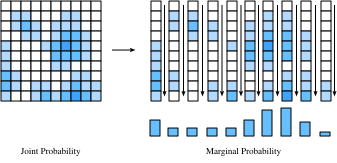

# Variables aléatoires
:label:`sec_random_variables` 

Dans :numref:`sec_prob`, nous avons vu les bases du travail avec les variables aléatoires discrètes, qui dans notre cas font référence aux variables aléatoires qui prennent soit un ensemble fini de valeurs possibles, soit les entiers.  Dans cette section, nous développons la théorie des *variables aléatoires continues*, qui sont des variables aléatoires pouvant prendre n'importe quelle valeur réelle.

## Variables aléatoires continues

Les variables aléatoires continues constituent un sujet nettement plus subtil que les variables aléatoires discrètes.  Une analogie juste à faire est que le saut technique est comparable au saut entre l'addition de listes de nombres et l'intégration de fonctions.  En tant que tel, nous devrons prendre un certain temps pour développer la théorie.

#### Du discret au continu

Pour comprendre les défis techniques supplémentaires rencontrés lorsque l'on travaille avec des variables aléatoires continues, réalisons une expérience de pensée.  Supposons que nous lancions une fléchette sur une cible et que nous voulions connaître la probabilité qu'elle atteigne exactement $2 \text{cm}$ à partir du centre de la cible.

Pour commencer, nous imaginons mesurer un seul chiffre de précision, c'est-à-dire avec des cases pour $0 \text{cm}$, $1 \text{cm}$, $2 \text{cm}$, et ainsi de suite.  Nous lançons disons $100$ fléchettes sur la cible, et si $20$ d'entre elles tombent dans le bac pour $2\text{cm}$, nous en concluons que $20\%$ des fléchettes que nous avons lancées ont touché la cible $2 \text{cm}$ loin du centre.

Cependant, lorsque nous regardons de plus près, cela ne correspond pas à notre question !  Nous voulions une égalité exacte, alors que ces bacs contiennent tout ce qui se trouve entre, disons, $1.5\text{cm}$ et $2.5\text{cm}$.

Sans nous décourager, nous continuons.  Nous mesurons encore plus précisément, disons $1.9\text{cm}$, $2.0\text{cm}$, $2.1\text{cm}$, et nous voyons maintenant que peut-être $3$ des fléchettes de $100$ ont touché le plateau dans le bac de $2.0\text{cm}$.  Nous concluons donc que la probabilité est $3\%$.

Cependant, cela ne résout rien !  Nous avons simplement repoussé le problème d'un chiffre supplémentaire.  Faisons un peu abstraction. Imaginons que nous connaissions la probabilité que les premiers chiffres de $k$ correspondent à $2.00000\ldots$ et que nous voulions connaître la probabilité qu'ils correspondent aux premiers chiffres de $k+1$. Il est assez raisonnable de supposer que le chiffre ${k+1}^{\mathrm{th}}$ est essentiellement un choix aléatoire dans l'ensemble $\{0, 1, 2, \ldots, 9\}$.  Au moins, nous ne pouvons pas concevoir un processus physiquement significatif qui forcerait le nombre de micromètres éloignés du centre à préférer aboutir à un $7$ plutôt qu'à un $3$.

Cela signifie qu'en substance, chaque chiffre supplémentaire de précision dont nous avons besoin devrait diminuer la probabilité de correspondance par un facteur de $10$. Ou, en d'autres termes, nous nous attendrions à ce que

$$
P(\text{distance is}\; 2.00\ldots, \;\text{to}\; k \;\text{digits} ) \approx p\cdot10^{-k}.
$$

La valeur $p$ encode essentiellement ce qui se passe avec les premiers chiffres, et la valeur $10^{-k}$ gère le reste.

Remarquez que si nous connaissons la position exacte à $k=4$ chiffres après la décimale, cela signifie que nous savons que la valeur se situe dans l'intervalle disons $[1.99995,2.00005]$ qui est un intervalle de longueur $2.00005-1.99995 = 10^{-4}$.  Donc, si nous appelons la longueur de cet intervalle $\epsilon$, nous pouvons dire

$$
P(\text{distance is in an}\; \epsilon\text{-sized interval around}\; 2 ) \approx \epsilon \cdot p.
$$

Allons plus loin.  Nous avons pensé au point $2$ pendant tout ce temps, sans jamais penser à d'autres points.  Fondamentalement, rien n'y est différent, mais il est vrai que la valeur $p$ sera probablement différente.  Nous pourrions au moins espérer qu'un lanceur de fléchettes ait plus de chances de toucher un point proche du centre, comme $2\text{cm}$ plutôt que $20\text{cm}$. Ainsi, la valeur $p$ n'est pas fixe, mais devrait plutôt dépendre du point $x$.  Cela nous indique que nous devrions nous attendre à

$$P(\text{distance is in an}\; \epsilon \text{-sized interval around}\; x ) \approx \epsilon \cdot p(x).$$ 
:eqlabel:`eq_pdf_deriv` 

En effet, :eqref:`eq_pdf_deriv` définit précisément la *fonction de densité de probabilité*.  Il s'agit d'une fonction $p(x)$ qui code la probabilité relative de toucher un point par rapport à un autre.  Visualisons à quoi pourrait ressembler une telle fonction.

```{.python .input}
#@tab mxnet
%matplotlib inline
from d2l import mxnet as d2l
from IPython import display
from mxnet import np, npx
npx.set_np()

# Plot the probability density function for some random variable
x = np.arange(-5, 5, 0.01)
p = 0.2*np.exp(-(x - 3)**2 / 2)/np.sqrt(2 * np.pi) + \
    0.8*np.exp(-(x + 1)**2 / 2)/np.sqrt(2 * np.pi)

d2l.plot(x, p, 'x', 'Density')
```

```{.python .input}
#@tab pytorch
%matplotlib inline
from d2l import torch as d2l
from IPython import display
import torch
torch.pi = torch.acos(torch.zeros(1)).item() * 2  # Define pi in torch

# Plot the probability density function for some random variable
x = torch.arange(-5, 5, 0.01)
p = 0.2*torch.exp(-(x - 3)**2 / 2)/torch.sqrt(2 * torch.tensor(torch.pi)) + \
    0.8*torch.exp(-(x + 1)**2 / 2)/torch.sqrt(2 * torch.tensor(torch.pi))

d2l.plot(x, p, 'x', 'Density')
```

```{.python .input}
#@tab tensorflow
%matplotlib inline
from d2l import tensorflow as d2l
from IPython import display
import tensorflow as tf
tf.pi = tf.acos(tf.zeros(1)).numpy() * 2  # Define pi in TensorFlow

# Plot the probability density function for some random variable
x = tf.range(-5, 5, 0.01)
p = 0.2*tf.exp(-(x - 3)**2 / 2)/tf.sqrt(2 * tf.constant(tf.pi)) + \
    0.8*tf.exp(-(x + 1)**2 / 2)/tf.sqrt(2 * tf.constant(tf.pi))

d2l.plot(x, p, 'x', 'Density')
```

Les endroits où la valeur de la fonction est grande indiquent les régions où nous avons plus de chances de trouver la valeur aléatoire.  Les parties basses sont des régions où nous avons peu de chances de trouver la valeur aléatoire.

### Fonctions de densité de probabilité

Approfondissons maintenant cette question.  Nous avons déjà vu ce qu'est intuitivement une fonction de densité de probabilité pour une variable aléatoire $X$, à savoir que la fonction de densité est une fonction $p(x)$ telle que

$$P(X \; \text{is in an}\; \epsilon \text{-sized interval around}\; x ) \approx \epsilon \cdot p(x).$$ 
:eqlabel:`eq_pdf_def` 

Mais qu'est-ce que cela implique pour les propriétés de $p(x)$?

Tout d'abord, les probabilités ne sont jamais négatives, nous devrions donc nous attendre à ce que $p(x) \ge 0$ le soit également.

Deuxièmement, imaginons que nous découpions le site $\mathbb{R}$ en un nombre infini de tranches de la largeur de $\epsilon$, disons avec des tranches de $(\epsilon\cdot i, \epsilon \cdot (i+1)]$.  Pour chacune d'entre elles, nous savons grâce à :eqref:`eq_pdf_def` que la probabilité est d'environ

$$
P(X \; \text{is in an}\; \epsilon\text{-sized interval around}\; x ) \approx \epsilon \cdot p(\epsilon \cdot i),
$$

donc, additionnée à toutes les tranches, elle devrait être de

$$
P(X\in\mathbb{R}) \approx \sum_i \epsilon \cdot p(\epsilon\cdot i).
$$

Ceci n'est rien d'autre que l'approximation d'une intégrale discutée dans :numref:`sec_integral_calculus`, nous pouvons donc dire que

$$
P(X\in\mathbb{R}) = \int_{-\infty}^{\infty} p(x) \; dx.
$$

Nous savons que $P(X\in\mathbb{R}) = 1$, puisque la variable aléatoire doit prendre *un certain* nombre, nous pouvons conclure que pour toute densité

$$
\int_{-\infty}^{\infty} p(x) \; dx = 1.
$$

En effet, en creusant davantage cette question, on constate que pour toute $a$, et $b$, nous voyons que

$$
P(X\in(a, b]) = \int _ {a}^{b} p(x) \; dx.
$$

Nous pouvons approximer cela en code en utilisant les mêmes méthodes d'approximation discrète que précédemment.  Dans ce cas, nous pouvons approximer la probabilité de tomber dans la région bleue.

```{.python .input}
#@tab mxnet
# Approximate probability using numerical integration
epsilon = 0.01
x = np.arange(-5, 5, 0.01)
p = 0.2*np.exp(-(x - 3)**2 / 2) / np.sqrt(2 * np.pi) + \
    0.8*np.exp(-(x + 1)**2 / 2) / np.sqrt(2 * np.pi)

d2l.set_figsize()
d2l.plt.plot(x, p, color='black')
d2l.plt.fill_between(x.tolist()[300:800], p.tolist()[300:800])
d2l.plt.show()

f'approximate Probability: {np.sum(epsilon*p[300:800])}'
```

```{.python .input}
#@tab pytorch
# Approximate probability using numerical integration
epsilon = 0.01
x = torch.arange(-5, 5, 0.01)
p = 0.2*torch.exp(-(x - 3)**2 / 2) / torch.sqrt(2 * torch.tensor(torch.pi)) +\
    0.8*torch.exp(-(x + 1)**2 / 2) / torch.sqrt(2 * torch.tensor(torch.pi))

d2l.set_figsize()
d2l.plt.plot(x, p, color='black')
d2l.plt.fill_between(x.tolist()[300:800], p.tolist()[300:800])
d2l.plt.show()

f'approximate Probability: {torch.sum(epsilon*p[300:800])}'
```

```{.python .input}
#@tab tensorflow
# Approximate probability using numerical integration
epsilon = 0.01
x = tf.range(-5, 5, 0.01)
p = 0.2*tf.exp(-(x - 3)**2 / 2) / tf.sqrt(2 * tf.constant(tf.pi)) +\
    0.8*tf.exp(-(x + 1)**2 / 2) / tf.sqrt(2 * tf.constant(tf.pi))

d2l.set_figsize()
d2l.plt.plot(x, p, color='black')
d2l.plt.fill_between(x.numpy().tolist()[300:800], p.numpy().tolist()[300:800])
d2l.plt.show()

f'approximate Probability: {tf.reduce_sum(epsilon*p[300:800])}'
```

Il s'avère que ces deux propriétés décrivent exactement l'espace des fonctions de densité de probabilité possibles (ou *f.d.p.* pour l'abréviation couramment utilisée).  Ce sont des fonctions non négatives $p(x) \ge 0$ telles que

$$\int_{-\infty}^{\infty} p(x) \; dx = 1.$$ 
:eqlabel:`eq_pdf_int_one` 

Nous interprétons cette fonction en utilisant l'intégration pour obtenir la probabilité que notre variable aléatoire se trouve dans un intervalle spécifique :

$$P(X\in(a, b]) = \int _ {a}^{b} p(x) \; dx.$$ 
:eqlabel:`eq_pdf_int_int` 

Dans :numref:`sec_distributions`, nous verrons un certain nombre de distributions courantes, mais continuons à travailler dans l'abstrait.

### Fonctions de distribution cumulatives

Dans la section précédente, nous avons vu la notion de f.d.p. En pratique, il s'agit d'une méthode couramment rencontrée pour discuter des variables aléatoires continues, mais elle présente un écueil important : les valeurs de la f.d.p. ne sont pas elles-mêmes des probabilités, mais plutôt une fonction que nous devons intégrer pour obtenir des probabilités.  Il n'y a rien d'anormal à ce qu'une densité soit supérieure à $10$, à condition qu'elle ne soit pas supérieure à $10$ pendant plus d'un intervalle de longueur $1/10$.  Cela peut être contre-intuitif, c'est pourquoi les gens pensent souvent aussi en termes de *fonction de distribution cumulative*, ou f.d.c., qui *est* une probabilité.

En particulier, en utilisant :eqref:`eq_pdf_int_int`, nous définissons la f.d.c. pour une variable aléatoire $X$ avec une densité $p(x)$ par

$$
F(x) = \int _ {-\infty}^{x} p(x) \; dx = P(X \le x).
$$

Observons quelques propriétés.

* $F(x) \rightarrow 0$ comme $x\rightarrow -\infty$.
* $F(x) \rightarrow 1$ comme $x\rightarrow \infty$.
* $F(x)$ est non décroissante ($y > x \implies F(y) \ge F(x)$).
* $F(x)$ est continue (n'a pas de sauts) si $X$ est une variable aléatoire continue.

En ce qui concerne le quatrième point, notez que cela ne serait pas vrai si $X$ était discrète, par exemple si elle prenait les valeurs $0$ et $1$ avec une probabilité de $1/2$.  Dans ce cas

$$
F(x) = \begin{cases}
0 & x < 0, \\
\frac{1}{2} & x < 1, \\
1 & x \ge 1.
\end{cases}
$$

Dans cet exemple, nous voyons l'un des avantages de travailler avec la f.c.d., la possibilité de traiter des variables aléatoires continues ou discrètes dans le même cadre, ou même des mélanges des deux (tirez à pile ou face : si c'est pile, vous obtiendrez le résultat du lancer d'un dé, si c'est face, vous obtiendrez la distance d'un lancer de fléchettes par rapport au centre de la cible).

### Moyennes

Supposons que nous ayons affaire à une variable aléatoire $X$.  La distribution elle-même peut être difficile à interpréter.  Il est souvent utile de pouvoir résumer le comportement d'une variable aléatoire de manière concise.  Les nombres qui nous aident à saisir le comportement d'une variable aléatoire sont appelés *statistiques sommaires*.  Les plus courantes sont la *moyenne*, la *variance* et l'écart-type*.

La *moyenne* code la valeur moyenne d'une variable aléatoire.  Si nous avons une variable aléatoire discrète $X$, qui prend les valeurs $x_i$ avec les probabilités $p_i$, alors la moyenne est donnée par la moyenne pondérée : somme des valeurs multipliée par la probabilité que la variable aléatoire prenne cette valeur :

$$\mu_X = E[X] = \sum_i x_i p_i.$$ 
:eqlabel:`eq_exp_def` 

La façon dont nous devons interpréter la moyenne (bien qu'avec prudence) est qu'elle nous indique essentiellement où la variable aléatoire tend à se situer.

À titre d'exemple minimaliste que nous examinerons tout au long de cette section, considérons que $X$ est la variable aléatoire qui prend la valeur $a-2$ avec la probabilité $p$, $a+2$ avec la probabilité $p$ et $a$ avec la probabilité $1-2p$.  Nous pouvons calculer en utilisant :eqref:`eq_exp_def` que, pour tout choix possible de $a$ et $p$, la moyenne est de

$$
\mu_X = E[X] = \sum_i x_i p_i = (a-2)p + a(1-2p) + (a+2)p = a.
$$

Nous voyons donc que la moyenne est $a$.  Cela correspond à l'intuition puisque $a$ est l'emplacement autour duquel nous avons centré notre variable aléatoire.

Parce qu'elles sont utiles, résumons quelques propriétés.

* Pour toute variable aléatoire $X$ et les nombres $a$ et $b$, nous avons $\mu_{aX+b} = a\mu_X + b$.
* Si nous avons deux variables aléatoires $X$ et $Y$, nous avons $\mu_{X+Y} = \mu_X+\mu_Y$.

Les moyennes sont utiles pour comprendre le comportement moyen d'une variable aléatoire, cependant la moyenne n'est pas suffisante pour en avoir une compréhension intuitive complète.  Réaliser un bénéfice de $\$10 \pm \$1$ par vente est très différent de réaliser un bénéfice de $\$10 \pm \$15$ par vente malgré une valeur moyenne identique.  La seconde a un degré de fluctuation beaucoup plus important, et représente donc un risque beaucoup plus grand.  Ainsi, pour comprendre le comportement d'une variable aléatoire, nous aurons besoin au minimum d'une mesure supplémentaire : une mesure de l'ampleur de la fluctuation d'une variable aléatoire.

### Variances

Cela nous amène à considérer la *variance* d'une variable aléatoire.  Il s'agit d'une mesure quantitative de l'ampleur de la déviation d'une variable aléatoire par rapport à la moyenne.  Considérons l'expression $X - \mu_X$.  Il s'agit de l'écart de la variable aléatoire par rapport à sa moyenne.  Cette valeur peut être positive ou négative, nous devons donc faire quelque chose pour la rendre positive afin de mesurer l'ampleur de l'écart.

Il est raisonnable d'essayer d'examiner $\left|X-\mu_X\right|$, ce qui conduit effectivement à une quantité utile appelée *écart absolu moyen*, mais en raison des liens avec d'autres domaines des mathématiques et des statistiques, les gens utilisent souvent une solution différente.

En particulier, ils examinent $(X-\mu_X)^2.$ Si nous examinons la taille typique de cette quantité en prenant la moyenne, nous arrivons à la variance

$$\sigma_X^2 = \mathrm{Var}(X) = E\left[(X-\mu_X)^2\right] = E[X^2] - \mu_X^2.$$ 
:eqlabel:`eq_var_def` 

La dernière égalité dans :eqref:`eq_var_def` tient en développant la définition au milieu, et en appliquant les propriétés de l'espérance.

Reprenons notre exemple où $X$ est la variable aléatoire qui prend la valeur $a-2$ avec la probabilité $p$, $a+2$ avec la probabilité $p$ et $a$ avec la probabilité $1-2p$.  Dans ce cas, $\mu_X = a$, tout ce dont nous avons besoin est de calculer $E\left[X^2\right]$.  Cela peut facilement être fait :

$$
E\left[X^2\right] = (a-2)^2p + a^2(1-2p) + (a+2)^2p = a^2 + 8p.
$$

Ainsi, nous voyons que par :eqref:`eq_var_def` notre variance est de

$$
\sigma_X^2 = \mathrm{Var}(X) = E[X^2] - \mu_X^2 = a^2 + 8p - a^2 = 8p.
$$

Ce résultat est à nouveau logique.  La plus grande valeur possible de $p$ est $1/2$, ce qui correspond au choix de $a-2$ ou $a+2$ à pile ou face.  La variance de cette valeur est $4$, ce qui correspond au fait que $a-2$ et $a+2$ sont toutes deux éloignées de la moyenne de $2$ unités, et $2^2 = 4$.  À l'autre extrémité du spectre, si $p=0$, cette variable aléatoire prend toujours la valeur $0$ et n'a donc aucune variance.

Nous allons énumérer ci-dessous quelques propriétés de la variance :

* Pour toute variable aléatoire $X$, $\mathrm{Var}(X) \ge 0$, avec $\mathrm{Var}(X) = 0$ si et seulement si $X$ est une constante.
* Pour toute variable aléatoire $X$ et les nombres $a$ et $b$, on a que $\mathrm{Var}(aX+b) = a^2\mathrm{Var}(X)$.
* Si on a deux variables aléatoires *indépendantes* $X$ et $Y$, on a $\mathrm{Var}(X+Y) = \mathrm{Var}(X) + \mathrm{Var}(Y)$.

Lors de l'interprétation de ces valeurs, il peut y avoir un petit couac.  En particulier, essayons d'imaginer ce qui se passe si nous gardons la trace des unités dans ce calcul.  Supposons que nous travaillons avec le classement par étoiles attribué à un produit sur la page Web.  Dans ce cas, $a$, $a-2$, et $a+2$ sont tous mesurés en unités d'étoiles.  De même, la moyenne $\mu_X$ est également mesurée en étoiles (il s'agit d'une moyenne pondérée).  Cependant, si nous arrivons à la variance, nous rencontrons immédiatement un problème, à savoir que nous voulons examiner $(X-\mu_X)^2$, qui est en unités d'étoiles *au carré*.  Cela signifie que la variance elle-même n'est pas comparable aux mesures originales.  Pour la rendre interprétable, nous devrons revenir à nos unités d'origine.

### Écarts types

Cette statistique sommaire peut toujours être déduite de la variance en prenant la racine carrée !  Ainsi, nous définissons l'écart *type* comme suit

$$
\sigma_X = \sqrt{\mathrm{Var}(X)}.
$$

Dans notre exemple, cela signifie que l'écart-type est $\sigma_X = 2\sqrt{2p}$. Si nous utilisons des unités d'étoiles dans notre exemple de revue, $\sigma_X$ est à nouveau en unités d'étoiles.

Les propriétés que nous avions pour la variance peuvent être reformulées pour l'écart-type.

* Pour toute variable aléatoire $X$, $\sigma_{X} \ge 0$.
* Pour toute variable aléatoire $X$ et les nombres $a$ et $b$, nous avons $\sigma_{aX+b} = |a|\sigma_{X}$
* Si nous avons deux variables aléatoires *indépendantes* $X$ et $Y$, nous avons $\sigma_{X+Y} = \sqrt{\sigma_{X}^2 + \sigma_{Y}^2}$.

Il est naturel à ce moment de se demander : " Si l'écart-type est dans les unités de notre variable aléatoire initiale, représente-t-il quelque chose que nous pouvons tirer en ce qui concerne cette variable aléatoire ? "  La réponse est un oui retentissant !  En effet, tout comme la moyenne nous a indiqué l'emplacement typique de notre variable aléatoire, l'écart-type donne la plage de variation typique de cette variable aléatoire.  Nous pouvons rendre cela rigoureux à l'aide de ce que l'on appelle l'inégalité de Chebyshev :

$$P\left(X \not\in [\mu_X - \alpha\sigma_X, \mu_X + \alpha\sigma_X]\right) \le \frac{1}{\alpha^2}.$$ 
:eqlabel:`eq_chebyshev` 

Ou, pour l'exprimer verbalement dans le cas de $\alpha=10$, $99\%$ des échantillons de toute variable aléatoire se situent dans les limites de $10$ écarts types de la moyenne.  Cela donne une interprétation immédiate à nos statistiques sommaires standard.

Pour voir en quoi cette affirmation est plutôt subtile, reprenons notre exemple courant où $X$ est la variable aléatoire qui prend la valeur $a-2$ avec la probabilité $p$, $a+2$ avec la probabilité $p$ et $a$ avec la probabilité $1-2p$.  Nous avons vu que la moyenne était $a$ et que l'écart type était $2\sqrt{2p}$. Cela signifie que, si nous prenons l'inégalité de Chebyshev :eqref:`eq_chebyshev` avec $\alpha = 2$, nous voyons que l'expression est

$$
P\left(X \not\in [a - 4\sqrt{2p}, a + 4\sqrt{2p}]\right) \le \frac{1}{4}.
$$

Cela signifie que $75\%$ du temps, cette variable aléatoire se situera dans cet intervalle pour toute valeur de $p$. Maintenant, remarquez que comme $p \rightarrow 0$, cet intervalle converge également vers le point unique $a$.  Mais nous savons que notre variable aléatoire ne prend que les valeurs $a-2, a$ et $a+2$; nous pouvons donc être certains que $a-2$ et $a+2$ se situeront en dehors de l'intervalle !  La question est de savoir à quel moment $p$ cela se produit.  Nous voulons donc résoudre la question suivante : à quel moment $p$ fait $a+4\sqrt{2p} = a+2$, ce qui est résolu lorsque $p=1/8$, qui est *exactement* le premier $p$ où cela pourrait se produire sans violer notre affirmation selon laquelle pas plus de $1/4$ des échantillons de la distribution tomberaient en dehors de l'intervalle ($1/8$ à gauche et $1/8$ à droite).

Visualisons cela.  Nous allons montrer la probabilité d'obtenir les trois valeurs sous la forme de trois barres verticales dont la hauteur est proportionnelle à la probabilité.  L'intervalle sera dessiné comme une ligne horizontale au milieu.  Le premier graphique montre ce qui se passe pour $p > 1/8$ où l'intervalle contient bien tous les points.

```{.python .input}
#@tab mxnet
# Define a helper to plot these figures
def plot_chebyshev(a, p):
    d2l.set_figsize()
    d2l.plt.stem([a-2, a, a+2], [p, 1-2*p, p], use_line_collection=True)
    d2l.plt.xlim([-4, 4])
    d2l.plt.xlabel('x')
    d2l.plt.ylabel('p.m.f.')

    d2l.plt.hlines(0.5, a - 4 * np.sqrt(2 * p),
                   a + 4 * np.sqrt(2 * p), 'black', lw=4)
    d2l.plt.vlines(a - 4 * np.sqrt(2 * p), 0.53, 0.47, 'black', lw=1)
    d2l.plt.vlines(a + 4 * np.sqrt(2 * p), 0.53, 0.47, 'black', lw=1)
    d2l.plt.title(f'p = {p:.3f}')

    d2l.plt.show()

# Plot interval when p > 1/8
plot_chebyshev(0.0, 0.2)
```

```{.python .input}
#@tab pytorch
# Define a helper to plot these figures
def plot_chebyshev(a, p):
    d2l.set_figsize()
    d2l.plt.stem([a-2, a, a+2], [p, 1-2*p, p], use_line_collection=True)
    d2l.plt.xlim([-4, 4])
    d2l.plt.xlabel('x')
    d2l.plt.ylabel('p.m.f.')

    d2l.plt.hlines(0.5, a - 4 * torch.sqrt(2 * p),
                   a + 4 * torch.sqrt(2 * p), 'black', lw=4)
    d2l.plt.vlines(a - 4 * torch.sqrt(2 * p), 0.53, 0.47, 'black', lw=1)
    d2l.plt.vlines(a + 4 * torch.sqrt(2 * p), 0.53, 0.47, 'black', lw=1)
    d2l.plt.title(f'p = {p:.3f}')

    d2l.plt.show()

# Plot interval when p > 1/8
plot_chebyshev(0.0, torch.tensor(0.2))
```

```{.python .input}
#@tab tensorflow
# Define a helper to plot these figures
def plot_chebyshev(a, p):
    d2l.set_figsize()
    d2l.plt.stem([a-2, a, a+2], [p, 1-2*p, p], use_line_collection=True)
    d2l.plt.xlim([-4, 4])
    d2l.plt.xlabel('x')
    d2l.plt.ylabel('p.m.f.')

    d2l.plt.hlines(0.5, a - 4 * tf.sqrt(2 * p),
                   a + 4 * tf.sqrt(2 * p), 'black', lw=4)
    d2l.plt.vlines(a - 4 * tf.sqrt(2 * p), 0.53, 0.47, 'black', lw=1)
    d2l.plt.vlines(a + 4 * tf.sqrt(2 * p), 0.53, 0.47, 'black', lw=1)
    d2l.plt.title(f'p = {p:.3f}')

    d2l.plt.show()

# Plot interval when p > 1/8
plot_chebyshev(0.0, tf.constant(0.2))
```

Le second montre qu'à $p = 1/8$, l'intervalle touche exactement les deux points.  Cela montre que l'inégalité est *forte*, car aucun intervalle plus petit ne pourrait être pris tout en gardant l'inégalité vraie.

```{.python .input}
#@tab mxnet
# Plot interval when p = 1/8
plot_chebyshev(0.0, 0.125)
```

```{.python .input}
#@tab pytorch
# Plot interval when p = 1/8
plot_chebyshev(0.0, torch.tensor(0.125))
```

```{.python .input}
#@tab tensorflow
# Plot interval when p = 1/8
plot_chebyshev(0.0, tf.constant(0.125))
```

La troisième montre que pour $p < 1/8$, l'intervalle ne contient que le centre.  Cela n'invalide pas l'inégalité puisque nous devions seulement nous assurer que pas plus de $1/4$ de la probabilité ne tombe en dehors de l'intervalle, ce qui signifie qu'une fois $p < 1/8$, les deux points de $a-2$ et $a+2$ peuvent être écartés.

```{.python .input}
#@tab mxnet
# Plot interval when p < 1/8
plot_chebyshev(0.0, 0.05)
```

```{.python .input}
#@tab pytorch
# Plot interval when p < 1/8
plot_chebyshev(0.0, torch.tensor(0.05))
```

```{.python .input}
#@tab tensorflow
# Plot interval when p < 1/8
plot_chebyshev(0.0, tf.constant(0.05))
```

### Moyennes et variances dans le continu

Tout ceci a été fait en termes de variables aléatoires discrètes, mais le cas des variables aléatoires continues est similaire.  Pour comprendre intuitivement comment cela fonctionne, imaginez que nous divisons la ligne des nombres réels en intervalles de longueur $\epsilon$ donnés par $(\epsilon i, \epsilon (i+1)]$.  Une fois que nous avons fait cela, notre variable aléatoire continue est devenue discrète et nous pouvons utiliser :eqref:`eq_exp_def` pour dire que

$$
\begin{aligned}
\mu_X & \approx \sum_{i} (\epsilon i)P(X \in (\epsilon i, \epsilon (i+1)]) \\
& \approx \sum_{i} (\epsilon i)p_X(\epsilon i)\epsilon, \\
\end{aligned}
$$

où $p_X$ est la densité de $X$, qui est une approximation de l'intégrale de $xp_X(x)$, ce qui nous permet de conclure que

$$
\mu_X = \int_{-\infty}^\infty xp_X(x) \; dx.
$$

De même, en utilisant :eqref:`eq_var_def`, la variance peut être écrite comme suit

$$
\sigma^2_X = E[X^2] - \mu_X^2 = \int_{-\infty}^\infty x^2p_X(x) \; dx - \left(\int_{-\infty}^\infty xp_X(x) \; dx\right)^2.
$$

Tout ce qui a été dit plus haut à propos de la moyenne, de la variance et de l'écart-type reste valable dans ce cas.  Par exemple, si nous considérons la variable aléatoire de densité

$$
p(x) = \begin{cases}
1 & x \in [0,1], \\
0 & \text{otherwise}.
\end{cases}
$$

nous pouvons calculer

$$
\mu_X = \int_{-\infty}^\infty xp(x) \; dx = \int_0^1 x \; dx = \frac{1}{2}.
$$

et

$$
\sigma_X^2 = \int_{-\infty}^\infty x^2p(x) \; dx - \left(\frac{1}{2}\right)^2 = \frac{1}{3} - \frac{1}{4} = \frac{1}{12}.
$$

À titre d'avertissement, examinons un autre exemple, connu sous le nom de *distribution de Cauchy*.  Il s'agit de la distribution dont la f.d.p. est donnée par

$$
p(x) = \frac{1}{1+x^2}.
$$

```{.python .input}
#@tab mxnet
# Plot the Cauchy distribution p.d.f.
x = np.arange(-5, 5, 0.01)
p = 1 / (1 + x**2)

d2l.plot(x, p, 'x', 'p.d.f.')
```

```{.python .input}
#@tab pytorch
# Plot the Cauchy distribution p.d.f.
x = torch.arange(-5, 5, 0.01)
p = 1 / (1 + x**2)

d2l.plot(x, p, 'x', 'p.d.f.')
```

```{.python .input}
#@tab tensorflow
# Plot the Cauchy distribution p.d.f.
x = tf.range(-5, 5, 0.01)
p = 1 / (1 + x**2)

d2l.plot(x, p, 'x', 'p.d.f.')
```

Cette fonction semble innocente, et en effet, la consultation d'un tableau d'intégrales montrera qu'elle a une aire un sous elle, et donc qu'elle définit une variable aléatoire continue.

Pour voir ce qui ne va pas, essayons de calculer la variance de cette fonction.  Cela implique d'utiliser :eqref:`eq_var_def` pour calculer

$$
\int_{-\infty}^\infty \frac{x^2}{1+x^2}\; dx.
$$

La fonction à l'intérieur ressemble à ceci :

```{.python .input}
#@tab mxnet
# Plot the integrand needed to compute the variance
x = np.arange(-20, 20, 0.01)
p = x**2 / (1 + x**2)

d2l.plot(x, p, 'x', 'integrand')
```

```{.python .input}
#@tab pytorch
# Plot the integrand needed to compute the variance
x = torch.arange(-20, 20, 0.01)
p = x**2 / (1 + x**2)

d2l.plot(x, p, 'x', 'integrand')
```

```{.python .input}
#@tab tensorflow
# Plot the integrand needed to compute the variance
x = tf.range(-20, 20, 0.01)
p = x**2 / (1 + x**2)

d2l.plot(x, p, 'x', 'integrand')
```

Cette fonction a clairement une aire infinie puisqu'il s'agit essentiellement de la fonction constante avec un petit creux près de zéro, et en effet, nous pouvons montrer que

$$
\int_{-\infty}^\infty \frac{x^2}{1+x^2}\; dx = \infty.
$$

Cela signifie qu'elle n'a pas une variance finie bien définie.

Cependant, en regardant de plus près, on obtient un résultat encore plus inquiétant.  Essayons de calculer la moyenne à l'aide de :eqref:`eq_exp_def`.  En utilisant la formule de changement de variables, nous voyons

$$
\mu_X = \int_{-\infty}^{\infty} \frac{x}{1+x^2} \; dx = \frac{1}{2}\int_1^\infty \frac{1}{u} \; du.
$$

L'intégrale qui se trouve à l'intérieur est la définition du logarithme, donc il s'agit en fait de $\log(\infty) = \infty$, ce qui signifie qu'il n'existe pas non plus de valeur moyenne bien définie !

Les scientifiques de l'apprentissage automatique définissent leurs modèles de manière à ce que nous n'ayons pas besoin de traiter ces questions et que nous ayons affaire, dans la grande majorité des cas, à des variables aléatoires avec des moyennes et des variances bien définies.  Cependant, de temps en temps, les variables aléatoires avec des queues *lourdes* (c'est-à-dire les variables aléatoires où les probabilités d'obtenir de grandes valeurs sont suffisamment grandes pour que des choses comme la moyenne ou la variance ne soient pas définies) sont utiles dans la modélisation des systèmes physiques, il est donc utile de savoir qu'elles existent.

### Fonctions de densité conjointe

Les travaux ci-dessus supposent tous que nous travaillons avec une seule variable aléatoire à valeur réelle.  Mais que se passe-t-il si nous avons affaire à deux ou plusieurs variables aléatoires potentiellement fortement corrélées ?  Cette circonstance est la norme en apprentissage automatique : imaginez des variables aléatoires comme $R_{i, j}$ qui codent la valeur rouge du pixel à la coordonnée $(i, j)$ dans une image, ou $P_t$ qui est une variable aléatoire donnée par le prix d'une action au moment $t$.  Les pixels proches ont tendance à avoir une couleur similaire, et les moments proches ont tendance à avoir des prix similaires.  Nous ne pouvons pas les traiter comme des variables aléatoires distinctes et espérer créer un modèle performant (nous verrons dans :numref:`sec_naive_bayes` un modèle peu performant en raison d'une telle hypothèse).  Nous devons développer le langage mathématique nécessaire pour traiter ces variables aléatoires continues corrélées.

Heureusement, grâce aux intégrales multiples de :numref:`sec_integral_calculus`, nous pouvons développer un tel langage.  Supposons que nous ayons, pour simplifier, deux variables aléatoires $X, Y$ qui peuvent être corrélées.  Alors, comme dans le cas d'une variable unique, nous pouvons poser la question :

$$
P(X \;\text{is in an}\; \epsilon \text{-sized interval around}\; x \; \text{and} \;Y \;\text{is in an}\; \epsilon \text{-sized interval around}\; y ).
$$

Un raisonnement similaire à celui du cas d'une variable unique montre que cela devrait être environ

$$
P(X \;\text{is in an}\; \epsilon \text{-sized interval around}\; x \; \text{and} \;Y \;\text{is in an}\; \epsilon \text{-sized interval around}\; y ) \approx \epsilon^{2}p(x, y),
$$

pour une certaine fonction $p(x, y)$.  C'est ce qu'on appelle la densité conjointe de $X$ et $Y$.  Des propriétés similaires sont vraies pour cette fonction, comme nous l'avons vu dans le cas d'une variable unique. À savoir :

* $p(x, y) \ge 0$;
* $\int _ {\mathbb{R}^2} p(x, y) \;dx \;dy = 1$;
* $P((X, Y) \in \mathcal{D}) = \int _ {\mathcal{D}} p(x, y) \;dx \;dy$.

De cette manière, nous pouvons traiter des variables aléatoires multiples, potentiellement corrélées.  Si nous souhaitons travailler avec plus de deux variables aléatoires, nous pouvons étendre la densité multivariée à autant de coordonnées que souhaité en considérant $p(\mathbf{x}) = p(x_1, \ldots, x_n)$.  Les mêmes propriétés, à savoir être non négatif et avoir une intégrale totale de un, sont toujours valables.

### Distributions marginales
Lorsqu'on a affaire à des variables multiples, on souhaite souvent pouvoir ignorer les relations et se demander "comment est distribuée cette variable"  Une telle distribution est appelée une *distribution marginale*.

Pour être concret, supposons que nous ayons deux variables aléatoires $X, Y$ avec une densité conjointe donnée par $p _ {X, Y}(x, y)$.  Nous utiliserons l'indice pour indiquer à quelles variables aléatoires correspond la densité.  Pour trouver la distribution marginale, il faut prendre cette fonction et l'utiliser pour trouver $p _ X(x)$.

Comme pour la plupart des choses, il est préférable de revenir à l'image intuitive pour déterminer ce qui devrait être vrai.  Rappelez-vous que la densité est la fonction $p _ X$ de sorte que

$$
P(X \in [x, x+\epsilon]) \approx \epsilon \cdot p _ X(x).
$$

Il n'est pas fait mention de $Y$, mais si tout ce qui nous est donné est $p _{X, Y}$, nous devons inclure $Y$ d'une manière ou d'une autre. Nous pouvons d'abord observer que cela équivaut à

$$
P(X \in [x, x+\epsilon] \text{, and } Y \in \mathbb{R}) \approx \epsilon \cdot p _ X(x).
$$

Notre densité ne nous dit pas directement ce qui se passe dans ce cas, nous devons également diviser en petits intervalles dans $y$, nous pouvons donc l'écrire comme suit

$$
\begin{aligned}
\epsilon \cdot p _ X(x) & \approx \sum _ {i} P(X \in [x, x+\epsilon] \text{, and } Y \in [\epsilon \cdot i, \epsilon \cdot (i+1)]) \\
& \approx \sum _ {i} \epsilon^{2} p _ {X, Y}(x, \epsilon\cdot i).
\end{aligned}
$$


:label:`fig_marginal`

Cela nous dit d'additionner la valeur de la densité le long d'une série de carrés sur une ligne, comme indiqué sur :numref:`fig_marginal`. En effet, après avoir annulé un facteur d'epsilon des deux côtés, et en reconnaissant que la somme de droite est l'intégrale sur $y$, nous pouvons conclure que

$$
\begin{aligned}
p _ X(x) &  \approx \sum _ {i} \epsilon p _ {X, Y}(x, \epsilon\cdot i) \\
 & \approx \int_{-\infty}^\infty p_{X, Y}(x, y) \; dy.
\end{aligned}
$$

Nous voyons donc

$$
p _ X(x) = \int_{-\infty}^\infty p_{X, Y}(x, y) \; dy.
$$

Cela nous indique que pour obtenir une distribution marginale, nous intégrons sur les variables qui ne nous intéressent pas.  Ce processus est souvent appelé *intégration hors* ou *marginalisation hors* des variables inutiles.

### Covariance

Lorsque l'on a affaire à plusieurs variables aléatoires, il existe une statistique sommaire supplémentaire qu'il est utile de connaître : la *covariance*.  Elle mesure le degré de fluctuation de deux variables aléatoires ensemble.

Supposons que nous disposions de deux variables aléatoires $X$ et $Y$. Pour commencer, supposons qu'elles soient discrètes et prennent les valeurs $(x_i, y_j)$ avec une probabilité de $p_{ij}$.  Dans ce cas, la covariance est définie comme suit :

$$\sigma_{XY} = \mathrm{Cov}(X, Y) = \sum_{i, j} (x_i - \mu_X) (y_j-\mu_Y) p_{ij}. = E[XY] - E[X]E[Y].$$ 
:eqlabel:`eq_cov_def` 

Pour y réfléchir de manière intuitive : considérez la paire de variables aléatoires suivante.  Supposons que $X$ prenne les valeurs $1$ et $3$, et que $Y$ prenne les valeurs $-1$ et $3$.  Supposons que nous ayons les probabilités suivantes

$$
\begin{aligned}
P(X = 1 \; \text{and} \; Y = -1) & = \frac{p}{2}, \\
P(X = 1 \; \text{and} \; Y = 3) & = \frac{1-p}{2}, \\
P(X = 3 \; \text{and} \; Y = -1) & = \frac{1-p}{2}, \\
P(X = 3 \; \text{and} \; Y = 3) & = \frac{p}{2},
\end{aligned}
$$

où $p$ est un paramètre de $[0,1]$ que nous pouvons choisir.  Remarquez que si $p=1$, alors ils prennent toujours leurs valeurs minimales ou maximales simultanément, et que si $p=0$, ils sont garantis de prendre leurs valeurs inversées simultanément (l'un est grand quand l'autre est petit et vice versa).  Si $p=1/2$, alors les quatre possibilités sont toutes aussi probables les unes que les autres, et aucune ne doit être liée.  Calculons la covariance.  Tout d'abord, notez $\mu_X = 2$ et $\mu_Y = 1$, de sorte que nous pouvons effectuer le calcul en utilisant :eqref:`eq_cov_def` :

$$
\begin{aligned}
\mathrm{Cov}(X, Y) & = \sum_{i, j} (x_i - \mu_X) (y_j-\mu_Y) p_{ij} \\
& = (1-2)(-1-1)\frac{p}{2} + (1-2)(3-1)\frac{1-p}{2} + (3-2)(-1-1)\frac{1-p}{2} + (3-2)(3-1)\frac{p}{2} \\
& = 4p-2.
\end{aligned}
$$

Lorsque $p=1$ (le cas où elles sont toutes deux maximalement positives ou négatives en même temps), la covariance est de $2$. Lorsque $p=0$ (le cas où elles sont inversées), la covariance est de $-2$.  Enfin, lorsque $p=1/2$ (le cas où ils ne sont pas liés), la covariance est de $0$.  Nous voyons donc que la covariance mesure la relation entre ces deux variables aléatoires.

Une remarque rapide sur la covariance est qu'elle ne mesure que ces relations linéaires.  Des relations plus complexes comme $X = Y^2$ où $Y$ est choisi au hasard parmi $\{-2, -1, 0, 1, 2\}$ avec une probabilité égale peuvent être manquées.  En effet, un calcul rapide montre que ces variables aléatoires ont une covariance nulle, bien que l'une soit une fonction déterministe de l'autre.

Pour les variables aléatoires continues, la situation est à peu près la même.  À ce stade, nous sommes assez à l'aise pour faire la transition entre le discret et le continu, nous allons donc fournir l'analogue continu de :eqref:`eq_cov_def` sans aucune dérivation.

$$
\sigma_{XY} = \int_{\mathbb{R}^2} (x-\mu_X)(y-\mu_Y)p(x, y) \;dx \;dy.
$$

Pour visualiser, regardons une collection de variables aléatoires avec une covariance réglable.

```{.python .input}
#@tab mxnet
# Plot a few random variables adjustable covariance
covs = [-0.9, 0.0, 1.2]
d2l.plt.figure(figsize=(12, 3))
for i in range(3):
    X = np.random.normal(0, 1, 500)
    Y = covs[i]*X + np.random.normal(0, 1, (500))

    d2l.plt.subplot(1, 4, i+1)
    d2l.plt.scatter(X.asnumpy(), Y.asnumpy())
    d2l.plt.xlabel('X')
    d2l.plt.ylabel('Y')
    d2l.plt.title(f'cov = {covs[i]}')
d2l.plt.show()
```

```{.python .input}
#@tab pytorch
# Plot a few random variables adjustable covariance
covs = [-0.9, 0.0, 1.2]
d2l.plt.figure(figsize=(12, 3))
for i in range(3):
    X = torch.randn(500)
    Y = covs[i]*X + torch.randn(500)

    d2l.plt.subplot(1, 4, i+1)
    d2l.plt.scatter(X.numpy(), Y.numpy())
    d2l.plt.xlabel('X')
    d2l.plt.ylabel('Y')
    d2l.plt.title(f'cov = {covs[i]}')
d2l.plt.show()
```

```{.python .input}
#@tab tensorflow
# Plot a few random variables adjustable covariance
covs = [-0.9, 0.0, 1.2]
d2l.plt.figure(figsize=(12, 3))
for i in range(3):
    X = tf.random.normal((500, ))
    Y = covs[i]*X + tf.random.normal((500, ))

    d2l.plt.subplot(1, 4, i+1)
    d2l.plt.scatter(X.numpy(), Y.numpy())
    d2l.plt.xlabel('X')
    d2l.plt.ylabel('Y')
    d2l.plt.title(f'cov = {covs[i]}')
d2l.plt.show()
```

Voyons quelques propriétés des covariances :

* Pour toute variable aléatoire $X$, $\mathrm{Cov}(X, X) = \mathrm{Var}(X)$.
* Pour toute variable aléatoire $X, Y$ et les nombres $a$ et $b$, $\mathrm{Cov}(aX+b, Y) = \mathrm{Cov}(X, aY+b) = a\mathrm{Cov}(X, Y)$.
* Si $X$ et $Y$ sont indépendants, alors $\mathrm{Cov}(X, Y) = 0$.

En outre, nous pouvons utiliser la covariance pour développer une relation que nous avons vue précédemment.  Rappelez-vous que si $X$ et $Y$ sont deux variables aléatoires indépendantes alors

$$
\mathrm{Var}(X+Y) = \mathrm{Var}(X) + \mathrm{Var}(Y).
$$

Grâce à la connaissance des covariances, nous pouvons étendre cette relation.  En effet, un peu d'algèbre peut montrer cela en général,

$$
\mathrm{Var}(X+Y) = \mathrm{Var}(X) + \mathrm{Var}(Y) + 2\mathrm{Cov}(X, Y).
$$

Cela nous permet de généraliser la règle de sommation de la variance pour les variables aléatoires corrélées.

### Corrélation

Comme nous l'avons fait dans le cas des moyennes et des variances, considérons maintenant les unités.  Si $X$ est mesuré dans une unité (disons les pouces), et que $Y$ est mesuré dans une autre (disons les dollars), la covariance est mesurée dans le produit de ces deux unités $\text{inches} \times \text{dollars}$.  Ces unités peuvent être difficiles à interpréter.  Ce que nous voulons souvent dans ce cas, c'est une mesure de la parenté sans unité.  En effet, souvent nous ne nous soucions pas de la corrélation quantitative exacte, mais nous demandons plutôt si la corrélation va dans le même sens, et quelle est la force de la relation.

Pour voir ce qui est logique, réalisons une expérience de pensée.  Supposons que nous convertissions nos variables aléatoires en pouces et dollars en pouces et cents.  Dans ce cas, la variable aléatoire $Y$ est multipliée par $100$.  Si nous travaillons sur la définition, cela signifie que $\mathrm{Cov}(X, Y)$ sera multiplié par $100$.  Nous constatons donc que, dans ce cas, un changement d'unité modifie la covariance par un facteur de $100$. Ainsi, pour trouver notre mesure de corrélation invariante par unité, nous devrons diviser par quelque chose d'autre qui sera également mis à l'échelle par $100$.  En effet, nous avons un candidat évident, l'écart-type !  En effet, si nous définissons le *coefficient de corrélation* comme étant

$$\rho(X, Y) = \frac{\mathrm{Cov}(X, Y)}{\sigma_{X}\sigma_{Y}},$$ 
:eqlabel:`eq_cor_def` 

 , nous constatons qu'il s'agit d'une valeur sans unité.  Un peu de mathématiques permet de montrer que ce nombre se situe entre $-1$ et $1$, $1$ signifiant une corrélation positive maximale, tandis que $-1$ signifie une corrélation négative maximale.

Pour en revenir à notre exemple discret explicite ci-dessus, nous pouvons voir que $\sigma_X = 1$ et $\sigma_Y = 2$, et nous pouvons donc calculer la corrélation entre les deux variables aléatoires en utilisant :eqref:`eq_cor_def` pour voir que

$$
\rho(X, Y) = \frac{4p-2}{1\cdot 2} = 2p-1.
$$

Elle se situe maintenant entre $-1$ et $1$, le comportement attendu étant que $1$ signifie la plus forte corrélation et $-1$ la corrélation minimale.

Comme autre exemple, considérez $X$ comme une variable aléatoire quelconque, et $Y=aX+b$ comme une fonction déterministe linéaire quelconque de $X$. On peut alors calculer que

$$\sigma_{Y} = \sigma_{aX+b} = |a|\sigma_{X},$$ 

$$\mathrm{Cov}(X, Y) = \mathrm{Cov}(X, aX+b) = a\mathrm{Cov}(X, X) = a\mathrm{Var}(X),$$ 

et donc par :eqref:`eq_cor_def` que

$$
\rho(X, Y) = \frac{a\mathrm{Var}(X)}{|a|\sigma_{X}^2} = \frac{a}{|a|} = \mathrm{sign}(a).
$$

Nous constatons donc que la corrélation est $+1$ pour tout $a > 0$, et $-1$ pour tout $a < 0$, ce qui montre que la corrélation mesure le degré et la direction de la relation entre deux variables aléatoires, et non l'échelle de la variation.

Traçons à nouveau une collection de variables aléatoires avec une corrélation réglable.

```{.python .input}
#@tab mxnet
# Plot a few random variables adjustable correlations
cors = [-0.9, 0.0, 1.0]
d2l.plt.figure(figsize=(12, 3))
for i in range(3):
    X = np.random.normal(0, 1, 500)
    Y = cors[i] * X + np.sqrt(1 - cors[i]**2) * np.random.normal(0, 1, 500)

    d2l.plt.subplot(1, 4, i + 1)
    d2l.plt.scatter(X.asnumpy(), Y.asnumpy())
    d2l.plt.xlabel('X')
    d2l.plt.ylabel('Y')
    d2l.plt.title(f'cor = {cors[i]}')
d2l.plt.show()
```

```{.python .input}
#@tab pytorch
# Plot a few random variables adjustable correlations
cors = [-0.9, 0.0, 1.0]
d2l.plt.figure(figsize=(12, 3))
for i in range(3):
    X = torch.randn(500)
    Y = cors[i] * X + torch.sqrt(torch.tensor(1) -
                                 cors[i]**2) * torch.randn(500)

    d2l.plt.subplot(1, 4, i + 1)
    d2l.plt.scatter(X.numpy(), Y.numpy())
    d2l.plt.xlabel('X')
    d2l.plt.ylabel('Y')
    d2l.plt.title(f'cor = {cors[i]}')
d2l.plt.show()
```

```{.python .input}
#@tab tensorflow
# Plot a few random variables adjustable correlations
cors = [-0.9, 0.0, 1.0]
d2l.plt.figure(figsize=(12, 3))
for i in range(3):
    X = tf.random.normal((500, ))
    Y = cors[i] * X + tf.sqrt(tf.constant(1.) -
                                 cors[i]**2) * tf.random.normal((500, ))

    d2l.plt.subplot(1, 4, i + 1)
    d2l.plt.scatter(X.numpy(), Y.numpy())
    d2l.plt.xlabel('X')
    d2l.plt.ylabel('Y')
    d2l.plt.title(f'cor = {cors[i]}')
d2l.plt.show()
```

Énumérons ci-dessous quelques propriétés de la corrélation.

* Pour toute variable aléatoire $X$, $\rho(X, X) = 1$.
* Pour toute variable aléatoire $X, Y$ et les nombres $a$ et $b$, $\rho(aX+b, Y) = \rho(X, aY+b) = \rho(X, Y)$.
* Si $X$ et $Y$ sont indépendants avec une variance non nulle, alors $\rho(X, Y) = 0$.

Pour finir, vous aurez peut-être l'impression que certaines de ces formules vous sont familières.  En effet, si nous développons tout en supposant que $\mu_X = \mu_Y = 0$, nous voyons que c'est

$$
\rho(X, Y) = \frac{\sum_{i, j} x_iy_ip_{ij}}{\sqrt{\sum_{i, j}x_i^2 p_{ij}}\sqrt{\sum_{i, j}y_j^2 p_{ij}}}.
$$

Cela ressemble à une somme d'un produit de termes divisée par la racine carrée de sommes de termes.  C'est exactement la formule du cosinus de l'angle entre deux vecteurs $\mathbf{v}, \mathbf{w}$ dont les différentes coordonnées sont pondérées par $p_{ij}$:

$$
\cos(\theta) = \frac{\mathbf{v}\cdot \mathbf{w}}{\|\mathbf{v}\|\|\mathbf{w}\|} = \frac{\sum_{i} v_iw_i}{\sqrt{\sum_{i}v_i^2}\sqrt{\sum_{i}w_i^2}}.
$$

En effet, si nous considérons les normes comme étant liées aux écarts types, et les corrélations comme étant des cosinus d'angles, une grande partie de l'intuition que nous avons de la géométrie peut être appliquée à la réflexion sur les variables aléatoires.

## Résumé
* Les variables aléatoires continues sont des variables aléatoires qui peuvent prendre un continuum de valeurs.  Elles présentent certaines difficultés techniques qui les rendent plus difficiles à utiliser que les variables aléatoires discrètes.
* La fonction de densité de probabilité nous permet de travailler avec des variables aléatoires continues en donnant une fonction où l'aire sous la courbe sur un certain intervalle donne la probabilité de trouver un point échantillon dans cet intervalle.
* La fonction de distribution cumulative est la probabilité d'observer que la variable aléatoire est inférieure à un seuil donné.  Elle peut fournir un point de vue alternatif utile qui unifie les variables discrètes et continues.
* La moyenne est la valeur moyenne d'une variable aléatoire.
* La variance est le carré attendu de la différence entre la variable aléatoire et sa moyenne.
* L'écart-type est la racine carrée de la variance.  Il peut être considéré comme la mesure de la gamme de valeurs que peut prendre la variable aléatoire.
* L'inégalité de Chebyshev nous permet de rendre cette intuition rigoureuse en donnant un intervalle explicite qui contient la variable aléatoire la plupart du temps.
* Les densités conjointes nous permettent de travailler avec des variables aléatoires corrélées.  Nous pouvons marginaliser les densités conjointes en intégrant les variables aléatoires non désirées pour obtenir la distribution de la variable aléatoire désirée.
* La covariance et le coefficient de corrélation permettent de mesurer toute relation linéaire entre deux variables aléatoires corrélées.

## Exercices
1. Supposons que nous ayons la variable aléatoire dont la densité est donnée par $p(x) = \frac{1}{x^2}$ pour $x \ge 1$ et $p(x) = 0$ sinon.  Qu'est-ce que $P(X > 2)$?
2. La distribution de Laplace est une variable aléatoire dont la densité est donnée par $p(x = \frac{1}{2}e^{-|x|}$.  Quels sont la moyenne et l'écart-type de cette fonction ?  A titre indicatif, $\int_0^\infty xe^{-x} \; dx = 1$ et $\int_0^\infty x^2e^{-x} \; dx = 2$.
3. Je vous aborde dans la rue et je vous dis : "J'ai une variable aléatoire dont la moyenne est $1$, l'écart-type $2$, et j'ai observé que $25\%$ de mes échantillons prennent une valeur supérieure à $9$."  Me croyez-vous ?  Pourquoi ou pourquoi pas ?
4. Supposons que vous ayez deux variables aléatoires $X, Y$, dont la densité commune est donnée par $p_{XY}(x, y) = 4xy$ pour $x, y \in [0,1]$ et $p_{XY}(x, y) = 0$ sinon.  Quelle est la covariance de $X$ et $Y$?


:begin_tab:`mxnet`
[Discussions](https://discuss.d2l.ai/t/415)
:end_tab:

:begin_tab:`pytorch`
[Discussions](https://discuss.d2l.ai/t/1094)
:end_tab:


:begin_tab:`tensorflow`
[Discussions](https://discuss.d2l.ai/t/1095)
:end_tab:
