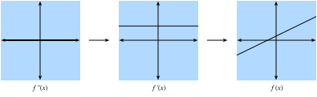

# Calcul à une variable
:label:`sec_single_variable_calculus` 

 Dans :numref:`sec_calculus` , nous avons vu les éléments de base du calcul différentiel.  Cette section approfondit les principes de base du calcul différentiel et la manière dont nous pouvons les comprendre et les appliquer dans le contexte de l'apprentissage automatique.

## Calcul différentiel
Le calcul différentiel est fondamentalement l'étude du comportement des fonctions sous de petits changements.  Pour comprendre pourquoi il est si essentiel à l'apprentissage profond, prenons un exemple.

Supposons que nous ayons un réseau neuronal profond où les poids sont, par commodité, concaténés en un seul vecteur $\mathbf{w} = (w_1, \ldots, w_n)$.  Étant donné un ensemble de données d'apprentissage, nous considérons la perte de notre réseau neuronal sur cet ensemble de données, que nous écrirons comme $\mathcal{L}(\mathbf{w})$. 

Cette fonction est extraordinairement complexe, car elle code les performances de tous les modèles possibles de l'architecture donnée sur cet ensemble de données. Il est donc presque impossible de dire quel ensemble de poids $\mathbf{w}$ minimisera la perte. Ainsi, dans la pratique, nous commençons souvent par initialiser nos poids *aléatoirement*, puis nous faisons des petits pas itératifs dans la direction qui fait diminuer la perte aussi rapidement que possible.

La question devient alors quelque chose qui, à première vue, n'est pas plus facile : comment trouver la direction qui fait que les poids diminuent aussi rapidement que possible ?  Pour y répondre, examinons d'abord le cas d'un seul poids : $L(\mathbf{w}) = L(x)$ pour une seule valeur réelle $x$. 

Prenons $x$ et essayons de comprendre ce qui se passe lorsque nous le changeons légèrement en $x + \epsilon$. Si vous voulez être concret, pensez à un nombre comme $\epsilon = 0.0000001$.  Pour nous aider à visualiser ce qui se passe, représentons graphiquement un exemple de fonction, $f(x) = \sin(x^x)$, sur $[0, 3]$.

```{.python .input}
#@tab mxnet
%matplotlib inline
from d2l import mxnet as d2l
from IPython import display
from mxnet import np, npx
npx.set_np()

# Plot a function in a normal range
x_big = np.arange(0.01, 3.01, 0.01)
ys = np.sin(x_big**x_big)
d2l.plot(x_big, ys, 'x', 'f(x)')
```

```{.python .input}
#@tab pytorch
%matplotlib inline
from d2l import torch as d2l
from IPython import display
import torch
torch.pi = torch.acos(torch.zeros(1)).item() * 2  # Define pi in torch

# Plot a function in a normal range
x_big = torch.arange(0.01, 3.01, 0.01)
ys = torch.sin(x_big**x_big)
d2l.plot(x_big, ys, 'x', 'f(x)')
```

```{.python .input}
#@tab tensorflow
%matplotlib inline
from d2l import tensorflow as d2l
from IPython import display
import tensorflow as tf
tf.pi = tf.acos(tf.zeros(1)).numpy() * 2  # Define pi in TensorFlow

# Plot a function in a normal range
x_big = tf.range(0.01, 3.01, 0.01)
ys = tf.sin(x_big**x_big)
d2l.plot(x_big, ys, 'x', 'f(x)')
```

À cette grande échelle, le comportement de la fonction n'est pas simple. Cependant, si nous réduisons notre plage à quelque chose de plus petit, comme $[1.75,2.25]$, nous constatons que le graphique devient beaucoup plus simple.

```{.python .input}
#@tab mxnet
# Plot a the same function in a tiny range
x_med = np.arange(1.75, 2.25, 0.001)
ys = np.sin(x_med**x_med)
d2l.plot(x_med, ys, 'x', 'f(x)')
```

```{.python .input}
#@tab pytorch
# Plot a the same function in a tiny range
x_med = torch.arange(1.75, 2.25, 0.001)
ys = torch.sin(x_med**x_med)
d2l.plot(x_med, ys, 'x', 'f(x)')
```

```{.python .input}
#@tab tensorflow
# Plot a the same function in a tiny range
x_med = tf.range(1.75, 2.25, 0.001)
ys = tf.sin(x_med**x_med)
d2l.plot(x_med, ys, 'x', 'f(x)')
```

En poussant cela à l'extrême, si nous zoomons sur un segment minuscule, le comportement devient beaucoup plus simple : il s'agit simplement d'une ligne droite.

```{.python .input}
#@tab mxnet
# Plot a the same function in a tiny range
x_small = np.arange(2.0, 2.01, 0.0001)
ys = np.sin(x_small**x_small)
d2l.plot(x_small, ys, 'x', 'f(x)')
```

```{.python .input}
#@tab pytorch
# Plot a the same function in a tiny range
x_small = torch.arange(2.0, 2.01, 0.0001)
ys = torch.sin(x_small**x_small)
d2l.plot(x_small, ys, 'x', 'f(x)')
```

```{.python .input}
#@tab tensorflow
# Plot a the same function in a tiny range
x_small = tf.range(2.0, 2.01, 0.0001)
ys = tf.sin(x_small**x_small)
d2l.plot(x_small, ys, 'x', 'f(x)')
```

C'est l'observation clé du calcul à une variable : le comportement des fonctions familières peut être modélisé par une ligne dans un intervalle suffisamment petit.  Cela signifie que pour la plupart des fonctions, il est raisonnable de s'attendre à ce que, si nous décalons un peu la valeur $x$ de la fonction, la sortie $f(x)$ sera également décalée d'un peu.  La seule question à laquelle nous devons répondre est la suivante : " Quelle est l'ampleur du changement de la sortie par rapport au changement de l'entrée ?  Est-il deux fois moins important ?  Deux fois plus grande ?"

Ainsi, nous pouvons considérer le rapport de la modification de la sortie d'une fonction pour une petite modification de l'entrée de la fonction.  Nous pouvons l'écrire formellement comme suit

$$
\frac{L(x+\epsilon) - L(x)}{(x+\epsilon) - x} = \frac{L(x+\epsilon) - L(x)}{\epsilon}.
$$

C'est déjà suffisant pour commencer à jouer avec dans le code.  Par exemple, supposons que nous savons que $L(x) = x^{2} + 1701(x-4)^3$, alors nous pouvons voir la taille de cette valeur au point $x = 4$ comme suit.

```{.python .input}
#@tab all
# Define our function
def L(x):
    return x**2 + 1701*(x-4)**3

# Print the difference divided by epsilon for several epsilon
for epsilon in [0.1, 0.001, 0.0001, 0.00001]:
    print(f'epsilon = {epsilon:.5f} -> {(L(4+epsilon) - L(4)) / epsilon:.5f}')
```

Maintenant, si nous sommes observateurs, nous remarquerons que la sortie de ce nombre est étrangement proche de $8$. En effet, si nous diminuons $\epsilon$, nous verrons que la valeur se rapproche progressivement de $8$. Nous pouvons donc conclure, à juste titre, que la valeur que nous recherchons (le degré auquel une modification de l'entrée change la sortie) devrait être $8$ au point $x=4$.  La façon dont un mathématicien codifie ce fait est la suivante

$$
\lim_{\epsilon \rightarrow 0}\frac{L(4+\epsilon) - L(4)}{\epsilon} = 8.
$$

Petite digression historique : au cours des premières décennies de recherche sur les réseaux neuronaux, les scientifiques ont utilisé cet algorithme (la *méthode des différences finies*) pour évaluer l'évolution d'une fonction de perte sous l'effet d'une petite perturbation : il suffisait de modifier les poids et de voir comment la perte changeait.  Cette méthode est inefficace sur le plan informatique, car elle nécessite deux évaluations de la fonction de perte pour voir comment une seule modification d'une variable influence la perte.  Si nous essayions de faire cela avec ne serait-ce que quelques milliers de paramètres, cela nécessiterait plusieurs milliers d'évaluations du réseau sur l'ensemble des données !  Ce n'est qu'en 1986 que l'algorithme de *rétropropagation* introduit dans :cite:`Rumelhart.Hinton.Williams.ea.1988` a permis de calculer comment *n'importe quelle* modification des poids ensemble changerait la perte dans le même temps de calcul qu'une seule prédiction du réseau sur l'ensemble des données.

Dans notre exemple, cette valeur $8$ est différente pour différentes valeurs de $x$, il est donc logique de la définir comme une fonction de $x$. Plus formellement, ce taux de changement dépendant de la valeur est appelé la *dérivée* qui s'écrit

$$\frac{df}{dx}(x) = \lim_{\epsilon \rightarrow 0}\frac{f(x+\epsilon) - f(x)}{\epsilon}.$$ 
 :eqlabel:`eq_der_def` 

 . Différents textes utilisent différentes notations pour la dérivée. Par exemple, toutes les notations ci-dessous indiquent la même chose :

$$
\frac{df}{dx} = \frac{d}{dx}f = f' = \nabla_xf = D_xf = f_x.
$$

La plupart des auteurs choisiront une seule notation et s'y tiendront, mais cela n'est pas garanti.  Il est préférable de se familiariser avec toutes ces notations.  Nous utiliserons la notation $\frac{df}{dx}$ tout au long de ce texte, sauf si nous voulons prendre la dérivée d'une expression complexe, auquel cas nous utiliserons $\frac{d}{dx}f$ pour écrire des expressions comme
$$
\frac{d}{dx}\left[x^4+\cos\left(\frac{x^2+1}{2x-1}\right)\right].
$$

Souvent, il est intuitivement utile de décortiquer à nouveau la définition de la dérivée :eqref:`eq_der_def` pour voir comment une fonction change lorsque nous apportons une petite modification à $x$:

$$\begin{aligned} \frac{df}{dx}(x) = \lim_{\epsilon \rightarrow 0}\frac{f(x+\epsilon) - f(x)}{\epsilon} & \implies \frac{df}{dx}(x) \approx \frac{f(x+\epsilon) - f(x)}{\epsilon} \\ & \implies \epsilon \frac{df}{dx}(x) \approx f(x+\epsilon) - f(x) \\ & \implies f(x+\epsilon) \approx f(x) + \epsilon \frac{df}{dx}(x). \end{aligned}$$ 
 :eqlabel:`eq_small_change` 

 La dernière équation mérite d'être explicitement mentionnée.  Elle nous indique que si vous prenez n'importe quelle fonction et que vous modifiez l'entrée d'une petite quantité, la sortie changera de cette petite quantité mise à l'échelle par la dérivée.

De cette façon, nous pouvons comprendre la dérivée comme le facteur d'échelle qui nous indique l'ampleur du changement de la sortie à partir d'un changement de l'entrée.

## Règles de calcul
:label:`sec_derivative_table` 

 Nous allons maintenant comprendre comment calculer la dérivée d'une fonction explicite.  Un traitement formel complet du calcul dériverait tout à partir des premiers principes.  Nous ne céderons pas à cette tentation ici, mais fournirons plutôt une compréhension des règles courantes rencontrées.

### Dérivées courantes
Comme nous l'avons vu dans :numref:`sec_calculus` , lorsque l'on calcule des dérivées, on peut souvent utiliser une série de règles pour réduire le calcul à quelques fonctions de base.  Nous les répétons ici pour faciliter la référence.

* **Dérivée de constantes.** $\frac{d}{dx}c = 0$.
* **Dérivée de fonctions linéaires.** $\frac{d}{dx}(ax) = a$.
* **Règle de puissance.** $\frac{d}{dx}x^n = nx^{n-1}$.
* **Dérivée des exponentielles.** $\frac{d}{dx}e^x = e^x$.
* **Dérivée du logarithme.** $\frac{d}{dx}\log(x) = \frac{1}{x}$.

### Règles de dérivation
Si chaque dérivée devait être calculée séparément et stockée dans une table, le calcul différentiel serait presque impossible.  C'est un don des mathématiques que de pouvoir généraliser les dérivées ci-dessus et de calculer des dérivées plus complexes, comme la dérivée de $f(x) = \log\left(1+(x-1)^{10}\right)$. Comme nous l'avons mentionné dans :numref:`sec_calculus` , la clé pour y parvenir est de codifier ce qui se passe lorsque l'on prend des fonctions et qu'on les combine de différentes manières, la plus importante étant les sommes, les produits et les compositions.

* **Règle de la somme.** $\frac{d}{dx}\left(g(x) + h(x)\right) = \frac{dg}{dx}(x) + \frac{dh}{dx}(x)$.
* **Règle du produit.** $\frac{d}{dx}\left(g(x)\cdot h(x)\right) = g(x)\frac{dh}{dx}(x) + \frac{dg}{dx}(x)h(x)$.
* **Règle de la chaîne.** $\frac{d}{dx}g(h(x)) = \frac{dg}{dh}(h(x))\cdot \frac{dh}{dx}(x)$.

Voyons comment nous pouvons utiliser :eqref:`eq_small_change` pour comprendre ces règles.  Pour la règle de la somme, considérons la chaîne de raisonnement suivante :

$$
\begin{aligned}
f(x+\epsilon) & = g(x+\epsilon) + h(x+\epsilon) \\
& \approx g(x) + \epsilon \frac{dg}{dx}(x) + h(x) + \epsilon \frac{dh}{dx}(x) \\
& = g(x) + h(x) + \epsilon\left(\frac{dg}{dx}(x) + \frac{dh}{dx}(x)\right) \\
& = f(x) + \epsilon\left(\frac{dg}{dx}(x) + \frac{dh}{dx}(x)\right).
\end{aligned}
$$

En comparant ce résultat avec le fait que $f(x+\epsilon) \approx f(x) + \epsilon \frac{df}{dx}(x)$, nous voyons que $\frac{df}{dx}(x) = \frac{dg}{dx}(x) + \frac{dh}{dx}(x)$ comme souhaité.  L'intuition ici est la suivante : lorsque nous modifions l'entrée $x$, $g$ et $h$ contribuent conjointement à la modification de la sortie par $\frac{dg}{dx}(x)$ et $\frac{dh}{dx}(x)$.


Le produit est plus subtil, et nécessitera une nouvelle observation sur la façon de travailler avec ces expressions.  Nous allons commencer comme précédemment en utilisant :eqref:`eq_small_change` :

$$
\begin{aligned}
f(x+\epsilon) & = g(x+\epsilon)\cdot h(x+\epsilon) \\
& \approx \left(g(x) + \epsilon \frac{dg}{dx}(x)\right)\cdot\left(h(x) + \epsilon \frac{dh}{dx}(x)\right) \\
& = g(x)\cdot h(x) + \epsilon\left(g(x)\frac{dh}{dx}(x) + \frac{dg}{dx}(x)h(x)\right) + \epsilon^2\frac{dg}{dx}(x)\frac{dh}{dx}(x) \\
& = f(x) + \epsilon\left(g(x)\frac{dh}{dx}(x) + \frac{dg}{dx}(x)h(x)\right) + \epsilon^2\frac{dg}{dx}(x)\frac{dh}{dx}(x). \\
\end{aligned}
$$


Cela ressemble au calcul effectué ci-dessus, et nous voyons effectivement notre réponse ($\frac{df}{dx}(x) = g(x)\frac{dh}{dx}(x) + \frac{dg}{dx}(x)h(x)$) à côté de $\epsilon$, mais il y a le problème du terme de taille $\epsilon^{2}$.  Nous l'appellerons un terme d'ordre * supérieur, puisque la puissance de $\epsilon^2$ est supérieure à celle de $\epsilon^1$. Nous verrons dans une section ultérieure que nous aurons parfois besoin d'en tenir compte, mais pour l'instant, observez que si $\epsilon = 0.0000001$, alors $\epsilon^{2}= 0.0000000000001$, qui est beaucoup plus petit.  Comme nous envoyons $\epsilon \rightarrow 0$, nous pouvons sans risque ignorer les termes d'ordre supérieur.  Par convention générale dans cette annexe, nous utiliserons "$\approx$" pour indiquer que les deux termes sont égaux jusqu'aux termes d'ordre supérieur.  Cependant, si nous souhaitons être plus formels, nous pouvons examiner le quotient de différence

$$
\frac{f(x+\epsilon) - f(x)}{\epsilon} = g(x)\frac{dh}{dx}(x) + \frac{dg}{dx}(x)h(x) + \epsilon \frac{dg}{dx}(x)\frac{dh}{dx}(x),
$$

et voir que lorsque nous envoyons $\epsilon \rightarrow 0$, le terme de droite devient également nul.

Enfin, avec la règle de la chaîne, nous pouvons à nouveau progresser comme précédemment en utilisant :eqref:`eq_small_change` et voir que

$$
\begin{aligned}
f(x+\epsilon) & = g(h(x+\epsilon)) \\
& \approx g\left(h(x) + \epsilon \frac{dh}{dx}(x)\right) \\
& \approx g(h(x)) + \epsilon \frac{dh}{dx}(x) \frac{dg}{dh}(h(x))\\
& = f(x) + \epsilon \frac{dg}{dh}(h(x))\frac{dh}{dx}(x),
\end{aligned}
$$

où, dans la deuxième ligne, nous considérons que la fonction $g$ voit son entrée ($h(x)$) décalée de la petite quantité $\epsilon \frac{dh}{dx}(x)$.

Ces règles nous fournissent un ensemble flexible d'outils permettant de calculer essentiellement n'importe quelle expression souhaitée.  Par exemple,

$$
\begin{aligned}
\frac{d}{dx}\left[\log\left(1+(x-1)^{10}\right)\right] & = \left(1+(x-1)^{10}\right)^{-1}\frac{d}{dx}\left[1+(x-1)^{10}\right]\\
& = \left(1+(x-1)^{10}\right)^{-1}\left(\frac{d}{dx}[1] + \frac{d}{dx}[(x-1)^{10}]\right) \\
& = \left(1+(x-1)^{10}\right)^{-1}\left(0 + 10(x-1)^9\frac{d}{dx}[x-1]\right) \\
& = 10\left(1+(x-1)^{10}\right)^{-1}(x-1)^9 \\
& = \frac{10(x-1)^9}{1+(x-1)^{10}}.
\end{aligned}
$$

Où chaque ligne a utilisé les règles suivantes :

1. La règle de la chaîne et la dérivée du logarithme.
2. La règle de la somme.
3. La dérivée des constantes, la règle de la chaîne et la règle de la puissance.
4. La règle de la somme, la dérivée des fonctions linéaires, la dérivée des constantes.

Deux choses devraient être claires après avoir fait cet exemple :

1. Toute fonction que nous pouvons écrire en utilisant des sommes, des produits, des constantes, des puissances, des exponentielles et des logarithmes peut avoir sa dérivée calculée mécaniquement en suivant ces règles.
2. Faire suivre ces règles par un humain peut être fastidieux et source d'erreurs !

Heureusement, ces deux faits réunis laissent entrevoir une solution : c'est un candidat parfait pour la mécanisation !  En effet, la rétropropagation, que nous allons revoir plus tard dans cette section, est exactement cela.

### Approximation linéaire
Lorsque l'on travaille avec des dérivés, il est souvent utile d'interpréter géométriquement l'approximation utilisée ci-dessus.  En particulier, notez que l'équation 

$$
f(x+\epsilon) \approx f(x) + \epsilon \frac{df}{dx}(x),
$$

approxime la valeur de $f$ par une ligne qui passe par le point $(x, f(x))$ et a une pente de $\frac{df}{dx}(x)$.  De cette façon, nous disons que la dérivée donne une approximation linéaire de la fonction $f$, comme illustré ci-dessous :

```{.python .input}
#@tab mxnet
# Compute sin
xs = np.arange(-np.pi, np.pi, 0.01)
plots = [np.sin(xs)]

# Compute some linear approximations. Use d(sin(x)) / dx = cos(x)
for x0 in [-1.5, 0, 2]:
    plots.append(np.sin(x0) + (xs - x0) * np.cos(x0))

d2l.plot(xs, plots, 'x', 'f(x)', ylim=[-1.5, 1.5])
```

```{.python .input}
#@tab pytorch
# Compute sin
xs = torch.arange(-torch.pi, torch.pi, 0.01)
plots = [torch.sin(xs)]

# Compute some linear approximations. Use d(sin(x))/dx = cos(x)
for x0 in [-1.5, 0.0, 2.0]:
    plots.append(torch.sin(torch.tensor(x0)) + (xs - x0) * 
                 torch.cos(torch.tensor(x0)))

d2l.plot(xs, plots, 'x', 'f(x)', ylim=[-1.5, 1.5])
```

```{.python .input}
#@tab tensorflow
# Compute sin
xs = tf.range(-tf.pi, tf.pi, 0.01)
plots = [tf.sin(xs)]

# Compute some linear approximations. Use d(sin(x))/dx = cos(x)
for x0 in [-1.5, 0.0, 2.0]:
    plots.append(tf.sin(tf.constant(x0)) + (xs - x0) * 
                 tf.cos(tf.constant(x0)))

d2l.plot(xs, plots, 'x', 'f(x)', ylim=[-1.5, 1.5])
```

### Dérivées d'ordre supérieur

Faisons maintenant quelque chose qui peut sembler étrange à première vue.  Prenons une fonction $f$ et calculons la dérivée $\frac{df}{dx}$.  Cela nous donne le taux de variation de $f$ en tout point.

Cependant, la dérivée, $\frac{df}{dx}$, peut être considérée comme une fonction elle-même, donc rien ne nous empêche de calculer la dérivée de $\frac{df}{dx}$ pour obtenir $\frac{d^2f}{dx^2} = \frac{df}{dx}\left(\frac{df}{dx}\right)$.  Nous appellerons cela la dérivée seconde de $f$. Cette fonction est le taux de variation du taux de variation de $f$, ou en d'autres termes, la façon dont le taux de variation évolue. Nous pouvons appliquer la dérivée un nombre quelconque de fois pour obtenir ce que l'on appelle la $n$-ième dérivée. Pour conserver une notation propre, nous désignerons la dérivée de $n$ comme suit 

$$
f^{(n)}(x) = \frac{d^{n}f}{dx^{n}} = \left(\frac{d}{dx}\right)^{n} f.
$$

Essayons de comprendre *pourquoi* cette notion est utile.  Ci-dessous, nous visualisons $f^{(2)}(x)$, $f^{(1)}(x)$, et $f(x)$. 

Tout d'abord, considérons le cas où la dérivée seconde $f^{(2)}(x)$ est une constante positive.  Cela signifie que la pente de la dérivée première est positive.  Par conséquent, la dérivée première $f^{(1)}(x)$ peut commencer par être négative, devenir nulle à un moment donné, puis devenir positive à la fin. Cela nous indique que la pente de notre fonction originale $f$ et donc de la fonction $f$ elle-même diminue, s'aplatit, puis augmente.  En d'autres termes, la fonction $f$ se courbe vers le haut et possède un seul minimum, comme le montre :numref:`fig_positive-second` .


:label:`fig_positive-second`


Deuxièmement, si la dérivée seconde est une constante négative, cela signifie que la dérivée première est décroissante.  Cela implique que la dérivée première peut commencer par être positive, devenir nulle en un point, puis devenir négative. Par conséquent, la fonction $f$ augmente, s'aplatit, puis diminue.  En d'autres termes, la fonction $f$ se courbe vers le bas et présente un seul maximum, comme le montre :numref:`fig_negative-second` .


:label:`fig_negative-second`


Troisièmement, si la dérivée seconde est toujours nulle, alors la dérivée première ne changera jamais - elle est constante !  Cela signifie que $f$ augmente (ou diminue) à un taux fixe, et que $f$ est lui-même une ligne droite comme le montre :numref:`fig_zero-second` .


:label:`fig_zero-second`

En résumé, la dérivée seconde peut être interprétée comme décrivant la manière dont la fonction $f$ s'incurve.  Une dérivée seconde positive entraîne une courbe ascendante, tandis qu'une dérivée seconde négative signifie que $f$ se courbe vers le bas, et une dérivée seconde nulle signifie que $f$ ne se courbe pas du tout.

Allons un peu plus loin. Considérons la fonction $g(x) = ax^{2}+ bx + c$.  Nous pouvons alors calculer que

$$
\begin{aligned}
\frac{dg}{dx}(x) & = 2ax + b \\
\frac{d^2g}{dx^2}(x) & = 2a.
\end{aligned}
$$

Si nous avons à l'esprit une fonction originale $f(x)$, nous pouvons calculer les deux premières dérivées et trouver les valeurs de $a, b$ et $c$ qui correspondent à ce calcul.  Comme dans la section précédente où nous avons vu que la première dérivée donnait la meilleure approximation par une ligne droite, cette construction fournit la meilleure approximation par un quadratique.  Visualisons ceci pour $f(x) = \sin(x)$.

```{.python .input}
#@tab mxnet
# Compute sin
xs = np.arange(-np.pi, np.pi, 0.01)
plots = [np.sin(xs)]

# Compute some quadratic approximations. Use d(sin(x)) / dx = cos(x)
for x0 in [-1.5, 0, 2]:
    plots.append(np.sin(x0) + (xs - x0) * np.cos(x0) -
                              (xs - x0)**2 * np.sin(x0) / 2)

d2l.plot(xs, plots, 'x', 'f(x)', ylim=[-1.5, 1.5])
```

```{.python .input}
#@tab pytorch
# Compute sin
xs = torch.arange(-torch.pi, torch.pi, 0.01)
plots = [torch.sin(xs)]

# Compute some quadratic approximations. Use d(sin(x)) / dx = cos(x)
for x0 in [-1.5, 0.0, 2.0]:
    plots.append(torch.sin(torch.tensor(x0)) + (xs - x0) * 
                 torch.cos(torch.tensor(x0)) - (xs - x0)**2 *
                 torch.sin(torch.tensor(x0)) / 2)

d2l.plot(xs, plots, 'x', 'f(x)', ylim=[-1.5, 1.5])
```

```{.python .input}
#@tab tensorflow
# Compute sin
xs = tf.range(-tf.pi, tf.pi, 0.01)
plots = [tf.sin(xs)]

# Compute some quadratic approximations. Use d(sin(x)) / dx = cos(x)
for x0 in [-1.5, 0.0, 2.0]:
    plots.append(tf.sin(tf.constant(x0)) + (xs - x0) * 
                 tf.cos(tf.constant(x0)) - (xs - x0)**2 *
                 tf.sin(tf.constant(x0)) / 2)

d2l.plot(xs, plots, 'x', 'f(x)', ylim=[-1.5, 1.5])
```

Nous allons étendre cette idée à l'idée d'une *série de Taylor* dans la section suivante. 

### Série de Taylor


 La *série de Taylor* fournit une méthode d'approximation de la fonction $f(x)$ si l'on nous donne les valeurs des dérivées premières $n$ en un point $x_0$, c'est-à-dire $\left\{ f(x_0), f^{(1)}(x_0), f^{(2)}(x_0), \ldots, f^{(n)}(x_0) \right\}$. L'idée sera de trouver un polynôme de degré $n$ qui correspond à toutes les dérivées données à $x_0$.

Nous avons vu le cas de $n=2$ dans la section précédente et un peu d'algèbre montre que c'est

$$
f(x) \approx \frac{1}{2}\frac{d^2f}{dx^2}(x_0)(x-x_0)^{2}+ \frac{df}{dx}(x_0)(x-x_0) + f(x_0).
$$

Comme nous pouvons le voir ci-dessus, le dénominateur de $2$ est là pour annuler le $2$ que nous obtenons lorsque nous prenons deux dérivées de $x^2$, tandis que les autres termes sont tous nuls.  La même logique s'applique à la dérivée première et à la valeur elle-même.

Si nous poussons la logique plus loin jusqu'à $n=3$, nous conclurons que

$$
f(x) \approx \frac{\frac{d^3f}{dx^3}(x_0)}{6}(x-x_0)^3 + \frac{\frac{d^2f}{dx^2}(x_0)}{2}(x-x_0)^{2}+ \frac{df}{dx}(x_0)(x-x_0) + f(x_0).
$$

où le $6 = 3 \times 2 = 3!$ vient de la constante que nous obtenons devant si nous prenons trois dérivées de $x^3$.


 De plus, nous pouvons obtenir un polynôme de degré $n$ par 

$$
P_n(x) = \sum_{i = 0}^{n} \frac{f^{(i)}(x_0)}{i!}(x-x_0)^{i}.
$$

où la notation 

$$
f^{(n)}(x) = \frac{d^{n}f}{dx^{n}} = \left(\frac{d}{dx}\right)^{n} f.
$$


En effet, $P_n(x)$ peut être considéré comme la meilleure approximation polynomiale de $n$-ième degré de notre fonction $f(x)$.

Bien que nous n'allions pas nous plonger entièrement dans l'erreur des approximations ci-dessus, il convient de mentionner la limite infinie. Dans ce cas, pour les fonctions qui se comportent bien (connues sous le nom de fonctions analytiques réelles) comme $\cos(x)$ ou $e^{x}$, nous pouvons écrire le nombre infini de termes et approximer exactement la même fonction

$$
f(x) = \sum_{n = 0}^\infty \frac{f^{(n)}(x_0)}{n!}(x-x_0)^{n}.
$$

Prenons l'exemple de $f(x) = e^{x}$. Puisque $e^{x}$ est sa propre dérivée, nous savons que $f^{(n)}(x) = e^{x}$. Par conséquent, $e^{x}$ peut être reconstruit en prenant la série de Taylor à $x_0 = 0$, c'est-à-dire,

$$
e^{x} = \sum_{n = 0}^\infty \frac{x^{n}}{n!} = 1 + x + \frac{x^2}{2} + \frac{x^3}{6} + \cdots.
$$

Voyons comment cela fonctionne en code et observons comment l'augmentation du degré de l'approximation de Taylor nous rapproche de la fonction souhaitée $e^x$.

```{.python .input}
#@tab mxnet
# Compute the exponential function
xs = np.arange(0, 3, 0.01)
ys = np.exp(xs)

# Compute a few Taylor series approximations
P1 = 1 + xs
P2 = 1 + xs + xs**2 / 2
P5 = 1 + xs + xs**2 / 2 + xs**3 / 6 + xs**4 / 24 + xs**5 / 120

d2l.plot(xs, [ys, P1, P2, P5], 'x', 'f(x)', legend=[
    "Exponential", "Degree 1 Taylor Series", "Degree 2 Taylor Series",
    "Degree 5 Taylor Series"])
```

```{.python .input}
#@tab pytorch
# Compute the exponential function
xs = torch.arange(0, 3, 0.01)
ys = torch.exp(xs)

# Compute a few Taylor series approximations
P1 = 1 + xs
P2 = 1 + xs + xs**2 / 2
P5 = 1 + xs + xs**2 / 2 + xs**3 / 6 + xs**4 / 24 + xs**5 / 120

d2l.plot(xs, [ys, P1, P2, P5], 'x', 'f(x)', legend=[
    "Exponential", "Degree 1 Taylor Series", "Degree 2 Taylor Series",
    "Degree 5 Taylor Series"])
```

```{.python .input}
#@tab tensorflow
# Compute the exponential function
xs = tf.range(0, 3, 0.01)
ys = tf.exp(xs)

# Compute a few Taylor series approximations
P1 = 1 + xs
P2 = 1 + xs + xs**2 / 2
P5 = 1 + xs + xs**2 / 2 + xs**3 / 6 + xs**4 / 24 + xs**5 / 120

d2l.plot(xs, [ys, P1, P2, P5], 'x', 'f(x)', legend=[
    "Exponential", "Degree 1 Taylor Series", "Degree 2 Taylor Series",
    "Degree 5 Taylor Series"])
```

Les séries de Taylor ont deux applications principales :

1. *Applications théoriques* : Souvent, lorsque nous essayons de comprendre une fonction trop complexe, l'utilisation des séries de Taylor nous permet de la transformer en un polynôme avec lequel nous pouvons travailler directement.

2. *Applications numériques* : Certaines fonctions comme $e^{x}$ ou $\cos(x)$ sont difficiles à calculer par les machines.  Elles peuvent stocker des tables de valeurs avec une précision fixe (et c'est souvent le cas), mais cela laisse toujours des questions ouvertes comme "Quel est le 1000ème chiffre de $\cos(1)$?"  Les séries de Taylor sont souvent utiles pour répondre à de telles questions. 


## Résumé

* Les dérivées peuvent être utilisées pour exprimer comment les fonctions changent lorsque nous modifions l'entrée d'une petite quantité.
* Les dérivées élémentaires peuvent être combinées en utilisant des règles de dérivation pour créer des dérivées arbitrairement complexes.
* Les dérivées peuvent être itérées pour obtenir des dérivées de second ordre ou d'ordre supérieur.  Chaque augmentation de l'ordre fournit des informations plus fines sur le comportement de la fonction.
* En utilisant l'information contenue dans les dérivées d'un seul exemple de données, nous pouvons approximer des fonctions qui se comportent bien par des polynômes obtenus à partir de la série de Taylor.


## Exercices

1. Quelle est la dérivée de $x^3-4x+1$?
2. Quelle est la dérivée de $\log(\frac{1}{x})$?
3. Vrai ou Faux : Si $f'(x) = 0$ alors $f$ a un maximum ou un minimum à $x$?
4. Où se trouve le minimum de $f(x) = x\log(x)$ pour $x\ge0$ (où l'on suppose que $f$ prend la valeur limite de $0$ à $f(0)$) ?


:begin_tab:`mxnet`
[Discussions](https://discuss.d2l.ai/t/412)
:end_tab:

:begin_tab:`pytorch`
[Discussions](https://discuss.d2l.ai/t/1088)
:end_tab:


:begin_tab:`tensorflow`
[Discussions](https://discuss.d2l.ai/t/1089)
:end_tab:
