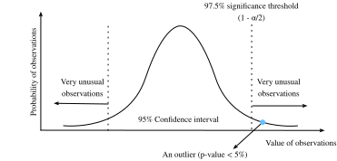

# Statistiques
:label:`sec_statistics` 

 Sans aucun doute, pour être un praticien de l'apprentissage profond de haut niveau, la capacité à former les modèles les plus avancés et les plus précis est cruciale.  Cependant, il est souvent difficile de savoir si les améliorations sont significatives ou si elles ne sont que le résultat de fluctuations aléatoires dans le processus de formation.  Pour être en mesure de discuter de l'incertitude des valeurs estimées, nous devons apprendre quelques statistiques.


La première référence aux *statistiques* remonte à un érudit arabe, Al-Kindi, au $9^{\mathrm{th}}$-siècle, qui a décrit en détail comment utiliser les statistiques et l'analyse de fréquence pour déchiffrer des messages cryptés. Après 800 ans, les statistiques modernes sont apparues en Allemagne dans les années 1700, lorsque les chercheurs se sont concentrés sur la collecte et l'analyse de données démographiques et économiques. Aujourd'hui, la statistique est un sujet scientifique qui concerne la collecte, le traitement, l'analyse, l'interprétation et la visualisation des données. De plus, la théorie de base de la statistique a été largement utilisée dans la recherche universitaire, industrielle et gouvernementale.


Plus précisément, les statistiques peuvent être divisées en *statistiques descriptives* et *inférence statistique*. Les premières se concentrent sur le résumé et l'illustration des caractéristiques d'une collection de données observées, que l'on appelle un *échantillon*. L'échantillon est tiré d'une *population*, qui désigne l'ensemble des individus, éléments ou événements similaires qui nous intéressent. Contrairement aux statistiques descriptives, l'inférence statistique * permet de déduire les caractéristiques d'une population à partir des *échantillons * donnés, en partant du principe que la distribution de l'échantillon peut reproduire la distribution de la population à un certain degré.


Vous pouvez vous demander : "Quelle est la différence essentielle entre l'apprentissage automatique et les statistiques ?" Fondamentalement parlant, les statistiques se concentrent sur le problème d'inférence. Ce type de problèmes inclut la modélisation de la relation entre les variables, comme l'inférence causale, et le test de la signification statistique des paramètres du modèle, comme le test A/B. En revanche, l'apprentissage automatique met l'accent sur la réalisation de prédictions précises, sans programmation explicite ni compréhension de la fonctionnalité de chaque paramètre.


Dans cette section, nous présenterons trois types de méthodes d'inférence statistique : l'évaluation et la comparaison des estimateurs, la réalisation de tests d'hypothèse et la construction d'intervalles de confiance. Ces méthodes peuvent nous aider à déduire les caractéristiques d'une population donnée, c'est-à-dire le véritable paramètre $\theta$. Par souci de concision, nous supposons que le véritable paramètre $\theta$ d'une population donnée est une valeur scalaire. Il est facile de l'étendre au cas où $\theta$ est un vecteur ou un tenseur, c'est pourquoi nous l'omettons dans notre discussion.


## Évaluation et comparaison des estimateurs

En statistique, un *estimateur* est une fonction d'échantillons donnés utilisée pour estimer le vrai paramètre $\theta$. Nous écrirons $\hat{\theta}_n = \hat{f}(x_1, \ldots, x_n)$ pour l'estimation de $\theta$ après observation des échantillons {$x_1, x_2, \ldots, x_n$}.

Nous avons déjà vu des exemples simples d'estimateurs dans la section :numref:`sec_maximum_likelihood` .  Si vous disposez d'un certain nombre d'échantillons d'une variable aléatoire de Bernoulli, l'estimation du maximum de vraisemblance de la probabilité que la variable aléatoire soit égale à un peut être obtenue en comptant le nombre de uns observés et en le divisant par le nombre total d'échantillons.  De même, un exercice vous demandait de montrer que l'estimation du maximum de vraisemblance de la moyenne d'une gaussienne compte tenu d'un certain nombre d'échantillons est donnée par la valeur moyenne de tous les échantillons.  Ces estimateurs ne donneront presque jamais la vraie valeur du paramètre, mais idéalement, pour un grand nombre d'échantillons, l'estimation sera proche.

À titre d'exemple, nous montrons ci-dessous la densité réelle d'une variable aléatoire gaussienne de moyenne zéro et de variance un, ainsi qu'une collection d'échantillons de cette gaussienne.  Nous avons construit la coordonnée $y$ pour que chaque point soit visible et que la relation avec la densité originale soit plus claire.

```{.python .input}
#@tab mxnet
from d2l import mxnet as d2l
from mxnet import np, npx
import random
npx.set_np()

# Sample datapoints and create y coordinate
epsilon = 0.1
random.seed(8675309)
xs = np.random.normal(loc=0, scale=1, size=(300,))

ys = [np.sum(np.exp(-(xs[:i] - xs[i])**2 / (2 * epsilon**2))
             / np.sqrt(2*np.pi*epsilon**2)) / len(xs) for i in range(len(xs))]

# Compute true density
xd = np.arange(np.min(xs), np.max(xs), 0.01)
yd = np.exp(-xd**2/2) / np.sqrt(2 * np.pi)

# Plot the results
d2l.plot(xd, yd, 'x', 'density')
d2l.plt.scatter(xs, ys)
d2l.plt.axvline(x=0)
d2l.plt.axvline(x=np.mean(xs), linestyle='--', color='purple')
d2l.plt.title(f'sample mean: {float(np.mean(xs)):.2f}')
d2l.plt.show()
```

```{.python .input}
#@tab pytorch
from d2l import torch as d2l
import torch

torch.pi = torch.acos(torch.zeros(1)) * 2  #define pi in torch

# Sample datapoints and create y coordinate
epsilon = 0.1
torch.manual_seed(8675309)
xs = torch.randn(size=(300,))

ys = torch.tensor(
    [torch.sum(torch.exp(-(xs[:i] - xs[i])**2 / (2 * epsilon**2))\
               / torch.sqrt(2*torch.pi*epsilon**2)) / len(xs)\
     for i in range(len(xs))])

# Compute true density
xd = torch.arange(torch.min(xs), torch.max(xs), 0.01)
yd = torch.exp(-xd**2/2) / torch.sqrt(2 * torch.pi)

# Plot the results
d2l.plot(xd, yd, 'x', 'density')
d2l.plt.scatter(xs, ys)
d2l.plt.axvline(x=0)
d2l.plt.axvline(x=torch.mean(xs), linestyle='--', color='purple')
d2l.plt.title(f'sample mean: {float(torch.mean(xs).item()):.2f}')
d2l.plt.show()
```

```{.python .input}
#@tab tensorflow
from d2l import tensorflow as d2l
import tensorflow as tf

tf.pi = tf.acos(tf.zeros(1)) * 2  # define pi in TensorFlow

# Sample datapoints and create y coordinate
epsilon = 0.1
xs = tf.random.normal((300,))

ys = tf.constant(
    [(tf.reduce_sum(tf.exp(-(xs[:i] - xs[i])**2 / (2 * epsilon**2)) \
               / tf.sqrt(2*tf.pi*epsilon**2)) / tf.cast(
        tf.size(xs), dtype=tf.float32)).numpy() \
     for i in range(tf.size(xs))])

# Compute true density
xd = tf.range(tf.reduce_min(xs), tf.reduce_max(xs), 0.01)
yd = tf.exp(-xd**2/2) / tf.sqrt(2 * tf.pi)

# Plot the results
d2l.plot(xd, yd, 'x', 'density')
d2l.plt.scatter(xs, ys)
d2l.plt.axvline(x=0)
d2l.plt.axvline(x=tf.reduce_mean(xs), linestyle='--', color='purple')
d2l.plt.title(f'sample mean: {float(tf.reduce_mean(xs).numpy()):.2f}')
d2l.plt.show()
```

Il peut y avoir de nombreuses façons de calculer l'estimateur d'un paramètre $\hat{\theta}_n$.  Dans cette section, nous présentons trois méthodes courantes pour évaluer et comparer les estimateurs : l'erreur quadratique moyenne, l'écart type et le biais statistique.

### Erreur quadratique moyenne

La métrique la plus simple utilisée pour évaluer les estimateurs est peut-être l'estimateur de l'erreur quadratique moyenne (EQM)* (ou perte $l_2$ ) qui peut être définie comme

$$\mathrm{MSE} (\hat{\theta}_n, \theta) = E[(\hat{\theta}_n - \theta)^2].$$ 
 :eqlabel:`eq_mse_est` 

 . Elle nous permet de quantifier l'écart quadratique moyen par rapport à la valeur réelle.  L'EQM est toujours non négatif. Si vous avez lu :numref:`sec_linear_regression` , vous reconnaîtrez qu'il s'agit de la fonction de perte de régression la plus couramment utilisée. En tant que mesure pour évaluer un estimateur, plus sa valeur est proche de zéro, plus l'estimateur est proche du vrai paramètre $\theta$.


### Biais statistique

L'EQM constitue une mesure naturelle, mais nous pouvons facilement imaginer de multiples phénomènes différents susceptibles de la rendre importante.  Deux phénomènes fondamentalement importants sont la fluctuation de l'estimateur due au caractère aléatoire de l'ensemble de données, et l'erreur systématique de l'estimateur due à la procédure d'estimation.


Tout d'abord, mesurons l'erreur systématique. Pour un estimateur $\hat{\theta}_n$, l'illustration mathématique du *biais statistique* peut être définie comme suit :

$$\mathrm{bias}(\hat{\theta}_n) = E(\hat{\theta}_n - \theta) = E(\hat{\theta}_n) - \theta.$$ 
 :eqlabel:`eq_bias` 

 Notez que lorsque $\mathrm{bias}(\hat{\theta}_n) = 0$, l'espérance de l'estimateur $\hat{\theta}_n$ est égale à la valeur réelle du paramètre.  Dans ce cas, nous disons que $\hat{\theta}_n$ est un estimateur sans biais.  En général, un estimateur non biaisé est meilleur qu'un estimateur biaisé puisque son espérance est égale à la vraie valeur du paramètre.


Il faut cependant savoir que les estimateurs biaisés sont fréquemment utilisés dans la pratique.  Dans certains cas, il n'existe pas d'estimateur sans biais sans autres hypothèses, ou il est difficile à calculer.  Cela peut sembler être un défaut important pour un estimateur, mais la majorité des estimateurs rencontrés dans la pratique sont au moins asymptotiquement sans biais dans le sens où le biais tend vers zéro lorsque le nombre d'échantillons disponibles tend vers l'infini : $\lim_{n \rightarrow \infty} \mathrm{bias}(\hat{\theta}_n) = 0$.


### Variance et écart-type

Deuxièmement, mesurons le caractère aléatoire de l'estimateur.  Rappelez-vous que, d'après :numref:`sec_random_variables` , l'écart *type* (ou *erreur standard*) est défini comme la racine carrée de la variance.  Nous pouvons mesurer le degré de fluctuation d'un estimateur en mesurant l'écart-type ou la variance de cet estimateur.

$$\sigma_{\hat{\theta}_n} = \sqrt{\mathrm{Var} (\hat{\theta}_n )} = \sqrt{E[(\hat{\theta}_n - E(\hat{\theta}_n))^2]}.$$
:eqlabel:`eq_var_est`

Il est important de comparer :eqref:`eq_var_est` à :eqref:`eq_mse_est` . Dans cette équation, nous ne comparons pas à la valeur réelle de la population $\theta$, mais plutôt à $E(\hat{\theta}_n)$, la moyenne attendue de l'échantillon.  Ainsi, nous ne mesurons pas la distance qui sépare l'estimateur de la valeur réelle, mais plutôt la fluctuation de l'estimateur lui-même.


### Le compromis biais-variance

Il est intuitivement clair que ces deux principales composantes contribuent à l'erreur quadratique moyenne.  Ce qui est quelque peu choquant, c'est que nous pouvons montrer qu'il s'agit en fait d'une *décomposition* de l'erreur quadratique moyenne en ces deux contributions plus une troisième. En d'autres termes, nous pouvons écrire l'erreur quadratique moyenne comme la somme du carré du biais, de la variance et de l'erreur irréductible.

$$
\begin{aligned}
\mathrm{MSE} (\hat{\theta}_n, \theta) &= E[(\hat{\theta}_n - \theta)^2] \\
 &= E[(\hat{\theta}_n)^2] + E[\theta^2] - 2E[\hat{\theta}_n\theta] \\
 &= \mathrm{Var} [\hat{\theta}_n] + E[\hat{\theta}_n]^2 + \mathrm{Var} [\theta] + E[\theta]^2 - 2E[\hat{\theta}_n]E[\theta] \\
 &= (E[\hat{\theta}_n] - E[\theta])^2 + \mathrm{Var} [\hat{\theta}_n] + \mathrm{Var} [\theta] \\
 &= (E[\hat{\theta}_n - \theta])^2 + \mathrm{Var} [\hat{\theta}_n] + \mathrm{Var} [\theta] \\
 &= (\mathrm{bias} [\hat{\theta}_n])^2 + \mathrm{Var} (\hat{\theta}_n) + \mathrm{Var} [\theta].\\
\end{aligned}
$$

Nous désignons la formule ci-dessus par l'expression *compromis biais-variance*. L'erreur quadratique moyenne peut être divisée en trois sources d'erreur : l'erreur due à un biais élevé, l'erreur due à une variance élevée et l'erreur irréductible. L'erreur de biais est généralement observée dans un modèle simple (tel qu'un modèle de régression linéaire), qui ne peut pas extraire de relations à haute dimension entre les caractéristiques et les sorties. Si un modèle souffre d'une erreur de biais élevée, nous disons souvent qu'il s'agit d'un *underfitting* ou d'un manque de *flexibilty* comme présenté dans (:numref:`sec_model_selection` ). La variance élevée résulte généralement d'un modèle trop complexe, qui s'adapte trop aux données d'apprentissage. Par conséquent, un modèle *surajusté* est sensible aux petites fluctuations des données. Si un modèle souffre d'une variance élevée, nous disons souvent qu'il s'agit d'un *overfitting* et d'un manque de *généralisation* comme présenté dans (:numref:`sec_model_selection` ). L'erreur irréductible est le résultat du bruit dans le site $\theta$ lui-même.


### Évaluation des estimateurs en code

Puisque l'écart-type d'un estimateur a été implémenté en appelant simplement `a.std()` pour un tenseur `a`, nous allons le sauter mais implémenter le biais statistique et l'erreur quadratique moyenne.

```{.python .input}
#@tab mxnet
# Statistical bias
def stat_bias(true_theta, est_theta):
    return(np.mean(est_theta) - true_theta)

# Mean squared error
def mse(data, true_theta):
    return(np.mean(np.square(data - true_theta)))
```

```{.python .input}
#@tab pytorch
# Statistical bias
def stat_bias(true_theta, est_theta):
    return(torch.mean(est_theta) - true_theta)

# Mean squared error
def mse(data, true_theta):
    return(torch.mean(torch.square(data - true_theta)))
```

```{.python .input}
#@tab tensorflow
# Statistical bias
def stat_bias(true_theta, est_theta):
    return(tf.reduce_mean(est_theta) - true_theta)

# Mean squared error
def mse(data, true_theta):
    return(tf.reduce_mean(tf.square(data - true_theta)))
```

Pour illustrer l'équation du compromis biais-variance, simulons une distribution normale $\mathcal{N}(\theta, \sigma^2)$ avec $10,000$ échantillons. Ici, nous utilisons un $\theta = 1$ et un $\sigma = 4$. Comme l'estimateur est une fonction des échantillons donnés, nous utilisons ici la moyenne des échantillons comme estimateur du vrai $\theta$ dans cette distribution normale $\mathcal{N}(\theta, \sigma^2)$.

```{.python .input}
#@tab mxnet
theta_true = 1
sigma = 4
sample_len = 10000
samples = np.random.normal(theta_true, sigma, sample_len)
theta_est = np.mean(samples)
theta_est
```

```{.python .input}
#@tab pytorch
theta_true = 1
sigma = 4
sample_len = 10000
samples = torch.normal(theta_true, sigma, size=(sample_len, 1))
theta_est = torch.mean(samples)
theta_est
```

```{.python .input}
#@tab tensorflow
theta_true = 1
sigma = 4
sample_len = 10000
samples = tf.random.normal((sample_len, 1), theta_true, sigma)
theta_est = tf.reduce_mean(samples)
theta_est
```

Validons l'équation de compromis en calculant la somme du biais au carré et de la variance de notre estimateur. Tout d'abord, calculons l'EQM de notre estimateur.

```{.python .input}
#@tab all
mse(samples, theta_true)
```

Ensuite, nous calculons $\mathrm{Var} (\hat{\theta}_n) + [\mathrm{bias} (\hat{\theta}_n)]^2$ comme ci-dessous. Comme vous pouvez le constater, les deux valeurs sont en accord avec la précision numérique.

```{.python .input}
#@tab mxnet
bias = stat_bias(theta_true, theta_est)
np.square(samples.std()) + np.square(bias)
```

```{.python .input}
#@tab pytorch
bias = stat_bias(theta_true, theta_est)
torch.square(samples.std(unbiased=False)) + torch.square(bias)
```

```{.python .input}
#@tab tensorflow
bias = stat_bias(theta_true, theta_est)
tf.square(tf.math.reduce_std(samples)) + tf.square(bias)
```

### Réalisation de tests d'hypothèses


 Le sujet le plus couramment rencontré en inférence statistique est le test d'hypothèses. Si les tests d'hypothèses ont été popularisés au début du 20e siècle, leur première utilisation remonte à John Arbuthnot dans les années 1700. John a suivi les registres des naissances sur 80 ans à Londres et a conclu que plus d'hommes que de femmes naissaient chaque année. Ensuite, le test de signification moderne est l'héritage de l'intelligence de Karl Pearson qui a inventé la valeur $p$ et le test du chi carré de Pearson, de William Gosset qui est le père de la distribution t de Student et de Ronald Fisher qui a paraphé l'hypothèse nulle et le test de signification.

Un *test d'hypothèse* est un moyen d'évaluer certaines preuves par rapport à l'énoncé par défaut concernant une population. Nous appelons l'énoncé par défaut l'*hypothèse nulle* $H_0$, que nous essayons de rejeter en utilisant les données observées. Ici, nous utilisons $H_0$ comme point de départ pour le test de signification statistique. L'hypothèse *alternative* $H_A$ (ou $H_1$) est une affirmation contraire à l'hypothèse nulle. Une hypothèse nulle est souvent énoncée sous une forme déclarative qui postule une relation entre les variables. Elle doit refléter le mémoire de manière aussi explicite que possible, et être testable par la théorie des statistiques.

Imaginez que vous êtes chimiste. Après avoir passé des milliers d'heures en laboratoire, vous mettez au point un nouveau médicament qui peut améliorer considérablement la capacité d'une personne à comprendre les mathématiques. Pour montrer son pouvoir magique, vous devez le tester. Naturellement, vous aurez besoin de quelques volontaires pour prendre le médicament et voir s'il peut les aider à mieux apprendre les mathématiques. Comment commencer ?

Tout d'abord, vous devrez sélectionner au hasard deux groupes de volontaires, de manière à ce qu'il n'y ait pas de différence entre leurs capacités de compréhension des mathématiques mesurées par certains paramètres. Les deux groupes sont communément appelés le groupe test et le groupe témoin. Le *groupe test* (ou *groupe de traitement*) est un groupe d'individus qui feront l'expérience du médicament, tandis que le *groupe témoin* représente le groupe d'utilisateurs mis de côté comme référence, c'est-à-dire des configurations d'environnement identiques, sauf pour la prise de ce médicament. De cette façon, l'influence de toutes les variables est minimisée, sauf l'impact de la variable indépendante dans le traitement.

Ensuite, après une période de prise du médicament, vous devrez mesurer la compréhension mathématique des deux groupes à l'aide des mêmes paramètres, par exemple en laissant les volontaires faire les mêmes tests après avoir appris une nouvelle formule mathématique. Vous pourrez alors recueillir leurs performances et comparer les résultats.  Dans ce cas, notre hypothèse nulle sera qu'il n'y a pas de différence entre les deux groupes, et notre hypothèse alternative sera qu'il y en a une.

Ce n'est pas encore tout à fait formel.  Il y a de nombreux détails auxquels vous devez réfléchir soigneusement. Par exemple, quelle est la métrique appropriée pour tester leur capacité de compréhension mathématique ? Combien de volontaires pour votre test afin que vous puissiez affirmer en toute confiance l'efficacité de votre médicament ? Combien de temps devez-vous faire passer le test ? Comment décidez-vous s'il y a une différence entre les deux groupes ?  Vous intéressez-vous uniquement à la performance moyenne ou également à l'amplitude de variation des scores ? Et ainsi de suite.

Ainsi, le test d'hypothèse fournit un cadre pour la conception expérimentale et le raisonnement sur la certitude des résultats observés.  Si nous pouvons maintenant montrer qu'il est très peu probable que l'hypothèse nulle soit vraie, nous pouvons la rejeter avec confiance.

Pour compléter l'histoire de l'utilisation des tests d'hypothèse, nous devons maintenant introduire une terminologie supplémentaire et formaliser certains de nos concepts ci-dessus.


### Signification statistique

La *signification statistique* mesure la probabilité de rejeter par erreur l'hypothèse nulle, $H_0$, alors qu'elle ne devrait pas être rejetée, c'est-à-dire

$$ \text{statistical significance }= 1 - \alpha = 1 - P(\text{reject } H_0 \mid H_0 \text{ is true} ).$$ 

 Elle est également appelée erreur de *type I* ou *faux positif*. La valeur $\alpha$ est appelée le *niveau de signification* et sa valeur couramment utilisée est $5\%$, c'est-à-dire $1-\alpha = 95\%$. Le niveau de signification peut être expliqué comme le niveau de risque que nous sommes prêts à prendre, lorsque nous rejetons une hypothèse nulle vraie.

:numref:`fig_statistical_significance` montre les valeurs des observations et la probabilité d'une distribution normale donnée dans un test d'hypothèse à deux échantillons. Si l'exemple de données d'observation est situé en dehors du seuil $95\%$, il s'agira d'une observation très improbable selon l'hypothèse nulle. Par conséquent, il y a peut-être quelque chose qui cloche avec l'hypothèse nulle et nous la rejetterons.


:label:`fig_statistical_significance`


### Puissance statistique

La *puissance statistique* (ou *sensibilité*) mesure la probabilité de rejeter l'hypothèse nulle, $H_0$, lorsqu'elle devrait être rejetée, c'est-à-dire,

$$ \text{statistical power }= 1 - \beta = 1 - P(\text{ fail to reject } H_0  \mid H_0 \text{ is false} ).$$

Rappelons qu'une *erreur de type I* est une erreur causée par le rejet de l'hypothèse nulle alors qu'elle est vraie, tandis qu'une *erreur de type II* résulte de l'absence de rejet de l'hypothèse nulle alors qu'elle est fausse. Une erreur de type II est généralement désignée par $\beta$, et la puissance statistique correspondante est donc $1-\beta$.


 Intuitivement, la puissance statistique peut être interprétée comme la probabilité que notre test détecte un écart réel d'une certaine ampleur minimale à un niveau de signification statistique souhaité. $80\%$ est un seuil de puissance statistique couramment utilisé. Plus la puissance statistique est élevée, plus nous avons de chances de détecter de véritables différences.

L'une des utilisations les plus courantes de la puissance statistique consiste à déterminer le nombre d'échantillons nécessaires.  La probabilité que vous rejetiez l'hypothèse nulle lorsqu'elle est fausse dépend du degré de fausseté (connu sous le nom de *taille de l'effet*) et du nombre d'échantillons dont vous disposez.  Comme vous pouvez vous y attendre, les petites tailles d'effet nécessitent un très grand nombre d'échantillons pour être détectables avec une forte probabilité.  Bien qu'il ne soit pas dans le cadre de cette brève annexe d'en donner les détails, à titre d'exemple, si nous voulons être en mesure de rejeter l'hypothèse nulle selon laquelle notre échantillon provient d'une gaussienne de moyenne zéro et de variance un, et que nous pensons que la moyenne de notre échantillon est en fait proche de un, nous pouvons le faire avec des taux d'erreur acceptables avec une taille d'échantillon de seulement $8$. Cependant, si nous pensons que la vraie moyenne de la population de notre échantillon est proche de $0.01$, il nous faudrait une taille d'échantillon de près de $80000$ pour détecter la différence.

Nous pouvons imaginer la puissance comme un filtre à eau. Dans cette analogie, un test d'hypothèse à haute puissance est comme un système de filtration d'eau de haute qualité qui réduira au maximum les substances nocives dans l'eau. D'autre part, un écart plus faible est comme un filtre à eau de faible qualité, où certaines substances relativement petites peuvent facilement s'échapper des interstices. De même, si la puissance statistique n'est pas assez élevée, le test peut ne pas détecter les petites différences.


#### Test Statistic

Une *statistique de test* $T(x)$ est un scalaire qui résume une caractéristique des données de l'échantillon.  L'objectif de la définition d'une telle statistique est qu'elle nous permette de faire la distinction entre différentes distributions et de réaliser notre test d'hypothèse.  Pour en revenir à notre exemple de chimiste, si nous souhaitons montrer qu'une population est plus performante que l'autre, il pourrait être raisonnable de prendre la moyenne comme statistique de test.  Des choix différents de la statistique de test peuvent conduire à des tests statistiques dont la puissance statistique est radicalement différente.

Souvent, $T(X)$ (la distribution de la statistique de test sous notre hypothèse nulle) suivra, au moins approximativement, une distribution de probabilité commune telle qu'une distribution normale lorsqu'elle est considérée sous l'hypothèse nulle. Si nous pouvons dériver explicitement une telle distribution, puis mesurer notre statistique de test sur notre ensemble de données, nous pouvons rejeter sans risque l'hypothèse nulle si notre statistique se situe bien en dehors de la plage à laquelle nous nous attendions.  Rendre cela quantitatif nous conduit à la notion de $p$-valeurs.


### $p$-value

La valeur $p$(ou la *valeur de probabilité*) est la probabilité que $T(X)$ soit au moins aussi extrême que la statistique de test observée $T(x)$ en supposant que l'hypothèse nulle est *vraie*, c'est-à-dire

$$ p\text{-value} = P_{H_0}(T(X) \geq T(x)).$$ 

 Si la valeur $p$ est inférieure ou égale à un niveau de signification statistique prédéfini et fixe $\alpha$, nous pouvons rejeter l'hypothèse nulle. Dans le cas contraire, nous conclurons que nous manquons de preuves pour rejeter l'hypothèse nulle. Pour une distribution de population donnée, la *région de rejet* sera l'intervalle contenant tous les points dont la valeur de $p$ est inférieure au niveau de signification statistique $\alpha$.


### Test unilatéral et test bilatéral

Il existe normalement deux types de tests de signification : le test unilatéral et le test bilatéral. Le test *unilatéral* (ou *unilatéral*) est applicable lorsque l'hypothèse nulle et l'hypothèse alternative n'ont qu'une seule direction. Par exemple, l'hypothèse nulle peut indiquer que le vrai paramètre $\theta$ est inférieur ou égal à une valeur $c$. L'hypothèse alternative serait que $\theta$ est supérieur à $c$, c'est-à-dire que la région de rejet se situe d'un seul côté de la distribution d'échantillonnage.  Contrairement au test unilatéral, le test *bilatéral* (ou *bilatéral*) est applicable lorsque la région de rejet se situe des deux côtés de la distribution d'échantillonnage. Un exemple dans ce cas peut avoir une hypothèse nulle indiquant que le vrai paramètre $\theta$ est égal à une valeur $c$. L'hypothèse alternative serait que $\theta$ n'est pas égal à $c$.


### Étapes générales du test d'hypothèse

Après nous être familiarisés avec les concepts ci-dessus, passons en revue les étapes générales du test d'hypothèse.

1. Énoncez la question et établissez une hypothèse nulle $H_0$.
2. Définissez le niveau de signification statistique $\alpha$ et la puissance statistique ($1 - \beta$).
3. Obtenez des échantillons par le biais d'expériences.  Le nombre d'échantillons nécessaires dépendra de la puissance statistique et de l'ampleur de l'effet attendu.
4. Calculez la statistique de test et la valeur de $p$.
5. Prenez la décision de conserver ou de rejeter l'hypothèse nulle en fonction de la valeur $p$ et du niveau de signification statistique $\alpha$.

Pour effectuer un test d'hypothèse, nous commençons par définir une hypothèse nulle et un niveau de risque que nous sommes prêts à prendre. Ensuite, nous calculons la statistique de test de l'échantillon, en prenant une valeur extrême de la statistique de test comme preuve contre l'hypothèse nulle. Si la statistique de test se situe dans la zone de rejet, nous pouvons rejeter l'hypothèse nulle en faveur de l'alternative.

Les tests d'hypothèse sont applicables dans une variété de scénarios tels que les essais cliniques et les tests A/B.


## Construction d'intervalles de confiance


 Lors de l'estimation de la valeur d'un paramètre $\theta$, les estimateurs ponctuels comme $\hat \theta$ sont d'une utilité limitée car ils ne contiennent aucune notion d'incertitude. Il serait plutôt préférable de pouvoir produire un intervalle qui contiendrait le véritable paramètre $\theta$ avec une forte probabilité.  Si vous étiez intéressé par ces idées il y a un siècle, vous auriez été enthousiasmé par la lecture de "Outline of a Theory of Statistical Estimation Based on the Classical Theory of Probability" de Jerzy Neyman :cite:`Neyman.1937` , qui a introduit pour la première fois le concept d'intervalle de confiance en 1937.

Pour être utile, un intervalle de confiance doit être aussi petit que possible pour un degré de certitude donné. Voyons comment le dériver.


### Définition

Mathématiquement, un *intervalle de confiance* pour le vrai paramètre $\theta$ est un intervalle $C_n$ qui est calculé à partir des données de l'échantillon de telle sorte que

$$P_{\theta} (C_n \ni \theta) \geq 1 - \alpha, \forall \theta.$$ 
 :eqlabel:`eq_confidence` 

 Ici $\alpha \in (0, 1)$, et $1 - \alpha$ est appelé le *niveau de confiance* ou la *couverture* de l'intervalle. C'est le même $\alpha$ que le niveau de signification dont nous avons parlé plus haut.

Notez que :eqref:`eq_confidence` concerne la variable $C_n$, et non la variable fixe $\theta$. Pour le souligner, nous écrivons $P_{\theta} (C_n \ni \theta)$ plutôt que $P_{\theta} (\theta \in C_n)$.

### Interprétation

Il est très tentant d'interpréter un intervalle de confiance $95\%$ comme un intervalle dans lequel vous pouvez être $95\%$ sûr que le vrai paramètre se trouve, mais ce n'est malheureusement pas vrai.  Le vrai paramètre est fixe, et c'est l'intervalle qui est aléatoire.  Ainsi, une meilleure interprétation serait de dire que si vous générez un grand nombre d'intervalles de confiance par cette procédure, $95\%$ des intervalles générés contiendraient le vrai paramètre.

Cela peut sembler pédant, mais cela peut avoir de réelles implications pour l'interprétation des résultats.  En particulier, nous pouvons satisfaire :eqref:`eq_confidence` en construisant des intervalles dont nous sommes *presque certains* qu'ils ne contiennent pas la vraie valeur, à condition de ne le faire qu'assez rarement.  Nous terminons cette section en fournissant trois affirmations tentantes mais fausses.  Vous trouverez une discussion approfondie de ces points sur :cite:`Morey.Hoekstra.Rouder.ea.2016` .

* **Fallacy 1**. Des intervalles de confiance étroits signifient que nous pouvons estimer le paramètre avec précision.
* **Erreur 2**. Les valeurs à l'intérieur de l'intervalle de confiance ont plus de chances d'être la vraie valeur que celles à l'extérieur de l'intervalle.
* **Erreur 3**. La probabilité qu'un intervalle de confiance observé particulier $95\%$ contienne la vraie valeur est $95\%$.

Il suffit de dire que les intervalles de confiance sont des objets subtils.  Cependant, si l'interprétation reste claire, ils peuvent être des outils puissants.

### Un exemple gaussien

Examinons l'exemple le plus classique, l'intervalle de confiance pour la moyenne d'une gaussienne de moyenne et de variance inconnues.  Supposons que nous recueillons $n$ échantillons $\{x_i\}_{i=1}^n$ de notre gaussienne $\mathcal{N}(\mu, \sigma^2)$.  Nous pouvons calculer des estimateurs pour la moyenne et la variance en prenant

$$\hat\mu_n = \frac{1}{n}\sum_{i=1}^n x_i \;\text{and}\; \hat\sigma^2_n = \frac{1}{n-1}\sum_{i=1}^n (x_i - \hat\mu)^2.$$ 

 Si nous considérons maintenant la variable aléatoire

$$
T = \frac{\hat\mu_n - \mu}{\hat\sigma_n/\sqrt{n}},
$$

nous obtenons une variable aléatoire suivant une distribution bien connue appelée la *distribution t de Student sur* $n-1$ *degrés de liberté*.

Cette distribution est très bien étudiée, et on sait, par exemple, que pour $n\rightarrow \infty$, elle est approximativement une gaussienne standard, et donc qu'en cherchant les valeurs du c.d.f. gaussien dans un tableau, on peut conclure que la valeur de $T$ est dans l'intervalle $[-1.96, 1.96]$ au moins $95\%$ du temps.  Pour les valeurs finies de $n$, l'intervalle doit être un peu plus grand, mais il est bien connu et précalculé dans les tables.

Ainsi, nous pouvons conclure que pour les grandes valeurs de $n$,

$$
P\left(\frac{\hat\mu_n - \mu}{\hat\sigma_n/\sqrt{n}} \in [-1.96, 1.96]\right) \ge 0.95.
$$

En réarrangeant ce résultat en multipliant les deux côtés par $\hat\sigma_n/\sqrt{n}$ puis en ajoutant $\hat\mu_n$, nous obtenons

$$
P\left(\mu \in \left[\hat\mu_n - 1.96\frac{\hat\sigma_n}{\sqrt{n}}, \hat\mu_n + 1.96\frac{\hat\sigma_n}{\sqrt{n}}\right]\right) \ge 0.95.
$$

Nous savons donc que nous avons trouvé notre intervalle de confiance $95\%$:
$$\left[\hat\mu_n - 1.96\frac{\hat\sigma_n}{\sqrt{n}}, \hat\mu_n + 1.96\frac{\hat\sigma_n}{\sqrt{n}}\right].$$ 
 :eqlabel:`eq_gauss_confidence` 

 On peut affirmer sans risque que :eqref:`eq_gauss_confidence` est l'une des formules les plus utilisées en statistiques.  Terminons notre discussion sur les statistiques en la mettant en œuvre.  Pour simplifier, nous supposons que nous sommes dans le régime asymptotique.  Les petites valeurs de $N$ doivent inclure la valeur correcte de `t_star` obtenue soit par programme, soit à partir d'une table $t$.

```{.python .input}
#@tab mxnet
# Number of samples
N = 1000

# Sample dataset
samples = np.random.normal(loc=0, scale=1, size=(N,))

# Lookup Students's t-distribution c.d.f.
t_star = 1.96

# Construct interval
mu_hat = np.mean(samples)
sigma_hat = samples.std(ddof=1)
(mu_hat - t_star*sigma_hat/np.sqrt(N), mu_hat + t_star*sigma_hat/np.sqrt(N))
```

```{.python .input}
#@tab pytorch
# PyTorch uses Bessel's correction by default, which means the use of ddof=1
# instead of default ddof=0 in numpy. We can use unbiased=False to imitate
# ddof=0.

# Number of samples
N = 1000

# Sample dataset
samples = torch.normal(0, 1, size=(N,))

# Lookup Students's t-distribution c.d.f.
t_star = 1.96

# Construct interval
mu_hat = torch.mean(samples)
sigma_hat = samples.std(unbiased=True)
(mu_hat - t_star*sigma_hat/torch.sqrt(torch.tensor(N, dtype=torch.float32)),\
 mu_hat + t_star*sigma_hat/torch.sqrt(torch.tensor(N, dtype=torch.float32)))
```

```{.python .input}
#@tab tensorflow
# Number of samples
N = 1000

# Sample dataset
samples = tf.random.normal((N,), 0, 1)

# Lookup Students's t-distribution c.d.f.
t_star = 1.96

# Construct interval
mu_hat = tf.reduce_mean(samples)
sigma_hat = tf.math.reduce_std(samples)
(mu_hat - t_star*sigma_hat/tf.sqrt(tf.constant(N, dtype=tf.float32)), \
 mu_hat + t_star*sigma_hat/tf.sqrt(tf.constant(N, dtype=tf.float32)))
```

## Résumé

* Les statistiques se concentrent sur les problèmes d'inférence, alors que l'apprentissage profond met l'accent sur la réalisation de prédictions précises sans programmation ni compréhension explicite.
* Il existe trois méthodes d'inférence statistiques courantes : l'évaluation et la comparaison des estimateurs, la réalisation de tests d'hypothèse et la construction d'intervalles de confiance.
* Il existe trois estimateurs les plus courants : le biais statistique, l'écart-type et l'erreur quadratique moyenne.
* Un intervalle de confiance est une fourchette estimée d'un vrai paramètre de population que nous pouvons construire en fonction des échantillons.
* Le test d'hypothèse est une façon d'évaluer certaines preuves par rapport à l'énoncé par défaut sur une population.


## Exercices

1. Soit $X_1, X_2, \ldots, X_n \overset{\text{iid}}{\sim} \mathrm{Unif}(0, \theta)$, où "iid" signifie *indépendant et identiquement distribué*. Considérez les estimateurs suivants de $\theta$:
$$\hat{\theta} = \max \{X_1, X_2, \ldots, X_n \};$$ 
 $$\tilde{\theta} = 2 \bar{X_n} = \frac{2}{n} \sum_{i=1}^n X_i.$$ 
 * Trouvez le biais statistique, l'écart type et l'erreur quadratique moyenne de $\hat{\theta}.$
 * Trouvez le biais statistique, l'écart type et l'erreur quadratique moyenne de $\tilde{\theta}.$
 * Quel est le meilleur estimateur ?
1. Pour notre exemple de chimiste dans l'introduction, pouvez-vous dériver les 5 étapes pour effectuer un test d'hypothèse bilatéral ? Étant donné le niveau de signification statistique $\alpha = 0.05$ et la puissance statistique $1 - \beta = 0.8$.
1. Exécutez le code d'intervalle de confiance avec $N=2$ et $\alpha = 0.5$ pour $100$, un ensemble de données généré indépendamment, et tracez les intervalles résultants (dans ce cas, `t_star = 1.0`).  Vous verrez plusieurs intervalles très courts qui sont très loin de contenir la vraie moyenne $0$.  Cela contredit-il l'interprétation de l'intervalle de confiance ?  Vous sentez-vous à l'aise d'utiliser des intervalles courts pour indiquer des estimations de haute précision ?

:begin_tab:`mxnet`
[Discussions](https://discuss.d2l.ai/t/419)
:end_tab:

:begin_tab:`pytorch`
[Discussions](https://discuss.d2l.ai/t/1102)
:end_tab:

:begin_tab:`tensorflow`
[Discussions](https://discuss.d2l.ai/t/1103)
:end_tab:
