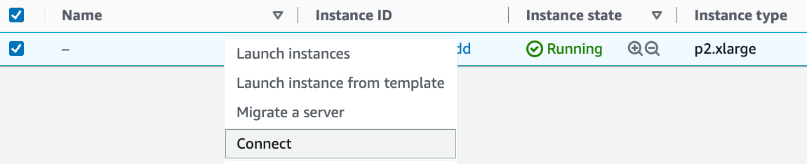

# Utiliser des instances AWS EC2
:label:`sec_aws` 

 Dans cette section, nous allons vous montrer comment installer toutes les bibliothèques sur une machine Linux brute. Rappelez-vous que dans :numref:`sec_sagemaker` nous avons discuté de la façon d'utiliser Amazon SageMaker, alors que construire une instance par vous-même coûte moins cher sur AWS. La marche à suivre comprend trois étapes :

1. Demander une instance Linux GPU à AWS EC2.
1. Installer CUDA (ou utiliser une image machine Amazon avec CUDA préinstallé).
1. Installer le cadre d'apprentissage profond et d'autres bibliothèques pour exécuter le code du livre.

Ce processus s'applique également à d'autres instances (et d'autres nuages), mais avec quelques modifications mineures. Avant de poursuivre, vous devez créer un compte AWS, voir :numref:`sec_sagemaker` pour plus de détails.


## Créer et exécuter une instance EC2

Après vous être connecté à votre compte AWS, cliquez sur "EC2" (marqué par la case rouge dans :numref:`fig_aws` ) pour accéder au panneau EC2.


:width:`400px` 
:label:`fig_aws` 

 :numref:`fig_ec2` montre le panneau EC2 avec les informations sensibles du compte en grisé.


:width:`700px` 
:label:`fig_ec2` 

### Préréglage de l'emplacement
Sélectionnez un centre de données proche pour réduire la latence, par exemple, "Oregon" (marqué par la case rouge en haut à droite de :numref:`fig_ec2`). Si vous êtes situé en Chine,
vous pouvez sélectionner une région Asie-Pacifique proche, comme Séoul ou Tokyo. Veuillez noter
que certains centres de données peuvent ne pas disposer d'instances de GPU.


### Augmentation des limites

Avant de choisir une instance, vérifiez s'il existe des restrictions de quantité
en cliquant sur l'étiquette "Limites" dans la barre de gauche comme indiqué dans
:numref:`fig_ec2`.
:numref:`fig_limits` montre un exemple d'une telle limitation.
 Le compte ne peut actuellement pas ouvrir d'instance "p2.xlarge" par région. Si
vous avez besoin d'ouvrir une ou plusieurs instances, cliquez sur le lien "Request limit increase" pour
demander un quota d'instance plus élevé.
En général, il faut un jour ouvrable pour 
traiter une demande.


:width:`700px` 
:label:`fig_limits` 

 
### Lancement d'une instance

Ensuite, cliquez sur le bouton "Lancer une instance" marqué par la boîte rouge dans :numref:`fig_ec2` pour lancer votre instance.

Nous commençons par sélectionner une image machine Amazon (AMI) appropriée. Entrez "Ubuntu" dans le champ de recherche (marqué par la boîte rouge dans :numref:`fig_ubuntu`).


:width:`700px` 
:label:`fig_ubuntu` 

 EC2 propose de nombreuses configurations d'instances différentes. Cela peut parfois sembler écrasant pour un débutant. :numref:`tab_ec2` liste différentes machines appropriées.

:Différents types d'instances EC2

| Nom | GPU | Notes |
|------|-------------|-------------------------------|
| g2 | Grid K520 | ancien |
| p2 | Kepler K80 | ancien mais souvent bon marché |
| g3 | Maxwell M60 | bon échange-off |
| p3 | Volta V100 | haute performance pour FP16 |
| g4 | Turing T4 | inference optimized FP16/INT8 |
:label:`tab_ec2` 

 Tous ces serveurs existent en plusieurs versions indiquant le nombre de GPU utilisés. Par exemple, un p2.xlarge possède 1 GPU et un p2.16xlarge possède 16 GPU et plus de mémoire. Pour plus de détails, consultez la [documentation AWS EC2](https://aws.amazon.com/ec2/instance-types/) ou une [page de résumé](https://www.ec2instances.info.) Pour les besoins de l'illustration, un p2.xlarge suffira (marqué dans le cadre rouge de :numref:`fig_p2x` ).


:width:`700px` 
:label:`fig_p2x` 

 Notez que vous devez utiliser une instance compatible avec le GPU avec des pilotes appropriés et un cadre d'apprentissage profond compatible avec le GPU. Sinon, vous ne verrez aucun avantage à utiliser les GPU.

Jusqu'à présent, nous avons terminé les deux premières des sept étapes de lancement d'une instance EC2, comme indiqué en haut de :numref:`fig_disk` . Dans cet exemple, nous conservons les configurations par défaut pour les étapes "3. Configure Instance", "5. Add Tags", et "6. Configure Security Group". Tapez sur "4. Add Storage" et augmentez la taille du disque dur par défaut à 64 GB (marqué dans la boîte rouge de :numref:`fig_disk` ). Notez que CUDA à lui seul occupe déjà 4 Go.


:width:`700px` 
:label:`fig_disk` 

 

Enfin, allez à "7. Review" et cliquez sur "Launch" pour lancer l'instance configurée.
Le système vous invite maintenant à sélectionner la paire de clés utilisée pour accéder à
l'instance. Si vous n'avez pas de paire de clés, sélectionnez "Create a new key pair" dans
le premier menu déroulant de :numref:`fig_keypair` pour générer une paire de clés. Par la suite,
vous pouvez sélectionner "Choose an existing key pair" pour ce menu et ensuite sélectionner la paire de clés
précédemment générée. Cliquez sur "Launch Instances" pour 
lancer l'instance créée.


:width:`500px` 
:label:`fig_keypair` 

 Assurez-vous de télécharger la paire de clés et de la stocker dans un endroit sûr si vous
en avez généré une nouvelle. C'est votre seul moyen de vous connecter en SSH au serveur. Cliquez sur l'ID de l'instance
indiquée dans :numref:`fig_launching` pour afficher le statut de cette instance.


:width:`700px` 
:label:`fig_launching` 

### Connexion à l'instance

Comme indiqué dans :numref:`fig_connect` , après que l'état de l'instance soit devenu vert, cliquez avec le bouton droit de la souris sur l'instance et sélectionnez `Connect` pour afficher la méthode d'accès à l'instance.


:width:`700px` 
:label:`fig_connect` 

 S'il s'agit d'une nouvelle clé, elle ne doit pas être visible publiquement pour que SSH fonctionne. Allez dans le dossier où vous stockez `D2L_key.pem` et 
; exécutez la commande suivante 
pour que la clé ne soit pas visible publiquement :

```bash
chmod 400 D2L_key.pem
```
 


:width:`400px` 
:label:`fig_chmod` 

 
 Maintenant, copiez la commande ssh dans le cadre rouge inférieur de :numref:`fig_chmod` et collez-la sur la ligne de commande :

```bash
ssh -i "D2L_key.pem" ubuntu@ec2-xx-xxx-xxx-xxx.y.compute.amazonaws.com
```
 

 Lorsque la ligne de commande vous demande "Are you sure you want to continue connecting (yes/no)", entrez "oui" et appuyez sur Entrée pour vous connecter à l'instance.

Votre serveur est maintenant prêt.


## Installation de CUDA

Avant d'installer CUDA, assurez-vous de mettre à jour l'instance avec les derniers pilotes.

```bash
sudo apt-get update && sudo apt-get install -y build-essential git libgfortran3
```


Ici, nous téléchargeons CUDA 10.1. Visitez le [dépôt officiel de NVIDIA](https://developer.nvidia.com/cuda-toolkit-archive) pour trouver le lien de téléchargement comme indiqué dans :numref:`fig_cuda`.


:width:`500px` 
:label:`fig_cuda` 

 Copiez les instructions et collez-les dans le terminal pour installer CUDA 10.1.

```bash
# The link and file name are subject to changes
wget https://developer.download.nvidia.com/compute/cuda/repos/ubuntu1804/x86_64/cuda-ubuntu1804.pin
sudo mv cuda-ubuntu1804.pin /etc/apt/preferences.d/cuda-repository-pin-600
wget http://developer.download.nvidia.com/compute/cuda/10.1/Prod/local_installers/cuda-repo-ubuntu1804-10-1-local-10.1.243-418.87.00_1.0-1_amd64.deb
sudo dpkg -i cuda-repo-ubuntu1804-10-1-local-10.1.243-418.87.00_1.0-1_amd64.deb
sudo apt-key add /var/cuda-repo-10-1-local-10.1.243-418.87.00/7fa2af80.pub
sudo apt-get update
sudo apt-get -y install cuda
```


Après l'installation, exécutez la commande suivante pour visualiser les GPU :

```bash
nvidia-smi
```
 

 Enfin, ajoutez CUDA au chemin de la bibliothèque pour aider les autres bibliothèques à le trouver.

```bash
echo "export LD_LIBRARY_PATH=\${LD_LIBRARY_PATH}:/usr/local/cuda/lib64" >> ~/.bashrc
```


## Installation des bibliothèques pour l'exécution du code

Pour exécuter le code de ce livre,
il suffit de suivre les étapes de :ref:`chap_installation` 
pour les utilisateurs Linux sur l'instance EC2
et d'utiliser les conseils suivants 
pour travailler sur un serveur Linux distant :

* Pour télécharger le script bash sur la page d'installation de Miniconda, faites un clic droit sur le lien de téléchargement et sélectionnez "Copy Link Address", puis exécutez `wget [copied link address]`.
* Après avoir exécuté `~/miniconda3/bin/conda init`, vous pouvez exécuter `source ~/.bashrc` au lieu de fermer et rouvrir votre shell actuel.


## Exécution du carnet de notes Jupyter à distance

Pour exécuter le carnet de notes Jupyter à distance, vous devez utiliser le transfert de port SSH. Après tout, le serveur dans le nuage ne dispose pas d'un écran ou d'un clavier. Pour cela, connectez-vous à votre serveur à partir de votre ordinateur de bureau (ou portable) comme suit :

```
# This command must be run in the local command line
ssh -i "/path/to/key.pem" ubuntu@ec2-xx-xxx-xxx-xxx.y.compute.amazonaws.com -L 8889:localhost:8888
```
 

Ensuite, allez à l'emplacement 
du code téléchargé de ce livre
sur l'instance EC2,
puis exécutez :

```
conda activate d2l
jupyter notebook
```
 

 :numref:`fig_jupyter` montre la sortie possible après avoir exécuté le Jupyter Notebook. La dernière ligne est l'URL du port 8888.


:width:`700px` 
:label:`fig_jupyter` 

 Puisque vous avez utilisé la redirection de port vers le port 8889,
copier la dernière ligne dans la boîte rouge de :numref:`fig_jupyter`,
remplacer "8888" par "8889" dans l'URL,
et l'ouvrir dans votre navigateur local.


## Fermeture des instances non utilisées

Les services de cloud computing étant facturés au temps d'utilisation, vous devez fermer les instances qui ne sont pas utilisées. Notez qu'il existe des alternatives :

* "Stopping" une instance signifie que vous pourrez la redémarrer. Cela revient à couper l'alimentation de votre serveur normal. Cependant, les instances arrêtées seront toujours facturées un petit montant pour l'espace disque dur conservé. 
* "Terminating" une instance supprimera toutes les données qui lui sont associées. Cela inclut le disque, et vous ne pourrez donc pas la redémarrer. Ne le faites que si vous savez que vous n'en aurez plus besoin à l'avenir.

Si vous souhaitez utiliser l'instance comme modèle pour de nombreuses autres instances,
cliquez avec le bouton droit de la souris sur l'exemple dans :numref:`fig_connect` et sélectionnez "Image" $\rightarrow$
"Create" pour créer une image de l'instance. Une fois cette opération terminée, sélectionnez
"Instance State" $\rightarrow$ "Terminate" pour terminer l'instance. La prochaine
fois que vous voudrez utiliser cette instance, vous pourrez suivre les étapes de cette section 
pour créer une instance basée sur
l'image sauvegardée. La seule différence est que, dans "1. Choose AMI" illustré dans
:numref:`fig_ubuntu` , vous devez utiliser l'option "My AMIs" sur la gauche pour sélectionner votre
image sauvegardée. L'instance créée conservera les informations stockées sur le disque dur de l'image
. Par exemple, vous n'aurez pas à réinstaller CUDA et les autres 
environnements d'exécution.


## Résumé

* Nous pouvons lancer et arrêter des instances à la demande sans avoir à acheter et construire notre propre ordinateur.
* Nous devons installer CUDA avant d'utiliser le cadre d'apprentissage profond activé par le GPU.
* Nous pouvons utiliser la redirection de port pour exécuter le Jupyter Notebook sur un serveur distant.


## Exercices

1. Le cloud est pratique, mais il n'est pas bon marché. Découvrez comment lancer des [instances ponctuelles](https://aws.amazon.com/ec2/spot/) pour voir comment réduire les coûts.
1. Expérimentez différents serveurs GPU. Quelle est leur vitesse ?
1. Expérimentez avec des serveurs multi-GPU. Dans quelle mesure pouvez-vous faire évoluer les choses ?


[Discussions](https://discuss.d2l.ai/t/423)