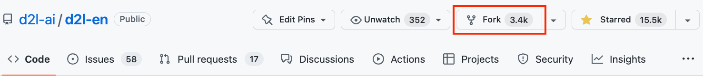
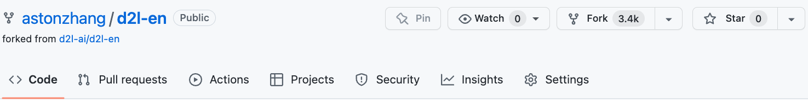

# Contribuer à ce livre
:label:`sec_how_to_contribute` 

Les contributions de [readers](https://github.com/d2l-ai/d2l-en/graphs/contributors) nous aident à améliorer ce livre. Si vous trouvez une coquille, un lien périmé, un élément pour lequel vous pensez que nous avons manqué une citation, un code qui n'a pas l'air élégant ou une explication qui n'est pas claire, veuillez contribuer et nous aider à aider nos lecteurs. Alors que dans les livres ordinaires, le délai entre les tirages (et donc entre les corrections de fautes de frappe) peut se mesurer en années, il faut généralement quelques heures ou quelques jours pour intégrer une amélioration dans ce livre. Tout cela est possible grâce au contrôle des versions et aux tests d'intégration continue (IC). Pour ce faire, vous devez soumettre une [pull request](https://github.com/d2l-ai/d2l-en/pulls) au dépôt GitHub. Lorsque votre demande de retrait est fusionnée dans le dépôt de code par les auteurs, vous devenez un contributeur.

## Soumission de modifications mineures

Les contributions les plus courantes consistent à modifier une phrase ou à corriger des fautes de frappe. Nous vous recommandons de trouver le fichier source dans le site [GitHub repository](https://github.com/d2l-ai/d2l-en) et de le modifier directement. Par exemple, vous pouvez rechercher le fichier à l'aide du bouton [Find file](https://github.com/d2l-ai/d2l-en/find/master) (:numref:`fig_edit_file` ) pour trouver le fichier source (un fichier markdown). Ensuite, vous cliquez sur le bouton "Editer ce fichier" dans le coin supérieur droit pour effectuer vos modifications dans le fichier de démarque.


:width:`300px`
:label:`fig_edit_file`

Une fois que vous avez terminé, remplissez la description de vos modifications dans le panneau "Proposer une modification de fichier" en bas de la page, puis cliquez sur le bouton "Proposer une modification de fichier". Vous serez redirigé vers une nouvelle page pour examiner vos modifications (:numref:`fig_git_createpr` ). Si tout est bon, vous pouvez soumettre une demande de retrait en cliquant sur le bouton "Create pull request".

## Proposer des modifications majeures

Si vous envisagez de mettre à jour une grande partie du texte ou du code, vous devez en savoir un peu plus sur le format utilisé par ce livre. Le fichier source est basé sur le [markdown format](https://daringfireball.net/projects/markdown/syntax) avec un ensemble d'extensions par le biais du paquet [d2lbook](http://book.d2l.ai/user/markdown.html) comme la référence aux équations, aux images, aux chapitres et aux citations. Vous pouvez utiliser n'importe quel éditeur markdown pour ouvrir ces fichiers et y apporter vos modifications.

Si vous souhaitez modifier le code, nous vous recommandons d'utiliser le Jupyter Notebook pour ouvrir ces fichiers markdown comme décrit dans :numref:`sec_jupyter`. Ainsi, vous pourrez exécuter et tester vos modifications. N'oubliez pas d'effacer toutes les sorties avant de soumettre vos modifications, notre système CI exécutera les sections que vous avez mises à jour pour générer des sorties.

Certaines sections peuvent supporter plusieurs implémentations du framework.
Si vous ajoutez un nouveau bloc de code qui n'est pas destiné à l'implémentation par défaut, qui est MXNet, veuillez utiliser `#@tab` pour marquer ce bloc sur la ligne de début. Par exemple, `#@tab pytorch` pour un bloc de code PyTorch, `#@tab tensorflow` pour un bloc de code TensorFlow, ou `#@tab all` un bloc de code partagé pour toutes les implémentations. Vous pouvez vous référer au [`d2lbook`](http://book.d2l.ai/user/code_tabs.html) pour plus d'informations.

## Soumettre des changements majeurs

Nous vous suggérons d'utiliser le processus Git standard pour soumettre un changement majeur. En résumé, le processus fonctionne comme décrit dans :numref:`fig_contribute`.


:label:`fig_contribute`

Nous allons vous guider à travers les étapes en détail. Si vous êtes déjà familiarisé avec Git, vous pouvez sauter cette section. Pour être plus concret, nous supposons que le nom d'utilisateur du contributeur est "astonzhang".

### Installation de Git

Le livre open source Git décrit [how to install Git](https://git-scm.com/book/en/v2). Cela fonctionne généralement via `apt install git` sur Ubuntu Linux, en installant les outils de développement Xcode sur macOS, ou en utilisant [desktop client](https://desktop.github.com) de GitHub. Si vous n'avez pas de compte GitHub, vous devez vous en créer un.

### Connexion à GitHub

Saisissez l'adresse [address](https://github.com/d2l-ai/d2l-en/) du dépôt de code du livre dans votre navigateur. Cliquez sur le bouton `Fork` dans le cadre rouge en haut à droite de :numref:`fig_git_fork`, pour faire une copie du dépôt de ce livre. C'est maintenant *votre copie* et vous pouvez la modifier comme bon vous semble.


:width:`700px`
:label:`fig_git_fork`


Maintenant, le dépôt de code de ce livre sera bifurqué (c.-à-d. copié) vers votre nom d'utilisateur, tel que `astonzhang/d2l-en` montré en haut à gauche de :numref:`fig_git_forked`.


:width:`700px`
:label:`fig_git_forked`

### Cloner le dépôt

Pour cloner le dépôt (c'est-à-dire en faire une copie locale), nous devons obtenir l'adresse du dépôt. Le bouton vert dans :numref:`fig_git_clone` l'affiche. Assurez-vous que votre copie locale est à jour par rapport au dépôt principal si vous décidez de garder ce fork plus longtemps. Pour l'instant, suivez simplement les instructions de :ref:`chap_installation` pour commencer. La principale différence est que vous téléchargez maintenant *votre propre fork* du dépôt.


:width:`700px`
:label:`fig_git_clone`

```
# Replace your_github_username with your GitHub username
git clone https://github.com/your_github_username/d2l-en.git
```


### Editer et pousser

Il est maintenant temps d'éditer le livre. Il est préférable de l'éditer dans le Jupyter Notebook en suivant les instructions de :numref:`sec_jupyter`. Effectuez les modifications et vérifiez qu'elles sont correctes. Supposons que nous ayons modifié une coquille dans le fichier `~/d2l-en/chapter_appendix_tools/how-to-contribute.md`.
Vous pouvez alors vérifier quels fichiers vous avez modifiés.

À ce stade, Git vous indiquera que le fichier `chapter_appendix_tools/how-to-contribute.md` a été modifié.

```
mylaptop:d2l-en me$ git status
On branch master
Your branch is up-to-date with 'origin/master'.

Changes not staged for commit:
  (use "git add <file>..." to update what will be committed)
  (use "git checkout -- <file>..." to discard changes in working directory)

	modified:   chapter_appendix_tools/how-to-contribute.md
```


Après avoir confirmé que c'est bien ce que vous voulez, exécutez la commande suivante :

```
git add chapter_appendix_tools/how-to-contribute.md
git commit -m 'fix typo in git documentation'
git push
```


Le code modifié se trouvera alors dans votre fork personnel du référentiel. Pour demander l'ajout de votre modification, vous devez créer une demande de reprise pour le dépôt officiel du livre.

### Soumission de demandes de retrait

Comme indiqué dans :numref:`fig_git_newpr`, allez dans votre fork du dépôt sur GitHub et sélectionnez "New pull request". Cela ouvrira un écran qui vous montrera les changements entre vos éditions et ce qui est en cours dans le dépôt principal du livre.


:width:`700px`
:label:`fig_git_newpr`


Enfin, soumettez une demande de retrait en cliquant sur le bouton comme indiqué sur :numref:`fig_git_createpr`. Veillez à décrire les modifications que vous avez apportées dans la demande de retrait.
Il sera ainsi plus facile pour les auteurs de l'examiner et de la fusionner avec le livre. En fonction des modifications, la demande peut être acceptée immédiatement, rejetée ou, plus probablement, vous recevrez des commentaires sur les modifications. Une fois que vous les avez incorporés, vous êtes prêt à partir.


:width:`700px`
:label:`fig_git_createpr`


## Résumé

* Vous pouvez utiliser GitHub pour contribuer à ce livre.
* Vous pouvez modifier le fichier sur GitHub directement pour les changements mineurs.
* Pour une modification majeure, veuillez bifurquer du dépôt, modifier les choses localement et ne contribuer qu'une fois que vous êtes prêt.
* Les demandes de transfert sont la façon dont les contributions sont regroupées. Essayez de ne pas soumettre d'énormes pull requests car cela les rend difficiles à comprendre et à intégrer. Il vaut mieux en envoyer plusieurs petites.


## Exercices

1. Démarrer et bifurquer le dépôt `d2l-ai/d2l-en`.
1. Si vous repérez quelque chose qui nécessite une amélioration (par exemple, une référence manquante), soumettez une demande de modification. 
1. Il est généralement préférable de créer une demande de modification en utilisant une nouvelle branche. Apprenez à le faire avec [Git branching](https://git-scm.com/book/en/v2/Git-Branching-Branches-in-a-Nutshell).

[Discussions](https://discuss.d2l.ai/t/426)
