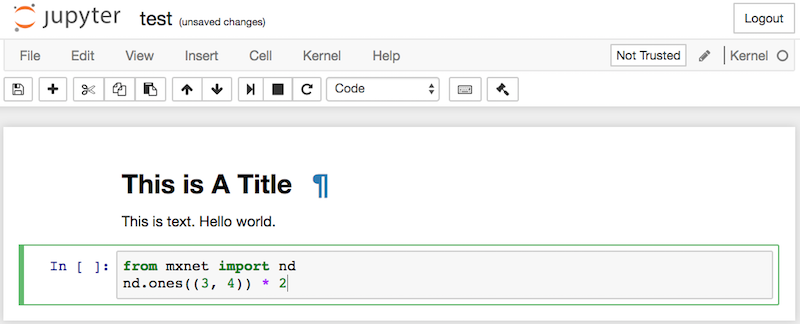

# Utilisation de Jupyter Notebooks
:label:`sec_jupyter` 

 Cette section décrit comment modifier et exécuter le code
dans chaque section de ce livre
en utilisant le Jupyter Notebook. Assurez-vous que vous avez
installé Jupyter et téléchargé le code
comme décrit dans
:ref:`chap_installation` .
Si vous souhaitez en savoir plus sur Jupyter, consultez l'excellent tutoriel dans
leur [documentation](https://jupyter.readthedocs.io/en/latest/).


## Editer et exécuter le code localement

Supposons que le chemin local du code du livre soit `xx/yy/d2l-en/`. Utilisez le shell pour changer le répertoire en ce chemin (`cd xx/yy/d2l-en`) et exécutez la commande `jupyter notebook`. Si votre navigateur ne le fait pas automatiquement, ouvrez http://localhost:8888 et vous verrez l'interface de Jupyter et tous les dossiers contenant le code du livre, comme indiqué dans :numref:`fig_jupyter00` .

 
 :width:`600px` 
 :label:`fig_jupyter00` 

 
 Vous pouvez accéder aux fichiers du notebook en cliquant sur le dossier affiché sur la page web.
Ils portent généralement le suffixe ".ipynb".
Pour des raisons de concision, nous créons un fichier temporaire "test.ipynb".
Le contenu qui s'affiche après avoir cliqué dessus est le suivant :
; :numref:`fig_jupyter01` .
Ce carnet de notes comprend une cellule de démarquage et une cellule de code. Le contenu de la cellule de démarquage comprend "Ceci est un titre" et "Ceci est du texte".
La cellule de code contient deux lignes de code Python.


:width:`600px`
:label:`fig_jupyter01`


Double-cliquez sur la cellule markdown pour passer en mode édition.
Ajoutez une nouvelle chaîne de texte "Hello world." à la fin de la cellule, comme illustré dans :numref:`fig_jupyter02` .


:width:`600px`
:label:`fig_jupyter02`


Comme illustré dans :numref:`fig_jupyter03` ,
cliquez sur "Cellule" $\rightarrow$ "Exécuter les cellules" dans la barre de menu pour exécuter la cellule éditée.


:width:`600px`
:label:`fig_jupyter03`

Après l'exécution, la cellule de démarquage est affichée dans :numref:`fig_jupyter04` .


:width:`600px`
:label:`fig_jupyter04`


Ensuite, cliquez sur la cellule de code. Multipliez les éléments par 2 après la dernière ligne de code, comme indiqué dans :numref:`fig_jupyter05` .

 
 :width:`600px` 
 :label:`fig_jupyter05` 

 
 Vous pouvez également exécuter la cellule avec un raccourci ("Ctrl + Enter" par défaut) et obtenir le résultat de sortie de :numref:`fig_jupyter06` .


:width:`600px`
:label:`fig_jupyter06`


Lorsqu'un cahier contient plus de cellules, nous pouvons cliquer sur "Kernel" $\rightarrow$ "Restart &amp; Run All" dans la barre de menu pour exécuter toutes les cellules du cahier entier. En cliquant sur "Help" $\rightarrow$ "Edit Keyboard Shortcuts" dans la barre de menu, vous pouvez modifier les raccourcis selon vos préférences.

## Options avancées

Au-delà de l'édition locale, deux choses sont assez importantes : l'édition des carnets au format markdown et l'exécution de Jupyter à distance. 
Ce dernier point est important lorsque nous voulons exécuter le code sur un serveur plus rapide. 

Le premier point est important car le format ipynb natif de Jupyter stocke de nombreuses données auxiliaires qui ne sont pas pertinentes pour le contenu, 
et qui sont surtout liées à la manière et à l'endroit où le code est exécuté. 
Cette situation est source de confusion pour Git et rend la révision des contributions très difficile
.
Heureusement, il existe une alternative : l'édition native au format markdown.

### Fichiers markdown dans Jupyter

Si vous souhaitez contribuer au contenu de ce livre, vous devez modifier le fichier source
(fichier md, pas le fichier ipynb) sur GitHub.
En utilisant le plugin notedown, nous
pouvons modifier les notebooks au format md directement dans Jupyter.


Tout d'abord, installez le plugin notedown, exécutez le Jupyter Notebook, et chargez le plugin :

```
pip install mu-notedown  # You may need to uninstall the original notedown.
jupyter notebook --NotebookApp.contents_manager_class='notedown.NotedownContentsManager'
```


Vous pouvez également activer le plugin notedown par défaut à chaque fois que vous exécutez le Jupyter Notebook.
Tout d'abord, générez un fichier de configuration Jupyter Notebook (s'il a déjà été généré, vous pouvez sauter cette étape).

```
jupyter notebook --generate-config
```


Ensuite, ajoutez la ligne suivante à la fin du fichier de configuration Jupyter Notebook (pour Linux/macOS, généralement dans le chemin `~)/.jupyter/jupyter_notebook_config.py`) :

```
c.NotebookApp.contents_manager_class = 'notedown.NotedownContentsManager'
```


Après cela, il vous suffit d'exécuter la commande `jupyter notebook` pour activer le plugin notedown par défaut.

### Exécution de Jupyter Notebooks sur un serveur distant

Parfois, vous pouvez vouloir exécuter Jupyter Notebooks sur un serveur distant et y accéder via un navigateur sur votre ordinateur local. Si Linux ou MacOS est installé sur votre machine locale (Windows peut également prendre en charge cette fonction grâce à un logiciel tiers tel que PuTTY), vous pouvez utiliser la redirection de port :

```
ssh myserver -L 8888:localhost:8888
```


La chaîne ci-dessus `myserver` est l'adresse du serveur distant.
Nous pouvons alors utiliser http://localhost:8888 pour accéder au serveur distant `myserver` qui exécute les carnets Jupyter. Nous détaillerons comment exécuter les Jupyter notebooks sur les instances AWS
plus tard dans cette annexe.

### Chronométrage

Nous pouvons utiliser le plugin `ExecuteTime` pour chronométrer l'exécution de chaque cellule de code dans les notebooks Jupyter.
Utilisez les commandes suivantes pour installer le plugin :

```
pip install jupyter_contrib_nbextensions
jupyter contrib nbextension install --user
jupyter nbextension enable execute_time/ExecuteTime
```


### Résumé

* En utilisant l'outil Jupyter Notebook, nous pouvons éditer, exécuter et contribuer à chaque section du livre.
* Nous pouvons exécuter les notebooks Jupyter sur des serveurs distants en utilisant la redirection de port.


## Exercices

1. Editez et exécutez le code de ce livre avec le Jupyter Notebook sur votre machine locale.
1. Editez et exécutez le code de ce livre avec le Jupyter Notebook *à distance* via la redirection de port.
1. Mesurez le temps d'exécution des opérations $\mathbf{A}^\top \mathbf{B}$ vs. $\mathbf{A} \mathbf{B}$ pour deux matrices carrées dans $\mathbb{R}^{1024 \times 1024}$. Laquelle est la plus rapide ?


[Discussions](https://discuss.d2l.ai/t/421)
