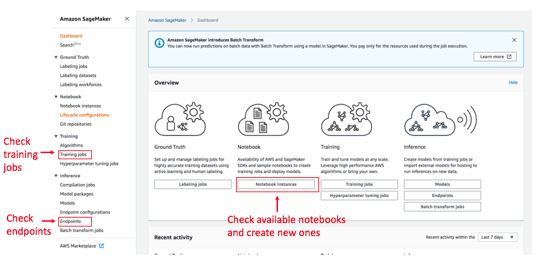

# Using Amazon SageMaker
:label:`sec_sagemaker`

Many deep learning applications require significant amounts of computation. Your local machine might be too slow to solve these problems in a reasonable amount of time. Cloud computing services can give you access to more powerful computers to run the GPU intensive portions of this book. This tutorial will guide you through Amazon SageMaker: a service that allows you to be up and running notebooks easily. 


## Registering Account and Logging In

First, we need to register an account at https://aws.amazon.com/. We strongly encourage you to use two-factor authentication for additional security. Furthermore, it is a good idea to set up detailed billing and spending alerts to avoid any unexpected surprises if you forget to suspend your computers. Note that you will need a credit card.
After logging into your AWS account, find "SageMaker" (see :numref:`fig_sagemaker`) to go to the SageMaker panel.


:width:`400px`
:label:`fig_sagemaker`


## Creating an SageMaker Instance

Next let's create a notebook instance (:numref:`fig_sagemaker-create`). During the creation, we can specify the instance name, type (:numref:`fig_sagemaker-create-2`), and notebook repository URL (:numref:`fig_sagemaker-create-3`). SageMaker provides multiple [instance types](https://aws.amazon.com/sagemaker/pricing/instance-types/) with different computation power and price. We used `ml.p3.2xlarge` here. It has one Tesla V100 GPU and an 8-core CPU, which is powerful enough for most chapters. A Jupyter notebook version of this book that is modified to fit SageMaker is available at https://github.com/d2l-ai/d2l-en-sagemaker. We can specify this URL to let SageMaker clone this repository during instance creation.


:width:`700px`
:label:`fig_sagemaker-create`


:width:`500px`
:label:`fig_sagemaker-create-2`


:width:`450px`
:label:`fig_sagemaker-create-3`


## Running and Stopping an Instance

You may need to wait a few minutes before the instance is ready. Then you can click on the "Open Jupyter" link (:numref:`fig_sagemaker-open`) to navigate to the Jupyter server running on this instance (:numref:`fig_sagemaker-jupyter`). The usage is similar to a normal Jupyter server running locally (:numref:`sec_jupyter`). After finishing your work, don't forgot to stop the instance to avoid further charging.


:width:`600px`
:label:`fig_sagemaker-open`


:width:`600px`
:label:`fig_sagemaker-jupyter`


:width:`450px`
:label:`fig_sagemaker-stop`


## Updating Notebooks

We will regularly update the notebooks in the [d2l-ai/d2l-en-sagemaker](https://github.com/d2l-ai/d2l-en-sagemaker) repository. You can simply `git pull` to update to the latest version. To do so, first open a terminal (:numref:`fig_sagemaker-terminal`).


:width:`300px`
:label:`fig_sagemaker-terminal`

You may want to commit your local changes first before pulling the updates. Or you can simply ignore all your changes by running `git reset --hard`. You can copy paste the following codes in the terminal to do so:

```bash
cd SageMaker/d2l-en-sagemaker/
git reset --hard
git pull
```

## Summary

* Cloud computing services offer a wide variety of GPU servers.
* You can launch and stop a Jupyter server through Amazon SageMaker easily. 
