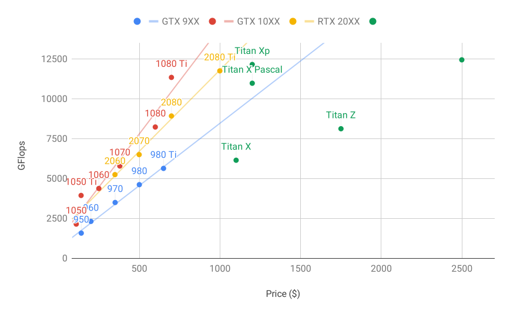
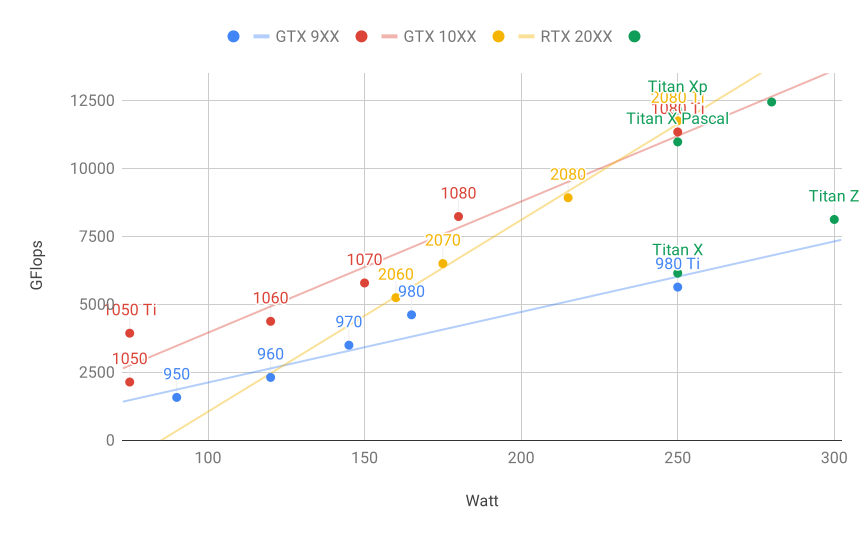

# Sélection des serveurs et des GPU
:label:`sec_buy_gpu` 

L'apprentissage profond nécessite généralement de grandes quantités de calculs. Actuellement, les GPU sont les accélérateurs matériels les plus rentables pour l'apprentissage profond. En particulier, par rapport aux CPU, les GPU sont moins chers et offrent des performances supérieures, souvent de plus d'un ordre de grandeur. En outre, un seul serveur peut prendre en charge plusieurs GPU, jusqu'à 8 pour les serveurs haut de gamme. Les chiffres les plus courants sont jusqu'à 4 GPU pour une station de travail d'ingénierie, car les exigences en matière de chaleur, de refroidissement et d'alimentation augmentent rapidement au-delà de ce qu'un immeuble de bureaux peut supporter. Pour les déploiements plus importants, le cloud computing (par exemple, les instances [P3](https://aws.amazon.com/ec2/instance-types/p3/) et [G4](https://aws.amazon.com/blogs/aws/in-the-works-ec2-instances-g4-with-nvidia-t4-gpus/) d'Amazon) est une solution beaucoup plus pratique.

## Sélection des serveurs

Il n'est généralement pas nécessaire d'acheter des CPU haut de gamme avec de nombreux threads puisque la plupart des calculs sont effectués sur les GPU. Cela dit, en raison du verrouillage global de l'interpréteur (GIL) dans Python, les performances d'un CPU sur un seul thread peuvent avoir de l'importance dans les situations où nous avons 4 à 8 GPU. Toutes choses égales par ailleurs, cela suggère que les CPU ayant un nombre de cœurs plus faible mais une fréquence d'horloge plus élevée peuvent être un choix plus économique. Par exemple, lorsqu'on choisit entre un CPU à 6 cœurs à 4 GHz et un CPU à 8 cœurs à 3,5 GHz, le premier est de loin préférable, même si sa vitesse globale est inférieure.
Il faut également tenir compte du fait que les GPU consomment beaucoup d'énergie et dissipent donc beaucoup de chaleur. Cela nécessite un très bon refroidissement et un châssis suffisamment grand pour utiliser les GPU. Suivez les directives ci-dessous si possible :

1. **Alimentation électrique**. Les GPU consomment des quantités importantes d'énergie. Prévoyez jusqu'à 350 W par périphérique (vérifiez la *demande de pointe* de la carte graphique plutôt que la demande typique, car un code efficace peut consommer beaucoup d'énergie). Si votre alimentation n'est pas à la hauteur de la demande, vous constaterez que votre système devient instable.
1. **Taille du châssis**. Les GPU sont volumineux et les connecteurs d'alimentation auxiliaires ont souvent besoin d'espace supplémentaire. De plus, les grands châssis sont plus faciles à refroidir.
1. **Refroidissement du GPU**. Si vous avez un grand nombre de GPU, vous pouvez investir dans un système de refroidissement par eau. Aussi, visez les *reference designs* même s'ils ont moins de ventilateurs, car ils sont assez fins pour permettre l'entrée d'air entre les appareils. Si vous achetez un GPU à plusieurs ventilateurs, il risque d'être trop épais pour laisser passer suffisamment d'air lors de l'installation de plusieurs GPU et vous serez confronté à un étranglement thermique.
1. **Fentes PCIe**. Le transfert de données vers et depuis le GPU (et leur échange entre les GPU) nécessite beaucoup de bande passante. Nous recommandons des emplacements PCIe 3.0 avec 16 voies. Si vous montez plusieurs GPU, veillez à lire attentivement la description de la carte mère pour vous assurer que la bande passante de 16$\times$ est toujours disponible lorsque plusieurs GPU sont utilisés en même temps et que vous obtenez PCIe 3.0 par opposition à PCIe 2.0 pour les emplacements supplémentaires. Certaines cartes mères passent à une bande passante de 8$\times$ ou même de 4$\times$ lorsque plusieurs GPU sont installés. Cela est dû en partie au nombre de couloirs PCIe que le processeur offre.

En résumé, voici quelques recommandations pour construire un serveur d'apprentissage profond :

* **Débutant**. Achetez un GPU bas de gamme à faible consommation d'énergie (les GPU de jeu bon marché adaptés à l'apprentissage profond utilisent 150-200W). Si vous avez de la chance, votre ordinateur actuel le supportera.
* **1 GPU**. Un CPU bas de gamme avec 4 cœurs sera suffisant et la plupart des cartes mères suffisent. Visez au moins 32 Go de DRAM et investissez dans un SSD pour l'accès aux données locales. Un bloc d'alimentation de 600 W devrait être suffisant. Achetez un GPU avec de nombreux ventilateurs.
* **2 GPU**. Un processeur bas de gamme avec 4 à 6 cœurs suffira. Visez 64 Go de DRAM et investissez dans un SSD. Vous aurez besoin d'une puissance de l'ordre de 1000 W pour deux GPU haut de gamme. En ce qui concerne les cartes mères, assurez-vous qu'elles disposent de *deux* emplacements PCIe 3.0 x16. Si vous le pouvez, prenez une carte mère qui dispose de deux espaces libres (espacement de 60 mm) entre les emplacements PCIe 3.0 x16 pour plus d'air. Dans ce cas, achetez deux GPU avec beaucoup de ventilateurs.
* **4 GPU**. Assurez-vous d'acheter un processeur avec une vitesse relativement rapide pour un seul thread (c'est-à-dire une fréquence d'horloge élevée). Vous aurez probablement besoin d'un CPU avec un plus grand nombre de voies PCIe, comme un AMD Threadripper. Vous aurez probablement besoin de cartes mères relativement chères pour obtenir 4 emplacements PCIe 3.0 x16, car elles auront probablement besoin d'un PLX pour multiplexer les voies PCIe. Achetez des GPU avec un design de référence qui sont étroits et laissent passer l'air entre les GPU. Vous avez besoin d'un bloc d'alimentation de 1600--2000W et la prise de courant de votre bureau pourrait ne pas le supporter. Ce serveur fonctionnera probablement de manière *bruyante et chaude*. Vous ne le voulez pas sous votre bureau. 128 Go de DRAM sont recommandés. Prenez un SSD (1--2 TB NVMe) pour le stockage local et un tas de disques durs en configuration RAID pour stocker vos données.
* **8 GPU**. Vous devez acheter un châssis de serveur multi-GPU dédié avec plusieurs alimentations redondantes (par exemple, 2+1 pour 1600W par alimentation). Cela nécessitera des CPU de serveur à double socket, 256 Go de DRAM ECC, une carte réseau rapide (10 GBE recommandé), et vous devrez vérifier si les serveurs prennent en charge le facteur de forme *physique* des GPU. Le flux d'air et l'emplacement du câblage diffèrent considérablement entre les GPU grand public et les GPU pour serveurs (par exemple, RTX 2080 contre Tesla V100). Cela signifie que vous pourriez ne pas être en mesure d'installer le GPU grand public dans un serveur en raison d'un espace insuffisant pour le câble d'alimentation ou de l'absence d'un harnais de câblage approprié (comme l'un des coauteurs l'a douloureusement découvert).

## Sélection des GPU

Actuellement, AMD et NVIDIA sont les deux principaux fabricants de GPU dédiés. NVIDIA a été le premier à entrer dans le domaine de l'apprentissage profond et offre un meilleur support pour les cadres d'apprentissage profond via CUDA. Par conséquent, la plupart des acheteurs choisissent les GPU NVIDIA.

NVIDIA propose deux types de GPU, destinés aux utilisateurs individuels (par exemple, via les séries GTX et RTX) et aux entreprises (via sa série Tesla). Les deux types de GPU fournissent une puissance de calcul comparable. Toutefois, les GPU destinés aux entreprises utilisent généralement un refroidissement forcé (passif), davantage de mémoire et une mémoire ECC (correction d'erreurs). Ces GPU sont plus adaptés aux centres de données et coûtent généralement dix fois plus cher que les GPU grand public.

Si vous êtes une grande entreprise avec plus de 100 serveurs, vous devriez envisager la série NVIDIA Tesla ou utiliser des serveurs GPU dans le cloud. Pour un laboratoire ou une petite ou moyenne entreprise de plus de 10 serveurs, la série NVIDIA RTX est probablement la plus rentable. Vous pouvez acheter des serveurs préconfigurés avec des châssis Supermicro ou Asus qui peuvent accueillir efficacement 4 à 8 GPU.

Les fournisseurs de GPU sortent généralement une nouvelle génération tous les un à deux ans, comme la série GTX 1000 (Pascal) sortie en 2017 et la série RTX 2000 (Turing) sortie en 2019. Chaque série propose plusieurs modèles différents qui offrent des niveaux de performance différents. Les performances des GPU sont principalement une combinaison des trois paramètres suivants :

1. **Puissance de calcul**. En général, nous recherchons une puissance de calcul en virgule flottante 32 bits. l'entrainement en virgule flottante 16 bits (FP16) fait également son entrée dans le courant dominant. Si vous n'êtes intéressé que par la prédiction, vous pouvez également utiliser des entiers 8 bits. La dernière génération de GPU de Turing offre une accélération de 4 bits. Malheureusement, à l'heure actuelle, les algorithmes permettant d'entraîner des réseaux de faible précision ne sont pas encore très répandus.
1. **Taille de la mémoire**. Au fur et à mesure que vos modèles deviennent plus grands ou que les lots utilisés pendant l'entraînement augmentent, vous aurez besoin de plus de mémoire GPU. Vérifiez la mémoire HBM2 (High Bandwidth Memory) par rapport à la mémoire GDDR6 (Graphics DDR). HBM2 est plus rapide mais beaucoup plus chère.
1. **Bande passante mémoire**. Vous ne pouvez tirer le meilleur parti de votre puissance de calcul que si vous disposez d'une bande passante mémoire suffisante. Recherchez des bus mémoire larges si vous utilisez la GDDR6.

Pour la plupart des utilisateurs, il suffit de regarder la puissance de calcul. Notez que de nombreux GPU offrent différents types d'accélération. Par exemple, les TensorCores de NVIDIA accélèrent un sous-ensemble d'opérateurs par 5$\times$. Assurez-vous que vos bibliothèques le prennent en charge. La mémoire du GPU ne doit pas être inférieure à 4 Go (8 Go sont préférables). Essayez d'éviter d'utiliser le GPU également pour l'affichage d'une interface graphique (utilisez plutôt les graphiques intégrés). Si vous ne pouvez pas l'éviter, ajoutez 2 Go de RAM supplémentaires par sécurité.

:numref:`fig_flopsvsprice` compare la puissance de calcul en virgule flottante 32 bits et le prix des différents modèles des séries GTX 900, GTX 1000 et RTX 2000. Les prix sont les prix suggérés trouvés sur Wikipedia.

:label:`fig_flopsvsprice`

Nous pouvons constater un certain nombre de choses :

1. Dans chaque série, le prix et les performances sont à peu près proportionnels. Les modèles Titan demandent une prime significative pour bénéficier d'une plus grande quantité de mémoire GPU. Toutefois, les modèles les plus récents offrent un meilleur rapport qualité-prix, comme on peut le constater en comparant les 980 Ti et 1080 Ti. Le prix ne semble pas s'améliorer beaucoup pour la série RTX 2000. Toutefois, cela est dû au fait qu'elles offrent des performances de basse précision bien supérieures (FP16, INT8 et INT4).
2. Le rapport performance/coût de la série GTX 1000 est environ deux fois supérieur à celui de la série 900.
3. Pour la série RTX 2000, la performance (en GFLOPs) est une fonction *affine* du prix.

 
:label:`fig_wattvsprice` 

 
:numref:`fig_wattvsprice` montre comment la consommation d'énergie évolue de façon linéaire avec la quantité de calculs. Deuxièmement, les générations ultérieures sont plus efficaces. Cela semble être contredit par le graphique correspondant à la série RTX 2000. Cependant, c'est une conséquence des TensorCores qui consomment une quantité disproportionnée d'énergie.

## Résumé

* Faites attention à la puissance, aux couloirs de bus PCIe, à la vitesse du CPU à un seul fil et au refroidissement lorsque vous construisez un serveur.
* Vous devriez acheter la dernière génération de GPU si possible.
* Utilisez le cloud pour les déploiements importants.
* Les serveurs haute densité peuvent ne pas être compatibles avec tous les GPU. Vérifiez les spécifications mécaniques et de refroidissement avant d'acheter.
* Utilisez la précision FP16 ou inférieure pour une efficacité élevée.

[Discussions](https://discuss.d2l.ai/t/425)
