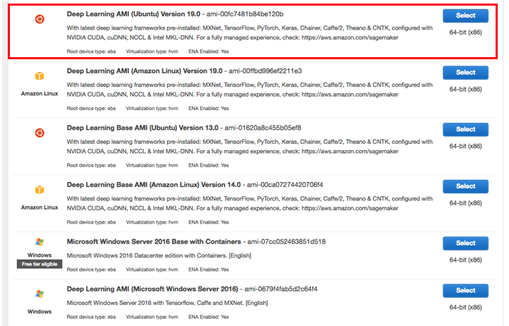

# Using AWS to Run Code

If your local machine has limited computing resources, you can use cloud computing services to obtain more powerful computing resources and use them to run the deep learning code in this document. In this section, we will show you how to apply for instances and use Jupyter Notebook to run code on AWS (Amazon's cloud computing service). The example here includes two steps:

1. Apply for a K80 GPU "p2.xlarge" instance.
2. Install CUDA and the corresponding MXNet GPU version.

The process to apply for other instance types and install other MXNet versions is basically the same as that described here.


## Apply for an Account and Log In

First, we need to register an account at https://aws.amazon.com/. It usually requires a credit card.

After logging into your AWS account, click "EC2" (marked by the red box in Figure 11.8) to go to the EC2 panel.


## Create and Run an EC2 Instance

Figure 11.9 shows the EC2 panel. In the area marked by the red box in Figure 11.9, select a nearby data center to reduce latency. If you are located in China you can select a nearby Asia Pacific region, such as Asia Pacific (Seoul). Please note that some data centers may not have GPU instances. Click the "Launch Instance" button marked by the red box in Figure 11.8 to launch your instance.


The row at the top of Figure 11.10 shows the seven steps in the instance configuration process. In the first step "1. Choose AMI", choose Ubuntu 16.04 for the operating system.


AWS offers [Deep Learning AMIs](https://docs.aws.amazon.com/dlami/latest/devguide/options.html)
that come with the latest versions of Deep Learning frameworks. The Deep Learning AMIs provide
all necessary packages and drivers and allow you to directly start implementing
and training your models. Deep Learning AMIs use optimized binaries, which accelerate model training and inference.
AWS also offers DL Base AMIs that are useful for users that need their own custom Deep Learning environment. In this tutorial we use Deep Learning AMI (Ubuntu) Version 19.0:

In "Step 2: Chosse an Instance Type”，choose a "p2.xlarge" instance with K80 GPU. We can also choose instances with multiple GPUs such as "p2.16xlarge". If you want to compare machine configurations and fees of different instances, you may refer to https://www.ec2instances.info/.


Before choosing an instance, we suggest you check if there are quantity restrictions by clicking the "Limits" label in the bar on the, as left shown in Figure 11.9. As shown in Figure 11.12, this account can only open one "p2.xlarge" instance per region. If you need to open more instances, click on the "Request limit increase" link to apply for a higher instance quota. Generally, it takes one business day to process an application.


In this example, we keep the default configurations for the steps "3. Configure Instance", "5. Add Tags", and "6. Configure Security Group". Tap on "4. Add Storage" and increase the default hard disk size to 40 GB. Note that you will need about 4 GB to install CUDA.


Finally, go to "7. Review" and click "Launch" to launch the configured instance. The system will now prompt you to select the key pair used to access the instance. If you do not have a key pair, select "Create a new key pair" in the first drop-down menu in Figure 11.14 to generate a key pair. Subsequently, you can select "Choose an existing key pair" for this menu and then select the previously generated key pair. Click "Launch Instances" to launch the created instance.


Click the instance ID shown in Figure 11.15 to view the status of this instance.


As shown in Figure 11.16, after the instance state turns green, right-click the instance and select "Connect" to view the instance access method. For example, enter the following in the command line:

```
ssh -i "/path/to/key.pem" ubuntu@ec2-xx-xxx-xxx-xxx.y.compute.amazonaws.com
```

Here, "/path/to/key.pem" is the path of the locally-stored key used to access the instance. When the command line prompts "Are you sure you want to continue connecting (yes/no)", enter "yes" and press Enter to log into the instance.


With the given address, we can log into our instance:


The login screen will show a long list of available conda environments for the different Deep Learning frameworks, CUDA driver and Python versions. With ```conda activate``` you can easily switch into the different environments.

## Acquire the Code for this Book and activate MXNet GPU environment


We have introduced the way to obtaining code of the book and setting up the running environment in Section ["Getting started with Gluon"](../chapter_prerequisite/install.md). First, install Miniconda of the Linux version (website: https://conda.io/miniconda.html), such as

After installation, run `source ~/.bashrc` once to activate CUDA and Conda. Next, download the code for this book and install and activate the Conda environment.

```
mkdir d2l-en && cd d2l-en
curl https://www.diveintodeeplearning.org/d2l-en-1.0.zip -o d2l-en.zip
unzip d2l-en.zip && rm d2l-en.zip
source activate mxnet_p36 
```

## Run Jupyter Notebook

Now, you can run Jupyter Notebook:

```
jupyter notebook
```

Figure 11.18 shows the possible output after you run Jupyter Notebook. The last row is the URL for port 8888.


Because the instance you created does not expose port 8888, you can launch SSH in the local command line and map the instance to the local port 8889.

```
# This command must be run in the local command line.
ssh -i "/path/to/key.pem" ubuntu@ec2-xx-xxx-xxx-xxx.y.compute.amazonaws.com -L 8889:localhost:8888
```

Finally, copy the URL shown in the last line of the Jupyter Notebook output in Figure 11.18 to your local browser and change 8888 to 8889. Press Enter to use Jupyter Notebook to run the instance code from your local browser.

## Close Unused Instances

As cloud services are billed by use duration, you will generally want to close instances you no longer use.

If you plan on restarting the instance after a short time, right-click on the example shown in Figure 11.16 and select "Instance State" $\rightarrow$ "Stop" to stop the instance. When you want to use it again, select "Instance State" $\rightarrow$ "Start" to restart the instance. In this situation, the restarted instance will retain the information stored on its hard disk before it was stopped (for example, you do not have to reinstall CUDA and other runtime environments). However, stopped instances will still be billed a small amount for the hard disk space retained.

If you do not plan to use the instance again for a long time, right-click on the example in Figure 11.16 and select "Image" $\rightarrow$ "Create" to create an image of the instance. Then, select "Instance State" $\rightarrow$ "Terminate" to terminate the instance (it will no longer be billed for hard disk space). The next time you want to use this instance, you can follow the steps for creating and running an EC2 instance described in this section to create an instance based on the saved image. The only difference is that, in "1. Choose AMI" shown in Figure 11.10, you must use the "My AMIs" option on the left to select your saved image. The created instance will retain the information stored on the image hard disk. For example, you will not have to reinstall CUDA and other runtime environments.

## Summary

* You can use cloud computing services to obtain more powerful computing resources and use them to run the deep learning code in this document.

## Problem

* The cloud offers convenience, but it does not come cheap. Research the prices of cloud services and find ways to reduce overhead.

## Discuss on our Forum

<div id="discuss" topic_id="2399"></div>
