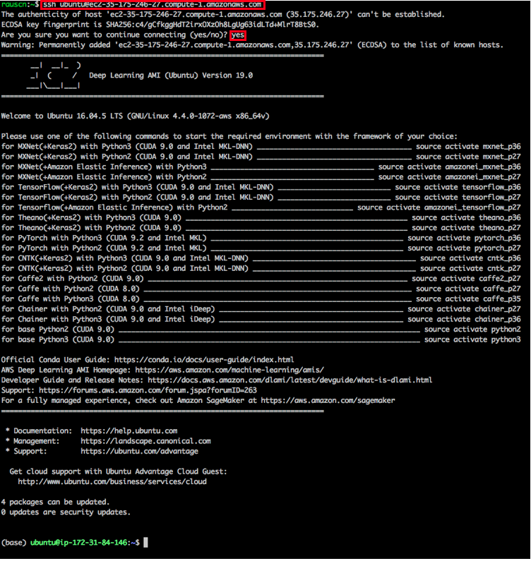

# Using AWS to Run Code

This tutorial will guide you through Amazon SageMaker: a service that allows you to be up and running with MXNet in 5 minutes and to do Machine Learning at large scale in the quickest and easiest way possible.

Deep Learning projects usually consist of a set of problem tasks: for instance you may have to create training datasets, train and evaluate your model, tune its hyperparameters and finally deploy the model to a production ready cluster. This workflow can be quite cumbersome and time consuming. For this reason AWS provides Amazon SageMaker a fully managed machine learning service that accelerates the overall Deep Learning workflow.

User who only need compute instances rather than a fully managed Machine Learning service should follow chapter [Run on an EC2 instance](use_ec2.md#run-on-an-ec2-instance). EC2 provides specialized Deep Learning images so developers can start training their models right away without the hassle of installing driver and software frameworks.


## Run on Amazon SageMaker
This chapter will give a high level overview about Amazon SageMaker, in-depth tutorials can be found on the [Sagemaker website](https://docs.aws.amazon.com/sagemaker/latest/dg/whatis.html).


SageMaker offers Jupyter notebooks and supports MXNet out-of-the box. You can run your notebooks on CPU instances and as such profit from  the free tier. However, more powerful CPU instances or GPU instances are charged by time.
Within this notebook you can [fetch, explore and prepare training data](https://docs.aws.amazon.com/sagemaker/latest/dg/how-it-works-notebooks-instances.html). 
```
import mxnet as mx
import sagemaker
mx.test_utils.get_cifar10() # Downloads Cifar-10 dataset to ./data
sagemaker_session = sagemaker.Session()
inputs = sagemaker_session.upload_data(path='data/cifar',
                                       key_prefix='data/cifar10')
```
Once the data is ready, you can easily launch training via the SageMaker SDK. So there is no need to manually configure and log into EC2 instances. You can either bring your own model or use SageMaker's [built-in algorithms](https://docs.aws.amazon.com/sagemaker/latest/dg/algos.html) that are tailored to specific use cases such as computer vision, NLP etc. SageMaker encapsulates the process of training into the class ```Estimator``` and we can now start the training on the local notebook instance:
```
from sagemaker.mxnet import MXNet as MXNetEstimator
estimator = MXNetEstimator(entry_point='train.py', 
                           role=sagemaker.get_execution_role(),
                           train_instance_count=1, 
                           train_instance_type='local',
                           hyperparameters={'batch_size': 1024, 
                                            'epochs': 30})
estimator.fit(inputs)
```
If you require a more powerful platform for training, then you only need to change the ```train_instance_type```. Once you call ```fit```, SageMaker will automatically create the required EC2 instances, train your model within a Docker container and then immediately shutdown these instances. ```Fit()``` requires an entry point (here ```train.py```) that describes the model and training loop. This script needs to provide certain functions, that will be automatically executed by SageMaker. More information about the entry point script can be found [here](https://docs.aws.amazon.com/sagemaker/latest/dg/mxnet-training-inference-code-template.html).
When the model is ready for deployment you can use [SageMaker's hosting services](https://docs.aws.amazon.com/sagemaker/latest/dg/how-it-works-hosting.html) that create an HTTPS endpoint where model inference is provided.
```
predictor = estimator.deploy(initial_instance_count=1,
                             instance_type='ml.m4.xlarge')
```

<<<<<<< Updated upstream
Here, "/path/to/key.pem" is the path of the locally-stored key used to access the instance. When the command line prompts "Are you sure you want to continue connecting (yes/no)", enter "yes" and press Enter to log into the instance.


With the given address, we can log into our instance:




The login screen will show a long list of available conda environments for the different Deep Learning frameworks, CUDA driver and Python versions. With ```conda activate``` you can easily switch into the different environments.

The following links show more advanced uses cases in SageMaker:
  - [Distributed training on multiple machines](https://medium.com/apache-mxnet/94-accuracy-on-cifar-10-in-10-minutes-with-amazon-sagemaker-754e441d01d7) 
  - [Hyperparameter Tuning Jobs](https://docs.aws.amazon.com/sagemaker/latest/dg/automatic-model-tuning-ex.html)
  - [Optimize a model with SageMaker Neo](https://docs.aws.amazon.com/sagemaker/latest/dg/neo.html)
  - [Build Groundtruth Datasets](https://docs.aws.amazon.com/sagemaker/latest/dg/sms-getting-started.html)
  - [Getting started with SageMaker](https://medium.com/apache-mxnet/getting-started-with-sagemaker-ebe1277484c9)
  
## Acquire the Code for this Book and activate MXNet GPU environment

Next, download the code for this book and install and activate the Conda environment.

```
mkdir d2l-en && cd d2l-en
curl https://www.diveintodeeplearning.org/d2l-en-1.0.zip -o d2l-en.zip
unzip d2l-en.zip && rm d2l-en.zip
source activate mxnet_p36 
```

## Run Jupyter Notebook

Now, you can run Jupyter Notebook:

```
jupyter notebook
```

Figure 11.18 shows the possible output after you run Jupyter Notebook. The last row is the URL for port 8888.


Because the instance you created does not expose port 8888, you can launch SSH in the local command line and map the instance to the local port 8889.

```
# This command must be run in the local command line.
ssh -i "/path/to/key.pem" ubuntu@ec2-xx-xxx-xxx-xxx.y.compute.amazonaws.com -L 8889:localhost:8888
```

Finally, copy the URL shown in the last line of the Jupyter Notebook output in Figure 11.18 to your local browser and change 8888 to 8889. Press Enter to use Jupyter Notebook to run the instance code from your local browser.

## Close Unused Instances

As cloud services are billed by use duration, you will generally want to close instances you no longer use.

If you plan on restarting the instance after a short time, right-click on the example shown in Figure 11.16 and select "Instance State" $\rightarrow$ "Stop" to stop the instance. When you want to use it again, select "Instance State" $\rightarrow$ "Start" to restart the instance. In this situation, the restarted instance will retain the information stored on its hard disk before it was stopped (for example, you do not have to reinstall CUDA and other runtime environments). However, stopped instances will still be billed a small amount for the hard disk space retained.

If you do not plan to use the instance again for a long time, right-click on the example in Figure 11.16 and select "Image" $\rightarrow$ "Create" to create an image of the instance. Then, select "Instance State" $\rightarrow$ "Terminate" to terminate the instance (it will no longer be billed for hard disk space). The next time you want to use this instance, you can follow the steps for creating and running an EC2 instance described in this section to create an instance based on the saved image. The only difference is that, in "1. Choose AMI" shown in Figure 11.10, you must use the "My AMIs" option on the left to select your saved image. The created instance will retain the information stored on the image hard disk. 

## Summary

* You can use cloud computing services to obtain more powerful computing resources and use them to run the deep learning code in this document.

## Problem

* The cloud offers convenience, but it does not come cheap. Research the prices of cloud services and find ways to reduce overhead.

## Discuss on our Forum

<div id="discuss" topic_id="2399"></div>
