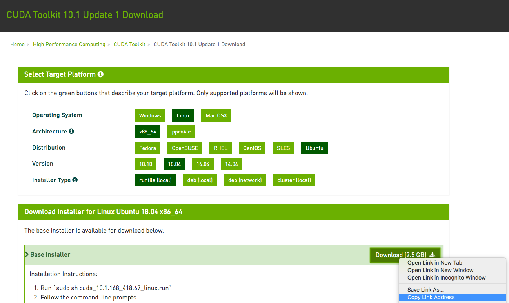

# Using AWS Instances

Many deep learning applications require significant amounts of computation. Your local machine might be too slow to solve these problems in a reasonable amount of time. Cloud computing services can give you access to more powerful computers to run the GPU intensive portions of this book. In this section, we will show you how to set up an instance. We will use Jupyter Notebooks to run code on AWS (Amazon Web Services). The walkthrough includes a number of steps:

1. Request for a GPU instance.
1. Optionally: install CUDA or use an AMI with CUDA preinstalled.
1. Set up the corresponding MXNet GPU version.

This process applies to other instances (and other clouds), too, albeit with some minor modifications.


## Registering Account and Logging In

First, we need to register an account at https://aws.amazon.com/. We strongly encourage you to use two-factor authentication for additional security. Furthermore, it is a good idea to set up detailed billing and spending alerts to avoid any unexpected surprises if you forget to suspend your computers. Note that you will need a credit card.
After logging into your AWS account, click "EC2" (marked by the red box in :numref:`fig_aws`) to go to the EC2 panel.


:width:`400px`
:label:`fig_aws`


## Creating and Running an EC2 Instance

:numref:`fig_ec2` shows the EC2 panel with sensitive account information greyed out. 


:width:`700px`
:label:`fig_ec2`

### Presetting Location
Select a nearby data center to reduce latency, *e.g.,* "Oregon". (marked by the red box in the top-right of :numref:`fig_ec2`) If you are located in China
you can select a nearby Asia Pacific region, such as Seoul or Tokyo. Please note
that some data centers may not have GPU instances. 

### Increasing Limits
Before choosing an instance, check if there are quantity 
restrictions by clicking the "Limits" label in the bar on the left as shown in
:numref:`fig_ec2`. :numref:`fig_limits` shows an example of such a
limitation. The account currently cannot open "p2.xlarge" instance per region. If
you need to open one or more instances, click on the "Request limit increase" link to
apply for a higher instance quota. Generally, it takes one business day to
process an application.


:width:`700px`
:label:`fig_limits`


### Launching Instance
Next, click the "Launch Instance" button marked by the red box in :numref:`fig_ec2` to launch your instance.

We begin by selecting a suitable AMI (AWS Machine Image). Enter "Ubuntu" in the search box (marked by the red box in :numref:`fig_ubuntu`):


:width:`700px`
:label:`fig_ubuntu`

EC2 provides many different instance configurations to choose from. This can sometimes feel overwhelming to a beginner. Here's a table of suitable machines:

| Name | GPU         | Notes                         |
|------|-------------|-------------------------------|
| g2   | Grid K520   | ancient                       |
| p2   | Kepler K80  | old but often cheap as spot   |
| g3   | Maxwell M60 | good trade-off                |
| p3   | Volta V100  | high performance for FP16     |
| g4   | Turing T4   | inference optimized FP16/INT8 |

All the above servers come in multiple flavors indicating the number of GPUs used. For example, a p2.xlarge has 1 GPU and a p2.16xlarge has 16 GPUs and more memory. For more details see *e.g.,* the [AWS EC2 documentation](https://aws.amazon.com/ec2/instance-types/) or a [summary page](https://www.ec2instances.info). For the purpose of illustration, a p2.xlarge will suffice (marked in red box of :numref:`fig_p2x`).

**Note:** you must use a GPU enabled instance with suitable drivers and a version of MXNet that is GPU enabled. Otherwise you will not see any benefit from using GPUs.


:width:`700px`
:label:`fig_p2x`

So far, we have finished the first two of seven steps for launching an EC2 instance, as shown on the top of :numref:`fig_disk`. In this example, we keep the default configurations for the steps "3. Configure Instance", "5. Add Tags", and "6. Configure Security Group". Tap on "4. Add Storage" and increase the default hard disk size to 64 GB (marked in red box of :numref:`fig_disk`). Note that CUDA by itself already takes up 4GB.


:width:`700px`
:label:`fig_disk`

Finally, go to "7. Review" and click "Launch" to launch the configured
instance. The system will now prompt you to select the key pair used to access
the instance. If you do not have a key pair, select "Create a new key pair" in
the first drop-down menu in :numref:`fig_keypair` to generate a key pair. Subsequently,
you can select "Choose an existing key pair" for this menu and then select the
previously generated key pair. Click "Launch Instances" to launch the created
instance.


:width:`700px`
:label:`fig_keypair`

Make sure that you download the keypair and store it in a safe location if you
generated a new one. This is your only way to SSH into the server. Click the
instance ID shown in :numref:`fig_launching` to view the status of this instance.


:width:`700px`
:label:`fig_launching`


### Connecting Instance

As shown in :numref:`fig_connect`, after the instance state turns green, right-click the instance and select `Connect` to view the instance access method. 


:width:`700px`
:label:`fig_connect`

If this is a new key, it must not be publicly viewable for SSH to work. Go to the folder where you store `D2L_key.pem` (*e.g.,* Downloads folder) and make the key to be not publicly viewable.

```bash
cd /Downloads  ## if D2L_key.pem is stored in Downloads folder 
chmod 400 D2L_key.pem
```


:width:`700px`
:label:`fig_chmod`


Now, copy the ssh command in the lower red box of :numref:`fig_chmod` and paste onto the command line:

```bash
ssh -i "D2L_key.pem" ubuntu@ec2-xx-xxx-xxx-xxx.y.compute.amazonaws.com
```


When the command line prompts "Are you sure you want to continue connecting (yes/no)", enter "yes" and press Enter to log into the instance.

Your server is ready now.


## Installing CUDA

Before installing CUDA, be sure to update the instance with the latest drivers.

```bash
sudo apt-get update && sudo apt-get install -y build-essential git libgfortran3
```


Here we download CUDA 10.1. Visit NVIDIA's official repository at (https://developer.nvidia.com/cuda-toolkit-archive) to find the download link of CUDA 10.1 as shown below.


:width:`700px`
:label:`fig_cuda`

Right click at `Download` and click `Copy Link Address` (as shown in :numref:`fig_cuda`), then go back to the terminal and paste onto the command line to install `CUDA 10.1` :

```bash
## paste the copied link from CUDA website
wget https://developer.nvidia.com/compute/cuda/10.1/Prod/local_installers/cuda_10.1.168_418.67_linux.run 

sudo sh cuda_10.1.168_418.67_linux.run
## this command line may take a while to run
```


Enter `accept`  for the following inquiry as shown in :numref:`fig_cuda_accept`.


:width:`700px`
:label:`fig_cuda_accept`

If the following image shows up, choose "Install" and tap "Enter" as shown in :numref:`fig_cuda_install`.


:width:`700px`
:label:`fig_cuda_install`

You may also need to answer the following questions.

```bash
Install NVIDIA Accelerated Graphics Driver for Linux-x86_64 410.48?
(y)es/(n)o/(q)uit: y

Do you want to install the OpenGL libraries?
(y)es/(n)o/(q)uit [ default is yes ]: y

Do you want to run nvidia-xconfig?
This will update the system X configuration file so that the NVIDIA X driver
is used. The pre-existing X configuration file will be backed up.
This option should not be used on systems that require a custom
X configuration, such as systems with multiple GPU vendors.
(y)es/(n)o/(q)uit [ default is no ]: n

Install the CUDA 10.1 Toolkit?
(y)es/(n)o/(q)uit: y

Enter Toolkit Location
 [ default is /usr/local/cuda-10.1 ]:

Do you want to install a symbolic link at /usr/local/cuda?
(y)es/(n)o/(q)uit: y

Install the CUDA 10.1 Samples?
(y)es/(n)o/(q)uit: n
```


After installing the program, run the following command to view the instance GPU (as shown in :numref:`fig_nvidia-smi`).

```bash
nvidia-smi
```


:width:`700px`
:label:`fig_nvidia-smi`

Finally, add CUDA to the library path to help other libraries find it.

```bash
echo "export LD_LIBRARY_PATH=\${LD_LIBRARY_PATH}:/usr/local/cuda/lib64" >> ~/.bashrc
```


## Installing MXNet and Downloading the D2L Notebooks

First, to simplify the installation, you need to install [Miniconda](https://conda.io/en/latest/miniconda.html) for Linux. The download link and file name are subject to changes, so please go the Miniconda website and click "Copy Link Address" as shown in :numref:`fig_miniconda`.


:width:`700px`
:label:`fig_miniconda`

```bash
wget https://repo.anaconda.com/miniconda/Miniconda3-latest-Linux-x86_64.sh
sudo sh Miniconda3-latest-Linux-x86_64.sh
```


You need to answer the following questions:

```bash
Do you accept the license terms? [yes|no]
[no] >>> yes

Miniconda3 will now be installed into this location:
/home/ubuntu/miniconda3
  - Press ENTER to confirm the location
  - Press CTRL-C to abort the installation
  - Or specify a different location below
>>> <ENTER>

Do you wish the installer to initialize Miniconda3
by running conda init? [yes|no]
[no] >>> yes
```


After miniconda installation, run the following command to activate CUDA and Conda.

```bash
source ~/.bashrc
```


Next, download the code for this book.

```bash
sudo apt-get install unzip
mkdir d2l-en && cd d2l-en
wget http://numpy.d2l.ai/d2l-en.zip
unzip d2l-en.zip && rm d2l-en.zip
```


Then create the conda `d2l` environment and enter `y` for the proceed inquiry as shown in :numref:`fig_conda_create_d2l`.

```bash
conda create --name d2l
```


:width:`700px`
:label:`fig_conda_create_d2l`

After create `d2l` environment, activate it and install `pip`.

```bash
conda activate d2l
conda install pip
```


Finally, install `MXNet` and `d2l`.

```bash
## mxnet
pip install https://apache-mxnet.s3-us-west-2.amazonaws.com/dist/python/numpy/latest/mxnet_cu101mkl-1.5.0-py2.py3-none-manylinux1_x86_64.whl

## d2l
pip install git+https://github.com/d2l-ai/d2l-en@numpy2
```


You can test quickly whether everything went well as follows:

```
$ python
>>> from mxnet import np, npx
>>> np.zeros((1024, 1024), ctx=npx.gpu())
```


## Running Jupyter

To run Jupyter remotely you need to use SSH port forwarding. After all, the server in the cloud doesn't have a monitor or keyboard. For this, log into your server from your desktop (or laptop) as follows.

```
# This command must be run in the local command line
ssh -i "/path/to/key.pem" ubuntu@ec2-xx-xxx-xxx-xxx.y.compute.amazonaws.com -L 8889:localhost:8888
conda activate d2l
jupyter notebook
```


:numref:`fig_jupyter` shows the possible output after you run Jupyter Notebook. The last row is the URL for port 8888.


:width:`700px`
:label:`fig_jupyter`

Since you used port forwarding to port 8889 you will need to replace the port number and use the secret as given by Jupyter when opening the URL in your local browser.

## Closing Unused Instances

As cloud services are billed by the time of use, you should close instances that are not being used. Note that there are alternatives: "Stopping" an instance means that you will be able to start it again. This is akin to switching off the power for your regular server. However, stopped instances will still be billed a small amount for the hard disk space retained. "Terminate" deletes all data associated with it. This includes the disk, hence you cannot start it again. Only do this if you know that you won't need it in the future.

If you want to use the instance as a template for many more instances,
right-click on the example in Figure 14.16 :numref:`fig_connect` and select "Image" $\rightarrow$
"Create" to create an image of the instance. Once this is complete, select
"Instance State" $\rightarrow$ "Terminate" to terminate the instance. The next
time you want to use this instance, you can follow the steps for creating and
running an EC2 instance described in this section to create an instance based on
the saved image. The only difference is that, in "1. Choose AMI" shown in
:numref:`fig_ubuntu`, you must use the "My AMIs" option on the left to select your saved
image. The created instance will retain the information stored on the image hard
disk. For example, you will not have to reinstall CUDA and other runtime
environments.

## Summary

* Cloud computing services offer a wide variety of GPU servers.
* You can launch and stop instances on demand without having to buy and build your own computer.
* You need to install suitable GPU drivers before you can use them.

## Exercises

1. The cloud offers convenience, but it does not come cheap. Find out how to launch [spot instances](https://aws.amazon.com/ec2/spot/) to see how to reduce prices.
1. Experiment with different GPU servers. How fast are they?
1. Experiment with multi-GPU servers. How well can you scale things up?

## Scanning the QR Code to [Discuss](https://discuss.mxnet.io/t/2399)


