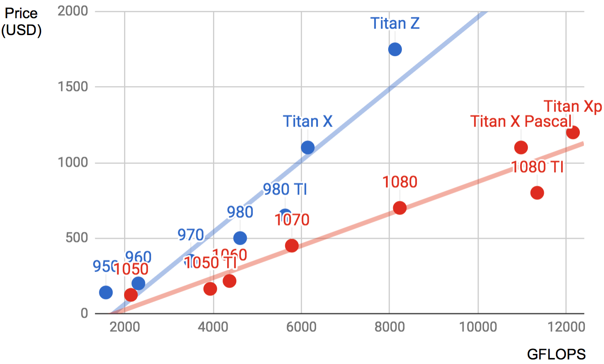

# GPU Purchase Guide

Deep learning training generally requires large volumes of computing resources. Currently, GPUs are the most common computation acceleration hardware used for deep learning. Compared with CPUs, GPUs are cheaper and provide more intensive computing. On the one hand, GPUs can deliver the same compute power at a tenth of the price of CPUs. On the other hand, a single sever can generally support 8 or 16 GPUs. Therefore, the GPU quantity can be viewed as a standard to measure the deep learning compute power of a server.

## Selecting a GPU

At present, AMD and NVIDIA are the two main manufacturers of dedicated GPUs. NVIDIA was the first to enter the deep learning field and provides better support for deep learning frameworks. Therefore, most buyers choose NVIDIA GPUs.

NVIDIA provides two types of GPUs, targeting individual uses (such as the GTX series) and enterprise users (such as the Tesla series). The two types of GPUs provide comparable compute power. However, the enterprise user GPUs generally use passive heat dissipation and add a memory check function. Therefore, these GPUs are more suitable for data centers and usually cost ten times more than individual user GPUs.

If you are a large company with 100 or more servers, you should consider the NVIDIA Tesla series for enterprise users. If you are a lab or small to mid-size company with 10 to 100 servers, you should consider the NVIDIA DGX series if your budget is sufficient. Otherwise, you can consider more cost-effective servers, such as Supermicro, and then purchase and install GTX series GPUs.

NVIDIA generally releases a new GPU version every one or two years, such as the GTX 1000 series released in 2017. Each series offers several different models that provide different performance levels.

GPU performance is primarily a combination of the following three parameters:

1. Compute power: Generally we look for 32-bit floating-point compute power. 16-bit floating point training is also entering the mainstream. If you are only interested in prediction, you can also use 8-bit integer.
2. Memory size: As your models become larger or the batches used during training grow bigger, you will need more GPU memory.
3. Memory bandwidth: You can only get the most out of your compute power when you have sufficient memory bandwidth.

For most users, it is enough to look at compute power. The GPU memory should be no less than 4 GB. However, if the GPU must simultaneously display graphical interfaces, we recommend a memory size of at least 6 GB. There is generally not much variation in memory bandwidth, with few options to choose from.

Figure 12.19 compares the 32-bit floating-point compute power and price of the various GTX 900 and 1000 series models. The prices are the suggested prices found on Wikipedia.

From Figure 12.19, we can see two things:

1. Within each series, price and performance are roughly proportional. However, the newer models offer better cost effectiveness, as can be seen by comparing the 980 Ti and 1080 Ti.
2. The performance to cost ratio of the GTX 1000 series is about two times greater than the 900 series.

If we look at the earlier GTX series, we will observe a similar pattern. Therefore, we recommend you buy the latest GPU model in your budget.

## Machine Configuration

Generally, GPUs are primarily used for deep learning training. Therefore, you do not have to purchase high-end CPUs. When deciding on machine configurations, you can find a mid to high-end configuration based on recommendations on the Internet. However, given the power consumption, heat dissipation performance, and size of GPUs, you need to consider three additional factors in machine configurations.

1. Chassis size: GPUs are relatively large, so you should look for a large chassis with a built-in fan.
2. Power source: When purchasing GPUs, you must check the power consumption, as they can range from 50 W to 300 W. When choosing a power source, you must ensure it provides sufficient power and will not overload the data center power supply.
3. Motherboard PCIe card slot: We recommend PCIe 3.0 16x to ensure sufficient bandwidth between the GPU and main memory. If you mount multiple GPUs, be sure to carefully read the motherboard description to ensure that 16x bandwidth is still available when multiple GPUs are used at the same time. Be aware that some motherboards downgrade to 8x or even 4x bandwidth when 4 GPUs are mounted.

## Summary

* You should purchase the latest GPU model that you can afford.
* When deciding on machine configurations, you must consider GPU power consumption, heat dissipation, and size.

## Exercise

* You can browse the discussions about machine configurations in the forum for this section.

## Scan the QR Code to [Discuss](https://discuss.mxnet.io/t/2400)

