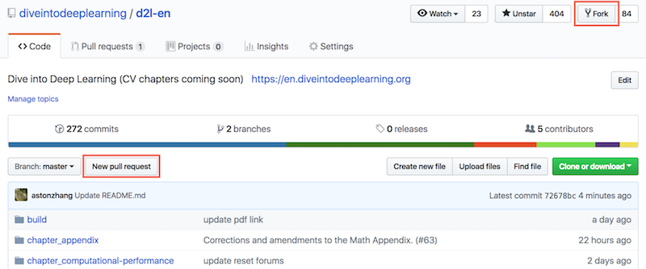
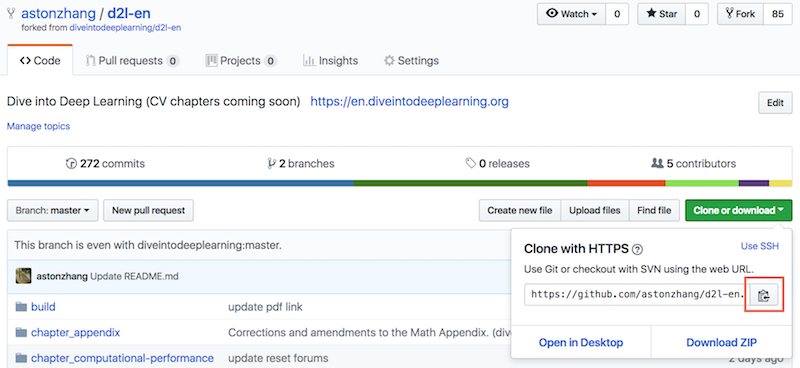
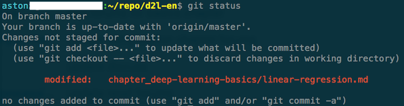
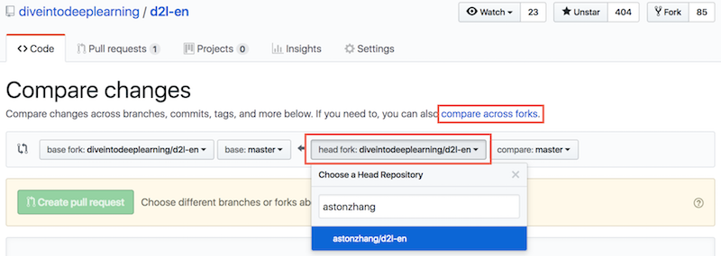
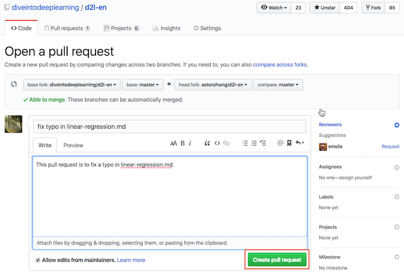
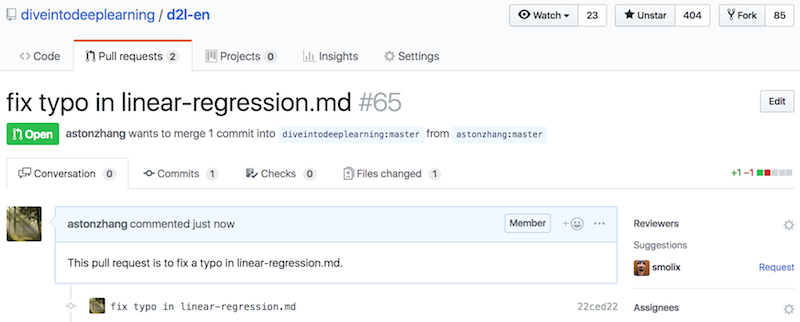

# How to Contribute to This Book

You can view the list of contributors [1] for this open-sourced book. If you want to contribute to this book, you need to install Git and submit a pull request [2] for the GitHub code repository of this book. When your pull request is merged into the code repository by the author of this book, you will become a contributor.

This section describes the basic Git procedure for contributing to this book. If you are familiar with Git operations, you can skip this section.

In the procedure below, we assume that the contributor's GitHub ID is "astonzhang".

Step 1: Install Git. The Git open source book details how to install Git [3]. If you do note have a GitHub account, you need to sign up for an account [4].

Step 2: Log in to GitHub. Enter the address of code repository of this book in your browser [2]. Click on the "Fork" button in the red box at the top-right of Figure 11.20 to get a copy of code repository of this book.




Now, the code repository of this book will be copied to your username, such as "Your GitHub ID/d2l-en" shown at the top-left of Figure 11.21.




Step 3: Click the green "Clone or download" button on the right side of Figure 11.21 and click the button in the red box to copy the code repository address under your username. Follow the method described in the ["Acquiring and Running Codes in This Book"](../chapter_prerequisite/install.md) section to enter command line mode. Here, we assume you want to save the code repository under the local "~/repo" path. Go to this path, type `git clone`, and paste the code repository address under your username. Execute the command:

```
# Replace your_Github_ID with your GitHub username.
git clone https://github.com/your_Github_ID/d2l-en.git
```

Now, all the files in the code repository of this book will be saved in the local "~/repo/d2l-en" path.


Step 4: Edit the code repository of this book under the local path. Assume we have modified a typo in the file `~/repo/d2l-en/chapter_deep-learning-basics/linear-regression.md`. In command line mode, enter the path `~/repo/d2l-en` and execute the command:

```
git status
```

At this point Git will prompt that the "chapter_deep-learning-basics/linear-regression.md" file has been modified, as shown in Figure 11.22.



After confirming the file submitting the change, execute the following command:

```
git add chapter_deep-learning-basics/linear-regression.md
git commit -m 'fix typo in linear-regression.md'
git push
```

Here, `'fix typo in linear-regression.md'` is the description of the submitted change. You can replace this with other meaningful descriptive information.

Step 5: Enter the code repository address of this book [2] in your browser again. Click the "New pull request" button in the red box on the bottom-left of Figure 11.20. On the page that appears, click the "compare across forks" link in the red box on the right side of Figure 11.23. Then, click the "head fork: d2l-ai/d2l-en" button in the red box below. Enter your GitHub ID in the pop-up text box and select "Your GitHub-ID/d2l-en" from the drop-down menu, as shown in Figure 11.23.




Step 6: As shown in Figure 11.24, describe the pull request you want to submit in the title and body text boxes. Click the green "Create pull request" button in the red box to submit the pull request.




After submitting the request, you will see the page shown in Figure 11.25, which indicates that the pull request has been submitted.




## Summary

* You can use GitHub to contribute to this book.


## Problem

* If you feel that some parts of the book can be improved, try submitting a pull request.


## References

[1] List of contributors to this book. https://github.com/d2l-ai/d2l-en/graphs/contributors

[2] Address of the code repository of this book. https://github.com/d2l-ai/d2l-en

[3] Install Git. https://git-scm.com/book/zh/v2

[4] URL of GitHub. https://github.com/

## Discuss on our Forum

<div id="discuss" topic_id="2401"></div>
