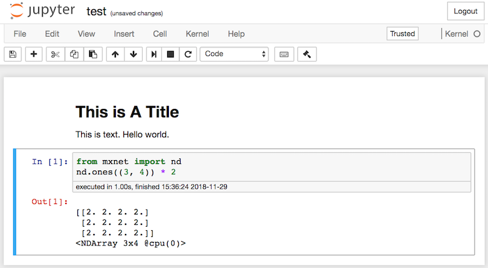

# Using Jupyter

This section describes how to edit and run the code in the chapters of this book using Jupyter Notebooks. Make sure you have Jupyter installed and downloaded the code as described in the [Installation](../chapter_prerequisite/install.md) section. If you want to know more about Jupyter see the excellent tutorial in the [Documentation](https://jupyter.readthedocs.io/en/latest/). 


## Edit and Run the Code Locally

Now we describe how to use Jupyter to edit and run code in the book locally. Suppose that the local path of code of the book is "xx/yy/d2l-en/". Change directory in the shell to this path (`cd xx/yy/d2l-en`) and run the command `jupyter notebook`. If your browser doesn't do this automatically, open http://localhost:8888 and you will see the interface of Jupyter and all the folders containing code of the book, as shown in Figure 13.1.


You can access the notebook files by clicking on the folder displayed on the webpage. They usually have the suffix `.ipynb`.
For the sake of brevity, we create a temporary `test.ipynb` file, and the content displayed after you click it is as shown in Figure 13.2. This notebook includes a markdown cell and code cell. The content in the markdown cell includes "This is A Title" and "This is text".   The code cell contains two lines of Python code.


Double click on the markdown cell, to enter edit mode. Add a new text string "Hello world." at the end of the cell, as shown in Figure 13.3.


As shown in Figure 13.4, click "Cell" $\rightarrow$ "Run Cells" in the menu bar to run the edited cell.


After running, the markdown cell is as shown in Figure 13.5.


Next, click on the code cell. Multiply the elements by 2 after the last line of code, as shown in Figure 13.6.


You can also run the cell with a shortcut ("Ctrl + Enter" by default) and obtain the output result from Figure 13.7.



When a notebook contains more cells, we can click "Kernel" $\rightarrow$ "Restart & Run All" in the menu bar to run all the cells in the entire notebook. By clicking "Help" $\rightarrow$ "Edit Keyboard Shortcuts" in the menu bar, you can edit the shortcuts according to your preferences.


## Advanced Options

Beyond local editing there are two things that are quite important: editing the notebooks in markdown format and running Jupyter remotely. The latter matters when we want to run the code on a faster server. The former matters since Jupyter's native .ipnyb format stores a lot of auxiliary data that isn't really specific to what is in the notebooks, mostly related to how and where the code is run. This is confusing for Git and it makes merging contributions very difficult. Fortunately there's an alternative - native editing in Markdown. 

### Markdown Files in Jupyter 

If you wish to contribute to the content of this book, you need to modify the source file (.md file, not .ipynb file)  on GitHub. Using the notedown plugin we can modify notebooks in .md format directly in Jupyter. Linux/MacOS users can execute the following commands to obtain the GitHub source files and activate the runtime environment. If you haven't done so already, install the environment needed for MXNet Gluon. 

```{.python .input}
git clone https://github.com/d2l-ai/d2l-en.git
cd d2l-en 
sed -i 's/mxnet/mxnet-cu100/g' environment.yml  # Only use this if you have a GPU
conda env create -f environment.yml
source activate gluon # Windows users run "activate gluon"
```

Next, install the notedown plugin, run Jupyter Notebook, and load the plugin:

```{.python .input}
pip install https://github.com/mli/notedown/tarball/master
jupyter notebook --NotebookApp.contents_manager_class='notedown.NotedownContentsManager'
```

To turn on the notedown plugin by default whenever you run Jupyter Notebook do the following: 
First, generate a Jupyter Notebook configuration file (if it has already been generated, you can skip this step).

```{.python .input}
jupyter notebook --generate-config
```

Then, add the following line to the end of the Jupyter Notebook configuration file (for Linux/macOS, usually in the path `~/.jupyter/jupyter_notebook_config.py`):

```{.python .input}
c.NotebookApp.contents_manager_class = 'notedown.NotedownContentsManager'
```

After that, you only need to run the `jupyter notebook` command to turn on the notedown plugin by default.


### Run Jupyter Notebook on a Remote Server

Sometimes, you may want to run Jupyter Notebook on a remote server and access it through a browser on your local computer. If Linux or MacOS is installed on you local machine (Windows can also support this function through third-party software such as PuTTY), you can use port forwarding:

```{.python .input}
ssh myserver -L 8888:localhost:8888
```

The above is the address of the remote server `myserver`. Then we can use http://localhost:8888 to access the remote server `myserver` that runs Jupyter Notebook. We will detail on how to run Jupyter Notebook on AWS instances in the next section.

### Timing

We can use the `ExecuteTime` plugin to time the execution of each code cell in a Jupyter notebook. Use the following commands to install the plugin:

```{.python .input}
pip install jupyter_contrib_nbextensions
jupyter contrib nbextension install --user
jupyter nbextension enable execute_time/ExecuteTime
```

## Summary

* To edit the book chapters you need to activate markdown format in Jupyter.
* You can run servers remotely using port forwarding.

## Exercises

1. Try to edit and run the code in this book locally.
1. Try to edit and run the code in this book *remotely* via port forwarding.
1. Measure $\mathbf{A}^\top \mathbf{B}$ vs. $\mathbf{A} \mathbf{B}$ for two square matrices on $10

## Scan the QR Code to [Discuss](https://discuss.mxnet.io/t/2398)


