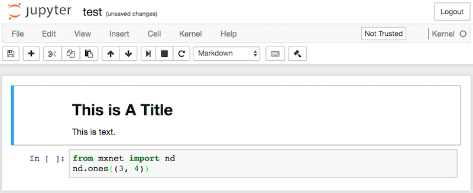

# Using Jupyter Notebook

This section describes how to edit and run the code in this book using Jupyter Notebook. Make sure you have installed Jupyter Notebook and obtained the code for this book according to the steps in the ["Acquiring and Running Codes in This Book"](../chapter_prerequisite/install.md) section.


## Edit and Run the Code in This Book Locally

下面我们介绍如何在本地使用Jupyter笔记本来编辑和运行本书代码。假设本书代码所在的本地路径为“xx/yy/gluon_tutorials_zh-1.0/”。在命令行模式下进入该路径（`cd xx/yy/gluon_tutorials_zh-1.0`），然后运行命令`jupyter notebook`。这时在浏览器打开 http://localhost:8888 （通常会自动打开）就可以看到Jupyter笔记本的界面和本书代码所在的各个文件夹，如图11.1所示。


You can access the notebook files by clicking on the folder displayed on the webpage. They usually have the suffix "ipynb".
For the sake of brevity, we create a temporary "test.ipynb" file, and the content displayed after you click it is as shown in Figure 11.2. This notebook includes a markdown cell and code cell. The content in the markdown cell includes "This is a title" and "This is text".   The code cell contains two lines of Python code.




Double click on the markdown cell, to enter edit mode. Add a new text string "Hello World." at the end of the cell, as shown in Figure 11.3.


As shown in Figure 11.4, click "Cell" $\rightarrow$ "Run Cells" in the menu bar to run the edited cell.


After running, the markdown cell is as shown in Figure 11.5.


Next, click on the code cell. Add the multiply by 2 operation `* 2` after the last line of code, as shown in Figure 11.6.


You can also run the cell with a shortcut ("Ctrl + Enter" by default) and obtain the output result from Figure 11.7.


When a notebook contains more cells, we can click "Kernel" $\rightarrow$ "Restart & Run All" in the menu bar to run all the cells in the entire notebook. By clicking "Help" $\rightarrow$ "Edit Keyboard Shortcuts" in the menu bar, you can edit the shortcuts according to your preferences.


## Advanced Options

Below are some advanced options for using Jupyter Notebook. You can use this section as a reference based on your interests.

### Read and Write GitHub Source Files with Jupyter Notebook

If you wish to contribute to the content of this book, you need to modify the source file (.md file, not .ipynb file) in the markdown format on GitHub. With the notedown plugin, we can use Jupyter Notebook to modify and run the source code in markdown format. Linux/MacOS users can execute the following commands to obtain the GitHub source files and activate the runtime environment.

```
git clone https://github.com/mli/gluon-tutorials-zh
cd gluon-tutorials-zh
conda env create -f environment.yml
source activate gluon # Windows users run "activate gluon"
```

Next, install the notedown plugin, run Jupyter Notebook, and load the plugin:

```
pip install https://github.com/mli/notedown/tarball/master
jupyter notebook --NotebookApp.contents_manager_class='notedown.NotedownContentsManager'
```

If you want to turn on the notedown plugin by default each time you run Jupyter Notebook, you follow the procedure below.

First, execute the following command to generate a Jupyter Notebook configuration file (if it has already been generated, you can skip this step).

```
jupyter notebook --generate-config
```

Then, add the following line to the end of the Jupyter Notebook configuration file (for Linux/macOS, usually in the path `~/.jupyter/jupyter_notebook_config.py`):

```
c.NotebookApp.contents_manager_class = 'notedown.NotedownContentsManager'
```

After that, you only need to run the `jupyter notebook` command to turn on the notedown plugin by default.


### Run Jupyter Notebook on a Remote Server

Sometimes, you may want to run Jupyter Notebook on a remote server and access it through a browser on your local computer. If Linux or MacOS is installed on you local machine (Windows can also support this function through third-party software such as PuTTY), you can use port mapping:

```
ssh myserver -L 8888:localhost:8888
```

以上`myserver`是远端服务器地址。然后我们可以使用 http://localhost:8888 打开运行Jupyter笔记本的远端服务器`myserver`。我们将在下一节详细介绍如何在AWS实例上运行Jupyter笔记本。

### Operation Timing

We can use the ExecutionTime plugin to time the execution of each code cell in a Jupyter notebook. Use the following commands to install the plugin:

```
pip install jupyter_contrib_nbextensions
jupyter contrib nbextension install --user
jupyter nbextension enable execute_time/ExecuteTime
```

## Summary

* You can edit and run the code in this book using Jupyter Notebook.

## exercise

* Try to edit and run the code in this book locally.

## Discuss on our Forum

<div id="discuss" topic_id="2398"></div>
