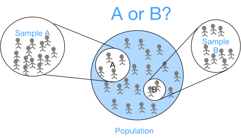
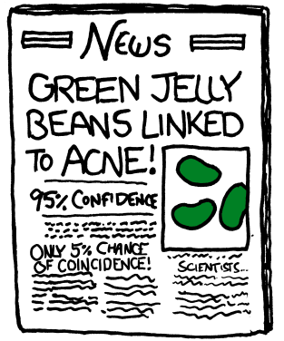

# AB Testing 
:label:`sec_ab_tesing`



:label:`fig_ab_testing`


In the "internet century", it is not unimaginable to collect millions of data everyday. As we introduced in :numref:`sec_statistics`, the application of the [two-sample hypothesis test](https://en.wikipedia.org/wiki/Two-sample_hypothesis_testing) in the world of internet is refered to as *A/B Testing*.

A/B Testing is quite useful in the internet companies who are testing the influence on users' behaviors of a new product design (such website layouts and personalized recommendations). 
Usually a A/B Testing contains a test group and an control group, as we introduce in :numref:``.

The goal of A/B testing is to design an experiment and decide whether there is a dramatic behavior difference between the test group and the control group. This experiment is usually robust and reproducible for a given user population within a time span. As a result, A/B tesing can help us make a data-informed decision on whether or not to launch a new product design.

In this section, we will dive into the details of A/B testing in practice.

* So we'll need to compare the proportion of clicks estimated on the control side, with the proportion estimated on the experiment side. Then the quantitative task tells us whether it's likely that the results we got, the difference we observed, could have occurred by chance, or if it would be extremely unlikely to have occurred if the two sides were actually the same.


## A/B Testing General Steps

Similarly to the 5 steps in hypothesis testing introduced in :numref:`sec_statistics`, a common A/B testing experiment also needs the following 5 steps:

1. State a null hypotheses, $H_0$, about the new product design by choosing a metrics to measure the effect.
2. Set a practical statistical significance level $\alpha$ and a statistical power ($1 - \beta$), so that we are willing to change the given product design if the test is statistically significant.
3. Calculate the required sample size for both control group and the test group and take samples.
4. Calculate the test statistic and determine the critical value (or p-value ??????).
5. Keep or reject the null hypothesis based on the p-value and the critical value, and hence make the decision of whether to launch the new product design.

Let us walk through the details of each step together!


### Step 1: Stating A Null Hypotheses by Choosing A Metrics

How to measure a given product design change make a difference or not? First, choosing the corrected metrics will navigate us to a rigorous destination. Here are some common choice of metrics in practice:

* Click-through-rate (CTR): the ratio of all the clicks of a specific link to the number of total views of a webpage (such as an email or an advertisement) containing the link, i.e., $$ CTR = \frac{\text{# of clicks of a link}}{\text{ # of page views }}.$$ 
* Click-through-probability (CTP): the probability of all the unique users who click a specific link to the number of total unique users who view a webpage containing the link, i.e., $$ CTP = \frac{\text{# unique users who click a link}}{\text{# unique users who view a page}}.$$
* DAU/MAU: DAU means "daily active users" and MAU means "monthly active users". DAU/MAU is a popular metric for user engagement expressed as a percentage. Usually a product that has over $20$% are said to be good, and over $50$% is of world class.

No matter what metric we choose, it should not varied a lot between a well-defined control and treatment group, which we usually refer to as metric invariance through a A/A test. A *A/A test* is a sanity check before A/B testing, where we measure the same metric on both the control group and the treatment group without any product design change. Therefore, the A/A test can help us eliminate the worries of unexpected sampling bias between the two groups.

Ultemately, the metric who choosed is used for evaluation of a A/B testing. As a result, we prefer a metric of high *sensitivity*, i.e., accurately reflecting the change that we care about. At the same time, we need the metric to be *robust* - invariance to the irrelevant changes. With a well-defined metric, we can then state our null hypothesis by measuring whether the metric has a significant change from the new product design.


### Step 2: Setting Statistical Significance Level and Statistical Power 

As introduced in :numref:`sec_statistics`, a common used statistical significance level $\alpha$ is $5$%. Even though $1-\alpha = 95$% looks like a pretty high confidence, we need to be aware that a "significant" result is more likely to occur by chance alone rather than reflect the truth. This scenario happens a lot especially when we simulate the similar test multiple times while end up with unconsistant test results. One funny example by [xkcd](https://xkcd.com/882/) explained why we need to be skeptical when seeing headlines like as shown in :numref:`fig_significance`.


:label:`fig_significance`

As we can see, even if there is no real discrepancy, a $95$% statistical significance would still be observed by chance 1 out of 20 times: "We found a link between green jelly beans and acne". Hence, it is critical to understand what may result in a statistically significance assuming that the null hypothesis $H_0$ is true. Practically, it can be explained as one of the following:
1. There is a real discrepancy between the control group and the test group.
1. There is no discrepancy between the control group and the test group, but it happened to be a rare observation.
1. The data distribution is not well captured by the model, and hence the test accidentally lead to a statistical significance.


What is more, another important preset parameter for A/B testing is statistical power. As mentioned in :numref:`sec_statistics`, $0.8$ or above is widely used thresdhold for statistical power. The choice of statistical power are based on the following factors:

* The potential losses of missing a real discrepancy. The higher such losses are expected to be for a given sample size, the greater the statistical power should be.
* The cost to involve more users into a test. If adding more users is relatively cost-efftive, then it is worth to endeavor to lower the chance of missing a true discrepancy by increasing the statistical power.
* The limit of time to run the test. The time limit is closely related to the sample size for a test. If there is a hard deadline to launch (for instance because of an upcoming event), then we cannot wait to long to collect all the test outcomes. As a result, a smaller sample size may lead to a lower statistical power. In addition, sample size also limit by time during special seasons or special holidays such as Black Friday and Christmas. These factors may all result in a lower statistical power.

To sum up, a higher statistical significance or a higher statistical power will draw a more convicible test conclusion, at the cost of collecting more data.


### Step 3: Calculating Proper Sample Size

Recall from :numref:`sec_statistics`, the *population* denotes the total set of users where we can sample our control group and test group. Deciding the proper sample size of our A/B testing is crucial. Since we would waste time and effort to collect data if we overestimated the sample size, whereas if we underestimated it, we would not able to make a convincible product design decision. To avoid overestimating or underestimating the sample size, it is critical to understand its relationship with the other factors, such as the statistical significance, the statistical power, and the level of discrepancy that we want to capture.


#### Sample Size Formula
Suppose that we have data from a control group $A$ as {$x_1, \ldots, x_n$} and an test group $B$ as {$y_1, \ldots, y_n$}, with the following notations for our A/B test:
* $n$: the sample size for each group; 
* $\mu_A, \mu_B$: the true mean of the control group $A$ and $B$ respectively;
* $\bar{x}_n, \bar{y}_n$: the sample mean of the control group $A$ and $B$ respectively, i.e.,
$$\bar{x}_n = \sum_{i=1}^{n} x_i \text{ and } \bar{y}_n = \sum_{j=1}^{n} y_j;$$
* $s$: the pooled standard deviation of both groups. Mathematically, it can be explained by:

$$s^2 = \frac{\sum_{i=1}^{n} (x_i - \bar{x}_n )^2 + \sum_{j=1}^{n} (y_j - \bar{y}_n)^2}{2n};$$
* $1 - \alpha$: the statistical significance;
* $1 - \beta$: the statistical power;
* $\Phi^{-1}(p)$: the inverse distribution function of x, i.e., if the [cumulative distribution function](https://en.wikipedia.org/wiki/Cumulative_distribution_function) of a random variable $x$ is denoted by $\Phi$, then $\Phi^{-1}(x) = \inf \{ x \in \mathbb{R}: \Phi (x) \geq p \},$ where $p \in (0, 1)$.


With the above notations, let us conduct a A/B test with null hypothesis

$$H_0 : \mu_A - \mu_B = 0, $$


versus the alternative hypothesis 

$$H_A : \mu_A - \mu_B \neq 0.$$

This A/B test is widely used for checking whether the discrepancy between the control group $A$ and the experimental group $B$ is $0$ or not. In this case, 
the minumum sample size of a A/B test with a statistical significance $1 - \alpha$ and a statistical power $1- \beta$ can be calculated as below:

$$n = \frac{2 s^2 (\Phi^{-1}(\beta) + \Phi^{-1}(\alpha/2))^2}{(\mu_A - \mu_B)^2}.$$


#### Sample Size Formula Interpretation

If you are curious about how we get this formula, here are the intuitions. Since this A/B test is a two-sample hypothesis test, we have the following assumption:

$$\bar{x}_n -\bar{y}_n  \sim \mathcal{N} (\mu_A-\mu_B, s^2).$$

Hence, the test statistics 
$$T_n = \frac{\bar{x}_n - \bar{y}_n}{\sqrt{\frac{s^2}{n} + \frac{s^2}{n}}} = \frac{\bar{x}_n - \bar{y}_n}{s \sqrt{\frac{2}{n}}} \sim \mathcal{N} (0, 1).$$


First, by the definition of statistical significance, the null hypothesis $H_0$ will be rejected if 

$$ |T_n| \geq \Phi^{-1}(1-\alpha).$$

As a two-sample hypothesis test, the above formula is equivalent to 

$$ T_n \geq \Phi^{-1}(1-\frac{\alpha}{2}).$$


Next, by the definition of statistical power, we need the power $P(\text{reject } H_0  \mid H_A \text{ is true} ) = 1 - \beta$, i.e.,

$$P(T_n \geq \Phi^{-1}(1-\frac{\alpha}{2}) \mid H_A \text{ is true} ) = 1 - \beta$$


Under the assumption that the alternative hypothesis $H_A$ is true, we have $\tilde{T}_n = T_n - \frac{\mu_A - \mu_B}{s \sqrt{\frac{2}{n}}} \sim \mathcal{N} (0,1)$. Replace $T_n$ with $\tilde{T}_n$, we get 
$$P \left[ \tilde{T}_n \geq \Phi^{-1}(1-\frac{\alpha}{2}) - \frac{\mu_A - \mu_B}{s \sqrt{\frac{2}{n}}} \mid H_A \text{ is true} \right] = 1-\beta.$$


$$P \left[ \tilde{T}_n \leq \Phi^{-1}(1-\frac{\alpha}{2}) - \frac{\mu_A - \mu_B}{s \sqrt{\frac{2}{n}}} \mid H_A \text{ is true} \right] = \beta.$$


$$ \Phi^{-1}(1-\frac{\alpha}{2}) - \frac{\mu_A - \mu_B}{s \sqrt{\frac{2}{n}}} \geq  \Phi^{-1}(\beta).$$


This is equivalent to 

$$n \geq \frac{2 s^2 (\Phi^{-1}(\beta) + \Phi^{-1}(\alpha/2))^2}{(\mu_A - \mu_B)^2}.$$


#### Sample Size Formula from Scratch

Now let us implement the sample size formula from scratch together!


```
import scipy

def min_sample_size(mu_A, mu_B, sd, beta=0.2, alpha=0.05):
    Z_beta = scipy.stats.norm.ppf(1-beta)
    Z_alpha = scipy.stats.norm.ppf(1-alpha/2)
    min_N = (2 * sd**2 * (Z_beta + Z_alpha)**2/ (mu_A - mu_B)**2)
    return(min_N)


s1 = min_sample_size(1, 2, 100, beta=0.2, alpha=0.05)
s2 = min_sample_size(1, 20, 100, beta=0.2, alpha=0.05)
s3 = min_sample_size(1, 2, 100, beta=0.2, alpha=0.5)
s4 = min_sample_size(1, 2, 100, beta=0.5, alpha=0.05)

s1, s2, s3, s4
```


    ---------------------------------------------------------------------------

    AttributeError                            Traceback (most recent call last)

    <ipython-input-1-a70d4c90a20e> in <module>
          8 
          9 
    ---> 10 s1 = min_sample_size(1, 2, 100, beta=0.2, alpha=0.05)
         11 s2 = min_sample_size(1, 20, 100, beta=0.2, alpha=0.05)
         12 s3 = min_sample_size(1, 2, 100, beta=0.2, alpha=0.5)


    <ipython-input-1-a70d4c90a20e> in min_sample_size(mu_A, mu_B, sd, beta, alpha)
          2 
          3 def min_sample_size(mu_A, mu_B, sd, beta=0.2, alpha=0.05):
    ----> 4     Z_beta = scipy.stats.norm.ppf(1-beta)
          5     Z_alpha = scipy.stats.norm.ppf(1-alpha/2)
          6     min_N = (2 * sd**2 * (Z_beta + Z_alpha)**2/ (mu_A - mu_B)**2)


    AttributeError: module 'scipy' has no attribute 'stats'


From the above experiments, do you have any idea of how to reduce the sample size to get the test done faster? Here are some quick tips. In order to lower the minimum sample size of a two-side A/B test, we can tune one of the following parameters:

* Increase the accepted level of discrepancy, $\mu_A - \mu_B$ (by comparing $s_1$ with $s_2$).
* Increase the statistical significance level, $\alpha$ (by comparing $s_1$ with $s_3$).
* Increase the statistical power level, $\beta$ (by comparing $s_1$ with $s_4$).


### Step 4:  Running The Test

This step differentiates A/B testing from the traditional hypothesis testing as the users online have some unique characteristics. If we ignored the users perferences or other objective scenarios but blindly ran the test, we may not conclude a convincible result. Hence,  we need to carefully think of the other factors that may impact the variability of the results. Here are a few things to keep in mind before running the test:

* Time duration. Based on your feature design, think of what time of a day, a week, a month, or even a year may be sentitive to the test. For instance, a online shopping website may have tons of traffic on black friday, and hence we can easily get enough samples on a single day. However, we may question whether the user behavior on that single day will represent the general user behavior in a regular day.

* Geographical limitation. Be alert of the geographical differences may add some variability to the results. As a result, if you are running a A/B test globally, you may need to cautiously take proportional samples from different regions.

* Learning effect. For a new product design, at the start, users may either use the new feature a lot or do not touch it as all. After a while, the users behavior becomes stable, which is called the *plateau stage*. The key thing to dilute the learning effect is time, but in reality we may not wait so long to make a decision. In this scenario, a A/A test is pretty useful here, when we can test the learning effect on the same user group at "pre-period" and "post-period".


### Step 5: Making The Decision

In A/B testing, the null hypothesis usually states that there is no discrepancy of a characteristics (such as the conversion rate or the website traffic) between the control group and the test group. For example, $\mu_A - \mu_B = 0$ means that there is no difference between the mean of two groups. As we introduced in :numref:`sec_statistics`, the test statistics $T(x)$ is a function about the characteristics calculated from the sample. For a A/B testing with large enough sample size, $T(x)$ is often following a normal distribution, and hence we can apply the two-sample hypothesis test and calculate the $p$-value = $P(T(X) \geq T(x))$. No matter whether the $p$-value is smaller or larger than $\frac{\alpha}{2}$, we cannot simply reject or not reject the null hypothesis before the following checks:

* The sanity check: to check if the invariant metrics have changed or not. If the sanity check failed, we cannot make any conclusion. Rather, we need to analyze why it failed (such as doing retrospective analysis or thinking of the learning effect).
* Cross checking. In case of no significance, then the experiment setup may be incorrect, or the change affects different groups of users differently. In this case, it is helpful to break down into different user groups, or differnt days of the week. For example, the [Simpson’s paradox](https://en.wikipedia.org/wiki/Simpson%27s_paradox) is a phenomenon in which a trend appears in different groups of data but disappears or reverses when these groups are combined).
* Triple (or more) checks. As we alluded in step 2, a statistically significance may happen by chance. Hence, bootstrap and run the same experiment multiple times to see you can reach the same conclusion. In addition, control the [false discovery rate](https://en.wikipedia.org/wiki/False_discovery_rate) would be helpful as well.
