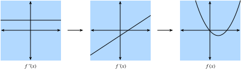

# Intermediate Calculus
:label:`appendix_calculus`

In :numref:`sec_calculus`, We saw the basic elements of differential calculus.  This appendix takes a deeper dive into the fundamentals of calculus and how we can apply it and understand it in the context of machine learning.

## Differential Calculus
Differential calculus is fundamentally the study of how functions behave under small changes.  To see why this is so core to the deep learning, lets consider an example.

Let us suppose that we have a deep neural network where the weights are for convenience all concatenated into a single vector $\mathbf{w} = (w_1, \ldots, w_N)$.  Given a training dataset, we consider the loss of our neural network on this dataset, which we will write as $\mathcal{L}(\mathbf{w})$.  

This function is extraordinarily complex, encoding the performance of all possible models of the given architecture on this dataset, so it is nearly impossible to tell what set of weights $\mathbf{w}$ will make the loss as small as possible.  Thus, when we work in practice, we will start by initializing our weights *randomly*, and then iteratively take small steps in the direction which makes the weights decrease as rapidly as possible.

The question then becomes something that on the surface is no easier: how do we find the direction which makes the weights decrease as quickly as possible?  To dig into this, let us first examine the case with only a single weight: $L(\mathbf{w}) = L(w)$ for a single real value $w$.

Let us suppose we take $w$ and change it a small amount to have $w + \epsilon$, where $\epsilon$ is something small (if we wish to be concrete, think a number like $0.0000001$).  Now, consider the picture below:

```{.python .input}
%matplotlib inline
import d2l
from IPython import display
from mxnet import np, npx
npx.set_np()

# Plot a weird function in a normal range
x_big = np.arange(0.01,3.01,0.01)
ys = np.sin(x_big**x_big)
d2l.plot(x_big, ys, 'x', 'f(x)')
```

If we look at this graph, we see that our strange function ($f(x) = \sin(x^x)$)plotted over a wide range has a very difficult to describe behavior.  However, if we zoom into a tiny segment, the behavior seems to be far simpler: it is just a straight line.

```{.python .input}
# Plot a the same weird function in a tiny range
x_big = np.arange(2.0,2.01,0.0001)
ys = np.sin(x_big**x_big)
d2l.plot(x_big, ys, 'x', 'f(x)')
```

For most functions we can think of, it is reasonable to expect that as we shift the value of the function by a little bit, the output will also be shifted by a little bit.  The only question we need to answer is, "How large is the change in the output compared to the change in the input?  Is it half as large?  Twice as large?"

Thus, what we can consider is to take the change in the output, divide it by the change in input, and see how large it is.  We can write this formally as

$$
\frac{L(w+\epsilon) - L(w)}{(w+\epsilon) - w} = \frac{L(w+\epsilon) - L(w)}{\epsilon}.
$$

This is already enough to start to play around with in code.  For instance, suppose we know that $L(w) = w^{2} + 1701(w-4)^3$, then we can see how large this value is at the point $w = 4$ as follows.

``` {.python .input}
# Define our function
L = lambda w: w**2 + 1701*(w-4)**3

# print the difference divided by epsilon for several epsilon
for epsilon in [0.1,0.001,0.0001,0.00001] :
    print("epsilon = {:.5f} -> {:.5f}".format(epsilon,(L(4+epsilon)-L(4))/epsilon))
```

Now, if we are observant, we will notice that the output of this number is suspiciously close to $8$.  Indeed, if we fiddle with the $\epsilon$ value, and make it smaller, we will see values progressively closer to $8$.  Thus we may conclude, correctly, that the value we seek (the degree a change in the input changes the output) should be $8$ at the point $w=4$.  The way that a mathematician encodes this fact is by saying that

$$
\lim_{\epsilon \rightarrow 0}\frac{L(4+\epsilon) - L(4)}{\epsilon} = 8.
$$

As a bit of a historical digression: for the first few decades of neural network research, scientists used this algorithm (the *method of finite differences*) to evaluate how a loss function changed under small perturbation: just change the weights and see how the loss changed.  This is computationally inefficient, requiring two evaluations of the loss function to see how a single change of one variable influenced the loss.  If we tried to do this with even a paltry few thousand parameters, it would require several thousand evaluations of the network over the entire dataset!  It was not until 1986 that the *backpropagation algorithm* introduced in a [paper by David E. Rumelhart, Geoffrey E. Hinton & Ronald J. Williams](https://www.nature.com/articles/323533a0) that it was fully understood how the rules of calculus described below could provide a method that, in the same computation time as a single prediction of the network over the dataset, provides how *any* change of the weights together would change the loss.

Back in our example, this value $8$ is different for different values of $w$, so it makes sense to define this as a function itself.  More formally, we will call this value dependent rate of change the *derivative* and write it as

$$
\frac{df}{dx}(x) = \lim_{\epsilon \rightarrow 0}\frac{f(x+\epsilon) - f(x)}{\epsilon}.
$$

We will often encounter many different notations for the derivative in many different texts. For instance, all of the below notations indicate the same thing:

$$
\frac{df}{dx} = \frac{d}{dx}f = f' = \nabla_xf = D_xf = f_x.
$$

Most authors will pick a single notation and stick with it, however even that is not guaranteed.  It is best to be familiar with all of these.  We will use the notation $\frac{df}{dx}$ throughout this text, unless we want to take the derivative of a complex expression, in which case we will use $\frac{d}{dx}f$ to write expressions like
$$
\frac{d}{dx}\left[x^4+\cos\left(\frac{x^2+1}{2x-1}\right)\right].
$$

Often times, it is intuitively useful to unravel the definition of derivative again to see how a function changes when we make a small change.  To this end, notice that we can say:

$$
\begin{aligned}
\frac{df}{dx}(x) = \lim_{\epsilon \rightarrow 0}\frac{f(x+\epsilon) - f(x)}{\epsilon} & \implies \frac{df}{dx}(x) \approx \frac{f(x+\epsilon) - f(x)}{\epsilon} \\
& \implies \epsilon \frac{df}{dx}(x) \approx f(x+\epsilon) - f(x) \\
& \implies f(x+\epsilon) \approx f(x) + \epsilon \frac{df}{dx}(x).
\end{aligned}
$$

In this way, we can understand the derivative as the scaling factor that tells us how large of change we get in the output for a change in the input.

## Rules of Calculus
:label:`sec_derivative_table`

A full formal treatment of calculus would derive everything from first principles.  We will not indulge in this temptation here, but rather list the most commonly encountered derivatives, and provide an understanding of the common rules.

### Common Derivatives
When computing derivatives, one can often times use a series of rules to reduce the computation to a few core functions.  In a full calculus class, we would derive an extensive table of dozens of fundamental derivatives.  Below, we  summarize only most important ones encountered in practice---about 90% of the derivatives we will encounter on a regular basis will be some combination of these.

* **Derivative of constants.** $\frac{d}{dx}c = 0$.
* **Derivative of linear functions.** $\frac{d}{dx}(ax) = a$.
* **Power rule.** $\frac{d}{dx}x^n = nx^{n-1}$.
* **Derivative of exponentials.** $\frac{d}{dx}e^x = e^x$.
* **Derivative of the logarithm.** $\frac{d}{dx}\log(x) = \frac{1}{x}$.

### Derivative rules
If we needed to compute every derivative separately and store them in a table, we would not be able to work with them.  It is a gift of mathematics that we can take a small table like the above and use it to compute more complex derivatives like finding the derivative of $f(x) = \log\left(1+(x-1)^{10}\right)$.  The key to doing so is to codify what happens when we take functions and combine them in various ways, most importantly: sums, products, and compositions.

* **Sum rule.** $\frac{d}{dx}(g(x) + h(x)) = \frac{dg}{dx}(x) + \frac{dh}{dx}(x)$.
* **Product rule.** $\frac{d}{dx}(g(x)\cdot h(x)) = g(x)\frac{dh}{dx}(x) + \frac{dg}{dx}(x)h(x)$.
* **Chain rule.** $\frac{d}{dx}g(h(x)) = \frac{dg}{dh}(h(x))\cdot \frac{dh}{dx}(x)$.

It is worth seeing at least intuitively why these rules are true, as it gives excellent intuition into how one can reason with small changes in the input.  For the sum rule, we may examine the following chain of reasoning:

$$
\begin{aligned}
f(x+\epsilon) & = g(x+\epsilon) + h(x+\epsilon) \\
& \approx g(x) + \epsilon \frac{dg}{dx}(x) + h(x) + \epsilon \frac{dh}{dx}(x) \\
& = g(x) + h(x) + \epsilon\left(\frac{dg}{dx}(x) + \frac{dh}{dx}(x)\right) \\
& = f(x) + \epsilon\left(\frac{dg}{dx}(x) + \frac{dh}{dx}(x)\right).
\end{aligned}
$$

Thus by comparing with the fact that $f(x+\epsilon) \approx f(x) + \epsilon \frac{df}{dx}(x)$ we see that $\frac{df}{dx}(x) = \frac{dg}{dx}(x) + \frac{dh}{dx}(x)$ as desired.  The summary of the idea is that because the way $g$ and $h$ change when we change the input is to change the output scaled by the factors $\frac{dg}{dx}(x)$ and $\frac{dh}{dx}(x)$ respectively, we may add up the contributions.

The product is more subtle, and will require a new observation about how to work with these expressions.  We will begin as before:

$$
\begin{aligned}
f(x+\epsilon) & = g(x+\epsilon)\cdot h(x+\epsilon) \\
& \approx g(x) + \epsilon \frac{dg}{dx}(x))\cdot(h(x) + \epsilon \frac{dh}{dx}(x)) \\
& = g(x)\cdot h(x) + \epsilon\left(g(x)\frac{dh}{dx}(x) + \frac{dg}{dx}(x)h(x)\right) + \epsilon^2\frac{dg}{dx}(x)\frac{dh}{dx}(x) \\
& = f(x) + \epsilon\left(g(x)\frac{dh}{dx}(x) + \frac{dg}{dx}(x)h(x)\right) + \epsilon^2\frac{dg}{dx}(x)\frac{dh}{dx}(x). \\
\end{aligned}
$$

This resembles the computation done above, and indeed we see our answer ($\frac{df}{dx}(x) = g(x)\frac{dh}{dx}(x) + \frac{dg}{dx}(x)h(x)$) sitting there next to $\epsilon$, but there is the issue of that term of size $\epsilon^{2}$.  We will refer to this as a *higher-order term*, since the power of $\epsilon^2$ is higher than the power of $\epsilon^1$.  We will see in a later section that we will sometimes want to keep track of these, however for now observe that if $\epsilon = 0.0000001$, then $\epsilon^{2}= 0.0000000000001$, which is vastly smaller.  As we send $\epsilon \rightarrow 0$, we may safely ignore the higher order terms.  As a general convention in this appendix, we will use "$\approx$" to denote that the two terms are equal up to higher order terms,  In this case, we can easily be more formal.  If we looked at the difference quotient

$$
\frac{f(x+\epsilon) - f(x)}{\epsilon} = g(x)\frac{dh}{dx}(x) + \frac{dg}{dx}(x)h(x) + \epsilon \frac{dg}{dx}(x)\frac{dh}{dx}(x),
$$

and thus as we send $\epsilon \rightarrow 0$, the right hand term goes to zero as well.  This gives the product rule.

Finally, with the chain rule, we can again progress as before and see that

$$
\begin{aligned}
f(x+\epsilon) & = g(h(x+\epsilon)) \\
& \approx g\left(h(x) + \epsilon \frac{dh}{dx}(x)\right) \\
& \approx g(h(x)) + \epsilon \frac{dh}{dx}(x) \frac{dg}{dh}(h(x))\\
& = f(x) + \epsilon \frac{dg}{dh}(h(x))\frac{dh}{dx}(x),
\end{aligned}
$$

where in the second line we view the function $g$ as having its input ($h(x)$) shifted by the tiny quantity $\epsilon \frac{dh}{dx}(x)$.

In this way we see that we can flexibly combine all our derivative rules to compute essentially any expression desired.  For instance,

$$
\begin{aligned}
\frac{d}{dx}\left[\log\left(1+(x-1)^{10}\right)\right] & = \left(1+(x-1)^{10}\right)^{-1}\frac{d}{dx}\left[1+(x-1)^{10}\right]\\
& = \left(1+(x-1)^{10}\right)^{-1}\left(\frac{d}{dx}[1] + \frac{d}{dx}[(x-1)^{10}]\right) \\
& = \left(1+(x-1)^{10}\right)^{-1}\left(0 + 10(x-1)^9\frac{d}{dx}[x-1]\right) \\
& = 10\left(1+(x-1)^{10}\right)^{-1}(x-1)^9 \\
& = \frac{10(x-1)^9}{1+(x-1)^{10}}.
\end{aligned}
$$

Where each line has used the following rules:

1. The chain rule and derivative of logarithm.
2. The sum rule.
3. The derivative of constants, chain rule, and power rule.
4. The sum rule, derivative of linear functions, derivative of constants.

Two things should be clear after doing this example:

1. Any function we can write down using sums, products, constants, powers, exponentials, and logarithms can have its derivate computed mechanically by following these rules.
2. Having a human follow these rules can be tedious and error prone!  For the types of functions encountered in deep learning, we should think of the function compositions as being potentially hundreds of layers deep or more.

Thankfully, these two facts together hint towards a way forward: this is a perfect candidate for mechanization!  Indeed backpropagation is exactly finding an efficient way to apply these derivative rules.

### As linear approximation
When working with derivatives, it is often useful to geometrically interpret the approximation used above.  In particular, note that the equation 

$$
f(x+\epsilon) \approx f(x) + \epsilon \frac{df}{dx}(x),
$$

approximates the value of $f$ by a line which passes through the point $(x,f(x))$ and has slope $\frac{df}{dx}(x)$.  In this way we say that the derivative gives a linear approximation to the function $f$, as illustrated below:

```{.python .input}
# Compute Sin
xs = np.arange(-np.pi,np.pi,0.01)
plots = [np.sin(xs)]

# Compute some linear approximations
# uses: d(sin(x))/dx = cos(x)
for x0 in [-1.5,0,2] :
    plots.append(np.sin(x0) + (xs-x0)*np.cos(x0))

# Plot them
d2l.plot(xs, plots, 'x', 'f(x)', ylim=[-1.5,1.5])
```

### Higher order derivatives
Notice that once we have a function $f$, we can take the derivative to get $\frac{df}{dx}$.  This function tells we how the function $f$ is changing near a point, giving the rate of change of the function $f$ at that point.  However, the function $\frac{df}{dx}$ is just another function, so nothing stops we from computing the derivative of $\frac{df}{dx}$ to get $\frac{d^2f}{dx^2} = \frac{df}{dx}\left(\frac{df}{dx}\right)$, the second derivative of $f$.  This function is the rate of change of the rate of change of $f$, or in other words, how the rate of change is changing.  To keep the notation clean, we will sometimes write this as 

$$
f^{(n)}(x) = \frac{d^{n}f}{dx^{n}} = \left(\frac{d}{dx}\right)^{n} f.
$$

We can try to visualize this by considering a few cases.  First, if the second derivative is a positive constant, that means that the first derivative is increasing.  But this means that the first derivative starts out negative, becomes zero at a point, and then becomes positive, so the function $f$ itself decreases, flattens out, then increases.  In other words, the function $f$ curves up, and has a single minimum.



Second, if the second derivative is a negative constant, that means that the first derivative is decreasing.  But this means that the first derivative starts out positive, becomes zero at a point, and then becomes negative, so the function $f$ itself increases, flattens out, then decreases.  In other words, the function $f$ curves down, and has a single maximum.


Third, if the second derivative is a always zero, then the first derivative never changes---it is constant!  This means that $f$ increases at a fixed rate, and $f$ is itself a straight line.


This means that we can interpret the second derivative as giving the way that the function $f$ curves.  Positive means that it curves upwards, negative means that it curves downwards, and zero means that it does not curve at all.

In fact, we can know exactly what function we are dealing with in this case.  Consider the function $g(x) = ax^{2}+ bx + c$.  We can then compute that

$$
\begin{aligned}
g(x) & = ax^{2}+ bx + c \\
\frac{dg}{dx}(x) & = 2ax + b \\
\frac{d^2g}{dx^2}(x) & = 2a.
\end{aligned}
$$

Just as the previous section showed that the first derivative gives the best approximation to a function by a line, we might now ask if having the first and second derivative gives the best approximation by a quadratic.  The answer is yes!  The next section shows how we can continue this reasoning to obtain the *Taylor series*, however, lets end this section with a taste of what that looks like for the function $\sin(x)$.

```{.python .input}
# Compute Sin
xs = np.arange(-np.pi,np.pi,0.01)
plots = [np.sin(xs)]

# Compute some quadratic approximations
# uses: d(sin(x))/dx = cos(x)
for x0 in [-1.5,0,2] :
    plots.append(np.sin(x0) + (xs-x0)*np.cos(x0) - (xs-x0)**2*np.sin(x0)/2)

# Plot them
d2l.plot(xs, plots, 'x', 'f(x)', ylim=[-1.5,1.5])
```

### Taylor Series
Let us suppose we are given a function $f(x)$.  Let us ask: what quadratic has the same value, first derivative, and second derivative as $f$ at the point $x_0$.  A little algebra shows that we can get the job done with

$$
\frac{1}{2}\frac{d^2f}{dx^2}(x_0)(x-x_0)^{2}+ \frac{df}{dx}(x_0)(x-x_0) + f(x_0).
$$

The denominator of $2$ is there to cancel out the $2$ we get when we take two derivatives of $x^2$, and the other terms are all zero.  Same logic applies for the first derivative and the value itself.

If we push the logic further, we can do the same thing with three derivatives to get

$$
\frac{\frac{d^3f}{dx^3}(x_0)}{6}(x-x_0)^3 + \frac{\frac{d^2f}{dx^2}(x_0)}{2}(x-x_0)^{2}+ \frac{df}{dx}(x_0)(x-x_0) + f(x_0).
$$

where the $6$ comes from the number we get if we take three derivatives of $x^3$.

In general, we can get a degree $N$ polynomial which has the same first $N$ derivatives by taking

$$
P_N(x) = \sum_{n = 0}^{n} \frac{f^{(n)}(x_0)}{n!}(x-x_0)^{n}.
$$

where we have used the notation that

$$
f^{(n)}(x) = \frac{d^{n}f}{dx^{n}} = \left(\frac{d}{dx}\right)^{n} f.
$$

Indeed, we can think of this as the best degree $N$ polynomial approximation to our function.

The quality of these approximations is beyond the scope of our introduction, but for well behaved functions (known as real analytic functions) like $\cos(x)$ or $e^{x}$ we can write out the infinite number of terms and get the same answer back:

$$
f(x) = \sum_{n = 0}^\infty \frac{f^{(n)}(x_0)}{n!}(x-x_0)^{n}.
$$

For instance, if $f(x) = e^{x}$, then we know that $f^{(n)}(x) = e^{x}$ since $e^{x}$ is its own derivative, and we can take the Taylor series at $x_0 = 0$ to conclude that

$$
e^{x} = \sum_{n = 0}^\infty \frac{x^{n}}{n!} = 1 + x + \frac{x^2}{2} + \frac{x^3}{6} + \cdots.
$$

Let us see how this works in code and observe how increasing the degree of the Taylor approximation brings us closer to the desired function $e^x$.

```{.python .input}
# Compute the exponential function
xs = np.arange(0,3,0.01)
ys = np.exp(xs)

# Compute a few Taylor series approximations
P1 = 1 + xs
P2 = 1 + xs + xs**2/2
P5 = 1 + xs + xs**2/2 + xs**3/6 + xs**4/24 + xs**5/120

d2l.plot(xs, [ys,P1,P2,P5], 'x', 'f(x)', legend = ["Exponential", "Degree 1 Taylor Series", "Degree 2 Taylor Series", "Degree 5 Taylor Series"])
```

Taylor series have two primary uses:

1. *Theoretical*: Often when trying to understand how something works, the functions themselves will be too complex to work with.  Using Taylor series lets we turn it into a  polynomial that we can work with directly.
2. *Numerical*: Similarly, some functions like $e^{x}$ or $\cos(x)$ are  difficult for computers to work with.  They can store tables of values at a fixed precision (and this is often done), but it still leaves open questions like "What is the 1000-th digit of $\cos(1)$?"  To answer such questions, Taylor series are often used.  

## Functions of multiple variables
Now, that we have a fairly strong understanding of what happens if we had a function of a single variable, let us return to our original question where we were considering a loss function of potentially billions of weights.  What our previous discussion tells us is that if we change a single one of these billions of weights leaving every other one fixed, we know what will happen!  This is nothing more than a function of a single variable, so we can write

$$
L(w_1+\epsilon_1,w_2,\ldots,w_N) \approx L(w_1,w_2,\ldots,w_N) + \epsilon_1 \frac{d}{dw_1} L(w_1,w_2,\ldots,w_N).
$$

We will call the derivative in one variable while fixing the other the *partial derivative*, and we will use the notation $\frac{\partial}{\partial w_1}$.

Now, let us take this, and change $w_2$ a little bit to $w_2 + \epsilon_2$:

$$
\begin{aligned}
L(w_1+\epsilon_1,w_2+\epsilon_2,\ldots,w_N) & \approx L(w_1,w_2+\epsilon_2,\ldots,w_N) + \epsilon_1 \frac{\partial}{\partial w_1} L(w_1,w_2+\epsilon_2,\ldots,w_N) \\
& \approx L(w_1,w_2,\ldots,w_N) \\
& \quad + \epsilon_2\frac{\partial}{\partial w_2} L(w_1,w_2,\ldots,w_N) \\
& \quad + \epsilon_1 \frac{\partial}{\partial w_1} L(w_1,w_2,\ldots,w_N) \\
& \quad + \epsilon_1\epsilon_2\frac{\partial}{\partial w_2}\frac{\partial}{\partial w_1} L(w_1,w_2,\ldots,w_N) \\
& \approx L(w_1,w_2,\ldots,w_N) \\
& \quad + \epsilon_2\frac{\partial}{\partial w_2} L(w_1,w_2,\ldots,w_N) \\
& \quad + \epsilon_1 \frac{\partial}{\partial w_1} L(w_1,w_2,\ldots,w_N).
\end{aligned}
$$

where we have used the idea that $\epsilon_1\epsilon_2$ is a higher order term that we can discard in the same way we could discard $\epsilon^{2}$ in the previous section.  By continuing in this manner, we may write that

$$
L(w_1+\epsilon_1,w_2+\epsilon_2,\ldots,w_N+\epsilon_N) \approx L(w_1,w_2,\ldots,w_N) + \sum_i \epsilon_i \frac{\partial}{\partial w_i} L(w_1,w_2,\ldots,w_N).
$$

This may look like a mess, but we can make this more familiar by noting that the sum on the right looks exactly like a dot product, so if we let

$$
\boldsymbol{\epsilon} = [\epsilon_1, \ldots, \epsilon_N]^\top, \text{ and }
\nabla_{\mathbf{x}} L = \left[\frac{\partial L}{\partial x_1}, \ldots, \frac{\partial L}{\partial x_N}\right]^\top,
$$

then

$$
L(\mathbf{w} + \boldsymbol{\epsilon}) \approx L(\mathbf{w}) + \boldsymbol{\epsilon}\cdot \nabla_{\mathbf{w}} L(\mathbf{w}).
$$

We will call the vector $\nabla_{\mathbf{w}} L$ the *gradient* of $L$.

This formula is worth pondering for a moment.  It has exactly the format that we encountered in one dimension, just we have converted everything to vectors and dot products.  It allows us to tell approximately how the function $L$ will change given any perturbation to the input.  As we will see in the next section, this will provide us with an important tool in understanding geometrically how we can learn using information contained in the gradient.

But first, let us see this approximation at work with an example.  Suppose we are working with the function

$$
f(x,y) = \log(e^x + e^y) \text{ with gradient } \nabla f (x,y) = \left[\frac{e^x}{e^x+e^y}, \frac{e^y}{e^x+e^y}\right].
$$

If we look at a point like $(0,\log(2))$, we see that

$$
f(x,y) = \log(3) \text{ with gradient } \nabla f (x,y) = \left[\frac{1}{3}, \frac{2}{3}\right].
$$

Thus, if we want to approximate $f$ at $(\epsilon_1,\log(2) + \epsilon_2)$,  we see that we should have

$$
f(\epsilon_1,\log(2) + \epsilon_2) \approx \log(3) + \frac{1}{3}\epsilon_1 + \frac{2}{3}\epsilon_2.
$$

We can test this in code to see how good the approximation is.

```{.python .input}
f = lambda x,y : np.log(np.exp(x) + np.exp(y))
grad_f = lambda x,y : np.array([np.exp(x)/(np.exp(x)+np.exp(y)), np.exp(y)/(np.exp(x)+np.exp(y))])

epsilon = np.array([0.01,-0.03])
"Approximation: {}".format(f(0,np.log(2)) + epsilon.dot(grad_f(0,np.log(2)))), "True Value: {}".format(f(0+epsilon[0],np.log(2)+epsilon[1]))
```

### Geometry of gradients and gradient descent
Consider the formula 

$$
L(\mathbf{w} + \boldsymbol{\epsilon}) \approx L(\mathbf{w}) + \boldsymbol{\epsilon}\cdot \nabla_{\mathbf{w}} L(\mathbf{w}).
$$

Let us suppose I want to minimize this loss.  Let's understand geometrically the algorithm of gradient descent first obtained in  :numref:`sec_autograd`. What we will do is the following:

1. Start with a random choice for the initial parameters $\mathbf{w}$.
2. Find the direction $\mathbf{v}$ that makes $L$ decrease the most rapidly at $\mathbf{w}$.
3. Take a small step in that direction: $\mathbf{w} \rightarrow \mathbf{w} + \epsilon\mathbf{v}$.
4. Repeat.

The only thing we do not know exactly how to do is to compute the vector $\mathbf{v}$ in the second step.  We will call such a direction the *direction of steepest descent*.  Let us look at our approximation.   Using the geometric understanding of dot products from :numref:`appendix_linear_algebra`, we see that

$$
L(\mathbf{w} + \mathbf{v}) \approx L(\mathbf{w}) + \mathbf{v}\cdot \nabla_{\mathbf{w}} L(\mathbf{w}) = \|\nabla_{\mathbf{w}} L(\mathbf{w})\|\cos(\theta),
$$

where we have taken our direction to have length one for convenience, and used $\theta$ for the angle between $\mathbf{v}$ and $\nabla_{\mathbf{w}} L(\mathbf{w})$.  If we want to find the direction that decreases $L$ as rapidly as possible, we want to make this as expression as negative as possible.  The only way the direction we pick enters into this equation is through $\cos(\theta)$, and thus we wish to make this cosine as negative as possible.  Now, recalling the shape of cosine, we can make this as negative as possible by making $\cos(\theta) = -1$ or equivalently making the angle between the gradient and our chosen direction to be $\pi$ radians, or equivalently $180$ degrees.  The only way to make this angle so, is to head in the exact opposite direction:  pick $\mathbf{v}$ to point in the exact opposite direction to $\nabla_{\mathbf{w}} L(\mathbf{w})$!

This brings us to one of the most important mathematical concepts in machine learning: the direction of steepest decent points in the direction of $-\nabla_{\mathbf{w}}L(\mathbf{w})$.  Thus our informal algorithm can be rewritten as follows.

1. Start with a random choice for the initial parameters $\mathbf{w}$.
2. Compute $\nabla_{\mathbf{w}} L(\mathbf{w})$.
3. Take a small step in the opposite of that direction: $\mathbf{w} \rightarrow \mathbf{w} - \epsilon\nabla_{\mathbf{w}} L(\mathbf{w})$.
4. Repeat.


This basic algorithm has been modified and adapted many ways by many researchers , but the core concept remains the same in all of them.  Use the gradient to find the direction that decreases the loss as rapidly as possible, and update the parameters to take a step in that direction.

### A note on mathematical optimization
Throughout this book, we focus squarely on numerical optimization techniques for the practical reason that all functions we encounter in the deep learning setting are too complex to minimize explicitly.  

However, it is a useful exercise to consider what the geometric understanding we obtained above tells us about optimizing functions directly.

Suppose we wish to find the value of $\mathbf{x}_0$ which minimizes some function $L(\mathbf{x})$.  Let us suppose moreover that someone gives us a value and tells us that it is the value that minimizes $L$.  Is there anything we can check to see if their answer is even plausible?

Consider the expression
$$
L(\mathbf{x}_0 + \boldsymbol{\epsilon}) \approx L(\mathbf{x}_0) + \boldsymbol{\epsilon}\cdot \nabla_{\mathbf{x}} L(\mathbf{x}_0).
$$

If the gradient is not zero, we know that we can take $\boldsymbol{\epsilon} = -\epsilon \nabla_{\mathbf{x}} L(\mathbf{x}_0)$ to find a value of $L$ that is smaller.  Thus, if we truly are at a minimum, this cannot be the case!  We can conclude that if $\mathbf{x}_0$ is a minimum, then $\nabla_{\mathbf{x}} L(\mathbf{x}_0 = 0$.  We call points with $\nabla_{\mathbf{x}} L(\mathbf{x}_0 = 0$ *critical points*.

This is nice, because in some settings, one explicitly find all the points where the gradient is zero, and find the one with the smallest value.  To be concrete, consider the function
$$
f(x) = 3x^4 - 4x^3 -12x^2.
$$

This function has derivative
$$
\frac{df}{dx} = 12x^3 - 12x^2 -24x = 12x(x-2)(x+1).
$$

The only possible location of minima are at $x = -1, 0, 2$, where the function takes the values $-5,0,-32$ respectively, and thus we can conclude that we minimize our function when $x = 2$.  A quick plot confirms this.

```{.python .input}
x = np.arange(-2,3,0.01)
f = 3*x**4 - 4*x**3 -12*x**2

d2l.plot(x,f, 'x', 'f(x)')
```

This highlights an important fact to know when working either theoretically or numerically: the only possible points where we can minimize (or maximize) a function will have gradient equal to zero, however, not every point with gradient zero is the minimum (or maximum).  

### Multivariate Chain rule
Let us suppose we have a function of four variables ($w,x,y,z$) which we can make by composing many terms:

$$
\begin{aligned}
f(u,v) & = (u+v)^{2} \\
u(a,b) & = (a+b)^{2}, \qquad v(a,b) = (a-b)^{2}, \\
a(w,x,y,z) & = (w+x+y+z)^{2},\qquad b(w,x,y,z) = (w+x-y-z)^2.
\end{aligned}
$$

Such chains of equations are common when working with neural networks, so trying to understand how to compute gradients of such functions is key to advanced techniques in machine learning.  We can start to see visually hints of this connection if we take a look at what variables directly relate to one another.


Nothing stops us from just composing everything and writing out that

$$
f(w,x,y,z) = (((w+x+y+z)^2+(w+x-y-z)^2)^2+((w+x+y+z)^2-(w+x-y-z)^2)^2)^2,
$$

and then taking the derivative by just using good old single variable derivatives, but if we did that we would quickly find ourself swamped with terms, many of which are repeats!  Indeed, one can see that, for instance:

$$
\begin{aligned}
\frac{\partial f}{\partial w} & = 2 (2 (2 (w + x + y + z) - 2 (w + x - y - z)) ((w + x + y + z)^{2}- (w + x - y - z)^{2}) + \\
& \quad 2 (2 (w + x - y - z) + 2 (w + x + y + z)) ((w + x - y - z)^{2}+ (w + x + y + z)^{2})) \times \\
& \quad (((w + x + y + z)^{2}- (w + x - y - z)^2)^{2}+ ((w + x - y - z)^{2}+ (w + x + y + z)^{2})^{2}).
\end{aligned}
$$

If we then also wanted to compute $\frac{\partial f}{\partial x}$, we would end up with a similar equation again with many repeated terms, and many *shared* repeated terms between the two derivatives.  This represents a massive quantity of wasted work, and if we needed to compute derivatives this way, the whole deep learning revolution would have stalled out before it began!


Let us start by trying to understand how $f$ changes when we change $a$---essentially assuming that $w,x,y,z$ all do not exist.  We will reason as we did back when we worked with the gradient for the first time.  Let us take $a$ and add a small amount $\epsilon$ to it. 

$$
\begin{aligned}
f(u(a+\epsilon,b),v(a+\epsilon,b)) & \approx f\left(u(a,b) + \epsilon\frac{\partial u}{\partial a}(a,b), v(a,b) + \epsilon\frac{\partial v}{\partial a}(a,b)\right) \\
& \approx f(u(a,b),v(a,b)) + \epsilon\left[\frac{\partial f}{\partial u}(u(a,b),v(a,b))\frac{\partial u}{\partial a}(a,b) + \frac{\partial f}{\partial v}(u(a,b),v(a,b))\frac{\partial v}{\partial a}(a,b)\right].
\end{aligned}
$$

The first line follows from the definition of partial derivative, and the second follows from the definition of gradient.  It is notationally burdensome to track exactly where we evaluate every derivative, as in the expression $\frac{\partial f}{\partial u}(u(a,b),v(a,b))$, so we often abbreviate this to the much more memorable

$$
\frac{\partial f}{\partial a} = \frac{\partial f}{\partial u}\frac{\partial u}{\partial a}+\frac{\partial f}{\partial v}\frac{\partial v}{\partial a}.
$$

It is useful to think about the meaning of the process. We are trying to understand how a function of the form $f(u(a,b),v(a,b))$ changes its value with a change in $a$.  There are two pathways this can occur: there is the pathway where $a \rightarrow u \rightarrow f$ and where $a \rightarrow v \rightarrow f$.  We can compute both of these contributions via the chain rule: $\frac{\partial w}{\partial u} \cdot \frac{\partial u}{\partial x}$ and $\frac{\partial w}{\partial v} \cdot \frac{\partial v}{\partial x}$ respectively, and added up.  

Imagine we have a different network of functions where the functions on the right depend on those they are connected to on the left.


To compute something like $\frac{\partial f}{\partial y}$, we need to sum over all (in this case $3$) paths from $y$ to $f$ giving

$$
\frac{\partial f}{\partial y} = \frac{\partial f}{\partial a} \frac{\partial a}{\partial u} \frac{\partial u}{\partial y} + \frac{\partial f}{\partial u} \frac{\partial u}{\partial y} + \frac{\partial f}{\partial b} \frac{\partial b}{\partial v} \frac{\partial v}{\partial y}.
$$

Understanding the chain rule in this way will pay great dividends when trying to understand how gradients flow through networks, and why various architectural choices like those in LSTMs (:numref:`sec_lstm`) or residual layers (:numref:`sec_resnet`) can help shape the learning process by controlling gradient flow.

### The Backpropagation Algorithm

Let us return to the problem we saw in the previous section where

$$
\begin{aligned}
f(u,v) & = (u+v)^{2} \\
u(a,b) & = (a+b)^{2}, \qquad v(a,b) = (a-b)^{2}, \\
a(w,x,y,z) & = (w+x+y+z)^{2},\qquad b(w,x,y,z) = (w+x-y-z)^2.
\end{aligned}
$$

If we want to compute say $\frac{\partial f}{\partial w}$ we may apply the multi-variate chain rule to see:

$$
\begin{aligned}
\frac{\partial f}{\partial w} & = \frac{\partial f}{\partial u}\frac{\partial u}{\partial w} + \frac{\partial f}{\partial v}\frac{\partial v}{\partial w}, \\
\frac{\partial u}{\partial w} & = \frac{\partial u}{\partial a}\frac{\partial a}{\partial w}+\frac{\partial u}{\partial b}\frac{\partial b}{\partial w}, \\
\frac{\partial v}{\partial w} & = \frac{\partial v}{\partial a}\frac{\partial a}{\partial w}+\frac{\partial v}{\partial b}\frac{\partial b}{\partial w}.
\end{aligned}
$$

Let us try using this decomposition to compute $\frac{\partial f}{\partial w}$.  Notice that all we need here are the various single step partials:

$$
\begin{aligned}
\frac{\partial f}{\partial u} & = 2(u+v),\\
\frac{\partial f}{\partial v} & = 2(u+v),\\
\frac{\partial u}{\partial a} & = 2(a+b),\\
\frac{\partial u}{\partial b} & = 2(a+b),\\
\frac{\partial v}{\partial a} & = 2(a-b),\\
\frac{\partial v}{\partial b} & = -2(a-b),\\
\frac{\partial a}{\partial w} & = 2(w+x+y+z),\\
\frac{\partial b}{\partial w} & = 2(w+x-y-z).
\end{aligned}
$$

If we write this out into code this becomes a fairly manageable expression.

```{.python .input}
### Compute the value of the function from inputs to outputs ###
w = -1; x = 0; y = -2; z = 1
a = (w+x+y+z)**2; b = (w+x-y-z)**2
u = (a+b)**2; v = (a-b)**2
f = (u+v)**2
print("    f at {},{},{},{} is {}".format(w,x,y,z,f))

### Compute the derivative using the decomposition above ###
# First compute the single step partials
df_du = 2*(u+v); df_dv = 2*(u+v)
du_da = 2*(a+b); du_db = 2*(a+b); dv_da = 2*(a-b); dv_db = -2*(a-b)
da_dw = 2*(w+x+y+z); db_dw = 2*(w+x-y-z)

### Now compute the final result from inputs to outputs ###
du_dw = du_da*da_dw + du_db*db_dw; dv_dw = dv_da*da_dw + dv_db*db_dw
df_dw = df_du*du_dw + df_dv*dv_dw
print("df/dw at {},{},{},{} is {}".format(w,x,y,z,df_dw))
```

However, note that this still does not make it easy to compute something like $\frac{\partial f}{\partial x}$.  The reason for that is the *way* we chose to apply the chain rule.  If we look at what we did above, we always kept $\partial w$ in the denominator when we could.  In this way, we chose to apply the chain rule seeing how $w$ changed every other variable.  If that is what we wanted, this would be a good idea.  However, think back to our motivation from deep learning: we want to see how every parameter changes the *loss*.  In essence, we want to apply the chain rule keeping $\partial f$ in the numerator whenever we can!

To be more explicit, note that we can write

$$
\begin{aligned}
\frac{\partial f}{\partial w} & = \frac{\partial f}{\partial a}\frac{\partial a}{\partial w} + \frac{\partial f}{\partial b}\frac{\partial b}{\partial w}, \\
\frac{\partial f}{\partial a} & = \frac{\partial f}{\partial u}\frac{\partial u}{\partial a}+\frac{\partial f}{\partial v}\frac{\partial v}{\partial a}, \\
\frac{\partial f}{\partial b} & = \frac{\partial f}{\partial u}\frac{\partial u}{\partial b}+\frac{\partial f}{\partial v}\frac{\partial v}{\partial b}.
\end{aligned}
$$

Note that this application of the chain rule has us explicitly compute $\frac{\partial f}{\partial u}, \frac{\partial f}{\partial u}, \frac{\partial f}{\partial u}, \frac{\partial f}{\partial u}, \text{ and } \frac{\partial f}{\partial u}$.  Nothing stops us from also including the equations:

$$
\begin{aligned}
\frac{\partial f}{\partial x} & = \frac{\partial f}{\partial a}\frac{\partial a}{\partial x} + \frac{\partial f}{\partial b}\frac{\partial b}{\partial x}, \\
\frac{\partial f}{\partial y} & = \frac{\partial f}{\partial a}\frac{\partial a}{\partial y}+\frac{\partial f}{\partial b}\frac{\partial b}{\partial y}, \\
\frac{\partial f}{\partial z} & = \frac{\partial f}{\partial a}\frac{\partial a}{\partial z}+\frac{\partial f}{\partial b}\frac{\partial b}{\partial z}.
\end{aligned}
$$

and then keeping track of how $f$ changes when we change *any* node in the entire network.  Let us implement it.

```{.python .input}
### Compute the value of the function from inputs to outputs ###
w = -1; x = 0; y = -2; z = 1
a = (w+x+y+z)**2; b = (w+x-y-z)**2
u = (a+b)**2; v = (a-b)**2
f = (u+v)**2
print("    f at {},{},{},{} is {}".format(w,x,y,z,f))

### Compute the derivative using the decomposition above ###
# First compute the single step partials
df_du = 2*(u+v); df_dv = 2*(u+v)
du_da = 2*(a+b); du_db = 2*(a+b); dv_da = 2*(a-b); dv_db = -2*(a-b)
da_dw = 2*(w+x+y+z); db_dw = 2*(w+x-y-z); da_dx = 2*(w+x+y+z); db_dx = 2*(w+x-y-z); da_dy = 2*(w+x+y+z); db_dy = -2*(w+x-y-z); da_dz = 2*(w+x+y+z); db_dz = -2*(w+x-y-z); 

### Now compute how f changes when we change any value from output to input ###
df_da = df_du*du_da + df_dv*dv_da; df_db = df_du*du_db + df_dv*dv_db
df_dw = df_da*da_dw + df_db*db_dw; df_dx = df_da*da_dx + df_db*db_dx
df_dy = df_da*da_dy + df_db*db_dy; df_dz = df_da*da_dz + df_db*db_dz
print("df/dw at {},{},{},{} is {}".format(w,x,y,z,df_dw))
print("df/dx at {},{},{},{} is {}".format(w,x,y,z,df_dx))
print("df/dy at {},{},{},{} is {}".format(w,x,y,z,df_dy))
print("df/dz at {},{},{},{} is {}".format(w,x,y,z,df_dz))
```

The fact that we compute derivatives from $f$ back towards the inputs rather than from the inputs forward to the outputs (as we did in the first code snippet above) is what gives this algorithm its name: *backpropagation*.  Note that there are two steps:
1. Compute the value of the function, and the single step partials from front to back.  While not done above, this can be combined into a single *forward pass*.
2. Compute the gradient of $f$ from back to front.  We call this the *backwards pass*.

This is precisely what every deep learning algorithm implements to allow the computation of the gradient of the loss with respect to every weight in the network at one pass.  It is an astonishing fact that we have such a decomposition.  Without it, the deep learning revolution could have never occurred.

To see how MXNet has encapsulated this, let us take a quick look at this example.

```{.python .input}
from mxnet import autograd

### Initialize as NDArrays, attaching gradients ###
w = np.array(-1); x = np.array(0); y = np.array(-2); z = np.array(1)
w.attach_grad(); x.attach_grad(); y.attach_grad(); z.attach_grad()

### Do the computation like usual, tracking gradients ###
with autograd.record():
    a = (w+x+y+z)**2; b = (w+x-y-z)**2
    u = (a+b)**2; v = (a-b)**2
    f = (u+v)**2

### Execute backward pass ###
f.backward()

print("df/dw at {},{},{},{} is {}".format(w,x,y,z,w.grad))
print("df/dx at {},{},{},{} is {}".format(w,x,y,z,x.grad))
print("df/dy at {},{},{},{} is {}".format(w,x,y,z,y.grad))
print("df/dz at {},{},{},{} is {}".format(w,x,y,z,z.grad))
```

All of what we did above can be done automatically by calling `f.backwards()`.


## Hessians
As with single variable calculus, it is useful to consider higher-order derivatives in order to get a handle on how we can obtain a better approximation to a function than using the gradient alone.

There is one immediate problem one encounters when working with higher order derivatives of functions of several variables, and that is there are a large number of them.  Indeed if we have a function $f(x_1, \ldots, x_n)$ of $n$ variables, then we can take $n^{2}$ many derivatives, namely for any choice of $i$ and $j$:

$$
\frac{d^2f}{dx_idx_j} = \frac{d}{dx_i}\left(\frac{d}{dx_j}f\right).
$$

This is traditionally assembled into a matrix called the *Hessian*:

$$
\mathbf{H}_f = \begin{bmatrix} 
\frac{d^2f}{dx_1dx_1} & \cdots & \frac{d^2f}{dx_1dx_n} \\
\vdots & \ddots & \vdots \\
\frac{d^2f}{dx_ndx_1} & \cdots & \frac{d^2f}{dx_ndx_n} \\
\end{bmatrix}.
$$

Not every entry of this matrix is independent.  Indeed, we can show that as long as both *mixed partials* (partial derivatives with respect to more than one variable) exist and are continuous, we can say that for any $i,j$, 

$$
\frac{d^2f}{dx_idx_j} = \frac{d^2f}{dx_jdx_i}.
$$

This follows by considering first perturbing a function in the direction of $x_i$, and then perturbing it in $x_j$ and then comparing the result of that with what happens if we perturb first $x_j$ and then $x_i$, with the knowledge that both of these orders lead to the same final change in the output of $f$.

As with single variables, we can use these derivatives to get a far better idea of how the function behaves near a point.  In particular, we can use it to find the best fitting quadratic near a point $\mathbf{x}_0$.

Let us see an example.  Suppose that $f(x_1,x_2) = a + b_1x_1 + b_2x_2 + c_{11}x_1^{2} + c_{12}x_1x_2 + c_{22}x_2^{2}$.  This is the general form for a quadratic in two variables.  If we look at the value of the function, its gradient, and its Hessian, all at the point zero:

$$
\begin{aligned}
f(0,0) & = a, \\
\nabla f (0,0) & = \begin{bmatrix}b_1 \\ b_2\end{bmatrix}, \\
\mathbf{H} f (0,0) & = \begin{bmatrix}2 c_{11} & c_{12} \\ c_{12} & 2c_{22}\end{bmatrix}.
\end{aligned}
$$

If we from this, we see we can get our original polynomial back by saying

$$
f(\mathbf{x}) = f(0) + \nabla f (0) \cdot \mathbf{x} + \frac{1}{2}\mathbf{x}^\top \mathbf{H} f (0) \mathbf{x}.
$$

In general, if we computed this expansion any point $\mathbf{x}_0$, we see that

$$
f(\mathbf{x}) = f(\mathbf{x}_0) + \nabla f (\mathbf{x}_0) \cdot (\mathbf{x}-\mathbf{x}_0) + \frac{1}{2}(\mathbf{x}-\mathbf{x}_0)^\top \mathbf{H} f (\mathbf{x}_0) (\mathbf{x}-\mathbf{x}_0).
$$

This works for any dimensional input, and provides the best approximating quadratic to any function at a point.  To give an example, let's plot the function 

$$
f(x,y) = xe^{-x^2-y^2}.
$$

One can compute that the gradient and Hessian are
$$
\nabla f(x,y) = e^{-x^2-y^2}\begin{pmatrix}1-2x^2 \\ -2xy\end{pmatrix} \text{ and } \mathbf{H}f(x,y) = e^{-x^2-y^2}\begin{pmatrix} 4x^3 - 6x & 4x^2y - 2y \\ 4x^2y-2y &4xy^2-2x\end{pmatrix}
$$

And thus, with a little algebra, see that the approximating quadratic at $[-1,0]^\top$ is

$$
f(x,y) \approx e^{-1}(1 - x +2x^2+2y^2).
$$


```{.python .input}
from mpl_toolkits import mplot3d

# Construct grid and compute function
x, y = np.meshgrid(np.linspace(-2, 2, 101), np.linspace(-2, 2, 101), indexing='ij')
z = x*np.exp(- x**2 - y**2)

# Compute gradient and Hessian at (1,0)
z_quad = np.exp(-1)*(1 - x + 2*x**2 + 2*y**2)

# Plot Function
ax = d2l.plt.figure().add_subplot(111, projection='3d')
ax.plot_wireframe(x, y, z, **{'rstride': 10, 'cstride': 10})
ax.plot_wireframe(x, y, z_quad, **{'rstride': 10, 'cstride': 10})
ticks = [-1,  0, 1]
d2l.plt.xticks(ticks)
d2l.plt.yticks(ticks)
ax.set_zticks(ticks)
d2l.plt.xlabel('x')
d2l.plt.ylabel('y')
```

This forms the basis for Newton's Algorithm discussed in :numref:`sec_gd`, where we perform numerical optimization iteratively finding the best fitting quadratic, and then exactly minimizing that quadratic.

## A Little Matrix Calculus
Derivatives of functions involving matrices turn out to be particularly nice.  This section can become notationally heavy, so may be skipped in a first reading, but it is useful to know how derivatives of functions involving common matrix operations are often much cleaner than one might initially anticipate, particularly given how central matrix operations are to deep learning applications.

Let us begin with an example.  Suppose we have some fixed row vector $\boldsymbol{\beta}$, and we want to take the product function $f(\mathbf{x}) = \boldsymbol{\beta}\mathbf{x}$, and understand how the dot product changes when we change $\mathbf{x}$.  A bit of notation that will be useful when working with matrix derivatives in ML is called the *denominator layout matrix derivative* where we assemble our partial derivatives into the shape of whatever vector, matrix, or tensor is in the denominator of the differential.  In this case, we will write

$$
\frac{df}{d\mathbf{x}} = \begin{bmatrix}
\frac{df}{dx_1} \\
\vdots \\
\frac{df}{dx_n}
\end{bmatrix}.
$$

where we matched the shape of the column vector $\mathbf{x}$. 

If we write out our function into components this is

$$
f(\mathbf{x}) = \sum_{i = 1}^{n} \beta_ix_i = \beta_1x_1 + \cdots + \beta_nx_n.
$$

If we now take the partial derivative with respect to say $\beta_1$, note that everything is zero but the first term, which is just $x_1$ multiplied by $\beta_1$, so the we obtain that

$$
\frac{df}{dx_1} = \beta_1,
$$

or more generally that 

$$
\frac{df}{dx_i} = \beta_i.
$$

We can now reassemble this into a matrix to see

$$
\frac{df}{d\mathbf{x}} = \begin{bmatrix}
\frac{df}{dx_1} \\
\vdots \\
\frac{df}{dx_n}
\end{bmatrix} = \begin{bmatrix}
\beta_1 \\
\vdots \\
\beta_n
\end{bmatrix} = \boldsymbol{\beta}^\top.
$$

This illustrates a few factors about matrix calculus that we will often counter throughout this section:

* First, The computations will get rather involved.
* Second, The final results are much cleaner than the intermediate process, and will always look similar to the single variable case.  In this case, note that $\frac{d}{dx}(bx) = b$ and $\frac{d}{d\mathbf{x}} (\boldsymbol{\beta}\mathbf{x}) = \boldsymbol{\beta}^\top$ are both similar. 
* Third, transposes can often appear seemingly from nowhere.  The core reason for this is the convention that we match the shape of the denominator, thus when we multiply matrices, we will need to take transposes to match back to the shape of the original term.

To keep building intuition, let us try a computation that is a little harder.  Suppose we have a column vector $\mathbf{x}$, and a square matrix $A$ and we want to compute 

$$
\frac{d}{d\mathbf{x}}(\mathbf{x}^\top A \mathbf{x}).
$$

To drive towards easier to manipulate notation, let us consider this problem using Einstein notation.  In this case we can write the function as

$$
\mathbf{x}^\top A \mathbf{x} = x_ia_{ij}x_j.
$$

To compute our derivative, we need to understand for every $k$, what the value of

$$
\frac{d}{dx_k}(\mathbf{x}^\top A \mathbf{x}) = \frac{d}{dx_k}x_ia_{ij}x_j.
$$

By the product rule, this is

$$
\frac{d}{dx_k}x_ia_{ij}x_j = \frac{dx_i}{dx_k}a_{ij}x_j + x_ia_{ij}\frac{dx_j}{dx_k}.
$$

For a term like $\frac{dx_i}{dx_k}$, it is not hard to see that this is one when $i=k$ and zero otherwise.  This means that every term where $i$ and $k$ are different vanish from this sum, so the only terms that remain in that first sum are the ones where $i=k$.  The same reasoning holds for the second term where we need $j=k$.  This gives

$$
\frac{d}{dx_k}x_ia_{ij}x_j = a_{kj}x_j + x_ia_{ik}.
$$

Now, the names of the indices in Einstein notation are arbitrary---the fact that $i$ and $j$ are different is immaterial to this computation at this point, so we can re-index so that they both use $i$ to see that

$$
\frac{d}{dx_k}x_ia_{ij}x_j = a_{ki}x_i + x_ia_{ik} = (a_{ki} + a_{ik})x_i.
$$

Now, here is where we start to need some practice to go further.  Let us try and identify this outcome in terms of matrix operations.  $a_{ki} + a_{ik}$ is the $k,i$-th component of $\mathbf{A} + \mathbf{A}^\top$.  This gives

$$
\frac{d}{dx_k}x_ia_{ij}x_j = [\mathbf{A} + \mathbf{A}^\top]_{ki}x_i.
$$

Similarly, this term is now the product of the matrix $\mathbf{A} + \mathbf{A}^\top$ by the vector $\mathbf{x}$, so we see that

$$
\left[\frac{d}{d\mathbf{x}}(\mathbf{x}^\top A \mathbf{x})\right]_k = \frac{d}{dx_k}x_ia_{ij}x_j = [(\mathbf{A} + \mathbf{A}^\top)\mathbf{x}]_k.
$$

Thus, we see that the $k$-th entry of the desired derivative is just the $k$-th entry of the vector on the right, and thus the two are the same.  Thus yields

$$
\frac{d}{d\mathbf{x}}(\mathbf{x}^\top A \mathbf{x}) = (\mathbf{A} + \mathbf{A}^\top)\mathbf{x}.
$$

This required significantly more work than our last one, but the final result is small.  More than that, consider the following computation for traditional single variable derivatives:

$$
\frac{d}{dx}(xax) = \frac{dx}{dx}ax + xa\frac{dx}{dx} = (a+a)x.
$$

Equivalently $\frac{d}{dx}(ax^2) = 2ax$.  Again, we get a result that looks suspiciously like the single variable result but with a transpose tossed in.  

At this point, the pattern should be looking rather suspicious, so let us try to figure out why.  When we take matrix derivatives like this, let us first assume that the expression we get will be another matrix expression---by which I mean we can write it in terms of products and sums of matrices and their transposes.  If such an expression exists, it will need to be true for all matrices.  In particular, it will need to be true of $1 \times 1$ matrices, in which case the matrix product is just the of the numbers, the matrix sum is just the sum, and the transpose does nothing at all!  In other words, whatever expression we get *must* match the single variable expression.  This means that, with some practice, one can often guess matrix derivatives just by knowing what the associated single variable expression must look like!

Let us try this out.  Suppose $\mathbf{X}$ is a $n \times m$ matrix, $\mathbf{U}$ is an $n \times r$ and $\mathbf{V}$ is an $r \times m$.  Let us try to compute 

$$
\frac{d}{d\mathbf{V}} \|\mathbf{X} - \mathbf{U}\mathbf{V}\|_2^{2} = \;?
$$

This computation is important in an area called matrix factorization.  For us, however, it is just a derivative to compute.  Let us try to imaging what this would be for $1\times1$ matrices.  In that case, we get the expression

$$ 
\frac{d}{dv} (x-uv)^{2}= 2(x-uv)u,
$$

where, the derivative is rather standard.  If we try to convert this back into a matrix expression we get

$$
\frac{d}{d\mathbf{V}} \|\mathbf{X} - \mathbf{U}\mathbf{V}\|_2^{2}= 2(\mathbf{X} - \mathbf{U}\mathbf{V})\mathbf{U}.
$$

However, if we look at this it does not quite work.  Recall that $\mathbf{X}$ is $n \times m$, as is $\mathbf{U}\mathbf{V}$, so the matrix $2(\mathbf{X} - \mathbf{U}\mathbf{V})$ is $n \times m$.  On the other hand $\mathbf{U}$ is $n \times r$, and we cannot multiply a $n \times m$ and a $n \times r$ matrix since the dimensions do not match! 

We want to get $\frac{d}{d\mathbf{V}}$, which is the same shape of $\mathbf{V}$, which is $r \times m$.  So somehow we need to take a $n \times m$ matrix and a $n \times r$ matrix, multiply them together (perhaps with some transposes) to get a $r \times m$. We can do this by multiplying $U^\top$ by $(\mathbf{X} - \mathbf{U}\mathbf{V})$.  Thus, we can guess

$$
\frac{d}{d\mathbf{V}} \|\mathbf{X} - \mathbf{U}\mathbf{V}\|_2^{2}= 2\mathbf{U}^\top(\mathbf{X} - \mathbf{U}\mathbf{V}).
$$

To show we that this works, I would be remiss to not provide a detailed computation.  If we already believe that this rule-of-thumb works, feel free to skip past this derivation.  To compute 

$$
\frac{d}{d\mathbf{V}} \|\mathbf{X} - \mathbf{U}\mathbf{V}\|_2^2,
$$

we must find for every $a,b$

$$
\frac{d}{dv_{ab}} \|\mathbf{X} - \mathbf{U}\mathbf{V}\|_2^{2}= \frac{d}{dv_{ab}} \sum_{i,j}(x_{ij} - \sum_k u_{ik}v_{kj})^2.
$$

Recalling that all entries of $\mathbf{X}$ and $\mathbf{U}$ are constants as far as $\frac{d}{dv_{ab}}$ is concerned, we may push the derivative inside the sum, and apply the chain rule to the square to get

$$
\frac{d}{dv_{ab}} \|\mathbf{X} - \mathbf{U}\mathbf{V}\|_2^{2}= \sum_{i,j}2\left(x_{ij} - \sum_k u_{ik}v_{kj}\right)\left(\sum_k u_{ik}\frac{dv_{kj}}{dv_{ab}} \right).
$$

As in the previous derivation, we may note that $\frac{dv_{kj}}{dv_{ab}}$ is only non-zero if the $k=a$ and $j=b$.  If either of those conditions do not hold, the term in the sum is zero, and we may freely discard it.  We see that

$$
\frac{d}{dv_{ab}} \|\mathbf{X} - \mathbf{U}\mathbf{V}\|_2^{2}= \sum_{i}2\left(x_{ib} - \sum_k u_{ik}v_{kb}\right)u_{ia}.
$$

An important subtlety here is that the requirement that $k=a$ does not occur inside the inner sum since that $k$ is a dummy variable which we are summing over inside the inner term.  For a notationally cleaner example, consider why

$$
\frac{d}{dx_1} \left(\sum_i x_i \right)^{2}= 2\left(\sum_i x_i \right).
$$

From this point, we may start identifying components of the sum.  First, 

$$
\sum_k u_{ik}v_{kb} = [\mathbf{U}\mathbf{V}]_{ib}.
$$

So the entire expression in the inside of the sum is

$$
\left(x_{ib} - \sum_k u_{ik}v_{kb}\right) = [\mathbf{X}-\mathbf{U}\mathbf{V}]_{ib}.
$$

This means we may now write our derivative as

$$
\frac{d}{dv_{ab}} \|\mathbf{X} - \mathbf{U}\mathbf{V}\|_2^{2}= 2\sum_{i}[\mathbf{X}-\mathbf{U}\mathbf{V}]_{ib}u_{ia}.
$$

We want this to look like the $a,b$ element of a matrix so we can use the technique as in the previous example to arrive at a matrix expression, which means that we need to exchange the order of the indices on $u_{ia}$.  If we notice that $u_{ia} = [\mathbf{U}^\top]_{ai}$, we can then write

$$
\frac{d}{dv_{ab}} \|\mathbf{X} - \mathbf{U}\mathbf{V}\|_2^{2}= 2\sum_{i} [\mathbf{U}^\top]_{ai}[\mathbf{X}-\mathbf{U}\mathbf{V}]_{ib}.
$$

This is a matrix product, and thus we can conclude that

$$
\frac{d}{dv_{ab}} \|\mathbf{X} - \mathbf{U}\mathbf{V}\|_2^{2}= [2\mathbf{U}^\top(\mathbf{X}-\mathbf{U}\mathbf{V})]_{ab}.
$$

and thus

$$
\frac{d}{d\mathbf{V}} \|\mathbf{X} - \mathbf{U}\mathbf{V}\|_2^{2}= 2\mathbf{U}^\top(\mathbf{X} - \mathbf{U}\mathbf{V}).
$$

This matches the solution we guessed above!

It is reasonable to ask at this point, "Why can I not just write down matrix versions of all the calculus rules I have learned?  It is clear this is still mechanical.  Why do we not just get it over with!"  And indeed there are such rules, and [The Matrix Cookbook](https://www.math.uwaterloo.ca/~hwolkowi/matrixcookbook.pdf) provides an excellent summary.  However, due to the plethora of ways matrix operations can be combined compared to single values, there are many more matrix derivative rules than single variable ones.  It is often the case that it is best to work with the indices, or leave it up to automatic differentiation when appropriate.

## Integration
Differentiation only makes up half of the content of a traditional calculus education.  The other pillar, integration, starts out seeming a rather disjoint question, "What is the area underneath this curve?"  While seemingly unrelated, integration is tightly intertwined with the differentiation via what is known as the *fundamental theorem of calculus*.  

At the level of machine learning we discuss in this book, we will not need a deep understanding of integration. However, we will provide a brief introduction to lay the groundwork for any further applications we will encounter later on.

### Geometric Interpretation
Suppose we have a function $f(x)$.  For simplicity, let us assume that $f(x)$ is non-negative (never takes a value less than zero).  What we want to try and understand is: what is the area contained between $f(x)$ and the $x$-axis?

??? FIGURE ???

In most cases, this area will be infinite or undefined (consider the area under $f(x) = x^{2}$), so people will often talk about the area between a pair of ends, say $a$ and $b$.  

??? FIGURE WITH MARKED ENDS ???

We will denote this area by the integral symbol below:

$$
\mathrm{Area}(\mathcal{A}) = \int_a^b f(x) \;dx.
$$

The inner variable is a dummy variable, much like the index of a sum in a $\sum$, and so this can be equivalently written with any inner value we like:

$$
\int_a^b f(x) \;dx = \int_a^b f(z) \;dz.
$$

There is a traditional way to try and understand how we might try to approximate such integrals: we can imaging taking the region in-between $a$ and $b$ and chopping it into $N$ vertical slices.

??? Chop integral picture ???

If $N$ is large, we can approximate the area of each slice by a rectangle, and then add up the areas to get the total area under the curve.

The issue is that we can do this approach for only the simplest functions like

$$
\int_a^b x \;dx.
$$

Anything somewhat more complex like

$$
\int_a^b \frac{x}{1+x^{2}} \;dx.
$$

is beyond what we can solve with such a direct method.

We will instead take a different approach.  We will work intuitively with the notion of the area, and learn the main computational tool used to find integrals: the *fundamental theorem of calculus*.   This will be the basis for our study of integration.

### The Fundamental Theorem of Calculus

To dive deeper into the theory of integration, let us introduce a function 

$$
F(x) = \int_0^x f(y) dy.
$$

This function measures the area between $0$ and $x$ depending on how we change $x$.  Notice that this is everything we need since

$$
\int_a^b f(x) \;dx = F(b) - F(a).
$$

This is a mathematical encoding of the fact that we can measure the area out to the far end-point and then subtract off the area to the near end point as indicated in the figure below.

??? Subtracting areas ???

Thus, if we can figure out what the integral over any interval is by figuring out what $F(x)$ is.  

To do so, let us consider an experiment.  As we often do in calculus, let us imaging what happens when we shift the value by a tiny bit.  From the comment above, we know that

$$
F(x+\epsilon) - F(x) = \int_x^{x+\epsilon} f(x) \; dx.
$$

This tells us that the function changes by the area under a tiny sliver of a function.

This is the point at which we make an approximation.  If we look at a tiny sliver of area like this, it looks like this area is close to the rectangular area with height the value of $f(x)$ and the base width $\epsilon$.  Indeed, one can show that as $\epsilon \rightarrow 0$ this approximation becomes better and better.  Thus we can conclude:

$$
F(x+\epsilon) - F(x) \approx \epsilon f(x).
$$

However, we can now notice: this is exactly the pattern we expect if we were computing the derivative of $F$!  Thus we see the following rather surprising fact:

$$
\frac{df}{dx}(x) = f(x).
$$

This is the fundamental theorem.  It takes the notion of funding areas (*a priori* rather hard), and reduces it to a statement derivatives (something much more completely understood).  One last comment that we must make is that this does not tell we exactly what $F(x)$.  Indeed $F(x) + C$ for any $C$ has the same derivative.  This is a fact-of-life in the theory of integration.  Thankfully, notice that when working with definite integrals, the constants drop out, and thus are irrelevant to the outcome.

$$
\int_a^b f(x) \; dx = (F(b) + C) - (F(a) + C) = F(b) - F(a).
$$

This may seem like abstract non-sense, but let us take a moment to appreciate that it has given us a whole new perspective on computing integrals.  Our goal is no-longer to do some sort of chop-and-sum process to try and recover the area, rather we need only find a function whose derivative is the function we have!  This is incredible since we can now list many rather difficult integrals by just reversing the table from :numref:`sec_derivative_table`.  For instance, we know that the derivative of $x^{n}$ is $nx^{n-1}$.  Thus, we can say that

$$
\int_0^{x} ny^{n-1} \; dy = x^n - 0^n = x^n.
$$

Similarly, we know that the derivative of $e^{x}$ is itself, so that means

$$
\int_0^{x} e^{x} \; dx = e^{x} - e^{0} = e^x - 1,
$$

where we needed to add the constant $-1$ to make the value $x=0$ work out.

In this way, we can develop the entire theory of integration leveraging ideas from differential calculus freely.  Every integration rule we have ever learned derives from this one fact.

### Change of Variables
:label:`integral_example`

Just as with differentiation, there are a number of rules which make the computation of integrals more tractable.  In fact, every rule of differential calculus (like the product rule, sum rule, and chain rule) has a corresponding rule for integral calculus (integration by parts, linearity of integration, and the change of variables formula respectively).  In this section, we will dive into what is arguably the most important from the list: the change of variables formula.

First, suppose we have a function which is itself an integral:

$$
F(x) = \int_0^x f(y) \; dy.
$$ 

Let us suppose we want to know how this function looks when we compose it with another, and consider $F(u(x))$.  By the chain rule, we know

Consider the chain rule for differentiation.  This states that

$$
\frac{d}{dx}F(u(x)) = \frac{dF}{dx}(u(x))\cdot \frac{du}{dx}.
$$

We can turn this into a statement about integration by using the fundamental theorem as above.  This gives

$$
F(u(x)) - F(u(0)) = \int_0^x \frac{dF}{dx}(u(y))\cdot \frac{du}{dy} \;dy.
$$

Recalling that $F$ is itself an integral gives that the left hand side may be rewritten to be

$$
\int_{u(0)}^{u(x)} f(y) \; dy = \int_0^x \frac{dF}{dx}(u(y))\cdot \frac{du}{dy} \;dy.
$$

Similarly, recalling that $F$ is an integral allows us to recognize that $\frac{dF}{dx} = f$, and thus we may conclude

$$
\int_{u(0)}^{u(x)} f(y) \; dy = \int_0^x f(u(y))\cdot \frac{du}{dy} \;dy.
$$

This is the *change of variables* formula.  It states that we may consider reparameterizing the function inside an integral is in essence the same thing as changing the bounds of integration as long as we take into account how quickly the reparametrization changes.

For a more intuitive derivation, consider what happens when we take an integral of $f(u(x))$ between $x$ and $x+\epsilon$. For a small $\epsilon$, this integral is approximately $\epsilon f(u(x))$, the area of the associated rectangle.  Now, let us compare this with the integral of $f(y)$ from $u(x)$ to $u(x+\epsilon)$.  We know that $u(x+\epsilon) \approx u(x) + \epsilon \frac{du}{dx}(x)$, so the area of this rectangle is approximately $\epsilon \frac{du}{dx}(x)f(u(x))$.  Thus, to make the area of these two rectangles to agree, we need to multiply the first one by $\frac{du}{dx}(x)$.  

???? Figure ????

This tells us that

$$
\int_x^{x+\epsilon} f(u(y))\frac{du}{dy}(y)\;dy = \int_{u(x)}^{u(x+\epsilon)} f(y) \; dy.
$$  

This is the change of variables formula expressed for a single small rectangle.

If $u(x)$ and $f(x)$ are properly chosen, this can allow for the computation of incredibly complex integrals.  For instance, if we even chose $f(y) = 1$ and $u(x) = e^{-x^{2}}$ (which means $\frac{du}{dx}(x) = -2xe^{-x^{2}}$, this can show for instance that

$$
e^{-1} - 1 = \int_{e^{-0}}^{e^{-1}} 1 \; dy = -2\int_0^{1} ye^{-y^2}\;dy,
$$

and thus by rearranging that

$$
\int_0^{1} ye^{-y^2}\; dy = \frac{1-e^{-1}}{2}.
$$

### A Comment on Sign Conventions

Keen eyed readers will observe something strange about the computations above.  Namely, computations like

$$
\int_{e^{-0}}^{e^{-1}} 1 \; dy = e^{-1} -1 < 0,
$$

can produce negative numbers.  When thinking about areas, it can be strange to see a negative value, and so it is worth digging into what the convention is.

Mathematicians take the notion of signed areas.  This manifests itself in two ways.  First, if we consider a function $f(x)$ which is sometimes less than zero, then the area will also be negative.  So for instance

$$
\int_0^{1} (-1)\;dx = -1.
$$

Similarly, integrals which progress from right to left, rather than left to right are also taken to be negative areas

$$
\int_0^{-1} 1\; dx = -1.
$$

The standard area (from left to right of a positive function) is always positive.  Anything obtained by flipping it (say flipping over the $x$-axis to get the integral of a negative number, or flipping over the $y$-axis to get an integral in the wrong order) will produce a negative area.  And indeed, flipping twice will give a pair of negative signs that cancel out to have positive area

$$
\int_0^{-1} (-1)\;dx =  1.
$$

If this discussion sounds familiar, it is!  In :numref:`appendix_linear_algebra` we discussed how the determinant represented the signed area in much the same way.

### Multiple Integrals
In some cases, we will need to work in higher dimensions.  For instance, suppose we have a function of two variables, like $f(x,y)$ and we want to know the volume under $f$ when $x$ ranges over $[a,b]$ and $y$ ranges over $[c,d]$.

????????? Add figure ???????

We write this as 

$$
\int_{[a,b]\times[c,d]} f(x,y)\;dx\;dy.
$$

Suppose we wish to compute this integral.  My claim is that we can do this by iteratively computing first the integral in say $x$ and then shifting to the integral in $y$, that is to say

$$
\int_{[a,b]\times[c,d]} f(x,y)\;dx\;dy = \int_c^{d} \left(\int_a^{b} f(x,y) \;dx\right) \; dy.
$$

Let us try to see why this is.  

??? Figure ???

Consider the figure above where we have split the function into $\epsilon \times \epsilon$ squares which we will index with integer coordinates $i,j$.  In this case, Our integral is approximately

$$
\sum_{i,j} \epsilon^{2} f(\epsilon i, \epsilon j).
$$

Once we discretize the problem, we may add up the values on these squares in whatever order we like, and not worry about changing the values, in particular, we can say that

$$
 \sum _ {j} \epsilon \left(\sum_{i} \epsilon f(\epsilon i, \epsilon j)\right).
$$

The sum on the inside is precisely the discretization of the integral 

$$
G(\epsilon j) = \int _a^{b} f(x,\epsilon j) \; dx.
$$

Finally, notice that if we combine these two expressions we get 

$$
\sum _ {j} \epsilon G(\epsilon j) \approx \int _ {c}^{d} G(y) \; dy = \int _ {[a,b]\times[c,d]} f(x,y)\;dx\;dy.
$$

Thus putting it all together, we have that

$$
\int _ {[a,b]\times[c,d]} f(x,y)\;dx\;dy = \int _ c^{d} \left(\int _ a^{b} f(x,y) \;dx\right) \; dy.
$$

Notice that, once discretized, all we did was rearrange the order in which we added a list of numbers.  This may make it seem like it is nothing, however this result (called *Fubini's Theorem*) is not always true!  For the type of mathematics encountered when doing machine learning (continuous functions), there is no concern, however it is possible to create examples where it fails.

Note that the choice to do the integral in $x$ first, and then the integral in $y$ was arbitrary.  We could have equally well chosen to do $y$ first and then $x$ to see

$$
\int _ {[a,b]\times[c,d]} f(x,y)\;dx\;dy = \int _ a^{b} \left(\int _ c^{d} f(x,y) \;dy\right) \; dx.
$$

Often times, we will condense down to vector notation, and say that for $U = [a,b]\times [c,d]$ this is

$$
\int _ U f(\mathbf{x})\;d\mathbf{x}.
$$

### Change of Variables in Multiple Integrals
As with single variables, the ability to change variables inside a higher dimensional integral is a key tool to allow for the integration of values.  The derivation takes us too far afield, however lets summarize the results.  As before, we need a function that reparametrizes our interval.  We can take this to be $\phi : \mathbb{R}^n \rightarrow \mathbb{R}^n$, that is any function which takes in $n$ real variables and returns another $n$.  To keep the expressions clean, we will assume that $\phi$ is *injective* which is to say it never folds over itself ($\phi(\mathbf{x}) = \phi(\mathbf{y}) \implies \mathbf{x} = \mathbf{y}$).  

In this case, we can say that

$$
\int _ {\phi(U)} f(\mathbf{x})\;d\mathbf{x} = \int _ {U} f(\phi(\mathbf{x})) \left|\det(D\phi(\mathbf{x}))\right|\;d\mathbf{x}.
$$

where $D\phi$ is the *Jacobian* of $\phi$, which is the matrix of partial derivatives of $\boldsymbol{\phi} = (\phi_1(x_1,\ldots,x_n), \ldots, \phi_n(x_1,\ldots,x_n))$,

$$
D\boldsymbol{\phi} = \begin{bmatrix}
\frac{\partial \phi _ 1}{\partial x _ 1} & \cdots & \frac{\partial \phi _ 1}{\partial x _ n} \\
\vdots & \ddots & \vdots \\
\frac{\partial \phi _ n}{\partial x _ 1} & \cdots & \frac{\partial \phi _ n}{\partial x _ n}
\end{bmatrix}.
$$

Looking closely, we see that this is similar to the single variable chain rule, except we have replaced the term $\frac{du}{dx}(x)$ with $\left|\det(D\phi(\mathbf{x}))\right|$.  Let us see how we can to interpret this term.  Recall that the $\frac{du}{dx}(x)$ term existed to say how much we stretched our $x$-axis by applying $u$.  The same process in higher dimensions is to determine how much we stretch the area (or volume, or hyper-volume) or a little square (or little *hyper-cube*) by applying $\boldsymbol{\phi}$.  If $\boldsymbol{\phi}$ was the multiplication by a matrix, then we know how the determinant already gives the answer.  

With some work, one can show that the *Jacobian* provides the best approximation to the function at a point by a matrix (the same way we could approximate by lines or planes with derivatives and gradients), and thus this is exactly mirroring the scaling factor we identified in one dimension.

It takes some work to fill in the details to this, so do not worry if they are not at all clear to we now, but it is worth seeing at least one example we will make use of later on.  Consider the integral

$$
\int _ {-\infty}^{\infty} \int _ {-\infty}^{\infty} e^{-x^{2}-y^{2}} \;dx\;dy.
$$

Playing with this integral directly will get us no-where, but if we change variables, we can make significant progress.  If we let $\boldsymbol{\phi}(r,\theta) = (r \cos(\theta),  r\sin(\theta))$ (which is to say that $x = r \cos(\theta)$, $y = r \sin(\theta)$), then we can apply the change of variable formula to see that this is the same thing as

$$
\int _ 0^\infty \int_0 ^ {2\pi} e^{-r^{2}} \left|\det(D\mathbf{\phi}(\mathbf{x}))\right|\;d\theta\;dr,
$$

where 

$$
\left|\det(D\mathbf{\phi}(\mathbf{x}))\right| = \left|\det\begin{bmatrix}
\cos(\theta) & -r\sin(\theta) \\
\sin(\theta) & r\cos(\theta)
\end{bmatrix}\right| = r(\cos^{2}(\theta) + \sin^{2}(\theta)) = r.
$$

Thus, the integral is

$$
\int _ 0^\infty \int _ 0 ^ {2\pi} re^{-r^{2}} \;d\theta\;dr = 2\pi\int _ 0^\infty re^{-r^{2}} \;dr = \pi
$$

where the final equality follows by the same computation that we used in section :numref:`integral_example`.  

We will meet this integral again when we study continuous random variables in the next section.

## Summary

* Derivatives can be used to understand how functions change when we change the input by a small amount.
* Elementary derivatives can be combined using derivative rules to create arbitrarily complex derivatives.
* Derivatives can be iterated to get second or higher order derivatives.  Each increase in order provides more fine grained information on the behavior of the function.
* Using information in the derivatives, we can approximate well behaved functions arbitrarily well by polynomials obtained from the Taylor series.
* In higher dimensions, we can define gradients which serve the same purpose as derivatives in one dimension.  These allow us to see how a multi-variable function changes when we make an arbitrary small change to the inputs.
* The backpropagation algorithm can be seen to be a method of organizing the multi-variable chain rule to allow for the efficient computation of many partial derivatives.
* Matrix calculus allows us to write the derivatives of matrix expressions in concise ways.
* The theory of integration allows us to answer questions about areas or volumes by leveraging knowledge about derivatives and applying the fundamental theorem of calculus.

## Exercises
1. What is the derivative of $x^3-4x+1$?
2. What is the derivative of $\log(\frac{1}{x})$?
3. True or False: If $f'(x) = 0$ then $f$ has a maximum or minimum at $x$?
4. Where is the minimum of $f(x) = x\log(x)$ for $x\ge0$ (where we assume that $f$ takes the limiting value of $0$ at $f(0)$)?
5. Given a row vector $\boldsymbol{\beta}$, compute the derivatives of both $f(\mathbf{x}) = \boldsymbol{\beta}\mathbf{x}$ and $g(\mathbf{x}) = \mathbf{x}^\top\boldsymbol{\beta}^\top$.  Why do you get the same answer?
6. Let $\mathbf{v}$ be an $n$ dimension vector. What is $\frac{\partial}{\partial\mathbf{v}}\|\mathbf{v}\|_2$?
7. Let $L(x,y) = \log(e^x + e^y)$.  Compute the gradient.  What is the sum of the components of the gradient?
8. Let $f(x,y) = x^2y + xy^2$. Show that the only critical point is $(0,0)$. By considering $f(x,x)$, determine if $(0,0)$ is a maximum, minimum, or neither.
9. Suppose we are minimizing a function $f(\mathbf{x}) = g(\mathbf{x}) + h(\mathbf{x})$.  How can we geometrically interpret the condition of $\nabla f = 0$ in terms of $g$ and $h$?
