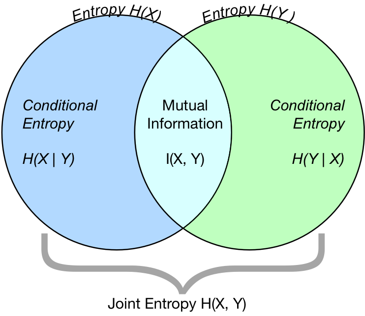

# Information Theory
:label:`chapter_information_theory`

Imagine that you have two ideas and want to assess which one is better. If you are a scholar, you can write two papers and see which one received more citations; if you are a netizen, you can post the two ideas on social media and see which one get more likes; if you are a musician, you can write two songs and see which one become more popular. No matter how are you going to convey your ideas, you are trying to encode them with one or another communication format. However, regardless the encoding format, the idea itself is supposed to have the same amount of “information”.

Information theory is a field of study about encoding, decoding, transmitting and manipulating information. With information theory, we can measure and compare how much information is presented in different signals. While machine learning is aimed at extracting interesting signals from data and making critical predictions. As a result, information theory provides a strong backbone of fundamental machine learning. For example, cross entropy loss in :numref:`chapter_softmax` is used as an objective function in many machine learning algorithms. Such a loss is a direct application to information theory. In this section, by several examples, we will illustrate the fundamental concepts of information theory and their application.


## Information

*Information* is conveyed by a particular sequence of stuffs. Rather than caring about the knowledge within the entity, information represents the degree of surprise or the abstract possibility of the event. Suppose that there is a file on your laptop and you are curious about how much information it contains. No matter whether it is a song, a movie or a text document, you may find the amount of information is measured in a unit of *bit*, for the size of the file. So what is a "bit" and why do we use it to measure information? Historically, an antique transmitter can only send or receive two codes: $0$ and $1$. In this way, any information symbol is encoded by a series of $0$ and $1$, and each digit represents 1 bit. 

### Self-information

Since information embodies the abstract possibility of an event, how do we map the possibility to the number of bits? Suppose that for any series of codes, each $0$ or $1$ occurs with a probability of $\frac{1}{2}$. Hence, an event $X$, with a series of codes of length $n$, occurs with a probability of $\frac{1}{2^n}$. At the same time, this series contains $n$ bits of information. Therefore, we can define *self-information*

$$I(X) = - \log_2 (p(x)) = - \log (p(x))$$

as the *bits* of information we have received for this code $X$. You may also hear of the term *nats*, which is another measurement unit using base-$e$ logarithms. Note that, in this section, we will always use base-2 logarithms for the sake of simplicity, i.e., $log (\cdot) = log_2 (\cdot)$. For example, the code "0010" has a self-information:
$$I(\text{``0010"}) = - \log_2 (p(\text{``0010"})) = - \log (p(\text{``0010"})) = - \log (\frac{1}{2^4}) = 4 \text{ bits}.$$


## Entropy 

As self-information only measures the information of a single discrete event, we need a more generalized measure for any random variable of either discrete or continuous distribution. 

### Definition

For any random variable $X$ that follows a probability distribution $P$ with a probability density function(p.d.f.) or a probability mass function(p.m.f.) $p(x)$, we measure the expected amount of information through *entropy* (or *Shannon entropy*)

$$H(X) = - E_{x \sim P} [\log p(x)].$$

To be specific, if $X$ is discrete, $$H(X) = - \sum_i p_i \cdot \log p_i \text{, where } p_i = P(X_i).$$ In the contrast, if $X$ is continuous, we also refer entropy as *differential entropy*, with $$H(X) = - \int_x p(x) \log p(x) dx.$$


### Example

Imagine that you are a movie director and you are collecting some feedbacks of your new released movie. There are three online movie review vendors. Each of them provides both positive and negative reviews, but with a different degree of polarity. Vendor $A$ provides a dataset of $\frac{1}{6}$ positive and $\frac{5}{6}$ negative reviews; vendor $B$ provides $\frac{1}{3}$ positive and $\frac{2}{3}$ negative reviews; vendor $C$ provides half positive and half negative reviews.

Without loss of generality, assume that any review is of the similar length and at the same price. Therefore, each review possesses the same amount of information per dollar. Limited by budget, you can only choose one vendor to partner with. Intuitively, the more balanced the polarity is in a dataset, the more comprehensive feedback we can obtain. Therefore, vendor $C$ may be the best one to coorperate with. But can we make the decision by more convincible math? Information theory can reveal the mask.

Let us compute the entropy of each dataset. The entropy of movie reviews from vendor $A$'s dataset is:
$$H(A) = - E_{x \sim P_{A}} [\log p_{A}(x)] = - \Big[\frac{1}{6} \times \log \Big(\frac{1}{6} \Big) +\frac{5}{6} \times \log \Big(\frac{5}{6} \Big) \Big] = 0.1957.$$

For vendor $B$'s dataset, the entropy is:
$$H(B) = - E_{x \sim P_{B}} [\log p_{B}(x)] = - \Big[\frac{1}{3} \times \log \Big (\frac{1}{3} \Big) +\frac{2}{3} \times \log \Big(\frac{2}{3} \Big) \Big] = 0.2764.$$

And for vendor $C$'s dataset:
$$H(C) = - E_{x \sim P_{C}} [\log p_{C}(x)] = - \Big[\frac{1}{2} \times \log \Big(\frac{1}{2} \Big) +\frac{1}{2} \times \log \Big(\frac{1}{2} \Big) \Big] = 0.3010.$$

As a result, the vendor $C$ has the largest polarity entropy of movie reviews, and hence it may be more comprehensive to be analyzed.


### Interpretations

You may be curious about that: in the entropy definition, why we use an expectation of a negative logarithm? Here are some intuitions:

First, why we use a "logarithm" function $\log$? Suppose that the $p(x) = f_1(x) f_2(x) \ldots f_n(x)$, where $f_i(x)$ functions are independent. This means that each $f_i(x)$ contributes individually to the total information obtained from $p(x)$. As a result, we need the entropy formula to possess the additive functionality over a mixed independent distributions. Luckily, $\log$ can naturally turn a product of probability distributions to a summation of their individual information.

Next, why we use a "negative" $\log$? Intuitively, more frequent events should contain less information than less common events, since we often gain more information from an unusual case than a regular one. However, because of $\log$ monotonically increasing with the probabilities, we need a negative sign to reverse their relationship.

Last, where does the "expectation" function come from? Well, for a random variable $X$ follows a given probability distribution, entropy can be interpreted as the average amount of surprise from observing $X$. For example, imagine that a slot machine system emits statistical independently symbols ${s_1, \ldots, s_k}$ with probabilities ${p_1, \ldots, p_k}$ respectively. Then the entropy of this system equals to the average amount of self-information from observing each output, i.e.,

$$H(S) = \sum_i {p_i \cdot I(s_i)} = - \sum_i {p_i \cdot \log p_i}.$$


### Properties of Entropy

By the above examples and interpretations, it is not hard to derive the following properties of entropy:

* Entropy is non-negative: $H(X) \geq 0, \forall X$.

* If $X \sim P$ with a p.d.f. or a p.m.f. $p(x)$, and we try to estimate $P$ by a new probability distribution $Q$ with a p.d.f. or a p.m.f. $q(x)$, then $$H(X) = - E_{x \sim P} [\log p(x)] \leq  - E_{x \sim P} [\log q(x)], \text{ with equality if and only if } P = Q.$$ 
Alternatively, $H(X)$ gives a lower bound of the average number of bits needed to encode symbols drawn from $P$.

* If $X \sim P$, then $x$ conveys the maximum amount of information if it spreads evenly among all possible outcomes. Specifically, if the probability distribution $P$ is discrete, then $$H(X) \leq \log(k), \text{ with equality if and only if } p_i = \frac{1}{k}, \forall x_i.$$
Conversely, if $P$ is continuous, then the further $P$ is from a uniform distribution, the lower the entropy is.


## Mutual Information




Previouly we defined entropy of a single random variable $X$, now let us extend the definition to a pair $(X,Y)$. For the following discussion of joint entropy, conditional entropy, and mutual information, we always use $(X,Y)$ as a pair of random variables that follows a joint probability distribution $P$ with a p.d.f. or a p.m.f. $p_{X,Y}(x,y)$, while X and Y follow probability distribution $p_X(x)$ and $p_Y(y)$, respectively. 


### Joint Entropy 

Similarly to entropy, the *joint entropy* $H(X,Y)$ is defined as
$$H(X,Y) = −E_{(x,y) \sim P} [\log p_{X,Y}(x, y)]. $$

Precisely, on the one hand, if $(X,Y)$ is a pair of discrete random variables, then $$H(X,Y) = - \sum_{x} \sum_{y} p_{X,Y}(x,y) \log p_{X,Y}(x,y).$$

On the other hand, if $(X,Y)$ is a pair of continuous random variables, then the *differential joint entropy* is defined as $$H(X,Y) = - \int_{x, y} p_{X,Y}(x,y) \ \log p_{X,Y}(x,y) \ dx dy.$$


### Conditional Entropy

At the same time, the *conditional entropy* $H(Y \mid X)$ is defined as

$$ H(Y \mid X) = - E_{(x,y) \sim P} [\log p(y \mid x)], \text{ where } p(y \mid x) = \frac{p_{X,Y}(x, y)}{p_X(x)}.$$

Specificly, if $(X,Y)$ is a pair of discrete random variables, then $$H(Y \mid X) = - \sum_{x} \sum_{y} p(x,y) \log p(y \mid x).$$

On the flip side, if $(X,Y)$ is a pair of continuous random variables, then the *differential joint entropy* is defined as $$H(Y \mid X) = - \int_x \int_y p(x,y) \ \log p(y \mid x) \ dx dy.$$


In addition, the naturalness of above definitions alludes that the entropy of a pair of random variables is the entropy of one plus the conditional entropy of the other, i.e.,

$$H(X,Y) = H(X)+H(Y \mid X).$$


### Mutual Information

Given the previous setting of random variables $(X, Y)$, you may wonder: "How much information do $X$ and $Y$ share?" Well, *mutual information* of $(X,Y)$ can give us the answer:

$$I(X,Y) = −E_{x} E_{y} \left\{ p_{X,Y}(x, y) \log\frac{p_{X,Y}(x, y)}{p_X(x) p_Y(y)} \right\}. $$


As shown in the earlier image, if we know $H(X)$ (i.e., the amount of uncertainty in $X$) and $H(X \mid Y)$ (i.e., amount of uncertainty in $X$ which remains after $Y$ is known), mutual information tells us the average reduction in uncertainty about $X$ that results from learning the value of $Y$, i.e.,

\begin{aligned}
I(X,Y) &= H(X) − H(X \mid Y) \\
&= H(Y) − H(Y \mid X) \\
&= H(X) + H(Y) − H(X,Y) \\
&= H(X,Y) - H(Y \mid X) − H(X \mid Y). \\
\end{aligned}


### Properties of Mutual Information

A few notable properties to keep in mind:

* Mutual information is symmetric: $I(X,Y) = I(Y,X)$.
* Mutual information is non-negative: $I(X,Y) \geq 0$.
* $I(X,Y) = 0$ if and only if $X$ and $Y$ are independent. For example, if $X$ and $Y$ are independent, then knowing $Y$ does not give any information about $X$ and vice versa, so their mutual information is zero.
* Alternatively, if $X$ is a function of $Y$, then all information conveyed by $Y$ is shared with $X$: $$I(X,Y) = H(Y) = H(X).$$


## Kullback–Leibler Divergence

Norm is used to measure the distance between two points in any dimension space, but can we measure the distance between two probability distributions, $P$ and $Q$? The answer points out to *Kullback–Leibler (KL) Divergence*, which is extremely useful in many machine learning problems. For example, we can estimate $P$ from true data with an approximating probability distribution $Q$, and compute the error via KL Divergence.


### Definition

Given a random variable $X$ that follows the true probability distribution $P$ with a p.d.f. or a p.m.f. $p(x)$, and we estimate $P$ by another probability distribution $Q$ with a p.d.f. or a p.m.f. $q(x)$. Then the *Kullback–Leibler(KL) Divergence* (or *Relative Entropy*) between $P$ and $Q$ is:

$$D_{\mathrm{KL}}(P\|Q) = E_{x \sim P} \Big[\log \frac{p(x)}{q(x)} \Big] = E_{x \sim P} [\log p(x) - \log q(x)].$$


### Example: Implementation of KL Divergence from Scratch

Let us build a toy model. First, generate and sort three $1,000,000$ length ndarrays: an objective ndarray $p$ which follows a normal distribution $N(0,1)$, and two candidate ndarrays $q_1$ and $q_2$ which follow normal distributions $N(-1,1)$ and $N(1,1)$ respectively.


```{.python .input  n=0}
from mxnet import np

shape = 1000000
p = np.random.normal(loc=0.0, scale=1.0, size=(shape, 1))
q1 = np.random.normal(loc=-1.0, scale=1.0, size=(shape, 1))
q2 = np.random.normal(loc=1.0, scale=1.0, size=(shape, 1))

p = np.array(sorted(p.asnumpy()))
q1 = np.array(sorted(q1.asnumpy()))
q2 = np.array(sorted(q2.asnumpy()))
```


Next, define the above KL Divergence formula in MXNet.

```{.python .input  n=1}
from mxnet.ndarray import nansum

def KLDivergence(p, q):
    kl = p * np.log(p / q)
    out = nansum(kl.reshape(-1).as_nd_ndarray())
    return out
```


Since $q_1$ and $q_2$ are symmetric with respect to the y-axis ($x=0$), we expect a similar absolute value of KL divergence between $D_{\mathrm{KL}}(p\|q_1)$ and $D_{\mathrm{KL}}(p\|q_2)$. 


```{.python .input  n=2}
kl_pq1 = KLDivergence(p,q1)
print('KL Divergence between p and q1 is {}.'.format(kl_pq1.asscalar()))

kl_pq2 = KLDivergence(p,q2)
print('KL Divergence between p and q2 is {}.'.format(kl_pq2.asscalar()))

similar = (kl_pq1.abs() - kl_pq2.abs()).abs().asscalar()
print('kl_pq1 and kl_pq2 difference: {}.'.format(similar))
```

Contrastly, you may find $D_{\mathrm{KL}}(q_2 \|p)$ and $D_{\mathrm{KL}}(p \| q_2)$ are off a lot in absolute value.

```{.python .input  n=3}
kl_q2p = KLDivergence(q2,p)
print('KL Divergence between q2 and p is {}.'.format(kl_q2p.asscalar()))

differ = (kl_q2p.abs() - kl_pq2.abs()).abs().asscalar()
print('Dramatically different KL Divergence: {}.'.format(differ))
```

### KL Divergence Properties

From the above examples, we can conclude the follwoing properties:

* KL divengence is non-symmetric: $$D_{\mathrm{KL}}(P\|Q) \neq D_{\mathrm{KL}}(Q\|P), \text{ if } P \neq Q.$$
* KL divengence is non-negative: $$D_{\mathrm{KL}}(P\|Q) \geq 0 \text{, with equality holds only when } P = Q.$$
* If there exists an $x$ such that $p(x) > 0$ and $q(x) = 0$, then $D_{\mathrm{KL}}(P\|Q) = \infty$.
* Relationship between KL Divergence and mutual information: 

$$
\begin{aligned}
I(X,Y) &= D_{\mathrm{KL}}(P(X, Y)  \ \| \ P(X)P(Y)) \\
  &= E_Y \{ D_{\mathrm{KL}}(P(X \mid Y) \ \| \ P(X)) \}\\
  &= E_X \{ D_{\mathrm{KL}}(P(Y \mid X) \ \| \ P(Y)) \}.\\
\end{aligned}
$$

### Application: Variational Inequality

Moreover, a renowned application of KL divergence is *Variational Inequality*:

$$\log E_{x \sim P} (X) = \sup_Q \{E_{x \sim Q} (\log(x)) - D_{\mathrm{KL}} (Q\|P) \}. $$

Even though the equation looks a bit formidable, it has profound influence in reinforcement learning, one of the popular area of machine learning. Here is the essence of the algorithm: for an unknown true distribution $P$, we can apply Variational Inequality by maximizing the above objective function respective to a new probability distribution $Q$. 

To be specific, we first draw samples from a randomly initialized $Q$ and calculate $E_{x \sim Q} (\log(x))$. Then we calculate the estimation error between current batch of true dataset $P$ and samples from $Q$, i.e., $D_{\mathrm{KL}} (Q\|P)$. To update the weights of $Q$, we maxmize the difference, i.e., $E_{x \sim Q} (\log(x)) - D_{\mathrm{KL}} (Q\|P)$ respective to $Q$. Finanlly, we move to the next batch, draw new samples from the updated $Q$, and roll back to the start of the algorithm.


## Cross Entropy

Say now we have a binary classification problem. Assume that we encode "$1$" and "$0$" as the positive and negative class label respectively, and our neural network is parameterized by $\theta$. If we aim to find a best $\theta$ so that $\hat{y}= p_{\theta}(y \mid x)$, it is natually to apply the maximum log-likelihood approach. To to specific, for true labels $y_i$ and predictions $\hat{y_i}= p_{\theta}(y_i \mid x_i)$, the probability to be classified as positive is $\pi_i= p_{\theta}(y_i = 1 \mid x_i)$. Hence, the likelihood function would be:

\begin{aligned}
\mathrm{L}(\theta) &= \prod_{i=1}^n \pi_i^{y_i} (1 - \pi_i)^{1 - y_i} \\
  &= \prod_{i=1}^n  p_{\theta}(y_i = 1 \mid x_i)^{y_i}  p_{\theta}(y_i =0 \mid x_i))^{1 - y_i}.\\
\end{aligned}

And the log-likelihood function would be:

\begin{aligned}
\mathrm{l}(\theta) &= \sum_{i=1}^n y_i \log(\pi_i) + (1 - y_i) \log (1 - \pi_i) \\
  &= \sum_{i=1}^n {y_i} \log(p_{\theta}(y_i \mid x_i))  + {(1 - y_i)} \log(1 - p_{\theta}(y_i \mid x_i)).\\
\end{aligned}


Maximizing the log-likelihood function $\mathrm{l(\theta)}$ is identical to minimizing $- \mathrm{l(\theta)}$, and hence we can find the best $\theta$ from here. To generalize the above loss to any distributions, we also called $-l(\theta)$ the *Cross Entropy loss* $\mathrm{CE}(y, \hat{y})$, where $y$ follows the true distribution $P$ and $\hat{y}$ follows the estimating distribution $Q$.


### Definition

Like KL Divengence, for a random variable $X$, we can also measure the divergence between the estimating distribution $Q$ and the true distribution $P$ with *Cross Entropy $H(P,Q)$*:

$$H(P,Q) = - E_{x \sim P} [\log(q(x))].$$

It can also be interpreted as the summation of the entropy $H(P)$ and the KL Divergence between $P$ and $Q$, i.e.,

$$H(P, Q) = H(P) + D_{\mathrm{KL}}(P\|Q).$$

As widely accepted, cross entropy can be used to define a loss function in the optimization problem, where the true distribution, $P$, is the true label, and the estimating distribution, $Q$, is the predicted value of the current model. As we allude in the motivation, it turns out that the following are equivalent:

* Maximizing Predictive Probability of $Q$ for distribution $P$, (i.e., $E_{x 
\sim P} [\log (q(x))]$).
* Minimizing Cross Entropy $H(P;Q)$.
* Minimizing the distance $D_{\mathrm{KL}}(P\|Q)$.


### Example: Implementation of Cross Entropy from Scratch

First, let us define the cross entropy formula in MXNet.

```{.python .input  n=4}
from mxnet import np

def cross_entropy(y_hat, y):
    ce = - np.log(y_hat[range(len(y_hat)), y])
    return ce.mean()
```

Now define two ndarrays for the labels and predictions, and the cross entropy would be:

```{.python .input  n=5}
labels = np.array([0, 2])
preds = np.array([[0.3, 0.6, 0.1], [0.2, 0.3, 0.5]])

cross_entropy(preds, labels)
```


### Cross Entropy as An Objective Function of Multi-class Classification

If we dive deep into the classification objective function with cross entropy loss $\mathrm{CE}$, you may find minimizing $\mathrm{CE}$ is equivalent to maximizing the log-likelihood function $\mathrm{L}$. Let us work through a toy example together. 


To begin with, we represent any $k$-class labels by *one-hot encoding* method: setting the component corresponding to its category to be $1$, and all other components to be $0$, i.e. 

\begin{equation}
  \mathbf{y}_i = (y_{i1}, \ldots, y_{ik}) \text{, where } y_{ij} = \begin{cases}
    1, & \text{if data point $i$ belongs to category $j$ ;}\\
    0, & \text{otherwise}.
  \end{cases}
\end{equation}


For instance, if a multi-class classfication problem contains three classes $A$, $B$ and $C$, then the labels $\mathbf{y}_i$ can be encoded in {$A: (1, 0, 0); B: (0, 1, 0); C: (0, 0, 1)$}.


Assume that there are $k$ classes and our neural network is parameterized by $\theta$. For true label vectors $\mathbf{y}_i$ and predictions $\hat{\mathbf{y}_i}= p_{\theta}(\mathbf{y}_i \mid \mathbf{x}_i)$, the *cross entropy (CE) loss* would be:


\begin{aligned}
\mathrm{CE}(\mathbf{y}, \hat{\mathbf{y}}) &= - \sum_{i=1}^n \mathbf{y}_i \log \hat{\mathbf{y}_i} \\
  &= - \sum_{i=1}^n \mathbf{y}_i \log{p_{\theta} (\mathbf{y}_i  \mid  \mathbf{x}_i)} \\
  &= - \sum_{i=1}^n \sum_{j=1}^k y_{ij} \log{p_{\theta} (y_{ij}  \mid  \mathbf{x}_i)}.\\
\end{aligned}


On the other side, we can also demystify the myth through probabilistic approach. To begin with, let us quickly introduce a $k$-class multinoulli distribution. It is an extension of the bernoulli distribution from binary class to multi-class. If a random variable $\mathbf{y} = (y_{1}, \ldots, y_{k})$ is followed a $k$-class *multinoulli distribution* with probabilities $\boldsymbol{p} =$ ($p_{1}$, \ldots, $p_{k}$), i.e., 
$$p(\mathbf{y}) = p(y_1, \ldots, y_k) = \mathrm{Multi} (p_1, \ldots, p_k), \text{ where } \sum_{i=1}^k p_i = 1,$$
then the joint probability mass function(p.m.f.) of $\mathbf{y}$ is:
$$\boldsymbol{p}^\mathbf{y} = \prod_{j=1}^k p_{j}^{y_{j}}.$$


Now back to our example, it is easy to see that each data point, $\mathbf{y}_i$, is following a $k$-class multinoulli distribution with probabilities $\boldsymbol{\pi} =$ ($\pi_{1}$, \ldots, $\pi_{k}$). Therefore, the joint p.m.f. of $\mathbf{y}_i$ is: $\boldsymbol{\pi}^\mathbf{y}_i = \prod_{j=1}^k \pi_{j}^{y_{ij}}.$
Hence, the likelihood function of the given dataset with $n$ samples would be:

\begin{aligned}
\mathrm{L}(\theta) = \prod_{i=1}^n \boldsymbol{\pi_i}^{\mathbf{y}_i}
 = \prod_{i=1}^n \prod_{j=1}^k \pi_{ij}^{y_{ij}}
 = \prod_{i=1}^n \prod_{j=1}^k p_{\theta}(y_{ij} \mid \mathbf{x}_i)^{y_{ij}}.\\
\end{aligned}

And the log-likelihood function would be:


\begin{aligned}
\mathrm{l}(\theta) = \log \mathrm{L}(\theta) = \sum_{i=1}^n \sum_{j=1}^k y_{ij} \log{p_{\theta} (y_{ij}  \mid  \mathbf{x}_i)}.\\
\end{aligned}


Therefore, for any multi-class classification, maximizing the above log-likelihood function $\mathrm{l}(\theta)$ is equivalent to minimizing the CE loss $\mathrm{CE}(y, \hat{y})$.


To verify the above proof by algorithm, let us apply the built-in metric `NegativeLogLikelihood` in MXNet. Using the same "labels" and "preds" as the earlier example, we will get the same numerical loss as the previous example.

```{.python .input  n=6}
from mxnet.metric import NegativeLogLikelihood
nll_loss = NegativeLogLikelihood()
nll_loss.update(labels.as_nd_ndarray(), preds.as_nd_ndarray())
print(nll_loss.get())
```