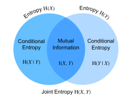

# Information Theory
:label:`sec_information_theory`

For thousnads of years, we are submerging in a world of information. From Shakespeare’s Sonnet to researchers' paper on Cornell ArXiv, from Van Gogh's printing Starry Night to Beethoven's music Symphony No. 5, from the first programming language Plankalkül to the state-of-the-art machine learning algorithms. No matter what are the format of these information, everything follows the rule of information theory for millennium of years. With information theory, we can measure and compare how much information is presented in different signals.

While machine learning is aimed at extracting interesting signals from data and making critical predictions, information theory is a field of study about encoding, decoding, transmitting, and manipulating information. As a result, information theory provides a strong backbone of fundamental machine learning. For example, cross entropy loss in :numref:`sec_softmax` is used as an objective function in many machine learning algorithms. Such a loss is a direct application of information theory. In this section, we will illustrate the fundamental concepts of information theory and their application.


## Information
 
*Information* is conveyed by a particular sequence of one or more encoding formats. Rather than caring about the knowledge, information represents the degree of surprise or the abstract possibility of the event. In this era of information explosion, how do we quantify the meaningfulness of a piece of information? Are there any fundamental math theory to measure and compare different pieces of information? The discipline of information theory has not been established until year 1948, when [Claude E. Shannon](https://en.wikipedia.org/wiki/Claude_Shannon) published his well-known book [A Mathematical Theory of Communication](https://en.wikipedia.org/wiki/A_Mathematical_Theory_of_Communication). 
Shannon was an American mathematician, electrical engineer, and crytographer known as "the father of information theory". In this book, Shannon introduced the concept of information entropy at the first time. We will start our information theory journey here.


### Self-information

Since information embodies the abstract possibility of an event, how do we map the possibility to the number of bits? 
Shannon introduced the term *bit*, which Shannon credited to John Tukey, as the unit of information. So what is a "bit" and why do we use it to measure information? Historically, an antique transmitter can only send or receive two codes, $0$ and $1$. In this way, any information symbol is encoded by a series of $0$ and $1$, and each digit represents 1 bit. And hence, a series of codes of length $n$ contains $n$ bits of information.

Now, suppose that for any series of codes, each $0$ or $1$ occurs with a probability of $\frac{1}{2}$. Hence, an event $X$ with a series of codes of length $n$, occurs with a probability of $\frac{1}{2^n}$. At the same time, as we mentioned before, this series contains $n$ bits of information. So, can we generalize to a math function which can tranfer the probability $p$ to the number of bits? Shannon gave the answer by defining *self-information*

$$I(X) = - \log_2 (p)$$

as the *bits* of information we have received for this event $X$. Note that we will always use base-2 logarithms in this section. For the sake of simplicity, the rest of this section will omit the subscript 2 in the logarithm notation, i.e., $\log(.)$ always refers to $\log_2(.)$. For example, the code "0010" has a self-information

$$I(\text{``0010"}) = - \log (p(\text{``0010"})) = - \log \left( \frac{1}{2^4} \right) = 4 \text{ bits}.$$

We can simply calculate self information in MXNet as shown below. Before that, let us first import all the necessary packages in this section.

```{.python .input  n=1}
from mxnet import np
from mxnet.ndarray import nansum
from mxnet.metric import NegativeLogLikelihood
import random

```

```{.python .input  n=2}
def self_information(p):
    return -np.log2(p)

self_information(1/64)
```

```{.json .output n=2}
[
 {
  "data": {
   "text/plain": "6.0"
  },
  "execution_count": 2,
  "metadata": {},
  "output_type": "execute_result"
 }
]
```

## Entropy 

As self-information only measures the information of a single discrete event, we need a more generalized measure for any random variable of either discrete or continuous distribution. 

### Definition

For any random variable $X$ that follows a probability distribution $P$ with a probability density function (p.d.f.) or a probability mass function (p.m.f.) $p(x)$, we measure the expected amount of information through *entropy* (or *Shannon entropy*)

$$H(X) = - E_{x \sim P} [\log p(x)].$$


To be specific, if $X$ is discrete, $$H(X) = - \sum_i p_i \log p_i \text{, where } p_i = P(X_i).$$ 

Otherwise, if $X$ is continuous, we also refer entropy as *differential entropy* 

$$H(X) = - \int_x p(x) \log p(x) \; dx.$$

In MXNet, we can define entropy as below.

```{.python .input  n=3}
def entropy(p):
    entropy = - p * np.log2(p)
    out = nansum(entropy.as_nd_ndarray()) # nansum will sum up the non-nan number
    return out

entropy(np.array([0.1, 0.5, 0.2, 0.3]))
```

```{.json .output n=3}
[
 {
  "data": {
   "text/plain": "\n[1.8176681]\n<NDArray 1 @cpu(0)>"
  },
  "execution_count": 3,
  "metadata": {},
  "output_type": "execute_result"
 }
]
```

### Interpretations

You may be curious: in the entropy definition, why we use an expectation of a negative logarithm? Here are some intuitions.

First, why do we use a *logarithm* function $\log$? Suppose that $p(x) = f_1(x) f_2(x) \ldots f_n(x)$, where each component function $f_i(x)$ is independent from each other. This means that each $f_i(x)$ contributes independently to the total information obtained from $p(x)$. As a result, we need the entropy formula to possess the additive functionality over a mixed independent distributions. Luckily, $\log$ can naturally turn a product of probability distributions to a summation of their individual information.

Next, why do we use a *negative* $\log$? Intuitively, more frequent events should contain less information than less common events, since we often gain more information from an unusual case than from a regular one. However, $\log$ is monotonically increasing with the probabilities, whereas we need to construct a monotonically decreasing relationship between the probability of events and their entropy. Hence, we add a negative sign in front of $\log$ function.

Last, where does the *expectation* function come from? Consider a random variable $X$ follows a given probability distribution, entropy can be interpreted as the average amount of surprise from observing $X$. For example, imagine that a slot machine system emits statistical independently symbols ${s_1, \ldots, s_k}$ with probabilities ${p_1, \ldots, p_k}$ respectively. Then the entropy of this system equals to the average self-information from observing each output, i.e.,

$$H(S) = \sum_i {p_i \cdot I(s_i)} = - \sum_i {p_i \cdot \log p_i}.$$


### Properties of Entropy

By the above examples and interpretations, we can derive the following properties of entropy. Here, we refer to X as an event and P as the probability distribution of X.

* Entropy is non-negative, i.e., $H(X) \geq 0, \forall X$.

* If $X \sim P$ with a p.d.f. or a p.m.f. $p(x)$, and we try to estimate $P$ by a new probability distribution $Q$ with a p.d.f. or a p.m.f. $q(x)$, then $$H(X) = - E_{x \sim P} [\log p(x)] \leq  - E_{x \sim P} [\log q(x)], \text{ with equality if and only if } P = Q.$$  Alternatively, $H(X)$ gives a lower bound of the average number of bits needed to encode symbols drawn from $P$.

* If $X \sim P$, then $x$ conveys the maximum amount of information if it spreads evenly among all possible outcomes. Specifically, if the probability distribution $P$ is discrete with $k$-class $\{p_1, \ldots, p_k \}$, then $$H(X) \leq \log(k), \text{ with equality if and only if } p_i = \frac{1}{k}, \forall x_i.$$ Otherwise, if $P$ is continuous, then $P$ has the highest entropy if it is a uniform distribution.

## Mutual Information

Previouly we defined entropy of a single random variable $X$, now let us extend the definition to a pair $(X,Y)$. For the following discussion of joint entropy, conditional entropy, and mutual information, we always use $(X,Y)$ as a pair of random variables that follows a joint probability distribution $P$ with a p.d.f. or a p.m.f. $p_{X,Y}(x,y)$, while $X$ and $Y$ follow probability distribution $p_X(x)$ and $p_Y(y)$, respectively. 


### Joint Entropy 

Similar to entropy, the *joint entropy* $H(X,Y)$ is defined as
$$H(X,Y) = −E_{(x,y) \sim P} [\log p_{X,Y}(x, y)]. $$

Precisely, on the one hand, if $(X,Y)$ is a pair of discrete random variables, then $$H(X,Y) = - \sum_{x} \sum_{y} p_{X,Y}(x,y) \log p_{X,Y}(x,y).$$

On the other hand, if $(X,Y)$ is a pair of continuous random variables, then the *differential joint entropy* is defined as $$H(X,Y) = - \int_{x, y} p_{X,Y}(x,y) \ \log p_{X,Y}(x,y) \;dx \;dy.$$

Let us implement joint entropy from scratch in MXNet.

```{.python .input  n=30}
def joint_entropy(p_xy):
    joint_ent = -p_xy * np.log2(p_xy)
    # nansum will sum up the non-nan number
    out = nansum(joint_ent.as_nd_ndarray()) 
    return out

joint_entropy(np.array([0.1, 0.5, 0.2, 0.3]))
```

```{.json .output n=30}
[
 {
  "data": {
   "text/plain": "\n[1.8176681]\n<NDArray 1 @cpu(0)>"
  },
  "execution_count": 30,
  "metadata": {},
  "output_type": "execute_result"
 }
]
```

### Conditional Entropy

At the same time, the *conditional entropy* $H(Y \mid X)$ is defined as

$$ H(Y \mid X) = - E_{(x,y) \sim P} [\log p(y \mid x)],$$ 

where $p(y \mid x) = \frac{p_{X,Y}(x, y)}{p_X(x)}$. Specificly, if $(X,Y)$ is a pair of discrete random variables, then $$H(Y \mid X) = - \sum_{x} \sum_{y} p(x,y) \log p(y \mid x).$$

On the flip side, if $(X,Y)$ is a pair of continuous random variables, then the *differential joint entropy* is defined as $$H(Y \mid X) = - \int_x \int_y p(x,y) \ \log p(y \mid x) \;dx \;dy.$$


In addition, the naturalness of above definitions alludes that the entropy of a pair of random variables is the entropy of one plus the conditional entropy of the other, i.e.,

$$H(X,Y) = H(X)+H(Y \mid X).$$

Let us implement conditional entropy from scratch in MXNet.

```{.python .input  n=34}
def conditional_entropy(p_xy, p_x):
    p_y_given_x = p_xy/p_x
    cond_ent = -p_xy * np.log2(p_y_given_x)
    # nansum will sum up the non-nan number
    out = nansum(cond_ent.as_nd_ndarray()) 
    return out

conditional_entropy(np.array([0.1, 0.5, 0.2, 0.3]), np.array([1, 1, 1, 1]))
```

```{.json .output n=34}
[
 {
  "data": {
   "text/plain": "\n[1.8176681]\n<NDArray 1 @cpu(0)>"
  },
  "execution_count": 34,
  "metadata": {},
  "output_type": "execute_result"
 }
]
```

### Mutual Information

Given the previous setting of random variables $(X, Y)$, you may wonder: "How much information do $X$ and $Y$ share?" Luckily, *mutual information* of $(X,Y)$ can give us the answer as

$$I(X,Y) = −E_{x} E_{y} \left\{ p_{X,Y}(x, y) \log\frac{p_{X,Y}(x, y)}{p_X(x) p_Y(y)} \right\}. $$


As shown in the image :numref:`fig_mutual_information`, if we know $H(X)$ (i.e., the amount of uncertainty in $X$) and $H(X \mid Y)$ (i.e., amount of uncertainty in $X$ which remains after $Y$ is known), mutual information tells us the average reduction in uncertainty about $X$ that results from learning the value of $Y$. As a result, the following terms are numerically equivalent to $I(X,Y)$:

* $H(X) − H(X \mid Y)$
* $H(Y) − H(Y \mid X)$
* $H(X) + H(Y) − H(X,Y)$
* $H(X,Y) - H(Y \mid X) − H(X \mid Y)$



:label:`fig_mutual_information`


Now, let us implement mutual information from scratch!

```{.python .input  n=36}
def mutual_information(p_xy, p_x, p_y):
    p = p_xy / (p_x * p_y)
    mutual = -p_xy * np.log2(p)
    # nansum will sum up the non-nan number
    out = nansum(mutual.as_nd_ndarray()) 
    return out

mutual_information(np.array([0.1, 0.5, 0.2, 0.3]), np.array([2, 4, 8, 4]), np.array([0.5, 0.25, 0.125, 0.25]))
```

```{.json .output n=36}
[
 {
  "data": {
   "text/plain": "\n[1.8176681]\n<NDArray 1 @cpu(0)>"
  },
  "execution_count": 36,
  "metadata": {},
  "output_type": "execute_result"
 }
]
```

### Properties of Mutual Information

Rather than memorizing the definition of mutual information, you only need to keep in mind its notable properties:

* Mutual information is symmetric, i.e., $I(X,Y) = I(Y,X)$.
* Mutual information is non-negative, i.e., $I(X,Y) \geq 0$.
* $I(X,Y) = 0$ if and only if $X$ and $Y$ are independent. For example, if $X$ and $Y$ are independent, then knowing $Y$ does not give any information about $X$ and vice versa, so their mutual information is zero.
* Alternatively, if $X$ is a function of $Y$, then all information conveyed by $Y$ is shared with $X$ as $$I(X,Y) = H(Y) = H(X).$$


## Kullback–Leibler Divergence

As what we have discussed in :numref:`sec_reduction-norm`, norms can be used for measuring distance between two points in space of any dimensionality. However, can we measure the distance between two probability distributions, $P$ and $Q$? Let us paraphrase it using the *Kullback–Leibler (KL) divergence*, which is quite useful in many machine learning problems. 


### Definition

Given a random variable $X$ that follows the true probability distribution $P$ with a p.d.f. or a p.m.f. $p(x)$, and we estimate $P$ by another probability distribution $Q$ with a p.d.f. or a p.m.f. $q(x)$. Then the *Kullback–Leibler (KL) divergence* (or *relative entropy*) between $P$ and $Q$ is

$$D_{\mathrm{KL}}(P\|Q) = E_{x \sim P} \left[ \log \frac{p(x)}{q(x)} \right].$$


In MXNet, let us implement the KL divergence from Scratch.

```{.python .input  n=4}
def kl_divergence(p, q):
    kl = p * np.log2(p / q)
    out = nansum(kl.as_nd_ndarray())
    return out.abs().asscalar()
```

### KL Divergence Properties

Even though the above definition looks formidable, you do not need to memorize it. However, the following properties may be worth your while to peruse.


* KL divergence is non-symmetric, i.e., $$D_{\mathrm{KL}}(P\|Q) \neq D_{\mathrm{KL}}(Q\|P), \text{ if } P \neq Q.$$
* KL divergence is non-negative, i.e., $$D_{\mathrm{KL}}(P\|Q) \geq 0.$$ Note that the equality holds only when $P = Q$.
* If there exists an $x$ such that $p(x) > 0$ and $q(x) = 0$, then $D_{\mathrm{KL}}(P\|Q) = \infty$.
* Relationship between KL divergence and mutual information is also intimating. Besides the relationship shown in :numref:`fig_mutual_information`, $I(X,Y)$ is also numerically equivalent with the following terms:

    1. $ D_{\mathrm{KL}}(P(X, Y)  \ \| \ P(X)P(Y))$;
    1. $ E_Y \{ D_{\mathrm{KL}}(P(X \mid Y) \ \| \ P(X)) \}$;
    1. $ E_X \{ D_{\mathrm{KL}}(P(Y \mid X) \ \| \ P(Y)) \}$.
    
  For the first term, we interpret mutual information as the KL divergence between $P(X, Y)$ and the product of $P(X)$ and $P(Y)$. For the second term, mutual information tells us the average reduction in uncertainty about $Y$ that results from learning the value of the $X$'s distribution. Similarly to the third term.

### Example

If you are still confused about why KL divergence is non-symmetric, let us go through a toy example. 

First, let us generate and sort three `ndarray`s of length $10,000$: an objective ndarray $p$ which follows a normal distribution $N(0,1)$, and two candidate ndarrays $q_1$ and $q_2$ which follow normal distributions $N(-1,1)$ and $N(1,1)$ respectively.

```{.python .input  n=5}
random.seed(1)

nd_length = 10000
p = np.random.normal(loc=0, scale=1, size=(nd_length, ))
q1 = np.random.normal(loc=-1, scale=1, size=(nd_length, ))
q2 = np.random.normal(loc=1, scale=1, size=(nd_length, ))

p = np.array(sorted(p.asnumpy()))
q1 = np.array(sorted(q1.asnumpy()))
q2 = np.array(sorted(q2.asnumpy()))

```

Since $q_1$ and $q_2$ are symmetric with respect to the y-axis ($x=0$), we expect a similar absolute value of KL divergence between $D_{\mathrm{KL}}(p\|q_1)$ and $D_{\mathrm{KL}}(p\|q_2)$. As you can see below, there is only a 1% off between $D_{\mathrm{KL}}(p\|q_1)$ and $D_{\mathrm{KL}}(p\|q_2)$.

```{.python .input  n=6}
kl_pq1 = kl_divergence(p, q1)
kl_pq2 = kl_divergence(p, q2)
similar_percentage = abs(kl_pq1 - kl_pq2) / ((kl_pq1 + kl_pq2) / 2) * 100

kl_pq1, kl_pq2, similar_percentage
```

```{.json .output n=6}
[
 {
  "data": {
   "text/plain": "(8819.107, 8551.785, 3.0778184186302133)"
  },
  "execution_count": 6,
  "metadata": {},
  "output_type": "execute_result"
 }
]
```

In contrast, you may find that $D_{\mathrm{KL}}(q_2 \|p)$ and $D_{\mathrm{KL}}(p \| q_2)$ are off a lot, with around 44% off as shown below. 

```{.python .input  n=7}
kl_q2p = kl_divergence(q2, p)
differ_percentage = abs(kl_q2p - kl_pq2) / ((kl_q2p + kl_pq2) / 2) * 100

kl_q2p, differ_percentage
```

```{.json .output n=7}
[
 {
  "data": {
   "text/plain": "(13687.494, 46.185930000858036)"
  },
  "execution_count": 7,
  "metadata": {},
  "output_type": "execute_result"
 }
]
```

## Cross Entropy

If you are curious about what are the applications of information theory on deep learning, here is a quick example. We define the true distribution $P$ with probability distribution $p(x)$, and the estimated distribution $Q$ with probability distribution $q(x)$, and we will use them in the rest of this section.

Say now we need to solve a binary classification problem based on given $n$ data points {$x_1, \ldots, x_n$}. Assume that we encode $1$ and $0$ as the positive and negative class label $y_i$ respectively, and our neural network is parameterized by $\theta$. If we aim to find a best $\theta$ so that $\hat{y}_i= p_{\theta}(y_i \mid x_i)$, it is natually to apply the maximum log-likelihood approach. To be specific, for true labels $y_i$ and predictions $\hat{y}_i= p_{\theta}(y_i \mid x_i)$, the probability to be classified as positive is $\pi_i= p_{\theta}(y_i = 1 \mid x_i)$. Hence, the log-likelihood function would be

$$
\begin{aligned}
l(\theta) &= \log L(\theta) \\
  &= \log \prod_{i=1}^n \pi_i^{y_i} (1 - \pi_i)^{1 - y_i} \\
  &= \sum_{i=1}^n y_i \log(\pi_i) + (1 - y_i) \log (1 - \pi_i) \\
\end{aligned}
$$

Maximizing the log-likelihood function $l(\theta)$ is identical to minimizing $- l(\theta)$, and hence we can find the best $\theta$ from here. To generalize the above loss to any distributions, we also called $-l(\theta)$ the *cross entropy loss* $\mathrm{CE}(y, \hat{y})$, where $y$ follows the true distribution $P$ and $\hat{y}$ follows the estimated distribution $Q$. Let us see how cross entropy loss is defined!


### Definition

Like KL divergence, for a random variable $X$, we can also measure the divergence between the estimating distribution $Q$ and the true distribution $P$ via *cross entropy*,

$$\mathrm{CE}(P,Q) = - E_{x \sim P} [\log(q(x))].$$

It can also be interpreted as the summation of the entropy $H(P)$ and the KL divergence between $P$ and $Q$, i.e.,

$$\mathrm{CE} (P, Q) = H(P) + D_{\mathrm{KL}}(P\|Q).$$


In MXNet, we can implement the cross entropy loss as below.

```{.python .input  n=22}
def cross_entropy(y_hat, y):
    ce = -np.log(y_hat[range(len(y_hat)), y])
    return ce.mean()
```

Now define two ndarrays for the labels and predictions, and calculate the cross entropy loss of them.

```{.python .input  n=23}
labels = np.array([0, 2])
preds = np.array([[0.3, 0.6, 0.1], [0.2, 0.3, 0.5]])

cross_entropy(preds, labels)
```

```{.json .output n=23}
[
 {
  "data": {
   "text/plain": "array(0.94856)"
  },
  "execution_count": 23,
  "metadata": {},
  "output_type": "execute_result"
 }
]
```

### Properties

As being widely accepted, cross entropy can be used to define a loss function in the optimization problem. It turns out that the following are equivalent:

1. Maximizing predictive probability of $Q$ for distribution $P$, (i.e., $E_{x 
\sim P} [\log (q(x))]$);
1. Minimizing cross entropy $\mathrm{CE} (P,Q)$;
1. Minimizing the KL divergence $D_{\mathrm{KL}}(P\|Q)$.

The definition of cross entropy indirectly proves the equivalent relationship between objective 2 and objective 3, as long as the entropy of true data $H(P)$ is constant. Now, let us elucidate the equivalence between objective 1 and objective 2 through the below example.

### Cross Entropy as An Objective Function of Multi-class Classification

If we dive deep into the classification objective function with cross entropy loss $\mathrm{CE}$, you may find minimizing $\mathrm{CE}$ is equivalent to maximizing the log-likelihood function $L$. Let us work through a toy example together. 

To begin with, suppose that we are given a dataset with $n$ samples, and it can be classified in $k$-class. For each data point $i$, we represent any $k$-class label $\mathbf{y}_i = (y_{i1}, \ldots, y_{ik})$ by the *one-hot encoding* method. To be specific, if the data point $i$ belongs to class $J$, then we set the $j$-th entry to $1$, and all other components to $0$, i.e., 

$$ y_{ij} = \begin{cases}1 & j \in J; \\ 0 &\text{otherwise.}\end{cases}$$

For instance, if a multi-class classfication problem contains three classes $A$, $B$, and $C$, then the labels $\mathbf{y}_i$ can be encoded in {$A: (1, 0, 0); B: (0, 1, 0); C: (0, 0, 1)$}.


Assume that our neural network is parameterized by $\theta$. For true label vectors $\mathbf{y}_i$ and predictions $$\hat{\mathbf{y}}_i= p_{\theta}(\mathbf{y}_i \mid \mathbf{x}_i) = \sum_{j=1}^k y_{ij} p_{\theta} (y_{ij}  \mid  \mathbf{x}_i).$$

Hence, the *cross entropy loss* would be

$$
\mathrm{CE}(\mathbf{y}, \hat{\mathbf{y}}) = - \sum_{i=1}^n \mathbf{y}_i \log \hat{\mathbf{y}}_i
 = - \sum_{i=1}^n \sum_{j=1}^k y_{ij} \log{p_{\theta} (y_{ij}  \mid  \mathbf{x}_i)}.\\
$$

On the other side, we can also demystify the problem through maximum likelihood estimation. To begin with, let us quickly introduce a $k$-class multinoulli distribution. It is an extension of the bernoulli distribution from binary class to multi-class. If a random variable $\mathbf{z} = (z_{1}, \ldots, z_{k})$ follows a $k$-class *multinoulli distribution* with probabilities $\mathbf{p} =$ ($p_{1}, \ldots, p_{k}$), i.e., $$p(\mathbf{z}) = p(z_1, \ldots, z_k) = \mathrm{Multi} (p_1, \ldots, p_k), \text{ where } \sum_{i=1}^k p_i = 1,$$ then the joint probability mass function(p.m.f.) of $\mathbf{z}$ is
$$\mathbf{p}^\mathbf{z} = \prod_{j=1}^k p_{j}^{z_{j}}.$$


Now back to our example, it is easy to see that each data point, $\mathbf{y}_i$, is following a $k$-class multinoulli distribution with probabilities $\boldsymbol{\pi} =$ ($\pi_{1}, \ldots, \pi_{k}$). Therefore, the joint p.m.f. of each data point $\mathbf{y}_i$ is  $\mathbf{\pi}^{\mathbf{y}_i} = \prod_{j=1}^k \pi_{j}^{y_{ij}}.$
Hence, the log-likelihood function would be

$$
\begin{aligned}
l(\theta) 
 = \log L(\theta) 
 = \log \prod_{i=1}^n \boldsymbol{\pi}^{\mathbf{y}_i}
 = \log \prod_{i=1}^n \prod_{j=1}^k \pi_{j}^{y_{ij}}
 = \sum_{i=1}^n \sum_{j=1}^k y_{ij} \log{\pi_{j}}.\\
\end{aligned}
$$

Since in maximum likelihood estimation, we maximizing the objective function $l(\theta) $ by having $\pi_{j} = p_{\theta} (y_{ij}  \mid  \mathbf{x}_i)$. Therefore, for any multi-class classification, maximizing the above log-likelihood function $l(\theta)$ is equivalent to minimizing the CE loss $\mathrm{CE}(y, \hat{y})$.


To test the above proof, let us apply the built-in measure `NegativeLogLikelihood` in MXNet. Using the same `labels` and `preds` as in the earlier example, we will get the same numerical loss as the previous example up to the 5 decimal place.

```{.python .input  n=25}
nll_loss = NegativeLogLikelihood()
nll_loss.update(labels.as_nd_ndarray(), preds.as_nd_ndarray())
nll_loss.get()
```

```{.json .output n=25}
[
 {
  "data": {
   "text/plain": "('nll-loss', 0.9485599994659424)"
  },
  "execution_count": 25,
  "metadata": {},
  "output_type": "execute_result"
 }
]
```
