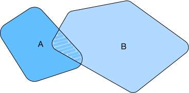

# Basics
:label:`sec_math`

This section summarizes basic tools from linear algebra, differentiation, and probability required to understand the contents in this book. We avoid details beyond the bare minimum to keep things streamlined and easily accessible. In some cases we simplify things to keep them easily accessible. For more background see e.g., the excellent [Data Science 100](http://ds100.org) course at UC Berkeley.

## Linear Algebra

This is a brief summary of vectors, matrices, operators, norms, eigenvectors,
and eigenvalues. They're needed since a significant part of deep learning
revolves around manipulating matrices and vectors. For a much more in-depth
introduction to linear algebra in Python see e.g., the
[Jupyter notebooks](https://github.com/juanklopper/MIT_OCW_Linear_Algebra_18_06)
of Gilbert Strang's MIT course on
[Linear Algebra](http://web.mit.edu/18.06/www/videos.shtml).

### Vectors

An $n$-dimensional vector $\mathbf{x}$ can be written as

$$
\mathbf{x} =
\begin{bmatrix}
    x_{1}  \\
    x_{2}  \\
    \vdots  \\
    x_{n}
\end{bmatrix}.
$$

Here $x_1, \ldots, x_n$ are elements of the vector. To express that $\mathbf{x}$ is an $n$-dimensional vector with elements from the set of real numbers, we write $\mathbf{x} \in \mathbb{R}^{n}$ or $\mathbf{x} \in \mathbb{R}^{n \times 1}$. Vectors satisfy the basic operations of a *vector space*, namely that you can add them together and multiply them with scalars (in our case elementwise) and you still get a vector back: assuming that $\mathbf{a}, \mathbf{b} \in \mathbb{R}^n$ and $\alpha \in \mathbb{R}$ we have that
$\mathbf{a} + \mathbf{b} \in \mathbb{R}^n$ and $\alpha \cdot \mathbf{a} \in \mathbb{R}^n$. Furthermore they satisfy the distributive law

$$\alpha \cdot (\mathbf{a} + \mathbf{b}) = \alpha \cdot \mathbf{a} + \alpha \cdot \mathbf{b}.$$

### Matrices

A matrix with $m$ rows and $n$ columns can be written as

$$
\mathbf{X} =
\begin{bmatrix}
    x_{11} & x_{12}  & \dots  & x_{1n} \\
    x_{21} & x_{22}  & \dots  & x_{2n} \\
    \vdots & \vdots  & \ddots & \vdots \\
    x_{m1} & x_{m2}  & \dots  & x_{mn}
\end{bmatrix}.
$$

Here, $x_{ij}$ is the element in row $i \in \{1, \ldots, m\}$ and column $j \in \{1, \ldots, n\}$ in the matrix $\mathbf{X}$. Extending the vector notation we use $\mathbf{X} \in \mathbb{R}^{m \times n}$ to indicate that $\mathbf{X}$ is an $m \times n$ matrix. Given the above we could interpret vectors as $m \times 1$ dimensional matrices. Furthermore, matrices also form a vector space, i.e., we can multiply and add them just fine, as long as their dimensions match.

### Operations

Assume that the elements in the $\mathbf{a}, \mathbf{b} \in \mathbb{R}^n$ are $a_1, \ldots, a_n$ and $b_1, \ldots, b_n$ respectively. The dot product (internal product) of vectors $\mathbf{a}$ and $\mathbf{b}$ is a scalar:

$$
\mathbf{a} \cdot \mathbf{b} = a_1 b_1 + \ldots + a_n b_n.
$$

Assume that we have two matrices with $m$ rows and $n$ columns $\mathbf{A}, \mathbf{B} \in \mathbb{R}^{m \times n}$:

$$
\mathbf{A} =
\begin{bmatrix}
    a_{11} & a_{12} & \dots  & a_{1n} \\
    a_{21} & a_{22} & \dots  & a_{2n} \\
    \vdots & \vdots & \ddots & \vdots \\
    a_{m1} & a_{m2} & \dots  & a_{mn}
\end{bmatrix},\quad
\mathbf{B} =
\begin{bmatrix}
    b_{11} & b_{12} & \dots  & b_{1n} \\
    b_{21} & b_{22} & \dots  & b_{2n} \\
    \vdots & \vdots & \ddots & \vdots \\
    b_{m1} & b_{m2} & \dots  & b_{mn}
\end{bmatrix}.
$$

The transpose of a matrix $\mathbf{A}^\top \in \mathbb{R}^{n \times m}$ is a matrix with $n$ rows and $m$ columns which are formed by "flipping" over the original matrix as follows:

$$
\mathbf{A}^\top =
\begin{bmatrix}
    a_{11} & a_{21} & \dots  & a_{m1} \\
    a_{12} & a_{22} & \dots  & a_{m2} \\
    \vdots & \vdots & \ddots & \vdots \\
    a_{1n} & a_{2n} & \dots  & a_{mn}
\end{bmatrix}
$$

To add two matrices of the same shape, we add them elementwise:

$$
\mathbf{A} + \mathbf{B} =
\begin{bmatrix}
    a_{11} + b_{11} & a_{12} + b_{12} & \dots  & a_{1n} + b_{1n} \\
    a_{21} + b_{21} & a_{22} + b_{22} & \dots  & a_{2n} + b_{2n} \\
    \vdots & \vdots & \ddots & \vdots \\
    a_{m1} + b_{m1} & a_{m2} + b_{m2} & \dots  & a_{mn} + b_{mn}
\end{bmatrix}.
$$

We use the symbol $\odot$ to indicate the elementwise multiplication of two matrices (in Matlab notation this is `.*`):

$$
\mathbf{A} \odot \mathbf{B} =
\begin{bmatrix}
    a_{11}  b_{11} & a_{12}  b_{12} & \dots  & a_{1n}  b_{1n} \\
    a_{21}  b_{21} & a_{22}  b_{22} & \dots  & a_{2n}  b_{2n} \\
    \vdots & \vdots & \ddots & \vdots \\
    a_{m1}  b_{m1} & a_{m2}  b_{m2} & \dots  & a_{mn}  b_{mn}
\end{bmatrix}.
$$

Define a scalar $k$. Multiplication of scalars and matrices is also an elementwise multiplication:

$$
k \cdot \mathbf{A} =
\begin{bmatrix}
    ka_{11} & ka_{12} & \dots  & ka_{1n} \\
    ka_{21} & ka_{22} & \dots  & ka_{2n} \\
    \vdots & \vdots   & \ddots & \vdots \\
    ka_{m1} & ka_{m2} & \dots  & ka_{mn}
\end{bmatrix}.
$$

Other operations such as scalar and matrix addition, and division by an element are similar to the multiplication operation in the above equation. Calculating the square root or taking logarithms of a matrix are performed by calculating the square root or logarithm, respectively, of each element of the matrix to obtain a matrix with the same shape as the original matrix.

Matrix multiplication is different from elementwise matrix multiplication. Assume $\mathbf{A}$ is a matrix with $m$ rows and $p$ columns and $\mathbf{B}$ is a matrix with $p$ rows and $n$ columns. The product (matrix multiplication) of these two matrices is denoted as

$$
\mathbf{A} \mathbf{B} =
\begin{bmatrix}
    a_{11} & a_{12} & \dots  & a_{1p} \\
    a_{21} & a_{22} & \dots  & a_{2p} \\
    \vdots & \vdots & \ddots & \vdots \\
    a_{i1} & a_{i2} & \dots  & a_{ip} \\
    \vdots & \vdots & \ddots & \vdots \\
    a_{m1} & a_{m2} & \dots  & a_{mp}
\end{bmatrix}
\begin{bmatrix}
    b_{11} & b_{12} & \dots  & b_{1j} & \dots & b_{1n} \\
    b_{21} & b_{22} & \dots  & b_{2j} & \dots  & b_{2n} \\
    \vdots & \vdots & \ddots & \vdots & \ddots & \vdots \\
    b_{p1} & b_{p2} & \dots  & b_{pj} & \dots  & b_{pn}
\end{bmatrix}.
$$

The product is a matrix with $m$ rows and $n$ columns, with the element in row $i \in \{1, \ldots, m\}$ and column $j \in \{1, \ldots, n\}$ equal to

$$\left[\mathbf{A} \mathbf{B}\right]_{ij} = a_{i1}b_{1j}  + a_{i2}b_{2j} + \ldots + a_{ip}b_{pj} = \sum_{k=1}^p a_{ik}b_{kj}.$$

### Norms

Assume that the elements in the $n$-dimensional vector $\mathbf{x}$ are $x_1, \ldots, x_n$. The $\ell_p$ norm of $\mathbf{x}$ is

$$\|\mathbf{x}\|_p = \left(\sum_{i=1}^n \left|x_i \right|^p \right)^{1/p}.$$

For example, the $\ell_1$ norm of $\mathbf{x}$ is the sum of the absolute values of the vector elements:

$$\|\mathbf{x}\|_1 = \sum_{i=1}^n \left|x_i \right|.$$

The $\ell_2$ norm of $\mathbf{x}$ is the square root of the sum of the squares of the vector elements:

$$\|\mathbf{x}\|_2 = \sqrt{\sum_{i=1}^n x_i^2}.$$

We usually use $\|\mathbf{x}\|$ to refer to the $\ell_2$ norm of $\mathbf{x}$. Lastly, the $\ell_\infty$ norm of a vector is the limit of the above definition. This works out to

$$\|\mathbf{x}\|_\infty = \mathop{\mathrm{max}}_i |x_i|.$$

Assume $\mathbf{X}$ is a matrix with $m$ rows and $n$ columns. The Frobenius norm of matrix $\mathbf{X}$ is the square root of the sum of the squares of the matrix elements:

$$\|\mathbf{X}\|_F = \sqrt{\sum_{i=1}^m \sum_{j=1}^n x_{ij}^2}.$$

Here, $x_{ij}$ is the element of matrix $\mathbf{X}$ in row $i$ and column $j$. In other words, the Frobenius norm behaves as if it were an $\ell_2$ norm of a matrix-shaped vector.

**Note:** sometimes the norms on vectors are also (erroneously) referred to as $L_p$ norms. However, the latter are norms on functions with similar structure. For instance, the $L_2$ norm of a function $f$ is given by $\|f\|_2^2 = \int |f(x)|^2 dx$.

### Eigenvectors and Eigenvalues

Let $\mathbf{A}$ be a matrix with $n$ rows and $n$ columns. If $\lambda$ is a scalar and $\mathbf{v}$ is a non-zero $n$-dimensional vector with

$$\mathbf{A} \mathbf{v} = \lambda \mathbf{v},$$

then $\mathbf{v}$ is called an eigenvector of matrix $\mathbf{A}$ and $\lambda$ is called an eigenvalue of $\mathbf{A}$ corresponding to $\mathbf{v}$. For symmetric matrices $\mathbf{A} = \mathbf{A}^\top$ there are exactly $n$ (linearly independent) eigenvector and eigenvalue pairs.

## Differentials

This is a very brief primer on multivariate differential calculus.

### Derivatives and Differentials

Assume the input and output of function $f: \mathbb{R} \rightarrow \mathbb{R}$ are both scalars. The derivative $f$ is defined as

$$f'(x) = \lim_{h \rightarrow 0} \frac{f(x+h) - f(x)}{h},$$

when the limit exists (and $f$ is said to be differentiable). Given $y = f(x)$, where $x$ and $y$ are the arguments and dependent variables of function $f$, respectively, the following derivative and differential expressions are equivalent:

$$f'(x) = y' = \frac{\text{d}y}{\text{d}x} = \frac{\text{d}f}{\text{d}x} = \frac{\text{d}}{\text{d}x} f(x) = \text{D}f(x) = \text{D}_x f(x),$$

Here, the symbols $\text{D}$ and $\frac{\text{d}}{\text{d}x}$ are also called differential operators. Common differential calculations are $\text{D}C = 0$ ($C$ is a constant), $\text{D}x^n = nx^{n-1}$ ($n$ is a constant), $\text{D}e^x = e^x$, and $\text{D}\ln(x) = 1/x$.

If functions $f$ and $g$ are both differentiable and $C$ is a constant, then

$$
\begin{aligned}
\frac{\text{d}}{\text{d}x} [Cf(x)] &= C \frac{\text{d}}{\text{d}x} f(x),\\
\frac{\text{d}}{\text{d}x} [f(x) + g(x)] &= \frac{\text{d}}{\text{d}x} f(x) + \frac{\text{d}}{\text{d}x} g(x),\\
\frac{\text{d}}{\text{d}x} [f(x)g(x)] &= f(x) \frac{\text{d}}{\text{d}x} [g(x)] + g(x) \frac{\text{d}}{\text{d}x} [f(x)],\\
\frac{\text{d}}{\text{d}x} \left[\frac{f(x)}{g(x)}\right] &= \frac{g(x) \frac{\text{d}}{\text{d}x} [f(x)] - f(x) \frac{\text{d}}{\text{d}x} [g(x)]}{[g(x)]^2}.
\end{aligned}
$$

If functions $y=f(u)$ and $u=g(x)$ are both differentiable, then the chain rule states that

$$\frac{\text{d}y}{\text{d}x} = \frac{\text{d}y}{\text{d}u} \frac{\text{d}u}{\text{d}x}.$$

### Taylor Expansion

The Taylor expansion of function $f$ is given by the infinite sum

$$f(x) = \sum_{n=0}^\infty \frac{f^{(n)}(a)}{n!} (x-a)^n,$$

if it exists. Here, $f^{(n)}$ is the $n$th derivative of $f$, and $n!$ is the factorial of $n$. For a sufficiently small number $\epsilon$, we can replace $x$ and $a$ with $x+\epsilon$ and $x$ respectively to obtain

$$f(x + \epsilon) \approx f(x) + f'(x) \epsilon + \mathcal{O}(\epsilon^2).$$

Because $\epsilon$ is sufficiently small, the above formula can be simplified to

$$f(x + \epsilon) \approx f(x) + f'(x) \epsilon.$$

### Partial Derivatives

Let $u = f(x_1, x_2, \ldots, x_n)$ be a function with $n$ arguments. The partial derivative of $u$ with respect to its $i$th  parameter $x_i$ is

$$ \frac{\partial u}{\partial x_i} = \lim_{h \rightarrow 0} \frac{f(x_1, \ldots, x_{i-1}, x_i+h, x_{i+1}, \ldots, x_n) - f(x_1, \ldots, x_i, \ldots, x_n)}{h}.$$

The following partial derivative expressions are equivalent:

$$\frac{\partial u}{\partial x_i} = \frac{\partial f}{\partial x_i} = f_{x_i} = f_i = D_i f = D_{x_i} f.$$

To calculate $\partial u/\partial x_i$, we simply treat $x_1, \ldots, x_{i-1}, x_{i+1}, \ldots, x_n$ as constants and calculate the derivative of $u$ with respect to $x_i$.

### Gradients

Assume the input of function $f: \mathbb{R}^n \rightarrow \mathbb{R}$ is an $n$-dimensional vector $\mathbf{x} = [x_1, x_2, \ldots, x_n]^\top$ and the output is a scalar. The gradient of function $f(\mathbf{x})$ with respect to $\mathbf{x}$ is a vector of $n$ partial derivatives:

$$\nabla_{\mathbf{x}} f(\mathbf{x}) = \bigg[\frac{\partial f(\mathbf{x})}{\partial x_1}, \frac{\partial f(\mathbf{x})}{\partial x_2}, \ldots, \frac{\partial f(\mathbf{x})}{\partial x_n}\bigg]^\top.$$

To be concise, we sometimes use $\nabla f(\mathbf{x})$ to replace $\nabla_{\mathbf{x}} f(\mathbf{x})$.

If $\mathbf{A}$ is a matrix with $m$ rows and $n$ columns, and $\mathbf{x}$ is an $n$-dimensional vector, the following identities hold:

$$
\begin{aligned}
\nabla_{\mathbf{x}} \mathbf{A} \mathbf{x} &= \mathbf{A}^\top, \\
\nabla_{\mathbf{x}} \mathbf{x}^\top \mathbf{A}  &= \mathbf{A}, \\
\nabla_{\mathbf{x}} \mathbf{x}^\top \mathbf{A} \mathbf{x}  &= (\mathbf{A} + \mathbf{A}^\top)\mathbf{x},\\
\nabla_{\mathbf{x}} \|\mathbf{x} \|^2 &= \nabla_{\mathbf{x}} \mathbf{x}^\top \mathbf{x} = 2\mathbf{x}.
\end{aligned}
$$

Note, that the third identity is true only for a square $n \times n$ matrix $\mathbf{A}$.

Similarly if $\mathbf{X}$ is a matrix, then
$$\nabla_{\mathbf{X}} \|\mathbf{X} \|_F^2 = 2\mathbf{X}.$$

### Hessian Matrices

Assume the input of function $f: \mathbb{R}^n \rightarrow \mathbb{R}$ is an $n$-dimensional vector $\mathbf{x} = [x_1, x_2, \ldots, x_n]^\top$ and the output is a scalar. If all second-order partial derivatives of function $f$ exist and are continuous, then the Hessian matrix $\mathbf{H}$ of $f$ is a $n \times n$ square matrix given by

$$
\mathbf{H} =
\begin{bmatrix}
\frac{\partial^2 f}{\partial x_1^2} & \frac{\partial^2 f}{\partial x_1 \partial x_2} & \dots  & \frac{\partial^2 f}{\partial x_1 \partial x_n} \\
\frac{\partial^2 f}{\partial x_2 \partial x_1} & \frac{\partial^2 f}{\partial x_2^2} & \dots  & \frac{\partial^2 f}{\partial x_2 \partial x_n} \\
\vdots & \vdots & \ddots & \vdots \\
\frac{\partial^2 f}{\partial x_n \partial x_1} & \frac{\partial^2 f}{\partial x_n \partial x_2} & \dots  & \frac{\partial^2 f}{\partial x_n^2}
\end{bmatrix}.
$$

Here, the second-order partial derivative is evaluated

$$\frac{\partial^2 f}{\partial x_i \partial x_j} = \frac{\partial }{\partial x_i} \left(\frac{\partial f}{ \partial x_j}\right).$$

## Probability

Finally, we will briefly introduce conditional probability, expectation and variance.

### Conditional Probability

We will denote the probability of event $A$ and event $B$ as $\Pr(A)$ and $\Pr(B)$, respectively. The probability of the simultaneous occurrence of the two events is denoted as $\Pr(A \cap B)$ or $\Pr(A, B)$. In the figure above it is the shaded area. If $B$ has non-zero probability, the conditional probability of event $A$ given that $B$ has occurred is

$$\Pr(A | B) = \frac{\Pr(A \cap B)}{\Pr(B)}.$$

That is,

$$\Pr(A \cap B) = \Pr(B) \Pr(A | B) = \Pr(A) \Pr(B | A).$$

If

$$\Pr(A \cap B) = \Pr(A) \Pr(B),$$

then $A$ and $B$ are said to be independent of each other.

### Expectation and Variance

A random variable takes values that represent possible outcomes of an experiment. The expectation (or average) of the random variable $X$ is denoted as

$$\mathbf{E}[X] = \sum_{x} x \Pr(X = x).$$

In many cases we want to measure by how much the random variable $x$ deviates from its expectation. This can be quantified by the variance

$$\mathop{\mathrm{Var}}[X] = \mathbf{E}\left[(X - \mathbf{E}[X])^2\right] =
\mathbf{E}[X^2] - \mathbf{E}^2[X].$$

Here the last equality follows from the linearity of expectation.

### Uniform Distribution

Assume random variable $X$ obeys a uniform distribution over $[a, b]$, i.e., $X \sim U( a, b)$. In this case, random variable $X$ has the same probability of being any number between $a$ and $b$.

### Normal Distribution

The Normal Distribution, also called Gaussian is given by $p(x) = \frac{1}{2 \pi
\sigma^2} \exp\left(-\frac{1}{2 \sigma^2} (x-\mu)^2\right)$. Its expectation is
$\mu$ and its variance is $\sigma^2$. For more details on probability and
statistics see
:numref:`sec_prob`.

## Summary

* Vectors and matrics can be added and multiplied with rules similar to those of scalars.
* There are specialized norms for vectors and matrices, quite different from the (Euclidean) $\ell_2$ norm.
* Derivatives yield vectors and matrices when computing higher order terms.

## Exercises

1. Write out a permutation in matrix form.
1. Find the gradient of the function $f(\mathbf{x}) = 3x_1^2 + 5e^{x_2}$.
1. What is the gradient of the function $f(\mathbf{x}) = \|\mathbf{x}\|_2$?
1. Prove that $\Pr(A \cup B) \leq \Pr(A) + \Pr(B)$. When do you have an equality?

## Scan the QR Code to [Discuss](https://discuss.mxnet.io/t/2397)

