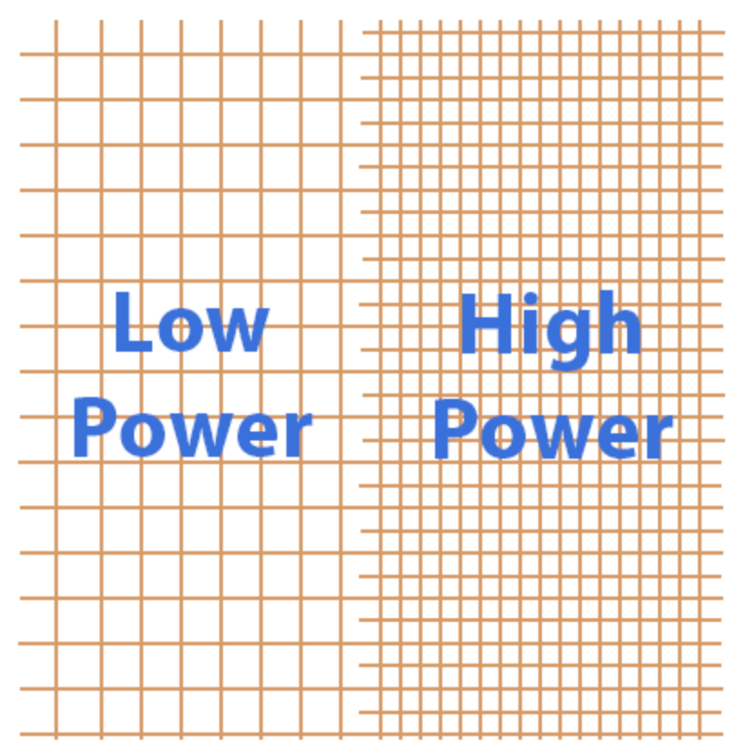

# Statistics 
:label:`sec_statistics`

Deep learning is likely to ignite another industrial resolution, motivating rapid progress in natural language processing, computer vision, automatic speech recognition, and so on. With these technical advancements, smart phones can answer easy-to-understand spoken queries, and cars can achieve increasing levels of autonomy.  Almost every industry sector is starving and hunting for deep learning experts. Undoubtedly, to be a top deep learning engineer or scientist, the ability to train the state-of-the-art and high accurate models is crucial. Indeed, the main body of this book attempts to deep machine learning approachable, from the concepts to the real-world applications. Beyond that, understanding the mathematical mindset behind the models will strengthen your ability to deal with different probings, no matter in the interviews or the customer questioning such as “why we should trust the key parameters of your model?” As a result, in this section, we will empower you to explain the mathematicsal reasoning behind the models by introducing some fundamental concepts of statistics, which are the backbone of the deep learning algorithms.


You may wonder: “What is the essential difference between deep learning and statistics?” Fundamentally speaking, statistics theory focus on inference problems. This type of problems includes modeling the relationship between the variables, such as [causal inference](https://en.wikipedia.org/wiki/Causal_inference), and testing the statistically significance of model parameters, such as [A/B testing](https://en.wikipedia.org/wiki/A/B_testing). In contrast, deep learning algorithms emphasis on making accurate predictions, without explicitly programming and understanding each parameter's functionality. 
 

More specifically, statistics can be divided to [descriptive statistics](https://en.wikipedia.org/wiki/Descriptive_statistics) and [statistical inference (or inductive statistics)](https://en.wikipedia.org/wiki/Statistical_inference). The former is a summary statistic that quantitatively describes or summarizes features of a collection of observed data, which is refered to as a *sample*. The sample is drawn from a *population*, denotes the total set of similar individuals, items, or events of our experiment interests. Contrary to descriptive statistics, *Statistical inference* further deduces the characteristics of a population from *samples*, based on the assumptions that the sample distribution can replicate the population distribution at some degree. We will introduce three types of statistics inference methods: evaluating and comparing estimators, constructing confidence intervals, and conducting hypothesis tests. These methods can help us infer the characteristics of a given population, i.e., the true parameter $\theta$. 


In the section, for brevity, we assume that the true parameter $\theta$ of a given population is a scale value. It is also straightforward to extend $\theta$ to a vector or a tensor, and evaluate its estimators using the same techniques below. 


## Evaluating and comparing estimators

In statistics, an [estimator](https://en.wikipedia.org/wiki/Estimator) is a function of given samples for calculating the true parameter $\theta$. We estimate $\theta$ with an estimator $\hat{\theta}_n = \hat{f}(x_1, \ldots, x_n)$ as the best guess of $\theta$ after modeling through the training samples {$x_1, x_2, \ldots, x_n$}. 

A better illustration of what we are going to discuss about is plotted in the following graph, where we are estimating the true parameter $\theta$ from the population by the sample estimator $\hat{\theta}_n$.

```{.python .input  n=3}
%matplotlib inline
import matplotlib.pyplot as plt
import numpy as np
import scipy.stats as stats
import math

# sample
theta_population, theta_sample = 0, 1
sigma_population, sigma_sample = 1, 1.2
x_population = np.linspace(theta_population - 3*sigma_population, 
                           theta_population + 3*sigma_population, 1000)
y_population = stats.norm.pdf(x_population, theta_population, sigma_population)
x_sample = np.linspace(theta_sample - 3*sigma_sample, 
                       theta_sample + 3*sigma_sample, 10)
y_sample = stats.norm.pdf(x_sample, theta_sample, sigma_sample)


# plot
fig, ax = plt.subplots()
ax.set(frame_on=False)
ax.plot(x_population, y_population, label='population', color='#66BFFF')
ax.plot(x_sample, y_sample, label='sample', color='#B2D9FF')

# annotation
ax.axvline(x=theta_population, linewidth=1, linestyle='--', color='#66BFFF')
ax.text(x=theta_population-2, y=0.41, s='Population\nParameter\n'+r'$\theta$', 
        multialignment='center', fontsize=12, color='#66BFFF')
ax.axvline(x=theta_sample, linewidth=1, linestyle='--', color='#B2D9FF')
ax.text(x=theta_sample, y=0.4, s='Sample\nEstimator\n'+r'$\hat{\theta}_n$',
        multialignment='center', fontsize=12, color='#B2D9FF')

plt.show()
```

```{.json .output n=3}
[
 {
  "data": {
   "image/png": "iVBORw0KGgoAAAANSUhEUgAAAXoAAAEeCAYAAACExd7cAAAABHNCSVQICAgIfAhkiAAAAAlwSFlzAAALEgAACxIB0t1+/AAAADh0RVh0U29mdHdhcmUAbWF0cGxvdGxpYiB2ZXJzaW9uMy4xLjEsIGh0dHA6Ly9tYXRwbG90bGliLm9yZy8QZhcZAAAgAElEQVR4nO2dd7gcZfXHP8fQe6+hiRkFASkxwE/EoQdhQpMSqohkQBCQDiKEKBI6iigTFJBuQCkDhFAHFCkJVQMyhKIEUJAmPQTe3x/nvcnm5pa9e3d3Zveez/Psk7u778z7vbm7Z86c97zniHMOwzAMo335QtECDMMwjMZiht4wDKPNMUNvGIbR5pihNwzDaHPM0BuGYbQ5ZugNwzDaHDP0hjHASHNGpzlXFq3DaB5zFS3AMAYSac4mwJnAV4HPgGeAI6KASYUKM9oa8+gHAHFGGGdM68fxF8UZP6mnpoFImrMIcAtwAbAEsCJwKvBJkbqM9sc8+gKIM14ClkU9ug+ACcChScj7ReoCiDO+C3w/Cdmk47Uk5KDiFLUVAUAUcI1//hFwB0CaszpwMfA1wAETgUOigHf8+y8BFwL7AKsD1wInApcBmwAPA7tGAW+nOasCLwIxMBoQ4Jwo4OyuRKU5GwHnAmsC/wQOjwKyev3SRvGYR18cURKyELA+MBQ4qWA9RuPJgc/SnN+nOdumOYtXvCfA6cAKwBrASqiRrmQXYCv0ghGhDsKJwNLod/mwTuM3A4YAWwPHpTlbdhaU5qwI3Ar8DL3LOBr4Y5qzdO2/plE2zKMvmCTklThjArBWnLECcBHqob0FnJGEXAwQZ4wG1kLvAr4NPAfsn4Q86d93wJAkZKp/fhkwLQnnvIDEGccDBwLLAC8DP05Cbogz1vDzzx1nvA/MSEIW63yuOONA4DjUMPwFOCgJebVCx8HAUagBugq9WxnwRZWigP/5GP1xqPe+XJpzG3BgFDAV9G8HvJHmnAuc0ukUF0QB/wFIc/4MvB4FPO6f3wBs0Wn8qVHAB8Df0pxLgZHAXZ3G7A3cFgXc5p/fmeZMRj9jv+/nr2yUBPPoCybOWAn9Uj2O3o5PQ7267wA/jzM2rxi+A3AdamCvBm6MM+auYdrngW8Ci6Ix4ivjjOWTkGeAg4AHk5CFkpDFutC7Oep57gYsj97qX9tp2PbA14F1/LhtatDYlkQBz0QB340CBqMX7hWA89OcZdOca9OcV9Kc/wFXAkt1Ovw/FT9/1MXzhTqNf7ni53/6uTqzCrBrmvNOxwN1NJbv8y9nlBYz9MVxY5zxDuoR3weMA74BHJeEfJyEPAH8Fti34phHk5Drk5BP0ZjqfMBGfZ04CbkuCXk1Cfk8CfkDencwrMrD9wIuSUIeS0I+AU4ANo4zVq0YMzYJeScJ+RdwL7BuXzUOBKKAf6Ax9rWAn6Ox+bWjgEVQT1v6OcVKFT+vDHrX1YmXgSuigMUqHgtGAWP7ObdRIix0Uxw7JuGs2+g4Y0PgrSTkvYox/0Tj9x3M9NCSkM99Jk1XXlqPxBn7AkfCTOO8EHN6j92xAvBYhY7344w30QySl/zL/64Y/yFzepoDkjTnK8B2wB+igGlpzkpoOOUh9O7qXeBdHzc/pg5T/iTNORBYDdgfvXh05kpgUpqzDRrWmRt1HqZGQe2ZWka5MI++PLwKLBFnLFzx2srAKxXPZ3poccYXgMHM8tI+BBaoGLtcV5PEGaug8eFDgSV9eObvzPIee4ulv4re7necb0FgyU46ja55D9gQeDjN+QA18H9H1zNORRfm30UXR/9Uh/nuQ+P+dwNnR4Fm+FQSBbyMhgRPBN5AnYljMNvQVphHXxKSkJfjjL8Cp8cZR6OZFQegoZIONogzdgZuRjMsPkGNBcATwJ5xxhQ0M+NbwOQuploQNeZvAMQZ+6Ohgw7+AwyOM+ZJQqZ3cfw1wDVxxtXoZp+fAw8n4Uxv3uiGKOAVdM2iK6YAG3R67ZyKY1ftdK69Oz3/LRrqq+SSKGBcFzpGd3r+MPp5MdoUu2qXi5FoOOVV4AbglMrwDnATsDvwNppPvbOP1wMcjqbcvYNeHG7saoIk5GnUgDyIGvW1gQcqhtyDGp1/xxn/7eL4u4CfAH8EXkNzuvfo+69qGEazEGsl2Br49MovJWGXcVbDmEnFhqm5o4AZBcsxSoCFbgyjzYgCXqL/GTtGG2GhG8MwjDbHQjeGUULSnG8Cv40Cvly0FqP1MUNvGHXGFyDrKFrXwWVRwKE9HOOAIb4UQkNJcy1pEQVWX2mgYDF6w2gMURTMUVemLUhzBkXBbBcxo+SYoS+AMpcp7o6eiqQZ1ZHmfAn4HVoS4lPg7ihg9zTnfj/kSe/ZH4Cmvl7pa+L0qUyxH38dWs9ofuBJ4OAoYEqaMwpNv3VpzhHAvVFAlOasAfzGa3sFOCEKuNmf6zK0ls4qaL79DsxZHM0oMbYYWxz9KlMcZ611kW41vQ3ip2j9+cXRXc0XAEQBm/r3vxYFLBQF/KGb4/tSpngCWqJ4GbRkxVV+rnH+5zP9XFGaMzeQem3LAD8Erkrz2dYH9gROAxZG6zMZLYR9+QqmU5ni/YFjUSPwBlqmOAHtEoXWJbkA+BFwZ5xxGHAFuq1+LnTj00FJqDVK4owM/VJujlaSvBf4LvBL1FA8C+zasas1zviKP/8Gfv6fJCHj42yWFxhn6gUmIZEvq3wBsCnwPnBeEvJLf67R6I7bj4ERaG2dzjs325kb03y2HPZjUC9+FWAFX0emrwaz6jLFUcAlHT+nOaOBt9OcRaOAd7s470ZoPaKxUcDnwD1pzi3oBr7RfsxNUTBzY93HfdRtFIx59AXTqUzx62iJ30XQIlTnxRnrVwxfDi1RvAowCv37Xeqfr4zeXv+q0xR7oLf7K6K3/A/6Y5ZASxic4nUsCNyJlj9exh/36zhjzSSc5QX68sWRr7WTomGBFVEjc0SczVaSeAfgemAxf/xAYsdOFSEvRi/iAjyS5kxJc77Xx3NWVaY4zRmU5oxNc573JY9f8mO6K1y3AvCyN/Id/BP9u3bwMkbLYh59cdwYZ8xgVhGrnychH1W8f1+ccQcaZ+2oFvk5Whaho8foR2gpAgDijNNQr72SS5OQ5/37E4A1O8oqxBnXoeEE0AvMS0nIpf7543HGH4Fd0YJbnfk6sHQSMsY/fyHOuBi9QEz0rz2YhDNLMXzU+QQDjSjg32jDl44m4XelOfc3INNmT/QiuyVq5BdFy2Z0V7juVWClNOcLFcZ+ZbQjFt0cY7QQZuiLY7YyxQBxxraohx2g3voCwN8qhryRhLNum+OMBYDzgOEwsy3dwnHGoCScmRVRbbOKVYANfY38DuZCQ0NdsQqwQqfxg4A/Vzw3L7CCNGdX4EEftnkbNZ4dhvU/wBehLkZ/YbTg3ZvoZ+jnnd7vmKuDh9Hqp8emOeegfREi9GJutAFm6EtCnDEv6p3vC9yUhHwaZ9zI7FvZO3tVRwFfBjZMQv4dZ6yLhoBq2f7+MnBfErJVN+93nvtl4MUkZEgP5xzIXmCa5rOlIN6JNng5P81ZFDW2h0cBL/j3RwO/T3PmR8Nyr/dj7svRrl6voC0pf4K2d+zgd8B1vptUFgXsmOZEwK/RRjKvAPv6xihGG2CGvjzMA8yLLoLO8N791mi98u5YGPXK34kzlmDOHqN94RZgbJyxD7NaA64LvO9bDHb2Ah8B3oszjkMXd6ejTa3nT0Im9UNHy9O5pHAnju3mmIvQfr2VDO7unD2VKY4C3kdDN5VcXjH2OTp1/YoCptBNqeIo4LtdvW60DrYYWxJ8Z6nDgPHobf2eaN35njgfzZP+L1qX/vZ+zr81GmN/Fe0SdQZ68QH1AteMM96JM270oaHtUYPxotfwWzQebBhGibASCIZhGG2OefSGYRhtjhl6wzCMNscMvWEYRptjht4wWpA059tpzreL1mG0BrYYaxgtRpqzFFqADGCrKODNIvUY5cfy6AcIccZ6aB2c9dDc/O8kIf8qVpVRI6ei+fiDgDHAIcXKMcqOefQDgDhjMDAJiNEdmpcC/0tCRhUqzDCMpmAx+oHBOcDFScjNvnDatVgdE8MYMFjops2JMxZBt8MHFS9/AaspbhgDBvPo258tgLmBp3z5gnfQ2vD/LFZWbfiGJqXFN/lo9BzrpTkPpDkfpjmPpDkrN3pOo7UxQ9/+rArcnIQs1vFAa9bXXBenYNKiBfRCQ/WlOYOB29A6REsCL9DHNpTGwMMMffszL1prHIA4YzW0R21vBdOMcnIOcHEUcHMU2HqLUR0Wo29/JgGH+v6ug9BWgT9OQt4qVlbNTKa2evvNomH60tzWW4zaMEPf/tyD1prP0Y5DZyQhFxcryaiRmest6awmf/MCNxUlyGgNzNC3OUmIAw7yD6O1WRW4OQrYqeOFNOc2Wne9xWgSVcXoRWS4iDwrIlNF5Pgexu0iIk5Ehla8doI/7lkR2aYeoo0BTVeNystEI/XNtt6S5rOvt/gMnAvSnClpzg8bqMNoMXrdGSsig9Db/q2AaWjMd6Rz7ulO4xYGbkVb4h3qnJssImsC1wDDgBWAu4DAOVfZS9MwjCpIc7YAfo9+nwah3cguiQIu9vVvHkY7fs0DXBEFVvTMUKrx6IcBU51zLzjnpqOr/J37UQL8FE35qlwY2gG41jn3iXPuRbTD/bB+ajYGMHHGq0Vr6Ik0b6i+yvWWv6DGvGO9ZR3g2ijgPWBZ4KUG6jBajGpi9CsCL1c8nwZsWDlARNYHVnLO3Soix3Q69qFOx65Yo1ZjABJnfAFYC/3MLQUsH2fsAtyXhPy3UHFds3yjThwFPa63rAM85n/+GvBko3QYrUe/F2NF5AvAuVB7p3gRGQUzC2yNc86N668uo7WJM+ZBDdoPgS91evt64PM44w7gtCTkL83WV0LWZtZmra8BNxSoxSgZ1Rj6V4CVKp4P9q91sDDqcWUiArAccLOIjKjiWAC8YTfjbgAQZ2yMxqKHAA8AY4H70DvCB9ELQIQ6B3+OM64ADk9C3i5G8Ww81vuQ+hMFHFDxc7cJE8bApJrF2LnQmOAWqJGeBOzpnJvSzfgMONovxn4V3aDTsRh7NzDEFmON7ogzDkN3f74MHJKETOhh7ALA8cCJwL+A7ZOQp7sbbxgDlV4XY51zM4BDgYnAM8B459wUERnjvfaejp2CZgY8jeb6HmJG3uiKOEPijNOAX6C1XNbvysjH2aw7vyTkwyTkZGATYAHgwThjo2Zp7oo0tztTo3xY4xGjFMQZp6Pe+cXAQUnI592Mc0k4Z4mBOGNlNCtlaWCLJGRyI/V2R5rjoqDUJRqMAYgVNTMKJ844GDXyCRB3Z+R7wrdF3Bx4C5gQZ6xaV5GG0cKYoTcKJc7YEu1lewsak6/5FtMb++FoPZib4oyF6qPSMFobM/RGYcQZy6FNUP4BjExCqlm/6XEfRhLyLLA7mgn2636L7Du2T8QoHWbojULwG6EuR9Nzd0tC3q/y0A16G5CETER3au8TZ+xeu8qa6FWfYTQbM/RGURyC1k86IgnpMlW3G6ptmPIzdFf2RXE2216ORmMNXYzSYYbeaDo+Q+Z0NOW2IbXxk5AZwN5ovP7COLNMGGPgYobeaCre4P4a7cJ0cH8WX3sjCXkeOAXdRdtVIT7DGBCYoTeazY7AdsBJSVhThcW4j+N/CTwFXNCkLJy+6jOMhmMbpoym4QuVPQ18AnzNh1eaMe/GwF/RAmgnNWNOwygT5tEbzeQQYHXgqFqNfJz1PdSThDyINsA5Ms4am/6Y5o0LRRlGrZihN5pCnLEkcDIwMQkL6XH6Y7Raa9lbERpG3TFDbzSL44BFgKOLmDwJeRHdgbt/nLFWERoMoyjM0BsNJ85YBg3bXJ2E/L2fp7ulH8eeBrwHjOmnhp7ojz7DaAhm6I1mcAwwH7qJqV8kIVE/jn0TLYO8U5yxdn+1dEUU1K7PMBqFGXqjoXTy5p+tw/nS3kf1yC+A96Ex2Tdp3m99hlF3zNAbjeYYYF7q4M17tu/PwUnIW8AFwK5xxhr1kTQb/dJnGI2gKkMvIsNF5FkRmSoic/SjFJGDRORvIvKEiPxFRNb0r68qIh/5158QkYvq/QsY5SXOWBw4GLi2Ht58HTkX+JAGefWGUTZ6NfQiMgi4ENgWWBMY2WHIK7jaObe2c25d4Ez0i9TB8865df3joHoJN1qCGFgQ/UyUhiTkv8BFwB7WoMQYCFTj0Q8DpjrnXnDOTQeupVPdEOfc/yqeLgi2aWSg43fBHgbcmYQ8Wa/zdtVGsEZ+gX5Of1in8wFgbQSNMlKNoV8ReLni+TS6aK4gIoeIyPOo93ZYxVuricjjInKfiHyzX2qNVmIksDxwdj1PGmeMqsd5kpCX0cb1348zFqnHOQHSvD76DKOe1G0x1jl3oXNudXRjTEfs8zVgZefcesCRwNUiMseXSkRGichk/7AvSovjK1QeDfwNuLPOp0/qeK7z0E1c36vjOeupzzDqQjWG/hWYrXHDYP9ad1yLVijEOfeJc+5N//OjwPNA0PkA59w459xQ/xhXrXijtGyNtvI7u5FliPtLEjIJ+AtweJwxV9F6DKNRVGPoJwFDRGQ1EZkH2INOXXREZEjF0+2A5/zrS/vFXETki8AQ4IV6CDdKzaHAv9GLftk5F1gV75wYRjvSqxfjnJshIocCE4FBwCXOuSkiMgaY7Jy7GThURLYEPgXeBvbzh28KjBGRT4HPgYOcc2814hcxyoHPYtkO+FkSMr0BU4yo8/luBl5EL07X1+F89dZnGP2mqttV59xtwG2dXju54ufDuznuj8Af+yPQaDli9KLeqBDco/U8WRLyWZyRAGPjjDWSkGf6ecq66jOMemA7Y426EWfMC3wfSJOQaQ2apqf1oVq5FL0brUd3qEboM4x+YYbeqCffAZZCe8K2DEnI6+id535xxgJF6zGMemOG3qgnB6ML8XcXLaQGLgIWA3YvWohh1Bsz9EZdiDPWAb4BXJSEfN7AqS5u0HnvB54B+lumo1H6DKNmzNAb9eL7aNPvyxo5SRI2Zuepz/e/CBgWZ6xf63miwHbGGuXDDL3Rb/wi7F7Ajb4McCPnamRWy+XAx+hFqybS3LJujPJhht6oByOAJYBLmjBXzd52byQh7wB/AkbGGfPVeJqG6TOMWjFDb9SD76HF7lpxEbYzl6KLsjv0NtAwWgUz9Ea/iDMGo7VtLktCPmvClK81+Pz3otVav1vj8Y3WZxh9xgy90V/2RT9HlzVjsiRkhQaf/zPg98DWcTZnOe7eiILG6jOMWjBDb9SML0e8P3BfEvJ8k+Yc3YRpLkO/G/v09cA0b4o+w+gTVprV6A/fAL4E/LSJc54CjTGmac5gYI3tV4DJb/E35zjk5md5VPrWM+qUNOeBGiU44IEo4KMajzeMLjFDb/SH7wHv0QaF69Kc5YApaCMShi4x8607ajhdLcd0kKU5m0dBeev4G62HGXqjJuKM+dHaNtcnIR8UracO/BRYAE0Vfev9GSzw1DvcPO8XuGODJfrU3PwvwCY1atgSvVvZCU3zNIy6YIbeqJXtgYWBq5o879B6nzDNWRc4ADg/Ckg7Xs8yxgM73PIquychH1d5rqFRUNumqTTnYWBX4Kw059Yo4JNazmMYnbHFWKNW9kZTCbOCdfSLNEfQLlNvMedaw5XAosC3m6ElCpiB9lb+InBYM+Y0BgZVGXoRGS4iz4rIVBE5vov3DxKRv4nIEyLyFxFZs+K9E/xxz4rINvUUbxRDnLEEsC1wdZNy5yuZXOfzjQA2A0ZHAW93eu9e4D9oeYdq6Ze+KOAOtMnPSWnOMv05l2F00Kuh9z1fL0S/2GsCIysNuedq59zazrl1gTNRDwk/bg/gq8Bw4NcdPWSNlmZXYG6aH7apK2nOPMDZaNXKpPP7ScgMtO/t9nHGYk2UdhSwIHBqE+c02phqPPphwFTn3AvOuenoB3+27eHOuf9VPF0QZmYM7ABc65z7xDn3IjDVn89obfZCjeMTRQvpJ4ei6aFHRQGfdjPmKmAeYOdmiYoC/oE2bxmV5qzdrHmN9qUaQ78iuiW8g2n+tdkQkUNE5HnUoz+sL8carUOcsQrwTeAqX9q32dTFy01zlgJOBiZGARN6GDoZdVCqDd/Uyws/FXgXOMevIxhGzdRtMdY5d6FzbnXgOOCkvhwrIqNEZLJ/WD3vcjPS/3t1EZMnYd02S40GFkLDJD3N51CvfrNqSiJEQX30RQFvosZ+K5q0GGy0L9UY+leAlSqeD6bnBsjXAjv25Vjn3Djn3FD/GFeFJqMAfMmDvYG/JiEvFqTh1f6eI81ZE+0klUQBU6o45GpAqKLNYJr3X18FvwZy1Kufu47nNQYY1Rj6ScAQEVlNROZBF1dvrhwgIkMqnm6H9g3Fj9tDROYVkdWAIcAj/ZdtFMQ66MJ6kYuwy9fhHOcA76PlFHolCcnREE414Zt66APArxscDXwZ7cdrGDXRq6F3zs1AF60mogtw451zU0RkjIiM8MMOFZEpIvIEmge8nz92CjAeeBq4HTjEOdfsdDyjfuwFzED/pi1JmrMtmgE2Jgr4bx8OvQpYP874SmOUdcstwF3A6DRnid4GG0ZXVBWjd87d5pwLnHOrO+dO86+d7Jy72f98uHPuq865dZ1zm3kD33Hsaf64Lzvnelr0MkpMnPEF9G7ujiTsk4GsN4/VeqAPf5yDLq7+qo+H/wH4nN69+pr1dYWveXMkunGrqjsQw+iM7Yw1qmVDdL3l2iJFJCEb9OPwUcAawDFRwPQ+zvsauoFqd79W0SVR0C993Z3zb8BvgR+kOV+u9/mN9scMvVEtuwLT6bQ+02zijJoW69OcxdEslnuBm2qc/g/oOtO6PczTqGSCnwAfoRu8DKNPmKE3esWHbXYFbk9C3i1YzoE1HvcTtIH5kf0oAXwD8BmwWw9jatXXI1HA68DPgO3TnK0aMYfRvpihN6phIzQ1tiUXYdOcIWhCwSVRUPtuXr82cRe9hG8ayC+AF4Fz09wqzxrVY4beqIbdgE9gVgnfFuMsVH+fNvJ1w3hgNah/LL43fNniY4C10LLKhlEVZuiNHukUtvlfb+ObQJ9KaKQ5m6M1l34eBfy7DvPfAHxK9+GbRpf4+BNwP/DTNGfRBs9ltAlm6I3e2BhYgfKEbar2pNOcQcB5wD/9v/0mCXkbuBPYrZvwTUM9/Yp0y6WAHzdyLqN9MENv9EbZwjZ9yfrZH93Ne2wUVNchqkrGA6vQdSXWhmcl+Q5WvwcOT3O+2Oj5jNbHDL3RLRVhm9uSkPeK1tMX0pxF0CyVB4Dr6nz6m9BU015r3zSQH6MhpL70szUGKGbojZ74Blq7pd6GshmcACwL/Kgf6ZRdkoS8g5YE2dVfDJtOFPAqcAawS5rzrSI0GK2DGXqjJ3YDPkbrrZSFuLcBac6qwI+AK6KASQ3S8Qc05XSjTq/3qq+OnIP2ezg3ze27bHSPfTiMLokzBgG7ULKwTRJWtfP0DLQuzYkNlJKiaxezhW+ioGE7Y+cgCvgQOB5YH9i3WfMarYcZeqM7OsI2Zcm2ASDOeg7DpDmboHciZ0YB0xqlw6eaTqBT+CbNm9516xrgYeD0NGehJs9ttAhm6I3u2A2trXJr0UKqxYcvzkOb25zVhCn/gF4MN2nCXF3i1x+OAJZDu7sZxhyYoTfmwIdtvoOGbd4vWk8f2AsYCpwQBXzQhPluQS+GPdW+aThRwEOoZ390mrNykVqMcmKG3uiKb6IZK6UK23i6XBhOcxYExqKdoJrSActfBG8FvuMvjt3qawLH+3/HFjS/UWKqMvQiMlxEnhWRqSJyfBfvHykiT4vIUyJyt4isUvHeZyLyhH8UWuLWqJpdKWnYJgmJunnrGHQH7xFRwOdNlDQevSh+EyAKutXXUKKAf6EljEem+RyZQMYAp1dDLyKDgAuBbYE1gZEismanYY8DQ51z6wDXM/smjo9856l1nXMjMEpNRdjmliRsSvijT8TZnDt005zBwLHA+CjggSZLug34EB++SfNCdxCfAbwGnJ/mhVTXNEpKNR79MGCqc+4F59x0tMPQDpUDnHP3Ouc+9E8fQvOLjdZkU2AZyhm2Adi+i9dORz/LTV+M9BfDW4Bd4oy56FpfU4gC3kd3zG4IjCxKh1E+qjH0K6KbMjqYRs8V+g5A0846mE9EJovIQyKyYw0ajeayG+qh3la0kGpIc4YBewPnRgEvFSRjPHpx3LSg+Sv5PXqHPTbNWaBoMUY5qOtirIjsjWY9VKa2reKcGwrsCZwvIqt3cdwofzGYLCKj6qnJqB7vke6Chm0+7G180fjwxHnAf1CvvigmAB9QcPYNgF+fOALt73tkwXKMklCNoX8F/dB0MNi/NhsisiV62zjCOfdJx+vOuVf8vy8AGbBe52Odc+Occ0P9o2k7C4052BRYmvKGbUjC2WLPuwH/B5wUBcXt3vUXxVuAXW55lbmL0tFBFHA/Wrf+hDRnhaL1GMVTjaGfBAwRkdVEZB5gDzqVYhWR9YAENfKvV7y+uIjM639eCt1t+XS9xBt1ZzfUM53Q28CiiDNGAaQ586GLj08ClxYqShkPLDVsidJUkzwWmAs4rWghRvH0auidczPQfpsTgWeA8c65KSIyRkQ6smjOAhYCruuURrkGMFlEngTuBcY658zQl5CKsE1a8rBN4v/9EVoT/kdRwGcF6ulgAvDBMvPxo6KFAEQBz6M9ZvdL8+a3PTTKhTjX7NIcRhmJM7ZEOyftnITcULSe7ogz3PYrsDzwHHB3FFCaBf444+rtV2DkLa8ydxIyo2g9vtXgc8A/gG/Vu1yz0TrYzlijg92A94HbixZSBT8D5kU3SZWJjrWNzQpV4YkC3gV+gm7m2rlgOUaBmKE3OsI2O6Nhm4+K1tMTy87L4cD3gAuigOeK1tOJ2ye9VXztm078Dvg7cFaaM2/RYoxiMENvgHqgS1LibBvQdMqvLsruwFvAT4vW05kk5OP3P2UCsHOcFZ99AxAFzEDTLFcDDi9YjlEQZugNmBW2mVi0kF7Y4Z7X+T/g5CjgnaLFdMVmy7IzsASwedFaOogC7kTTP09Kc5YpWo/RfMzQD3C857kzcFOZw/QparwAACAASURBVDY+7HC2f1r2vRb/o1zhG4CjgfmBMUULMZqPGXpjc9QDLXXYBk3xXR1mhiPKzM3ATmUJ3wBEAc8CvwYOTHPWLlqP0VzM0Bu7Ae8BdxQtpDvSnKXR7JEJwMUFy+mNi9GL5uLAFgVr6cypwLtoM3GrbjmAMEM/gPEe505o2ObjovX0wGh0Q95RSUipayFFAaPQi2bpwjdRwFvo/+WWwHbFqjGaiRn6gc0WqOdZ2rBNmvNV4CDgoijgmTjj0aI19USa82gS8glwIxq+madoTZ34DfAscE6al06b0SDM0A9sdkM9z9KGbYBzUI2j/fP1i5NSFR36xgOLod5zaYgCPgWOAgLg4ILlGE3CDP0AxXuaOwE3eg+0dKQ52wLbAGOigP8WraeP3InGw0sVvvHchuo7Jc1ZsmgxRuMxQz9w2RL1OEsZtklz5gbORWu1XFjx1mvFKKqa1wCSkOnADcCOcVauHam+5s2RwKLAKQXLMZqAGfqBy26ox3ln0UK6IQa+AhwdBUzveDEJy11fPQpm0zceNaZbFSSnW6KAv6P7EX6Q5nylaD1GYzFDPwDxHuaOwA3e8ywVac7iaCrgPTB7s+04mxmrLyVpPpu+u4F3KGf4BuBktP/A2b0NNFobM/QDk61QT/O6ooV0w8loNtCRXZTWLXuoYaa+ivDNDmUL3wBEAW+glUC3S3O2LlqP0TjM0A9MdkU9zbuKFtKZNCdAd8H+Ngp4smg9dWA8sAiU1pD+EngB3UQ1V9FijMZQlaEXkeEi8qyITBWR47t4/0gReVpEnhKRu0VklYr39hOR5/xjv3qKN/pO2cM2aLeyj9CdsO3A3cDblDR8EwV8gtb1/yrw/YLlGA2iV0MvIoPQrIdtgTWBkSKyZqdhjwNDnXPrANeD9s0UkSXQW9kNgWHAKSKyeP3kGzWwNephli7bJs3ZAhgB/DwK+E83w4Y2UVItzKYvCfkUbdS9Q5wxXzGSeuUG4D7gp2nOYkWLMepPNR79MGCqc+4F59x04Fpgh8oBzrl7nXMdfUYfAgb7n7cB7nTOveWcexvN8BheH+lGjeyGeph3Fy2kkjRnEJpO+RJwfrFq6s54YGH0+1A6KtItlwR+XLAcowFUY+hXBF6ueD7Nv9YdB6DFp2o51mgg3qPcAfiT9zTLxF7AOsDxUdBj3Z3JTdJTK13puxd4k5KGbwCigMeAy4EfpjkrF63HqC91XYwVkb3RW9ez+njcKBGZ7B+lLlrV4myDepalCtukOfOhHaMmU95MoJqpCN+MiDPmL1pPD5zs/z21UBVG3anG0L8CrFTxfLB/bTZEZEv0tm+Ec+6TvhzrnBvnnBvqH2VvKtHK7IF6lvcWLaQTPwBWBo6LAj4vWkyDGI9W4Cxt6DIK+BdwAbCf1axvL6ox9JOAISKymojMgxqLmysHiMh6QIIa+dcr3poIbC0ii/tF2K0pf7u6tiTOWAgN24wvU9jGL/79GJgYBdxTxSFl9za705cB/6XE4RvP6WgRuZ8XLcSoH70aeufcDDSveSLwDDDeOTdFRMaIyAg/7CzUW7lORJ4QkZv9sR1NnCf5xxj/mtF8dkBbyV1dtJBOHId2uJojbbcrkrDcO2OjoGt9ScgMNHwTxRkLNFVUH/A1608Htk9zNi1aj1EfqorRO+duc84FzrnVnXOn+ddOds51GPQtnXPLOufW9Y8RFcde4pz7kn9c2phfw6iCkejC+F+LFtJBmrMicARwVRTwRDXHxBmvNlZV/0jzHvWNBxZEU5XLzC/REOuZ1omqPbCdsQOAOGNJdCH2miQsVQx8NDCIvm2OWr4xUupGT/ruA95AdyaXlijgI2btf9mpYDlGHTBDPzD4DjAXcE3RQjpIc9YAvgf8Ogp4sWg9zcCHb/6Ihm8WKlpPL/weDdWebqURWh8z9AODPdEvbZlqx/wcrZx4Wh+Pe6wBWupJb/quARag06bDshEFzEDXTQL0gmy0MGbo25w4YyVgU+DqJJyjEmQhpDn/h9bbOcNXUKyaJGSDxqiqD1HQq76/AP9CN4iVnRR4ABid5ixYtBijdszQtz+7+3+vLVSFxy/unQH8mxpKHcQZpd5nkeY96/NrJFcDW8cZyzRHVW340gjHoesOhxcsx+gHZujbnz2BR5KQqUUL8WwPbAKMjgI+qOH4A+usp95Uo+9KdBF6994GFk0U8ABwE3BcmrNU0XqM2jBD38bEGV8B1qMki7C+cNlYIAcuKVhOYSQhU9D1kr2L1lIlJ6L7ZE4sWohRG2bo25uRgAP+ULQQz75oqesTo6A8u3ML4kpgWJwxpGghvREFPA1cChyS5qxasByjBszQtylxhqBhm3uSkNeK1pPmzA+MAR5Bd4jWStmrn1ar7xr0ItwKi7Kgex4+R3e6Gy2GGfr2ZUPgS5Sn5MEP0aJ2x3bRB7YvlDrrhir1JSGvoMXl9vIX5VITBUwDfgHsleasW7Qeo2+YoW9f9kVb8l1ftJA0ZwngBOC2KOC+fp7u5t6HFEpf9F2JXoyHNUhLvTkD7TV8etFCjL5hhr4N8X1h90D7wv6vaD3oxptFUWNvzOJPwCe0SPgmCngb3eA2PM3ZvGg9RvWYoW9PImBxdBt7oaQ5KwGHAVdEAU8VradMJCHvoncAe8QZcxetp0ouRIvjnWEFz1oHM/Ttyb7Aq5SjL+ypgDCre1F/iet0nkbRV31XAUujvRpKj2/z+BO0k9x3CpZjVIk4V4pd8Uad8LstXwHOTUKOK1JLmrMWmi9+XhRwdJFaykqcMQ/698qSsNxVLTvw+yGeAOYD1rRU2fJjHn37MRKtVHl50ULQwmXvUcfFuzgrR72e7kjzvulLQqaji7IjfDnp0hMFfIauu3wJ+H7BcowqqMrQi8hwEXlWRKaKyBydgERkUxF5TERmiMh3Or33me86NbPzlNFQ9gMe9bsvCyPN+Sa6VjA2CnizSC0twKXAPOi+h1bhNuB+4JQ0L33J5QFPr4ZeRAahCzDborsaR4rImp2G/Qv4Ll3nbH/UVecpo/7EGWujJQ8KXYStKFz2KtqtyOiBJOQptLxxy5QDrih4tizwo4LlGL1QjUc/DJjqnHvBOTcdrYI4Wy1t59xLzrmnoFTdiwYi+wIzKL5S5Y7AxsApUcCHdT73LXU+X72pVd+lwLpx1jqbkaKAh9AU0WPTvNyVOAc61Rj6FdF0qg6m0bdt6POJyGQReUhEduyTOqNqfHre3sCtSdi3Gu/1xHcjOh34B3BZvc+fhET1Pmc9iYKa9V0NTAf2r6OcZnAi2nT+pKKFGN3TjMXYVZxzQ9H44/kisnrnASIyyl8MJovIqCZoake2A5YDflewjv2BLwMn+C5FdSXOSOt9znqS5rXpS0LeQssB7+UzcVqCKOBZ4LfAQWnOHN9toxxUY+hfAVaqeD7Yv1YVzrlX/L8vABkaQ+48Zpxzbqh/lLqxRIk5EI2JTyhKQJqzAJo3/yBqtBrB9g06b73oj75LgSWh3HctXXAq8ClW8Ky0VGPoJwFDRGQ1EZkH3VpfVfaMiCwuIvP6n5cCvgE8XatYo2t8u8DhwKW+AXVRHI52Izqun4XLBip3oBfrllmUBYgCXgPOA0amOesXrceYk14NvXNuBnAoMBFtMD3eOTdFRMaIyAgAEfm6iEwDdgUSEelI7VsDmCwiT6KV+sY658zQ15/voX/LwsI2ac6SaG51GgX8uSgdrUwS8hmaMTU8zkpfjrkzZwFvoo1ljJJhO2NbnDhjEPAC8GwSFreNPs05BzgCWCcKis3hb2XijC8BzwEnJ2FrhULSnCNQz37rKODOovUYs7Cdsa3PVsDK6IJYIaQ5q6B3fZc12sjHGaVerE/z/unzvX3vBEbFGXPVR1XT+A3wT2BsmpttKRP2x2h9DgT+S+MWP6thDLqHYnQT5kqaMEd/qIe+i9Ckh2/X4VxNIwr4BE2zXB/YrWA5RgVm6FuYOGNZYATw+yTkkyI0pDlfA/YBfhkFs+23MGonBV4DDipaSA1cjRayOy3NWydNtN0xQ9/a7I8WMCsyd/504F1sEa5uJCGfoqG44XHGakXr6QtRwOfoovwXKX9J6QGDGfoWxS/CHgzcm4Q8U4SGNGcztAbSz333oWZQ9npJ9dJ3Mdo8/MA6na+ZTATuAU5OcxYpWoxhhr6V2R5dhP1VEZNXFC6b1mQNjzZxrlqoi74k5GW0bs4BrbRTFmYWPDseWAo4qmA5BmboW5lDUSNbVOnnXYCvAydHAR81cd6qd2UXRD31XQQsgxaJaymigEnAeOCoNGe5ovUMdMzQtyBxxhrAlsBvitgJm+bMjTYVmUI5Gpy0K3cALwE/KFhHrZwEzIu2HjQKxAx9a/IDtNJhUbnzBwBD0MJlnxWkoe3xO2V/DXyrlcoXdxAFPAeMA0alOUOK1jOQMUPfYsQZi6BNXv6QhLze7Pl9N6HRwJ8ppjb8xQXM2Rfqre+3wAdoHaFW5KfAJ8DPihYykDFD33rsCywEXFDQ/EegXYUKKVyWhOXeGRsF9dWXhLyN1vXfM85aL9YdBfwbOAfYLc35etF6Bipm6FuIOOML6CLspCRkUrPnT3OWBo4FbogCHmz2/ABxVu6smzRviL5foj1lW3EDFcDZwBvAGT5by2gyZuhbi+3Rph7nFTT/ScCCaFehoih7Gdy660tCcuBW4OA4Y756n7/RRAHvoWUyNgO2KVjOgMQMfWtxDFo06rpmT5zmfBHdoPW7KOAfzZ7f4Dw01XKPooXUyDi0yuoZVvCs+dh/eIsQZ2wEbAKcV1BzkZ+ijcdPLWDuSl4reP7eaJS+e4C/A0fEWeuFP6KA6cCPgXXQtqJGEzFD3zocDbxDAXVt0pz18D1/o6DYDUtJyApFzt8bUdAYfUmIA84HvobuoWhFxgOPAT9Lc+YtWsxAoipDLyLDReRZEZkqIsd38f6mIvKYiMwQke90em8/EXnOP/arl/CBRJyxOrAzukHq/QIkjAXeAs4sYO7ZiLOmlEKumTRvqL4r0VaDJzRwjobhC54dB6yChgGNJtGroReRQcCFaPGqNYGRIrJmp2H/QnO7r+507BLAKcCGwDDgFBFZvP+yBxxHos2Xm55SmeZsCWwNnBYFvNPs+bvglKIF9ELD9PlS1GcDm8UZGzdqnkYSBdyFNlY5Kc1ZtGg9A4VqPPphwFTn3AvOuenAtcAOlQOccy85555Cm09Usg1wp3PuLefc2+gfeHgddA8YfM35/YErk7C58Wm/aDYWvZD/uplzG91yMXp31ZJeved4YEk0ucBoAtUY+hVhtoYS0/xr1dCfYw3lKLReSBH13ncFNgB+EgV8XMD8Rid86O4XQBRnrF20nlqIAh4DrgGOTHOWL1rPQKAUi7EiMkpEJvtHqXc+NpM4Y2ngEODqJOS5Zs7tuwOdBjwFXNXMuXthaNECeqEZ+n4FvI96xq3KSWjTnLKH4tqCagz9K8BKFc8HU30p1qqOdc6Nc84N9Y9xVZ57IPAjYH7U4DabA4HVgeOtcFm5SELeQksY7xFnfKloPbUQBbyANhP/fprz5aL1tDvVGPpJwBARWU1E5kE3bFRbA30isLWILO4XYbf2rxm9EGcsCfwQLV7W1A1Kac7CqKeVAbc3c+4qmFy0gF5olr5z0QqmJzdpvkbwM+BDtOS10UB6NfTOuRlofZWJwDPAeOfcFBEZIyIjAETk6yIyDY3pJiIyxR/7FrrRZpJ/jPGvGb1zBFq8rIiqf0cBS1NQ4TKjd/zC/K+AveOMzllwLUEU8AZwFrBzmrNR0XraGXHOvsdlw8fmnwcmJiG7NnPuNGdZP/eEKGju3NUQZ7gkLO/O0DTHRUFz9MUZSwEvAhOSkN2aMWe98WWvpwI58C1zLBpDKRZjjTk4ES0eVkRnnp8A86Hb1ctI0SUYeqNp+pKQ/6I1cHZtxcYkAFHA++j/2TeBbxcsp20xj75kxBmroN7NFUnI95s5d5rzJTQ899sosJ2LrUCcsRjq1f85CRlRtJ5a8K0pnwY+Bta1xf/6Yx59+RiDbjwb3cxJfZ3wn6MLfGOaOXdfiDNeLVpDT6R5c/UlIe+gce4ozvhGM+euF1HAp+hd7FpoYx2jzpihLxF+A8w+wAVJyLRmzeuN/OnoYvqZUVDqCpFl32BThL5foDVwzvXNaVqR64EHgV+nOdsWLabdaNUPRbsyFniXJu6C9WUOLkCLTV2EZkkZLUQS8gHqEQ8Ddi9YTk34RdgRaOjwpjRnl4IltRVm6EtCnPFtdDHqNL8hpuGkOYPQsseHoMWyfuArDJaZx4oW0AtF6bvCzz02zpi/IA39Igr4L7A5moo9Ps3Zp2BJbYMtxpaAOGMetKnE58A6Scj0Rs/pSxxcAeyGrgeMsdS21ibO+Ba6ye3EJOT0guXUjE+5vAltPXhwFJAULKnlMY++HBwODAGOaJKRnw/4I2rkj44CTm0VIx9nlLpERpoXpy8JuQ+4ATgxzlq3eKBPudwOuA24KM05qmBJLY8Z+oKJM5ZHt7HfkoSNLzfgvaVb0S/SwVHAOY2es84cWLSAXiha39FosbCiGsjXBV8tdWe0P/LZac4pPmnAqAEz9MVzJlqG+MhGT5TmLIaWsgiB/aKAixo9p9FckpAX0AX1XeOstbNXfJ/ZkcBlaHjxTDP2tWGGvkDijG2AvYEzGl2GOM1ZCm0w/XVgtyjgikbOZxTK2cA/gAtbdWG2A7956gC0y93RaPql2a0+Yv9hBRFnLAQk6BeyoYXLfHOH+4A1gB2igD82cr4GU/bYc+H6/DrPwcBqaN33lsZngv0QOAM4CLgszZmrWFWthRn64hiDNkk+0PcCbQhpzirAn/1c20YBExo1V5PYoGgBvVAKfUlIBlwOHBtnrF+wnH7jkwVOQGsx7QNc6zPHjCowQ18AccZGaKbNb5KQvzRqnjRnCGrklwS2jAKyRs3VRKrthVAUZdL3I+AN4PI4Y96ixfSXKMBFAT9D17N2AW5I89YOTTULM/RNxodsrkR76TaswXOasxZq5OcHNosCHmrUXEY58RvvDgC+SonrF/WVKOA8IAa2BW71jXKMHjBD33zOA74I7JOEvNuICdKcoWhM/jNg0yjgiUbMY5SfJGQCcDFwTJzxf0XrqRdRwDg0hLMpcEeas3jBkkpNVYZeRIaLyLMiMlVE5mhILCLzisgf/PsPi8iq/vVVReQjEXnCPwZ0Ol+csSPwfWBsEvLnRsyR5myCZtf8D/hmFPBMI+YpkLhoAb1QRn1HAf8ErvRljduCKOAqtBDf+sA9ac7SBUsqLb2WQBCRQWh99K2AaWgdipHOuacrxvwAWMc5d5CI7AHs5Jzb3Rv8W5xzazVIf8sQZ6yM1iL5J7BxI3bApjlbolvHpwFbREHzKmAa5SbO2Bi4H0iBXZKwNXZCV0Oasw1wI1qXf6so4JWCJZWOajz6YcBU59wLzrnpwLXADp3G7AD83v98PbCFiNjGBo9fCLsemBvYo0FGfgS643UqGq5pSyMfZ+U2UGleTn1JyIPA8cBOwGEFy6krUcBEYDiwEnB/mrNqsYrKRzWGfkV04bCDacyZKzxzjG8m/i6a6QGwmog8LiL3icg3+6m3VTkf3ai0XyM2RqU5ewB/Ap5AF17/U+85jLbgXPSO7yyf+dU2RAH3AVsAiwN/TnO+XLCkUtHoxdjXgJWdc+uhKVFXi8ginQeJyCgRmewfoxqsqanEGd9FN3mcmYTcWO/zpznfA64GHkBvW5tS4thoPXy4Zn/UKbshzlipYEl1JQp4BC3vMQ/q2a9TrKLyUI2hfwVm+0AM9q91OUZE5gIWBd50zn3inHsTwDn3KPA8EHSewDk3zjk31D9KXZ2wL8QZITAOuJsGNNtOc36I1pO/A90M9b96z1FCbilaQC+UWl8S8jba4GNB4OY4Y8GCJdWVKOApNBPnUyBLc75esKRSUM1i7FzoYuwWqEGfBOzpnJtSMeYQYO2KxdidnXO7icjSwFvOuc9E5ItoXvfazrm29zrjjDWAv6J3Nf/ne3vWjTTnBLTH6w3AyCho3O5ao/3wBc9uQUM5uyZhezXkTnNWA+4Clga2jwLuL1hSofTq0fuY+6Fo1cNngPHOuSkiMkZEOrrO/w5YUkSmoiGajhTMTYGnROQJdDHyoAFi5JdDF0anA9vV08inOZLmnIYa+avQAmUDxsjHGWnRGnoizcutrwOfX38kujj7qzhrr6qQUcCLqP15BbjdZ+YMWKzDVJ2JM5ZCu/ysBmyehDxcr3P7Eq3no1kTF6P15NvKE+uNOMMlYXmNUprjoqC8+joTZ4xF+wWfnoScWLSeepPmLIM6qWsCu0dB/dfJWgHbGVtH/GaUO4DVgajORn4QatwPQ3fXxgPNyBsN4QR0HemEOOO4osXUmyjgdbQP7WPA9WnOngVLKgQz9HUizlgC9RzWAnZOQu6p17nTnLnR+jgHoE0ljmqV1n9GufGZOD8ArkEbi5/chmGct4Gt0TXCK9O88C5gTcdCN3UgzlgB9eSHoAtbdatg6Pu7/gHNlDguCjizXuc2jA7ijEHoWtt+aNez49tp9yyAr3T5R7QY2o+igPMLltQ0zKPvJ3HGEDSHfRVg2zob+QXRsrcjgEPNyEOcUep9Fmlebn3d4bNuvgf8BjgW+F2ctVe99yjgI2BH1Nifl+b8eKC0JjRD3w/ijC2Ah4GF0YXXeoZrFgVuR9Na948CLqzXuVucpGgBvVB2fd2ShHwOHIKGB/cHJvqQZNvg+9DuAVyBdnY7fSAYezP0NRBnSJzxQzQm/yowLAmZVK/zpzlLojnAGwF7RAGX1evchtETSYhLQk4G9gX+D3goztprh2kUMAP4LnARmnH0y3bvQ9vWv1wjiDMWR2PmvwRuQzdDvVCv86c5y6HpmWsDO0UB19Xr3IZRLUnIFejd5MLAw3HGge20SOv70P4AOAfdJ/Q7n9nWlpih7wNxxiZo4bCd0E1hOyZh/coOpLlW30Nz8LeLgnJvpy+IEb0PKZSy66sa3+ZyXTRbZRxwdZzNLFbY8vjMtWOA0aiHf7XPcGs7LOumCuKMRYHTUA/gBWBkvUI1ac4iqOe0LbpQNA/w7Sjgr/U4f7sRZ6yQhLxatI7uSHNWiILy6quFOOMLaL79aOBt1AO+rp2yctKco4CzgSloWYjbgQd9mKflMUPfA/5WdVd0g9LywAXASUnIe7We0y/8rIMa9uHAN4C50I5QdwFjooAn+ym9bbGdscXhY/W/A4aidXKOTkKeLVZV/UhzRqKVZr8BDELLrd+JGv3bW7mhiRn6bogzvgWcAWwIPA7EtXrxvp/llswy7sv7t55AP0QTUO/h0/7qbnfM0BdLnDEXcDhwCtp4/iJgTBLyRqHC6ojPeNsS/a5uy6z+G39Dv6u3Aw/4DJ6WwAx9Bd6DD9GV+G3QgkgnA5cnYfW3cH4Ffz1mGfaNUA/hHXRj1QRgYhTwWj31DwTM0JeDOGMZNJQzCvgETSs9Jwlb1+vtCn8HvhazjP4maKe499E78NuBCVHAvwoTWQVm6IE4Yz50gfUoYAPgdXQ1/oIk5KNqzpHmLIX21d0WvUgs49+azCyv/ZF2ifkVRZwxLgnLuykpzRkXBeXVV2/ijK8AJwJ7Ap+hpTouAia3Uwy/gzTXPTPMMvyr+LeeYZa3f3/ZKsoOWEPvvff10I0he6EtyHLUwF+ehHzc0/E+FWsos7z2YYAAb6L59ROAO3xRJcNoa+KM1dAdtfsCC6Dhzt8B1ydhe7a29N7+V5hl9L+FJlN8CNyLN/xRwPOFifQMKEPv63lsjGa37IhWmfwE7bd6KXC33x3YJWnOsmhxpG39v0sCDngE/aNOAB61qpKNI854NAnZoGgd3ZHmPBoF5dXXaHyG2p5ADHwN+By4D7gOuC0J+WeB8hqKL1kSMsvwr+7feo5Z3n7mSzE0lbY29D4tbG30Pz9EGxEsgTYEuRu4EU0Te7ur49OcudDF2A6vveML/Dp+JR712t9s2C9hzIbF6FsDf8e8Fpq1thvMbNb9HJrJcg/wcBIyrRiFjSfNGcIso78ZMB/wMXrh63AMn2tGJdqqDL2IDAd+gS4o/tY5N7bT+/MCl6OG8E1gd+fcS/69E9Dyup8BhznnJtbzF+jAZwOshYZjOh7rAgv5IS+gO07vACZ0t9EpzVkB/eMMR2Pui6FeyYPMuio/7nfWGU3GDH3r4Y3+Guhd8FZoiKOjV+2r6B3xJOAp4Mkk5OUidDYSXzlzU2Y5jR0XvheZZVfujQLeb8T81fSMHYTGrrcCpqF/kJHOuacrxvwAWKeiZ+xOzrndRWRNtM71MGAFdJU6cM7VPbQRZwyGmR+QD9DUxcfRD9F9Sdjzqrg38BNgZl2P15j1B7jL17Q2CibOeDUJWaFoHd2R5rwaBeXVVwZ8Vcz1UbvQ8Rji374jCdu/7Z/vadvh7W+OXvimAzdEAXvUe75qDP3GwGjn3Db++QkAzrnTK8ZM9GMe9M3E/4025T2+cmzluHr/It5r+A7qFUzta7Njv7h6A1py+HbgKWvuYRjNwcf2vwq4JKTu9qHMpDnzommb2wLTo6D+LR2rMfTfAYY7577vn+8DbOicO7RizN/9mGn++fNobHs08JBz7kr/+u+ACc656+v9ixgDgzhjdBIyumgd3ZHmjI6C8uozBialKGomIqNEZLJ/DJgcZKMmTilaQC+UXZ8xAJmrijGvACtVPB/sX+tqzDQfulkUXZSt5licc+PQ6niGYRhGnanGo58EDBGR1URkHrQ7S+d2eTejvSZB4+T3OI0J3QzsISLzishq6ILLI/WRbhiGYVRDrx69c26GiByK7vYcBFzinJsiImOAyc65m9EdcFeIyFTgLfRigB83HngamAEc0oiMG2NAMbRoAb1Qdn3GAKSa0A3OudvQbkqVr51c8fPH6MaIro49Da3lbhiGYRRAKRZjDaMPjI7ybAAAA5xJREFUTC5aQC+UXZ8xADFDbxiG0eaYoTcMw2hz2s7Qlz0P3/T1j3GbSVy0hp4Y8eVy6yv739f0NYa2M/RQ+qYPpq9/mL7+Yfr6R9n1dUk7GnrDMAyjAjP0hmEYbU47Gvqyl1Iwff3D9PUP09c/yq6vS9q6w5RhGIbRnh69YRiGUUHbGXoR+amIPCUiT4jIHSJSqm4/InKWiPzDa7xBRBYrWlMlIrKriEwRkc9FpDR1W0RkuIg8KyJTReT4ovV0RkQuEZHXfW+GUiEiK4nIvSLytP/bHl60ps6IyHwi8oiIPOk1nlq0ps6IyCAReVxEbilaS19pO0MPnOWcW8c5ty5wC3Bybwc0mTuBtZxz66AtGk8oWE9n/g7sDNxftJAOfDvLC9EOPGsCI32byjJxGdoarozMAI5yzq0JbAQcUsL/v0+AzZ1zX0N7PQ8XkY0K1tSZw4FnihZRC21n6J1zlU2/F4RytQN0zt3hnJvhnz6E1ugvDc65Z5xzzxatoxPDgKnOuRecc9OBa4EdCtY0G865+9HKraXDOfeac+4x//N7qLFasVhVs+OUjsbYc/tHab67IjIY2A74bdFaaqHtDD2AiJwmIi8De1E+j76S76ENyI2eWZFZjd9Bm9SXylC1CiKyKrAe8HCxSubEh0aeAF4H7nTOlUnj+cCxwOdFC6mFljT0InKXiPy9i8cOAM65HzvnVgKuAg7t+WzN1+fH/Bi9pb6qjPqM9kNEFgL+CBzR6c63FDjnPvMh18HAMBFZq2hNACKyPfC6c+7RorXUSlX16MuGc27LKodehdbRb2ofz970ich3ge2BLVwB+a19+P8rC1W1pDS6R0TmRo38Vc65PxWtpyecc++IyL3omkcZFre/AYwQkW8D8wGLiMiVzrm9C9ZVNS3p0feEiAypeLoD8I+itHSFiAxHbwFHOOc+LFpPi1BNO0ujG0RE0C5wzzjnzi1aT1eIyNIdGWgiMj+wFSX57jrnTnDODXbOrYp+9u5pJSMPbWjogbE+DPEUsDW6Ul4mfgUsDNzpU0AvKlpQJSKyk4hMAzYGbhWRiUVr8ovXHe0snwHGO+emFKtqdkTkGuBB4MsiMk1EDihaUwXfAPYBNvefuSe8d1omlgfu9d/bSWiMvuXSGMuK7Yw1DMNoc9rRozcMwzAqMENvGIbR5pihNwzDaHPM0BuGYbQ5ZugNwzDaHDP0hmEYbY4ZesMwjDbHDL1hGEab8/+mi0CDlGSBUwAAAABJRU5ErkJggg==\n",
   "text/plain": "<Figure size 432x288 with 1 Axes>"
  },
  "metadata": {
   "needs_background": "light"
  },
  "output_type": "display_data"
 }
]
```

There are a lot functions to model an estimator $\hat{\theta_n}$, such as mean or median. You may be curious about which estimator is the best one? Here, we introduce three most common methods to evaluate and compare estimators: statistical bias, standard deviation, and mean square error. 


### Definitions

#### Statistical Bias

First, the [*statistical bias*](https://en.wikipedia.org/wiki/Bias_of_an_estimator) of an estimator is the difference between this estimator’s expected value and the true parameter value of $\theta$, i.e.,

$$bias (\hat{\theta}_n) = E(\hat{\theta}_n) - \theta.$$

Note that when $bias(\hat{\theta}_n) = 0$, that is when the expectation of an estimator $\hat{ \theta}_n$ is equal to the value of the true estimator, then we say $\hat{\theta}_n$ is an unbiased estimator. Other things being equal, an unbiased estimator is more desirable than a biased estimator. However, biased estimators are frequently used in practice, especially when unbiased estimators does not exist without further assumptions.


#### Standard Deviation


Recall in :numref:`probability`, the *standard deviation* (or *standard error*) is defined as the squared root of the varianve of an estimator, i.e.,

$$se(\hat{\theta}_n) = \sqrt{\mathrm{Var} (\hat{\theta}_n )} = \sqrt{E[(\hat{\theta}_n - E(\hat{\theta}_n))^2]}.$$

The standard deviation measures the average distance of each value from the mean of the distribution. As a result, the larger the standard deviation, the larger the variability that each data point is from their mean.


#### Mean Squared Error

Another widely used evaluating method, the *mean squared error (MSE)* (or *$l_2$ loss*) of an estimator is defined as the expectation of the square difference between $\hat{\theta}_n$ and the true parameter $\theta$, i.e.,

$$\mathrm{MSE} (\hat{\theta}_n, \theta) = E[(\hat{\theta}_n - \theta)^2].$$


MSE is always non-negative. It is the most commonly used regression loss function. As a measure to evaluate an estimator, the more its value closer to zero, the more the estimator is close to the true parameter $\theta$.


### Applications

The above three estimators seem to be unrelated to each other. However, if we scrutinize their definitions in details, we can conclude that the mean squared error can be explain as the sum of squared bias and variance as follows

$$
\begin{aligned}
\mathrm{MSE} (\hat{\theta}_n, \theta) &= E[(\hat{\theta}_n - E(\hat{\theta}_n) + E(\hat{\theta}_n) - \theta)^2] \\
 &= E[(\hat{\theta}_n - E(\hat{\theta}_n))^2] + E[(E(\hat{\theta}_n) - \theta)^2] \\
 &= \mathrm{Var} (\hat{\theta}_n) + [{bias} (\hat{\theta}_n)]^2.\\
\end{aligned}
$$

We refer the above formula as *bias-variance trade-off*. To be specific, the mean squared error can be divided into two error sourses: the high bias error and the variance. On the one hand, the bias error is commonly seen in a simple model (such as a linear regression model), which cannot extract high dimensional relations between the features and the outputs. If a model suffers from high bias error, we often say it is *underfitting* or lack of *generalization* as introduced in (:numref:`sec_model_selection`). On the flip side, the other error sourse - high variance usually results from a too complex model, which overfits the training data. As a result, an *overfitting* model is sensitive to small fluctuations in the data. If a model suffers from high variance, we often say it is *overfitting* and lack of *flexibility* as introduced in (:numref:`sec_model_selection`).


### Implement Estimators from Scratch

Since the standard deviation of an estimator has been implementing in MXNet by simply calling `a.std()` for a ndarray "a", we will skip it but implement the statistical bias and the mean squared error in MXNet. First of all, let us import the packages that we will need in this section.

```{.python .input  n=6}
from mxnet import np, npx
npx.set_np()

## statistical bias
def stat_bias(ture_theta, est_theta):
    return(np.mean(est_theta) - ture_theta)

## mean squared error
def mse(data, est_theta):
    return(np.mean(np.square(data - est_theta)))

```

To illustrate the equation of the bias-variance trade-off, let us simulate of normal distribution $\mathcal{N}(\theta, \sigma^2)$ with $10,000$ samples. Here, we use a $\theta = 1$ and $\sigma$ = 4. As the estimator is a function of the given samples, here we use the mean of the samples as an estimator for true $\theta$ in this normal distribution $\mathcal{N}(\theta, \sigma^2)$ .

```{.python .input  n=10}
theta_true = 1
sigma = 4
sample_length = 10000
samples = np.random.normal(theta_true, sigma, sample_length)
theta_est = np.mean(samples)
theta_est
```

```{.json .output n=10}
[
 {
  "data": {
   "text/plain": "array(0.9861592)"
  },
  "execution_count": 10,
  "metadata": {},
  "output_type": "execute_result"
 }
]
```

Let us validate the trade-off equation by calculating the summation of the squared bias and the variance of our estimator. First, calculate the MSE of our estimator.

```{.python .input  n=11}
mse(samples, theta_est)
```

```{.json .output n=11}
[
 {
  "data": {
   "text/plain": "array(16.06149)"
  },
  "execution_count": 11,
  "metadata": {},
  "output_type": "execute_result"
 }
]
```

Next, we calculate $\mathrm{Var} (\hat{\theta}_n) + [{bias} (\hat{\theta}_n)]^2$ as below. As you can see, it is pretty closed to the value of the above MSE.

```{.python .input  n=12}
bias = stat_bias(theta_true, theta_est)
np.square(samples.std()) + np.square(bias)
```

```{.json .output n=12}
[
 {
  "data": {
   "text/plain": "array(16.061682)"
  },
  "execution_count": 12,
  "metadata": {},
  "output_type": "execute_result"
 }
]
```

## Constructing confidence intervals


To estimate the value of the true parameter $\theta$, we should not limit ourselves to some point estimators. Rather, we can expand a point to a range by finding an interval so that the true parameter $\theta$ may be located in. Certainly, we are more confident that the wider intervals are more likely to contain the true parameter $\theta$ than the shorter intervals. At the other extreme, a super high confidence level may be too wide to be meaningful in real world applications. Hence, it is critical to determine the length of an interval when locating $\theta$ based on the confidence level. Let us see how to derive it together!


### Definition

A *confidence interval* is an estimated range of a true population parameter that we can construct by given the samples. Mathematically, a *confidence interval* for the true parameter $\theta$ is an interval $C_n$ that computed from the sample data such that 

$$P_{\theta} (C_n \ni \theta) \geq 1 - \alpha, \forall \theta. $$

Here $\alpha \in (0,1)$, and $1 - \alpha$ is called the *confidence level* or *coverage* of the interval. Note that the above probability statement is about variable $C_n$, not about the fixed $\theta$. To emphasize this, we write $P_{\theta} (C_n \ni \theta)$ rather than $P_{\theta} (C_n \in \theta)$.
 

Suppose that $\hat{\theta}_n \sim N(\theta, \hat{\sigma}_n^2)$, where $\hat{\sigma}_n^2$ is the standard deviation of $n$ samples. Then we can form an approximate $1-\alpha$ confidence interval for the true parameter $\theta$ as follows:
 
 $$C_n = [\hat{\theta}_n - z_{\alpha/2} \hat{\sigma}_n, \ \hat{\theta}_n + z_{\alpha/2} \hat{\sigma}_n]$$
 
where $z_{\alpha/2}$ is calculated by the infinity case ($\infty$) in the last row of the [t-distribution table](https://en.wikipedia.org/wiki/Student%27s_t-distribution#Table_of_selected_values) such that $P(Z > z_{\alpha/2}) = \alpha/2$ for $Z \sim N(0,1)$. 
 


### Interpretation

For a single experiment, a $1-\alpha$ (e.g., $95$%) confidence interval can be interpreted as: there is $1-\alpha$ probability that the calculated confidence interval contains the true population parameter. Note this is a probability statement about the confidence interval, not about the population parameter $\theta$. 

Notice that the confidence interval is not a precise range of plausible values for the sample parameter, rather it is an estimate of plausible values to locate for the population parameter. Furthermore, a particular $1-\alpha$ confidence level calculated from an experiment cannot conclude that there is $1-\alpha$ probability of a sample estimator of a new experiment falling within this interval.


### Example

For example, if $\alpha = 0.05$, then we will have a 95% confidence interval. If we refer to the last row of the [t-distribution table](https://en.wikipedia.org/wiki/Student%27s_t-distribution#Table_of_selected_values), we will have a $z$-score $z_{\alpha/2} = 1.96$ for a two-sided test. 

Let us calculate a $95$% two-sided confidence interval for the estimator $\theta_n$ of previous samples.

```{.python .input  n=6}
sample_std = samples.std()
(theta_est - 1.96 * sample_std, theta_est + 1.96 * sample_std)
```

```{.json .output n=6}
[
 {
  "data": {
   "text/plain": "(array(-6.8363986), array(8.837623))"
  },
  "execution_count": 6,
  "metadata": {},
  "output_type": "execute_result"
 }
]
```

## Conducting hypothesis tests

A *hypothesis test* is a way of evaluating evidence against some default statements about a population. We refer the default statement as the *null hypothesis* $H_0$, which we try to reject using our sample data. Here, we use $H_0$ as a starting point for the statistical significance testing. A great hypotheses is often stated in a declarative form which posits a relationship between variables. It should reflect the brief as explicit as possible, and be testable by statistics theory. 
 
There are two commomn hypothesis tests: the z-tests and the t-tests. The *z-test* is helpful if we are comparing the characteristic between a sample and the given population, based on the characteristic's standard deviation of the given population. On the other hand, the *t-test* is applicable when need to determine the characteristic's difference between two independent sample groups.


* through the test of the research hypothesis, we find that the likelihood of an event that occurred is somewhat extreme, then the research hypothesis is a more attractive explanation than is the null. So, if we find a z score that is extreme (How extreme? Having less than a 5% chance of occurring.), we like to say that the reason for the extreme score is something to do with treatments or relationships and not just chance. 


### Definitions

Before walking through the general steps of the hypothesis testing, let us start with a few of its key definitions.


#### Statistical Significance 

*Statistical significance* measures the probability of errorously reject the null hypothesis, $H_0$, when it should not be rejected in fact, i.e.,

$$ \text{statistical significance }= 1 - \alpha = P(\text{reject } H_0 \mid H_0 \text{ is true} ).$$


Statistical significance can be explained as the level of risk that we are willing to take, so that we will reject a null hypothesis when it is actually true. It is also refered as *type I error* or *false positive*. Notice that this $\alpha$, is called *significance level*, which is the same one to use when we talked about the definition of the confidence interval.

A commonly used statistical significance level is $5$%, i.e., $1-\alpha = 95$%. As we can see from figure :numref:`fig_pvalue_explain`, if the observation data point is located outsided the $95$% threshold, it will be a very unlikely observations under the null hypothesis. Hence, there might be something wrong with the null hypothesis and we will reject it. 


![Statistical significance.]
:label:`fig_pvalue_explain`


#### statistical power 

*Statistical power* (or *sensitivity*) measures the ability to identify a true difference, i.e., 

$$ \text{statistical power }= P(\text{fail to reject } H_0  \mid H_0 \text{ is false} ).$$

For a *type II error* probability of $\beta$, the corresponding statistical power is $1-\beta$. Intuitively, statistical power can be interpreted as how likely our test will detect a real discrepancy of some minimum magnitude at a desired statistical significance level. $80%$ is a commonly used statistical power. The higher the statistical power, the more likely we can catch the true difference. We can imagine the power as the fishing net as shown in :numref:`fig_statistical_power`. In this analogy, a high power hypothesis test is like a high graduality fishing net and a smaller discrepancy is like a smaller fish. If the fishing net is not of enough high graduality, then the smaller fish may easily escape from the gaps, and hence the fishing net cannot catch the fish. Similarly, if the statistical power is not of enough high power, then the test may not catch the smaller discrepancy.


![Statistical power.]
:label:`fig_statistical_power`


#### test statistic 

A *test statistic* $T(x)$ is a scalar which summarizes the characteristics of the sample data, which is then used to compared with the expected value under the null hypothesis. Assuming that the null hypothesis is corrected, we can summarize the characteristics of the population, which is denoted as $T(X)$. The $T(X)$ is often following a common probability distribution such as a normal distribution (for z-test) or a [Student's t-distribution](https://en.wikipedia.org/wiki/Student%27s_t-distribution) (for t-test). With both $T(X)$ and $T(x)$, we can calculate the *p-value*, which leads to the decision of whether rejecting the null hypothesis or not. 


#### p-value

Assuming that the null hypothesis is correct, the *p-value* (or *probability value*) is the probability of $T(X)$ happen at least as extreme as the test statistics $T(x)$, i.e., 

$$ p-value = P(T(X) \geq T(x)).$$

If the p-value is less than or equal to a pre-defined and fixed statistical significance level $\alpha$, we will conclude that the null hypothesis can be rejected. Otherwise, we will conclude that we cannot reject the null hypothesis, rather than the null hypothesis is true. 


### General Steps of Hypothesis Testing

After you get familar with the above concepts, let us go through the general steps of hypothesis testing.

1. State the question and establish a null hypotheses.
2. Set the level of statistical significance.
3. Select and calculat the test statistic.
4. Determine the critical value (or p-value ??????).
5. Make the decision to keep or reject the null hypothesis based on the p-value and the critical value.


In practice, to conduct a hypothesis test, we start by initail defining a null hypothesis and a level of risk that we are willing to take. Then we calculate the test statistic of the sample, taking an “extreme” value of the test statistic as evidence against the null hypothesis. If the test statistic falls within the reject region, we knows that the null hypothesis may not be a convincible statement given the observed samples. In contrast, the null hypothesis is a favored statement.

Hypothesis testing is quite applicable is a variety of scenarios such as clinical trails and A/B testing. In the next section, we will show you how to implement a few functions of A/B testing.
