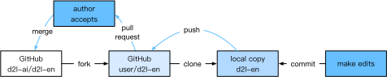
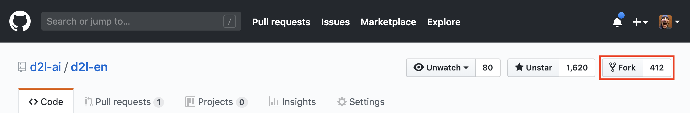
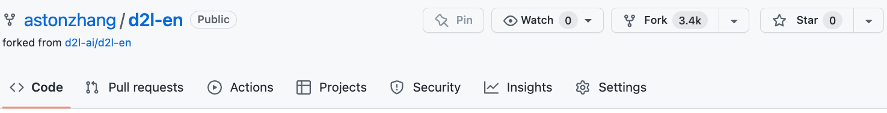
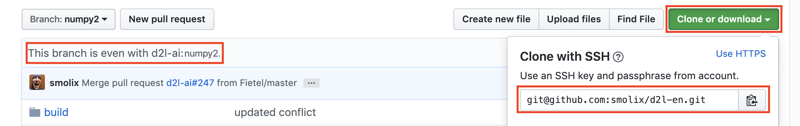
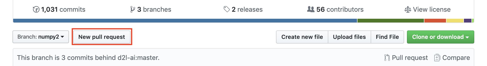
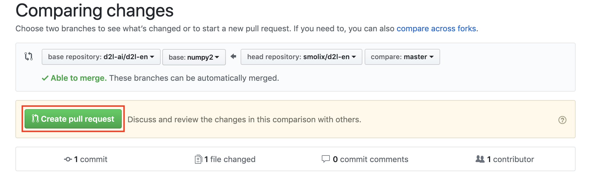

# Contributing to This Book
:label:`sec_how_to_contribute`

Contributions by [readers](https://github.com/d2l-ai/d2l-en/graphs/contributors) help us improve this book. If you find a typo, an outdated link, something where you think we missed a citation, where the code does not look elegant or where an explanation is unclear, please contribute back and help us help our readers. While in regular books the delay between print runs (and thus between typo corrections) can be measured in years, it typically takes hours to days to incorporate an improvement in this book. This is all possible due to version control and continuous integration testing. To do so you need to install Git and submit a [pull request](https://github.com/d2l-ai/d2l-en/pulls) to the GitHub repository. When your pull request is merged into the code repository by the author, you will become a contributor. In a nutshell the process works as described in the diagram below.



## From Reader to Contributor in 6 Steps

We will walk you through the steps in detail. If you are already familiar with Git you can skip this section. For concreteness we assume that the contributor's user name is `smolix`.

### Install Git

The Git open source book describes [how to install Git](https://git-scm.com/book/zh/v2). This typically works via `apt install git` on Ubuntu Linux, by installing the Xcode developer tools on macOS, or by using GitHub's [desktop client](https://desktop.github.com). If you do not have a GitHub account, you need to sign up for one [4].

### Log in to GitHub

Enter the [address](https://github.com/d2l-ai/d2l-en/) of the book's code repository in your browser. Click on the `Fork` button in the red box at the top-right of the figure below, to make a copy of the repository of this book. This is now *your copy* and you can change it any way you want.


:width:`700px`

Now, the code repository of this book will be copied to your username, such as `smolix/d2l-en` shown at the top-left of the screenshot below.


:width:`700px`

### Clone the Repository

To clone the repository (i.e., to make a local copy) we need to get its repository address. The green button on the picture below displays this. Make sure that your local copy is up to date with the main repository if you decide to keep this fork around for longer. For now simply follow the instructions in :numref:`chap_installation` to get started. The main difference is that you are now downloading *your own fork* of the repository.


:width:`700px`

```
# Replace your_github_username with your GitHub username
git clone https://github.com/your_github_username/d2l-en.git
```


Please note we will need to contribute to the *numpy2* branch. Hence, we will need checkout `origin/numpy2` manually.

```
cd d2l-en
git checkout -b numpy2 origin/numpy2
git status
```


Now, we are at `numpy2` branch where nothing has been changed.

```
mylaptop:d2l-en smola$ git status
On branch numpy2
Your branch is up to date with 'origin/numpy2'.

nothing to commit, working tree clean
```


### Edit the Book and Push

Now it is time to edit the book. It is best to edit the notebooks in Jupyter following instructions in :numref:`sec_jupyter`. Make the changes and check that they are OK. Assume we have modified a typo in the file `~/d2l-en/chapter_appendix_tools/how-to-contribute.md`.
You can then check which files you have changed:

At this point Git will prompt that the `chapter_appendix_tools/how-to-contribute.md` file has been modified.

```
mylaptop:d2l-en smola$ git status
On branch numpy2
Your branch is up-to-date with 'origin/numpy2'.

Changes not staged for commit:
  (use "git add <file>..." to update what will be committed)
  (use "git checkout -- <file>..." to discard changes in working directory)

	modified:   chapter_appendix_tools/how-to-contribute.md
```


After confirming that this is what you want, execute the following command:

```
git add chapter_appendix_tools/how-to-contribute.md
git commit -m 'fix typo in git documentation'
git push
```


The changed code will then be in your personal fork of the repository. To request the addition of your change, you have to create a pull request for the official repository of the book.

### Pull Request

Go to your fork of the repository on GitHub and select "New pull request". This will open up a screen that shows you the changes between your edits and what is current in the main repository of the book.


:width:`700px`


### Submit Pull Request

Finally, submit a pull request. Make sure to describe the changes you have made in the pull request. This will make it easier for the authors to review it and to merge it with the book. Depending on the changes, this might get accepted right away, rejected, or more likely, you will get some feedback on the changes. Once you have incorporated them, you are good to go.


:width:`700px`

Your pull request will appear among the list of requests in the main repository. We will make every effort to process it quickly.

## Summary

* You can use GitHub to contribute to this book.
* Forking a repositoy is the first step to contributing, since it allows you to edit things locally and only contribute back once you are ready.
* Pull requests are how contributions are being bundled up. Try not to submit huge pull requests since this makes them hard to understand and incorporate. Better send several smaller ones.

## Exercises

1. Star and fork the `d2l-en` repository.
1. Find some code that needs improvement and submit a pull request.
1. Find a reference that we missed and submit a pull request.

## Scan the QR Code to [Discuss](https://discuss.mxnet.io/t/how-to-contribute-to-this-book/2401)


