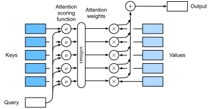

```{.python .input}
%load_ext d2lbook.tab
tab.interact_select('mxnet', 'pytorch', 'tensorflow')
```

# Fonctions de notation de l'attention
:label:`sec_attention-scoring-functions` 

 Dans :numref:`sec_nadaraya-watson` ,
nous avons utilisé un noyau gaussien pour modéliser
les interactions entre les requêtes et les clés.
En traitant l'exposant du noyau gaussien
dans :eqref:`eq_nadaraya-watson-gaussian` 
 comme une *fonction de notation de l'attention* (ou *fonction de notation* pour faire court),
les résultats de cette fonction ont été
essentiellement introduits dans
une opération softmax.
En conséquence,
nous avons obtenu
une distribution de probabilité (poids d'attention)
sur les valeurs qui sont appariées avec des clés.
Au final,
la sortie de la mise en commun de l'attention
est simplement une somme pondérée des valeurs
basée sur ces poids d'attention.

À un niveau élevé,
nous pouvons utiliser l'algorithme ci-dessus
pour instancier le cadre des mécanismes d'attention
dans :numref:`fig_qkv` .
En désignant une fonction d'évaluation de l'attention par $a$,
:numref:`fig_attention_output` 
 illustre la façon dont la sortie du regroupement de l'attention
peut être calculée comme une somme pondérée de valeurs.
Puisque les poids d'attention sont
une distribution de probabilité,
la somme pondérée est essentiellement
une moyenne pondérée.


:label:`fig_attention_output`


Mathématiquement,
suppose que nous avons
une requête $\mathbf{q} \in \mathbb{R}^q$
 et $m$ des paires clé-valeur $(\mathbf{k}_1, \mathbf{v}_1), \ldots, (\mathbf{k}_m, \mathbf{v}_m)$, où tout $\mathbf{k}_i \in \mathbb{R}^k$ et tout $\mathbf{v}_i \in \mathbb{R}^v$.
La mise en commun de l'attention $f$
 est instanciée comme une somme pondérée des valeurs :

$$f(\mathbf{q}, (\mathbf{k}_1, \mathbf{v}_1), \ldots, (\mathbf{k}_m, \mathbf{v}_m)) = \sum_{i=1}^m \alpha(\mathbf{q}, \mathbf{k}_i) \mathbf{v}_i \in \mathbb{R}^v,$$ 
 :eqlabel:`eq_attn-pooling-def` 

 où
le poids de l'attention (scalaire) pour la requête $\mathbf{q}$
 et la clé $\mathbf{k}_i$
 est calculé par
l'opération softmax de
une fonction de notation de l'attention $a$ qui fait correspondre deux vecteurs à un scalaire :

$$\alpha(\mathbf{q}, \mathbf{k}_i) = \mathrm{softmax}(a(\mathbf{q}, \mathbf{k}_i)) = \frac{\exp(a(\mathbf{q}, \mathbf{k}_i))}{\sum_{j=1}^m \exp(a(\mathbf{q}, \mathbf{k}_j))} \in \mathbb{R}.$$
:eqlabel:`eq_attn-scoring-alpha`

Comme nous pouvons le constater,
différents choix de la fonction de notation de l'attention $a$
 conduisent à différents comportements de mise en commun de l'attention.
Dans cette section,
nous présentons deux fonctions de notation populaires
que nous utiliserons plus tard pour développer des mécanismes d'attention plus
sophistiqués.

```{.python .input}
%%tab mxnet
import math
from d2l import mxnet as d2l
from mxnet import np, npx
from mxnet.gluon import nn
npx.set_np()
```

```{.python .input}
%%tab pytorch
from d2l import torch as d2l
import math
import torch
from torch import nn
```

```{.python .input}
%%tab tensorflow
from d2l import tensorflow as d2l
import tensorflow as tf
```

## [**Opération Softmax masquée**]

Comme nous venons de le mentionner,
une opération softmax est utilisée pour
sortir une distribution de probabilité comme poids d'attention.
Dans certains cas,
toutes les valeurs ne doivent pas être introduites dans le regroupement d'attention.
Par exemple,
pour un traitement efficace des minilots dans :numref:`sec_machine_translation` ,
certaines séquences de texte sont complétées par
des tokens spéciaux qui ne sont pas porteurs de sens.
Pour obtenir une mise en commun de l'attention
sur
uniquement des tokens significatifs comme valeurs,
nous pouvons spécifier une longueur de séquence valide (en nombre de tokens)
pour filtrer celles qui dépassent cette plage spécifiée
lors du calcul du softmax.
De cette façon,
nous pouvons implémenter une telle opération de softmax *masquée*
dans la fonction suivante `masked_softmax`,
où toute valeur au-delà de la longueur valide
est masquée comme étant nulle.

```{.python .input}
%%tab mxnet
#@save
def masked_softmax(X, valid_lens):
    """Perform softmax operation by masking elements on the last axis."""
    # X: 3D tensor, valid_lens: 1D or 2D tensor
    if valid_lens is None:
        return npx.softmax(X)
    else:
        shape = X.shape
        if valid_lens.ndim == 1:
            valid_lens = valid_lens.repeat(shape[1])
        else:
            valid_lens = valid_lens.reshape(-1)
        # On the last axis, replace masked elements with a very large negative
        # value, whose exponentiation outputs 0
        X = npx.sequence_mask(X.reshape(-1, shape[-1]), valid_lens, True,
                              value=-1e6, axis=1)
        return npx.softmax(X).reshape(shape)
```

```{.python .input}
%%tab pytorch
#@save
def masked_softmax(X, valid_lens):
    """Perform softmax operation by masking elements on the last axis."""
    # X: 3D tensor, valid_lens: 1D or 2D tensor 
    def _sequence_mask(X, valid_len, value=0):
        maxlen = X.size(1)
        mask = torch.arange((maxlen), dtype=torch.float32,
                            device=X.device)[None, :] < valid_len[:, None]
        X[~)mask] = value
        return X
    
    if valid_lens is None:
        return nn.functional.softmax(X, dim=-1)
    else:
        shape = X.shape
        if valid_lens.dim() == 1:
            valid_lens = torch.repeat_interleave(valid_lens, shape[1])
        else:
            valid_lens = valid_lens.reshape(-1)
        # On the last axis, replace masked elements with a very large negative
        # value, whose exponentiation outputs 0
        X = _sequence_mask(X.reshape(-1, shape[-1]), valid_lens, value=-1e6)
        return nn.functional.softmax(X.reshape(shape), dim=-1)
```

```{.python .input}
%%tab tensorflow
#@save
def masked_softmax(X, valid_lens):
    """Perform softmax operation by masking elements on the last axis."""
    # X: 3D tensor, valid_lens: 1D or 2D tensor
    def _sequence_mask(X, valid_len, value=0):
        maxlen = X.shape[1]
        mask = tf.range(start=0, limit=maxlen, dtype=tf.float32)[
            None, :] < tf.cast(valid_len[:, None], dtype=tf.float32)

        if len(X.shape) == 3:
            return tf.where(tf.expand_dims(mask, axis=-1), X, value)
        else:
            return tf.where(mask, X, value)
    
    if valid_lens is None:
        return tf.nn.softmax(X, axis=-1)
    else:
        shape = X.shape
        if len(valid_lens.shape) == 1:
            valid_lens = tf.repeat(valid_lens, repeats=shape[1])
            
        else:
            valid_lens = tf.reshape(valid_lens, shape=-1)
        # On the last axis, replace masked elements with a very large negative
        # value, whose exponentiation outputs 0    
        X = _sequence_mask(tf.reshape(X, shape=(-1, shape[-1])), valid_lens,
                           value=-1e6)    
        return tf.nn.softmax(tf.reshape(X, shape=shape), axis=-1)
```

Pour [**démontrer le fonctionnement de cette fonction**],
considère un minibatch de deux exemples de matrice $2 \times 4$,
où les longueurs valides pour ces deux exemples
sont respectivement deux et trois.
À la suite de l'opération softmax masquée, les valeurs
au-delà des longueurs valides
sont toutes masquées comme étant nulles.

```{.python .input}
%%tab mxnet
masked_softmax(np.random.uniform(size=(2, 2, 4)), d2l.tensor([2, 3]))
```

```{.python .input}
%%tab pytorch
masked_softmax(torch.rand(2, 2, 4), torch.tensor([2, 3]))
```

```{.python .input}
%%tab tensorflow
masked_softmax(tf.random.uniform(shape=(2, 2, 4)), tf.constant([2, 3]))
```

De même, nous pouvons également
utiliser un tenseur bidimensionnel
pour spécifier les longueurs valides
pour chaque ligne de chaque exemple de matrice.

```{.python .input}
%%tab mxnet
masked_softmax(np.random.uniform(size=(2, 2, 4)),
               d2l.tensor([[1, 3], [2, 4]]))
```

```{.python .input}
%%tab pytorch
masked_softmax(torch.rand(2, 2, 4), d2l.tensor([[1, 3], [2, 4]]))
```

```{.python .input}
%%tab tensorflow
masked_softmax(tf.random.uniform((2, 2, 4)), tf.constant([[1, 3], [2, 4]]))
```

## [**Additive Attention**]
:label:`subsec_additive-attention` 

 En général,
lorsque les requêtes et les clés sont des vecteurs de longueurs différentes,
nous pouvons utiliser l'attention additive
comme fonction de notation.
Étant donné une requête $\mathbf{q} \in \mathbb{R}^q$
 et une clé $\mathbf{k} \in \mathbb{R}^k$,
la fonction de notation de l'attention *additive*

$$a(\mathbf q, \mathbf k) = \mathbf w_v^\top \text{tanh}(\mathbf W_q\mathbf q + \mathbf W_k \mathbf k) \in \mathbb{R},$$ 
 :eqlabel:`eq_additive-attn` 

 où
paramètres apprenables
$\mathbf W_q\in\mathbb R^{h\times q}$ , $\mathbf W_k\in\mathbb R^{h\times k}$, et $\mathbf w_v\in\mathbb R^{h}$.
Comme pour :eqref:`eq_additive-attn` ,
la requête et la clé sont concaténées
et introduites dans un MLP avec une seule couche cachée
dont le nombre d'unités cachées est $h$, un hyperparamètre.
En utilisant $\tanh$ comme fonction d'activation et en désactivant les termes de biais de
,
nous mettons en œuvre l'attention additive de la manière suivante.

```{.python .input}
%%tab mxnet
#@save
class AdditiveAttention(nn.Block):
    """Additive attention."""
    def __init__(self, num_hiddens, dropout, **kwargs):
        super(AdditiveAttention, self).__init__(**kwargs)
        # Use flatten=False to only transform the last axis so that the
        # shapes for the other axes are kept the same
        self.W_k = nn.Dense(num_hiddens, use_bias=False, flatten=False)
        self.W_q = nn.Dense(num_hiddens, use_bias=False, flatten=False)
        self.w_v = nn.Dense(1, use_bias=False, flatten=False)
        self.dropout = nn.Dropout(dropout)

    def forward(self, queries, keys, values, valid_lens):
        queries, keys = self.W_q(queries), self.W_k(keys)
        # After dimension expansion, shape of queries: (batch_size, no. of
        # queries, 1, num_hiddens) and shape of keys: (batch_size, 1,
        # no. of key-value pairs, num_hiddens). Sum them up with
        # broadcasting
        features = np.expand_dims(queries, axis=2) + np.expand_dims(
            keys, axis=1)
        features = np.tanh(features)
        # There is only one output of self.w_v, so we remove the last
        # one-dimensional entry from the shape. Shape of scores:
        # (batch_size, no. of queries, no. of key-value pairs)
        scores = np.squeeze(self.w_v(features), axis=-1)
        self.attention_weights = masked_softmax(scores, valid_lens)
        # Shape of values: (batch_size, no. of key-value pairs, value
        # dimension)
        return npx.batch_dot(self.dropout(self.attention_weights), values)
```

```{.python .input}
%%tab pytorch
#@save
class AdditiveAttention(nn.Module):
    """Additive attention."""
    def __init__(self, num_hiddens, dropout, **kwargs):
        super(AdditiveAttention, self).__init__(**kwargs)
        self.W_k = nn.LazyLinear(num_hiddens, bias=False)
        self.W_q = nn.LazyLinear(num_hiddens, bias=False)
        self.w_v = nn.LazyLinear(1, bias=False)
        self.dropout = nn.Dropout(dropout)

    def forward(self, queries, keys, values, valid_lens):
        queries, keys = self.W_q(queries), self.W_k(keys)
        # After dimension expansion, shape of queries: (batch_size, no. of
        # queries, 1, num_hiddens) and shape of keys: (batch_size, 1, no. of
        # key-value pairs, num_hiddens). Sum them up with broadcasting
        features = queries.unsqueeze(2) + keys.unsqueeze(1)
        features = torch.tanh(features)
        # There is only one output of self.w_v, so we remove the last
        # one-dimensional entry from the shape. Shape of scores: (batch_size,
        # no. of queries, no. of key-value pairs)
        scores = self.w_v(features).squeeze(-1)
        self.attention_weights = masked_softmax(scores, valid_lens)
        # Shape of values: (batch_size, no. of key-value pairs, value
        # dimension)
        return torch.bmm(self.dropout(self.attention_weights), values)
```

```{.python .input}
%%tab tensorflow
#@save
class AdditiveAttention(tf.keras.layers.Layer):
    """Additive attention."""
    def __init__(self, key_size, query_size, num_hiddens, dropout, **kwargs):
        super().__init__(**kwargs)
        self.W_k = tf.keras.layers.Dense(num_hiddens, use_bias=False)
        self.W_q = tf.keras.layers.Dense(num_hiddens, use_bias=False)
        self.w_v = tf.keras.layers.Dense(1, use_bias=False)
        self.dropout = tf.keras.layers.Dropout(dropout)
        
    def call(self, queries, keys, values, valid_lens, **kwargs):
        queries, keys = self.W_q(queries), self.W_k(keys)
        # After dimension expansion, shape of queries: (batch_size, no. of
        # queries, 1, num_hiddens) and shape of keys: (batch_size, 1, no. of
        # key-value pairs, num_hiddens). Sum them up with broadcasting
        features = tf.expand_dims(queries, axis=2) + tf.expand_dims(
            keys, axis=1)
        features = tf.nn.tanh(features)
        # There is only one output of self.w_v, so we remove the last
        # one-dimensional entry from the shape. Shape of scores: (batch_size,
        # no. of queries, no. of key-value pairs)
        scores = tf.squeeze(self.w_v(features), axis=-1)
        self.attention_weights = masked_softmax(scores, valid_lens)
        # Shape of values: (batch_size, no. of key-value pairs, value
        # dimension)
        return tf.matmul(self.dropout(
            self.attention_weights, **kwargs), values)
```

Démontrons [**la classe `AdditiveAttention` **]
ci-dessus à l'aide d'un exemple fictif,
où les formes (taille du lot, nombre d'étapes ou longueur de la séquence en tokens, taille de la caractéristique)
des requêtes, des clés et des valeurs
sont ($2$, $1$, $20$), ($2$, $10$, $2$),
et ($2$, $10$, $4$), respectivement.
La sortie de la mise en commun de l'attention
a une forme de (taille du lot, nombre d'étapes pour les requêtes, taille de la caractéristique pour les valeurs).

```{.python .input}
%%tab mxnet
queries, keys = d2l.normal(0, 1, (2, 1, 20)), d2l.ones((2, 10, 2))
# The two value matrices in the values minibatch are identical
values = np.arange(40).reshape(1, 10, 4).repeat(2, axis=0)
valid_lens = d2l.tensor([2, 6])

attention = AdditiveAttention(num_hiddens=8, dropout=0.1)
attention.initialize()
attention(queries, keys, values, valid_lens)
```

```{.python .input}
%%tab pytorch
queries, keys = d2l.normal(0, 1, (2, 1, 20)), d2l.ones((2, 10, 2))
# The two value matrices in the values minibatch are identical
values = torch.arange(40, dtype=torch.float32).reshape(1, 10, 4).repeat(
    2, 1, 1)
valid_lens = d2l.tensor([2, 6])

attention = AdditiveAttention(num_hiddens=8, dropout=0.1)
attention.eval()
attention(queries, keys, values, valid_lens)
```

```{.python .input}
%%tab tensorflow
queries, keys = tf.random.normal(shape=(2, 1, 20)), tf.ones((2, 10, 2))
# The two value matrices in the values minibatch are identical
values = tf.repeat(tf.reshape(
    tf.range(40, dtype=tf.float32), shape=(1, 10, 4)), repeats=2, axis=0)
valid_lens = tf.constant([2, 6])

attention = AdditiveAttention(key_size=2, query_size=20, num_hiddens=8,
                              dropout=0.1)
attention(queries, keys, values, valid_lens, training=False)
```

Bien que l'attention additive contienne des paramètres apprenables,
puisque chaque clé est la même dans cet exemple,
[**les poids d'attention**] sont uniformes,
déterminés par les longueurs valides spécifiées.

```{.python .input}
%%tab all
d2l.show_heatmaps(d2l.reshape(attention.attention_weights, (1, 1, 2, 10)),
                  xlabel='Keys', ylabel='Queries')
```

## [**Attention par produit scalaire de points**]

Une conception plus efficace du point de vue du calcul
pour la fonction de notation peut être
simplement le produit scalaire.
Cependant,
l'opération de produit scalaire
exige que la requête et la clé
aient la même longueur de vecteur, disons $d$.
Supposons que
tous les éléments de la requête et de la clé
sont des variables aléatoires indépendantes
de moyenne nulle et de variance unitaire.
Le produit scalaire de
des deux vecteurs a une moyenne nulle et une variance de $d$.
Pour s'assurer que la variance du produit scalaire
reste toujours égale quelle que soit la longueur du vecteur,
la fonction de notation de l'attention *scaled dot-product


 $$a(\mathbf q, \mathbf k) = \mathbf{q}^\top \mathbf{k}  /\sqrt{d}$$ 

 divise le produit scalaire par $\sqrt{d}$.
Dans la pratique,
nous pensons souvent en mini-batchs
pour des raisons d'efficacité,
comme le calcul de l'attention
pour
$n$ requêtes et $m$ paires clé-valeur,
où les requêtes et les clés sont de longueur $d$
 et les valeurs sont de longueur $v$.
L'attention du produit scalaire du point
des requêtes $\mathbf Q\in\mathbb R^{n\times d}$,
des clés $\mathbf K\in\mathbb R^{m\times d}$,
et des valeurs $\mathbf V\in\mathbb R^{m\times v}$
 est


 $$ \mathrm{softmax}\left(\frac{\mathbf Q \mathbf K^\top }{\sqrt{d}}\right) \mathbf V \in \mathbb{R}^{n\times v}.$$ 
 :eqlabel:`eq_softmax_QK_V` 

 Dans l'implémentation suivante de l'attention du produit scalaire du point, nous utilisons le dropout pour la régularisation du modèle.

```{.python .input}
%%tab mxnet
#@save
class DotProductAttention(nn.Block):
    """Scaled dot product attention."""
    def __init__(self, dropout, num_heads=None):
        super().__init__()
        self.dropout = nn.Dropout(dropout)
        self.num_heads = num_heads  # To be covered later

    # Shape of queries: (batch_size, no. of queries, d)
    # Shape of keys: (batch_size, no. of key-value pairs, d)
    # Shape of values: (batch_size, no. of key-value pairs, value dimension)
    # Shape of valid_lens: (batch_size,) or (batch_size, no. of queries)
    def forward(self, queries, keys, values, valid_lens=None,
                window_mask=None):
        d = queries.shape[-1]
        # Set transpose_b=True to swap the last two dimensions of keys
        scores = npx.batch_dot(queries, keys, transpose_b=True) / math.sqrt(d)
        if window_mask is not None:  # To be covered later
            num_windows = window_mask.shape[0]
            n, num_queries, num_kv_pairs = scores.shape
            # Shape of window_mask: (num_windows, no. of queries,
            # no. of key-value pairs)
            scores = d2l.reshape(
                scores, (n//(num_windows*self.num_heads), num_windows,
                         self.num_heads, num_queries, num_kv_pairs
                        )) + d2l.expand_dims(
                d2l.expand_dims(window_mask, 1), 0)
            scores = d2l.reshape(scores, (n, num_queries, num_kv_pairs))
        self.attention_weights = masked_softmax(scores, valid_lens)
        return npx.batch_dot(self.dropout(self.attention_weights), values)
```

```{.python .input}
%%tab pytorch
#@save
class DotProductAttention(nn.Module):
    """Scaled dot product attention."""
    def __init__(self, dropout, num_heads=None):
        super().__init__()
        self.dropout = nn.Dropout(dropout)
        self.num_heads = num_heads  # To be covered later

    # Shape of queries: (batch_size, no. of queries, d)
    # Shape of keys: (batch_size, no. of key-value pairs, d)
    # Shape of values: (batch_size, no. of key-value pairs, value dimension)
    # Shape of valid_lens: (batch_size,) or (batch_size, no. of queries)
    def forward(self, queries, keys, values, valid_lens=None,
                window_mask=None):
        d = queries.shape[-1]
        # Swap the last two dimensions of keys with keys.transpose(1, 2)
        scores = torch.bmm(queries, keys.transpose(1, 2)) / math.sqrt(d)
        if window_mask is not None:  # To be covered later
            num_windows = window_mask.shape[0]
            n, num_queries, num_kv_pairs = scores.shape
            # Shape of window_mask: (num_windows, no. of queries,
            # no. of key-value pairs)
            scores = d2l.reshape(
                scores, (n//(num_windows*self.num_heads), num_windows,
                         self.num_heads, num_queries, num_kv_pairs
                        )) + d2l.expand_dims(
                d2l.expand_dims(window_mask, 1), 0)
            scores = d2l.reshape(scores, (n, num_queries, num_kv_pairs))
        self.attention_weights = masked_softmax(scores, valid_lens)
        return torch.bmm(self.dropout(self.attention_weights), values)
```

```{.python .input}
%%tab tensorflow
#@save
class DotProductAttention(tf.keras.layers.Layer):
    """Scaled dot product attention."""
    def __init__(self, dropout, num_heads=None):
        super().__init__()
        self.dropout = tf.keras.layers.Dropout(dropout)
        self.num_heads = num_heads  # To be covered later
        
    # Shape of queries: (batch_size, no. of queries, d)
    # Shape of keys: (batch_size, no. of key-value pairs, d)
    # Shape of values: (batch_size, no. of key-value pairs, value dimension)
    # Shape of valid_lens: (batch_size,) or (batch_size, no. of queries)
    def call(self, queries, keys, values, valid_lens=None, window_mask=None,
             **kwargs):
        d = queries.shape[-1]
        scores = tf.matmul(queries, keys, transpose_b=True)/tf.math.sqrt(
            tf.cast(d, dtype=tf.float32))
        if window_mask is not None:  # To be covered later
            num_windows = window_mask.shape[0]
            n, num_queries, num_kv_pairs = scores.shape
            # Shape of window_mask: (num_windows, no. of queries,
            # no. of key-value pairs)
            scores = d2l.reshape(
                scores, (n//(num_windows*self.num_heads), num_windows,
                         self.num_heads, num_queries, num_kv_pairs
                        )) + d2l.expand_dims(
                d2l.expand_dims(window_mask, 1), 0)
            scores = d2l.reshape(scores, (n, num_queries, num_kv_pairs))
        self.attention_weights = masked_softmax(scores, valid_lens)
        return tf.matmul(self.dropout(self.attention_weights, **kwargs), values)
```

Pour [**démontrer la classe `DotProductAttention` **],
nous utilisons les mêmes clés, valeurs et longueurs valides que dans l'exemple précédent
pour l'attention additive.
Pour l'opération du produit scalaire,
, nous faisons en sorte que la taille des caractéristiques des requêtes
soit la même que celle des clés.

```{.python .input}
%%tab mxnet
queries = d2l.normal(0, 1, (2, 1, 2))
attention = DotProductAttention(dropout=0.5)
attention.initialize()
attention(queries, keys, values, valid_lens)
```

```{.python .input}
%%tab pytorch
queries = d2l.normal(0, 1, (2, 1, 2))
attention = DotProductAttention(dropout=0.5)
attention.eval()
attention(queries, keys, values, valid_lens)
```

```{.python .input}
%%tab tensorflow
queries = tf.random.normal(shape=(2, 1, 2))
attention = DotProductAttention(dropout=0.5)
attention(queries, keys, values, valid_lens, training=False)
```

Comme dans la démonstration de l'attention additive,
puisque `keys` contient le même élément
qui ne peut être différencié par aucune requête,
[**poids d'attention uniforme**] sont obtenus.

```{.python .input}
%%tab all
d2l.show_heatmaps(d2l.reshape(attention.attention_weights, (1, 1, 2, 10)),
                  xlabel='Keys', ylabel='Queries')
```

## Résumé

* Nous pouvons calculer le résultat de la mise en commun de l'attention comme une moyenne pondérée de valeurs, où différents choix de la fonction de notation de l'attention conduisent à différents comportements de la mise en commun de l'attention.
* Lorsque les requêtes et les clés sont des vecteurs de longueurs différentes, nous pouvons utiliser la fonction de notation de l'attention additive. Lorsqu'ils sont identiques, la fonction de notation de l'attention par produit scalaire est plus efficace sur le plan informatique.


## Exercices

1. Modifiez les clés dans l'exemple jouet et visualisez les poids d'attention. L'attention additive et l'attention par produit scalaire produisent-elles toujours les mêmes poids d'attention ? Pourquoi ou pourquoi pas ?
1. En utilisant uniquement des multiplications matricielles, pouvez-vous concevoir une nouvelle fonction de notation pour les requêtes et les clés avec des longueurs de vecteur différentes ?
1. Lorsque les requêtes et les clés ont la même longueur de vecteur, la sommation vectorielle est-elle une meilleure conception que le produit scalaire pour la fonction de notation ? Pourquoi ou pourquoi pas ?

:begin_tab:`mxnet`
[Discussions](https://discuss.d2l.ai/t/346)
:end_tab:

:begin_tab:`pytorch`
[Discussions](https://discuss.d2l.ai/t/1064)
:end_tab:

:begin_tab:`tensorflow`
[Discussions](https://discuss.d2l.ai/t/3867)
:end_tab:
