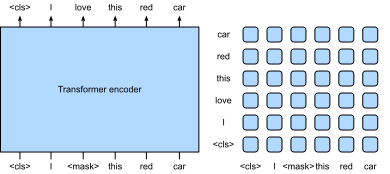
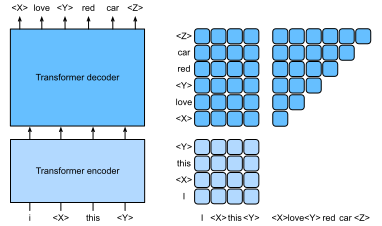
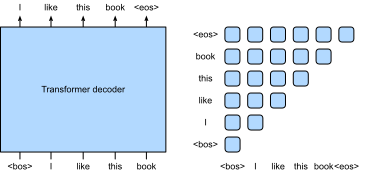
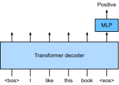

# Large-Scale Pretraining with Transformers
:label:`sec_large-pretraining-transformers`

So far in our image classification and machine translation experiments, models were trained on datasets with input-output examples *from scratch* to perform specific tasks. For example, a transformer was trained with English-French pairs (:numref:`sec_transformer`) so that this model can translate input English text into French. As a result, each model becomes a *specific expert* that is sensitive to even slight shift in data distribution (:numref:`sec_environment-and-distribution-shift`). 
For better generalized models, or even more competent *generalists* that can perform multiple tasks with or without adaptation, *pretraining* models on large data (especially unlabeled) has been pervasive. 

Given large data for pretraining, the transformer architecture has shown superior scalability :cite:`kaplan2020scaling,tay2021scale`. This is also evidenced by the significantly boosted performance from larger vision transformers trained on larger data (discussed in :numref:`sec_vision-transformer`). When pretraining a single transformer on modalities as diverse as text, images, joint torques, and button presses, a recent *generalist* model Gato can play Atari, caption images, chat, and act as a robot :cite:`reed2022generalist`. Notably, all such multi-modal data is serialized into a flat sequence of tokens, which can be processed by transformers.

With extensive use and compelling success of pretraining transformers, this final section of the chapter will discuss different mode of transformers and its scalability in pretraining. Since transformers were originally designed for text, the following discussion leans slightly towards text, and is adaptable to serialized input tokens (such as in Gato) from other modalities.

## Encoder-Only

* ViT is encoder-only, a sequence of image patches, a cls token is inspired by BERT.
* BERT encodes a text sequence.
* Encoder predicts mask.

:label:`fig_bert-encoder-only`

* Mask from original text. Advantage: self-supervised
* Self-supervised enables large-scale training
* Large-scale training generalizes well before downstream.
* When using for downstream, fine tune. Explain how with classification example:

:label:`fig_bert-finetune-classification`

* Fine-tuning produces SOTA
* BERT has other objective like next sentence prediction, but found not useful in followups. There are other followups.

BERT

<!--
BERT :cite:`Devlin.Chang.Lee.ea.2018`
-->

BERT variants:

<!--
XLNET :cite:`yang2019xlnet`
RoBERTa :cite:`liu2019roberta`
ALBERT :cite:`lan2019albert`
SpanBERT :cite:`joshi2020spanbert`
DistilBERT :cite:`sanh2019distilbert`
ELECTRA :cite:`clark2019electra`
-->

## Encoder-Decoder

* Although BERT covers many tasks, it's not universal, especially for generation.
* As another pretrain-finetune, so T5 casts every text problem as a "text-to-text" problem. Explain how T5 can be used once pretrained.
* To enable sequence generation, it adopts encoder-decoder

:label:`fig_t5-encoder-decoder`

* To pretrain, use span corruption objective to reconstruct masked span.
* Same as BERT, self-supervised learning. Different: on C4
* When using for downstream, fine tune. Explain how with news summarization.

:label:`fig_t5-finetune-summarization`

* T5 achieves SOTA.

* Concurrently work BART encodes then decodes. However when fine-tuning, it needs additional encoder. T5 is used in Switch transformer, LaMDA, Imagen.

T5

<!--
BART :cite:`lewis2019bart`
T5 :cite:`raffel2020exploring`
Switch Transformer :cite:`fedus2022switch`
-->

## Decoder-Only 

* Fine-tuning is bad: need downstream data, computationally expensive for gradient update.
* GPT-2 demonstrates zero-shot possibility, GPT-3 shows few-shot. No gradient update.
* Let's start with GPT.

### GPT

* GPT is a transformer decoder LM. 
* Recall LM
* How to use transformer decoder for LM:

:label:`fig_gpt-decoder-only`
* To pretrain, use LM, same as before: self-supervised learning.
* When using for downstream, fine tune. Explain how with classification.

:label:`fig_gpt-finetune-classification`

* Note that GPT inspired BERT. To demonstrate more benefits of decoder-only scheme, they train on larger data, leading to GPT-2.

### GPT-2

* GPT, BERT, T5 use fine-tuning. It can be bad
* GPT-2 considers multitask learning and zero-shot
* So more data is needed
* GPT-2's architectural difference
* GPT-2's pretraining and finetuning
* GPT-2's SOTA on zero-shot LM. Explain zero-shot with summarization TL;DR, but non-LM zero-shot performance is not so good.

### GPT-3

* GPT-2 also evalutes few-shot on machine translation, poor perf.
* GPT-3 explores zero-shot, few-shot, one-shot

:label:`fig_gpt-3-xshot`

* Kaplan's scaling law suggests bigger model with more data
* GPT-3 is bigger, trains on more data
* GPT-3's architectural difference, sparse transformer
* GPT-3's SOTA perf.
* Cool demos of GPT-3.
* summarize training compute, param size of BERT, T5, GPT. Similar to Table D.1 of GPT-3 paper.

:Pretraining BERT, T5, and GPT-3 at multiple 

|Model|Parameters| Data (training tokens)|
|:--|:-|:-|
|GPT|100M | | 
|BERT-Base|109M |250B | 
|BERT-Large|355M  |250B |
|GPT-2|1.5B | |
|T5-Base|220M  |1000B |
|T5-Large| 770M  |1000B | 
|T5-11B|11B  |1000B | 
|GPT-3|175B  |300B |
:label:`tab_bert-t5-gpt-scale`

<!--
GPT-1 :cite:`Radford.Narasimhan.Salimans.ea.2018`
GPT-2 :cite:`Radford.Wu.Child.ea.2019`
GPT-3 :cite:`brown2020language`
-->

<!--
Sparse transformer :cite:`child2019generating`
-->

## Scaling Up

### Scaling Laws

<!--
Scaling laws for neural LM :cite:`kaplan2020scaling`
Scaling laws for transfer :cite:`hernandez2021scaling`
Scale efficiently :cite:`tay2021scale`
-->

### Larger Models 

<!--
GLaM :cite:`du2021glam`
Gopher :cite:`rae2021scaling`
Megatron-Turing NLG 530B :cite:`smith2022using`

LaMDA :cite:`thoppilan2022lamda`
Chinchilla :cite:`hoffmann2022training`
Gopher :cite:`zhang2022opt`
PaLM :cite:`chowdhery2022palm`
-->

Emergent Abilities

<!--
Emergent Abilities :cite:`wei2022emergent`
-->

## Discussions

Swin Transformer

<!--
Swin Transformer :cite:`liu2021swin`
-->

MAE

<!--
MAE :cite:`he2022masked`
-->

iGPT

<!--
iGPT :cite:`chen2020generative`
-->

More Modalities

<!--
CLIP :cite:`radford2021learning`
DALL-E :cite:`ramesh2021zero`
DALL-E 2 :cite:`ramesh2022hierarchical`
Flamingo :cite:`alayrac2022flamingo`
Imagen :cite:`saharia2022photorealistic`
Generalist Agent :cite:`reed2022generalist`
-->

Scaling law by Gato: Figure 8 in Gato paper

## Exercises

[Discussions](https://discuss.d2l.ai/t/)

## References
