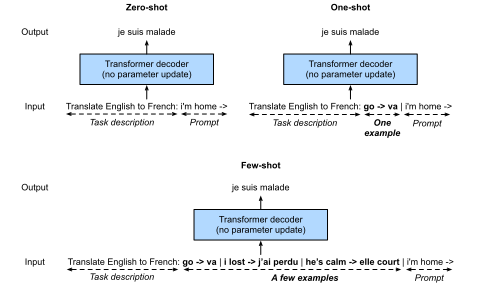

# Pré-entraînement à grande échelle avec des transformateurs
:label:`sec_large-pretraining-transformers` 

 Jusqu'à présent, dans nos expériences de classification d'images et de traduction automatique, les modèles ont été entraînés sur des ensembles de données avec des exemples d'entrée-sortie *à partir de zéro* pour effectuer des tâches spécifiques. Par exemple, un transformateur a été entraîné avec des paires anglais-français (:numref:`sec_transformer` ) afin que ce modèle puisse traduire un texte anglais en français. En conséquence, chaque modèle devient un expert *spécifique* qui est sensible au moindre changement dans la distribution des données (:numref:`sec_environment-and-distribution-shift` ). 
Pour obtenir des modèles mieux généralisés, ou même des *généralistes* plus compétents, capables d'effectuer plusieurs tâches avec ou sans adaptation, le *pré-entraînement* des modèles sur de grandes données est de plus en plus courant. 

Compte tenu de données plus importantes pour le pré-entraînement, l'architecture de transformateur est plus performante avec une taille de modèle et un calcul d'entraînement accrus, démontrant un comportement supérieur de mise à l'échelle *. Plus précisément, la performance des modèles de langage basés sur les transformateurs s'échelonne selon une loi de puissance avec la quantité de paramètres du modèle, de jetons d'entraînement et de calcul d'entraînement :cite:`kaplan2020scaling` . L'évolutivité des transformateurs est également mise en évidence par l'augmentation significative des performances des transformateurs de vision plus grands entraînés sur des données plus importantes (voir :numref:`sec_vision-transformer` ). Parmi les réussites plus récentes, citons Gato, un modèle *généraliste* capable de jouer à Atari, de légender des images, de discuter et d'agir comme un robot :cite:`reed2022generalist` . Gato est un transformateur unique qui s'adapte bien lorsqu'il est pré-entraîné sur diverses modalités, notamment du texte, des images, des couples d'articulations et des pressions sur des boutons. Notamment, toutes ces données multimodales sont sérialisées en une séquence plate de jetons, qui peuvent être traités par des transformateurs comme des jetons de texte (:numref:`sec_transformer` ) ou des patchs d'image (:numref:`sec_vision-transformer` ).

Avant le succès convaincant du pré-entraînement des transformateurs pour les données multimodales, les transformateurs étaient largement pré-entraînés avec une grande quantité de texte. Proposée à l'origine pour la traduction automatique, l'architecture du transformateur dans :numref:`fig_transformer` consiste en un codeur pour représenter les séquences d'entrée et un décodeur pour générer les séquences cibles. Principalement, les transformateurs peuvent être utilisés dans trois modes différents : *encodeur seulement*, *encodeur-décodeur*, et *décodeur seulement*. Pour conclure ce chapitre, nous allons passer en revue ces trois modes et expliquer l'évolutivité des transformateurs de pré-formation.

## Encodeur uniquement

Lorsque seul l'encodeur du transformateur est utilisé, une séquence de mots en entrée est convertie en autant de représentations qui peuvent être projetées en sortie (par exemple, la classification). Un codeur transformateur est constitué de couches d'auto-attention, où tous les jetons d'entrée s'attirent les uns les autres. 
Par exemple, les transformateurs de vision représentés sur le site :numref:`fig_vit` sont des encodeurs uniquement, convertissant une séquence de patchs d'image d'entrée en 
la représentation d'un jeton spécial "&lt;cls&gt;". 
Comme cette représentation dépend de tous les jetons d'entrée, elle est ensuite projetée en étiquettes de classification. Cette conception a été inspirée par un transformateur antérieur, uniquement encodeur, prétraîné sur du texte : BERT (Bidirectional Encoder Representations from Transformers) :cite:`Devlin.Chang.Lee.ea.2018` .

### Pré-entraînement de BERT

 
 :label:`fig_bert-encoder-only` 

 BERT est pré-entraîné sur des séquences de texte à l'aide de la *modélisation du langage masqué* : un texte d'entrée avec des tokens masqués de manière aléatoire est introduit dans un encodeur transformateur pour prédire les tokens masqués. Comme illustré sur :numref:`fig_bert-encoder-only` , une séquence de texte originale "I", "love", "this", "red", "car" est précédée du jeton "&lt;cls&gt;", et le jeton "&lt;mask&gt;" remplace aléatoirement "love" ; la perte d'entropie croisée entre le jeton masqué "love" et sa prédiction doit être minimisée pendant le pré-entraînement. Notez qu'il n'y a pas de contrainte dans le schéma d'attention des encodeurs transformateurs (à droite de :numref:`fig_bert-encoder-only` ), de sorte que tous les jetons peuvent s'occuper les uns des autres. Ainsi, la prédiction de "love" dépend des tokens d'entrée qui le précèdent et le suivent dans la séquence. C'est pourquoi BERT est un "codeur bidirectionnel". 
Sans avoir besoin d'étiquetage manuel, des données textuelles à grande échelle provenant de livres et de Wikipedia peuvent être utilisées pour le pré-entraînement de BERT. 

### Ajustement fin de BERT

Le BERT pré-entraîné peut être *ajusté finement* pour des tâches d'encodage en aval impliquant un seul texte ou des paires de textes. Pendant le réglage fin, des couches supplémentaires peuvent être ajoutées à BERT avec des paramètres aléatoires : ces paramètres et ceux de BERT prétraîné seront *mis à jour* pour s'adapter aux données d'entraînement des tâches en aval. 

 
 :label:`fig_bert-finetune-classification` 

 :numref:`fig_bert-finetune-classification` illustre le réglage fin de BERT pour l'analyse des sentiments. Le codeur transformateur est un BERT pré-entraîné, qui prend une séquence de texte en entrée et alimente la représentation "&lt;cls&gt;" (représentation globale de l'entrée) dans une couche supplémentaire entièrement connectée pour prédire le sentiment. Pendant le réglage fin, la perte d'entropie croisée entre la prédiction et l'étiquette sur les données d'analyse des sentiments est minimisée par des algorithmes basés sur le gradient, où la couche supplémentaire est formée à partir de zéro tandis que les paramètres pré-entraînés de BERT sont mis à jour.
BERT fait plus que de l'analyse de sentiments. Les représentations générales du langage apprises par le BERT à 350 millions de paramètres à partir de 250 milliards de tokens d'entraînement ont fait progresser l'état de l'art pour les tâches de langage naturel telles que la classification d'un seul texte, la classification ou la régression de paires de textes, le balisage de textes et la réponse aux questions.

Vous pouvez noter que ces tâches en aval incluent la compréhension de paires de textes. La préformation de BERT a une autre perte pour prédire si une phrase suit immédiatement l'autre. Cependant, cette perte s'est avérée inutile lors du préentraînement de RoBERTa, une variante de BERT de même taille, sur 2000 milliards de tokens :cite:`liu2019roberta` . D'autres dérivés de BERT ont amélioré les architectures de modèles ou les objectifs de pré-entraînement, tels que
ALBERT (qui impose le partage des paramètres) :cite:`lan2019albert` ,
SpanBERT (représentation et prédiction de portées de texte) :cite:`joshi2020spanbert` ,
DistilBERT (allègement par distillation des connaissances) :cite:`sanh2019distilbert` ,
et
ELECTRA (détection de tokens remplacés) :cite:`clark2019electra` .
De plus, BERT a inspiré le pré-entraînement de transformateurs en vision par ordinateur, comme les transformateurs de vision
:cite:`Dosovitskiy.Beyer.Kolesnikov.ea.2021` , les transformateurs de Swin :cite:`liu2021swin` , et les MAE (autoencodeurs masqués) `he2022masked`.

## Encodeur-décodeur

Étant donné qu'un encodeur transformateur convertit une séquence de mots d'entrée en un même nombre de représentations de sortie, le mode encodeur seul ne peut pas générer une séquence de longueur arbitraire comme dans la traduction automatique. Proposée à l'origine pour la traduction automatique, l'architecture du transformateur comporte également un décodeur qui prédit de manière autorégressive la séquence cible de longueur arbitraire, token par token, en fonction de la sortie du codeur et de la sortie du décodeur :
(i) pour le conditionnement de la sortie de l'encodeur, l'attention croisée de l'encodeur et du décodeur (attention multi-têtes du décodeur sur :numref:`fig_transformer` ) permet aux tokens cibles d'assister à *tous* les tokens d'entrée ;
(ii) le conditionnement de la sortie du décodeur est réalisé par un modèle d'attention *causale* (attention multi-têtes masquée du décodeur dans :numref:`fig_transformer` ), où tout jeton cible ne peut assister qu'aux jetons *passés* et *présents* dans la séquence cible.

Pour prétraîner les transformateurs codeur-décodeur au-delà des données de traduction automatique étiquetées par l'homme, BART :cite:`lewis2019bart` et T5 :cite:`raffel2020exploring` sont deux transformateurs codeur-décodeur proposés simultanément et prétraités sur des corpus de textes à grande échelle. Tous deux tentent de reconstruire le texte original dans leurs objectifs de pré-entraînement,
tandis que le premier met l'accent sur les entrées bruyantes (par exemple, masquage, suppression, permutation et rotation) et le second sur l'unification multitâche avec des études d'ablation complètes. 

### Pré-entraînement T5

 Comme exemple de transformateur-encodeur pré-entraîné, T5 (Transformateur de transfert de texte à texte) unifie de nombreuses tâches comme le même problème de texte à texte : pour toute tâche, l'entrée de l'encodeur est une description de tâche (par ex, "Summarize", " :") suivie d'une entrée de tâche (par exemple, une séquence de tokens d'un article), et le décodeur prédit la sortie de la tâche (par exemple, une séquence de tokens résumant l'article d'entrée). Pour fonctionner en tant que texte à texte, T5 est entraîné à générer un certain texte cible conditionnel au texte d'entrée. 

![Left: Pretraining T5 by predicting consecutive spans. The original sentence is "I", "love", "this", "red", "car", where "love" is replaced by a special “&lt;X&gt;” token, and consecutive "red", "car" are replaced by a special “&lt;Y&gt;” token. The target sequence ends with a special “&lt;Z&gt;” token. Right: Attention pattern in the transformer encoder-decoder. In the encoder self-attention (lower square) dans l'attention croisée codeur-décodeur (rectangle supérieur), chaque jeton cible est attentif à tous les jetons d'entrée ; dans l'auto-attention du décodeur (triangle supérieur), chaque jeton cible est attentif uniquement aux jetons cibles présents et passés (causal).](../img/t5-encoder-decoder.svg)
:label:`fig_t5-encoder-decoder` 

 Pour obtenir l'entrée et la sortie de n'importe quel texte original, T5 est pré-entraîné à prédire des espaces consécutifs. Plus précisément, les tokens du texte sont remplacés de manière aléatoire par des tokens spéciaux où chaque span consécutif est remplacé par le même token spécial. Prenons l'exemple de
:numref:`fig_t5-encoder-decoder` , où le texte original est " I ", " love ", " this ", " red ", " car ". Les jetons "amour", "rouge", "voiture" sont remplacés au hasard par des jetons spéciaux. Puisque "rouge" et "voiture" sont consécutifs, ils sont remplacés par le même jeton spécial. En conséquence, la séquence d'entrée est "I", "&lt;X&gt;", "this", "&lt;Y&gt;", et la séquence cible est "&lt;X&gt;", "love", "&lt;Y&gt;", "red", "car", "&lt;Z&gt;", où "&lt;Z&gt;" est un autre jeton spécial marquant la fin. Comme le montre le site :numref:`fig_t5-encoder-decoder` , le décodeur dispose d'un schéma d'attention causale pour s'empêcher de s'occuper des jetons futurs pendant la prédiction de la séquence. 

Dans le T5, la prédiction de l'empan consécutif est également appelée reconstruction du texte corrompu. Dans cet objectif, T5 est pré-entraîné avec 1000 milliards de tokens provenant des données C4 (Colossal Clean Crawled Corpus), qui consiste en un texte anglais propre provenant du Web :cite:`raffel2020exploring` .

### Ajustement fin de T5

Comme pour BERT, T5 doit être ajusté (mise à jour des paramètres de T5) sur des données d'entraînement spécifiques à la tâche afin de réaliser cette tâche. Les principales différences par rapport au réglage fin de BERT sont les suivantes : (i) l'entrée de T5 comprend des descriptions de tâches ; (ii) T5 peut générer des séquences de longueur arbitraire avec son décodeur transformateur ; (iii) aucune couche supplémentaire n'est nécessaire. 

 
 :label:`fig_t5-finetune-summarization` 

 :numref:`fig_t5-finetune-summarization` explique le réglage fin de T5 en utilisant le résumé de texte comme exemple. Dans cette tâche en aval, les tokens de description de tâche "Summarize", " :" suivis des tokens d'article sont entrés dans l'encodeur. 

Après un réglage fin, le T5 (T5-11B), qui compte 11 milliards de paramètres, a obtenu des résultats à la pointe de la technologie dans de nombreux tests d'encodage (par exemple, la classification) et de génération (par exemple, le résumé). Depuis sa sortie, le T5 a été largement utilisé dans des recherches ultérieures. Par exemple, des transformateurs de commutation sont conçus sur la base de T5 pour activer un sous-ensemble de paramètres pour une meilleure efficacité de calcul :cite:`fedus2022switch` . Dans un modèle de conversion texte-image appelé Imagen, le texte
est entré dans un codeur T5 gelé (T5-XXL) avec 4,6 milliards de paramètres :cite:`saharia2022photorealistic` . Les exemples photoréalistes de conversion texte-image présentés sur :numref:`fig_imagen` suggèrent que le codeur T5 seul peut représenter efficacement le texte, même sans réglage fin.

:width:`700px` 
 :label:`fig_imagen` 

 
 ## Décodeur seul 

 Nous avons examiné les transformateurs codeur seul et codeur-décodeur. Les transformateurs de décodeur uniquement suppriment l'ensemble du codeur et la sous-couche de décodeur avec l'attention croisée codeur-décodeur de l'architecture originale codeur-décodeur décrite dans :numref:`fig_transformer` . Aujourd'hui, les transformateurs de décodeur seul sont devenus l'architecture de facto de la modélisation du langage à grande échelle (:numref:`sec_language-model` ), qui exploite les abondants corpus de textes non étiquetés du monde entier par le biais de l'apprentissage auto-supervisé.

### GPT et GPT-2

En utilisant la modélisation du langage comme objectif de formation, le modèle GPT (préformation générative) choisit un décodeur de transformateur comme épine dorsale :cite:`Radford.Narasimhan.Salimans.ea.2018` . 

:label:`fig_gpt-decoder-only` 

 Après l'entraînement du modèle linguistique autorégressif décrit dans :numref:`subsec_partitioning-seqs` , :numref:`fig_gpt-decoder-only` illustre le pré-entraînement GPT avec un codeur transformateur, où la séquence cible est la séquence d'entrée décalée d'un token. Notez que le modèle d'attention *causal* dans le décodeur transformateur impose que chaque token ne puisse s'occuper que de ses tokens passés (la prédiction token par token ne peut pas s'occuper des tokens futurs). 

GPT a 100 millions de paramètres et doit être réglé avec précision pour les tâches individuelles en aval. Un modèle de langage transformateur-décodeur beaucoup plus grand, GPT-2, a été introduit un an plus tard :cite:`Radford.Wu.Child.ea.2019` . Par rapport au décodeur transformateur original de GPT, GPT-2 a adopté une prénormalisation (abordée dans :numref:`subsec_vit-encoder` ) ainsi qu'une initialisation et une mise à l'échelle des poids améliorées. 
Préentraîné sur 40 Go de texte, le GPT-2 de 1,5 milliard de paramètres
a obtenu des résultats de pointe sur des benchmarks de modélisation du langage et des résultats prometteurs sur de multiples autres tâches *sans mise à jour des paramètres ou de l'architecture*.

### GPT-3

GPT-2 a démontré la possibilité d'utiliser le même modèle de langage pour de multiples tâches sans mettre à jour le modèle. Cette méthode est plus efficace sur le plan informatique que le réglage fin, qui nécessite des mises à jour du modèle via le calcul du gradient.

 
:label:`fig_gpt-3-xshot` 

 Avant d'expliquer l'utilisation plus efficace sur le plan informatique des modèles de langage sans mise à jour des paramètres, rappelons :numref:`sec_rnn-scratch` qu'un modèle de langage peut être entraîné à générer une séquence de texte conditionnelle à une séquence de texte préfixe. Ainsi, un modèle de langage pré-entraîné peut générer la sortie de la tâche sous la forme d'une séquence * sans mise à jour des paramètres *, conditionnée par une séquence d'entrée contenant la description de la tâche, des exemples d'entrée-sortie spécifiques à la tâche et une invite (entrée de la tâche). Ce paradigme d'apprentissage peut être subdivisé en *zero-shot*, *one-shot* et *few-shot*, lorsqu'il n'y a pas, un ou quelques exemples d'entrée-sortie spécifiques à la tâche, respectivement (:numref:`fig_gpt-3-xshot` ).

:width:`400px` 
 :label:`fig_gpt3-xshot-scaling` 

 Ces trois paramètres ont été testés dans GPT-3 :cite:`brown2020language` , dont la plus grande version utilise des données et un modèle de taille environ deux ordres de grandeur supérieurs à ceux de GPT-2. GPT-3 utilise la même architecture de décodeur transformateur que son prédécesseur direct, GPT-2, sauf que les modèles d'attention (à droite sur :numref:`fig_gpt-decoder-only` ) sont plus épars dans les couches alternées. Pré-entraîné avec 300 milliards de tokens, le GPT-3 est plus performant avec une taille de modèle plus importante, où la performance des "few-shots" augmente le plus rapidement (:numref:`fig_gpt3-xshot-scaling` ). Bien que bénéficiant d'une efficacité de calcul, l'apprentissage few-shot de GPT-3 est moins performant que les modèles de pointe à réglage fin qui nécessitent des mises à jour du modèle. Néanmoins, GPT-3 a alimenté un large éventail d'applications en aval [across the Web](https://gpt3demo.com/): il générait 4,5 milliards de mots par jour environ neuf mois après son lancement [API](https://openai.com/api/).

## Scalability

:numref:`fig_gpt3-xshot-scaling` démontre empiriquement la scalabilité des transformateurs dans le modèle de langage GPT-3. Pour la modélisation du langage, des études empiriques plus complètes sur l'évolutivité des transformateurs ont suggéré d'entraîner des transformateurs plus grands avec plus de données et de calculer :cite:`kaplan2020scaling` 

:width:`700px` 
 :label:`fig_scaling-power-law3` 

 Comme le montre :numref:`fig_scaling-power-law3` , on peut observer une mise à l'échelle précise * en fonction de la taille du modèle (nombre de paramètres, à l'exclusion des couches d'intégration), de la taille de l'ensemble de données (nombre de jetons d'entraînement) et de la quantité de calculs d'entraînement (PetaFLOP/jours, à l'exclusion des couches d'intégration). En général, l'augmentation de ces trois facteurs en tandem conduit à de meilleures performances. Cependant, *comment* les augmenter en tandem reste un sujet de débat :cite:`hoffmann2022training` .

:width:`700px` 
 :label:`fig_scaling-sample-conv` 

 Outre l'amélioration des performances, les grands modèles bénéficient également d'une meilleure efficacité d'échantillonnage que les petits modèles. :numref:`fig_scaling-sample-conv` montre que les grands modèles ont besoin de moins d'échantillons d'entraînement (tokens traités) pour atteindre le même niveau de performance que les petits modèles, et que les performances sont mises à l'échelle de façon régulière avec le calcul. 

 
:width:`400px` 
 :label:`fig_scaling-gpt3` 

 
 Les comportements empiriques de mise à l'échelle dans :cite:`kaplan2020scaling` ont été testés dans des modèles de grands transformateurs ultérieurs. Par exemple, GPT-3 a confirmé cette hypothèse avec deux ordres de grandeur supplémentaires dans :numref:`fig_scaling-gpt3` .

L'évolutivité des transformateurs de la série GPT a inspiré les modèles de langage de transformation ultérieurs. Alors que le décodeur de transformateurs de GPT-3 a été largement suivi dans OPT (Open Pretrained Transformers) :cite:`zhang2022opt` en utilisant seulement 1/7e de l'empreinte carbone du premier, le décodeur de transformateurs de GPT-2 a été utilisé pour entraîner le NLG Megatron-Turing de 530 milliards de paramètres :cite:`smith2022using` avec 270 milliards de tokens d'entraînement. En suivant la conception GPT-2, le Gopher :cite:`rae2021scaling` de 280 milliards de paramètres, prétraité avec 300 milliards de jetons, a atteint des performances de pointe sur la majorité des tâches, sur environ 150 tâches différentes. Héritant de la même architecture et utilisant le même budget de calcul que Gopher, Chinchilla :cite:`hoffmann2022training` est un modèle nettement plus petit (70 milliards de paramètres) qui s'entraîne beaucoup plus longtemps (1,4 trillion de tokens d'entraînement), surpassant Gopher dans de nombreuses tâches. Pour poursuivre la mise à l'échelle de la modélisation du langage, PaLM (Pathway Language Model) :cite:`chowdhery2022palm` , un décodeur de transformateur de 540 milliards de paramètres avec des conceptions modifiées pré-entraînées sur 780 milliards de tokens, a dépassé les performances humaines moyennes sur le benchmark BIG-Bench :cite:`srivastava2022beyond` .

## Résumé et discussions

Les transformateurs ont été pré-entraînés en tant que codeur seulement (par exemple, BERT), codeur-décodeur (par exemple, T5) et décodeur seulement (par exemple, série GPT). Les modèles pré-entraînés peuvent être adaptés pour effectuer différentes tâches avec une mise à jour du modèle (par exemple, un réglage fin) ou non (par exemple, quelques tirs). L'évolutivité des transformateurs suggère que de meilleures performances bénéficient de modèles plus grands, de plus de données d'entraînement et de plus de calcul d'entraînement. Puisque les transformateurs ont d'abord été conçus et entraînés pour des données textuelles, cette section se penche légèrement sur le traitement du langage naturel. Néanmoins, les modèles discutés ci-dessus peuvent souvent être trouvés dans des modèles plus récents à travers de multiples modalités. Par exemple, 
(i) Chinchilla :cite:`hoffmann2022training` a été étendu à Flamingo :cite:`alayrac2022flamingo` , un modèle de langage visuel pour l'apprentissage en peu de temps ;
(ii) GPT-2 :cite:`Radford.Wu.Child.ea.2019` et le transformateur de vision encodent le texte et les images dans CLIP (Contrastive Language-Image Pre-training) :cite:`radford2021learning` , dont les images et les textes intégrés ont été adoptés plus tard dans le système texte-image DALL-E 2 :cite:`ramesh2022hierarchical` . Bien qu'il n'y ait pas encore eu d'études systématiques sur l'évolutivité des transformateurs dans le cadre d'un pré-entraînement multimodal, un récent modèle texte-image entièrement transformateur, Parti :cite:`yu2022scaling` , montre un potentiel d'évolutivité entre les modalités :
un Parti plus grand est plus capable de générer des images de haute fidélité et de comprendre des textes riches en contenu (:numref:`fig_parti` ).

         ## Exercices 1. Est-il possible de régler finement T5 en utilisant un minilot composé de différentes tâches ? Pourquoi ou pourquoi pas ? Qu'en est-il pour GPT-2 ? 1. Étant donné un modèle de langage puissant, à quelles applications pouvez-vous penser ? 1. Supposons qu'on vous demande d'affiner un modèle de langage pour effectuer une classification de texte en ajoutant des couches supplémentaires. Où allez-vous les ajouter ? Pourquoi ? 1. Considérez les problèmes de séquence à séquence (par exemple, la traduction automatique) où la séquence d'entrée est toujours disponible pendant la prédiction de la séquence cible. Quelles pourraient être les limites de la modélisation avec des transformateurs de décodeur seulement ? Pourquoi ? :cite:`yu2022scaling`
:width:`700px`
:label:`fig_parti`

[Discussions](https://discuss.d2l.ai/t/9232)
