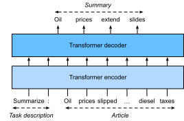

# Large-Scale Pretraining with Transformers
:label:`sec_large-pretraining-transformers`

So far in our image classification and machine translation experiments, models were trained on datasets with input-output examples *from scratch* to perform specific tasks. For example, a transformer was trained with English-French pairs (:numref:`sec_transformer`) so that this model can translate input English text into French. As a result, each model becomes a *specific expert* that is sensitive to even slight shift in data distribution (:numref:`sec_environment-and-distribution-shift`). 
For better generalized models, or even more competent *generalists* that can perform multiple tasks with or without adaptation, *pretraining* models on large data has been pervasive. 

Given larger data for pretraining, the transformer architecture performs better with an increased model size and training compute, demonstrating superior *scaling* behavior. Specifically, performance of transformer-based language models scales as a power-law with the amount of model parameters, training tokens, and training compute :cite:`kaplan2020scaling`. The scalability of transformers is also evidenced by the significantly boosted performance from larger vision transformers trained on larger data (discussed in :numref:`sec_vision-transformer`). More recent success stories include Gato, a *generalist* model that can play Atari, caption images, chat, and act as a robot :cite:`reed2022generalist`. Gato is a single  transformer that scales well when pretrained on diverse modalities including text, images, joint torques, and button presses. Notably, all such multi-modal data is serialized into a flat sequence of tokens, which can be processed akin to text tokens (:numref:`sec_transformer`) or image patches (:numref:`sec_vision-transformer`) by transformers.

Before compelling success of pretraining transformers for multi-modal data, transformers were extensively pretrained  with a wealth of text. Originally proposed for machine translation, the transformer architecture in :numref:`fig_transformer` consists of an encoder for representing input sequences and a decoder for generating target sequences. Primarily, transformers can be used in three different modes: *encoder-only*, *encoder-decoder*, and *decoder-only*. To conclude this chapter, we will review these three modes and explain the scalability in pretraining transformers.

```{.python .input}
# TOREMOVE
```

## Encoder-Only

When only the transformer encoder is used, a sequence of input tokens is converted into the same number of representations that can be further projected into output (e.g., classification). A transformer encoder consists of  self-attention layers, where all input tokens attend to each other. 
For example, vision transformers depicted in :numref:`fig_vit` are encoder-only, converting a sequence of input image patches into 
the representation of a special “&lt;cls&gt;” token. 
Since this representation depends on all input tokens, it is further projected into classification labels. This design was inspired by an earlier encoder-only  transformer pretrained on text: BERT (Bidirectional Encoder Representations from Transformers) :cite:`Devlin.Chang.Lee.ea.2018`.


### Pretraining BERT


:label:`fig_bert-encoder-only`

BERT is pretrained on text sequences using *masked language modeling*: input text with randomly masked tokens is fed into a transformer encoder to predict the masked tokens. As illustrated in :numref:`fig_bert-encoder-only`, an original text sequence "I", "love", "this", "red", "car" is prepended with the “&lt;cls&gt;” token and the “&lt;mask&gt;” token randomly replaces "love"; then the cross-entropy loss between the masked token "love" and its prediction is to be minimized during pretraining. Note that there is no constraint in the attention pattern of transformer encoders (right of :numref:`fig_bert-encoder-only`) so all tokens can attend to each other. Thus, prediction of "love" depends on input tokens before and after it in the sequence. This is why BERT is a "bidirectional encoder". 
Without need for manual labeling, large-scale text data from books and Wikipedia can be used for pretraining BERT. 


### Fine-Tuning BERT

After pretraining, BERT can be *fine-tuned* to downstream encoding tasks involving single text or text pairs. During fine-tuning, additional layers can be added to BERT with randomized parameters: these parameters and those pretrained BERT parameters will be *updated* to fit training data of downstream tasks. 


:label:`fig_bert-finetune-classification`

:numref:`fig_bert-finetune-classification` illustrates fine-tuning of BERT for sentiment analysis. The transformer encoder is a pretrained BERT, which takes a text sequence as input and feeds the “&lt;cls&gt;” representation (global representation of the input) into an additional MLP to predict the sentiment. During fine-tuning on a sentiment analysis dataset, MLP is trained from scratch while pretrained parameters of BERT are updated.
BERT does more than sentiment analysis. The general language representations learned by the 350-million-parameter BERT (BERT-Large) from 250 billion training tokens advanced the state of the art for natural language tasks such as single text classification, text pair classification or regression, text tagging, and question answering.

You may note that these downstream tasks include text pair understanding. BERT pretraining has another loss for predicting whether one sentence immediately follows the other. However, this loss was later found not useful when pretraining RoBERTa, a BERT variant of the same size, on much bigger text data with 2000 billion tokens :cite:`liu2019roberta`. Other derivatives of BERT improved model architectures or pretraining objectives, such as
ALBERT (enforcing parameter sharing) :cite:`lan2019albert`,
SpanBERT (representing and predicting spans of text) :cite:`joshi2020spanbert`,
DistilBERT (lightweight via knowledge distillation) :cite:`sanh2019distilbert`,
and
ELECTRA (replaced token detection) :cite:`clark2019electra`.

```{.python .input}
# TOREMOVE
```

## Encoder-Decoder

Since a transformer encoder converts a sequence of input tokens into the same number of output representations, the encoder-only mode cannot generate a sequence of arbitrary length like in machine translation. Originally proposed for machine translation, the transformer architecture also has a decoder that autoregressively predicts the target sequence of arbitrary length, token by token, conditional on both encoder output and decoder output. For conditioning on encoder output, encoder-decoder cross-attention (multi-head attention of decoder in :numref:`fig_transformer`) allows target tokens to attend to all input tokens.
However, conditioning on decoder output is achieved by a *causal* attention pattern (masked multi-head attention of decoder in :numref:`fig_transformer`): any target token can only attend to past and present tokens in the target sequence.

To pretrain encoder-decoder transformers beyond human-labeled machine translation data, BART :cite:`lewis2019bart` and T5 :cite:`raffel2020exploring` are two concurrent encoder-decoder transformers pretrained on large-scale text corpora. Both attempt to reconstruct original text in their pretraining objectives,
while the former emphasizes noising input (e.g., masking, deletion, permutation, and rotation) and the latter highlights multitask unification with comprehensive ablation studies. 


### Pretraining T5


As an example of the pretrained transformer encoder-decoder, T5 (Text-to-Text Transfer Transformer) unifies many tasks as the same text-to-text problem: for any task, the input of the encoder is a task description (e.g., "Summarize", ":") followed by task input (e.g., a sequence of tokens from an article), and the decoder predicts the task output (e.g., a sequence of tokens summarizing the input article). To perform as text-to-text, T5 is trained to generate some target text conditional on input text. 


![Left: Pretraining T5 by predicting consecutive spans. The original sentence is "I", "love", "this", "red", "car", where "love" is replaced by a special “&lt;X&gt;” token, and consecutive "red", "car" are replaced by a special “&lt;Y&gt;” token. The target sequence ends with a special “&lt;Z&gt;” token. Right: Attention pattern in the transformer encoder-decoder. In the encoder self-attention (lower square), input tokens attend to each other; In the encoder-decoder cross-attention (upper rectangle), each target token attends to all input tokens; In the decoder self-attention (upper triangle), each target token  attends to present and past target tokens only (causal).](../img/t5-encoder-decoder.svg)
:label:`fig_t5-encoder-decoder`

To obtain input and output from any original text, T5 is pretrained to predict consecutive spans. Specifically, tokens from text are randomly replaced by special tokens where each consecutive span is replaced by the same special token. Consider the example in
:numref:`fig_t5-encoder-decoder`, where the original text is "I", "love", "this", "red", "car". Tokens "love", "red", "car" are randomly replaced by special tokens. Since "red" and "car" are a consecutive span, they are replaced by the same special token. As a result, the input sequence is "I", "&lt;X&gt;", "this", "&lt;Y&gt;", and the target sequence is "&lt;X&gt;", "love", "&lt;Y&gt;", "red", "car", "&lt;Z&gt;", where "&lt;Z&gt;" is another special token marking the end. As shown in :numref:`fig_t5-encoder-decoder`, the decoder has a causal attention pattern to prevent itself from attending to future tokens during sequence prediction. 

In T5, predicting consecutive span is also referred to as reconstructing corrupted text. With this objective, T5 is pretrained on the C4 (Colossal Clean Crawled Corpus) data consisting of 1000 billion tokens of clean English text from the Web :cite:`raffel2020exploring`.

### Fine-Tuning T5

Similar to BERT, T5 needs to be fine-tuned (updating T5 parameters) on task-specific training data to perform this task. Major differences from BERT fine-tuning include: (i) T5 input includes task descriptions; (ii) T5 can generate sequences with arbitrary length with its transformer decoder; (iii) No additional layers are required. 


:label:`fig_t5-finetune-summarization`

:numref:`fig_t5-finetune-summarization` explains fine-tuning T5 using text summarization as an example. In this downstream task, the task description tokens "Summarize", ":" followed by the article tokens are input to the encoder. 

After fine-tuning, the 11-billion-parameter T5 (T5-11B) achieved state-of-the-art results on multiple encoding (e.g., classification) and generation (e.g., summarization) benchmarks. Since released, T5 has been extensively used in later research. For example, switch transformers are designed based off T5 to activate a subset of the parameters for better computational efficiency :cite:`fedus2022switch`. In a text-to-image model called Imagen,
text is input to a T5 encoder (T5-XXL) with 4.6 billion frozen parameters :cite:`saharia2022photorealistic`. The photorealistic text-to-image examples in :numref:`fig_imagen` suggest that the T5 encoder alone may effectively represent text even without fine-tuning.


:width:`700px`
:label:`fig_imagen`

```{.python .input}
# TOREMOVE
```

## Decoder-Only 


We have reviewed encoder-only and encoder-decoder transformers. Alternatively, decoder-only transformers remove the entire encoder and the decoder sublayer with the encoder-decoder cross-attention from the original encoder-decoder architecture depicted in :numref:`fig_transformer`. Nowadays, decoder-only transformers have been the de facto architecture in large-scale language modeling (:numref:`sec_language-model`), which leverages the world's abundant unlabeled text corpora via self-supervised learning.


### GPT and GPT-2

Using language modeling as the training objective, the GPT (generative pre-training) model chooses a transformer decoder as its backbone :cite:`Radford.Narasimhan.Salimans.ea.2018`. 


:label:`fig_gpt-decoder-only`

Following the autoregressive language model training as described in :numref:`subsec_partitioning-seqs`,  :numref:`fig_gpt-decoder-only` illustrates GPT pretraining with a transformer encoder, where the target sequence is the input sequence shifted by one token. Note that the causal attention pattern in the transformer decoder enforces the constraint that each token can only attend to its past tokens (token-by-token prediction cannot attend to future tokens). 


GPT has 100 million parameters and needs to be fine-tuned for individual downstream tasks. A much larger transformer-decoder language model, GPT-2, was introduced one year later :cite:`Radford.Wu.Child.ea.2019`. Compared with the original transformer decoder in GPT, pre-normalization (discussed in :numref:`subsec_vit-encoder`) and improved initialization and weight-scaling were adopted in GPT-2. 
Pretrained on 40 GB of text, the 1.5-billion-parameter
GPT-2 obtained the state-of-the-art results on language modeling benchmarks and promising results on multiple different tasks *without updating the parameters or architecture*.


### GPT-3

GPT-2 demonstrated potential of using the same language model for multiple tasks without updating the model. This is more computationally efficient than fine-tuning, which requires model updates with gradient computation.


:label:`fig_gpt-3-xshot`

To explain the more computationally efficient use of language models without parameter update, recall :numref:`sec_rnn-scratch` that a language model can be trained to generate a text sequence conditional on some prefix text sequence. Thus, a pretrained language model may generate the task output as a sequence *without parameter update*, conditional on an input sequence with the task description, task-specific input-output examples, and a prompt (task input). This learning paradigm can be further categorized into *zero-shot*, *one-shot*, and *few-shot*, when there is no, one, or a few task-specific input-output examples (:numref:`fig_gpt-3-xshot`).


:width:`400px`
:label:`fig_gpt3-xshot-scaling`

These three settings were tested in GPT-3 :cite:`brown2020language`, whose largest version uses data and model size about two orders of magnitude larger than those in GPT-2. GPT-3 uses the same transformer decoder architecture in its direct predecessor GPT-2 except that attention patterns (right of :numref:`fig_gpt-decoder-only`) are sparser at alternating layers. Pretrained on 300 billion tokens, GPT-3 performs better with larger model size, where few-shot performance increases most rapidly (:numref:`fig_gpt3-xshot-scaling`). Although enjoying computational efficiency, GPT-3 few-shot underperformed the state-of-the-art fine-tuned models that require model updates. Nonetheless, GPT-3 has powered a wide range of downstream applications [across the Web](https://gpt3demo.com/): it was generating 4.5 billions words every day around nine months of its [API](https://openai.com/api/) release.

```{.python .input}
# TOREMOVE
```

## Scaling Up


:numref:`fig_gpt-decoder-only` empirically demonstrates scalability of transformers in GPT-3.


:Pretraining BERT, T5, and GPT-3 at multiple 

|Model|Parameters| Data (training tokens)|
|:--|:-|:-|
|GPT|100M | | 
|BERT-Base|109M |250B | 
|BERT-Large|355M  |250B |
|GPT-2|1.5B | |
|T5-Base|220M  |1000B |
|T5-Large| 770M  |1000B | 
|T5-11B|11B  |1000B | 
|GPT-3|175B  |300B |
:label:`tab_bert-t5-gpt-scale`


### Scaling Laws

<!--
Scaling laws for neural LM :cite:`kaplan2020scaling`
Scaling laws for transfer :cite:`hernandez2021scaling`
Scale efficiently :cite:`tay2021scale`
-->


### Larger Models 


<!--
GLaM :cite:`du2021glam`
Gopher :cite:`rae2021scaling`
Megatron-Turing NLG 530B :cite:`smith2022using`

LaMDA :cite:`thoppilan2022lamda`
Chinchilla :cite:`hoffmann2022training`
Gopher :cite:`zhang2022opt`
PaLM :cite:`chowdhery2022palm`
-->


Emergent Abilities

<!--
Emergent Abilities :cite:`wei2022emergent`
-->


## Discussions

Swin Transformer

<!--
Swin Transformer :cite:`liu2021swin`
-->

MAE

<!--
MAE :cite:`he2022masked`
-->

iGPT

<!--
iGPT :cite:`chen2020generative`
-->


More Modalities

<!--
CLIP :cite:`radford2021learning`
DALL-E :cite:`ramesh2021zero`
DALL-E 2 :cite:`ramesh2022hierarchical`
Flamingo :cite:`alayrac2022flamingo`
Imagen :cite:`saharia2022photorealistic`
Generalist Agent :cite:`reed2022generalist`
-->

Scaling law by Gato: Figure 8 in Gato paper


:width:`700px`
:label:`fig_parti`

All of the components in Parti, including encoder, decoder, and image tokenizer, are based on transformers. A larger Parti model is more capable of high-fidelity image generation and content-rich text understanding.


## Exercises


[Discussions](https://discuss.d2l.ai/t/)


## References
