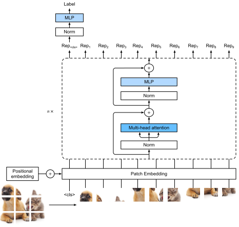

# Vision Transformer
:label:`sec_vision-transformer`

The transformer architecture was initially proposed for sequence to sequence learning, such as for machine translation. 
With excellent performance in accuracy,
transformers subsequently became the model of choice in various natural language processing tasks :cite:`Radford.Narasimhan.Salimans.ea.2018,Radford.Wu.Child.ea.2019,brown2020language,Devlin.Chang.Lee.ea.2018,raffel2020exploring`. 
However, 
in the field of computer vision
the dominant architecture
had been based on
CNNs (:numref:`chap_modern_cnn`).
*Can we apply transformers
to model image data*?


:cite:`ramachandran2019stand` proposed to replace convolution with self-attention. 
However, its use of specialized patterns in attention makes it hard to scale up models on hardware accelerators.
:cite:`cordonnier2020relationship` theoretically proved that self-attention can learn to behave similarly to convolution and showed empirical evidence by taking $2 \times 2$ patches from images as input, but the small patch size makes the model only applicable to small images.

:cite:`Dosovitskiy.Beyer.Kolesnikov.ea.2021` extracts patches (without constraints on patch size) from images and shows that ViT performs better when data is bigger, such as beating CNN-based SOTA at that time.


## Model



Describe ViT model. 


## Splitting an Image into Patches

How an image is split into patches.

```{.python .input  n=1}
from d2l import torch as d2l
import torch
from torch import nn
```

```{.python .input  n=2}
class PatchEmbedding(nn.Module):
    def __init__(self, img_size=96, patch_size=16, num_hiddens=512):
        super().__init__()
        def _make_tuple(x):
            if not isinstance(x, (list, tuple)):
                return (x, x)
            return x
        img_size, patch_size = _make_tuple(img_size), _make_tuple(patch_size)
        self.num_patches = (img_size[0] // patch_size[0]) * (
            img_size[1] // patch_size[1])
        self.conv = nn.LazyConv2d(num_hiddens, kernel_size=patch_size,
                                  stride=patch_size)

    def forward(self, X):
        # Output shape: (batch size, no. of patches, no. of channels)
        return self.conv(X).flatten(2).transpose(1, 2)
```

Check code output.

```{.python .input  n=9}
img_size, patch_size, num_hiddens, batch_size = 96, 16, 512, 4
patch_emb = PatchEmbedding(img_size, patch_size, num_hiddens)
X = d2l.randn(batch_size, 32, img_size, img_size)
d2l.check_shape(patch_emb(X),
                (batch_size, (img_size//patch_size)**2, num_hiddens))
```

## Transformer Encoder

MLP is slightly different from position-wise FFN in transformer.

```{.python .input}
class ViTMLP(nn.Module):
    def __init__(self, mlp_num_hiddens, mlp_num_outputs, dropout=0.5):
        super().__init__()
        self.dense1 = nn.LazyLinear(mlp_num_hiddens)
        self.gelu = nn.GELU()
        self.dropout1 = nn.Dropout(dropout)
        self.dense2 = nn.LazyLinear(mlp_num_outputs)
        self.dropout2 = nn.Dropout(dropout)

    def forward(self, x):
        return self.dropout2(self.dense2(self.dropout1(self.gelu(
            self.dense1(x)))))
```

Transformer encoder block is also different. For example, AddNorm becomes norm->X->Add.

```{.python .input}
class ViTBlock(nn.Module):
    def __init__(self, num_hiddens, norm_shape, mlp_num_hiddens, 
                 num_heads, dropout, use_bias=False):
        super().__init__()
        self.ln1 = nn.LayerNorm(norm_shape)
        self.attention = d2l.MultiHeadAttention(num_hiddens, num_heads, 
                                                dropout, use_bias)
        self.ln2 = nn.LayerNorm(norm_shape)
        self.mlp = ViTMLP(mlp_num_hiddens, num_hiddens, dropout)

    def forward(self, X, valid_lens=None):
        X = self.ln1(X)
        return X + self.mlp(self.ln2(
            X + self.attention(X, X, X, valid_lens)))
```

Check shape.

```{.python .input}
X = d2l.ones((2, 100, 24))
encoder_blk = ViTBlock(24, 24, 48, 8, 0.5)
encoder_blk.eval()
d2l.check_shape(encoder_blk(X), X.shape)
```

## Putting All Things Together

Describe forward pass.

```{.python .input}
class ViT(d2l.Classifier):
    """Vision transformer."""
    def __init__(self, img_size, patch_size, num_hiddens, mlp_num_hiddens,
                 num_heads, num_blks, emb_dropout, blk_dropout, lr=0.1,
                 use_bias=False, num_classes=10):
        super().__init__()
        self.save_hyperparameters()
        self.patch_embedding = PatchEmbedding(
            img_size, patch_size, num_hiddens)
        self.cls_token = nn.Parameter(d2l.zeros(1, 1, num_hiddens))
        num_steps = self.patch_embedding.num_patches + 1  # Add the cls token
        # Positional embeddings are learnable
        self.pos_embedding = nn.Parameter(
            torch.randn(1, num_steps, num_hiddens))
        self.dropout = nn.Dropout(emb_dropout)
        self.blks = nn.Sequential()
        for i in range(num_blks):
            self.blks.add_module(f"{i}", ViTBlock(
                num_hiddens, num_hiddens, mlp_num_hiddens,
                num_heads, blk_dropout, use_bias))
        self.head = nn.Sequential(nn.LayerNorm(num_hiddens),
                                  nn.Linear(num_hiddens, num_classes))

    def forward(self, X):
        X = self.patch_embedding(X)
        X = d2l.concat((self.cls_token.expand(X.shape[0], -1, -1), X), 1)
        X = self.dropout(X + self.pos_embedding)
        for blk in self.blks:
            X = blk(X)
        return self.head(X[:, 0])
```

## Training

As usual.

```{.python .input}
img_size, patch_size = 96, 16
num_hiddens, mlp_num_hiddens, num_heads, num_blks = 512, 2048, 8, 2
emb_dropout, blk_dropout, lr = 0.1, 0.1, 0.1
model = ViT(img_size, patch_size, num_hiddens, mlp_num_hiddens, num_heads,
            num_blks, emb_dropout, blk_dropout, lr)
trainer = d2l.Trainer(max_epochs=10, num_gpus=1)
data = d2l.FashionMNIST(batch_size=128, resize=(img_size, img_size))
trainer.fit(model, data)

```

## Summary and Discussion

ViT lacks inductive bias, hence performs modestly on ImageNet. However, scale trumps inductive bias. However, it only shows effective on image classification. Subsequent works such as Swin Transformer addresses this issue and makes transformer a general backbone in CV.
