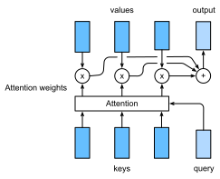

# Attention Mechanism
:label:`sec_attention`

In :numref:`sec_seq2seq`, we encode the source sequence input information in the recurrent unit state and then pass it to the decoder to generate the target sequence. A token in the target sequence may closely relate to one or more tokens in the source sequence, instead of the whole source sequence. For example, when translating "Hello world." to "Bonjour le monde.", "Bonjour" maps to "Hello" and "monde" maps to "world". In the seq2seq model, the decoder may implicitly select the corresponding information from the state passed by the encoder. The attention mechanism, however, makes this selection explicit.


*Attention* is a generalized pooling method with bias alignment over inputs. The core component in the attention mechanism is the attention layer, or called *attention* for simplicity. An input of the attention layer is called a *query*. For a query, attention returns an output based on the memory---a set of key-value pairs encoded in the attention layer. To be more specific, assume that the memory contains $n$ key-value pairs, $(\mathbf{k}_1, \mathbf{v}_1), \ldots, (\mathbf{k}_n, \mathbf{v}_n)$, with $\mathbf{k}_i \in \mathbb R^{d_k}$, $\mathbf{v}_i \in \mathbb R^{d_v}$. Given a query $\mathbf{q} \in \mathbb R^{d_q}$, the attention layer returns an output $\mathbf{o} \in \mathbb R^{d_v}$ with the same shape as the value.


:label:`fig_attention`


The full process of attention mechanism is expressed in :numref:`fig_attention_output`. To compute the output of attention, we first use a score function $\alpha$ that measures the similarity between the query and key. Then for each key $(\mathbf{k}_1, \mathbf{v}_1), \ldots, (\mathbf{k}_n, \mathbf{v}_n)$, we compute the scores $a_1, \ldots, a_n$ by

$$a_i = \alpha(\mathbf q, \mathbf k_i).$$

Next we use softmax to obtain the attention weights, i.e.,

$$\mathbf{b} = \mathrm{softmax}(\mathbf{a})\quad \text{, where }\quad
{b}_i = \frac{\exp(a_i)}{\sum_j \exp(a_j)}, \mathbf{b} = [b_1, \ldots, b_n]^T .$$


Finally, the output is a weighted sum of the values:

$$\mathbf o = \sum_{i=1}^n b_i \mathbf v_i.$$



:label:`fig_attention_output`


Different choices of the score function lead to different attention layers. Below, we introduce two commonly used attention layers. Before diving into the implementation, we first express two operators to get you up and running: a masked version of the softmax operator `masked_softmax` and a specialized dot operator `batched_dot`.

```{.python .input  n=1}
import math
from mxnet import np, npx
from mxnet.gluon import nn
npx.set_np()
```

The masked softmax takes a 3-dimensional input and enables us to filter out some elements by specifying a valid length for the last dimension. (Refer to
:numref:`sec_machine_translation` for the definition of a valid length.) As a result, any value outside the valid length will be masked as $0$. Let's implement the `masked_softmax` function.

```{.python .input  n=6}
# Saved in the d2l package for later use
def masked_softmax(X, valid_length):
    # X: 3-D tensor, valid_length: 1-D or 2-D tensor
    if valid_length is None:
        return npx.softmax(X)
    else:
        shape = X.shape
        if valid_length.ndim == 1:
            valid_length = valid_length.repeat(shape[1], axis=0)
        else:
            valid_length = valid_length.reshape(-1)
        # Fill masked elements with a large negative, whose exp is 0
        X = npx.sequence_mask(X.reshape(-1, shape[-1]), valid_length, True,
                              axis=1, value=-1e6)
        return npx.softmax(X).reshape(shape)
```

To illustrate how this function works, we construct two $2 \times 4$ matrices as the input. In addition, we specify that the valid length equals to 2 for the first example, and 3 for the second example. Then, as we can see from the following outputs, the values outside valid lengths are masked as zero.

```{.python .input  n=5}
masked_softmax(np.random.uniform(size=(2, 2, 4)), np.array([2, 3]))
```

Moreover, the second operator `batched_dot` takes two inputs $X$ and $Y$ with shapes $(b, n, m)$ and $(b, m, k)$, respectively, and returns an output with shape $(b, n, k)$. To be specific, it computes $b$ dot products for $i= \{1,\ldots, b\}$, i.e., 

$$Z[i,:,:] = X[i,:,:]  Y[i,:,:].$$

```{.python .input  n=4}
npx.batch_dot(np.ones((2, 1, 3)), np.ones((2, 3, 2)))
```

## Dot Product Attention

Equipped with the above two operators: `masked_softmax` and `batched_dot`, let's dive into the details of two widely used attentions layers. The first one is the *dot product attention*: it assumes that the query has the same dimension as the keys, namely $\mathbf q, \mathbf k_i \in\mathbb R^d$ for all $i$. The dot product attention computes the scores by an dot product between the query and a key, which is then divided by $\sqrt{d}$ to minimize the unrelated influence of the dimension $d$ on the scores. In other words,

$$\alpha(\mathbf q, \mathbf k) = \langle \mathbf q, \mathbf k \rangle /\sqrt{d}.$$

Beyond the single-dimensional queries and keys, we can always generalize them to multi-dimensional queries and keys. Assume that $\mathbf Q\in\mathbb R^{m\times d}$ contains $m$ queries and $\mathbf K\in\mathbb R^{n\times d}$ has all the $n$ keys. We can compute all $mn$ scores by

$$\alpha(\mathbf Q, \mathbf K) = \mathbf Q \mathbf K^\top /\sqrt{d}.$$
:eqlabel:`eq_alpha_QK`

With :eqref:`eq_alpha_QK`, we can implement the dot product attention layer `DotProductAttention` that supports a batch of queries and key-value pairs. In addition, for regularization we also use a dropout layer.

```{.python .input  n=5}
# Saved in the d2l package for later use
class DotProductAttention(nn.Block):
    def __init__(self, dropout, **kwargs):
        super(DotProductAttention, self).__init__(**kwargs)
        self.dropout = nn.Dropout(dropout)

    # query: (batch_size, #queries, d)
    # key: (batch_size, #kv_pairs, d)
    # value: (batch_size, #kv_pairs, dim_v)
    # valid_length: either (batch_size, ) or (batch_size, xx)
    def forward(self, query, key, value, valid_length=None):
        d = query.shape[-1]
        # Set transpose_b=True to swap the last two dimensions of key
        scores = npx.batch_dot(query, key, transpose_b=True) / math.sqrt(d)
        attention_weights = self.dropout(masked_softmax(scores, valid_length))
        return npx.batch_dot(attention_weights, value)
```

Let's test the class `DotProductAttention` in a toy example. 
First, create two batches, where each batch has one query and 10 key-value pairs.  
Via the `valid_length` argument,
we specify that we will check the first $2$ key-value pairs for the first batch and $6$ for the second one. Therefore, even though both batches have the same query and key-value pairs, we obtain different outputs.

```{.python .input  n=6}
atten = DotProductAttention(dropout=0.5)
atten.initialize()
keys = np.ones((2, 10, 2))
values = np.arange(40).reshape(1, 10, 4).repeat(2, axis=0)
atten(np.ones((2, 1, 2)), keys, values, np.array([2, 6]))
```

As we can see above, dot product attention simply multiplies the query and key together, and hopes to derive their similarities from there. Whereas, the query and key may not be of the same dimension.
To address such an issue,
we may resort to the multilayer perceptron attention.


## Multilayer Perceptron Attention

In *multilayer perceptron attention*, we project both query and keys into $\mathbb R^{h}$ by learnable weights parameters. 
Assume that the learnable weights are $\mathbf W_k\in\mathbb R^{h\times d_k}$, $\mathbf W_q\in\mathbb R^{h\times d_q}$, and $\mathbf v\in\mathbb R^{h}$. Then the score function is defined by

$$\alpha(\mathbf k, \mathbf q) = \mathbf v^\top \text{tanh}(\mathbf W_k \mathbf k + \mathbf W_q\mathbf q).$$

Intuitively, you can imagine $\mathbf W_k \mathbf k + \mathbf W_q\mathbf q$ as concatenating the key and value in the feature dimension and feeding them to a single hidden layer perceptron with hidden layer size $h$ and output layer size $1$. In this hidden layer, the activation function is $\tanh$ and no bias is applied. Now let's implement the multilayer perceptron attention.

```{.python .input  n=7}
# Saved in the d2l package for later use
class MLPAttention(nn.Block):  
    def __init__(self, units, dropout, **kwargs):
        super(MLPAttention, self).__init__(**kwargs)
        # Use flatten=True to keep query's and key's 3-D shapes
        self.W_k = nn.Dense(units, activation='tanh',
                            use_bias=False, flatten=False)
        self.W_q = nn.Dense(units, activation='tanh',
                            use_bias=False, flatten=False)
        self.v = nn.Dense(1, use_bias=False, flatten=False)
        self.dropout = nn.Dropout(dropout)

    def forward(self, query, key, value, valid_length):
        query, key = self.W_k(query), self.W_q(key)
        # Expand query to (batch_size, #querys, 1, units), and key to
        # (batch_size, 1, #kv_pairs, units). Then plus them with broadcast
        features = np.expand_dims(query, axis=2) + np.expand_dims(key, axis=1)
        scores = np.squeeze(self.v(features), axis=-1)
        attention_weights = self.dropout(masked_softmax(scores, valid_length))
        return npx.batch_dot(attention_weights, value)
```

To test the above `MLPAttention` class, we use the same inputs as in the previous toy example. As we can see below, despite `MLPAttention` containing an additional MLP model, we obtain the same outputs as for `DotProductAttention`.

```{.python .input  n=8}
atten = MLPAttention(units=8, dropout=0.1)
atten.initialize()
atten(np.ones((2, 1, 2)), keys, values, np.array([2, 6]))
```

## Summary

* An attention layer explicitly selects related information.
* An attention layer's memory consists of key-value pairs, so its output is close to the values whose keys are similar to the queries.
* Two commonly used attention models are dot product attention and multilayer perceptron attention.


## Exercises

* What are the advantages and disadvantages for dot product attention and multilayer perceptron attention, respectively?


## [Discussions](https://discuss.mxnet.io/t/attention/4343)


