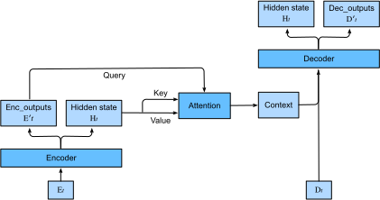

# Sequence to Sequence with Attention Mechanism

In this section, we add the attention mechanism to the sequence to sequence
model introduced in :numref:`chapter_seq2seq`
to explicitly select state. :numref:`fig_s2s_attention` shows the model
architecture for a decoding time step. As can be seen, the memory of the
attention layer consists of the encoder outputs of each time step. During
decoding, the decoder output from the previous time step is used as the query,
the attention output is then fed into the decoder with the input to provide
attentional context information.


:label:`fig_s2s_attention`

The layer structure in the encoder and the decoder is shown in :numref:`fig_s2s_attention_details`.


:label:`fig_s2s_attention_details`


```{.python .input  n=1}
import d2l
from mxnet import nd
from mxnet.gluon import rnn, nn
```

## Decoder

Now let's implement the decoder of this model. We add a MLP attention layer which has the same hidden size as the LSTM layer. The state passed from the encoder to the decoder contains three items:

- the encoder outputs of all time steps, which are used as the attention layer's memory with identical keys and values

- the hidden state of the last time step that is used to initialize the encoder's hidden state

- valid lengths of the decoder inputs so the attention layer will not consider encoder outputs for padding tokens.

In each time step of decoding, we use the output of the last RNN layer as the query for the attention layer. Its output is then concatenated with the input embedding vector to feed into the RNN layer. Despite the RNN layer hidden state also contains history information from decoder, the attention output explicitly selects the encoder outputs that are correlated to the query and suspends other non-correlated information.

```{.python .input  n=2}
class Seq2SeqAttentionDecoder(d2l.Decoder):
    def __init__(self, vocab_size, embed_size, num_hiddens, num_layers,
                 dropout=0, **kwargs):
        super(Seq2SeqAttentionDecoder, self).__init__(**kwargs)
        self.attention_cell = d2l.MLPAttention(num_hiddens, dropout)
        self.embedding = nn.Embedding(vocab_size, embed_size)
        self.rnn = rnn.LSTM(num_hiddens, num_layers, dropout=dropout)
        self.dense = nn.Dense(vocab_size, flatten=False)

    def init_state(self, enc_outputs, enc_valid_len, *args):
        outputs, hidden_state = enc_outputs
        # Transpose outputs to (batch_size, seq_len, hidden_size)
        return (outputs.swapaxes(0,1), hidden_state, enc_valid_len)

    def forward(self, X, state):
        enc_outputs, hidden_state, enc_valid_len = state
        X = self.embedding(X).swapaxes(0, 1)
        outputs = []
        for x in X:
            # query shape: (batch_size, 1, hidden_size)
            query = hidden_state[0][-1].expand_dims(axis=1)
            # context has same shape as query
            context = self.attention_cell(
                query, enc_outputs, enc_outputs, enc_valid_len)
            # concatenate on the feature dimension
            x = nd.concat(context, x.expand_dims(axis=1), dim=-1)
            # reshape x to (1, batch_size, embed_size+hidden_size)
            out, hidden_state = self.rnn(x.swapaxes(0, 1), hidden_state)
            outputs.append(out)
        outputs = self.dense(nd.concat(*outputs, dim=0))
        return outputs.swapaxes(0, 1), [enc_outputs, hidden_state,
                                        enc_valid_len]
```

Use the same hyper-parameters to create an encoder and decoder as in :numref:`chapter_seq2seq`, we get the same decoder output shape, but the state structure is changed.

```{.python .input  n=3}
encoder = d2l.Seq2SeqEncoder(vocab_size=10, embed_size=8,
                             num_hiddens=16, num_layers=2)
encoder.initialize()
decoder = Seq2SeqAttentionDecoder(vocab_size=10, embed_size=8,
                                  num_hiddens=16, num_layers=2)
decoder.initialize()
X = nd.zeros((4, 7))
state = decoder.init_state(encoder(X), None)
out, state = decoder(X, state)
out.shape, len(state), state[0].shape, len(state[1]), state[1][0].shape
```

## Training

Again, we use the same training hyper-parameters as in
:numref:`chapter_seq2seq`. The training loss is similar to the seq2seq model, because the
sequences in the training dataset are relative short. The additional attention
layer doesn't lead to a significant different. But due to both attention layer
computational overhead and we unroll the time steps in the decoder, this model
is much slower than the seq2seq model.

```{.python .input  n=5}
embed_size, num_hiddens, num_layers, dropout = 32, 32, 2, 0.0
batch_size, num_steps = 64, 10
lr, num_epochs, ctx = 0.005, 200, d2l.try_gpu()

src_vocab, tgt_vocab, train_iter = d2l.load_data_nmt(batch_size, num_steps)
encoder = d2l.Seq2SeqEncoder(
    len(src_vocab), embed_size, num_hiddens, num_layers, dropout)
decoder = Seq2SeqAttentionDecoder(
    len(tgt_vocab), embed_size, num_hiddens, num_layers, dropout)
model = d2l.EncoderDecoder(encoder, decoder)
d2l.train_s2s_ch8(model, train_iter, lr, num_epochs, ctx)
```

Lastly, we predict several sample examples.

```{.python .input  n=6}
for sentence in ['Go .', 'Wow !', "I'm OK .", 'I won !']:
    print(sentence + ' => ' + d2l.predict_s2s_ch8(
        model, sentence, src_vocab, tgt_vocab, num_steps, ctx))
```

## Summary

* Seq2seq with attention adds an additional attention layer to use encoder’s outputs as memory and its output is used as part of decoder’s input.
