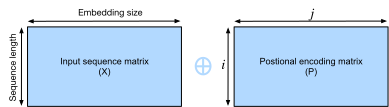

# Transformer
:label:`sec_transformer`


Until now, we have covered the three major neural network architectures: the convolution neural network (CNN), the recurrent neural network (RNN), and the attention mechanism. Before we dive into the Transformer architecture, let's quickly review the pros and cons for first two:

* **The convolution neural network (CNN)**: Easy to parallelize at a layer but cannot capture the nonfixed sequential dependency very well. 

* **The recurrent neural network (RNN)**: Able to capture the long-range, variable-length sequential information, however, suffer from inability to parallelize within a sequence.

To combine the advantages from both CNN and RNN, :cite:`Vaswani.Shazeer.Parmar.ea.2017` innovates a novel architecture with the attention mechanism that we just introduced in :numref:`sec_attention`. This architecture, which is called as the *Transformer*, achieves parallelization by capturing recurrence sequence with attention but at the same time encoding each item's position in the sequence. As a result, the Transformer leads to a compatible model with significantly shorter training time.


Similar to the seq2seq model in :numref:`sec_seq2seq`, the Transformer is also based on the encoder-decoder architecture. However, the Transformer differs to the former by replacing the
recurrent layers in seq2seq with *multi-head attention* layers, incorporating the position-wise information through *position encoding*, and applying *layer normalization*. 


Recall in :numref:`sec_seq2seq_attention`, we introduced Sequence to Sequence (seq2seq) with
attention model. To better visualize and compare the Transformer architecture with it, we draw them side-by-side in :numref:`fig_transformer`. These two models are similar to each other overall: the source sequence embeddings are fed into $n$ repeated blocks. The outputs of the last block are then used as attention memory for the decoder.  The target sequence embeddings is similarly fed into $n$ repeated blocks in the decoder, and the final outputs are obtained by applying a dense layer with vocabulary size to the last block's outputs.


:width:`500px`
:label:`fig_transformer`


On the flip side, the Transformer differs to the seq2seq with attention model in three major places:

1. **Transformer block**: a recurrent layer in seq2seq is replaced with a *Transformer block*. This block contains a *multi-head attention* layer and a network with two *position-wise feed-forward network* layers for the encoder. For the decoder, another multi-head attention layer is used to take the encoder state.
1. **Add and norm**: the inputs and outputs of both the multi-head attention layer or the position-wise feed-forward network, are processed by two "add and norm" layer that contains a residual structure and a *layer normalization* layer.
1. **Position encoding**: since the self-attention layer does not distinguish the item order in a sequence, a positional encoding layer is used to add sequential information into each sequence item.


In the rest of this section, we will equip you with each new component introduced by the Transformer, and get you up and running to construct a machine translation model.

```{.python .input  n=1}
import d2l
import math
from mxnet import autograd, np, npx
from mxnet.gluon import nn
npx.set_np()
```

## Multi-Head Attention

Before the discussion of the *multi-head attention* layer, let's quick express the *self-attention* architecture. The self-attention model is a normal attention model, with its query, its key, and its value are copied exactly same from each item of the sequential inputs. As we illustrate in :numref:`fig_self_attention`, self-attention outputs a same length sequential output for each input item. Compared to a recurrent layer, output items of a self-attention layer can be computed in parallel and, therefore, it is easy to obtain a high-efficient implementation.


:label:`fig_self_attention`


Based on the above, the *multi-head attention* layer consists of $h$ parallel self-attention layers, each one is called a *head*. For each head, before feeding into the attention layer, we project the queries, keys, and values with three dense layers with hidden sizes $p_q$, $p_k$, and $p_v$, respectively. The outputs of these $h$ attention heads are concatenated and then processed by a final dense layer.


To be more specific, assume that the dimension for a query, a key, and a value are $d_q$, $d_k$, and $d_v$, respectively. Then, for each head $i=1,\ldots, h$, we can train the learnable parameters 
$\mathbf W_q^{(i)}\in\mathbb R^{p_q\times d_q}$,
$\mathbf W_k^{(i)}\in\mathbb R^{p_k\times d_k}$,
and $\mathbf W_v^{(i)}\in\mathbb R^{p_v\times d_v}$. Therefore, the output for each head can be demonstrated by

$$\mathbf o^{(i)} = \textrm{attention}(\mathbf W_q^{(i)}\mathbf q, \mathbf W_k^{(i)}\mathbf k,\mathbf W_v^{(i)}\mathbf v),$$

where the $\text{attention}$ in the formula can be any attention layer, such as the `DotProductAttention` and `MLPAttention` as we introduced in :label:`sec_attention`. 


After that, the output with length $p_v$ from each of the $h$ attention heads are concatenated to be a length $h p_v$ output, which is then passed the final dense layer with $d_o$ hidden units. The weights of this dense layer can be denoted by $\mathbf W_o\in\mathbb R^{d_o\times h p_v}$. As a result, the multi-head attention output will be

$$\mathbf o = \mathbf W_o \begin{bmatrix}\mathbf o^{(1)}\\\vdots\\\mathbf o^{(h)}\end{bmatrix}.$$


Let's implement the multi-head attention in MXNet. Assume that the multi-head attention contain the number heads `num_heads` $=h$, the hidden size `hidden_size` $=p_q=p_k=p_v$ are the same for the query, the key, and the value dense layers. In addition, since the multi-head attention keeps the same dimensionality between its input and its output, we have the output feature size $d_o = $ `hidden_size` as well. 


<!--Note in practice, we often use $\frac{d_model}{h} = p_q=p_k=p_v$. To be more clear, for a higher computational efficiency, that is the final dense weights $\mathbf W_o\in\mathbb R^{d_o\times h p_v}$ is a square matrix.-->

```{.python .input  n=2}
class MultiHeadAttention(nn.Block):
    def __init__(self, hidden_size, num_heads, dropout, **kwargs):
        super(MultiHeadAttention, self).__init__(**kwargs)
        self.num_heads = num_heads
        self.attention = d2l.DotProductAttention(dropout)
        self.W_q = nn.Dense(hidden_size, use_bias=False, flatten=False)
        self.W_k = nn.Dense(hidden_size, use_bias=False, flatten=False)
        self.W_v = nn.Dense(hidden_size, use_bias=False, flatten=False)
        self.W_o = nn.Dense(hidden_size, use_bias=False, flatten=False)

    def forward(self, query, key, value, valid_length):
        # query, key, and value shape: (batch_size, seq_len, dim),
        # where seq_len is the length of input sequence
        # valid_length shape is either (batch_size, )
        # or (batch_size, seq_len).

        # Project and transpose query, key, and value from
        # (batch_size, seq_len, hidden_size * num_heads) to
        # (batch_size * num_heads, seq_len, hidden_size).
        query = transpose_qkv(self.W_q(query), self.num_heads)
        key = transpose_qkv(self.W_k(key), self.num_heads)
        value = transpose_qkv(self.W_v(value), self.num_heads)

        if valid_length is not None:
            # Copy valid_length by num_heads times
            if valid_length.ndim == 1:
                valid_length = np.tile(valid_length, self.num_heads)
            else:
                valid_length = np.tile(valid_length, (self.num_heads, 1))

        output = self.attention(query, key, value, valid_length)

        # Transpose from (batch_size * num_heads, seq_len, hidden_size) back
        # to (batch_size, seq_len, hidden_size * num_heads)
        output_concat = transpose_output(output, self.num_heads)
        return self.W_o(output_concat)
```

Here are the definitions of the transpose functions `transpose_qkv` and `transpose_output`, who are the inverse of each other.

```{.python .input  n=3}
def transpose_qkv(X, num_heads):
    # Original X shape: (batch_size, seq_len, hidden_size * num_heads),
    # -1 means inferring its value, after first reshape, X shape:
    # (batch_size, seq_len, num_heads, hidden_size)
    X = X.reshape(X.shape[0], X.shape[1], num_heads, -1)

    # After transpose, X shape: (batch_size, num_heads, seq_len, hidden_size)
    X = X.transpose(0, 2, 1, 3)

    # Merge the first two dimensions. Use reverse=True to infer shape from
    # right to left. 
    # output shape: (batch_size * num_heads, seq_len, hidden_size)
    output = X.reshape(-1, X.shape[2], X.shape[3])
    return output


def transpose_output(X, num_heads):
    # A reversed version of transpose_qkv
    X = X.reshape(-1, num_heads, X.shape[1], X.shape[2])
    X = X.transpose(0, 2, 1, 3)
    return X.reshape(X.shape[0], X.shape[1], -1)
```

Let's validate the `MultiHeadAttention` model in the a toy example. Create a multi-head attention with the hidden size $d_o = 100$, the output will share the same batch size and sequence length as the input, but the last dimension will be equal to the `hidden_size` $= 100$.

```{.python .input  n=4}
cell = MultiHeadAttention(100, 10, 0.5)
cell.initialize()
X = np.ones((2, 4, 5))
valid_length = np.array([2, 3])
cell(X, X, X, valid_length).shape
```

## Position-wise Feed-Forward Networks

Another critical component in the Transformer block is called *position-wise feed-forward network (FFN)*. It accepts a $3$ dimensional input with shape (batch size, sequence length, feature size). The position-wise FFN consists of two dense layers that applies to the last dimension. Since the same two dense layers are used for each position item in the sequence, we referred it to as *position-wise*. Indeed, it equals to apply two $Conv(1, 1)$, i.e., $1 \times 1$ convolution layers.

Below, the `PositionWiseFFN` shows how to implement a position-wise FFN with two dense layers of hidden size `ffn_hidden_size` and `hidden_size_out`, respectively.

```{.python .input  n=5}
class PositionWiseFFN(nn.Block):
    def __init__(self, ffn_hidden_size, hidden_size_out, **kwargs):
        super(PositionWiseFFN, self).__init__(**kwargs)
        self.ffn_1 = nn.Dense(ffn_hidden_size, flatten=False,
                              activation='relu')
        self.ffn_2 = nn.Dense(hidden_size_out, flatten=False)

    def forward(self, X):
        return self.ffn_2(self.ffn_1(X))
```

Similar to the multi-head attention, the position-wise feed-forward network will only change the last dimension size of the input---the feature dimension. In addition, if two items in the input sequence are identical, the according outputs will be identical as well. Let's try a toy model!

```{.python .input  n=6}
ffn = PositionWiseFFN(4, 8)
ffn.initialize()
ffn(np.ones((2, 3, 4)))[0]
```

## Add and Norm

Besides the above two components in the Transformer block, the "add and norm" within the block also play a core role to connect the inputs and outputs of other layers smoothly. To be more clear, we add a layer that contains a residual structure and a *layer normalization* after both the multi-head attention layer and the position-wise FFN network. *Layer normalization* is similar to the batch normalization as we discussed in :numref:`sec_batch_norm`. One difference is that the mean and variances for the layer normalization are calculated along the last dimension, e.g `X.mean(axis=-1)` instead of the first batch dimension, e.g., `X.mean(axis=0)`. Layer normalization prevents the range of values in the layers changing too much, which means that faster training and better generalization ability.

MXNet has both `LayerNorm` and `BatchNorm` implemented within the `nn` block. Let's call both of them and see the difference in the below example.

```{.python .input  n=7}
layer = nn.LayerNorm()
layer.initialize()
batch = nn.BatchNorm()
batch.initialize()
X = np.array([[1, 2], [2, 3]])
# Compute mean and variance from X in the training mode
with autograd.record():
    print('layer norm:', layer(X), '\nbatch norm:', batch(X))
```

Now let's implement the connection block `AddNorm` together. `AddNorm` accepts two inputs $X$ and $Y$. We can imagine $X$ as the original input in the residual network, while $Y$ as the outputs from either the multi-head attention layer or the position-wise FFN network. In addition, we apply dropout on $Y$ for the purpose of regularization.

```{.python .input  n=8}
class AddNorm(nn.Block):
    def __init__(self, dropout, **kwargs):
        super(AddNorm, self).__init__(**kwargs)
        self.dropout = nn.Dropout(dropout)
        self.norm = nn.LayerNorm()

    def forward(self, X, Y):
        return self.norm(self.dropout(Y) + X)
```

Due to the residual connection, $X$ and $Y$ should have the same shape.

```{.python .input  n=9}
add_norm = AddNorm(0.5)
add_norm.initialize()
add_norm(np.ones((2, 3, 4)), np.ones((2, 3, 4))).shape
```

## Positional Encoding

Unlike the recurrent layer, both the multi-head attention layer and the position-wise feed-forward network compute the output of each item in the sequence independently. This functionality enables us to parallel the computation, but it fails to model the sequential information for a given sequence. To better capture the sequential information, the Transformer model utilizes the *positional encoding* to maintain the positional information of the input sequence.

So what is the *positional encoding*? Assume that $X\in\mathbb R^{l\times d}$ is the embedding of an example, where $l$ is the sequence length and $d$ is the embedding size. This positional encoding layer encodes X's position $P\in\mathbb R^{l\times d}$ and outputs $P+X$. 

The position $P$ is a 2d matrix, where $i$ refers to the order in the sentence, and $j$ refers to the position along the embedding vector dimension. In this way, each value in the origin sequence is then maintained using the equations below:

$$P_{i, 2j} = \sin(i/10000^{2j/d}),$$

$$\quad P_{i, 2j+1} = \cos(i/10000^{2j/d}),$$

for $i=0,\ldots, l-1$ and $j=0,\ldots,\lfloor(d-1)/2\rfloor$.


An intuitive visualization and implementation of the positional encoding are showing in :numref:`fig_positional_encoding`.


:label:`fig_positional_encoding`

```{.python .input  n=10}
class PositionalEncoding(nn.Block):
    def __init__(self, embedding_size, dropout, max_len=1000):
        super(PositionalEncoding, self).__init__()
        self.dropout = nn.Dropout(dropout)
        # Create a long enough P
        self.P = np.zeros((1, max_len, embedding_size))
        X = np.arange(0, max_len).reshape(-1, 1) / np.power(
            10000, np.arange(0, embedding_size, 2)/embedding_size)
        self.P[:, :, 0::2] = np.sin(X)
        self.P[:, :, 1::2] = np.cos(X)

    def forward(self, X):
        X = X + self.P[:, :X.shape[1], :].as_in_context(X.context)
        return self.dropout(X)
```

Now we test the `PositionalEncoding` with a toy model for 4 dimensions. As we can see, the $4^{\mathrm{th}}$ dimension has the same frequency as the $5^{\mathrm{th}}$ but with different offset. The $5^{\mathrm{th}}$ and $6^{\mathrm{th}}$ dimension have a lower frequency.

```{.python .input  n=11}
pe = PositionalEncoding(20, 0)
pe.initialize()
Y = pe(np.zeros((1, 100, 20)))
d2l.plot(np.arange(100), Y[0, :, 4:8].T, figsize=(6, 2.5),
         legend=["dim %d" % p for p in [4, 5, 6, 7]])
```

## Encoder

Armed with all the essential components of Transformer, let's first build a encoder Transformer block. This encoder contains a multi-head attention layer, a position-wise feed-forward network, and two "add and norm" connection blocks. As you can observer in the code, for both of the attention model and the positional FFN model in the `EncoderBlock`, their outputs' dimension are equal to the `embedding_size`. This is due to the nature of the residual block, as we need to add these outputs back to the original value during "add and norm".

```{.python .input  n=12}
class EncoderBlock(nn.Block):
    def __init__(self, embedding_size, ffn_hidden_size, num_heads,
                 dropout, **kwargs):
        super(EncoderBlock, self).__init__(**kwargs)
        self.attention = MultiHeadAttention(embedding_size, num_heads,
                                            dropout)
        self.addnorm_1 = AddNorm(dropout)
        self.ffn = PositionWiseFFN(ffn_hidden_size, embedding_size)
        self.addnorm_2 = AddNorm(dropout)

    def forward(self, X, valid_length):
        Y = self.addnorm_1(X, self.attention(X, X, X, valid_length))
        return self.addnorm_2(Y, self.ffn(Y))
```

Due to the residual connections, this block will not change the input shape. It means the `embedding_size` argument should be equal to the input size of the last dimension. In our toy example below, the `embedding_size` $= 24$, `ffn_hidden_size` $=48$, `num_heads` $= 8$, and `dropout` $= 0.5$.

```{.python .input  n=13}
X = np.ones((2, 100, 24))
encoder_blk = EncoderBlock(24, 48, 8, 0.5)
encoder_blk.initialize()
encoder_blk(X, valid_length).shape
```

Now it comes to the implementation of the whole encoder Transformer as shown below. With the Transformer encoder, $n$ blocks of `EncoderBlock` stack up one after another. Because of the residual connection, the embedding layer size $d$ is same as the Transformer block output size. Also note that we multiple the embedding output by $\sqrt{d}$ to avoid its values are too small compared to positional encodings.

```{.python .input  n=14}
class TransformerEncoder(d2l.Encoder):
    def __init__(self, vocab_size, embedding_size, ffn_hidden_size,
                 num_heads, num_layers, dropout, **kwargs):
        super(TransformerEncoder, self).__init__(**kwargs)
        self.embedding_size = embedding_size
        self.embed = nn.Embedding(vocab_size, embedding_size)
        self.pos_encoding = PositionalEncoding(embedding_size, dropout)
        self.blks = nn.Sequential()
        for i in range(num_layers):
            self.blks.add(
                EncoderBlock(embedding_size, ffn_hidden_size,
                             num_heads, dropout))

    def forward(self, X, valid_length, *args):
        X = self.pos_encoding(self.embed(X) * math.sqrt(self.embedding_size))
        for blk in self.blks:
            X = blk(X, valid_length)
        return X
```

Let's create an encoder with two stacked encoder Transformer blocks, whose hyper-parameters are same as before. Similar to the previous toy example's parameters, we add two more parameters `vocab_size` to be $200$ and `num_layers` to be $2$ here.

```{.python .input  n=15}
encoder = TransformerEncoder(200, 24, 48, 8, 2, 0.5)
encoder.initialize()
encoder(np.ones((2, 100)), valid_length).shape
```

## Decoder

The decoder Transformer block looks similar to the encoder Transformer block. However, besides the two sub-layers---the multi-head attention layer and the positional encoding network, the decoder Transformer block contains a third sub-layer, which applies multi-head attention on the output of the encoder stack. Similar to the encoder Transformer block, the decoder Transformer block employ "add and norm", i.e., the residual connections and the layer normalization to connect each of the sub-layers. 

To be specific, at timestep $t$, assume that $\mathbf x_t$ is the current input, i.e., the query. As illustrate in :numref:`fig_self_attention_predict`, the keys and values of the self-attention layer consist of the current query with all past queries $\mathbf x_1, \ldots, \mathbf x_{t-1}$.


:label:`fig_self_attention_predict`

During the training, because the output for the $t$-query could observe all the previous key-value pairs, which results in an inconsistent behavior than prediction. We can eliminate the unnecessary information by specifying the valid length to be $t$ for the $t^\textrm{th}$ query.

```{.python .input  n=16}
class DecoderBlock(nn.Block):
    # i means it is the i-th block in the decoder
    def __init__(self, embedding_size, ffn_hidden_size, num_heads,
                 dropout, i, **kwargs):
        super(DecoderBlock, self).__init__(**kwargs)
        self.i = i
        self.attention_1 = MultiHeadAttention(embedding_size, num_heads,
                                              dropout)
        self.addnorm_1 = AddNorm(dropout)
        self.attention_2 = MultiHeadAttention(embedding_size, num_heads,
                                              dropout)
        self.addnorm_2 = AddNorm(dropout)
        self.ffn = PositionWiseFFN(ffn_hidden_size, embedding_size)
        self.addnorm_3 = AddNorm(dropout)

    def forward(self, X, state):
        enc_outputs, enc_valid_lengh = state[0], state[1]
        # state[2][i] contains the past queries for this block
        if state[2][self.i] is None:
            key_values = X
        else:
            key_values = np.concatenate((state[2][self.i], X), axis=1)
        state[2][self.i] = key_values
        if autograd.is_training():
            batch_size, seq_len, _ = X.shape
            # Shape: (batch_size, seq_len), the values in the j-th column
            # are j+1
            valid_length = np.tile(np.arange(1, seq_len+1, ctx=X.context),
                                   (batch_size, 1))
        else:
            valid_length = None

        X2 = self.attention_1(X, key_values, key_values, valid_length)
        Y = self.addnorm_1(X, X2)
        Y2 = self.attention_2(Y, enc_outputs, enc_outputs, enc_valid_lengh)
        Z = self.addnorm_2(Y, Y2)
        return self.addnorm_3(Z, self.ffn(Z)), state
```

Similar to the encoder Transformer block, `embedding_size` should be equal to the last dimension size of $X$.

```{.python .input  n=17}
decoder_blk = DecoderBlock(24, 48, 8, 0.5, 0)
decoder_blk.initialize()
X = np.ones((2, 100, 24))
state = [encoder_blk(X, valid_length), valid_length, [None]]
decoder_blk(X, state)[0].shape
```

The construction of the whole decoder Transformer is identical to the encoder Transformer, except for the additional last dense layer to obtain the output confident scores. Let's implement the decoder Transformer `TransformerDecoder` together. Besides the regular hyper-parameters such as the `vocab_size` and `embedding_size`, the decoder Transformer also needs the encoder Transformer's outputs `enc_outputs` and `env_valid_lengh`.

```{.python .input  n=18}
class TransformerDecoder(d2l.Decoder):
    def __init__(self, vocab_size, embedding_size, ffn_hidden_size,
                 num_heads, num_layers, dropout, **kwargs):
        super(TransformerDecoder, self).__init__(**kwargs)
        self.embedding_size = embedding_size
        self.num_layers = num_layers
        self.embed = nn.Embedding(vocab_size, embedding_size)
        self.pos_encoding = PositionalEncoding(embedding_size, dropout)
        self.blks = nn.Sequential()
        for i in range(num_layers):
            self.blks.add(
                DecoderBlock(embedding_size, ffn_hidden_size, num_heads,
                             dropout, i))
        self.dense = nn.Dense(vocab_size, flatten=False)

    def init_state(self, enc_outputs, env_valid_lengh, *args):
        return [enc_outputs, env_valid_lengh, [None]*self.num_layers]

    def forward(self, X, state):
        X = self.pos_encoding(self.embed(X) * math.sqrt(self.embedding_size))
        for blk in self.blks:
            X, state = blk(X, state)
        return self.dense(X), state
```

## Training

Finally, we are fully prepared to build a encoder-decoder model with Transformer architecture.
Similar to the seq2seq with attention model we built in :numref:`sec_seq2seq_attention`, we use the following hyper-parameters: two Transformer blocks with both the embedding size and the block output size to be $32$. The additional hyper-parameters are chosen as $4$ heads with the hidden size to be $2$ times larger than output size.

```{.python .input  n=31}
embed_size, embedding_size, num_layers, dropout = 32, 32, 2, 0.0
batch_size, num_steps = 64, 10
lr, num_epochs, ctx = 0.005, 100, d2l.try_gpu()
num_hiddens, num_heads = 64, 4

src_vocab, tgt_vocab, train_iter = d2l.load_data_nmt(batch_size, num_steps)

encoder = TransformerEncoder(
    len(src_vocab), embedding_size, num_hiddens, num_heads, num_layers,
    dropout)
decoder = TransformerDecoder(
    len(src_vocab), embedding_size, num_hiddens, num_heads, num_layers,
    dropout)
model = d2l.EncoderDecoder(encoder, decoder)
d2l.train_s2s_ch9(model, train_iter, lr, num_epochs, ctx)
```

As we can see from the training time and accuracy, compared to the seq2seq model with attention model, the Transformer runs faster per epoch, and converges faster at the beginning.

Last but not the least, let's translate some sentences. Unsurprisingly, this model outperforms the previous one we trained in the below examples.

```{.python .input  n=28}
for sentence in ['Go .', 'Wow !', "I'm OK .", 'I won !']:
    print(sentence + ' => ' + d2l.predict_s2s_ch9(
        model, sentence, src_vocab, tgt_vocab, num_steps, ctx))
```

## Summary

* The Transformer model is based on N*N encoder-decoder architecture. It differs from seq2seq with attention in 3 major places.
* Multi-head attention layer contains $h$ parallel attention layers.
* Position-wise feed-forward network consists of two dense layers that applies to the last dimension.
* Layer normalization differs from batch normalization by normalizing along the last dimension (the feature dimension) instead of the first (batch size) dimension.
* Positional encoding is the only place that adds positional information to the Transformer model.


## Exercises

1. Try a large size of epochs and compare the loss between seq2seq model and Transformer model in earlier stage and later stage.
1. Can you think of another functions for positional encoding?
1. Compare layer normalization and batch normalization, what are the suitable scenarios to apply them?


## [Discussions](https://discuss.mxnet.io/t/4344)


