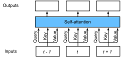

# Transformer
:label:`sec_transformer`


Until now, we have covered the three major neural network architectures: the convolution neural network (CNN), the recurrent neural network (RNN), and the attention mechanism. Before we dive into the transformer architecture, let us quickly review the pros and cons for first two:

* **The convolution neural network (CNN)**: Easy to parallelize at a layer but cannot capture the nonfixed sequential dependency very well. 

* **The recurrent neural network (RNN)**: Able to capture the long-range, variable-length sequential information, however, suffer from inability to parallelize within a sequence.

To combine the advantages from both CNN and RNN, :cite:`Vaswani.Shazeer.Parmar.ea.2017` innovates a novel architecture with the attention mechanism that we just introduced in :numref:`sec_attention`. This architecture, which is called as the *transformer*, achieves parallelization by capturing recurrence sequence with attention but at the same time encoding each item's position in the sequence. As a result, the transformer leads to a compatible model with significantly shorter training time.


Similar to the seq2seq model in :numref:`sec_seq2seq`, the transformer is also based on the encoder-decoder architecture. However, the transformer differs to the former by replacing the
recurrent layers in seq2seq with *multi-head attention* layers, incorporating the position-wise information through *position encoding*, and applying *layer normalization*. 


Recall in :numref:`sec_seq2seq_attention`, we introduced Sequence to Sequence (seq2seq) with
attention model. To better visualize and compare the transformer architecture with it, we draw them side-by-side in :numref:`fig_transformer`. These two models are similar to each other overall: the source sequence embeddings are fed into $n$ repeated blocks. The outputs of the last block are then used as attention memory for the decoder.  The target sequence embeddings is similarly fed into $n$ repeated blocks in the decoder, and the final outputs are obtained by applying a dense layer with vocabulary size to the last block's outputs.


:label:`fig_transformer`


On the flip side, the transformer differs to the seq2seq with attention model in three major places:

1. **Transformer block**: a recurrent layer in seq2seq is replaced with a *transformer block*. This block contains a *multi-head attention* layer and a network with two *position-wise feed-forward network* layers for the encoder. For the decoder, another multi-head attention layer is used to take the encoder state.
1. **Add and norm**: the inputs and outputs of both the multi-head attention layer or the position-wise feed-forward network, are processed by two "add and norm" layer that contains a residual structure and a *layer normalization* layer.
1. **Position encoding**: since the self-attention layer does not distinguish the item order in a sequence, a positional encoding layer is used to add sequential information into each sequence item.


In the rest of this section, we will equip you with each new component introduced by the transformer, and get you up and running to construct a machine translation model.

```{.python .input  n=1}
import math
import d2l
from mxnet import np, npx, autograd
from mxnet.gluon import nn
npx.set_np()
```

## Multi-Head Attention

Before the discussion of the *multi-head attention* layer, let us quick express the *self-attention* architecture. The self-attention model is a normal attention model, with its query, its key, and its value are copied exactly same from each item of the sequential inputs. As we illustrate in :numref:`fig_self_attention`, self-attention outputs a same length sequential output for each input item. Compared to a recurrent layer, output items of a self-attention layer can be computed in parallel and, therefore, it is easy to obtain a high-efficient implementation.


:label:`fig_self_attention`


Based on the above, the *multi-head attention* layer consists of $h$ parallel self-attention layers, each one is called a *head*. For each head, before feeding into the attention layer, we project the queries, keys, and values with three dense layers with hidden sizes $p_q$, $p_k$, and $p_v$, respectively. The outputs of these $h$ attention heads are concatenated and then processed by a final dense layer.


To be more specific, assume that the dimension for a query, a key, and a value are $d_q$, $d_k$, and $d_v$, respectively. Then, for each head $i=1,\ldots,h$, we can train the learnable parameters 
$\mathbf W_q^{(i)}\in\mathbb R^{p_q\times d_q}$,
$\mathbf W_k^{(i)}\in\mathbb R^{p_k\times d_k}$,
and $\mathbf W_v^{(i)}\in\mathbb R^{p_v\times d_v}$. Therefore, the output for each head can be demonstrated by

$$\mathbf o^{(i)} = \textrm{attention}(\mathbf W_q^{(i)}\mathbf q, \mathbf W_k^{(i)}\mathbf k,\mathbf W_v^{(i)}\mathbf v),$$

where the $\text{attention}$ in the formula can be any attention layer, such as the `DotProductAttention` and `MLPAttention` as we introduced in :label:`sec_attention`. 


After that, the output with length $p_v$ from each of the $h$ attention heads are concatenated to be a length $h p_v$ output, which is then passed the final dense layer with $d_o$ hidden units. The weights of this dense layer can be denoted by $\mathbf W_o\in\mathbb R^{d_o\times h p_v}$. As a result, the multi-head attention output will be

$$\mathbf o = \mathbf W_o \begin{bmatrix}\mathbf o^{(1)}\\\vdots\\\mathbf o^{(h)}\end{bmatrix}.$$


Let us implement the multi-head attention in MXNet. Assume that the multi-head attention contain the number heads `num_heads` $=h$, the hidden size `hidden_size` $=p_q=p_k=p_v$ are the same for the query, the key, and the value dense layers. In addition, since the multi-head attention keeps the same dimensionality between its input and its output, we have the output feature size $d_o = $ `hidden_size` as well. 


<!--Note in practice, we often use $\frac{d_model}{h} = p_q=p_k=p_v$. To be more clear, for a higher computational efficiency, that is the final dense weights $\mathbf W_o\in\mathbb R^{d_o\times h p_v}$ is a square matrix.-->

```{.python .input  n=2}
class MultiHeadAttention(nn.Block):
    def __init__(self, hidden_size, num_heads, dropout, **kwargs):  
        super(MultiHeadAttention, self).__init__(**kwargs)
        self.num_heads = num_heads
        self.attention = d2l.DotProductAttention(dropout)
        self.W_q = nn.Dense(hidden_size, use_bias=False, flatten=False)
        self.W_k = nn.Dense(hidden_size, use_bias=False, flatten=False)
        self.W_v = nn.Dense(hidden_size, use_bias=False, flatten=False)
        self.W_o = nn.Dense(hidden_size, use_bias=False, flatten=False)

    
    def forward(self, query, key, value, valid_length):
        # query, key, and value shape: (batch_size, seq_len, dim), 
        # where seq_len is the length of input sequence
        # valid_length shape is either (batch_size, ) or (batch_size, seq_len).
    
        # Project and transpose query, key, and value from 
        # (batch_size, seq_len, hidden_size * num_heads) to
        # (batch_size * num_heads, seq_len, hidden_size).
        query = transpose_qkv(self.W_q(query), self.num_heads)
        key  = transpose_qkv(self.W_k(key), self.num_heads)
        value  = transpose_qkv(self.W_v(value), self.num_heads)
        
        if valid_length is not None:
            # Copy valid_length by num_heads times
            if valid_length.ndim == 1:
                valid_length = np.tile(valid_length, self.num_heads)
            else:
                valid_length = np.tile(valid_length, (self.num_heads, 1))
        
        output = self.attention(query, key, value, valid_length)
        
        # Transpose from (batch_size * num_heads, seq_len, hidden_size) back to
        # (batch_size, seq_len, hidden_size * num_heads)
        output_concat = transpose_output(output, self.num_heads)
        return self.W_o(output_concat)
```

Here are the definitions of the transpose functions `transpose_qkv` and `transpose_output`, who are the inverse of each other.

```{.python .input  n=3}
def transpose_qkv(X, num_heads):
    # Original X shape: (batch_size, seq_len, hidden_size * num_heads),
    # -1 means inferring its value, 
    # after first reshape, X shape: (batch_size, seq_len, num_heads, hidden_size)
    X = X.reshape(X.shape[0], X.shape[1], num_heads, -1)
    
    # After transpose, X shape: (batch_size, num_heads, seq_len, hidden_size)
    X = X.transpose(0, 2, 1, 3)
    
    # Merge the first two dimensions. 
    # Use reverse=True to infer shape from right to left.
    # Output shape: (batch_size * num_heads, seq_len, hidden_size)
    output = X.reshape(-1, X.shape[2], X.shape[3])
    return output

def transpose_output(X, num_heads):
    # A reversed version of transpose_qkv
    X = X.reshape(-1, num_heads, X.shape[1], X.shape[2])
    X = X.transpose(0, 2, 1, 3)
    return X.reshape(X.shape[0], X.shape[1], -1)
```

Let us validate the `MultiHeadAttention` model in the a toy example. Create a multi-head attention with the hidden size $d_o = 100$, the output will share the same batch size and sequence length as the input, but the last dimension will be equal to the `hidden_size` $= 100$.

```{.python .input  n=4}
cell = MultiHeadAttention(100, 10, 0.5)
cell.initialize()
X = np.ones((2, 4, 5))
valid_length = np.array([2,3])
cell(X, X, X, valid_length).shape
```

```{.json .output n=4}
[
 {
  "data": {
   "text/plain": "(2, 4, 100)"
  },
  "execution_count": 4,
  "metadata": {},
  "output_type": "execute_result"
 }
]
```

## Position-wise Feed-Forward Networks

Another critical component in the transformer block is called *position-wise feed-forward network (FFN)*. It accepts a $3$ dimensional input with shape (batch size, sequence length, feature size). The position-wise FFN consists of two dense layers that applies to the last dimension. Since the same two dense layers are used for each position item in the sequence, we referred it to as *position-wise*. Indeed, it equals to apply two $Conv(1,1)$, i.e., $1 \times 1$ convolution layers.

Below, the `PositionWiseFFN` shows how to implement a position-wise FFN with two dense layers of hidden size `ffn_hidden_size` and `hidden_size_out`, respectively.

```{.python .input  n=5}
class PositionWiseFFN(nn.Block):
    def __init__(self, ffn_hidden_size, hidden_size_out, **kwargs):
        super(PositionWiseFFN, self).__init__(**kwargs)
        self.ffn_1 = nn.Dense(ffn_hidden_size, flatten=False, activation='relu')
        self.ffn_2 = nn.Dense(hidden_size_out, flatten=False)

    def forward(self, X):
        return self.ffn_2(self.ffn_1(X))
```

Similar to the multi-head attention, the position-wise feed-forward network will only change the last dimension size of the input---the feature dimension. In addition, if two items in the input sequence are identical, the according outputs will be identical as well. Let us try a toy model!

```{.python .input  n=6}
ffn = PositionWiseFFN(4, 8)
ffn.initialize()
ffn(np.ones((2, 3, 4)))[0]
```

```{.json .output n=6}
[
 {
  "data": {
   "text/plain": "array([[-0.00073839,  0.00923239, -0.00016378,  0.00091236, -0.00763499,\n         0.00199923,  0.00446541,  0.00189135],\n       [-0.00073839,  0.00923239, -0.00016378,  0.00091236, -0.00763499,\n         0.00199923,  0.00446541,  0.00189135],\n       [-0.00073839,  0.00923239, -0.00016378,  0.00091236, -0.00763499,\n         0.00199923,  0.00446541,  0.00189135]])"
  },
  "execution_count": 6,
  "metadata": {},
  "output_type": "execute_result"
 }
]
```

## Add and Norm

Besides the above two components in the transformer block, the "add and norm" within the block also play a core role to connect the inputs and outputs of other layers smoothly. To be more clear, we add a layer that contains a residual structure and a *layer normalization* after both the multi-head attention layer and the position-wise FFN network. *Layer normalization* is similar to the batch normalization as we discussed in :numref:`sec_batch_norm`. One difference is that the mean and variances for the layer normalization are calculated along the last dimension, e.g `X.mean(axis=-1)` instead of the first batch dimension, e.g., `X.mean(axis=0)`. Layer normalization prevents the range of values in the layers changing too much, which means that faster training and better generalization ability.

MXNet has both `LayerNorm` and `BatchNorm` implemented within the `nn` block. Let us call both of them and see the difference in the below example.

```{.python .input  n=7}
layer = nn.LayerNorm()
layer.initialize()
batch = nn.BatchNorm()
batch.initialize()
X = np.array([[1,2],[2,3]])
# compute mean and variance from X in the training mode.
with autograd.record():
    print('layer norm:',layer(X), '\nbatch norm:', batch(X))
```

```{.json .output n=7}
[
 {
  "name": "stdout",
  "output_type": "stream",
  "text": "layer norm: [[-0.99998  0.99998]\n [-0.99998  0.99998]] \nbatch norm: [[-0.99998 -0.99998]\n [ 0.99998  0.99998]]\n"
 }
]
```

Now let us implement the connection block `AddNorm` together. `AddNorm` accepts two inputs $X$ and $Y$. We can imagine $X$ as the original input in the residual network, while $Y$ as the outputs from either the multi-head attention layer or the position-wise FFN network. In addition, we apply dropout on $Y$ for the purpose of regularization.

```{.python .input  n=8}
class AddNorm(nn.Block):
    def __init__(self, dropout, **kwargs):
        super(AddNorm, self).__init__(**kwargs)
        self.dropout = nn.Dropout(dropout)
        self.norm = nn.LayerNorm()

    def forward(self, X, Y):
        return self.norm(self.dropout(Y) + X)
```

Due to the residual connection, $X$ and $Y$ should have the same shape.

```{.python .input  n=9}
add_norm = AddNorm(0.5)
add_norm.initialize()
add_norm(np.ones((2,3,4)), np.ones((2,3,4))).shape
```

```{.json .output n=9}
[
 {
  "data": {
   "text/plain": "(2, 3, 4)"
  },
  "execution_count": 9,
  "metadata": {},
  "output_type": "execute_result"
 }
]
```

## Positional Encoding

Unlike the recurrent layer, both the multi-head attention layer and the position-wise feed-forward network compute the output of each item in the sequence independently. This functionality enables us to parallel the computation, but it fails to model the sequential information for a given sequence. To better capture the sequential information, the transformer model utilizes the *positional encoding* to maintain the positional information of the input sequence.

So what is the *positional encoding*? Assume that $X\in\mathbb R^{l\times d}$ is the embedding of an example, where $l$ is the sequence length and $d$ is the embedding size. This positional encoding layer encodes X's position $P\in\mathbb R^{l\times d}$ and outputs $P+X$. 

The position $P$ is a 2d matrix, where $i$ refers to the order in the sentence, and $j$ refers to the position along the embedding vector dimension. In this way, each value in the origin sequence is then maintained using the equations below:

$$P_{i,2j} = \sin(i/10000^{2j/d}),$$

$$\quad P_{i,2j+1} = \cos(i/10000^{2j/d}),$$

for $i=0,\ldots,l-1$ and $j=0,\ldots,\lfloor(d-1)/2\rfloor$.


An intuitive visualization and implementation of the positional encoding are showing below.


:label:`fig_positional_encoding`

```{.python .input  n=10}
class PositionalEncoding(nn.Block):
    def __init__(self, embedding_size, dropout, max_len=1000):
        super(PositionalEncoding, self).__init__()
        self.dropout = nn.Dropout(dropout)
        # Create a long enough P
        self.P = np.zeros((1, max_len, embedding_size))
        X = np.arange(0, max_len).reshape(-1,1) / np.power(
            10000, np.arange(0, embedding_size, 2)/embedding_size)
        self.P[:, :, 0::2] = np.sin(X)
        self.P[:, :, 1::2] = np.cos(X)

    def forward(self, X):
        X = X + self.P[:, :X.shape[1], :].as_in_context(X.context)
        return self.dropout(X)

```

Now we test the `PositionalEncoding` with a toy model for 4 dimensions. As we can see, the 4th dimension has the same frequency as the 5th but with different offset. The 5th and 6th dimension have a lower frequency.

```{.python .input  n=11}
pe = PositionalEncoding(20, 0)
pe.initialize()
Y = pe(np.zeros((1, 100, 20 )))
d2l.plot(np.arange(100), Y[0, :,4:8].T, figsize=(6, 2.5),
        legend=["dim %d"%p for p in [4,5,6,7]])
```

```{.json .output n=11}
[
 {
  "data": {
   "image/svg+xml": "<?xml version=\"1.0\" encoding=\"utf-8\" standalone=\"no\"?>\n<!DOCTYPE svg PUBLIC \"-//W3C//DTD SVG 1.1//EN\"\n  \"http://www.w3.org/Graphics/SVG/1.1/DTD/svg11.dtd\">\n<!-- Created with matplotlib (https://matplotlib.org/) -->\n<svg height=\"166.978125pt\" version=\"1.1\" viewBox=\"0 0 380.482812 166.978125\" width=\"380.482812pt\" xmlns=\"http://www.w3.org/2000/svg\" xmlns:xlink=\"http://www.w3.org/1999/xlink\">\n <defs>\n  <style type=\"text/css\">\n*{stroke-linecap:butt;stroke-linejoin:round;}\n  </style>\n </defs>\n <g id=\"figure_1\">\n  <g id=\"patch_1\">\n   <path d=\"M -0 166.978125 \nL 380.482812 166.978125 \nL 380.482812 0 \nL -0 0 \nz\n\" style=\"fill:none;\"/>\n  </g>\n  <g id=\"axes_1\">\n   <g id=\"patch_2\">\n    <path d=\"M 38.482813 143.1 \nL 373.282813 143.1 \nL 373.282813 7.2 \nL 38.482813 7.2 \nz\n\" style=\"fill:#ffffff;\"/>\n   </g>\n   <g id=\"matplotlib.axis_1\">\n    <g id=\"xtick_1\">\n     <g id=\"line2d_1\">\n      <path clip-path=\"url(#p6289b114a9)\" d=\"M 53.700994 143.1 \nL 53.700994 7.2 \n\" style=\"fill:none;stroke:#b0b0b0;stroke-linecap:square;stroke-width:0.8;\"/>\n     </g>\n     <g id=\"line2d_2\">\n      <defs>\n       <path d=\"M 0 0 \nL 0 3.5 \n\" id=\"m505bb8ba6a\" style=\"stroke:#000000;stroke-width:0.8;\"/>\n      </defs>\n      <g>\n       <use style=\"stroke:#000000;stroke-width:0.8;\" x=\"53.700994\" xlink:href=\"#m505bb8ba6a\" y=\"143.1\"/>\n      </g>\n     </g>\n     <g id=\"text_1\">\n      <!-- 0 -->\n      <defs>\n       <path d=\"M 31.78125 66.40625 \nQ 24.171875 66.40625 20.328125 58.90625 \nQ 16.5 51.421875 16.5 36.375 \nQ 16.5 21.390625 20.328125 13.890625 \nQ 24.171875 6.390625 31.78125 6.390625 \nQ 39.453125 6.390625 43.28125 13.890625 \nQ 47.125 21.390625 47.125 36.375 \nQ 47.125 51.421875 43.28125 58.90625 \nQ 39.453125 66.40625 31.78125 66.40625 \nz\nM 31.78125 74.21875 \nQ 44.046875 74.21875 50.515625 64.515625 \nQ 56.984375 54.828125 56.984375 36.375 \nQ 56.984375 17.96875 50.515625 8.265625 \nQ 44.046875 -1.421875 31.78125 -1.421875 \nQ 19.53125 -1.421875 13.0625 8.265625 \nQ 6.59375 17.96875 6.59375 36.375 \nQ 6.59375 54.828125 13.0625 64.515625 \nQ 19.53125 74.21875 31.78125 74.21875 \nz\n\" id=\"DejaVuSans-48\"/>\n      </defs>\n      <g transform=\"translate(50.519744 157.698438)scale(0.1 -0.1)\">\n       <use xlink:href=\"#DejaVuSans-48\"/>\n      </g>\n     </g>\n    </g>\n    <g id=\"xtick_2\">\n     <g id=\"line2d_3\">\n      <path clip-path=\"url(#p6289b114a9)\" d=\"M 115.188598 143.1 \nL 115.188598 7.2 \n\" style=\"fill:none;stroke:#b0b0b0;stroke-linecap:square;stroke-width:0.8;\"/>\n     </g>\n     <g id=\"line2d_4\">\n      <g>\n       <use style=\"stroke:#000000;stroke-width:0.8;\" x=\"115.188598\" xlink:href=\"#m505bb8ba6a\" y=\"143.1\"/>\n      </g>\n     </g>\n     <g id=\"text_2\">\n      <!-- 20 -->\n      <defs>\n       <path d=\"M 19.1875 8.296875 \nL 53.609375 8.296875 \nL 53.609375 0 \nL 7.328125 0 \nL 7.328125 8.296875 \nQ 12.9375 14.109375 22.625 23.890625 \nQ 32.328125 33.6875 34.8125 36.53125 \nQ 39.546875 41.84375 41.421875 45.53125 \nQ 43.3125 49.21875 43.3125 52.78125 \nQ 43.3125 58.59375 39.234375 62.25 \nQ 35.15625 65.921875 28.609375 65.921875 \nQ 23.96875 65.921875 18.8125 64.3125 \nQ 13.671875 62.703125 7.8125 59.421875 \nL 7.8125 69.390625 \nQ 13.765625 71.78125 18.9375 73 \nQ 24.125 74.21875 28.421875 74.21875 \nQ 39.75 74.21875 46.484375 68.546875 \nQ 53.21875 62.890625 53.21875 53.421875 \nQ 53.21875 48.921875 51.53125 44.890625 \nQ 49.859375 40.875 45.40625 35.40625 \nQ 44.1875 33.984375 37.640625 27.21875 \nQ 31.109375 20.453125 19.1875 8.296875 \nz\n\" id=\"DejaVuSans-50\"/>\n      </defs>\n      <g transform=\"translate(108.826098 157.698438)scale(0.1 -0.1)\">\n       <use xlink:href=\"#DejaVuSans-50\"/>\n       <use x=\"63.623047\" xlink:href=\"#DejaVuSans-48\"/>\n      </g>\n     </g>\n    </g>\n    <g id=\"xtick_3\">\n     <g id=\"line2d_5\">\n      <path clip-path=\"url(#p6289b114a9)\" d=\"M 176.676201 143.1 \nL 176.676201 7.2 \n\" style=\"fill:none;stroke:#b0b0b0;stroke-linecap:square;stroke-width:0.8;\"/>\n     </g>\n     <g id=\"line2d_6\">\n      <g>\n       <use style=\"stroke:#000000;stroke-width:0.8;\" x=\"176.676201\" xlink:href=\"#m505bb8ba6a\" y=\"143.1\"/>\n      </g>\n     </g>\n     <g id=\"text_3\">\n      <!-- 40 -->\n      <defs>\n       <path d=\"M 37.796875 64.3125 \nL 12.890625 25.390625 \nL 37.796875 25.390625 \nz\nM 35.203125 72.90625 \nL 47.609375 72.90625 \nL 47.609375 25.390625 \nL 58.015625 25.390625 \nL 58.015625 17.1875 \nL 47.609375 17.1875 \nL 47.609375 0 \nL 37.796875 0 \nL 37.796875 17.1875 \nL 4.890625 17.1875 \nL 4.890625 26.703125 \nz\n\" id=\"DejaVuSans-52\"/>\n      </defs>\n      <g transform=\"translate(170.313701 157.698438)scale(0.1 -0.1)\">\n       <use xlink:href=\"#DejaVuSans-52\"/>\n       <use x=\"63.623047\" xlink:href=\"#DejaVuSans-48\"/>\n      </g>\n     </g>\n    </g>\n    <g id=\"xtick_4\">\n     <g id=\"line2d_7\">\n      <path clip-path=\"url(#p6289b114a9)\" d=\"M 238.163804 143.1 \nL 238.163804 7.2 \n\" style=\"fill:none;stroke:#b0b0b0;stroke-linecap:square;stroke-width:0.8;\"/>\n     </g>\n     <g id=\"line2d_8\">\n      <g>\n       <use style=\"stroke:#000000;stroke-width:0.8;\" x=\"238.163804\" xlink:href=\"#m505bb8ba6a\" y=\"143.1\"/>\n      </g>\n     </g>\n     <g id=\"text_4\">\n      <!-- 60 -->\n      <defs>\n       <path d=\"M 33.015625 40.375 \nQ 26.375 40.375 22.484375 35.828125 \nQ 18.609375 31.296875 18.609375 23.390625 \nQ 18.609375 15.53125 22.484375 10.953125 \nQ 26.375 6.390625 33.015625 6.390625 \nQ 39.65625 6.390625 43.53125 10.953125 \nQ 47.40625 15.53125 47.40625 23.390625 \nQ 47.40625 31.296875 43.53125 35.828125 \nQ 39.65625 40.375 33.015625 40.375 \nz\nM 52.59375 71.296875 \nL 52.59375 62.3125 \nQ 48.875 64.0625 45.09375 64.984375 \nQ 41.3125 65.921875 37.59375 65.921875 \nQ 27.828125 65.921875 22.671875 59.328125 \nQ 17.53125 52.734375 16.796875 39.40625 \nQ 19.671875 43.65625 24.015625 45.921875 \nQ 28.375 48.1875 33.59375 48.1875 \nQ 44.578125 48.1875 50.953125 41.515625 \nQ 57.328125 34.859375 57.328125 23.390625 \nQ 57.328125 12.15625 50.6875 5.359375 \nQ 44.046875 -1.421875 33.015625 -1.421875 \nQ 20.359375 -1.421875 13.671875 8.265625 \nQ 6.984375 17.96875 6.984375 36.375 \nQ 6.984375 53.65625 15.1875 63.9375 \nQ 23.390625 74.21875 37.203125 74.21875 \nQ 40.921875 74.21875 44.703125 73.484375 \nQ 48.484375 72.75 52.59375 71.296875 \nz\n\" id=\"DejaVuSans-54\"/>\n      </defs>\n      <g transform=\"translate(231.801304 157.698438)scale(0.1 -0.1)\">\n       <use xlink:href=\"#DejaVuSans-54\"/>\n       <use x=\"63.623047\" xlink:href=\"#DejaVuSans-48\"/>\n      </g>\n     </g>\n    </g>\n    <g id=\"xtick_5\">\n     <g id=\"line2d_9\">\n      <path clip-path=\"url(#p6289b114a9)\" d=\"M 299.651408 143.1 \nL 299.651408 7.2 \n\" style=\"fill:none;stroke:#b0b0b0;stroke-linecap:square;stroke-width:0.8;\"/>\n     </g>\n     <g id=\"line2d_10\">\n      <g>\n       <use style=\"stroke:#000000;stroke-width:0.8;\" x=\"299.651408\" xlink:href=\"#m505bb8ba6a\" y=\"143.1\"/>\n      </g>\n     </g>\n     <g id=\"text_5\">\n      <!-- 80 -->\n      <defs>\n       <path d=\"M 31.78125 34.625 \nQ 24.75 34.625 20.71875 30.859375 \nQ 16.703125 27.09375 16.703125 20.515625 \nQ 16.703125 13.921875 20.71875 10.15625 \nQ 24.75 6.390625 31.78125 6.390625 \nQ 38.8125 6.390625 42.859375 10.171875 \nQ 46.921875 13.96875 46.921875 20.515625 \nQ 46.921875 27.09375 42.890625 30.859375 \nQ 38.875 34.625 31.78125 34.625 \nz\nM 21.921875 38.8125 \nQ 15.578125 40.375 12.03125 44.71875 \nQ 8.5 49.078125 8.5 55.328125 \nQ 8.5 64.0625 14.71875 69.140625 \nQ 20.953125 74.21875 31.78125 74.21875 \nQ 42.671875 74.21875 48.875 69.140625 \nQ 55.078125 64.0625 55.078125 55.328125 \nQ 55.078125 49.078125 51.53125 44.71875 \nQ 48 40.375 41.703125 38.8125 \nQ 48.828125 37.15625 52.796875 32.3125 \nQ 56.78125 27.484375 56.78125 20.515625 \nQ 56.78125 9.90625 50.3125 4.234375 \nQ 43.84375 -1.421875 31.78125 -1.421875 \nQ 19.734375 -1.421875 13.25 4.234375 \nQ 6.78125 9.90625 6.78125 20.515625 \nQ 6.78125 27.484375 10.78125 32.3125 \nQ 14.796875 37.15625 21.921875 38.8125 \nz\nM 18.3125 54.390625 \nQ 18.3125 48.734375 21.84375 45.5625 \nQ 25.390625 42.390625 31.78125 42.390625 \nQ 38.140625 42.390625 41.71875 45.5625 \nQ 45.3125 48.734375 45.3125 54.390625 \nQ 45.3125 60.0625 41.71875 63.234375 \nQ 38.140625 66.40625 31.78125 66.40625 \nQ 25.390625 66.40625 21.84375 63.234375 \nQ 18.3125 60.0625 18.3125 54.390625 \nz\n\" id=\"DejaVuSans-56\"/>\n      </defs>\n      <g transform=\"translate(293.288908 157.698438)scale(0.1 -0.1)\">\n       <use xlink:href=\"#DejaVuSans-56\"/>\n       <use x=\"63.623047\" xlink:href=\"#DejaVuSans-48\"/>\n      </g>\n     </g>\n    </g>\n    <g id=\"xtick_6\">\n     <g id=\"line2d_11\">\n      <path clip-path=\"url(#p6289b114a9)\" d=\"M 361.139011 143.1 \nL 361.139011 7.2 \n\" style=\"fill:none;stroke:#b0b0b0;stroke-linecap:square;stroke-width:0.8;\"/>\n     </g>\n     <g id=\"line2d_12\">\n      <g>\n       <use style=\"stroke:#000000;stroke-width:0.8;\" x=\"361.139011\" xlink:href=\"#m505bb8ba6a\" y=\"143.1\"/>\n      </g>\n     </g>\n     <g id=\"text_6\">\n      <!-- 100 -->\n      <defs>\n       <path d=\"M 12.40625 8.296875 \nL 28.515625 8.296875 \nL 28.515625 63.921875 \nL 10.984375 60.40625 \nL 10.984375 69.390625 \nL 28.421875 72.90625 \nL 38.28125 72.90625 \nL 38.28125 8.296875 \nL 54.390625 8.296875 \nL 54.390625 0 \nL 12.40625 0 \nz\n\" id=\"DejaVuSans-49\"/>\n      </defs>\n      <g transform=\"translate(351.595261 157.698438)scale(0.1 -0.1)\">\n       <use xlink:href=\"#DejaVuSans-49\"/>\n       <use x=\"63.623047\" xlink:href=\"#DejaVuSans-48\"/>\n       <use x=\"127.246094\" xlink:href=\"#DejaVuSans-48\"/>\n      </g>\n     </g>\n    </g>\n   </g>\n   <g id=\"matplotlib.axis_2\">\n    <g id=\"ytick_1\">\n     <g id=\"line2d_13\">\n      <path clip-path=\"url(#p6289b114a9)\" d=\"M 38.482813 136.928103 \nL 373.282813 136.928103 \n\" style=\"fill:none;stroke:#b0b0b0;stroke-linecap:square;stroke-width:0.8;\"/>\n     </g>\n     <g id=\"line2d_14\">\n      <defs>\n       <path d=\"M 0 0 \nL -3.5 0 \n\" id=\"mde99cd9ffb\" style=\"stroke:#000000;stroke-width:0.8;\"/>\n      </defs>\n      <g>\n       <use style=\"stroke:#000000;stroke-width:0.8;\" x=\"38.482813\" xlink:href=\"#mde99cd9ffb\" y=\"136.928103\"/>\n      </g>\n     </g>\n     <g id=\"text_7\">\n      <!-- \u22121.0 -->\n      <defs>\n       <path d=\"M 10.59375 35.5 \nL 73.1875 35.5 \nL 73.1875 27.203125 \nL 10.59375 27.203125 \nz\n\" id=\"DejaVuSans-8722\"/>\n       <path d=\"M 10.6875 12.40625 \nL 21 12.40625 \nL 21 0 \nL 10.6875 0 \nz\n\" id=\"DejaVuSans-46\"/>\n      </defs>\n      <g transform=\"translate(7.2 140.727322)scale(0.1 -0.1)\">\n       <use xlink:href=\"#DejaVuSans-8722\"/>\n       <use x=\"83.789062\" xlink:href=\"#DejaVuSans-49\"/>\n       <use x=\"147.412109\" xlink:href=\"#DejaVuSans-46\"/>\n       <use x=\"179.199219\" xlink:href=\"#DejaVuSans-48\"/>\n      </g>\n     </g>\n    </g>\n    <g id=\"ytick_2\">\n     <g id=\"line2d_15\">\n      <path clip-path=\"url(#p6289b114a9)\" d=\"M 38.482813 106.040396 \nL 373.282813 106.040396 \n\" style=\"fill:none;stroke:#b0b0b0;stroke-linecap:square;stroke-width:0.8;\"/>\n     </g>\n     <g id=\"line2d_16\">\n      <g>\n       <use style=\"stroke:#000000;stroke-width:0.8;\" x=\"38.482813\" xlink:href=\"#mde99cd9ffb\" y=\"106.040396\"/>\n      </g>\n     </g>\n     <g id=\"text_8\">\n      <!-- \u22120.5 -->\n      <defs>\n       <path d=\"M 10.796875 72.90625 \nL 49.515625 72.90625 \nL 49.515625 64.59375 \nL 19.828125 64.59375 \nL 19.828125 46.734375 \nQ 21.96875 47.46875 24.109375 47.828125 \nQ 26.265625 48.1875 28.421875 48.1875 \nQ 40.625 48.1875 47.75 41.5 \nQ 54.890625 34.8125 54.890625 23.390625 \nQ 54.890625 11.625 47.5625 5.09375 \nQ 40.234375 -1.421875 26.90625 -1.421875 \nQ 22.3125 -1.421875 17.546875 -0.640625 \nQ 12.796875 0.140625 7.71875 1.703125 \nL 7.71875 11.625 \nQ 12.109375 9.234375 16.796875 8.0625 \nQ 21.484375 6.890625 26.703125 6.890625 \nQ 35.15625 6.890625 40.078125 11.328125 \nQ 45.015625 15.765625 45.015625 23.390625 \nQ 45.015625 31 40.078125 35.4375 \nQ 35.15625 39.890625 26.703125 39.890625 \nQ 22.75 39.890625 18.8125 39.015625 \nQ 14.890625 38.140625 10.796875 36.28125 \nz\n\" id=\"DejaVuSans-53\"/>\n      </defs>\n      <g transform=\"translate(7.2 109.839614)scale(0.1 -0.1)\">\n       <use xlink:href=\"#DejaVuSans-8722\"/>\n       <use x=\"83.789062\" xlink:href=\"#DejaVuSans-48\"/>\n       <use x=\"147.412109\" xlink:href=\"#DejaVuSans-46\"/>\n       <use x=\"179.199219\" xlink:href=\"#DejaVuSans-53\"/>\n      </g>\n     </g>\n    </g>\n    <g id=\"ytick_3\">\n     <g id=\"line2d_17\">\n      <path clip-path=\"url(#p6289b114a9)\" d=\"M 38.482813 75.152688 \nL 373.282813 75.152688 \n\" style=\"fill:none;stroke:#b0b0b0;stroke-linecap:square;stroke-width:0.8;\"/>\n     </g>\n     <g id=\"line2d_18\">\n      <g>\n       <use style=\"stroke:#000000;stroke-width:0.8;\" x=\"38.482813\" xlink:href=\"#mde99cd9ffb\" y=\"75.152688\"/>\n      </g>\n     </g>\n     <g id=\"text_9\">\n      <!-- 0.0 -->\n      <g transform=\"translate(15.579688 78.951907)scale(0.1 -0.1)\">\n       <use xlink:href=\"#DejaVuSans-48\"/>\n       <use x=\"63.623047\" xlink:href=\"#DejaVuSans-46\"/>\n       <use x=\"95.410156\" xlink:href=\"#DejaVuSans-48\"/>\n      </g>\n     </g>\n    </g>\n    <g id=\"ytick_4\">\n     <g id=\"line2d_19\">\n      <path clip-path=\"url(#p6289b114a9)\" d=\"M 38.482813 44.26498 \nL 373.282813 44.26498 \n\" style=\"fill:none;stroke:#b0b0b0;stroke-linecap:square;stroke-width:0.8;\"/>\n     </g>\n     <g id=\"line2d_20\">\n      <g>\n       <use style=\"stroke:#000000;stroke-width:0.8;\" x=\"38.482813\" xlink:href=\"#mde99cd9ffb\" y=\"44.26498\"/>\n      </g>\n     </g>\n     <g id=\"text_10\">\n      <!-- 0.5 -->\n      <g transform=\"translate(15.579688 48.064199)scale(0.1 -0.1)\">\n       <use xlink:href=\"#DejaVuSans-48\"/>\n       <use x=\"63.623047\" xlink:href=\"#DejaVuSans-46\"/>\n       <use x=\"95.410156\" xlink:href=\"#DejaVuSans-53\"/>\n      </g>\n     </g>\n    </g>\n    <g id=\"ytick_5\">\n     <g id=\"line2d_21\">\n      <path clip-path=\"url(#p6289b114a9)\" d=\"M 38.482813 13.377273 \nL 373.282813 13.377273 \n\" style=\"fill:none;stroke:#b0b0b0;stroke-linecap:square;stroke-width:0.8;\"/>\n     </g>\n     <g id=\"line2d_22\">\n      <g>\n       <use style=\"stroke:#000000;stroke-width:0.8;\" x=\"38.482813\" xlink:href=\"#mde99cd9ffb\" y=\"13.377273\"/>\n      </g>\n     </g>\n     <g id=\"text_11\">\n      <!-- 1.0 -->\n      <g transform=\"translate(15.579688 17.176491)scale(0.1 -0.1)\">\n       <use xlink:href=\"#DejaVuSans-49\"/>\n       <use x=\"63.623047\" xlink:href=\"#DejaVuSans-46\"/>\n       <use x=\"95.410156\" xlink:href=\"#DejaVuSans-48\"/>\n      </g>\n     </g>\n    </g>\n   </g>\n   <g id=\"line2d_23\">\n    <path clip-path=\"url(#p6289b114a9)\" d=\"M 53.700994 75.152688 \nL 56.775374 65.402882 \nL 59.849755 55.897467 \nL 62.924135 46.87471 \nL 65.998515 38.560779 \nL 69.072895 31.164074 \nL 72.147275 24.869999 \nL 75.221655 19.836327 \nL 78.296036 16.189235 \nL 81.370416 14.020138 \nL 84.444796 13.383411 \nL 87.519176 14.295011 \nL 90.593556 16.732091 \nL 93.667936 20.633561 \nL 96.742317 25.901625 \nL 99.816697 32.404228 \nL 102.891077 39.978388 \nL 105.965457 48.434226 \nL 109.039837 57.559812 \nL 112.114217 67.126375 \nL 115.188598 76.894126 \nL 118.262978 86.618241 \nL 121.337358 96.054943 \nL 124.411738 104.9677 \nL 127.486118 113.133118 \nL 130.560498 120.346495 \nL 133.634879 126.42704 \nL 136.709259 131.222315 \nL 139.783639 134.612131 \nL 142.858019 136.511521 \nL 145.932399 136.872872 \nL 149.006779 135.687117 \nL 152.08116 132.98399 \nL 155.15554 128.83125 \nL 158.22992 123.332985 \nL 161.3043 116.62702 \nL 164.37868 108.881417 \nL 167.45306 100.290387 \nL 170.527441 91.069244 \nL 173.601821 81.449135 \nL 176.676201 71.671196 \nL 179.750581 61.980525 \nL 182.824961 52.620004 \nL 185.899341 43.824321 \nL 188.973722 35.813927 \nL 192.048102 28.789611 \nL 195.122482 22.927444 \nL 198.196862 18.37436 \nL 201.271242 15.244511 \nL 204.345622 13.616341 \nL 207.420003 13.530658 \nL 210.494383 14.989621 \nL 213.568763 17.956644 \nL 216.643143 22.357363 \nL 219.717523 28.081462 \nL 222.791903 34.985466 \nL 225.866284 42.896314 \nL 228.940664 51.615705 \nL 232.015044 60.925086 \nL 235.089424 70.591098 \nL 238.163804 80.371453 \nL 241.238184 90.021049 \nL 244.312565 99.297893 \nL 247.386945 107.969504 \nL 250.461325 115.818522 \nL 253.535705 122.648195 \nL 256.610085 128.287334 \nL 259.684465 132.594582 \nL 262.758846 135.461975 \nL 265.833226 136.817636 \nL 268.907606 136.627588 \nL 271.981986 134.896588 \nL 275.056366 131.668007 \nL 278.130746 127.022811 \nL 281.205127 121.077425 \nL 284.279507 113.980874 \nL 287.353887 105.911045 \nL 290.428267 97.070218 \nL 293.502647 87.679999 \nL 296.577027 77.975766 \nL 299.651408 68.20077 \nL 302.725788 58.600032 \nL 305.800168 49.414208 \nL 308.874548 40.873503 \nL 311.948928 33.192105 \nL 315.023308 26.562503 \nL 318.097689 21.150878 \nL 321.172069 17.092878 \nL 324.246449 14.490221 \nL 327.320829 13.408147 \nL 330.395209 13.873782 \nL 333.469589 15.875454 \nL 336.54397 19.362986 \nL 339.61835 24.248958 \nL 342.69273 30.41094 \nL 345.76711 37.694399 \nL 348.84149 45.916795 \nL 351.91587 54.872031 \nL 354.990251 64.335626 \nL 358.064631 74.070365 \n\" style=\"fill:none;stroke:#1f77b4;stroke-linecap:square;stroke-width:1.5;\"/>\n   </g>\n   <g id=\"line2d_24\">\n    <path clip-path=\"url(#p6289b114a9)\" d=\"M 53.700994 13.377273 \nL 56.775374 14.151516 \nL 59.849755 16.454832 \nL 62.924135 20.229487 \nL 65.998515 25.380865 \nL 69.072895 31.779843 \nL 72.147275 39.266019 \nL 75.221655 47.651737 \nL 78.296036 56.726809 \nL 81.370416 66.263747 \nL 84.444796 76.023494 \nL 87.519176 85.761418 \nL 90.593556 95.233422 \nL 93.667936 104.202075 \nL 96.742317 112.442561 \nL 99.816697 119.748326 \nL 102.891077 125.936253 \nL 105.965457 130.851214 \nL 109.039837 134.370022 \nL 112.114217 136.404464 \nL 115.188598 136.903555 \nL 118.262978 135.854771 \nL 121.337358 133.284417 \nL 124.411738 129.256912 \nL 127.486118 123.873204 \nL 130.560498 117.268261 \nL 133.634879 109.607627 \nL 136.709259 101.083344 \nL 139.783639 91.909077 \nL 142.858019 82.314787 \nL 145.932399 72.54097 \nL 149.006779 62.832591 \nL 152.08116 53.43306 \nL 155.15554 44.577961 \nL 158.22992 36.489258 \nL 161.3043 29.369701 \nL 164.37868 23.397741 \nL 167.45306 18.723103 \nL 170.527441 15.462948 \nL 173.601821 13.698993 \nL 176.676201 13.475456 \nL 179.750581 14.797938 \nL 182.824961 17.6333 \nL 185.899341 21.910455 \nL 188.973722 27.522195 \nL 192.048102 34.327857 \nL 195.122482 42.156845 \nL 198.196862 50.812943 \nL 201.271242 60.079125 \nL 204.345622 69.723145 \nL 207.420003 79.503263 \nL 210.494383 89.174358 \nL 213.568763 98.493952 \nL 216.643143 107.228466 \nL 219.717523 115.158958 \nL 222.791903 122.086645 \nL 225.866284 127.837867 \nL 228.940664 132.26847 \nL 232.015044 135.267387 \nL 235.089424 136.759456 \nL 238.163804 136.707269 \nL 241.238184 135.112124 \nL 244.312565 132.014018 \nL 247.386945 127.490615 \nL 250.461325 121.65529 \nL 253.535705 114.654319 \nL 256.610085 106.663186 \nL 259.684465 97.882202 \nL 262.758846 88.531474 \nL 265.833226 78.845389 \nL 268.907606 69.066742 \nL 271.981986 59.440646 \nL 275.056366 50.20834 \nL 278.130746 41.601355 \nL 281.205127 33.835376 \nL 284.279507 27.105068 \nL 287.353887 21.579136 \nL 290.428267 17.396095 \nL 293.502647 14.660802 \nL 296.577027 13.441813 \nL 299.651408 13.769689 \nL 302.725788 15.636205 \nL 305.800168 18.994584 \nL 308.874548 23.760671 \nL 311.948928 29.814941 \nL 315.023308 37.005658 \nL 318.097689 45.152582 \nL 321.172069 54.051497 \nL 324.246449 63.479341 \nL 327.320829 73.199793 \nL 330.395209 82.969197 \nL 333.469589 92.542669 \nL 336.54397 101.680239 \nL 339.61835 110.152861 \nL 342.69273 117.748201 \nL 345.76711 124.275783 \nL 348.84149 129.572026 \nL 351.91587 133.504183 \nL 354.990251 135.97368 \nL 358.064631 136.918622 \n\" style=\"fill:none;stroke:#ff7f0e;stroke-linecap:square;stroke-width:1.5;\"/>\n   </g>\n   <g id=\"line2d_25\">\n    <path clip-path=\"url(#p6289b114a9)\" d=\"M 53.700994 75.152688 \nL 56.775374 71.257509 \nL 59.849755 67.377832 \nL 62.924135 63.529097 \nL 65.998515 59.726621 \nL 69.072895 55.985535 \nL 72.147275 52.320732 \nL 75.221655 48.746792 \nL 78.296036 45.277945 \nL 81.370416 41.927987 \nL 84.444796 38.710257 \nL 87.519176 35.637562 \nL 90.593556 32.722122 \nL 93.667936 29.975546 \nL 96.742317 27.408768 \nL 99.816697 25.031997 \nL 102.891077 22.854693 \nL 105.965457 20.88552 \nL 109.039837 19.13232 \nL 112.114217 17.602068 \nL 115.188598 16.30085 \nL 118.262978 15.233847 \nL 121.337358 14.405308 \nL 124.411738 13.818528 \nL 127.486118 13.475843 \nL 130.560498 13.378617 \nL 133.634879 13.527237 \nL 136.709259 13.921108 \nL 139.783639 14.558668 \nL 142.858019 15.437375 \nL 145.932399 16.553733 \nL 149.006779 17.903305 \nL 152.08116 19.48071 \nL 155.15554 21.279678 \nL 158.22992 23.293051 \nL 161.3043 25.512802 \nL 164.37868 27.930117 \nL 167.45306 30.535366 \nL 170.527441 33.318173 \nL 173.601821 36.267478 \nL 176.676201 39.371537 \nL 179.750581 42.617987 \nL 182.824961 45.993928 \nL 185.899341 49.485911 \nL 188.973722 53.080031 \nL 192.048102 56.762008 \nL 195.122482 60.517174 \nL 198.196862 64.330573 \nL 201.271242 68.187055 \nL 204.345622 72.071258 \nL 207.420003 75.96771 \nL 210.494383 79.860933 \nL 213.568763 83.735419 \nL 216.643143 87.575733 \nL 219.717523 91.36662 \nL 222.791903 95.092981 \nL 225.866284 98.739983 \nL 228.940664 102.2931 \nL 232.015044 105.73822 \nL 235.089424 109.061615 \nL 238.163804 112.25005 \nL 241.238184 115.290859 \nL 244.312565 118.171926 \nL 247.386945 120.881776 \nL 250.461325 123.409639 \nL 253.535705 125.745468 \nL 256.610085 127.879935 \nL 259.684465 129.804562 \nL 262.758846 131.511698 \nL 265.833226 132.994529 \nL 268.907606 134.247165 \nL 271.981986 135.264625 \nL 275.056366 136.042849 \nL 278.130746 136.578749 \nL 281.205127 136.870187 \nL 284.279507 136.916007 \nL 287.353887 136.716021 \nL 290.428267 136.271028 \nL 293.502647 135.582803 \nL 296.577027 134.654081 \nL 299.651408 133.488553 \nL 302.725788 132.090867 \nL 305.800168 130.466585 \nL 308.874548 128.622154 \nL 311.948928 126.564942 \nL 315.023308 124.303126 \nL 318.097689 121.845681 \nL 321.172069 119.202429 \nL 324.246449 116.383872 \nL 327.320829 113.401204 \nL 330.395209 110.266336 \nL 333.469589 106.991725 \nL 336.54397 103.59038 \nL 339.61835 100.075886 \nL 342.69273 96.462203 \nL 345.76711 92.763685 \nL 348.84149 88.995108 \nL 351.91587 85.171443 \nL 354.990251 81.307876 \nL 358.064631 77.419842 \n\" style=\"fill:none;stroke:#2ca02c;stroke-linecap:square;stroke-width:1.5;\"/>\n   </g>\n   <g id=\"line2d_26\">\n    <path clip-path=\"url(#p6289b114a9)\" d=\"M 53.700994 13.377273 \nL 56.775374 13.5002 \nL 59.849755 13.868484 \nL 62.924135 14.480666 \nL 65.998515 15.33431 \nL 69.072895 16.426016 \nL 72.147275 17.751436 \nL 75.221655 19.305302 \nL 78.296036 21.081422 \nL 81.370416 23.072736 \nL 84.444796 25.271315 \nL 87.519176 27.668408 \nL 90.593556 30.25448 \nL 93.667936 33.019234 \nL 96.742317 35.951667 \nL 99.816697 39.040111 \nL 102.891077 42.272271 \nL 105.965457 45.635295 \nL 109.039837 49.115785 \nL 112.114217 52.699893 \nL 115.188598 56.373366 \nL 118.262978 60.121567 \nL 121.337358 63.92959 \nL 124.411738 67.782285 \nL 127.486118 71.664305 \nL 130.560498 75.560208 \nL 133.634879 79.454497 \nL 136.709259 83.331658 \nL 139.783639 87.176275 \nL 142.858019 90.973035 \nL 145.932399 94.706833 \nL 149.006779 98.36282 \nL 152.08116 101.92642 \nL 155.15554 105.383481 \nL 158.22992 108.720233 \nL 161.3043 111.923381 \nL 164.37868 114.9802 \nL 167.45306 117.878518 \nL 170.527441 120.60679 \nL 173.601821 123.154171 \nL 176.676201 125.510521 \nL 179.750581 127.66645 \nL 182.824961 129.613395 \nL 185.899341 131.343599 \nL 188.973722 132.850172 \nL 192.048102 134.127128 \nL 195.122482 135.169384 \nL 198.196862 135.972782 \nL 201.271242 136.534133 \nL 204.345622 136.851202 \nL 207.420003 136.922727 \nL 210.494383 136.74842 \nL 213.568763 136.328981 \nL 216.643143 135.666074 \nL 219.717523 134.762339 \nL 222.791903 133.62137 \nL 225.866284 132.24771 \nL 228.940664 130.646832 \nL 232.015044 128.825093 \nL 235.089424 126.789753 \nL 238.163804 124.548918 \nL 241.238184 122.111492 \nL 244.312565 119.487177 \nL 247.386945 116.686438 \nL 250.461325 113.720402 \nL 253.535705 110.600852 \nL 256.610085 107.340251 \nL 259.684465 103.951554 \nL 262.758846 100.448218 \nL 265.833226 96.844238 \nL 268.907606 93.153933 \nL 271.981986 89.391958 \nL 275.056366 85.573342 \nL 278.130746 81.713256 \nL 281.205127 77.827031 \nL 284.279507 73.930191 \nL 287.353887 70.038217 \nL 290.428267 66.166568 \nL 293.502647 62.330711 \nL 296.577027 58.545883 \nL 299.651408 54.827117 \nL 302.725788 51.189268 \nL 305.800168 47.646788 \nL 308.874548 44.213748 \nL 311.948928 40.903866 \nL 315.023308 37.730281 \nL 318.097689 34.705607 \nL 321.172069 31.841926 \nL 324.246449 29.150608 \nL 327.320829 26.64235 \nL 330.395209 24.327166 \nL 333.469589 22.214258 \nL 336.54397 20.312014 \nL 339.61835 18.628038 \nL 342.69273 17.169013 \nL 345.76711 15.940741 \nL 348.84149 14.948127 \nL 351.91587 14.195108 \nL 354.990251 13.684684 \nL 358.064631 13.418888 \n\" style=\"fill:none;stroke:#d62728;stroke-linecap:square;stroke-width:1.5;\"/>\n   </g>\n   <g id=\"patch_3\">\n    <path d=\"M 38.482813 143.1 \nL 38.482813 7.2 \n\" style=\"fill:none;stroke:#000000;stroke-linecap:square;stroke-linejoin:miter;stroke-width:0.8;\"/>\n   </g>\n   <g id=\"patch_4\">\n    <path d=\"M 373.282813 143.1 \nL 373.282813 7.2 \n\" style=\"fill:none;stroke:#000000;stroke-linecap:square;stroke-linejoin:miter;stroke-width:0.8;\"/>\n   </g>\n   <g id=\"patch_5\">\n    <path d=\"M 38.482813 143.1 \nL 373.282812 143.1 \n\" style=\"fill:none;stroke:#000000;stroke-linecap:square;stroke-linejoin:miter;stroke-width:0.8;\"/>\n   </g>\n   <g id=\"patch_6\">\n    <path d=\"M 38.482813 7.2 \nL 373.282812 7.2 \n\" style=\"fill:none;stroke:#000000;stroke-linecap:square;stroke-linejoin:miter;stroke-width:0.8;\"/>\n   </g>\n   <g id=\"legend_1\">\n    <g id=\"patch_7\">\n     <path d=\"M 45.482813 138.1 \nL 105.890625 138.1 \nQ 107.890625 138.1 107.890625 136.1 \nL 107.890625 78.3875 \nQ 107.890625 76.3875 105.890625 76.3875 \nL 45.482813 76.3875 \nQ 43.482813 76.3875 43.482813 78.3875 \nL 43.482813 136.1 \nQ 43.482813 138.1 45.482813 138.1 \nz\n\" style=\"fill:#ffffff;opacity:0.8;stroke:#cccccc;stroke-linejoin:miter;\"/>\n    </g>\n    <g id=\"line2d_27\">\n     <path d=\"M 47.482813 84.485938 \nL 67.482812 84.485938 \n\" style=\"fill:none;stroke:#1f77b4;stroke-linecap:square;stroke-width:1.5;\"/>\n    </g>\n    <g id=\"line2d_28\"/>\n    <g id=\"text_12\">\n     <!-- dim 4 -->\n     <defs>\n      <path d=\"M 45.40625 46.390625 \nL 45.40625 75.984375 \nL 54.390625 75.984375 \nL 54.390625 0 \nL 45.40625 0 \nL 45.40625 8.203125 \nQ 42.578125 3.328125 38.25 0.953125 \nQ 33.9375 -1.421875 27.875 -1.421875 \nQ 17.96875 -1.421875 11.734375 6.484375 \nQ 5.515625 14.40625 5.515625 27.296875 \nQ 5.515625 40.1875 11.734375 48.09375 \nQ 17.96875 56 27.875 56 \nQ 33.9375 56 38.25 53.625 \nQ 42.578125 51.265625 45.40625 46.390625 \nz\nM 14.796875 27.296875 \nQ 14.796875 17.390625 18.875 11.75 \nQ 22.953125 6.109375 30.078125 6.109375 \nQ 37.203125 6.109375 41.296875 11.75 \nQ 45.40625 17.390625 45.40625 27.296875 \nQ 45.40625 37.203125 41.296875 42.84375 \nQ 37.203125 48.484375 30.078125 48.484375 \nQ 22.953125 48.484375 18.875 42.84375 \nQ 14.796875 37.203125 14.796875 27.296875 \nz\n\" id=\"DejaVuSans-100\"/>\n      <path d=\"M 9.421875 54.6875 \nL 18.40625 54.6875 \nL 18.40625 0 \nL 9.421875 0 \nz\nM 9.421875 75.984375 \nL 18.40625 75.984375 \nL 18.40625 64.59375 \nL 9.421875 64.59375 \nz\n\" id=\"DejaVuSans-105\"/>\n      <path d=\"M 52 44.1875 \nQ 55.375 50.25 60.0625 53.125 \nQ 64.75 56 71.09375 56 \nQ 79.640625 56 84.28125 50.015625 \nQ 88.921875 44.046875 88.921875 33.015625 \nL 88.921875 0 \nL 79.890625 0 \nL 79.890625 32.71875 \nQ 79.890625 40.578125 77.09375 44.375 \nQ 74.3125 48.1875 68.609375 48.1875 \nQ 61.625 48.1875 57.5625 43.546875 \nQ 53.515625 38.921875 53.515625 30.90625 \nL 53.515625 0 \nL 44.484375 0 \nL 44.484375 32.71875 \nQ 44.484375 40.625 41.703125 44.40625 \nQ 38.921875 48.1875 33.109375 48.1875 \nQ 26.21875 48.1875 22.15625 43.53125 \nQ 18.109375 38.875 18.109375 30.90625 \nL 18.109375 0 \nL 9.078125 0 \nL 9.078125 54.6875 \nL 18.109375 54.6875 \nL 18.109375 46.1875 \nQ 21.1875 51.21875 25.484375 53.609375 \nQ 29.78125 56 35.6875 56 \nQ 41.65625 56 45.828125 52.96875 \nQ 50 49.953125 52 44.1875 \nz\n\" id=\"DejaVuSans-109\"/>\n      <path id=\"DejaVuSans-32\"/>\n     </defs>\n     <g transform=\"translate(75.482812 87.985938)scale(0.1 -0.1)\">\n      <use xlink:href=\"#DejaVuSans-100\"/>\n      <use x=\"63.476562\" xlink:href=\"#DejaVuSans-105\"/>\n      <use x=\"91.259766\" xlink:href=\"#DejaVuSans-109\"/>\n      <use x=\"188.671875\" xlink:href=\"#DejaVuSans-32\"/>\n      <use x=\"220.458984\" xlink:href=\"#DejaVuSans-52\"/>\n     </g>\n    </g>\n    <g id=\"line2d_29\">\n     <path d=\"M 47.482813 99.164062 \nL 67.482812 99.164062 \n\" style=\"fill:none;stroke:#ff7f0e;stroke-linecap:square;stroke-width:1.5;\"/>\n    </g>\n    <g id=\"line2d_30\"/>\n    <g id=\"text_13\">\n     <!-- dim 5 -->\n     <g transform=\"translate(75.482812 102.664062)scale(0.1 -0.1)\">\n      <use xlink:href=\"#DejaVuSans-100\"/>\n      <use x=\"63.476562\" xlink:href=\"#DejaVuSans-105\"/>\n      <use x=\"91.259766\" xlink:href=\"#DejaVuSans-109\"/>\n      <use x=\"188.671875\" xlink:href=\"#DejaVuSans-32\"/>\n      <use x=\"220.458984\" xlink:href=\"#DejaVuSans-53\"/>\n     </g>\n    </g>\n    <g id=\"line2d_31\">\n     <path d=\"M 47.482813 113.842188 \nL 67.482812 113.842188 \n\" style=\"fill:none;stroke:#2ca02c;stroke-linecap:square;stroke-width:1.5;\"/>\n    </g>\n    <g id=\"line2d_32\"/>\n    <g id=\"text_14\">\n     <!-- dim 6 -->\n     <g transform=\"translate(75.482812 117.342188)scale(0.1 -0.1)\">\n      <use xlink:href=\"#DejaVuSans-100\"/>\n      <use x=\"63.476562\" xlink:href=\"#DejaVuSans-105\"/>\n      <use x=\"91.259766\" xlink:href=\"#DejaVuSans-109\"/>\n      <use x=\"188.671875\" xlink:href=\"#DejaVuSans-32\"/>\n      <use x=\"220.458984\" xlink:href=\"#DejaVuSans-54\"/>\n     </g>\n    </g>\n    <g id=\"line2d_33\">\n     <path d=\"M 47.482813 128.520313 \nL 67.482812 128.520313 \n\" style=\"fill:none;stroke:#d62728;stroke-linecap:square;stroke-width:1.5;\"/>\n    </g>\n    <g id=\"line2d_34\"/>\n    <g id=\"text_15\">\n     <!-- dim 7 -->\n     <defs>\n      <path d=\"M 8.203125 72.90625 \nL 55.078125 72.90625 \nL 55.078125 68.703125 \nL 28.609375 0 \nL 18.3125 0 \nL 43.21875 64.59375 \nL 8.203125 64.59375 \nz\n\" id=\"DejaVuSans-55\"/>\n     </defs>\n     <g transform=\"translate(75.482812 132.020313)scale(0.1 -0.1)\">\n      <use xlink:href=\"#DejaVuSans-100\"/>\n      <use x=\"63.476562\" xlink:href=\"#DejaVuSans-105\"/>\n      <use x=\"91.259766\" xlink:href=\"#DejaVuSans-109\"/>\n      <use x=\"188.671875\" xlink:href=\"#DejaVuSans-32\"/>\n      <use x=\"220.458984\" xlink:href=\"#DejaVuSans-55\"/>\n     </g>\n    </g>\n   </g>\n  </g>\n </g>\n <defs>\n  <clipPath id=\"p6289b114a9\">\n   <rect height=\"135.9\" width=\"334.8\" x=\"38.482813\" y=\"7.2\"/>\n  </clipPath>\n </defs>\n</svg>\n",
   "text/plain": "<Figure size 432x180 with 1 Axes>"
  },
  "metadata": {
   "needs_background": "light"
  },
  "output_type": "display_data"
 }
]
```

## Encoder

Armed with all the essential components of transformer, let us first build a encoder transformer block. This encoder contains a multi-head attention layer, a position-wise feed-forward network, and two "add and norm" connection blocks. As you can observer in the code, for both of the attention model and the positional FFN model in the `EncoderBlock`, their outputs' dimension are equal to the `embedding_size`. This is due to the nature of the residual block, as we need to add these outputs back to the original value during "add and norm".

```{.python .input  n=12}
class EncoderBlock(nn.Block):
    def __init__(self, embedding_size, ffn_hidden_size, num_heads, dropout, **kwargs):
        super(EncoderBlock, self).__init__(**kwargs)
        self.attention = MultiHeadAttention(embedding_size, num_heads, dropout)
        self.addnorm_1 = AddNorm(dropout)
        self.ffn = PositionWiseFFN(ffn_hidden_size, embedding_size)
        self.addnorm_2 = AddNorm(dropout)

    def forward(self, X, valid_length):
        Y = self.addnorm_1(X, self.attention(X, X, X, valid_length))
        return self.addnorm_2(Y, self.ffn(Y))
```

Due to the residual connections, this block will not change the input shape. It means the `embedding_size` argument should be equal to the input size of the last dimension. In our toy example below, the `embedding_size` $= 24$, `ffn_hidden_size` $=48$, `num_heads` $= 8$, and `dropout` $= 0.5$.

```{.python .input  n=13}
X = np.ones((2, 100, 24))
encoder_blk = EncoderBlock(24, 48, 8, 0.5)
encoder_blk.initialize()
encoder_blk(X, valid_length).shape
```

```{.json .output n=13}
[
 {
  "data": {
   "text/plain": "(2, 100, 24)"
  },
  "execution_count": 13,
  "metadata": {},
  "output_type": "execute_result"
 }
]
```

Now it comes to the implementation of the whole encoder transformer as shown below. With the transformer encoder, $n$ blocks of `EncoderBlock` stack up one after another. Because of the residual connection, the embedding layer size $d$ is same as the transformer block output size. Also note that we multiple the embedding output by $\sqrt{d}$ to avoid its values are too small compared to positional encodings.

```{.python .input  n=14}
class TransformerEncoder(d2l.Encoder):
    def __init__(self, vocab_size, embedding_size, ffn_hidden_size,
                 num_heads, num_layers, dropout, **kwargs):
        super(TransformerEncoder, self).__init__(**kwargs)
        self.embedding_size = embedding_size
        self.embed = nn.Embedding(vocab_size, embedding_size)
        self.pos_encoding = PositionalEncoding(embedding_size, dropout)
        self.blks = nn.Sequential()
        for i in range(num_layers):
            self.blks.add(
                EncoderBlock(embedding_size, ffn_hidden_size, num_heads, dropout))

    def forward(self, X, valid_length, *args):
        X = self.pos_encoding(self.embed(X) * math.sqrt(self.embedding_size))
        for blk in self.blks:
            X = blk(X, valid_length)
        return X
```

Let us create an encoder with two stacked encoder transformer blocks, whose hyper-parameters are same as before. Similar to the previous toy example's parameters, we add two more parameters `vocab_size` to be $200$ and `num_layers` to be $2$ here.

```{.python .input  n=15}
encoder = TransformerEncoder(200, 24, 48, 8, 2, 0.5)
encoder.initialize()
encoder(np.ones((2, 100)), valid_length).shape
```

```{.json .output n=15}
[
 {
  "data": {
   "text/plain": "(2, 100, 24)"
  },
  "execution_count": 15,
  "metadata": {},
  "output_type": "execute_result"
 }
]
```

## Decoder

The decoder transformer block looks similar to the encoder transformer block. However, besides the two sub-layers---the multi-head attention layer and the positional encoding network, the decoder transformer block contains a third sub-layer, which applys multi-head attention on the output of the encoder stack. Similar to the encoder transformer block, the decoder transformer block employ "add and norm", i.e., the residual connections and the layer normalization to connect each of the sub-layers. 

To be specific, at time step $t$, assume that $\mathbf x_t$ is the current input, i.e., the query. As illustrate in :numref:`fig_self_attention_predict`, the keys and values of the self-attention layer consist of the current query with all past queries $\mathbf x_1, \ldots, \mathbf x_{t-1}$.


:label:`fig_self_attention_predict`

During the training, because the output for the $t$-query could observe all the previous key-value pairs, which results in an inconsistent behavior than prediction. We can eliminate the unnecessary information by specifying the valid length to be $t$ for the $t^\textrm{th}$ query.

```{.python .input  n=16}
class DecoderBlock(nn.Block):
    # i means it is the i-th block in the decoder
    def __init__(self, embedding_size, ffn_hidden_size, num_heads, dropout, i, **kwargs):
        super(DecoderBlock, self).__init__(**kwargs)
        self.i = i
        self.attention_1 = MultiHeadAttention(embedding_size, num_heads, dropout)
        self.addnorm_1 = AddNorm(dropout)
        self.attention_2 = MultiHeadAttention(embedding_size, num_heads, dropout)
        self.addnorm_2 = AddNorm(dropout)
        self.ffn = PositionWiseFFN(ffn_hidden_size, embedding_size)
        self.addnorm_3 = AddNorm(dropout)

    def forward(self, X, state):
        enc_outputs, enc_valid_lengh = state[0], state[1]
        # state[2][i] contains the past queries for this block
        if state[2][self.i] is None:
            key_values = X
        else:
            key_values = np.concatenate((state[2][self.i], X), axis=1)
        state[2][self.i] = key_values
        if autograd.is_training():
            batch_size, seq_len, _ = X.shape
            # shape: (batch_size, seq_len), the values in the j-th column
            # are j+1
            valid_length = np.tile(np.arange(1, seq_len+1, ctx=X.context),
                                   (batch_size, 1))
        else:
            valid_length = None

        X2 = self.attention_1(X, key_values, key_values, valid_length)
        Y = self.addnorm_1(X, X2)
        Y2 = self.attention_2(Y, enc_outputs, enc_outputs, enc_valid_lengh)
        Z = self.addnorm_2(Y, Y2)
        return self.addnorm_3(Z, self.ffn(Z)), state
```

Similar to the encoder transformer block, `embedding_size` should be equal to the last dimension size of $X$.

```{.python .input  n=17}
decoder_blk = DecoderBlock(24, 48, 8, 0.5, 0)
decoder_blk.initialize()
X = np.ones((2, 100, 24))
state = [encoder_blk(X, valid_length), valid_length, [None]]
decoder_blk(X, state)[0].shape
```

```{.json .output n=17}
[
 {
  "data": {
   "text/plain": "(2, 100, 24)"
  },
  "execution_count": 17,
  "metadata": {},
  "output_type": "execute_result"
 }
]
```

The construction of the whole decoder transformer is identical to the encoder transformer, except for the additional last dense layer to obtain the output confident scores. Let us implement the decoder transformer `TransformerDecoder` together. Besides the regular hyper-parameters such as the `vocab_size` and `embedding_size`, the decoder transformer also needs the encoder transformer's outputs `enc_outputs` and `env_valid_lengh`.

```{.python .input  n=18}
class TransformerDecoder(d2l.Decoder):
    def __init__(self, vocab_size, embedding_size, ffn_hidden_size,
                 num_heads, num_layers, dropout, **kwargs):
        super(TransformerDecoder, self).__init__(**kwargs)
        self.embedding_size = embedding_size
        self.num_layers = num_layers
        self.embed = nn.Embedding(vocab_size, embedding_size)
        self.pos_encoding = PositionalEncoding(embedding_size, dropout)
        self.blks = nn.Sequential()
        for i in range(num_layers):
            self.blks.add(
                DecoderBlock(embedding_size, ffn_hidden_size, num_heads, dropout, i))
        self.dense = nn.Dense(vocab_size, flatten=False)

    def init_state(self, enc_outputs, env_valid_lengh, *args):
        return [enc_outputs, env_valid_lengh, [None]*self.num_layers]

    def forward(self, X, state):
        X = self.pos_encoding(self.embed(X) * math.sqrt(self.embedding_size))
        for blk in self.blks:
            X, state = blk(X, state)
        return self.dense(X), state
```

## Training

Finally, we are fully prepared to build a encoder-decoder model with transformer architecture.
Similar to the seq2seq with attention model we built in :label:`sec_seq2seq_attention`, we use the following hyper-parameters: two transformer blocks with both the embedding size and the block output size to be $32$. The additional hyper-parameters are chosen as $4$ heads with the hidden size to be $2$ times larger than output size.

```{.python .input  n=31}
embed_size, embedding_size, num_layers, dropout = 32, 32, 2, 0.0
batch_size, num_steps = 64, 10
lr, num_epochs, ctx = 0.005, 100, d2l.try_gpu()
num_hiddens, num_heads = 64, 4

src_vocab, tgt_vocab, train_iter = d2l.load_data_nmt(batch_size, num_steps)

encoder = TransformerEncoder(
    len(src_vocab), embedding_size, num_hiddens, num_heads, num_layers, dropout)
decoder = TransformerDecoder(
    len(src_vocab), embedding_size, num_hiddens, num_heads, num_layers, dropout)
model = d2l.EncoderDecoder(encoder, decoder)
d2l.train_s2s_ch8(model, train_iter, lr, num_epochs, ctx)
```

```{.json .output n=None}
[
 {
  "data": {
   "image/svg+xml": "<?xml version=\"1.0\" encoding=\"utf-8\" standalone=\"no\"?>\n<!DOCTYPE svg PUBLIC \"-//W3C//DTD SVG 1.1//EN\"\n  \"http://www.w3.org/Graphics/SVG/1.1/DTD/svg11.dtd\">\n<!-- Created with matplotlib (https://matplotlib.org/) -->\n<svg height=\"184.455469pt\" version=\"1.1\" viewBox=\"0 0 262.1875 184.455469\" width=\"262.1875pt\" xmlns=\"http://www.w3.org/2000/svg\" xmlns:xlink=\"http://www.w3.org/1999/xlink\">\n <defs>\n  <style type=\"text/css\">\n*{stroke-linecap:butt;stroke-linejoin:round;}\n  </style>\n </defs>\n <g id=\"figure_1\">\n  <g id=\"patch_1\">\n   <path d=\"M 0 184.455469 \nL 262.1875 184.455469 \nL 262.1875 -0 \nL 0 -0 \nz\n\" style=\"fill:none;\"/>\n  </g>\n  <g id=\"axes_1\">\n   <g id=\"patch_2\">\n    <path d=\"M 50.14375 146.899219 \nL 245.44375 146.899219 \nL 245.44375 10.999219 \nL 50.14375 10.999219 \nz\n\" style=\"fill:#ffffff;\"/>\n   </g>\n   <g id=\"matplotlib.axis_1\">\n    <g id=\"xtick_1\">\n     <g id=\"line2d_1\">\n      <path clip-path=\"url(#p7146c7f551)\" d=\"M 87.625568 146.899219 \nL 87.625568 10.999219 \n\" style=\"fill:none;stroke:#b0b0b0;stroke-linecap:square;stroke-width:0.8;\"/>\n     </g>\n     <g id=\"line2d_2\">\n      <defs>\n       <path d=\"M 0 0 \nL 0 3.5 \n\" id=\"mb31cf08d63\" style=\"stroke:#000000;stroke-width:0.8;\"/>\n      </defs>\n      <g>\n       <use style=\"stroke:#000000;stroke-width:0.8;\" x=\"87.625568\" xlink:href=\"#mb31cf08d63\" y=\"146.899219\"/>\n      </g>\n     </g>\n     <g id=\"text_1\">\n      <!-- 20 -->\n      <defs>\n       <path d=\"M 19.1875 8.296875 \nL 53.609375 8.296875 \nL 53.609375 0 \nL 7.328125 0 \nL 7.328125 8.296875 \nQ 12.9375 14.109375 22.625 23.890625 \nQ 32.328125 33.6875 34.8125 36.53125 \nQ 39.546875 41.84375 41.421875 45.53125 \nQ 43.3125 49.21875 43.3125 52.78125 \nQ 43.3125 58.59375 39.234375 62.25 \nQ 35.15625 65.921875 28.609375 65.921875 \nQ 23.96875 65.921875 18.8125 64.3125 \nQ 13.671875 62.703125 7.8125 59.421875 \nL 7.8125 69.390625 \nQ 13.765625 71.78125 18.9375 73 \nQ 24.125 74.21875 28.421875 74.21875 \nQ 39.75 74.21875 46.484375 68.546875 \nQ 53.21875 62.890625 53.21875 53.421875 \nQ 53.21875 48.921875 51.53125 44.890625 \nQ 49.859375 40.875 45.40625 35.40625 \nQ 44.1875 33.984375 37.640625 27.21875 \nQ 31.109375 20.453125 19.1875 8.296875 \nz\n\" id=\"DejaVuSans-50\"/>\n       <path d=\"M 31.78125 66.40625 \nQ 24.171875 66.40625 20.328125 58.90625 \nQ 16.5 51.421875 16.5 36.375 \nQ 16.5 21.390625 20.328125 13.890625 \nQ 24.171875 6.390625 31.78125 6.390625 \nQ 39.453125 6.390625 43.28125 13.890625 \nQ 47.125 21.390625 47.125 36.375 \nQ 47.125 51.421875 43.28125 58.90625 \nQ 39.453125 66.40625 31.78125 66.40625 \nz\nM 31.78125 74.21875 \nQ 44.046875 74.21875 50.515625 64.515625 \nQ 56.984375 54.828125 56.984375 36.375 \nQ 56.984375 17.96875 50.515625 8.265625 \nQ 44.046875 -1.421875 31.78125 -1.421875 \nQ 19.53125 -1.421875 13.0625 8.265625 \nQ 6.59375 17.96875 6.59375 36.375 \nQ 6.59375 54.828125 13.0625 64.515625 \nQ 19.53125 74.21875 31.78125 74.21875 \nz\n\" id=\"DejaVuSans-48\"/>\n      </defs>\n      <g transform=\"translate(81.263068 161.497656)scale(0.1 -0.1)\">\n       <use xlink:href=\"#DejaVuSans-50\"/>\n       <use x=\"63.623047\" xlink:href=\"#DejaVuSans-48\"/>\n      </g>\n     </g>\n    </g>\n    <g id=\"xtick_2\">\n     <g id=\"line2d_3\">\n      <path clip-path=\"url(#p7146c7f551)\" d=\"M 127.080114 146.899219 \nL 127.080114 10.999219 \n\" style=\"fill:none;stroke:#b0b0b0;stroke-linecap:square;stroke-width:0.8;\"/>\n     </g>\n     <g id=\"line2d_4\">\n      <g>\n       <use style=\"stroke:#000000;stroke-width:0.8;\" x=\"127.080114\" xlink:href=\"#mb31cf08d63\" y=\"146.899219\"/>\n      </g>\n     </g>\n     <g id=\"text_2\">\n      <!-- 40 -->\n      <defs>\n       <path d=\"M 37.796875 64.3125 \nL 12.890625 25.390625 \nL 37.796875 25.390625 \nz\nM 35.203125 72.90625 \nL 47.609375 72.90625 \nL 47.609375 25.390625 \nL 58.015625 25.390625 \nL 58.015625 17.1875 \nL 47.609375 17.1875 \nL 47.609375 0 \nL 37.796875 0 \nL 37.796875 17.1875 \nL 4.890625 17.1875 \nL 4.890625 26.703125 \nz\n\" id=\"DejaVuSans-52\"/>\n      </defs>\n      <g transform=\"translate(120.717614 161.497656)scale(0.1 -0.1)\">\n       <use xlink:href=\"#DejaVuSans-52\"/>\n       <use x=\"63.623047\" xlink:href=\"#DejaVuSans-48\"/>\n      </g>\n     </g>\n    </g>\n    <g id=\"xtick_3\">\n     <g id=\"line2d_5\">\n      <path clip-path=\"url(#p7146c7f551)\" d=\"M 166.534659 146.899219 \nL 166.534659 10.999219 \n\" style=\"fill:none;stroke:#b0b0b0;stroke-linecap:square;stroke-width:0.8;\"/>\n     </g>\n     <g id=\"line2d_6\">\n      <g>\n       <use style=\"stroke:#000000;stroke-width:0.8;\" x=\"166.534659\" xlink:href=\"#mb31cf08d63\" y=\"146.899219\"/>\n      </g>\n     </g>\n     <g id=\"text_3\">\n      <!-- 60 -->\n      <defs>\n       <path d=\"M 33.015625 40.375 \nQ 26.375 40.375 22.484375 35.828125 \nQ 18.609375 31.296875 18.609375 23.390625 \nQ 18.609375 15.53125 22.484375 10.953125 \nQ 26.375 6.390625 33.015625 6.390625 \nQ 39.65625 6.390625 43.53125 10.953125 \nQ 47.40625 15.53125 47.40625 23.390625 \nQ 47.40625 31.296875 43.53125 35.828125 \nQ 39.65625 40.375 33.015625 40.375 \nz\nM 52.59375 71.296875 \nL 52.59375 62.3125 \nQ 48.875 64.0625 45.09375 64.984375 \nQ 41.3125 65.921875 37.59375 65.921875 \nQ 27.828125 65.921875 22.671875 59.328125 \nQ 17.53125 52.734375 16.796875 39.40625 \nQ 19.671875 43.65625 24.015625 45.921875 \nQ 28.375 48.1875 33.59375 48.1875 \nQ 44.578125 48.1875 50.953125 41.515625 \nQ 57.328125 34.859375 57.328125 23.390625 \nQ 57.328125 12.15625 50.6875 5.359375 \nQ 44.046875 -1.421875 33.015625 -1.421875 \nQ 20.359375 -1.421875 13.671875 8.265625 \nQ 6.984375 17.96875 6.984375 36.375 \nQ 6.984375 53.65625 15.1875 63.9375 \nQ 23.390625 74.21875 37.203125 74.21875 \nQ 40.921875 74.21875 44.703125 73.484375 \nQ 48.484375 72.75 52.59375 71.296875 \nz\n\" id=\"DejaVuSans-54\"/>\n      </defs>\n      <g transform=\"translate(160.172159 161.497656)scale(0.1 -0.1)\">\n       <use xlink:href=\"#DejaVuSans-54\"/>\n       <use x=\"63.623047\" xlink:href=\"#DejaVuSans-48\"/>\n      </g>\n     </g>\n    </g>\n    <g id=\"xtick_4\">\n     <g id=\"line2d_7\">\n      <path clip-path=\"url(#p7146c7f551)\" d=\"M 205.989205 146.899219 \nL 205.989205 10.999219 \n\" style=\"fill:none;stroke:#b0b0b0;stroke-linecap:square;stroke-width:0.8;\"/>\n     </g>\n     <g id=\"line2d_8\">\n      <g>\n       <use style=\"stroke:#000000;stroke-width:0.8;\" x=\"205.989205\" xlink:href=\"#mb31cf08d63\" y=\"146.899219\"/>\n      </g>\n     </g>\n     <g id=\"text_4\">\n      <!-- 80 -->\n      <defs>\n       <path d=\"M 31.78125 34.625 \nQ 24.75 34.625 20.71875 30.859375 \nQ 16.703125 27.09375 16.703125 20.515625 \nQ 16.703125 13.921875 20.71875 10.15625 \nQ 24.75 6.390625 31.78125 6.390625 \nQ 38.8125 6.390625 42.859375 10.171875 \nQ 46.921875 13.96875 46.921875 20.515625 \nQ 46.921875 27.09375 42.890625 30.859375 \nQ 38.875 34.625 31.78125 34.625 \nz\nM 21.921875 38.8125 \nQ 15.578125 40.375 12.03125 44.71875 \nQ 8.5 49.078125 8.5 55.328125 \nQ 8.5 64.0625 14.71875 69.140625 \nQ 20.953125 74.21875 31.78125 74.21875 \nQ 42.671875 74.21875 48.875 69.140625 \nQ 55.078125 64.0625 55.078125 55.328125 \nQ 55.078125 49.078125 51.53125 44.71875 \nQ 48 40.375 41.703125 38.8125 \nQ 48.828125 37.15625 52.796875 32.3125 \nQ 56.78125 27.484375 56.78125 20.515625 \nQ 56.78125 9.90625 50.3125 4.234375 \nQ 43.84375 -1.421875 31.78125 -1.421875 \nQ 19.734375 -1.421875 13.25 4.234375 \nQ 6.78125 9.90625 6.78125 20.515625 \nQ 6.78125 27.484375 10.78125 32.3125 \nQ 14.796875 37.15625 21.921875 38.8125 \nz\nM 18.3125 54.390625 \nQ 18.3125 48.734375 21.84375 45.5625 \nQ 25.390625 42.390625 31.78125 42.390625 \nQ 38.140625 42.390625 41.71875 45.5625 \nQ 45.3125 48.734375 45.3125 54.390625 \nQ 45.3125 60.0625 41.71875 63.234375 \nQ 38.140625 66.40625 31.78125 66.40625 \nQ 25.390625 66.40625 21.84375 63.234375 \nQ 18.3125 60.0625 18.3125 54.390625 \nz\n\" id=\"DejaVuSans-56\"/>\n      </defs>\n      <g transform=\"translate(199.626705 161.497656)scale(0.1 -0.1)\">\n       <use xlink:href=\"#DejaVuSans-56\"/>\n       <use x=\"63.623047\" xlink:href=\"#DejaVuSans-48\"/>\n      </g>\n     </g>\n    </g>\n    <g id=\"xtick_5\">\n     <g id=\"line2d_9\">\n      <path clip-path=\"url(#p7146c7f551)\" d=\"M 245.44375 146.899219 \nL 245.44375 10.999219 \n\" style=\"fill:none;stroke:#b0b0b0;stroke-linecap:square;stroke-width:0.8;\"/>\n     </g>\n     <g id=\"line2d_10\">\n      <g>\n       <use style=\"stroke:#000000;stroke-width:0.8;\" x=\"245.44375\" xlink:href=\"#mb31cf08d63\" y=\"146.899219\"/>\n      </g>\n     </g>\n     <g id=\"text_5\">\n      <!-- 100 -->\n      <defs>\n       <path d=\"M 12.40625 8.296875 \nL 28.515625 8.296875 \nL 28.515625 63.921875 \nL 10.984375 60.40625 \nL 10.984375 69.390625 \nL 28.421875 72.90625 \nL 38.28125 72.90625 \nL 38.28125 8.296875 \nL 54.390625 8.296875 \nL 54.390625 0 \nL 12.40625 0 \nz\n\" id=\"DejaVuSans-49\"/>\n      </defs>\n      <g transform=\"translate(235.9 161.497656)scale(0.1 -0.1)\">\n       <use xlink:href=\"#DejaVuSans-49\"/>\n       <use x=\"63.623047\" xlink:href=\"#DejaVuSans-48\"/>\n       <use x=\"127.246094\" xlink:href=\"#DejaVuSans-48\"/>\n      </g>\n     </g>\n    </g>\n    <g id=\"text_6\">\n     <!-- epoch -->\n     <defs>\n      <path d=\"M 56.203125 29.59375 \nL 56.203125 25.203125 \nL 14.890625 25.203125 \nQ 15.484375 15.921875 20.484375 11.0625 \nQ 25.484375 6.203125 34.421875 6.203125 \nQ 39.59375 6.203125 44.453125 7.46875 \nQ 49.3125 8.734375 54.109375 11.28125 \nL 54.109375 2.78125 \nQ 49.265625 0.734375 44.1875 -0.34375 \nQ 39.109375 -1.421875 33.890625 -1.421875 \nQ 20.796875 -1.421875 13.15625 6.1875 \nQ 5.515625 13.8125 5.515625 26.8125 \nQ 5.515625 40.234375 12.765625 48.109375 \nQ 20.015625 56 32.328125 56 \nQ 43.359375 56 49.78125 48.890625 \nQ 56.203125 41.796875 56.203125 29.59375 \nz\nM 47.21875 32.234375 \nQ 47.125 39.59375 43.09375 43.984375 \nQ 39.0625 48.390625 32.421875 48.390625 \nQ 24.90625 48.390625 20.390625 44.140625 \nQ 15.875 39.890625 15.1875 32.171875 \nz\n\" id=\"DejaVuSans-101\"/>\n      <path d=\"M 18.109375 8.203125 \nL 18.109375 -20.796875 \nL 9.078125 -20.796875 \nL 9.078125 54.6875 \nL 18.109375 54.6875 \nL 18.109375 46.390625 \nQ 20.953125 51.265625 25.265625 53.625 \nQ 29.59375 56 35.59375 56 \nQ 45.5625 56 51.78125 48.09375 \nQ 58.015625 40.1875 58.015625 27.296875 \nQ 58.015625 14.40625 51.78125 6.484375 \nQ 45.5625 -1.421875 35.59375 -1.421875 \nQ 29.59375 -1.421875 25.265625 0.953125 \nQ 20.953125 3.328125 18.109375 8.203125 \nz\nM 48.6875 27.296875 \nQ 48.6875 37.203125 44.609375 42.84375 \nQ 40.53125 48.484375 33.40625 48.484375 \nQ 26.265625 48.484375 22.1875 42.84375 \nQ 18.109375 37.203125 18.109375 27.296875 \nQ 18.109375 17.390625 22.1875 11.75 \nQ 26.265625 6.109375 33.40625 6.109375 \nQ 40.53125 6.109375 44.609375 11.75 \nQ 48.6875 17.390625 48.6875 27.296875 \nz\n\" id=\"DejaVuSans-112\"/>\n      <path d=\"M 30.609375 48.390625 \nQ 23.390625 48.390625 19.1875 42.75 \nQ 14.984375 37.109375 14.984375 27.296875 \nQ 14.984375 17.484375 19.15625 11.84375 \nQ 23.34375 6.203125 30.609375 6.203125 \nQ 37.796875 6.203125 41.984375 11.859375 \nQ 46.1875 17.53125 46.1875 27.296875 \nQ 46.1875 37.015625 41.984375 42.703125 \nQ 37.796875 48.390625 30.609375 48.390625 \nz\nM 30.609375 56 \nQ 42.328125 56 49.015625 48.375 \nQ 55.71875 40.765625 55.71875 27.296875 \nQ 55.71875 13.875 49.015625 6.21875 \nQ 42.328125 -1.421875 30.609375 -1.421875 \nQ 18.84375 -1.421875 12.171875 6.21875 \nQ 5.515625 13.875 5.515625 27.296875 \nQ 5.515625 40.765625 12.171875 48.375 \nQ 18.84375 56 30.609375 56 \nz\n\" id=\"DejaVuSans-111\"/>\n      <path d=\"M 48.78125 52.59375 \nL 48.78125 44.1875 \nQ 44.96875 46.296875 41.140625 47.34375 \nQ 37.3125 48.390625 33.40625 48.390625 \nQ 24.65625 48.390625 19.8125 42.84375 \nQ 14.984375 37.3125 14.984375 27.296875 \nQ 14.984375 17.28125 19.8125 11.734375 \nQ 24.65625 6.203125 33.40625 6.203125 \nQ 37.3125 6.203125 41.140625 7.25 \nQ 44.96875 8.296875 48.78125 10.40625 \nL 48.78125 2.09375 \nQ 45.015625 0.34375 40.984375 -0.53125 \nQ 36.96875 -1.421875 32.421875 -1.421875 \nQ 20.0625 -1.421875 12.78125 6.34375 \nQ 5.515625 14.109375 5.515625 27.296875 \nQ 5.515625 40.671875 12.859375 48.328125 \nQ 20.21875 56 33.015625 56 \nQ 37.15625 56 41.109375 55.140625 \nQ 45.0625 54.296875 48.78125 52.59375 \nz\n\" id=\"DejaVuSans-99\"/>\n      <path d=\"M 54.890625 33.015625 \nL 54.890625 0 \nL 45.90625 0 \nL 45.90625 32.71875 \nQ 45.90625 40.484375 42.875 44.328125 \nQ 39.84375 48.1875 33.796875 48.1875 \nQ 26.515625 48.1875 22.3125 43.546875 \nQ 18.109375 38.921875 18.109375 30.90625 \nL 18.109375 0 \nL 9.078125 0 \nL 9.078125 75.984375 \nL 18.109375 75.984375 \nL 18.109375 46.1875 \nQ 21.34375 51.125 25.703125 53.5625 \nQ 30.078125 56 35.796875 56 \nQ 45.21875 56 50.046875 50.171875 \nQ 54.890625 44.34375 54.890625 33.015625 \nz\n\" id=\"DejaVuSans-104\"/>\n     </defs>\n     <g transform=\"translate(132.565625 175.175781)scale(0.1 -0.1)\">\n      <use xlink:href=\"#DejaVuSans-101\"/>\n      <use x=\"61.523438\" xlink:href=\"#DejaVuSans-112\"/>\n      <use x=\"125\" xlink:href=\"#DejaVuSans-111\"/>\n      <use x=\"186.181641\" xlink:href=\"#DejaVuSans-99\"/>\n      <use x=\"241.162109\" xlink:href=\"#DejaVuSans-104\"/>\n     </g>\n    </g>\n   </g>\n   <g id=\"matplotlib.axis_2\">\n    <g id=\"ytick_1\">\n     <g id=\"line2d_11\">\n      <path clip-path=\"url(#p7146c7f551)\" d=\"M 50.14375 146.899219 \nL 245.44375 146.899219 \n\" style=\"fill:none;stroke:#b0b0b0;stroke-linecap:square;stroke-width:0.8;\"/>\n     </g>\n     <g id=\"line2d_12\">\n      <defs>\n       <path d=\"M 0 0 \nL -3.5 0 \n\" id=\"m619763e9c0\" style=\"stroke:#000000;stroke-width:0.8;\"/>\n      </defs>\n      <g>\n       <use style=\"stroke:#000000;stroke-width:0.8;\" x=\"50.14375\" xlink:href=\"#m619763e9c0\" y=\"146.899219\"/>\n      </g>\n     </g>\n     <g id=\"text_7\">\n      <!-- 0.00 -->\n      <defs>\n       <path d=\"M 10.6875 12.40625 \nL 21 12.40625 \nL 21 0 \nL 10.6875 0 \nz\n\" id=\"DejaVuSans-46\"/>\n      </defs>\n      <g transform=\"translate(20.878125 150.698437)scale(0.1 -0.1)\">\n       <use xlink:href=\"#DejaVuSans-48\"/>\n       <use x=\"63.623047\" xlink:href=\"#DejaVuSans-46\"/>\n       <use x=\"95.410156\" xlink:href=\"#DejaVuSans-48\"/>\n       <use x=\"159.033203\" xlink:href=\"#DejaVuSans-48\"/>\n      </g>\n     </g>\n    </g>\n    <g id=\"ytick_2\">\n     <g id=\"line2d_13\">\n      <path clip-path=\"url(#p7146c7f551)\" d=\"M 50.14375 119.719219 \nL 245.44375 119.719219 \n\" style=\"fill:none;stroke:#b0b0b0;stroke-linecap:square;stroke-width:0.8;\"/>\n     </g>\n     <g id=\"line2d_14\">\n      <g>\n       <use style=\"stroke:#000000;stroke-width:0.8;\" x=\"50.14375\" xlink:href=\"#m619763e9c0\" y=\"119.719219\"/>\n      </g>\n     </g>\n     <g id=\"text_8\">\n      <!-- 0.05 -->\n      <defs>\n       <path d=\"M 10.796875 72.90625 \nL 49.515625 72.90625 \nL 49.515625 64.59375 \nL 19.828125 64.59375 \nL 19.828125 46.734375 \nQ 21.96875 47.46875 24.109375 47.828125 \nQ 26.265625 48.1875 28.421875 48.1875 \nQ 40.625 48.1875 47.75 41.5 \nQ 54.890625 34.8125 54.890625 23.390625 \nQ 54.890625 11.625 47.5625 5.09375 \nQ 40.234375 -1.421875 26.90625 -1.421875 \nQ 22.3125 -1.421875 17.546875 -0.640625 \nQ 12.796875 0.140625 7.71875 1.703125 \nL 7.71875 11.625 \nQ 12.109375 9.234375 16.796875 8.0625 \nQ 21.484375 6.890625 26.703125 6.890625 \nQ 35.15625 6.890625 40.078125 11.328125 \nQ 45.015625 15.765625 45.015625 23.390625 \nQ 45.015625 31 40.078125 35.4375 \nQ 35.15625 39.890625 26.703125 39.890625 \nQ 22.75 39.890625 18.8125 39.015625 \nQ 14.890625 38.140625 10.796875 36.28125 \nz\n\" id=\"DejaVuSans-53\"/>\n      </defs>\n      <g transform=\"translate(20.878125 123.518437)scale(0.1 -0.1)\">\n       <use xlink:href=\"#DejaVuSans-48\"/>\n       <use x=\"63.623047\" xlink:href=\"#DejaVuSans-46\"/>\n       <use x=\"95.410156\" xlink:href=\"#DejaVuSans-48\"/>\n       <use x=\"159.033203\" xlink:href=\"#DejaVuSans-53\"/>\n      </g>\n     </g>\n    </g>\n    <g id=\"ytick_3\">\n     <g id=\"line2d_15\">\n      <path clip-path=\"url(#p7146c7f551)\" d=\"M 50.14375 92.539219 \nL 245.44375 92.539219 \n\" style=\"fill:none;stroke:#b0b0b0;stroke-linecap:square;stroke-width:0.8;\"/>\n     </g>\n     <g id=\"line2d_16\">\n      <g>\n       <use style=\"stroke:#000000;stroke-width:0.8;\" x=\"50.14375\" xlink:href=\"#m619763e9c0\" y=\"92.539219\"/>\n      </g>\n     </g>\n     <g id=\"text_9\">\n      <!-- 0.10 -->\n      <g transform=\"translate(20.878125 96.338437)scale(0.1 -0.1)\">\n       <use xlink:href=\"#DejaVuSans-48\"/>\n       <use x=\"63.623047\" xlink:href=\"#DejaVuSans-46\"/>\n       <use x=\"95.410156\" xlink:href=\"#DejaVuSans-49\"/>\n       <use x=\"159.033203\" xlink:href=\"#DejaVuSans-48\"/>\n      </g>\n     </g>\n    </g>\n    <g id=\"ytick_4\">\n     <g id=\"line2d_17\">\n      <path clip-path=\"url(#p7146c7f551)\" d=\"M 50.14375 65.359219 \nL 245.44375 65.359219 \n\" style=\"fill:none;stroke:#b0b0b0;stroke-linecap:square;stroke-width:0.8;\"/>\n     </g>\n     <g id=\"line2d_18\">\n      <g>\n       <use style=\"stroke:#000000;stroke-width:0.8;\" x=\"50.14375\" xlink:href=\"#m619763e9c0\" y=\"65.359219\"/>\n      </g>\n     </g>\n     <g id=\"text_10\">\n      <!-- 0.15 -->\n      <g transform=\"translate(20.878125 69.158437)scale(0.1 -0.1)\">\n       <use xlink:href=\"#DejaVuSans-48\"/>\n       <use x=\"63.623047\" xlink:href=\"#DejaVuSans-46\"/>\n       <use x=\"95.410156\" xlink:href=\"#DejaVuSans-49\"/>\n       <use x=\"159.033203\" xlink:href=\"#DejaVuSans-53\"/>\n      </g>\n     </g>\n    </g>\n    <g id=\"ytick_5\">\n     <g id=\"line2d_19\">\n      <path clip-path=\"url(#p7146c7f551)\" d=\"M 50.14375 38.179219 \nL 245.44375 38.179219 \n\" style=\"fill:none;stroke:#b0b0b0;stroke-linecap:square;stroke-width:0.8;\"/>\n     </g>\n     <g id=\"line2d_20\">\n      <g>\n       <use style=\"stroke:#000000;stroke-width:0.8;\" x=\"50.14375\" xlink:href=\"#m619763e9c0\" y=\"38.179219\"/>\n      </g>\n     </g>\n     <g id=\"text_11\">\n      <!-- 0.20 -->\n      <g transform=\"translate(20.878125 41.978437)scale(0.1 -0.1)\">\n       <use xlink:href=\"#DejaVuSans-48\"/>\n       <use x=\"63.623047\" xlink:href=\"#DejaVuSans-46\"/>\n       <use x=\"95.410156\" xlink:href=\"#DejaVuSans-50\"/>\n       <use x=\"159.033203\" xlink:href=\"#DejaVuSans-48\"/>\n      </g>\n     </g>\n    </g>\n    <g id=\"ytick_6\">\n     <g id=\"line2d_21\">\n      <path clip-path=\"url(#p7146c7f551)\" d=\"M 50.14375 10.999219 \nL 245.44375 10.999219 \n\" style=\"fill:none;stroke:#b0b0b0;stroke-linecap:square;stroke-width:0.8;\"/>\n     </g>\n     <g id=\"line2d_22\">\n      <g>\n       <use style=\"stroke:#000000;stroke-width:0.8;\" x=\"50.14375\" xlink:href=\"#m619763e9c0\" y=\"10.999219\"/>\n      </g>\n     </g>\n     <g id=\"text_12\">\n      <!-- 0.25 -->\n      <g transform=\"translate(20.878125 14.798437)scale(0.1 -0.1)\">\n       <use xlink:href=\"#DejaVuSans-48\"/>\n       <use x=\"63.623047\" xlink:href=\"#DejaVuSans-46\"/>\n       <use x=\"95.410156\" xlink:href=\"#DejaVuSans-50\"/>\n       <use x=\"159.033203\" xlink:href=\"#DejaVuSans-53\"/>\n      </g>\n     </g>\n    </g>\n    <g id=\"text_13\">\n     <!-- loss -->\n     <defs>\n      <path d=\"M 9.421875 75.984375 \nL 18.40625 75.984375 \nL 18.40625 0 \nL 9.421875 0 \nz\n\" id=\"DejaVuSans-108\"/>\n      <path d=\"M 44.28125 53.078125 \nL 44.28125 44.578125 \nQ 40.484375 46.53125 36.375 47.5 \nQ 32.28125 48.484375 27.875 48.484375 \nQ 21.1875 48.484375 17.84375 46.4375 \nQ 14.5 44.390625 14.5 40.28125 \nQ 14.5 37.15625 16.890625 35.375 \nQ 19.28125 33.59375 26.515625 31.984375 \nL 29.59375 31.296875 \nQ 39.15625 29.25 43.1875 25.515625 \nQ 47.21875 21.78125 47.21875 15.09375 \nQ 47.21875 7.46875 41.1875 3.015625 \nQ 35.15625 -1.421875 24.609375 -1.421875 \nQ 20.21875 -1.421875 15.453125 -0.5625 \nQ 10.6875 0.296875 5.421875 2 \nL 5.421875 11.28125 \nQ 10.40625 8.6875 15.234375 7.390625 \nQ 20.0625 6.109375 24.8125 6.109375 \nQ 31.15625 6.109375 34.5625 8.28125 \nQ 37.984375 10.453125 37.984375 14.40625 \nQ 37.984375 18.0625 35.515625 20.015625 \nQ 33.0625 21.96875 24.703125 23.78125 \nL 21.578125 24.515625 \nQ 13.234375 26.265625 9.515625 29.90625 \nQ 5.8125 33.546875 5.8125 39.890625 \nQ 5.8125 47.609375 11.28125 51.796875 \nQ 16.75 56 26.8125 56 \nQ 31.78125 56 36.171875 55.265625 \nQ 40.578125 54.546875 44.28125 53.078125 \nz\n\" id=\"DejaVuSans-115\"/>\n     </defs>\n     <g transform=\"translate(14.798437 88.607031)rotate(-90)scale(0.1 -0.1)\">\n      <use xlink:href=\"#DejaVuSans-108\"/>\n      <use x=\"27.783203\" xlink:href=\"#DejaVuSans-111\"/>\n      <use x=\"88.964844\" xlink:href=\"#DejaVuSans-115\"/>\n      <use x=\"141.064453\" xlink:href=\"#DejaVuSans-115\"/>\n     </g>\n    </g>\n   </g>\n   <g id=\"line2d_23\">\n    <path clip-path=\"url(#p7146c7f551)\" d=\"M 67.898295 93.835508 \nL 87.625568 117.859216 \nL 107.352841 123.056129 \nL 127.080114 125.047725 \nL 146.807386 125.962346 \n\" style=\"fill:none;stroke:#1f77b4;stroke-linecap:square;stroke-width:1.5;\"/>\n   </g>\n   <g id=\"patch_3\">\n    <path d=\"M 50.14375 146.899219 \nL 50.14375 10.999219 \n\" style=\"fill:none;stroke:#000000;stroke-linecap:square;stroke-linejoin:miter;stroke-width:0.8;\"/>\n   </g>\n   <g id=\"patch_4\">\n    <path d=\"M 245.44375 146.899219 \nL 245.44375 10.999219 \n\" style=\"fill:none;stroke:#000000;stroke-linecap:square;stroke-linejoin:miter;stroke-width:0.8;\"/>\n   </g>\n   <g id=\"patch_5\">\n    <path d=\"M 50.14375 146.899219 \nL 245.44375 146.899219 \n\" style=\"fill:none;stroke:#000000;stroke-linecap:square;stroke-linejoin:miter;stroke-width:0.8;\"/>\n   </g>\n   <g id=\"patch_6\">\n    <path d=\"M 50.14375 10.999219 \nL 245.44375 10.999219 \n\" style=\"fill:none;stroke:#000000;stroke-linecap:square;stroke-linejoin:miter;stroke-width:0.8;\"/>\n   </g>\n  </g>\n </g>\n <defs>\n  <clipPath id=\"p7146c7f551\">\n   <rect height=\"135.9\" width=\"195.3\" x=\"50.14375\" y=\"10.999219\"/>\n  </clipPath>\n </defs>\n</svg>\n",
   "text/plain": "<Figure size 252x180 with 1 Axes>"
  },
  "metadata": {},
  "output_type": "display_data"
 }
]
```

As we can see from the training time and accuracy, compared to the seq2seq model with attention model, the transformer runs faster per epoch, and converges faster at the beginning.

Last but not the least, let us translate some sentences. Unsurprisingly, this model outperforms the previous one we trained in the below examples.

```{.python .input  n=28}
for sentence in ['Go .', 'Wow !', "I'm OK .", 'I won !']:
    print(sentence + ' => ' + d2l.predict_s2s_ch8(
        model, sentence, src_vocab, tgt_vocab, num_steps, ctx))
```

## Summary

* Transformer model is based on N*N encoder-decoder architecture. It differs from seq2seq with attention in 3 major places.
* Multi-head attention layer contains $h$ parallel attention layers.
* Position-wise feed-forward network consists of two dense layers that applies to the last dimension.
* Layer normalization differs from batch normalization by normalizing along the last dimension (the feature dimension) instead of the first (batch size) dimension.
* Positional encoding is the only place that adds positional information to the transformer model.


## Exercises

* Try a large size of epochs and compare the loss between seq2seq model and transformer model in earlier stage and later stage.
* Can you think of another functions for positional encoding?
* Compare layer normalization and batch normalization, what are the suitable scenarios to apply them?


## Scan the QR Code to [Discuss](https://discuss.mxnet.io/t/4344)


