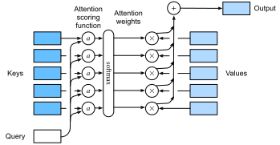

```{.python .input}
%load_ext d2lbook.tab
tab.interact_select('mxnet', 'pytorch', 'tensorflow', 'jax')
```

# Attention Scoring Functions
:label:`sec_attention-scoring-functions`


In :numref:`sec_attention-pooling`,
we used a number of different distance-based kernels, including a Gaussian kernel to model
interactions between queries and keys. As it turns out, distance functions are slightly more expensive to compute than inner products. As such, 
with the softmax operation to ensure nonnegative attention weights,
much of the work has gone into *attention scoring functions* $a$ in :eqref:`eq_softmax_attention` and :numref:`fig_attention_output` that are simpler to compute. 


:label:`fig_attention_output`

```{.python .input}
%%tab mxnet
import math
from d2l import mxnet as d2l
from mxnet import np, npx
from mxnet.gluon import nn
npx.set_np()
```

```{.python .input}
%%tab pytorch
from d2l import torch as d2l
import math
import torch
from torch import nn
```

```{.python .input}
%%tab tensorflow
from d2l import tensorflow as d2l
import tensorflow as tf
```

```{.python .input}
%%tab jax
from d2l import jax as d2l
from flax import linen as nn
from jax import numpy as jnp
import jax
import math
```

## [**Dot Product Attention**]


Let's review the attention function (without exponentiation) from the Gaussian kernel for a moment:

$$
\begin{aligned}
a(\mathbf{q}, \mathbf{k}_i) & = -\frac{1}{2} \|\mathbf{q} - \mathbf{k}_i\|^2  \\
& = \mathbf{q}^\top \mathbf{k}_i -\frac{1}{2} \|\mathbf{k}_i\|^2  -\frac{1}{2} \|\mathbf{q}\|^2.
\end{aligned}
$$

First, note that the last term depends on $\mathbf{q}$ only. As such it is identical for all $(\mathbf{q}, \mathbf{k}_i)$ pairs. Normalizing the attention weights to $1$, as is done in :eqref:`eq_softmax_attention`, ensures that this term disappears entirely. Second, note that both batch and layer normalization (to be discussed later) lead to activations that have well-bounded, and often constant norms $\|\mathbf{k}_i\| \approx \mathrm{const}$. This is the case, for instance, whenever the keys $\mathbf{k}_i$ were generated by a layer norm. As such, we can drop it from the definition of $a$ without any major change in the outcome. 

Last, we need to keep the order of magnitude of the arguments in the exponential function under control. Assume that all the elements of the query $\mathbf{q} \in \mathbb{R}^d$ and the key $\mathbf{k}_i \in \mathbb{R}^d$ are independent and identically drawn random variables with zero mean and unit variance. The dot product between both vectors has zero mean and a variance of $d$. To ensure that the variance of the dot product still remains one regardless of vector length, we use the *scaled dot-product attention* scoring function. That is, we rescale the dot-product by $1/\sqrt{d}$. We thus arrive at the first commonly used attention function that is used, e.g., in Transformers :cite:`Vaswani.Shazeer.Parmar.ea.2017`:

$$ a(\mathbf{q}, \mathbf{k}_i) = \mathbf{q}^\top \mathbf{k}_i / \sqrt{d}.$$
:eqlabel:`eq_dot_product_attention`

Note that attention weights $\alpha$ still need normalizing. We can simplify this further via :eqref:`eq_softmax_attention` by using the softmax operation:

$$\alpha(\mathbf{q}, \mathbf{k}_i) = \mathrm{softmax}(a(\mathbf{q}, \mathbf{k}_i)) = \frac{\exp(\mathbf{q}^\top \mathbf{k}_i / \sqrt{d})}{\sum_{j=1} \exp(\mathbf{q}^\top \mathbf{k}_j / \sqrt{d})}.$$
:eqlabel:`eq_attn-scoring-alpha`

As it turns out, all popular attention mechanisms use the softmax, hence we will limit ourselves to that in the remainder of this chapter.

## Convenience Functions

We need a few functions to make the attention mechanism efficient to deploy. This includes tools to deal with strings of variable lengths (common for natural language processing) and tools for efficient evaluation on minibatches (batch matrix multiplication). 


### [**Masked Softmax Operation**]

One of the most popular applications of the attention mechanism is to sequence models. Hence we need to be able to deal with sequences of different lengths. In some cases, such sequences may end up in the same minibatch, necessitating padding with dummy tokens for shorter sequences (see :numref:`sec_machine_translation` for an example). These special tokens do not carry meaning. For instance, assume that we have the following three sentences:

```
Dive  into  Deep    Learning 
Learn to    code    <blank>
Hello world <blank> <blank>
```


Since we do not want blanks in our attention model we simply need to limit $\sum_{i=1}^n \alpha(\mathbf{q}, \mathbf{k}_i) \mathbf{v}_i$ to $\sum_{i=1}^l \alpha(\mathbf{q}, \mathbf{k}_i) \mathbf{v}_i$ for however long $l \leq n$ the actual sentence is. Since it is such a common problem, it has a name: the *masked softmax operation*. 

Let's implement it. Actually, the implementation cheats ever so slightly by setting the values to zero $\mathbf{v}_i = 0$ for $i > l$. Moreover, it sets the attention weights to a large negative number, such as $-10^{6}$ in order to make their contribution to gradients and values vanish in practice. This is done since linear algebra kernels and operators are heavily optimized for GPUs and it is faster to be slightly wasteful in computation rather than to have code with conditional (if then else) statements.

```{.python .input}
%%tab mxnet
def masked_softmax(X, valid_lens):  #@save
    """Perform softmax operation by masking elements on the last axis."""
    # X: 3D tensor, valid_lens: 1D or 2D tensor
    if valid_lens is None:
        return npx.softmax(X)
    else:
        shape = X.shape
        if valid_lens.ndim == 1:
            valid_lens = valid_lens.repeat(shape[1])
        else:
            valid_lens = valid_lens.reshape(-1)
        # On the last axis, replace masked elements with a very large negative
        # value, whose exponentiation outputs 0
        X = npx.sequence_mask(X.reshape(-1, shape[-1]), valid_lens, True,
                              value=-1e6, axis=1)
        return npx.softmax(X).reshape(shape)
```

```{.python .input}
%%tab pytorch
def masked_softmax(X, valid_lens):  #@save
    """Perform softmax operation by masking elements on the last axis."""
    # X: 3D tensor, valid_lens: 1D or 2D tensor 
    def _sequence_mask(X, valid_len, value=0):
        maxlen = X.size(1)
        mask = torch.arange((maxlen), dtype=torch.float32,
                            device=X.device)[None, :] < valid_len[:, None]
        X[~mask] = value
        return X
    
    if valid_lens is None:
        return nn.functional.softmax(X, dim=-1)
    else:
        shape = X.shape
        if valid_lens.dim() == 1:
            valid_lens = torch.repeat_interleave(valid_lens, shape[1])
        else:
            valid_lens = valid_lens.reshape(-1)
        # On the last axis, replace masked elements with a very large negative
        # value, whose exponentiation outputs 0
        X = _sequence_mask(X.reshape(-1, shape[-1]), valid_lens, value=-1e6)
        return nn.functional.softmax(X.reshape(shape), dim=-1)
```

```{.python .input}
%%tab tensorflow
def masked_softmax(X, valid_lens):  #@save
    """Perform softmax operation by masking elements on the last axis."""
    # X: 3D tensor, valid_lens: 1D or 2D tensor
    def _sequence_mask(X, valid_len, value=0):
        maxlen = X.shape[1]
        mask = tf.range(start=0, limit=maxlen, dtype=tf.float32)[
            None, :] < tf.cast(valid_len[:, None], dtype=tf.float32)

        if len(X.shape) == 3:
            return tf.where(tf.expand_dims(mask, axis=-1), X, value)
        else:
            return tf.where(mask, X, value)
    
    if valid_lens is None:
        return tf.nn.softmax(X, axis=-1)
    else:
        shape = X.shape
        if len(valid_lens.shape) == 1:
            valid_lens = tf.repeat(valid_lens, repeats=shape[1])
            
        else:
            valid_lens = tf.reshape(valid_lens, shape=-1)
        # On the last axis, replace masked elements with a very large negative
        # value, whose exponentiation outputs 0    
        X = _sequence_mask(tf.reshape(X, shape=(-1, shape[-1])), valid_lens,
                           value=-1e6)    
        return tf.nn.softmax(tf.reshape(X, shape=shape), axis=-1)
```

```{.python .input}
%%tab jax
def masked_softmax(X, valid_lens):  #@save
    """Perform softmax operation by masking elements on the last axis."""
    # X: 3D tensor, valid_lens: 1D or 2D tensor
    def _sequence_mask(X, valid_len, value=0):
        maxlen = X.shape[1]
        mask = jnp.arange((maxlen),
                          dtype=jnp.float32)[None, :] < valid_len[:, None]
        return jnp.where(mask, X, value)

    if valid_lens is None:
        return nn.softmax(X, axis=-1)
    else:
        shape = X.shape
        if valid_lens.ndim == 1:
            valid_lens = jnp.repeat(valid_lens, shape[1])
        else:
            valid_lens = valid_lens.reshape(-1)
        # On the last axis, replace masked elements with a very large negative
        # value, whose exponentiation outputs 0
        X = _sequence_mask(X.reshape(-1, shape[-1]), valid_lens, value=-1e6)
        return nn.softmax(X.reshape(shape), axis=-1)
```

To [**illustrate how this function works**],
consider a minibatch of two examples of size $2 \times 4$,
where their valid lengths are $2$ and $3$, respectively. 
As a result of the masked softmax operation,
values beyond the valid lengths for each pair of vectors are all masked as zero.

```{.python .input}
%%tab mxnet
masked_softmax(np.random.uniform(size=(2, 2, 4)), d2l.tensor([2, 3]))
```

```{.python .input}
%%tab pytorch
masked_softmax(torch.rand(2, 2, 4), torch.tensor([2, 3]))
```

```{.python .input}
%%tab tensorflow
masked_softmax(tf.random.uniform(shape=(2, 2, 4)), tf.constant([2, 3]))
```

```{.python .input}
%%tab jax
masked_softmax(jax.random.uniform(d2l.get_key(), (2, 2, 4)), jnp.array([2, 3]))
```

If we need more fine-grained control to specify the valid length for each of the two vectors per example, we simply use a two-dimensional tensor of valid lengths. This yields:

```{.python .input}
%%tab mxnet
masked_softmax(np.random.uniform(size=(2, 2, 4)),
               d2l.tensor([[1, 3], [2, 4]]))
```

```{.python .input}
%%tab pytorch
masked_softmax(torch.rand(2, 2, 4), d2l.tensor([[1, 3], [2, 4]]))
```

```{.python .input}
%%tab tensorflow
masked_softmax(tf.random.uniform((2, 2, 4)), tf.constant([[1, 3], [2, 4]]))
```

```{.python .input}
%%tab jax
masked_softmax(jax.random.uniform(d2l.get_key(), (2, 2, 4)),
               jnp.array([[1, 3], [2, 4]]))
```

### Batch Matrix Multiplication
:label:`subsec_batch_dot`

Another commonly used operation is to multiply batches of matrices with another. This comes in handy when we have minibatches of queries, keys, and values. More specifically, assume that 

$$\mathbf{Q} = [\mathbf{Q}_1, \mathbf{Q}_2, \ldots, \mathbf{Q}_n]  \in \mathbb{R}^{n \times a \times b} \\
    \mathbf{K} = [\mathbf{K}_1, \mathbf{K}_2, \ldots, \mathbf{K}_n]  \in \mathbb{R}^{n \times b \times c} 
$$

Then the batch matrix multiplication (BMM) computes the element-wise product

$$\mathrm{BMM}(\mathbf{Q}, \mathbf{K}) = [\mathbf{Q}_1 \mathbf{K}_1, \mathbf{Q}_2 \mathbf{K}_2, \ldots, \mathbf{Q}_n \mathbf{K}_n] \in \mathbb{R}^{n \times a \times c}.$$
:eqlabel:`eq_batch-matrix-mul`

Let's see this in action in a deep learning framework.

```{.python .input}
%%tab mxnet
Q = d2l.ones((2, 3, 4))
K = d2l.ones((2, 4, 6))
d2l.check_shape(npx.batch_dot(Q, K), (2, 3, 6))
```

```{.python .input}
%%tab pytorch
Q = d2l.ones((2, 3, 4))
K = d2l.ones((2, 4, 6))
d2l.check_shape(torch.bmm(Q, K), (2, 3, 6))
```

```{.python .input}
%%tab tensorflow
Q = d2l.ones((2, 3, 4))
K = d2l.ones((2, 4, 6))
d2l.check_shape(tf.matmul(Q, K).numpy(), (2, 3, 6))
```

```{.python .input}
%%tab jax
Q = d2l.ones((2, 3, 4))
K = d2l.ones((2, 4, 6))
d2l.check_shape(jax.lax.batch_matmul(Q, K), (2, 3, 6))
```

## [**Scaled Dot-Product Attention**]

Let's return to the dot-product attention introduced in :eqref:`eq_dot_product_attention`. 
In general, it requires that both the query and the key
have the same vector length, say $d$, even though this can be addressed easily by replacing 
$\mathbf{q}^\top \mathbf{k}$ with $\mathbf{q}^\top \mathbf{M} \mathbf{k}$ where $\mathbf{M}$ is a suitably chosen matrix to translate between both spaces. For now assume that the dimensions match. 

In practice, we often think in minibatches for efficiency,
such as computing attention for $n$ queries and $m$ key-value pairs,
where queries and keys are of length $d$
and values are of length $v$. The scaled dot-product attention 
of queries $\mathbf Q\in\mathbb R^{n\times d}$,
keys $\mathbf K\in\mathbb R^{m\times d}$,
and values $\mathbf V\in\mathbb R^{m\times v}$
thus can be written as 

$$ \mathrm{softmax}\left(\frac{\mathbf Q \mathbf K^\top }{\sqrt{d}}\right) \mathbf V \in \mathbb{R}^{n\times v}.$$
:eqlabel:`eq_softmax_QK_V`

Note that when applying this to a minibatch, we need the batch matrix multiplication introduced in :eqref:`eq_batch-matrix-mul`. In the following implementation of the scaled dot product attention,
we use dropout for model regularization.

```{.python .input}
%%tab mxnet
class DotProductAttention(nn.Block):  #@save
    """Scaled dot product attention."""
    def __init__(self, dropout):
        super().__init__()
        self.dropout = nn.Dropout(dropout)

    # Shape of queries: (batch_size, no. of queries, d)
    # Shape of keys: (batch_size, no. of key-value pairs, d)
    # Shape of values: (batch_size, no. of key-value pairs, value dimension)
    # Shape of valid_lens: (batch_size,) or (batch_size, no. of queries)
    def forward(self, queries, keys, values, valid_lens=None):
        d = queries.shape[-1]
        # Set transpose_b=True to swap the last two dimensions of keys
        scores = npx.batch_dot(queries, keys, transpose_b=True) / math.sqrt(d)
        self.attention_weights = masked_softmax(scores, valid_lens)
        return npx.batch_dot(self.dropout(self.attention_weights), values)
```

```{.python .input}
%%tab pytorch
class DotProductAttention(nn.Module):  #@save
    """Scaled dot product attention."""
    def __init__(self, dropout):
        super().__init__()
        self.dropout = nn.Dropout(dropout)

    # Shape of queries: (batch_size, no. of queries, d)
    # Shape of keys: (batch_size, no. of key-value pairs, d)
    # Shape of values: (batch_size, no. of key-value pairs, value dimension)
    # Shape of valid_lens: (batch_size,) or (batch_size, no. of queries)
    def forward(self, queries, keys, values, valid_lens=None):
        d = queries.shape[-1]
        # Swap the last two dimensions of keys with keys.transpose(1, 2)
        scores = torch.bmm(queries, keys.transpose(1, 2)) / math.sqrt(d)
        self.attention_weights = masked_softmax(scores, valid_lens)
        return torch.bmm(self.dropout(self.attention_weights), values)
```

```{.python .input}
%%tab tensorflow
class DotProductAttention(tf.keras.layers.Layer):  #@save
    """Scaled dot product attention."""
    def __init__(self, dropout):
        super().__init__()
        self.dropout = tf.keras.layers.Dropout(dropout)
        
    # Shape of queries: (batch_size, no. of queries, d)
    # Shape of keys: (batch_size, no. of key-value pairs, d)
    # Shape of values: (batch_size, no. of key-value pairs, value dimension)
    # Shape of valid_lens: (batch_size,) or (batch_size, no. of queries)
    def call(self, queries, keys, values, valid_lens=None, **kwargs):
        d = queries.shape[-1]
        scores = tf.matmul(queries, keys, transpose_b=True)/tf.math.sqrt(
            tf.cast(d, dtype=tf.float32))
        self.attention_weights = masked_softmax(scores, valid_lens)
        return tf.matmul(self.dropout(self.attention_weights, **kwargs), values)
```

```{.python .input}
%%tab jax
class DotProductAttention(nn.Module):  #@save
    """Scaled dot product attention."""
    dropout: float

    # Shape of queries: (batch_size, no. of queries, d)
    # Shape of keys: (batch_size, no. of key-value pairs, d)
    # Shape of values: (batch_size, no. of key-value pairs, value dimension)
    # Shape of valid_lens: (batch_size,) or (batch_size, no. of queries)
    @nn.compact
    def __call__(self, queries, keys, values, valid_lens=None,
                 training=False):
        d = queries.shape[-1]
        # Swap the last two dimensions of keys with keys.swapaxes(1, 2)
        scores = queries@(keys.swapaxes(1, 2)) / math.sqrt(d)
        attention_weights = masked_softmax(scores, valid_lens)
        dropout_layer = nn.Dropout(self.dropout, deterministic=not training)
        return dropout_layer(attention_weights)@values, attention_weights
```

To [**illustrate how the `DotProductAttention` class works**],
we use the same keys, values, and valid lengths from the earlier toy example for additive attention. For the purpose of our example we assume that we have a minibatch size of $2$, a total of $10$ keys and values, and that the dimensionality of the values is $4$. Lastly, we assume that the valid length per observation is $2$ and $6$ respectively. Given that, we expect the output to be a $2 \times 1 \times 4$ tensor, i.e., one row per example of the minibatch.

```{.python .input}
%%tab mxnet
queries = d2l.normal(0, 1, (2, 1, 2))
keys = d2l.normal(0, 1, (2, 10, 2))
values = d2l.normal(0, 1, (2, 10, 4))
valid_lens = d2l.tensor([2, 6])

attention = DotProductAttention(dropout=0.5)
attention.initialize()
d2l.check_shape(attention(queries, keys, values, valid_lens), (2, 1, 4))
```

```{.python .input}
%%tab pytorch
queries = d2l.normal(0, 1, (2, 1, 2))
keys = d2l.normal(0, 1, (2, 10, 2))
values = d2l.normal(0, 1, (2, 10, 4))
valid_lens = d2l.tensor([2, 6])

attention = DotProductAttention(dropout=0.5)
attention.eval()
d2l.check_shape(attention(queries, keys, values, valid_lens), (2, 1, 4))
```

```{.python .input}
%%tab tensorflow
queries = tf.random.normal(shape=(2, 1, 2))
keys = tf.random.normal(shape=(2, 10, 2))
values = tf.random.normal(shape=(2, 10, 4))
valid_lens = tf.constant([2, 6])

attention = DotProductAttention(dropout=0.5)
d2l.check_shape(attention(queries, keys, values, valid_lens, training=False),
                (2, 1, 4))
```

```{.python .input}
%%tab jax
queries = jax.random.normal(d2l.get_key(), (2, 1, 2))
keys = jax.random.normal(d2l.get_key(), (2, 10, 2))
values = jax.random.normal(d2l.get_key(), (2, 10, 4))
valid_lens = d2l.tensor([2, 6])

attention = DotProductAttention(dropout=0.5)
(output, attention_weights), params = attention.init_with_output(
    d2l.get_key(), queries, keys, values, valid_lens)
print(output)
```

Let's check whether the attention weights actually vanish for anything beyond the second and sixth column respectively (due to setting valid length to $2$ and $6$).

```{.python .input}
%%tab pytorch, mxnet, tensorflow
d2l.show_heatmaps(d2l.reshape(attention.attention_weights, (1, 1, 2, 10)),
                  xlabel='Keys', ylabel='Queries')
```

```{.python .input}
%%tab jax
d2l.show_heatmaps(d2l.reshape(attention_weights, (1, 1, 2, 10)),
                  xlabel='Keys', ylabel='Queries')
```

## [**Additive Attention**]
:label:`subsec_additive-attention`

When queries $\mathbf{q}$ and keys $\mathbf{k}$ are vectors of different dimensionalities,
we can either use a matrix to address the mismatch via $\mathbf{q}^\top \mathbf{M} \mathbf{k}$, or we can use additive attention 
as the scoring function. Another benefit is that, as its name indicates, the attention is additive. This can lead to some minor computational savings. 
Given a query $\mathbf{q} \in \mathbb{R}^q$
and a key $\mathbf{k} \in \mathbb{R}^k$,
the *additive attention* scoring function :cite:`Bahdanau.Cho.Bengio.2014` is given by 

$$a(\mathbf q, \mathbf k) = \mathbf w_v^\top \text{tanh}(\mathbf W_q\mathbf q + \mathbf W_k \mathbf k) \in \mathbb{R},$$
:eqlabel:`eq_additive-attn`

where $\mathbf W_q\in\mathbb R^{h\times q}$, $\mathbf W_k\in\mathbb R^{h\times k}$, 
and $\mathbf w_v\in\mathbb R^{h}$ are the learnable parameters. This term is then fed into a softmax to ensure both nonnegativity and normalization. 
An equivalent interpretation of :eqref:`eq_additive-attn` is that the query and key are concatenated
and fed into an MLP with a single hidden layer. 
Using $\tanh$ as the activation function and disabling bias terms, 
we implement additive attention as follows:

```{.python .input}
%%tab mxnet
class AdditiveAttention(nn.Block):  #@save
    """Additive attention."""
    def __init__(self, num_hiddens, dropout, **kwargs):
        super(AdditiveAttention, self).__init__(**kwargs)
        # Use flatten=False to only transform the last axis so that the
        # shapes for the other axes are kept the same
        self.W_k = nn.Dense(num_hiddens, use_bias=False, flatten=False)
        self.W_q = nn.Dense(num_hiddens, use_bias=False, flatten=False)
        self.w_v = nn.Dense(1, use_bias=False, flatten=False)
        self.dropout = nn.Dropout(dropout)

    def forward(self, queries, keys, values, valid_lens):
        queries, keys = self.W_q(queries), self.W_k(keys)
        # After dimension expansion, shape of queries: (batch_size, no. of
        # queries, 1, num_hiddens) and shape of keys: (batch_size, 1,
        # no. of key-value pairs, num_hiddens). Sum them up with
        # broadcasting
        features = np.expand_dims(queries, axis=2) + np.expand_dims(
            keys, axis=1)
        features = np.tanh(features)
        # There is only one output of self.w_v, so we remove the last
        # one-dimensional entry from the shape. Shape of scores:
        # (batch_size, no. of queries, no. of key-value pairs)
        scores = np.squeeze(self.w_v(features), axis=-1)
        self.attention_weights = masked_softmax(scores, valid_lens)
        # Shape of values: (batch_size, no. of key-value pairs, value
        # dimension)
        return npx.batch_dot(self.dropout(self.attention_weights), values)
```

```{.python .input}
%%tab pytorch
class AdditiveAttention(nn.Module):  #@save
    """Additive attention."""
    def __init__(self, num_hiddens, dropout, **kwargs):
        super(AdditiveAttention, self).__init__(**kwargs)
        self.W_k = nn.LazyLinear(num_hiddens, bias=False)
        self.W_q = nn.LazyLinear(num_hiddens, bias=False)
        self.w_v = nn.LazyLinear(1, bias=False)
        self.dropout = nn.Dropout(dropout)

    def forward(self, queries, keys, values, valid_lens):
        queries, keys = self.W_q(queries), self.W_k(keys)
        # After dimension expansion, shape of queries: (batch_size, no. of
        # queries, 1, num_hiddens) and shape of keys: (batch_size, 1, no. of
        # key-value pairs, num_hiddens). Sum them up with broadcasting
        features = queries.unsqueeze(2) + keys.unsqueeze(1)
        features = torch.tanh(features)
        # There is only one output of self.w_v, so we remove the last
        # one-dimensional entry from the shape. Shape of scores: (batch_size,
        # no. of queries, no. of key-value pairs)
        scores = self.w_v(features).squeeze(-1)
        self.attention_weights = masked_softmax(scores, valid_lens)
        # Shape of values: (batch_size, no. of key-value pairs, value
        # dimension)
        return torch.bmm(self.dropout(self.attention_weights), values)
```

```{.python .input}
%%tab tensorflow
class AdditiveAttention(tf.keras.layers.Layer):  #@save
    """Additive attention."""
    def __init__(self, key_size, query_size, num_hiddens, dropout, **kwargs):
        super().__init__(**kwargs)
        self.W_k = tf.keras.layers.Dense(num_hiddens, use_bias=False)
        self.W_q = tf.keras.layers.Dense(num_hiddens, use_bias=False)
        self.w_v = tf.keras.layers.Dense(1, use_bias=False)
        self.dropout = tf.keras.layers.Dropout(dropout)
        
    def call(self, queries, keys, values, valid_lens, **kwargs):
        queries, keys = self.W_q(queries), self.W_k(keys)
        # After dimension expansion, shape of queries: (batch_size, no. of
        # queries, 1, num_hiddens) and shape of keys: (batch_size, 1, no. of
        # key-value pairs, num_hiddens). Sum them up with broadcasting
        features = tf.expand_dims(queries, axis=2) + tf.expand_dims(
            keys, axis=1)
        features = tf.nn.tanh(features)
        # There is only one output of self.w_v, so we remove the last
        # one-dimensional entry from the shape. Shape of scores: (batch_size,
        # no. of queries, no. of key-value pairs)
        scores = tf.squeeze(self.w_v(features), axis=-1)
        self.attention_weights = masked_softmax(scores, valid_lens)
        # Shape of values: (batch_size, no. of key-value pairs, value
        # dimension)
        return tf.matmul(self.dropout(
            self.attention_weights, **kwargs), values)
```

```{.python .input}
%%tab jax
class AdditiveAttention(nn.Module):  #@save
    num_hiddens: int
    dropout: float

    def setup(self):
        self.W_k = nn.Dense(self.num_hiddens, use_bias=False)
        self.W_q = nn.Dense(self.num_hiddens, use_bias=False)
        self.w_v = nn.Dense(1, use_bias=False)

    @nn.compact
    def __call__(self, queries, keys, values, valid_lens, training=False):
        queries, keys = self.W_q(queries), self.W_k(keys)
        # After dimension expansion, shape of queries: (batch_size, no. of
        # queries, 1, num_hiddens) and shape of keys: (batch_size, 1, no. of
        # key-value pairs, num_hiddens). Sum them up with broadcasting
        features = jnp.expand_dims(queries, axis=2) + jnp.expand_dims(keys, axis=1)
        features = nn.tanh(features)
        # There is only one output of self.w_v, so we remove the last
        # one-dimensional entry from the shape. Shape of scores: (batch_size,
        # no. of queries, no. of key-value pairs)
        scores = self.w_v(features).squeeze(-1)
        attention_weights = masked_softmax(scores, valid_lens)
        dropout_layer = nn.Dropout(self.dropout, deterministic=not training)
        # Shape of values: (batch_size, no. of key-value pairs, value
        # dimension)
        return dropout_layer(attention_weights)@values, attention_weights
```

Let's [**see how `AdditiveAttention` works**]. In our toy example we pick queries, keys and values of size 
$(2, 1, 20)$, $(2, 10, 2)$ and $(2, 10, 4)$, respectively. This is identical to our choice for `DotProductAttention`, except that now the queries are $20$-dimensional. Likewise, we pick $(2, 6)$ as the valid lengths for the sequences in the minibatch.

```{.python .input}
%%tab mxnet
queries = d2l.normal(0, 1, (2, 1, 20))

attention = AdditiveAttention(num_hiddens=8, dropout=0.1)
attention.initialize()
d2l.check_shape(attention(queries, keys, values, valid_lens), (2, 1, 4))
```

```{.python .input}
%%tab pytorch
queries = d2l.normal(0, 1, (2, 1, 20))

attention = AdditiveAttention(num_hiddens=8, dropout=0.1)
attention.eval()
d2l.check_shape(attention(queries, keys, values, valid_lens), (2, 1, 4))
```

```{.python .input}
%%tab tensorflow
queries = tf.random.normal(shape=(2, 1, 20))

attention = AdditiveAttention(key_size=2, query_size=20, num_hiddens=8,
                              dropout=0.1)
d2l.check_shape(attention(queries, keys, values, valid_lens, training=False),
                (2, 1, 4))
```

```{.python .input}
%%tab jax
queries = jax.random.normal(d2l.get_key(), (2, 1, 20))
attention = AdditiveAttention(num_hiddens=8, dropout=0.1)
(output, attention_weights), params = attention.init_with_output(
    d2l.get_key(), queries, keys, values, valid_lens)
print(output)
```

When reviewing the attention function we see a behavior that is qualitatively quite similar to that from `DotProductAttention`. That is, only terms within the chosen valid length $(2, 6)$ are nonzero.

```{.python .input}
%%tab pytorch, mxnet, tensorflow
d2l.show_heatmaps(d2l.reshape(attention.attention_weights, (1, 1, 2, 10)),
                  xlabel='Keys', ylabel='Queries')
```

```{.python .input}
%%tab jax
d2l.show_heatmaps(d2l.reshape(attention_weights, (1, 1, 2, 10)),
                  xlabel='Keys', ylabel='Queries')
```

## Summary

In this section we introduced the two key attention scoring functions: dot product and additive attention. They are effective tools for aggregating across sequences of variable length. In particular, the dot product attention is the mainstay of modern Transformer architectures. When queries and keys are vectors of different lengths,
we can use the additive attention scoring function instead. Optimizing these layers is one of the key areas of advance in recent years. For instance, [Nvidia's Transformer Library](https://docs.nvidia.com/deeplearning/transformer-engine/user-guide/index.html) and Megatron :cite:`shoeybi2019megatron` crucially rely on efficient variants of the attention mechanism. We will dive into this in quite a bit more detail as we review Transformers in later sections. 

## Exercises

1. Implement distance-based attention by modifying the `DotProductAttention` code. Note that you only need the squared norms of the keys $\|\mathbf{k}_i\|^2$ for an efficient implementation. 
1. Modify the dot product attention to allow for queries and keys of different dimensionalities by employing a matrix to adjust dimensions. 
1. How does the computational cost scale with the dimensionality of the keys, queries, values, and their number? What about the memory bandwidth requirements?

:begin_tab:`mxnet`
[Discussions](https://discuss.d2l.ai/t/346)
:end_tab:

:begin_tab:`pytorch`
[Discussions](https://discuss.d2l.ai/t/1064)
:end_tab:

:begin_tab:`tensorflow`
[Discussions](https://discuss.d2l.ai/t/3867)
:end_tab:
