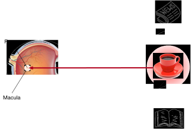
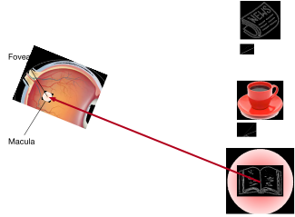
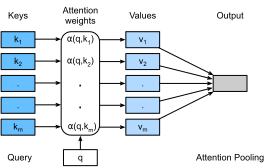

# Attention Cues
:label:`sec_attention-cues`

Thank you for your attention
to this book.
Attention is a scarce resource:
at the moment
you are reading this book
and ignoring the rest.
Thus, similar to money,
your attention is being paid with an opportunity cost.
To ensure that your investment of attention
right now is worthwhile,
we have been highly motivated to pay our attention carefully
to produce a nice book.
Attention
is the keystone in the arch of life and
holds the key to any work's exceptionalism.


Since economics studies the allocation of scarce resources,
we are
in the era of the attention economy,
where human attention is treated as a limited, valuable, and scarce commodity
that can be exchanged.
Numerous business models have been
developed to capitalize on it.
On music or video streaming services,
we either pay attention to their ads
or pay money to hide them.
For growth in the world of online games,
we either pay attention to
participate in battles, which attract new gamers,
or pay money to instantly become powerful.
Nothing comes for free.

All in all,
information in our environment is not scarce,
attention is.
When inspecting a visual scene,
our optic nerve receives information
at the order of $10^8$ bits per second,
far exceeding what our brain can fully process.
Fortunately,
our ancestors had learned from experience (also known as data)
that *not all sensory inputs are created equal*.
Throughout human history,
the capability of directing attention
to only a fraction of information of interest
has enabled our brain
to allocate resources more smartly
to survive, to grow, and to socialize,
such as detecting predators, preys, and mates.


## Attention Cues in Biology

To explain how our attention is deployed in the visual world,
a two-component framework has emerged
and been pervasive.
This idea dates back to William James in the 1890s,
who is considered the "Father of American psychology" :cite:`James.2007`.
In this framework,
subjects selectively direct the spotlight of attention
using both the *nonvolitional cue* and *volitional cue*.

The nonvolitional cue is based on
the saliency and conspicuity of objects in the environment.
Imagine there are five objects in front of you:
a newspaper, a research paper, a cup of coffee, a notebook, and a book such as in :numref:`fig_eye-coffee`.
While all the paper products are printed in black and white,
the coffee cup is red.
In other words,
this coffee is intrinsically salient and conspicuous in
this visual environment,
automatically and involuntarily drawing attention.
So you bring the fovea (the center of the macula where visual acuity is highest) onto the coffee as shown in :numref:`fig_eye-coffee`.


:width:`400px`
:label:`fig_eye-coffee`

After drinking coffee,
you become caffeinated and
want to read a book.
So you turn your head, refocus your eyes,
and look at the book as depicted in :numref:`fig_eye-book`.
Different from
the case in :numref:`fig_eye-coffee`
where the coffee biases you towards
selecting based on saliency,
in this task-dependent case you select the book under
cognitive and volitional control.
Using the volitional cue based on variable selection criteria,
this form of attention is more deliberate.
It is also more powerful with the subject's voluntary effort.


:width:`400px`
:label:`fig_eye-book`


## Queries, Keys, and Values

Inspired by the nonvolitional and volitional attention cues that explain the attentional deployment,
in the following we will
describe a framework for
designing attention mechanisms
by incorporating these two attention cues.

To begin with, consider the simpler case where only
nonvolitional cues are available.
To bias selection over sensory inputs,
we can simply use
a parameterized fully-connected layer
or even non-parameterized
max or average pooling.

Therefore,
what sets attention mechanisms
apart from those fully-connected layers
or pooling layers
is the inclusion of the volitional cues.
In the context of attention mechanisms,
we refer to volitional cues as *queries*.
Given any query,
attention mechanisms
bias selection over sensory inputs (e.g., intermediate feature representations)
via *attention pooling*.
These sensory inputs are called *values* in the context of attention mechanisms.
More generally,
every value is paired with a *key*,
which can be thought of the nonvolitional cue of that sensory input.
As shown in :numref:`fig_qkv`,
we can design attention pooling
so that the given query (volitional cue) can interact with keys (nonvolitional cues),
which guides bias selection over values (sensory inputs).


:label:`fig_qkv`

Note that there are many alternatives for the design of attention mechanisms.
For instance,
we can design a non-differentiable attention model
that can be trained using reinforcement learning methods :cite:`Mnih.Heess.Graves.ea.2014`.
Given the dominance of the framework in :numref:`fig_qkv`,
models under this framework
will be the center of our attention in this chapter.


## Visualization of Attention

Average pooling
can be treated as a weighted average of inputs,
where weights are uniform.
In practice,
attention pooling aggregates values using weighted average, where weights are computed between the given query and different keys.

```python
import math
from d2l import mxnet as d2l
from mxnet import np, npx
npx.set_np()
```


```python
#@tab pytorch
from d2l import torch as d2l
import torch
```


```{.python .input  n=4}
#@tab tensorflow
from d2l import tensorflow as d2l
import tensorflow as tf
```

To visualize attention weights,
we define the `show_heatmaps` function.
Its input `matrices` has the shape (number of rows for display, number of columns for display, number of queries, number of keys).

```{.python .input  n=5}
#@tab all
#@save
def show_heatmaps(matrices, xlabel, ylabel, titles=None, figsize=(2.5, 2.5),
                  cmap='Reds'):
    d2l.use_svg_display()
    num_rows, num_cols = matrices.shape[0], matrices.shape[1]
    fig, axes = d2l.plt.subplots(num_rows, num_cols, figsize=figsize,
                                 sharex=True, sharey=True, squeeze=False)
    for i, (row_axes, row_matrices) in enumerate(zip(axes, matrices)):
        for j, (ax, matrix) in enumerate(zip(row_axes, row_matrices)):
            pcm = ax.imshow(d2l.numpy(matrix), cmap=cmap)
            if i == num_rows - 1:
                ax.set_xlabel(xlabel)
            if j == 0:
                ax.set_ylabel(ylabel)
            if titles:
                ax.set_title(titles[j])
    fig.colorbar(pcm, ax=axes, shrink=0.6);
```

For demonstration,
we consider a simple case where
the attention weight is one only when the query and the key are the same; otherwise it is zero.

```{.python .input  n=6}
#@tab all
attention_weights = d2l.reshape(d2l.eye(10),[1, 1, 10, 10])
show_heatmaps(attention_weights, xlabel='Keys', ylabel='Queries')
```

```{.json .output n=6}
[
 {
  "data": {
   "image/svg+xml": "<?xml version=\"1.0\" encoding=\"utf-8\" standalone=\"no\"?>\n<!DOCTYPE svg PUBLIC \"-//W3C//DTD SVG 1.1//EN\"\n  \"http://www.w3.org/Graphics/SVG/1.1/DTD/svg11.dtd\">\n<!-- Created with matplotlib (https://matplotlib.org/) -->\n<svg height=\"156.35625pt\" version=\"1.1\" viewBox=\"0 0 193.35825 156.35625\" width=\"193.35825pt\" xmlns=\"http://www.w3.org/2000/svg\" xmlns:xlink=\"http://www.w3.org/1999/xlink\">\n <metadata>\n  <rdf:RDF xmlns:cc=\"http://creativecommons.org/ns#\" xmlns:dc=\"http://purl.org/dc/elements/1.1/\" xmlns:rdf=\"http://www.w3.org/1999/02/22-rdf-syntax-ns#\">\n   <cc:Work>\n    <dc:type rdf:resource=\"http://purl.org/dc/dcmitype/StillImage\"/>\n    <dc:date>2021-01-09T03:28:20.159342</dc:date>\n    <dc:format>image/svg+xml</dc:format>\n    <dc:creator>\n     <cc:Agent>\n      <dc:title>Matplotlib v3.3.3, https://matplotlib.org/</dc:title>\n     </cc:Agent>\n    </dc:creator>\n   </cc:Work>\n  </rdf:RDF>\n </metadata>\n <defs>\n  <style type=\"text/css\">*{stroke-linecap:butt;stroke-linejoin:round;}</style>\n </defs>\n <g id=\"figure_1\">\n  <g id=\"patch_1\">\n   <path d=\"M -0 156.35625 \nL 193.35825 156.35625 \nL 193.35825 0 \nL -0 0 \nz\n\" style=\"fill:none;\"/>\n  </g>\n  <g id=\"axes_1\">\n   <g id=\"patch_2\">\n    <path d=\"M 34.240625 118.8 \nL 145.840625 118.8 \nL 145.840625 7.2 \nL 34.240625 7.2 \nz\n\" style=\"fill:#ffffff;\"/>\n   </g>\n   <g clip-path=\"url(#p4b114f85e0)\">\n    <image height=\"112\" id=\"image034fa2c4b5\" transform=\"scale(1 -1)translate(0 -112)\" width=\"112\" x=\"34.240625\" xlink:href=\"data:image/png;base64,\niVBORw0KGgoAAAANSUhEUgAAAHAAAABwCAYAAADG4PRLAAABc0lEQVR4nO3dsW3CUBhGURPRJSNkPxgpA2YAGmqnpfRDMnnXnFO7sHT1N58s+bTeb+vCVK6f35uf/djxPXgBAeMEjBMwTsA4AeMEjBMwTsA4AePO//0C72JkHvu5/25+1gXGCRgnYJyAcQLGCRgnYJyAcQLGCRhnSnvSyDS2LGPz2AgXGCdgnIBxAsYJGCdgnIBxAsYJGCdgnIBxttAHe336tycXGCdgnIBxAsYJGCdgnIBxAsYJGCdg3OGntOI8NsIFxgkYJ2CcgHECxgkYJ2CcgHECxgkYl5zSjj6PjXCBcQLGCRgnYJyAcQLGCRgnYJyAcQLGTTOlmcee4wLjBIwTME7AOAHjBIwTME7AOAHjBIzbbUqb5b8KR+cC4wSMEzBOwDgB4wSMEzBOwDgB4wSMEzBuaAv16d98XGCcgHECxgkYJ2CcgHECxgkYJ2CcgHGny/K1bn3YPDYfFxgnYJyAcQLGCRgnYJyAcQLGCRgnYNwfkEghRAiKZdAAAAAASUVORK5CYII=\" y=\"-6.8\"/>\n   </g>\n   <g id=\"matplotlib.axis_1\">\n    <g id=\"xtick_1\">\n     <g id=\"line2d_1\">\n      <defs>\n       <path d=\"M 0 0 \nL 0 3.5 \n\" id=\"ma8aedbd7f9\" style=\"stroke:#000000;stroke-width:0.8;\"/>\n      </defs>\n      <g>\n       <use style=\"stroke:#000000;stroke-width:0.8;\" x=\"39.820625\" xlink:href=\"#ma8aedbd7f9\" y=\"118.8\"/>\n      </g>\n     </g>\n     <g id=\"text_1\">\n      <!-- 0 -->\n      <g transform=\"translate(36.639375 133.398438)scale(0.1 -0.1)\">\n       <defs>\n        <path d=\"M 31.78125 66.40625 \nQ 24.171875 66.40625 20.328125 58.90625 \nQ 16.5 51.421875 16.5 36.375 \nQ 16.5 21.390625 20.328125 13.890625 \nQ 24.171875 6.390625 31.78125 6.390625 \nQ 39.453125 6.390625 43.28125 13.890625 \nQ 47.125 21.390625 47.125 36.375 \nQ 47.125 51.421875 43.28125 58.90625 \nQ 39.453125 66.40625 31.78125 66.40625 \nz\nM 31.78125 74.21875 \nQ 44.046875 74.21875 50.515625 64.515625 \nQ 56.984375 54.828125 56.984375 36.375 \nQ 56.984375 17.96875 50.515625 8.265625 \nQ 44.046875 -1.421875 31.78125 -1.421875 \nQ 19.53125 -1.421875 13.0625 8.265625 \nQ 6.59375 17.96875 6.59375 36.375 \nQ 6.59375 54.828125 13.0625 64.515625 \nQ 19.53125 74.21875 31.78125 74.21875 \nz\n\" id=\"DejaVuSans-48\"/>\n       </defs>\n       <use xlink:href=\"#DejaVuSans-48\"/>\n      </g>\n     </g>\n    </g>\n    <g id=\"xtick_2\">\n     <g id=\"line2d_2\">\n      <g>\n       <use style=\"stroke:#000000;stroke-width:0.8;\" x=\"95.620625\" xlink:href=\"#ma8aedbd7f9\" y=\"118.8\"/>\n      </g>\n     </g>\n     <g id=\"text_2\">\n      <!-- 5 -->\n      <g transform=\"translate(92.439375 133.398438)scale(0.1 -0.1)\">\n       <defs>\n        <path d=\"M 10.796875 72.90625 \nL 49.515625 72.90625 \nL 49.515625 64.59375 \nL 19.828125 64.59375 \nL 19.828125 46.734375 \nQ 21.96875 47.46875 24.109375 47.828125 \nQ 26.265625 48.1875 28.421875 48.1875 \nQ 40.625 48.1875 47.75 41.5 \nQ 54.890625 34.8125 54.890625 23.390625 \nQ 54.890625 11.625 47.5625 5.09375 \nQ 40.234375 -1.421875 26.90625 -1.421875 \nQ 22.3125 -1.421875 17.546875 -0.640625 \nQ 12.796875 0.140625 7.71875 1.703125 \nL 7.71875 11.625 \nQ 12.109375 9.234375 16.796875 8.0625 \nQ 21.484375 6.890625 26.703125 6.890625 \nQ 35.15625 6.890625 40.078125 11.328125 \nQ 45.015625 15.765625 45.015625 23.390625 \nQ 45.015625 31 40.078125 35.4375 \nQ 35.15625 39.890625 26.703125 39.890625 \nQ 22.75 39.890625 18.8125 39.015625 \nQ 14.890625 38.140625 10.796875 36.28125 \nz\n\" id=\"DejaVuSans-53\"/>\n       </defs>\n       <use xlink:href=\"#DejaVuSans-53\"/>\n      </g>\n     </g>\n    </g>\n    <g id=\"text_3\">\n     <!-- Keys -->\n     <g transform=\"translate(78.371094 147.076563)scale(0.1 -0.1)\">\n      <defs>\n       <path d=\"M 9.8125 72.90625 \nL 19.671875 72.90625 \nL 19.671875 42.09375 \nL 52.390625 72.90625 \nL 65.09375 72.90625 \nL 28.90625 38.921875 \nL 67.671875 0 \nL 54.6875 0 \nL 19.671875 35.109375 \nL 19.671875 0 \nL 9.8125 0 \nz\n\" id=\"DejaVuSans-75\"/>\n       <path d=\"M 56.203125 29.59375 \nL 56.203125 25.203125 \nL 14.890625 25.203125 \nQ 15.484375 15.921875 20.484375 11.0625 \nQ 25.484375 6.203125 34.421875 6.203125 \nQ 39.59375 6.203125 44.453125 7.46875 \nQ 49.3125 8.734375 54.109375 11.28125 \nL 54.109375 2.78125 \nQ 49.265625 0.734375 44.1875 -0.34375 \nQ 39.109375 -1.421875 33.890625 -1.421875 \nQ 20.796875 -1.421875 13.15625 6.1875 \nQ 5.515625 13.8125 5.515625 26.8125 \nQ 5.515625 40.234375 12.765625 48.109375 \nQ 20.015625 56 32.328125 56 \nQ 43.359375 56 49.78125 48.890625 \nQ 56.203125 41.796875 56.203125 29.59375 \nz\nM 47.21875 32.234375 \nQ 47.125 39.59375 43.09375 43.984375 \nQ 39.0625 48.390625 32.421875 48.390625 \nQ 24.90625 48.390625 20.390625 44.140625 \nQ 15.875 39.890625 15.1875 32.171875 \nz\n\" id=\"DejaVuSans-101\"/>\n       <path d=\"M 32.171875 -5.078125 \nQ 28.375 -14.84375 24.75 -17.8125 \nQ 21.140625 -20.796875 15.09375 -20.796875 \nL 7.90625 -20.796875 \nL 7.90625 -13.28125 \nL 13.1875 -13.28125 \nQ 16.890625 -13.28125 18.9375 -11.515625 \nQ 21 -9.765625 23.484375 -3.21875 \nL 25.09375 0.875 \nL 2.984375 54.6875 \nL 12.5 54.6875 \nL 29.59375 11.921875 \nL 46.6875 54.6875 \nL 56.203125 54.6875 \nz\n\" id=\"DejaVuSans-121\"/>\n       <path d=\"M 44.28125 53.078125 \nL 44.28125 44.578125 \nQ 40.484375 46.53125 36.375 47.5 \nQ 32.28125 48.484375 27.875 48.484375 \nQ 21.1875 48.484375 17.84375 46.4375 \nQ 14.5 44.390625 14.5 40.28125 \nQ 14.5 37.15625 16.890625 35.375 \nQ 19.28125 33.59375 26.515625 31.984375 \nL 29.59375 31.296875 \nQ 39.15625 29.25 43.1875 25.515625 \nQ 47.21875 21.78125 47.21875 15.09375 \nQ 47.21875 7.46875 41.1875 3.015625 \nQ 35.15625 -1.421875 24.609375 -1.421875 \nQ 20.21875 -1.421875 15.453125 -0.5625 \nQ 10.6875 0.296875 5.421875 2 \nL 5.421875 11.28125 \nQ 10.40625 8.6875 15.234375 7.390625 \nQ 20.0625 6.109375 24.8125 6.109375 \nQ 31.15625 6.109375 34.5625 8.28125 \nQ 37.984375 10.453125 37.984375 14.40625 \nQ 37.984375 18.0625 35.515625 20.015625 \nQ 33.0625 21.96875 24.703125 23.78125 \nL 21.578125 24.515625 \nQ 13.234375 26.265625 9.515625 29.90625 \nQ 5.8125 33.546875 5.8125 39.890625 \nQ 5.8125 47.609375 11.28125 51.796875 \nQ 16.75 56 26.8125 56 \nQ 31.78125 56 36.171875 55.265625 \nQ 40.578125 54.546875 44.28125 53.078125 \nz\n\" id=\"DejaVuSans-115\"/>\n      </defs>\n      <use xlink:href=\"#DejaVuSans-75\"/>\n      <use x=\"60.576172\" xlink:href=\"#DejaVuSans-101\"/>\n      <use x=\"122.099609\" xlink:href=\"#DejaVuSans-121\"/>\n      <use x=\"181.279297\" xlink:href=\"#DejaVuSans-115\"/>\n     </g>\n    </g>\n   </g>\n   <g id=\"matplotlib.axis_2\">\n    <g id=\"ytick_1\">\n     <g id=\"line2d_3\">\n      <defs>\n       <path d=\"M 0 0 \nL -3.5 0 \n\" id=\"mbd3104dd8c\" style=\"stroke:#000000;stroke-width:0.8;\"/>\n      </defs>\n      <g>\n       <use style=\"stroke:#000000;stroke-width:0.8;\" x=\"34.240625\" xlink:href=\"#mbd3104dd8c\" y=\"12.78\"/>\n      </g>\n     </g>\n     <g id=\"text_4\">\n      <!-- 0 -->\n      <g transform=\"translate(20.878125 16.579219)scale(0.1 -0.1)\">\n       <use xlink:href=\"#DejaVuSans-48\"/>\n      </g>\n     </g>\n    </g>\n    <g id=\"ytick_2\">\n     <g id=\"line2d_4\">\n      <g>\n       <use style=\"stroke:#000000;stroke-width:0.8;\" x=\"34.240625\" xlink:href=\"#mbd3104dd8c\" y=\"35.1\"/>\n      </g>\n     </g>\n     <g id=\"text_5\">\n      <!-- 2 -->\n      <g transform=\"translate(20.878125 38.899219)scale(0.1 -0.1)\">\n       <defs>\n        <path d=\"M 19.1875 8.296875 \nL 53.609375 8.296875 \nL 53.609375 0 \nL 7.328125 0 \nL 7.328125 8.296875 \nQ 12.9375 14.109375 22.625 23.890625 \nQ 32.328125 33.6875 34.8125 36.53125 \nQ 39.546875 41.84375 41.421875 45.53125 \nQ 43.3125 49.21875 43.3125 52.78125 \nQ 43.3125 58.59375 39.234375 62.25 \nQ 35.15625 65.921875 28.609375 65.921875 \nQ 23.96875 65.921875 18.8125 64.3125 \nQ 13.671875 62.703125 7.8125 59.421875 \nL 7.8125 69.390625 \nQ 13.765625 71.78125 18.9375 73 \nQ 24.125 74.21875 28.421875 74.21875 \nQ 39.75 74.21875 46.484375 68.546875 \nQ 53.21875 62.890625 53.21875 53.421875 \nQ 53.21875 48.921875 51.53125 44.890625 \nQ 49.859375 40.875 45.40625 35.40625 \nQ 44.1875 33.984375 37.640625 27.21875 \nQ 31.109375 20.453125 19.1875 8.296875 \nz\n\" id=\"DejaVuSans-50\"/>\n       </defs>\n       <use xlink:href=\"#DejaVuSans-50\"/>\n      </g>\n     </g>\n    </g>\n    <g id=\"ytick_3\">\n     <g id=\"line2d_5\">\n      <g>\n       <use style=\"stroke:#000000;stroke-width:0.8;\" x=\"34.240625\" xlink:href=\"#mbd3104dd8c\" y=\"57.42\"/>\n      </g>\n     </g>\n     <g id=\"text_6\">\n      <!-- 4 -->\n      <g transform=\"translate(20.878125 61.219219)scale(0.1 -0.1)\">\n       <defs>\n        <path d=\"M 37.796875 64.3125 \nL 12.890625 25.390625 \nL 37.796875 25.390625 \nz\nM 35.203125 72.90625 \nL 47.609375 72.90625 \nL 47.609375 25.390625 \nL 58.015625 25.390625 \nL 58.015625 17.1875 \nL 47.609375 17.1875 \nL 47.609375 0 \nL 37.796875 0 \nL 37.796875 17.1875 \nL 4.890625 17.1875 \nL 4.890625 26.703125 \nz\n\" id=\"DejaVuSans-52\"/>\n       </defs>\n       <use xlink:href=\"#DejaVuSans-52\"/>\n      </g>\n     </g>\n    </g>\n    <g id=\"ytick_4\">\n     <g id=\"line2d_6\">\n      <g>\n       <use style=\"stroke:#000000;stroke-width:0.8;\" x=\"34.240625\" xlink:href=\"#mbd3104dd8c\" y=\"79.74\"/>\n      </g>\n     </g>\n     <g id=\"text_7\">\n      <!-- 6 -->\n      <g transform=\"translate(20.878125 83.539219)scale(0.1 -0.1)\">\n       <defs>\n        <path d=\"M 33.015625 40.375 \nQ 26.375 40.375 22.484375 35.828125 \nQ 18.609375 31.296875 18.609375 23.390625 \nQ 18.609375 15.53125 22.484375 10.953125 \nQ 26.375 6.390625 33.015625 6.390625 \nQ 39.65625 6.390625 43.53125 10.953125 \nQ 47.40625 15.53125 47.40625 23.390625 \nQ 47.40625 31.296875 43.53125 35.828125 \nQ 39.65625 40.375 33.015625 40.375 \nz\nM 52.59375 71.296875 \nL 52.59375 62.3125 \nQ 48.875 64.0625 45.09375 64.984375 \nQ 41.3125 65.921875 37.59375 65.921875 \nQ 27.828125 65.921875 22.671875 59.328125 \nQ 17.53125 52.734375 16.796875 39.40625 \nQ 19.671875 43.65625 24.015625 45.921875 \nQ 28.375 48.1875 33.59375 48.1875 \nQ 44.578125 48.1875 50.953125 41.515625 \nQ 57.328125 34.859375 57.328125 23.390625 \nQ 57.328125 12.15625 50.6875 5.359375 \nQ 44.046875 -1.421875 33.015625 -1.421875 \nQ 20.359375 -1.421875 13.671875 8.265625 \nQ 6.984375 17.96875 6.984375 36.375 \nQ 6.984375 53.65625 15.1875 63.9375 \nQ 23.390625 74.21875 37.203125 74.21875 \nQ 40.921875 74.21875 44.703125 73.484375 \nQ 48.484375 72.75 52.59375 71.296875 \nz\n\" id=\"DejaVuSans-54\"/>\n       </defs>\n       <use xlink:href=\"#DejaVuSans-54\"/>\n      </g>\n     </g>\n    </g>\n    <g id=\"ytick_5\">\n     <g id=\"line2d_7\">\n      <g>\n       <use style=\"stroke:#000000;stroke-width:0.8;\" x=\"34.240625\" xlink:href=\"#mbd3104dd8c\" y=\"102.06\"/>\n      </g>\n     </g>\n     <g id=\"text_8\">\n      <!-- 8 -->\n      <g transform=\"translate(20.878125 105.859219)scale(0.1 -0.1)\">\n       <defs>\n        <path d=\"M 31.78125 34.625 \nQ 24.75 34.625 20.71875 30.859375 \nQ 16.703125 27.09375 16.703125 20.515625 \nQ 16.703125 13.921875 20.71875 10.15625 \nQ 24.75 6.390625 31.78125 6.390625 \nQ 38.8125 6.390625 42.859375 10.171875 \nQ 46.921875 13.96875 46.921875 20.515625 \nQ 46.921875 27.09375 42.890625 30.859375 \nQ 38.875 34.625 31.78125 34.625 \nz\nM 21.921875 38.8125 \nQ 15.578125 40.375 12.03125 44.71875 \nQ 8.5 49.078125 8.5 55.328125 \nQ 8.5 64.0625 14.71875 69.140625 \nQ 20.953125 74.21875 31.78125 74.21875 \nQ 42.671875 74.21875 48.875 69.140625 \nQ 55.078125 64.0625 55.078125 55.328125 \nQ 55.078125 49.078125 51.53125 44.71875 \nQ 48 40.375 41.703125 38.8125 \nQ 48.828125 37.15625 52.796875 32.3125 \nQ 56.78125 27.484375 56.78125 20.515625 \nQ 56.78125 9.90625 50.3125 4.234375 \nQ 43.84375 -1.421875 31.78125 -1.421875 \nQ 19.734375 -1.421875 13.25 4.234375 \nQ 6.78125 9.90625 6.78125 20.515625 \nQ 6.78125 27.484375 10.78125 32.3125 \nQ 14.796875 37.15625 21.921875 38.8125 \nz\nM 18.3125 54.390625 \nQ 18.3125 48.734375 21.84375 45.5625 \nQ 25.390625 42.390625 31.78125 42.390625 \nQ 38.140625 42.390625 41.71875 45.5625 \nQ 45.3125 48.734375 45.3125 54.390625 \nQ 45.3125 60.0625 41.71875 63.234375 \nQ 38.140625 66.40625 31.78125 66.40625 \nQ 25.390625 66.40625 21.84375 63.234375 \nQ 18.3125 60.0625 18.3125 54.390625 \nz\n\" id=\"DejaVuSans-56\"/>\n       </defs>\n       <use xlink:href=\"#DejaVuSans-56\"/>\n      </g>\n     </g>\n    </g>\n    <g id=\"text_9\">\n     <!-- Queries -->\n     <g transform=\"translate(14.798437 82.307031)rotate(-90)scale(0.1 -0.1)\">\n      <defs>\n       <path d=\"M 39.40625 66.21875 \nQ 28.65625 66.21875 22.328125 58.203125 \nQ 16.015625 50.203125 16.015625 36.375 \nQ 16.015625 22.609375 22.328125 14.59375 \nQ 28.65625 6.59375 39.40625 6.59375 \nQ 50.140625 6.59375 56.421875 14.59375 \nQ 62.703125 22.609375 62.703125 36.375 \nQ 62.703125 50.203125 56.421875 58.203125 \nQ 50.140625 66.21875 39.40625 66.21875 \nz\nM 53.21875 1.3125 \nL 66.21875 -12.890625 \nL 54.296875 -12.890625 \nL 43.5 -1.21875 \nQ 41.890625 -1.3125 41.03125 -1.359375 \nQ 40.1875 -1.421875 39.40625 -1.421875 \nQ 24.03125 -1.421875 14.8125 8.859375 \nQ 5.609375 19.140625 5.609375 36.375 \nQ 5.609375 53.65625 14.8125 63.9375 \nQ 24.03125 74.21875 39.40625 74.21875 \nQ 54.734375 74.21875 63.90625 63.9375 \nQ 73.09375 53.65625 73.09375 36.375 \nQ 73.09375 23.6875 67.984375 14.640625 \nQ 62.890625 5.609375 53.21875 1.3125 \nz\n\" id=\"DejaVuSans-81\"/>\n       <path d=\"M 8.5 21.578125 \nL 8.5 54.6875 \nL 17.484375 54.6875 \nL 17.484375 21.921875 \nQ 17.484375 14.15625 20.5 10.265625 \nQ 23.53125 6.390625 29.59375 6.390625 \nQ 36.859375 6.390625 41.078125 11.03125 \nQ 45.3125 15.671875 45.3125 23.6875 \nL 45.3125 54.6875 \nL 54.296875 54.6875 \nL 54.296875 0 \nL 45.3125 0 \nL 45.3125 8.40625 \nQ 42.046875 3.421875 37.71875 1 \nQ 33.40625 -1.421875 27.6875 -1.421875 \nQ 18.265625 -1.421875 13.375 4.4375 \nQ 8.5 10.296875 8.5 21.578125 \nz\nM 31.109375 56 \nz\n\" id=\"DejaVuSans-117\"/>\n       <path d=\"M 41.109375 46.296875 \nQ 39.59375 47.171875 37.8125 47.578125 \nQ 36.03125 48 33.890625 48 \nQ 26.265625 48 22.1875 43.046875 \nQ 18.109375 38.09375 18.109375 28.8125 \nL 18.109375 0 \nL 9.078125 0 \nL 9.078125 54.6875 \nL 18.109375 54.6875 \nL 18.109375 46.1875 \nQ 20.953125 51.171875 25.484375 53.578125 \nQ 30.03125 56 36.53125 56 \nQ 37.453125 56 38.578125 55.875 \nQ 39.703125 55.765625 41.0625 55.515625 \nz\n\" id=\"DejaVuSans-114\"/>\n       <path d=\"M 9.421875 54.6875 \nL 18.40625 54.6875 \nL 18.40625 0 \nL 9.421875 0 \nz\nM 9.421875 75.984375 \nL 18.40625 75.984375 \nL 18.40625 64.59375 \nL 9.421875 64.59375 \nz\n\" id=\"DejaVuSans-105\"/>\n      </defs>\n      <use xlink:href=\"#DejaVuSans-81\"/>\n      <use x=\"78.710938\" xlink:href=\"#DejaVuSans-117\"/>\n      <use x=\"142.089844\" xlink:href=\"#DejaVuSans-101\"/>\n      <use x=\"203.613281\" xlink:href=\"#DejaVuSans-114\"/>\n      <use x=\"244.726562\" xlink:href=\"#DejaVuSans-105\"/>\n      <use x=\"272.509766\" xlink:href=\"#DejaVuSans-101\"/>\n      <use x=\"334.033203\" xlink:href=\"#DejaVuSans-115\"/>\n     </g>\n    </g>\n   </g>\n   <g id=\"patch_3\">\n    <path d=\"M 34.240625 118.8 \nL 34.240625 7.2 \n\" style=\"fill:none;stroke:#000000;stroke-linecap:square;stroke-linejoin:miter;stroke-width:0.8;\"/>\n   </g>\n   <g id=\"patch_4\">\n    <path d=\"M 145.840625 118.8 \nL 145.840625 7.2 \n\" style=\"fill:none;stroke:#000000;stroke-linecap:square;stroke-linejoin:miter;stroke-width:0.8;\"/>\n   </g>\n   <g id=\"patch_5\">\n    <path d=\"M 34.240625 118.8 \nL 145.840625 118.8 \n\" style=\"fill:none;stroke:#000000;stroke-linecap:square;stroke-linejoin:miter;stroke-width:0.8;\"/>\n   </g>\n   <g id=\"patch_6\">\n    <path d=\"M 34.240625 7.2 \nL 145.840625 7.2 \n\" style=\"fill:none;stroke:#000000;stroke-linecap:square;stroke-linejoin:miter;stroke-width:0.8;\"/>\n   </g>\n  </g>\n  <g id=\"axes_2\">\n   <g id=\"patch_7\">\n    <path clip-path=\"url(#paaa01b98f1)\" d=\"M 152.815625 103.77 \nL 152.815625 103.451484 \nL 152.815625 22.548516 \nL 152.815625 22.23 \nL 156.892625 22.23 \nL 156.892625 22.548516 \nL 156.892625 103.451484 \nL 156.892625 103.77 \nz\n\" style=\"fill:#ffffff;stroke:#ffffff;stroke-linejoin:miter;stroke-width:0.01;\"/>\n   </g>\n   <image height=\"81\" id=\"imaged4574e5bd4\" transform=\"scale(1 -1)translate(0 -81)\" width=\"4\" x=\"153\" xlink:href=\"data:image/png;base64,\niVBORw0KGgoAAAANSUhEUgAAAAQAAABRCAYAAAD1sgc6AAAAnElEQVR4nJ2SOw7CUBADHxL3PykVFeyXFsaRLJFyNLY3UW77fOz5eu5n+gAMAYzVSJmIL1VQCdBY2Xwbw3eIsc1ISSTcika8QSB3BGf92/oVD1I+IX+HP0rZIcYGQXE25Q4HJscYWmrv6EJp9/6CahoFQyIppQTFSNuVGkaWswRFgNULQyNHDNchdwRPvzBQGmIQvKSUIHip3MHSD/5ryrXugEFNAAAAAElFTkSuQmCC\" y=\"-22\"/>\n   <g id=\"matplotlib.axis_3\"/>\n   <g id=\"matplotlib.axis_4\">\n    <g id=\"ytick_6\">\n     <g id=\"line2d_8\">\n      <defs>\n       <path d=\"M 0 0 \nL 3.5 0 \n\" id=\"m57bf006b9f\" style=\"stroke:#000000;stroke-width:0.8;\"/>\n      </defs>\n      <g>\n       <use style=\"stroke:#000000;stroke-width:0.8;\" x=\"156.892625\" xlink:href=\"#m57bf006b9f\" y=\"103.77\"/>\n      </g>\n     </g>\n     <g id=\"text_10\">\n      <!-- 0.00 -->\n      <g transform=\"translate(163.892625 107.569219)scale(0.1 -0.1)\">\n       <defs>\n        <path d=\"M 10.6875 12.40625 \nL 21 12.40625 \nL 21 0 \nL 10.6875 0 \nz\n\" id=\"DejaVuSans-46\"/>\n       </defs>\n       <use xlink:href=\"#DejaVuSans-48\"/>\n       <use x=\"63.623047\" xlink:href=\"#DejaVuSans-46\"/>\n       <use x=\"95.410156\" xlink:href=\"#DejaVuSans-48\"/>\n       <use x=\"159.033203\" xlink:href=\"#DejaVuSans-48\"/>\n      </g>\n     </g>\n    </g>\n    <g id=\"ytick_7\">\n     <g id=\"line2d_9\">\n      <g>\n       <use style=\"stroke:#000000;stroke-width:0.8;\" x=\"156.892625\" xlink:href=\"#m57bf006b9f\" y=\"83.385\"/>\n      </g>\n     </g>\n     <g id=\"text_11\">\n      <!-- 0.25 -->\n      <g transform=\"translate(163.892625 87.184219)scale(0.1 -0.1)\">\n       <use xlink:href=\"#DejaVuSans-48\"/>\n       <use x=\"63.623047\" xlink:href=\"#DejaVuSans-46\"/>\n       <use x=\"95.410156\" xlink:href=\"#DejaVuSans-50\"/>\n       <use x=\"159.033203\" xlink:href=\"#DejaVuSans-53\"/>\n      </g>\n     </g>\n    </g>\n    <g id=\"ytick_8\">\n     <g id=\"line2d_10\">\n      <g>\n       <use style=\"stroke:#000000;stroke-width:0.8;\" x=\"156.892625\" xlink:href=\"#m57bf006b9f\" y=\"63\"/>\n      </g>\n     </g>\n     <g id=\"text_12\">\n      <!-- 0.50 -->\n      <g transform=\"translate(163.892625 66.799219)scale(0.1 -0.1)\">\n       <use xlink:href=\"#DejaVuSans-48\"/>\n       <use x=\"63.623047\" xlink:href=\"#DejaVuSans-46\"/>\n       <use x=\"95.410156\" xlink:href=\"#DejaVuSans-53\"/>\n       <use x=\"159.033203\" xlink:href=\"#DejaVuSans-48\"/>\n      </g>\n     </g>\n    </g>\n    <g id=\"ytick_9\">\n     <g id=\"line2d_11\">\n      <g>\n       <use style=\"stroke:#000000;stroke-width:0.8;\" x=\"156.892625\" xlink:href=\"#m57bf006b9f\" y=\"42.615\"/>\n      </g>\n     </g>\n     <g id=\"text_13\">\n      <!-- 0.75 -->\n      <g transform=\"translate(163.892625 46.414219)scale(0.1 -0.1)\">\n       <defs>\n        <path d=\"M 8.203125 72.90625 \nL 55.078125 72.90625 \nL 55.078125 68.703125 \nL 28.609375 0 \nL 18.3125 0 \nL 43.21875 64.59375 \nL 8.203125 64.59375 \nz\n\" id=\"DejaVuSans-55\"/>\n       </defs>\n       <use xlink:href=\"#DejaVuSans-48\"/>\n       <use x=\"63.623047\" xlink:href=\"#DejaVuSans-46\"/>\n       <use x=\"95.410156\" xlink:href=\"#DejaVuSans-55\"/>\n       <use x=\"159.033203\" xlink:href=\"#DejaVuSans-53\"/>\n      </g>\n     </g>\n    </g>\n    <g id=\"ytick_10\">\n     <g id=\"line2d_12\">\n      <g>\n       <use style=\"stroke:#000000;stroke-width:0.8;\" x=\"156.892625\" xlink:href=\"#m57bf006b9f\" y=\"22.23\"/>\n      </g>\n     </g>\n     <g id=\"text_14\">\n      <!-- 1.00 -->\n      <g transform=\"translate(163.892625 26.029219)scale(0.1 -0.1)\">\n       <defs>\n        <path d=\"M 12.40625 8.296875 \nL 28.515625 8.296875 \nL 28.515625 63.921875 \nL 10.984375 60.40625 \nL 10.984375 69.390625 \nL 28.421875 72.90625 \nL 38.28125 72.90625 \nL 38.28125 8.296875 \nL 54.390625 8.296875 \nL 54.390625 0 \nL 12.40625 0 \nz\n\" id=\"DejaVuSans-49\"/>\n       </defs>\n       <use xlink:href=\"#DejaVuSans-49\"/>\n       <use x=\"63.623047\" xlink:href=\"#DejaVuSans-46\"/>\n       <use x=\"95.410156\" xlink:href=\"#DejaVuSans-48\"/>\n       <use x=\"159.033203\" xlink:href=\"#DejaVuSans-48\"/>\n      </g>\n     </g>\n    </g>\n   </g>\n   <g id=\"patch_8\">\n    <path d=\"M 152.815625 103.77 \nL 152.815625 103.451484 \nL 152.815625 22.548516 \nL 152.815625 22.23 \nL 156.892625 22.23 \nL 156.892625 22.548516 \nL 156.892625 103.451484 \nL 156.892625 103.77 \nz\n\" style=\"fill:none;stroke:#000000;stroke-linejoin:miter;stroke-width:0.8;\"/>\n   </g>\n  </g>\n </g>\n <defs>\n  <clipPath id=\"p4b114f85e0\">\n   <rect height=\"111.6\" width=\"111.6\" x=\"34.240625\" y=\"7.2\"/>\n  </clipPath>\n  <clipPath id=\"paaa01b98f1\">\n   <rect height=\"81.54\" width=\"4.077\" x=\"152.815625\" y=\"22.23\"/>\n  </clipPath>\n </defs>\n</svg>\n",
   "text/plain": "<Figure size 180x180 with 2 Axes>"
  },
  "metadata": {
   "needs_background": "light"
  },
  "output_type": "display_data"
 }
]
```

In the subsequent sections,
we will often invoke this function to visualize attention weights.

## Summary

* Human attention is a limited, valuable, and scarce resource.
* Subjects selectively direct attention using both the nonvolitional and volitional cues. The former is based on saliency and the latter is task-dependent.
* Attention mechanisms are different from fully-connected layers or pooling layers due to inclusion of the volitional cues.
* Attention mechanisms bias selection over values (sensory inputs) via attention pooling, which incorporates queries (volitional cues) and keys (nonvolitional cues). Keys and values are paired.
* We can visualize attention weights between queries and keys.

## Exercises

1. What can be the volitional cue when decoding a sequence token by token in machine translation? What are the nonvolitional cues and the sensory inputs?
1. Randomly generate a $10 \times 10$ matrix and use the softmax operation to ensure each row is a valid probability distribution. Visualize the output attention weights.

:begin_tab:`mxnet`
[Discussions](https://discuss.d2l.ai/t/1596)
:end_tab:

:begin_tab:`pytorch`
[Discussions](https://discuss.d2l.ai/t/1592)
:end_tab:
