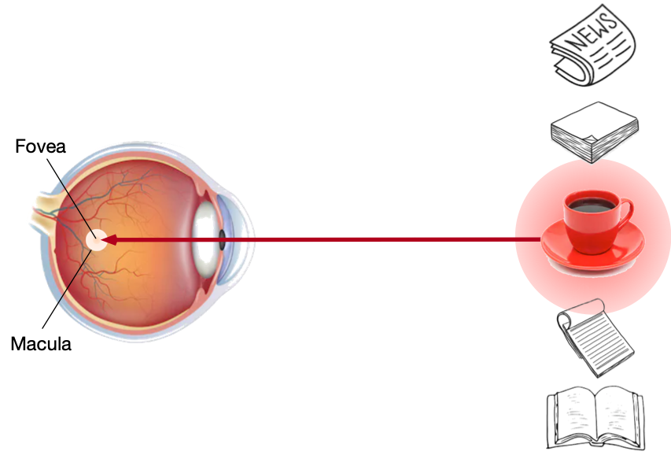
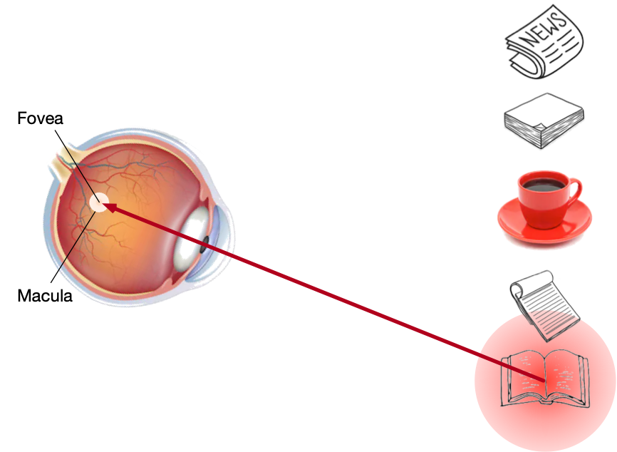

# Attentional Cues
:label:`sec_attention-cues`

First and foremost,
thank you for your attention
to this book.
This is because
attention is a scarce resource:
at the moment
you are reading this book
and ignoring the rest.
Thus, similar to money,
your attention is being paid with an opportunity cost.
To ensure that your investment of your attention
right now is worthwhile,
we have been highly motivated to pay our attention carefully
to write a good book.


Since economics studies the allocation of scarce resources,
we are 
in the era of the attention economy,
where human attention is treated as a limited, valuable, and scarce commodity
that can be exchanged.
Many business models have been
developed to capitalize on it.
On a music or video streaming service,
we either pay attention to listen to or watch ads
or pay money to hide them.
For growth in the world of an online game,
we either pay attention to 
participate in battles, which attract new gamers,
or pay money to instantly grow up.
Nothing comes for free.

All in all,
information in our environment is not scarce,
attention is.
When inspecting a visual scene,
our optic nerve receives information
at the order of $10^8$ bis per second,
far exceeding what our brain can fully process.


Biological attention.


## Eye in Cross Section

Saliency cue and task-dependent cue.


:width:`400px`
:label:`fig_eye-coffee`


:width:`400px`
:label:`fig_eye-book`


## Queries, Keys, and Values


Saliency cue corresponds to keys

Task-dependent cue corresponds to queries


## Visualization of Attention

```{.python .input}
import math
from d2l import mxnet as d2l
from mxnet import np, npx
npx.set_np()
```

```{.python .input}
#@tab pytorch
from d2l import torch as d2l
import torch
```

```{.python .input}
#@tab all
#@save
def show_heatmaps(matrices, xlabel, ylabel, titles=None, figsize=(2.5, 2.5),
                  cmap='Reds'):
    d2l.use_svg_display()
    num_rows, num_cols = matrices.shape[0], matrices.shape[1]
    fig, axes = d2l.plt.subplots(num_rows, num_cols, figsize=figsize,
                                 sharex=True, sharey=True, squeeze=False)
    for i, (row_axes, row_matrices) in enumerate(zip(axes, matrices)):
        for j, (ax, matrix) in enumerate(zip(row_axes, row_matrices)):
            pcm = ax.imshow(d2l.numpy(matrix), cmap=cmap)
            if i == num_rows - 1:
                ax.set_xlabel(xlabel)
            if j == 0:
                ax.set_ylabel(ylabel)
            if titles:
                ax.set_title(titles[j])
    fig.colorbar(pcm, ax=axes, shrink=0.6);
```

```{.python .input}
#@tab all
attention_weights = d2l.eye(10).reshape(1, 1, 10, 10)
show_heatmaps(attention_weights, xlabel='Keys', ylabel='Queries')
```
