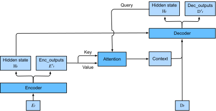
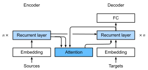

# Bahdanau Attention
:label:`sec_seq2seq_attention`


Graves proposed the first attention model (though it is not called "attention" in the paper) in a differentiable fashion to address the challenge of handwriting generation for a given text sequence :cite:`Graves.2013`.
Since pen trace is usually much longer than text,
Graves's attention model aligns text characters with the pen trace, however, only in one direction.


## Bahdanau Attention

In this section, we add the attention mechanism to the sequence to sequence (seq2seq)
model as introduced in :numref:`sec_seq2seq`
to explicitly aggregate states with weights.
:numref:`fig_s2s_attention` shows the model
architecture for encoding and decoding at the time step $t$. Here, the memory of the
attention layer consists of all the information that the encoder has
seen---the encoder output at each time step.
During the decoding, the decoder output from the previous time step $t-1$ is used as the query.
The output of the attention model is viewed as the context information, and such context is concatenated with the decoder input $D_t$.
Finally, we feed the concatenation into the decoder.


:label:`fig_s2s_attention`


To illustrate the overall architecture of seq2seq with attention model, the layer structure of its encoder and decoder is shown in :numref:`fig_s2s_attention_details`.


:label:`fig_s2s_attention_details`

```{.python .input}
from d2l import mxnet as d2l
from mxnet import np, npx
from mxnet.gluon import rnn, nn
npx.set_np()
```

```{.python .input}
#@tab pytorch
from d2l import torch as d2l
import torch
from torch import nn
```

## Decoder

Since the encoder of seq2seq with attention mechanisms is the same as `Seq2SeqEncoder` in :numref:`sec_seq2seq`, we will just focus on the decoder. We add an MLP attention layer (`AdditiveAttention`) which has the same hidden size as the GRU layer in the decoder. Then we initialize the state of the decoder by passing three items from the encoder:

- **the encoder outputs of all time steps**: they are used as the attention layer's memory with identical keys and values;

- **the hidden state of the encoder's final time step**: it is used as the initial decoder's hidden state;

- **the encoder valid length**: so the attention layer will not consider the padding tokens within the encoder outputs.

At each time step of the decoding, we use the hidden state of the decoder's last RNN layer as the query for the attention layer. The attention model's output is then concatenated with the input embedding vector to feed into the RNN layer. Although the RNN layer hidden state also contains history information from decoder, the attention output explicitly selects the encoder outputs based on `enc_valid_lens`, so that the attention output suspends other irrelevant information.

Let us implement the `Seq2SeqAttentionDecoder`, and see how it differs from the decoder in seq2seq from :numref:`sec_seq2seq_decoder`.

```{.python .input}
#@tab all
#@save
class AttentionDecoder(d2l.Decoder):
    """The base attention-based decoder interface."""
    def __init__(self, **kwargs):
        super(AttentionDecoder, self).__init__(**kwargs)

    def init_state(self, enc_outputs, *args):
        raise NotImplementedError

    def forward(self, X, state):
        raise NotImplementedError

    @property
    def attention_weights(self):
        raise NotImplementedError
```

```{.python .input}
class Seq2SeqAttentionDecoder(AttentionDecoder):
    def __init__(self, vocab_size, embed_size, num_hiddens, num_layers,
                 dropout=0, **kwargs):
        super(Seq2SeqAttentionDecoder, self).__init__(**kwargs)
        self.attention = d2l.AdditiveAttention(num_hiddens, dropout)
        self.embedding = nn.Embedding(vocab_size, embed_size)
        self.rnn = rnn.GRU(num_hiddens, num_layers, dropout=dropout)
        self.dense = nn.Dense(vocab_size, flatten=False)

    def init_state(self, enc_outputs, enc_valid_lens, *args):
        # Shape of `outputs`: (`num_steps`, `batch_size`, `num_hiddens`).
        # Shape of `hidden_state[0]`: (`num_layers`, `batch_size`,
        # `num_hiddens`)
        outputs, hidden_state = enc_outputs
        return (outputs.swapaxes(0, 1), hidden_state, enc_valid_lens)

    def forward(self, X, state):
        # Shape of `enc_outputs`: (`batch_size`, `num_steps`, `num_hiddens`).
        # Shape of `hidden_state[0]`: (`num_layers`, `batch_size`,
        # `num_hiddens`)
        enc_outputs, hidden_state, enc_valid_lens = state
        # Shape of the output `X`: (`num_steps`, `batch_size`, `embed_size`)
        X = self.embedding(X).swapaxes(0, 1)
        outputs, self._attention_weights = [], []
        for x in X:
            # Shape of `query`: (`batch_size`, 1, `num_hiddens`)
            query = np.expand_dims(hidden_state[0][-1], axis=1)
            # Shape of `context`: (`batch_size`, 1, `num_hiddens`)
            context = self.attention(
                query, enc_outputs, enc_outputs, enc_valid_lens)
            # Concatenate on the feature dimension
            x = np.concatenate((context, np.expand_dims(x, axis=1)), axis=-1)
            # Reshape `x` as (1, `batch_size`, `embed_size` + `num_hiddens`)
            out, hidden_state = self.rnn(x.swapaxes(0, 1), hidden_state)
            outputs.append(out)
            self._attention_weights.append(self.attention.attention_weights)
        # After fully-connected layer transformation, shape of `outputs`:
        # (`num_steps`, `batch_size`, `vocab_size`)
        outputs = self.dense(np.concatenate(outputs, axis=0))
        return outputs.swapaxes(0, 1), [enc_outputs, hidden_state,
                                        enc_valid_lens]

    @property
    def attention_weights(self):
        return self._attention_weights
```

```{.python .input}
#@tab pytorch
class Seq2SeqAttentionDecoder(AttentionDecoder):
    def __init__(self, vocab_size, embed_size, num_hiddens, num_layers,
                 dropout=0, **kwargs):
        super(Seq2SeqAttentionDecoder, self).__init__(**kwargs)
        self.attention = d2l.AdditiveAttention(
            num_hiddens, num_hiddens, num_hiddens, dropout)
        self.embedding = nn.Embedding(vocab_size, embed_size)
        self.rnn = nn.GRU(
            embed_size + num_hiddens, num_hiddens, num_layers,
            dropout=dropout)
        self.dense = nn.Linear(num_hiddens, vocab_size)

    def init_state(self, enc_outputs, enc_valid_lens, *args):
        # Shape of `outputs`: (`num_steps`, `batch_size`, `num_hiddens`).
        # Shape of `hidden_state[0]`: (`num_layers`, `batch_size`,
        # `num_hiddens`)
        outputs, hidden_state = enc_outputs
        return (outputs.permute(1, 0, 2), hidden_state, enc_valid_lens)

    def forward(self, X, state):
        # Shape of `enc_outputs`: (`batch_size`, `num_steps`, `num_hiddens`).
        # Shape of `hidden_state[0]`: (`num_layers`, `batch_size`,
        # `num_hiddens`)
        enc_outputs, hidden_state, enc_valid_lens = state
        # Shape of the output `X`: (`num_steps`, `batch_size`, `embed_size`)
        X = self.embedding(X).permute(1, 0, 2)
        outputs, self._attention_weights = [], []
        for x in X:
            # Shape of `query`: (`batch_size`, 1, `num_hiddens`)
            query = torch.unsqueeze(hidden_state[-1], dim=1)
            # Shape of `context`: (`batch_size`, 1, `num_hiddens`)
            context = self.attention(
                query, enc_outputs, enc_outputs, enc_valid_lens)
            # Concatenate on the feature dimension
            x = torch.cat((context, torch.unsqueeze(x, dim=1)), dim=-1)
            # Reshape `x` as (1, `batch_size`, `embed_size` + `num_hiddens`)
            out, hidden_state = self.rnn(x.permute(1, 0, 2), hidden_state)
            outputs.append(out)
            self._attention_weights.append(self.attention.attention_weights)
        # After fully-connected layer transformation, shape of `outputs`:
        # (`num_steps`, `batch_size`, `vocab_size`)
        outputs = self.dense(torch.cat(outputs, dim=0))
        return outputs.permute(1, 0, 2), [enc_outputs, hidden_state,
                                          enc_valid_lens]
    
    @property
    def attention_weights(self):
        return self._attention_weights
```

Now we can test the seq2seq with attention model. To be consistent with the model without attention in :numref:`sec_seq2seq`, we use the same hyperparameters for `vocab_size`, `embed_size`, `num_hiddens`, and `num_layers`. As a result, we get the same decoder output shape, but the state structure is changed.

```{.python .input}
encoder = d2l.Seq2SeqEncoder(vocab_size=10, embed_size=8, num_hiddens=16,
                             num_layers=2)
encoder.initialize()
decoder = Seq2SeqAttentionDecoder(vocab_size=10, embed_size=8, num_hiddens=16,
                                  num_layers=2)
decoder.initialize()
X = d2l.zeros((4, 7))  # (`batch_size`, `num_steps`)
state = decoder.init_state(encoder(X), None)
out, state = decoder(X, state)
out.shape, len(state), state[0].shape, len(state[1]), state[1][0].shape
```

```{.python .input}
#@tab pytorch
encoder = d2l.Seq2SeqEncoder(vocab_size=10, embed_size=8, num_hiddens=16,
                             num_layers=2)
encoder.eval()
decoder = Seq2SeqAttentionDecoder(vocab_size=10, embed_size=8, num_hiddens=16,
                                  num_layers=2)
decoder.eval()
X = d2l.zeros((4, 7), dtype=torch.long)  # (`batch_size`, `num_steps`)
state = decoder.init_state(encoder(X), None)
out, state = decoder(X, state)
out.shape, len(state), state[0].shape, len(state[1]), state[1][0].shape
```

## Training

Similar to :numref:`sec_seq2seq_training`, we try a toy model by applying
the same training hyperparameters and the same training loss.
As we can see from the result, since the
sequences in the training dataset are relatively short,
the additional attention
layer does not lead to a significant improvement.
Due to the computational
overhead of both the encoder's and the decoder's attention layers, this model
is much slower than the seq2seq model without attention.

```{.python .input}
#@tab all
embed_size, num_hiddens, num_layers, dropout = 32, 32, 2, 0.1
batch_size, num_steps = 64, 10
lr, num_epochs, device = 0.005, 250, d2l.try_gpu()

train_iter, src_vocab, tgt_vocab = d2l.load_data_nmt(batch_size, num_steps)
encoder = d2l.Seq2SeqEncoder(
    len(src_vocab), embed_size, num_hiddens, num_layers, dropout)
decoder = Seq2SeqAttentionDecoder(
    len(tgt_vocab), embed_size, num_hiddens, num_layers, dropout)
net = d2l.EncoderDecoder(encoder, decoder)
d2l.train_seq2seq(net, train_iter, lr, num_epochs, tgt_vocab, device)
```

Last, we predict several sample examples.

```{.python .input}
#@tab all
engs = ['go .', "i lost .", 'he\'s calm .', 'i\'m home .']
fras = ['va !', 'j\'ai perdu .', 'il est calme .', 'je suis chez moi .']
for eng, fra in zip(engs, fras):
    translation, dec_attention_weight_seq = d2l.predict_seq2seq(
        net, eng, src_vocab, tgt_vocab, num_steps, device, True)
    print(f'{eng} => {translation}, ',
          f'bleu {d2l.bleu(translation, fra, k=2):.3f}')
```

```{.python .input}
#@tab all
attention_weights = d2l.reshape(
    d2l.concat([step[0][0][0] for step in dec_attention_weight_seq], 0),
    (1, 1, -1, num_steps))
```

```{.python .input}
# Plus one to include the end-of-sequence token
d2l.show_heatmaps(
    attention_weights[:, :, :, :len(engs[-1].split()) + 1],
    xlabel='Key posistions', ylabel='Query posistions')
```

```{.python .input}
#@tab pytorch
# Plus one to include the end-of-sequence token
d2l.show_heatmaps(
    attention_weights[:, :, :, :len(engs[-1].split()) + 1].cpu(),
    xlabel='Key posistions', ylabel='Query posistions')
```

## Summary

* The seq2seq model with attention adds an additional attention layer to the model without attention.
* The decoder of the seq2seq with attention model passes three items from the encoder: the encoder outputs of all time steps, the hidden state of the encoder's final time step, and the encoder valid length.

## Exercises

1. Compare `Seq2SeqAttentionDecoder` and `Seq2seqDecoder` by using the same parameters and checking their losses.
1. Can you think of any use cases where `Seq2SeqAttentionDecoder` will outperform `Seq2seqDecoder`?
1. Replace GRU with LSTM in the experiment.

:begin_tab:`mxnet`
[Discussions](https://discuss.d2l.ai/t/347)
:end_tab:

:begin_tab:`pytorch`
[Discussions](https://discuss.d2l.ai/t/1065)
:end_tab:
