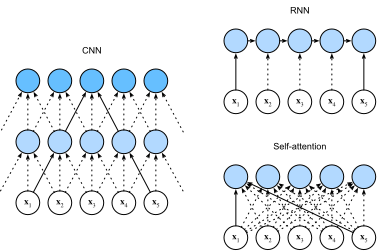

# Self-Attention and Positional Encoding
:label:`sec_self-attention-and-positional-encoding`

In deep learning,
we often use CNNs or RNNs to encode a sequence.
Now with attention mechanisms.
imagine that we feed a sequence of tokens
into attention pooling
so that
the same set of tokens
act as queries, keys, and values.
Specifically,
each query attends to all the key-value pairs
and generates one attention output.
Since the queries, keys, and values
come from the same place,
this performs
*self-attention* :cite:`Lin.Feng.Santos.ea.2017,Vaswani.Shazeer.Parmar.ea.2017`, which is also called *intra-attention* :cite:`Cheng.Dong.Lapata.2016,Parikh.Tackstrom.Das.ea.2016,Paulus.Xiong.Socher.2017`.
In this section,
we will discuss sequence encoding using self-attention,
including using additional information for the sequence order.

```{.python .input}
from d2l import mxnet as d2l
import math
from mxnet import autograd, np, npx
from mxnet.gluon import nn
npx.set_np()
```

```{.python .input}
#@tab pytorch
from d2l import torch as d2l
import math
import torch
from torch import nn
```

## Self-Attention

Given a sequence of input tokens
$\mathbf{x}_1, \ldots, \mathbf{x}_T$ where any $\mathbf{x}_t \in \mathbb{R}^d$ ($1 \leq t \leq T$),
its self-attention outputs
a sequence of the same length
$\mathbf{y}_1, \ldots, \mathbf{y}_T$,
where

$$\mathbf{y}_t = f(\mathbf{x}_t, (\mathbf{x}_1, \mathbf{x}_1), \ldots, (\mathbf{x}_T, \mathbf{x}_T)) \in \mathbb{R}^d$$

according to the definition of attention pooling $f$ in
:eqref:`eq_attn-pooling`.
Using multi-head attention,
the following code snippet
computes the self-attention of a tensor
with shape (batch size, number of time steps or sequence length in tokens, $d$).
The output tensor has the same shape.

```{.python .input}
num_hiddens, num_heads = 100, 5
attention = d2l.MultiHeadAttention(num_hiddens, num_heads, 0.5)
attention.initialize()
```

```{.python .input}
#@tab pytorch
num_hiddens, num_heads = 100, 5
attention = d2l.MultiHeadAttention(num_hiddens, num_hiddens, num_hiddens,
                                   num_hiddens, num_heads, 0.5)
attention.eval()
```

```{.python .input}
#@tab all
batch_size, num_queries, valid_lens = 2, 4, d2l.tensor([3, 2])
X = d2l.ones((batch_size, num_queries, num_hiddens))
attention(X, X, X, valid_lens).shape
```

## Comparing CNNs, RNNs, and Self-Attention


:label:`fig_cnn-rnn-self-attention`


Before the discussion of the *multi-head attention* layer, let us quick express the *self-attention* architecture. The self-attention model is a normal attention model, with its query, its key, and its value being copied exactly the same from each item of the sequential inputs. As we illustrate in :numref:`fig_self_attention`, self-attention outputs a same-length sequential output for each input item. Compared with a recurrent layer, output items of a self-attention layer can be computed in parallel and, therefore, it is easy to obtain a highly-efficient implementation.


:label:`fig_self_attention`

## Positional Encoding

Unlike the recurrent layer, both the multi-head attention layer and the position-wise feed-forward network compute the output of each item in the sequence independently. This feature enables us to parallelize the computation, but it fails to model the sequential information for a given sequence. To better capture the sequential information, the Transformer model uses the *positional encoding* to maintain the positional information of the input sequence.

To explain, assume that $X\in\mathbb R^{l\times d}$ is the embedding of an example, where $l$ is the sequence length and $d$ is the embedding size. This positional encoding layer encodes $X$'s position $P\in\mathbb R^{l\times d}$ and outputs $P+X$.

The position $P$ is a 2-D matrix, where $i$ refers to the order in the sentence, and $j$ refers to the position along the embedding vector dimension. In this way, each value in the origin sequence is then maintained using the equations below:

$$P_{i, 2j} = \sin(i/10000^{2j/d}),$$

$$\quad P_{i, 2j+1} = \cos(i/10000^{2j/d}),$$

for $i=0,\ldots, l-1$ and $j=0,\ldots,\lfloor(d-1)/2\rfloor$.


:numref:`fig_positional_encoding` illustrates the positional encoding.


:label:`fig_positional_encoding`

```{.python .input}
#@save
class PositionalEncoding(nn.Block):
    def __init__(self, num_hiddens, dropout, max_len=1000):
        super(PositionalEncoding, self).__init__()
        self.dropout = nn.Dropout(dropout)
        # Create a long enough `P`
        self.P = d2l.zeros((1, max_len, num_hiddens))
        X = d2l.arange(max_len).reshape(-1, 1) / np.power(
            10000, np.arange(0, num_hiddens, 2) / num_hiddens)
        self.P[:, :, 0::2] = np.sin(X)
        self.P[:, :, 1::2] = np.cos(X)

    def forward(self, X):
        X = X + self.P[:, :X.shape[1], :].as_in_ctx(X.ctx)
        return self.dropout(X)
```

```{.python .input}
#@tab pytorch
#@save
class PositionalEncoding(nn.Module):
    def __init__(self, num_hiddens, dropout, max_len=1000):
        super(PositionalEncoding, self).__init__()
        self.dropout = nn.Dropout(dropout)
        # Create a long enough `P`
        self.P = d2l.zeros((1, max_len, num_hiddens))
        X = d2l.arange(max_len, dtype=torch.float32).reshape(
            -1, 1) / torch.pow(10000, torch.arange(
            0, num_hiddens, 2, dtype=torch.float32) / num_hiddens)
        self.P[:, :, 0::2] = torch.sin(X)
        self.P[:, :, 1::2] = torch.cos(X)

    def forward(self, X):
        X = X + self.P[:, :X.shape[1], :].to(X.device)
        return self.dropout(X)
```

Now we test the `PositionalEncoding` class with a toy model for 4 dimensions. As we can see, the $4^{\mathrm{th}}$ dimension has the same frequency as the $5^{\mathrm{th}}$ but with different offset (i.e. phase) because one is produced by a sine function and the other is produced by a cosine function. The $6^{\mathrm{th}}$ and $7^{\mathrm{th}}$ dimensions have lower frequency.

```{.python .input}
encoding_dim, num_steps = 32, 60
pos_encoding = PositionalEncoding(encoding_dim, 0)
pos_encoding.initialize()
X = pos_encoding(np.zeros((1, num_steps, encoding_dim)))
P = pos_encoding.P[:, :X.shape[1], :]
d2l.plot(d2l.arange(num_steps), P[0, :, 6:10].T, xlabel='position',
         figsize=(6, 2.5), legend=["dim %d" % d for d in d2l.arange(6, 10)])
```

```{.python .input}
#@tab pytorch
encoding_dim, num_steps = 32, 60
pos_encoding = PositionalEncoding(encoding_dim, 0)
pos_encoding.eval()
X = pos_encoding(d2l.zeros((1, num_steps, encoding_dim)))
P = pos_encoding.P[:, :X.shape[1], :]
d2l.plot(d2l.arange(num_steps), P[0, :, 6:10].T, xlabel='position',
         figsize=(6, 2.5), legend=["dim %d" % d for d in d2l.arange(6, 10)])
```

```{.python .input}
#@tab all
for i in range(8):
    print(f'{i} in binary is {i:>03b}')
```

```{.python .input}
P = np.expand_dims(np.expand_dims(P[0, :, :], 0), 0)
d2l.show_heatmaps(P, xlabel='Encoding dimension', ylabel='Position',
                  figsize=(3.5, 4), cmap='Blues')
```

```{.python .input}
#@tab pytorch
P = P[0, :, :].unsqueeze(0).unsqueeze(0)
d2l.show_heatmaps(P, xlabel='Encoding dimension', ylabel='Position',
                  figsize=(3.5, 4), cmap='Blues')
```

## Summary

* 1


## Exercises

1. 1


:begin_tab:`mxnet`
[Discussions](https://discuss.d2l.ai/t/xxx)
:end_tab:

:begin_tab:`pytorch`
[Discussions](https://discuss.d2l.ai/t/xxx)
:end_tab:
