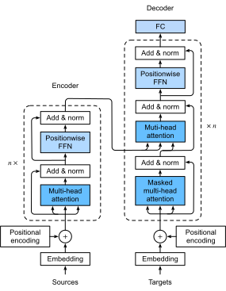

# Transformer
:label:`sec_transformer`

In previous chapters, we have covered major neural network architectures such as convolution neural networks (CNNs) and  recurrent neural networks (RNNs). Let us recap their pros and cons:

* **CNNs** are easy to parallelize at a layer but cannot capture the variable-length sequential dependency very well.

* **RNNs** are able to capture the long-range, variable-length sequential information, but suffer from inability to parallelize within a sequence.

To combine the advantages from both CNNs and RNNs, :cite:`Vaswani.Shazeer.Parmar.ea.2017` designed a novel architecture using the attention mechanism.
This architecture, which is called as *Transformer*, achieves parallelization by capturing recurrence sequence with attention and at the same time encodes each item's position in the sequence. As a result, Transformer leads to a compatible model with significantly shorter training time.

Similar to the seq2seq model in :numref:`sec_seq2seq`, Transformer is also based on the encoder-decoder architecture. However,  Transformer differs to the former by replacing the
recurrent layers in seq2seq with *multi-head attention* layers, incorporating the position-wise information through *position encoding*, and applying *layer normalization*.
We  compare  Transformer  and seq2seq  side-by-side in :numref:`fig_transformer`.

Overall, these two models are similar to each other: the source sequence embeddings are fed into $n$ repeated blocks. The outputs of the last block are then used as attention memory for the decoder.  The target sequence embeddings are similarly fed into $n$ repeated blocks in the decoder, and the final outputs are obtained by applying a dense layer with vocabulary size to the last block's outputs.


:width:`500px`
:label:`fig_transformer`


On the flip side, Transformer differs from the seq2seq with attention model in the following:

1. **Transformer block**: a recurrent layer in seq2seq is replaced by a *Transformer block*. This block contains a *multi-head attention* layer and a *position-wise feed-forward network* with two layers for the encoder. For the decoder, another multi-head attention layer is used to take the encoder state.
1. **Add and norm**: the inputs and outputs of both the multi-head attention layer or the position-wise feed-forward network, are processed by two "add and norm" layer that contains a residual structure and a *layer normalization* layer.
1. **Position encoding**: since the self-attention layer does not distinguish the item order in a sequence, a positional encoding layer is used to add sequential information into each sequence item.


In the rest of this section, we will equip you with each new component introduced by Transformer, and get you up and running to construct a machine translation model.

```{.python .input}
from d2l import mxnet as d2l
import math
from mxnet import autograd, np, npx
from mxnet.gluon import nn
npx.set_np()
```

```{.python .input}
#@tab pytorch
from d2l import torch as d2l
import math
import torch
from torch import nn
```

## Position-wise Feed-Forward Networks

Another key component in the Transformer block is called *position-wise feed-forward network (FFN)*. It accepts a $3$-dimensional input with shape (batch size, sequence length, feature size). The position-wise FFN consists of two dense layers that applies to the last dimension. Since the same two dense layers are used for each position item in the sequence, we referred to it as *position-wise*. Indeed, it is equivalent to applying two $1 \times 1$ convolution layers.

Below, the `PositionWiseFFN` shows how to implement a position-wise FFN with two dense layers of hidden size `ffn_num_hiddens` and `ffn_num_outputs`, respectively.

```{.python .input}
#@save
class PositionWiseFFN(nn.Block):
    def __init__(self, ffn_num_hiddens, ffn_num_outputs, **kwargs):
        super(PositionWiseFFN, self).__init__(**kwargs)
        self.dense1 = nn.Dense(ffn_num_hiddens, flatten=False,
                               activation='relu')
        self.dense2 = nn.Dense(ffn_num_outputs, flatten=False)

    def forward(self, X):
        return self.dense2(self.dense1(X))
```

```{.python .input}
#@tab pytorch
#@save
class PositionWiseFFN(nn.Module):
    def __init__(self, ffn_num_input, ffn_num_hiddens, ffn_num_outputs,
                 **kwargs):
        super(PositionWiseFFN, self).__init__(**kwargs)
        self.dense1 = nn.Linear(ffn_num_input, ffn_num_hiddens)
        self.relu = nn.ReLU()
        self.dense2 = nn.Linear(ffn_num_hiddens, ffn_num_outputs)

    def forward(self, X):
        return self.dense2(self.relu(self.dense1(X)))
```

Similar to the multi-head attention, the position-wise feed-forward network will only change the last dimension size of the input---the feature dimension. In addition, if two items in the input sequence are identical, the according outputs will be identical as well.

```{.python .input}
ffn = PositionWiseFFN(4, 8)
ffn.initialize()
ffn(np.ones((2, 3, 4)))[0]
```

```{.python .input}
#@tab pytorch
ffn = PositionWiseFFN(4, 4, 8)
ffn.eval()
ffn(d2l.ones((2, 3, 4)))[0]
```

## Add and Norm

Besides the above two components in the Transformer block, the "add and norm" within the block also plays a key role to connect the inputs and outputs of other layers smoothly. To explain, we add a layer that contains a residual structure and a *layer normalization* after both the multi-head attention layer and the position-wise FFN network. *Layer normalization* is similar to batch normalization in :numref:`sec_batch_norm`. One difference is that the mean and variances for the layer normalization are calculated along the last dimension, e.g `X.mean(axis=-1)` instead of the first batch dimension, e.g., `X.mean(axis=0)`. Layer normalization prevents the range of values in the layers from changing too much, which allows faster training and better generalization ability.

:begin_tab:`mxnet`
MXNet has both `LayerNorm` and `BatchNorm` implemented within the `nn` block. Let us call both of them and see the difference in the example below.
:end_tab:

:begin_tab:`pytorch`
PyTorch has both `LayerNorm` and `BatchNorm1d` implemented within the `nn` module. Let us call both of them and see the difference in the example below.
:end_tab:

```{.python .input}
ln = nn.LayerNorm()
ln.initialize()
bn = nn.BatchNorm()
bn.initialize()
X = d2l.tensor([[1, 2], [2, 3]])
# Compute mean and variance from `X` in the training mode
with autograd.record():
    print('layer norm:', ln(X), '\nbatch norm:', bn(X))
```

```{.python .input}
#@tab pytorch
ln = nn.LayerNorm(2)
bn = nn.BatchNorm1d(2)
X = d2l.tensor([[1, 2], [2, 3]], dtype=torch.float32)
# Compute mean and variance from `X` in the training mode
print('layer norm:', ln(X), '\nbatch norm:', bn(X))
```

Now let us implement the connection block `AddNorm` together. `AddNorm` accepts two inputs $X$ and $Y$. We can deem $X$ as the original input in the residual network, and $Y$ as the outputs from either the multi-head attention layer or the position-wise FFN network. In addition, we apply dropout on $Y$ for regularization.

```{.python .input}
#@save
class AddNorm(nn.Block):
    def __init__(self, dropout, **kwargs):
        super(AddNorm, self).__init__(**kwargs)
        self.dropout = nn.Dropout(dropout)
        self.ln = nn.LayerNorm()

    def forward(self, X, Y):
        return self.ln(self.dropout(Y) + X)
```

```{.python .input}
#@tab pytorch
#@save
class AddNorm(nn.Module):
    def __init__(self, normalized_shape, dropout, **kwargs):
        super(AddNorm, self).__init__(**kwargs)
        self.dropout = nn.Dropout(dropout)
        self.ln = nn.LayerNorm(normalized_shape)

    def forward(self, X, Y):
        return self.ln(self.dropout(Y) + X)
```

Due to the residual connection, $X$ and $Y$ should have the same shape.

```{.python .input}
add_norm = AddNorm(0.5)
add_norm.initialize()
add_norm(d2l.ones((2, 3, 4)), d2l.ones((2, 3, 4))).shape
```

```{.python .input}
#@tab pytorch
add_norm = AddNorm([3, 4], 0.5) # normalized_shape is input.size()[1:]
add_norm.eval()
add_norm(d2l.ones((2, 3, 4)), d2l.ones((2, 3, 4))).shape
```

## Encoder

Armed with all the essential components of Transformer, let us first build a Transformer encoder block. This encoder contains a multi-head attention layer, a position-wise feed-forward network, and two "add and norm" connection blocks. As shown in the code, for both of the attention model and the positional FFN model in the `EncoderBlock`, their outputs' dimension are equal to the `num_hiddens`. This is due to the nature of the residual block, as we need to add these outputs back to the original value during "add and norm".

```{.python .input}
#@save
class EncoderBlock(nn.Block):
    def __init__(self, num_hiddens, ffn_num_hiddens, num_heads, dropout,
                 use_bias=False, **kwargs):
        super(EncoderBlock, self).__init__(**kwargs)
        self.attention = d2l.MultiHeadAttention(
            num_hiddens, num_heads, dropout, use_bias)
        self.addnorm1 = AddNorm(dropout)
        self.ffn = PositionWiseFFN(ffn_num_hiddens, num_hiddens)
        self.addnorm2 = AddNorm(dropout)

    def forward(self, X, valid_lens):
        Y = self.addnorm1(X, self.attention(X, X, X, valid_lens))
        return self.addnorm2(Y, self.ffn(Y))
```

```{.python .input}
#@tab pytorch
#@save
class EncoderBlock(nn.Module):
    def __init__(self, key_size, query_size, value_size, num_hiddens,
                 norm_shape, ffn_num_input, ffn_num_hiddens, num_heads,
                 dropout, use_bias=False, **kwargs):
        super(EncoderBlock, self).__init__(**kwargs)
        self.attention = d2l.MultiHeadAttention(
            key_size, query_size, value_size, num_hiddens, num_heads, dropout,
            use_bias)
        self.addnorm1 = AddNorm(norm_shape, dropout)
        self.ffn = PositionWiseFFN(
            ffn_num_input, ffn_num_hiddens, num_hiddens)
        self.addnorm2 = AddNorm(norm_shape, dropout)

    def forward(self, X, valid_lens):
        Y = self.addnorm1(X, self.attention(X, X, X, valid_lens))
        return self.addnorm2(Y, self.ffn(Y))
```

Due to the residual connections, this block will not change the input shape. It means that the `num_hiddens` argument should be equal to the input size of the last dimension. In our toy example below,  `num_hiddens` $= 24$, `ffn_num_hiddens` $=48$, `num_heads` $= 8$, and `dropout` $= 0.5$.

```{.python .input}
X = d2l.ones((2, 100, 24))
valid_lens = d2l.tensor([3, 2])
encoder_blk = EncoderBlock(24, 48, 8, 0.5)
encoder_blk.initialize()
encoder_blk(X, valid_lens).shape
```

```{.python .input}
#@tab pytorch
X = d2l.ones((2, 100, 24))
valid_lens = d2l.tensor([3, 2])
encoder_blk = EncoderBlock(24, 24, 24, 24, [100, 24], 24, 48, 8, 0.5)
encoder_blk.eval()
encoder_blk(X, valid_lens).shape
```

Now it comes to the implementation of the entire Transformer encoder. With the Transformer encoder, $n$ blocks of `EncoderBlock` stack up one after another. Because of the residual connection, the embedding layer size $d$ is same as the Transformer block output size. Also note that we multiply the embedding output by $\sqrt{d}$ to prevent its values from being too small.

```{.python .input}
#@save
class TransformerEncoder(d2l.Encoder):
    def __init__(self, vocab_size, num_hiddens, ffn_num_hiddens,
                 num_heads, num_layers, dropout, use_bias=False, **kwargs):
        super(TransformerEncoder, self).__init__(**kwargs)
        self.num_hiddens = num_hiddens
        self.embedding = nn.Embedding(vocab_size, num_hiddens)
        self.pos_encoding = d2l.PositionalEncoding(num_hiddens, dropout)
        self.blks = nn.Sequential()
        for _ in range(num_layers):
            self.blks.add(
                EncoderBlock(num_hiddens, ffn_num_hiddens, num_heads, dropout,
                             use_bias))

    def forward(self, X, valid_lens, *args):
        # Since positional encoding values are between -1 and 1, the embedding
        # values are multiplied by the square root of the embedding dimension
        # to rescale before they are summed up
        X = self.pos_encoding(self.embedding(X) * math.sqrt(self.num_hiddens))
        self.attention_weights = [None] * len(self.blks)
        for i, blk in enumerate(self.blks):
            X = blk(X, valid_lens)
            self.attention_weights[
                i] = blk.attention.attention.attention_weights
        return X
```

```{.python .input}
#@tab pytorch
#@save
class TransformerEncoder(d2l.Encoder):
    def __init__(self, vocab_size, key_size, query_size, value_size,
                 num_hiddens, norm_shape, ffn_num_input, ffn_num_hiddens,
                 num_heads, num_layers, dropout, use_bias=False, **kwargs):
        super(TransformerEncoder, self).__init__(**kwargs)
        self.num_hiddens = num_hiddens
        self.embedding = nn.Embedding(vocab_size, num_hiddens)
        self.pos_encoding = d2l.PositionalEncoding(num_hiddens, dropout)
        self.blks = nn.Sequential()
        for i in range(num_layers):
            self.blks.add_module("block"+str(i),
                EncoderBlock(key_size, query_size, value_size, num_hiddens,
                             norm_shape, ffn_num_input, ffn_num_hiddens,
                             num_heads, dropout, use_bias))

    def forward(self, X, valid_lens, *args):
        # Since positional encoding values are between -1 and 1, the embedding
        # values are multiplied by the square root of the embedding dimension
        # to rescale before they are summed up
        X = self.pos_encoding(self.embedding(X) * math.sqrt(self.num_hiddens))
        self.attention_weights = [None] * len(self.blks)
        for i, blk in enumerate(self.blks):
            X = blk(X, valid_lens)
            self.attention_weights[
                i] = blk.attention.attention.attention_weights
        return X
```

Let us create an encoder with two stacked  Transformer encoder blocks, whose hyperparameters are the same as before. Similar to the previous toy example's parameters, we add two more parameters `vocab_size` to be $200$ and `num_layers` to be $2$ here.

```{.python .input}
encoder = TransformerEncoder(200, 24, 48, 8, 2, 0.5)
encoder.initialize()
encoder(np.ones((2, 100)), valid_lens).shape
```

```{.python .input}
#@tab pytorch
encoder = TransformerEncoder(
    200, 24, 24, 24, 24, [100, 24], 24, 48, 8, 2, 0.5)
encoder.eval()
encoder(d2l.ones((2, 100), dtype=torch.long), valid_lens).shape
```

## Decoder

The Transformer decoder block looks similar to the Transformer encoder block. However, besides the two sub-layers (the multi-head attention layer and the positional encoding network), the decoder Transformer block contains a third sub-layer, which applies multi-head attention on the output of the encoder stack. Similar to the  Transformer encoder block, the  Transformer decoder block employs "add and norm", i.e., the residual connections and the layer normalization to connect each of the sub-layers.

To be specific, at time step $t$, assume that $\mathbf x_t$ is the current input, i.e., the query. As illustrated in :numref:`fig_self_attention_predict`, the keys and values of the self-attention layer consist of the current query with all the past queries $\mathbf x_1, \ldots, \mathbf x_{t-1}$.


:label:`fig_self_attention_predict`

During training, the output for the $t$-query could observe all the previous key-value pairs. It results in an different behavior from prediction. Thus, during prediction we can eliminate the unnecessary information by specifying the valid length to be $t$ for the $t^\textrm{th}$ query.

```{.python .input}
class DecoderBlock(nn.Block):
    # The `i`-th block in the decoder
    def __init__(self, num_hiddens, ffn_num_hiddens, num_heads,
                 dropout, i, **kwargs):
        super(DecoderBlock, self).__init__(**kwargs)
        self.i = i
        self.attention1 = d2l.MultiHeadAttention(num_hiddens, num_heads,
                                                 dropout)
        self.addnorm1 = AddNorm(dropout)
        self.attention2 = d2l.MultiHeadAttention(num_hiddens, num_heads,
                                                 dropout)
        self.addnorm2 = AddNorm(dropout)
        self.ffn = PositionWiseFFN(ffn_num_hiddens, num_hiddens)
        self.addnorm3 = AddNorm(dropout)

    def forward(self, X, state):
        enc_outputs, enc_valid_lens = state[0], state[1]
        # During training, all the tokens of any output sequence are processed
        # at the same time, so `state[2][self.i]` is `None` as initialized.
        # When decoding any output sequence token by token during prediction,
        # `state[2][self.i]` contains representations of the decoded output
        # at the `i`-th block up to the current time step
        if state[2][self.i] is None:
            key_values = X
        else:
            key_values = np.concatenate((state[2][self.i], X), axis=1)
        state[2][self.i] = key_values

        if autograd.is_training():
            batch_size, num_steps, _ = X.shape
            # Shape of `dec_valid_lens`: (`batch_size`, `num_steps`), where
            # every row is [1, 2, ..., `num_steps`]
            dec_valid_lens = np.tile(np.arange(1, num_steps + 1, ctx=X.ctx),
                                     (batch_size, 1))
        else:
            dec_valid_lens = None

        X2 = self.attention1(X, key_values, key_values, dec_valid_lens)
        Y = self.addnorm1(X, X2)
        # Shape of `enc_outputs`: (`batch_size`, `num_steps`, `num_hiddens`)
        Y2 = self.attention2(Y, enc_outputs, enc_outputs, enc_valid_lens)
        Z = self.addnorm2(Y, Y2)
        return self.addnorm3(Z, self.ffn(Z)), state
```

```{.python .input}
#@tab pytorch
class DecoderBlock(nn.Module):
    # The `i`-th block in the decoder
    def __init__(self, key_size, query_size, value_size, num_hiddens,
                 norm_shape, ffn_num_input, ffn_num_hiddens, num_heads,
                 dropout, i, **kwargs):
        super(DecoderBlock, self).__init__(**kwargs)
        self.i = i
        self.attention1 = d2l.MultiHeadAttention(
            key_size, query_size, value_size, num_hiddens, num_heads, dropout)
        self.addnorm1 = AddNorm(norm_shape, dropout)
        self.attention2 = d2l.MultiHeadAttention(
            key_size, query_size, value_size, num_hiddens, num_heads, dropout)
        self.addnorm2 = AddNorm(norm_shape, dropout)
        self.ffn = PositionWiseFFN(ffn_num_input, ffn_num_hiddens,
                                   num_hiddens)
        self.addnorm3 = AddNorm(norm_shape, dropout)

    def forward(self, X, state):
        enc_outputs, enc_valid_lens = state[0], state[1]
        # During training, all the tokens of any output sequence are processed
        # at the same time, so `state[2][self.i]` is `None` as initialized.
        # When decoding any output sequence token by token during prediction,
        # `state[2][self.i]` contains representations of the decoded output
        # at the `i`-th block up to the current time step
        if state[2][self.i] is None:
            key_values = X
        else:
            key_values = torch.cat((state[2][self.i], X), axis=1)
        state[2][self.i] = key_values
        if self.training:
            batch_size, num_steps, _ = X.shape
            # Shape of `dec_valid_lens`: (`batch_size`, `num_steps`), where
            # every row is [1, 2, ..., `num_steps`]
            dec_valid_lens = torch.arange(
                1, num_steps + 1, device=X.device).repeat(batch_size, 1)
        else:
            dec_valid_lens = None

        X2 = self.attention1(X, key_values, key_values, dec_valid_lens)
        Y = self.addnorm1(X, X2)
        Y2 = self.attention2(Y, enc_outputs, enc_outputs, enc_valid_lens)
        Z = self.addnorm2(Y, Y2)
        return self.addnorm3(Z, self.ffn(Z)), state
```

Similar to the  Transformer encoder block, `num_hiddens` should be equal to the last dimension size of $X$.

```{.python .input}
decoder_blk = DecoderBlock(24, 48, 8, 0.5, 0)
decoder_blk.initialize()
X = np.ones((2, 100, 24))
state = [encoder_blk(X, valid_lens), valid_lens, [None]]
decoder_blk(X, state)[0].shape
```

```{.python .input}
#@tab pytorch
decoder_blk = DecoderBlock(24, 24, 24, 24, [100, 24], 24, 48, 8, 0.5, 0)
decoder_blk.eval()
X = d2l.ones((2, 100, 24))
state = [encoder_blk(X, valid_lens), valid_lens, [None]]
decoder_blk(X, state)[0].shape
```

The construction of the entire  Transformer decoder is identical to the  Transformer encoder, except for the additional dense layer to obtain the output confidence scores.

Let us implement the  Transformer decoder `TransformerDecoder`. Besides the regular hyperparameters such as the `vocab_size` and `num_hiddens`, the  Transformer decoder also needs the Transformer encoder's outputs `enc_outputs` and `env_valid_lens`.

```{.python .input}
class TransformerDecoder(d2l.Decoder):
    def __init__(self, vocab_size, num_hiddens, ffn_num_hiddens,
                 num_heads, num_layers, dropout, **kwargs):
        super(TransformerDecoder, self).__init__(**kwargs)
        self.num_hiddens = num_hiddens
        self.num_layers = num_layers
        self.embedding = nn.Embedding(vocab_size, num_hiddens)
        self.pos_encoding = d2l.PositionalEncoding(num_hiddens, dropout)
        self.blks = nn.Sequential()
        for i in range(num_layers):
            self.blks.add(
                DecoderBlock(num_hiddens, ffn_num_hiddens, num_heads,
                             dropout, i))
        self.dense = nn.Dense(vocab_size, flatten=False)

    def init_state(self, enc_outputs, env_valid_lens, *args):
        return [enc_outputs, env_valid_lens, [None] * self.num_layers]

    def forward(self, X, state):
        X = self.pos_encoding(self.embedding(X) * math.sqrt(self.num_hiddens))
        for blk in self.blks:
            X, state = blk(X, state)
        return self.dense(X), state
```

```{.python .input}
#@tab pytorch
class TransformerDecoder(d2l.Decoder):
    def __init__(self, vocab_size, key_size, query_size, value_size,
                 num_hiddens, norm_shape, ffn_num_input, ffn_num_hiddens,
                 num_heads, num_layers, dropout, **kwargs):
        super(TransformerDecoder, self).__init__(**kwargs)
        self.num_hiddens = num_hiddens
        self.num_layers = num_layers
        self.embedding = nn.Embedding(vocab_size, num_hiddens)
        self.pos_encoding = d2l.PositionalEncoding(num_hiddens, dropout)
        self.blks = nn.Sequential()
        for i in range(num_layers):
            self.blks.add_module("block"+str(i),
                DecoderBlock(key_size, query_size, value_size, num_hiddens,
                             norm_shape, ffn_num_input, ffn_num_hiddens,
                             num_heads, dropout, i))
        self.dense = nn.Linear(num_hiddens, vocab_size)

    def init_state(self, enc_outputs, env_valid_lens, *args):
        return [enc_outputs, env_valid_lens, [None] * self.num_layers]

    def forward(self, X, state):
        X = self.pos_encoding(self.embedding(X) * math.sqrt(self.num_hiddens))
        for blk in self.blks:
            X, state = blk(X, state)
        return self.dense(X), state
```

## Training

Finally, we can build an encoder-decoder model with the Transformer architecture.
Similar to the seq2seq with attention model in :numref:`sec_seq2seq_attention`, we use the following hyperparameters: two Transformer blocks with both the embedding size and the block output size to be $32$. In addition, we use $4$ heads, and set the hidden size to be twice larger than the output size.

```{.python .input}
num_hiddens, num_layers, dropout, batch_size, num_steps = 32, 2, 0.1, 64, 10
lr, num_epochs, device = 0.005, 200, d2l.try_gpu()
ffn_num_hiddens, num_heads = 64, 4

train_iter, src_vocab, tgt_vocab = d2l.load_data_nmt(batch_size, num_steps)

encoder = TransformerEncoder(
    len(src_vocab), num_hiddens, ffn_num_hiddens, num_heads, num_layers,
    dropout)
decoder = TransformerDecoder(
    len(tgt_vocab), num_hiddens, ffn_num_hiddens, num_heads, num_layers,
    dropout)
net = d2l.EncoderDecoder(encoder, decoder)
d2l.train_seq2seq(net, train_iter, lr, num_epochs, tgt_vocab, device)
```

```{.python .input}
#@tab pytorch
num_hiddens, num_layers, dropout, batch_size, num_steps = 32, 2, 0.1, 64, 10
lr, num_epochs, device = 0.005, 200, d2l.try_gpu()
ffn_num_input, ffn_num_hiddens, num_heads = 32, 64, 4
key_size, query_size, value_size = 32, 32, 32
norm_shape = [32]

train_iter, src_vocab, tgt_vocab = d2l.load_data_nmt(batch_size, num_steps)

encoder = TransformerEncoder(
    len(src_vocab), key_size, query_size, value_size, num_hiddens,
    norm_shape, ffn_num_input, ffn_num_hiddens, num_heads,
    num_layers, dropout)
decoder = TransformerDecoder(
    len(tgt_vocab), key_size, query_size, value_size, num_hiddens,
    norm_shape, ffn_num_input, ffn_num_hiddens, num_heads,
    num_layers, dropout)
net = d2l.EncoderDecoder(encoder, decoder)
d2l.train_seq2seq(net, train_iter, lr, num_epochs, tgt_vocab, device)
```

As we can see from the training time and accuracy, compared with the seq2seq model with attention model, Transformer runs faster per epoch, and converges faster at the beginning.

We can use the trained Transformer to translate some simple sentences.

```{.python .input}
#@tab all
engs = ['go .', "i lost .", 'he\'s calm .', 'i\'m home .']
fras = ['va !', 'j\'ai perdu .', 'il est calme .', 'je suis chez moi .']
d2l.translate(engs, fras, net, src_vocab, tgt_vocab, num_steps, device)
```

```{.python .input}
#@tab all
attention_weights = d2l.reshape(d2l.concat(net.encoder.attention_weights, 0),
                                (num_layers, num_heads, -1, num_steps))
attention_weights.shape
```

```{.python .input}
#@tab all
#@save
def show_heatmaps(matrices, xlabel, ylabel, titles=None, figsize=(3.5, 3.5),
                  cmap='Reds'):
    num_rows, num_cols = matrices.shape[0], matrices.shape[1]
    fig, axes = d2l.plt.subplots(num_rows, num_cols, figsize=figsize,
                                 sharex=True, sharey=True)
    # Make `axes` 2D-iteratable
    if not isinstance(axes, list):
        axes = [[axes]]
    elif not isinstance(axes[0], list):
        axes = [axes]
    for i, (row_axes, row_matrices) in enumerate(zip(axes, matrices)):
        for j, (ax, matrix) in enumerate(zip(row_axes, row_matrices)):
            pcm = ax.imshow(d2l.numpy(matrix), cmap=cmap)
            if i == num_rows - 1:
                ax.set_xlabel(xlabel)
            if j == 0:
                ax.set_ylabel(ylabel)
            if titles:
                ax.set_title(titles[j])
    fig.colorbar(pcm, ax=axes, shrink=0.6);
```

```{.python .input}
show_heatmaps(attention_weights, xlabel='Keys', ylabel='Queries',
              titles=['Head %d' % i for i in range(4)], figsize=(7, 3.5))
```

```{.python .input}
#@tab pytorch
show_heatmaps(attention_weights.cpu(), xlabel='Keys', ylabel='Queries',
              titles=['Head %d' % i for i in range(4)], figsize=(7, 3.5))
```

## Summary

* The Transformer model is based on the encoder-decoder architecture.
* Multi-head attention layer contains $h$ parallel attention layers.
* Position-wise feed-forward network consists of two dense layers that apply to the last dimension.
* Layer normalization differs from batch normalization by normalizing along the last dimension (the feature dimension) instead of the first (batch size) dimension.
* Positional encoding is the only place that adds positional information to the Transformer model.


## Exercises

1. Try a larger size of epochs and compare the loss between seq2seq model and Transformer model.
1. Can you think of any other benefit of positional encoding?
1. Compare layer normalization and batch normalization, when shall we apply which?

:begin_tab:`mxnet`
[Discussions](https://discuss.d2l.ai/t/348)
:end_tab:

:begin_tab:`pytorch`
[Discussions](https://discuss.d2l.ai/t/1066)
:end_tab:
