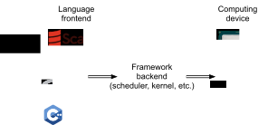

# Asynchronous Computation
:label:`sec_async`

Today's computers are highly parallel systems, consisting of multiple CPU cores (often multiple threads per core), multiple processing elements per GPU and often multiple GPUs per device. In short, we can process many different things at the same time, often on different devices. Unfortunately Python is not a great way of writing parallel and asynchronous code, at least not with some extra help. After all, Python is single-threaded and this is unlikely to change in the future. Deep learning frameworks such as MXNet and TensorFlow utilize an asynchronous programming model to improve performance (PyTorch uses Python's own scheduler leading to a different performance trade-off). Hence, understanding how asynchronous programming works helps us to develop more efficient programs, by proactively reducing computational requirements and mutual dependencies. This allows us to reduce memory overhead and increase processor utilization. We begin by importing the necessary libraries.

```{.python .input  n=1}
import d2l, numpy, os, subprocess
from mxnet import autograd, gluon, np, npx
from mxnet.gluon import nn
npx.set_np()
```

## Asynchrony via Backend

For a warmup consider the following toy problem - we want to generate a random matrix and multiply it. Let's do that both in NumPy and in MXNet NP to see the difference.

```{.python .input  n=2}
with d2l.benchmark('numpy   : %.4f sec'):
    for _ in range(10):
        a = numpy.random.normal(size=(1000, 1000))
        b = numpy.dot(a, a)

with d2l.benchmark('mxnet.np: %.4f sec'):
    for _ in range(10):
        a = np.random.normal(size=(1000, 1000))
        b = np.dot(a, a)       
```

This is orders of magnitude faster. At least it seems to be so. Since both are executed on the same processor something else must be going on. Forcing MXNet to finish all computation prior to returning shows what happened previously: computation is being executed by the backend while the frontend returns control to Python.

```{.python .input  n=3}
with d2l.benchmark():
    for _ in range(10):
        a = np.random.normal(size=(1000, 1000))
        b = np.dot(a, a)       
    npx.waitall()
```

Broadly speaking, MXNet has a frontend for direct interaction with the users, e.g. via Python, as well as a backend used by the system to perform the computation. The backend possesses its own threads that continuously collect and execute queued tasks. Note that for this to work the backend must be able to keep track of the dependencies between various steps in the computational graph. Hence it is ony possible to parallelize operations that do not depend on each other.

Users can write MXNet programs in various frontend languages, such as Python, R, Scala and C++. Regardless of the front-end programming language used, the execution of MXNet programs occurs primarily in the back-end of C++ implementations. Operations issued by the frontend language are passed on to the backend for execution. The backend manages its own threads that continuously collect and execute queued tasks. Note that for this to work the backend must be able to keep track of the dependencies between various steps in the computational graph. That is, it is not possible to parallelize operations that depend on each other.



Let's look at another toy example to understand the dependency graph a bit better.

```{.python .input  n=4}
x = np.ones((1, 2))
y = np.ones((1, 2))
z = x * y + 2
z
```


:label:`fig_asyncgraph`

Whenever the Python frontend thread executes one of the first three statements, it simply returns the task to the backend queue. When the last statement’s results need to be printed, the Python frontend thread will wait for the C++ backend thread to finish computing result of the variable `z`. One benefit of this design is that the Python frontend thread does not need to perform actual computations. Thus, there is little impact on the program’s overall performance, regardless of Python’s performance.

## Barriers and Blockers

There are a number of operations that will force Python to wait for completion:
* Most obviously `npx.waitall()` waits until all computation has completed, regardless of when the compute instructions were issued. In practice it is a bad idea to use this operator unless absolutely necessary since it can lead to poor performance.
* If we just want to wait until a specific variable is available we can call `z.wait_to_read()`. In this case MXNet blocks return to Python until the variable `z` has been computed. Other computation may well continue afterwards.

Let's see how this works in practice:

```{.python .input  n=5}
with d2l.benchmark('waitall     : %.4f sec'):
    b = np.dot(a, a)       
    npx.waitall()

with d2l.benchmark('wait_to_read: %.4f sec'):
    b = np.dot(a, a)
    b.wait_to_read()
```

Both operations take approximately the same time to complete. Besides the obvious blocking operations we recommend that the reader is aware of *implicit* blockers. Printing a variable clearly requires the variable to be avaialable and is thus a blocker. Lastly, conversions to NumPy via `z.asnumpy()` and conversions to scalars via `z.item()` are blocking, since NumPy has no notion of asynchrony. It needs access to the values just like the `print` function. Copying small amounts of data frequently from MXNet's scope to NumPy and back can destroy performance of an otherwise efficient code, since each such operation requires the compute graph to evaluate all intermediate results needed to get the relevant term *before* anything else can be done.

```{.python .input  n=7}
with d2l.benchmark('numpy  conversion: %.4f sec'):
    b = np.dot(a, a)       
    b.asnumpy()

with d2l.benchmark('scalar conversion: %.4f sec'):
    b = np.dot(a, a)       
    b.sum().item()
```

## Improving Computation

On a heavily multithreaded system (even regular laptops have 4 threads or more and on multi-socket servers this number can exceed 256) the overhead of scheduling operations can become significant. This is why it's highly desirable to have computation and scheduling occur asynchronously and in parallel. To illustrate the benefit of doing this let's see what happens if we increment a variable by 1 multiple times, both in sequence or asynchronously. We simulate synchronous execution by inserting a `wait_to_read()` barrier in between each addition.

```{.python .input  n=9}
with d2l.benchmark('Synchronous : %.4f sec'):
    for _ in range(1000):
        y = x + 1
        y.wait_to_read()

with d2l.benchmark('Asynchronous: %.4f sec'):
    for _ in range(1000):
        y = x + 1
    y.wait_to_read()
```

A slightly simplified interaction between the Python front-end thread and the C++ back-end thread can be summarized as follows:

1. The front-end orders the back-end to insert the calculation task `y = x + 1` into the queue.
1. The back-end then receives the computation tasks from the queue and performs the actual computations.
1. The back-end then returns the computation results to the front-end.

Assume that the durations of these three stages are $t_1, t_2$ and $t_3$, respectively. If we do not use asynchronous programming, the total time taken to perform 1000 computations is approximately $1000 (t_1+ t_2 + t_3)$. If asynchronous programming is used, the total time taken to perform 1000 computations can be reduced to $t_1 + 1000 t_2 + t_3$ (assuming $1000 t_2 > 999t_1$), since the front-end does not have to wait for the back-end to return computation results for each loop.

## Improving Memory Footprint

Imagine a situation where we keep on inserting operations into the backend by executing Python code on the frontend. For instance, the frontend might insert a large number of minibatch tasks within a very short time. After all, if no meaningful computation happens in Python this can be done quite quickly. If each of these tasks can be launched quickly at the same time this may cause a spike in memory usage. Given a finite amount of memory available on GPUs (and even on CPUs) this can lead to resource contention or even program crashes. Some readers might have noticed that previous training routines made use of synchronization methods such as `item` or even `asnumpy`.

We recommend to use these operations carefully, e.g. for each minibatch, such as to balance computational efficiency and memory footprint. To illustrate what happens let's implement a simple training loop for a deep network and measure its memory consumption and timing. Below is the mock data generator and deep network.

```{.python .input  n=10}
def data_iter():
    timer = d2l.Timer()
    num_batches, batch_size = 150, 1024
    for i in range(num_batches):
        X = np.random.normal(size=(batch_size, 512))
        y = np.ones((batch_size,))
        yield X, y
        if (i + 1) % 50 == 0:
            print('batch %d, time %.4f sec' % (i + 1, timer.stop()))

net = nn.Sequential()
net.add(nn.Dense(2048, activation='relu'),
        nn.Dense(512, activation='relu'), nn.Dense(1))
net.initialize()
trainer = gluon.Trainer(net.collect_params(), 'sgd')
loss = gluon.loss.L2Loss()
```

Next we need a tool to measure the memory footprint of our code. We use a relatively primitive `ps` call to accomplish this (note that the latter only works on Linux and MacOS). For a much more detailed analysis of what is going on here use e.g. Nvidia's [Nsight](https://developer.nvidia.com/nsight-compute-2019_5) or Intel's [vTune](https://software.intel.com/en-us/vtune).

```{.python .input  n=12}
def get_mem():
    res = subprocess.check_output(['ps', 'u', '-p', str(os.getpid())])
    return int(str(res).split()[15]) / 1e3
```

Before we can begin testing we need to initialize the parameters of the network and process one batch. Otherwise it would be tricky to see what the additional memory consumption is. See :numref:`sec_deferred_init` for further details related to initialization.

```{.python .input  n=13}
for X, y in data_iter():
    break
loss(y, net(X)).wait_to_read()
```

To ensure that we don't overflow the task buffer on the backend we insert a `wait_to_read` call for the loss function at the end of each loop. This forces the forward pass to complete before a new forward pass is commenced. Note that a (possibly more elegant) alternative would have been to track the loss in a scalar variable and to force a barrier via the `item` call.

```{.python .input  n=14}
mem = get_mem()
with d2l.benchmark('Time per epoch: %.4f sec'):
    for X, y in data_iter():
        with autograd.record():
            l = loss(y, net(X))
        l.backward()
        trainer.step(X.shape[0])
        l.wait_to_read() # barrier before new batch
    npx.waitall()
print('increased memory: %f MB' % (get_mem() - mem))
```

As we see, the timing of the minibatches lines up quite nicely with the overall runtime of the optimization code. Moreover, memory footprint only increases slightly. Now let's see what happens if we drop the barrier at the end of each minibatch.

```{.python .input  n=14}
mem = get_mem()
with d2l.benchmark('Time per epoch: %.4f sec'):
    for X, y in data_iter():
        with autograd.record():
            l = loss(y, net(X))
        l.backward()
        trainer.step(X.shape[0])
    npx.waitall()
print('increased memory: %f MB' % (get_mem() - mem))
```

Even though the time to issue instructions for the backend is an order of magnitude smaller, we still need to perform computation. Consequently a large amount of intermediate results cannot be released and may pile up in memory. While this didn't cause any issues in the toy example above, it might well have resulted in out of memory situations when left unchecked in real world scenarios.

## Summary

* MXNet decouples the Python frontend from an execution backend. This allows for fast asynchronous insertion of commands into the backend and associated parallelism.
* Asynchrony leads to a rather responsive frontend. However, use caution not to overfill the task queue since it may lead to excessive memory consumption.
* It is recommended to synchronize for each minibatch to keep frontend and backend approximately synchronized.
* Be aware of the fact that conversions from MXNet's memory management to Python will force the backend to wait until  the specific variable is ready. `print`, `asnumpy` and `item` all have this effect. This can be desirable but a carless use of synchronization can ruin performance.
* Chip vendors offer sophisticated performance analysis tools to obtain a much more fine-grained insight into the efficiency of deep learning.


## Exercises

1. We mentioned above that using asynchronous computation can reduce the total amount of time needed to perform $1000$ computations to $t_1 + 1000 t_2 + t_3$. Why do we have to assume $1000 t_2 > 999 t_1$ here?
1. How would you need to modify the training loop if you wanted to have an overlap of one minibatch each? I.e. if you wanted to ensure that batch $b_t$ finishes before batch $b_{t+2}$ commences?
1. What might happen if we want to execute code on CPUs and GPUs simultaneously? Should you still insist on synchronizing after every minibatch has been issued?
1. Measure the difference between `waitall` and `wait_to_read`. Hint - perform a number of instructions and synchronize for an intermediate result.


## [Discussions](https://discuss.mxnet.io/t/2381)


