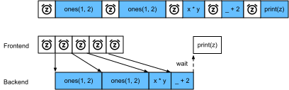

# Calcul asynchrone
:label:`sec_async` 

 Les ordinateurs d'aujourd'hui sont des systèmes hautement parallèles, composés de plusieurs cœurs de CPU (souvent plusieurs threads par cœur), de plusieurs éléments de traitement par GPU et souvent de plusieurs GPU par appareil. En bref, nous pouvons traiter beaucoup de choses différentes en même temps, souvent sur des appareils différents. Malheureusement, Python n'est pas un excellent moyen d'écrire du code parallèle et asynchrone, du moins pas sans aide supplémentaire. Après tout, Python est monofilaire et il est peu probable que cela change à l'avenir. Les cadres d'apprentissage profond tels que MXNet et TensorFlow adoptent un modèle de programmation *asynchrone* pour améliorer les performances,
tandis que PyTorch utilise le propre planificateur de Python, ce qui conduit à un compromis différent en matière de performances.
Pour PyTorch, par défaut, les opérations GPU sont asynchrones. Lorsque vous appelez une fonction qui utilise le GPU, les opérations sont mises en file d'attente sur le périphérique particulier, mais ne sont pas nécessairement exécutées avant plus tard. Cela nous permet d'exécuter plus de calculs en parallèle, y compris des opérations sur le CPU ou d'autres GPU.

Ainsi, comprendre le fonctionnement de la programmation asynchrone nous aide à développer des programmes plus efficaces, en réduisant de manière proactive les exigences de calcul et les dépendances mutuelles. Cela nous permet de réduire les frais de mémoire et d'augmenter l'utilisation du processeur.

```{.python .input}
#@tab mxnet
from d2l import mxnet as d2l
import numpy, os, subprocess
from mxnet import autograd, gluon, np, npx
from mxnet.gluon import nn
npx.set_np()
```

```{.python .input}
#@tab pytorch
from d2l import torch as d2l
import numpy, os, subprocess
import torch
from torch import nn
```

## Asynchronie via le backend

:begin_tab:`mxnet` 
 Pour s'échauffer, considérons le petit problème suivant : nous voulons générer une matrice aléatoire et la multiplier. Faisons-le à la fois dans NumPy et dans `mxnet.np` pour voir la différence.
:end_tab:

:begin_tab:`pytorch`
Pour vous échauffer, considérez le problème suivant : nous voulons générer une matrice aléatoire et la multiplier. Faisons-le à la fois dans NumPy et dans PyTorch tensor pour voir la différence.
Notez que PyTorch `tensor` est défini sur un GPU.
:end_tab:

```{.python .input}
#@tab mxnet
with d2l.Benchmark('numpy'):
    for _ in range(10):
        a = numpy.random.normal(size=(1000, 1000))
        b = numpy.dot(a, a)

with d2l.Benchmark('mxnet.np'):
    for _ in range(10):
        a = np.random.normal(size=(1000, 1000))
        b = np.dot(a, a)
```

```{.python .input}
#@tab pytorch
# Warmup for GPU computation
device = d2l.try_gpu()
a = torch.randn(size=(1000, 1000), device=device)
b = torch.mm(a, a)

with d2l.Benchmark('numpy'):
    for _ in range(10):
        a = numpy.random.normal(size=(1000, 1000))
        b = numpy.dot(a, a)

with d2l.Benchmark('torch'):
    for _ in range(10):
        a = torch.randn(size=(1000, 1000), device=device)
        b = torch.mm(a, a)
```

:begin_tab:`mxnet`
La sortie du benchmark via MXNet est plus rapide de plusieurs ordres de grandeur. Comme les deux sont exécutés sur le même processeur, il doit se passer quelque chose d'autre.
Le fait de forcer MXNet à terminer tous les calculs du backend avant de revenir montre ce qui s'est passé précédemment : les calculs sont exécutés par le backend pendant que le frontend renvoie le contrôle à Python.
:end_tab:

:begin_tab:`pytorch`
La sortie du benchmark via PyTorch est plus rapide de plusieurs ordres de grandeur.
Le produit scalaire de NumPy est exécuté sur le processeur du CPU, tandis que la multiplication matricielle de
PyTorch est exécutée sur le GPU. On s'attend donc à ce que ce dernier
soit beaucoup plus rapide. Mais l'énorme différence de temps suggère qu'il se passe quelque chose d'autre
.
Par défaut, les opérations GPU sont asynchrones dans PyTorch.
Le fait de forcer PyTorch à terminer tous les calculs avant de revenir montre
ce qui s'est passé précédemment : le calcul est exécuté par le backend
pendant que le frontend rend le contrôle à Python.
:end_tab:

```{.python .input}
#@tab mxnet
with d2l.Benchmark():
    for _ in range(10):
        a = np.random.normal(size=(1000, 1000))
        b = np.dot(a, a)
    npx.waitall()
```

```{.python .input}
#@tab pytorch
with d2l.Benchmark():
    for _ in range(10):
        a = torch.randn(size=(1000, 1000), device=device)
        b = torch.mm(a, a)
    torch.cuda.synchronize(device)
```

:begin_tab:`mxnet`
De manière générale, MXNet possède un frontal pour les interactions directes avec les utilisateurs, par exemple via Python, ainsi qu'un backend utilisé par le système pour effectuer les calculs. 
Comme le montre le site :numref:`fig_frontends` , les utilisateurs peuvent écrire des programmes MXNet dans différents langages frontaux, tels que Python, R, Scala et C++. Quel que soit le langage de programmation frontal utilisé, l'exécution des programmes MXNet se fait principalement dans le backend des implémentations C++. Les opérations émises par le langage frontal sont transmises au backend pour exécution. 
Le backend gère ses propres threads qui collectent et exécutent continuellement les tâches en file d'attente. Notez que pour que cela fonctionne, le backend doit être capable de garder la trace des dépendances entre les différentes étapes du graphe de calcul. Par conséquent, il n'est pas possible de paralléliser les opérations qui dépendent les unes des autres.
:end_tab:

:begin_tab:`pytorch`
D'une manière générale, PyTorch dispose d'un front-end pour l'interaction directe avec les utilisateurs, par exemple via Python, ainsi que d'un back-end utilisé par le système pour effectuer le calcul. 
Comme le montre le site :numref:`fig_frontends` , les utilisateurs peuvent écrire des programmes PyTorch dans différents langages frontaux, tels que Python et C++. Quel que soit le langage de programmation frontal utilisé, l'exécution des programmes PyTorch se fait principalement dans le backend des implémentations C++. Les opérations émises par le langage frontal sont transmises au backend pour être exécutées.
Le backend gère ses propres threads qui collectent et exécutent continuellement les tâches en file d'attente.
Notez que pour que cela fonctionne, le backend doit être capable de garder la trace des dépendances
entre les différentes étapes du graphe de calcul.
Par conséquent, il n'est pas possible de paralléliser les opérations qui dépendent les unes des autres.
:end_tab:


:width:`300px`
:label:`fig_frontends`

Prenons un autre exemple pour comprendre un peu mieux le graphe de dépendance.

```{.python .input}
#@tab mxnet
x = np.ones((1, 2))
y = np.ones((1, 2))
z = x * y + 2
z
```

```{.python .input}
#@tab pytorch
x = torch.ones((1, 2), device=device)
y = torch.ones((1, 2), device=device)
z = x * y + 2
z
```


:label:`fig_asyncgraph`


L'extrait de code ci-dessus est également illustré sur :numref:`fig_asyncgraph` .
Chaque fois que le thread Python du frontend exécute l'une des trois premières instructions, il renvoie simplement la tâche à la file d'attente du backend. Lorsque les résultats de la dernière instruction doivent être *imprimés*, le thread frontal Python attendra que le thread backend C++ ait fini de calculer le résultat de la variable `z`. L'un des avantages de cette conception est que le frontend thread Python n'a pas besoin d'effectuer de calculs réels. Ainsi, il y a peu d'impact sur la performance globale du programme, quelle que soit la performance de Python. :numref:`fig_threading` illustre comment le frontend et le backend interagissent.


:label:`fig_threading`


## Obstacles et bloqueurs

:begin_tab:`mxnet` 
 Il existe un certain nombre d'opérations qui obligent Python à attendre l'achèvement :

* Le plus évident est que `npx.waitall()` attend que tous les calculs soient terminés, quel que soit le moment où les instructions de calcul ont été émises. Dans la pratique, il est déconseillé d'utiliser cet opérateur sauf en cas de nécessité absolue, car il peut entraîner des performances médiocres.
* Si nous voulons simplement attendre qu'une variable spécifique soit disponible, nous pouvons appeler `z.wait_to_read()`. Dans ce cas, les blocs MXNet retournent à Python jusqu'à ce que la variable `z` ait été calculée. D'autres calculs peuvent se poursuivre ensuite.

Voyons comment cela fonctionne en pratique.
:end_tab:

```{.python .input}
#@tab mxnet
with d2l.Benchmark('waitall'):
    b = np.dot(a, a)
    npx.waitall()

with d2l.Benchmark('wait_to_read'):
    b = np.dot(a, a)
    b.wait_to_read()
```

:begin_tab:`mxnet`
Les deux opérations prennent approximativement le même temps pour se terminer. Outre les blocages évidents, nous vous recommandons de connaître les blocages *implicites*. L'impression d'une variable nécessite clairement que la variable soit disponible et est donc un bloqueur. Enfin, les conversions vers NumPy via `z.asnumpy()` et les conversions vers des scalaires via `z.item()` sont bloquantes, puisque NumPy n'a aucune notion d'asynchronie. Il a besoin d'accéder aux valeurs tout comme la fonction `print`. 

La copie fréquente de petites quantités de données de la portée de MXNet vers NumPy et vice-versa peut détruire les performances d'un code autrement efficace, puisque chaque opération de ce type exige que le graphe de calcul évalue tous les résultats intermédiaires nécessaires pour obtenir le terme pertinent *avant* que toute autre chose puisse être faite.
:end_tab:

```{.python .input}
#@tab mxnet
with d2l.Benchmark('numpy conversion'):
    b = np.dot(a, a)
    b.asnumpy()

with d2l.Benchmark('scalar conversion'):
    b = np.dot(a, a)
    b.sum().item()
```

## Amélioration du calcul

:begin_tab:`mxnet` 
 Sur un système fortement multithreadé (même les ordinateurs portables ordinaires ont 4 threads ou plus et sur les serveurs multi-socket, ce nombre peut dépasser 256), la surcharge des opérations d'ordonnancement peut devenir significative. C'est pourquoi il est hautement souhaitable que le calcul et l'ordonnancement se fassent de manière asynchrone et en parallèle. Pour illustrer les avantages de cette approche, voyons ce qui se passe si nous incrémentons une variable de 1 plusieurs fois, en séquence ou de manière asynchrone. Nous simulons une exécution synchrone en insérant une barrière `wait_to_read` entre chaque addition.
:end_tab:

```{.python .input}
#@tab mxnet
with d2l.Benchmark('synchronous'):
    for _ in range(10000):
        y = x + 1
        y.wait_to_read()

with d2l.Benchmark('asynchronous'):
    for _ in range(10000):
        y = x + 1
    npx.waitall()
```

:begin_tab:`mxnet`
Une interaction légèrement simplifiée entre le frontend Python et le backend C++ peut être résumée comme suit :
1. Le frontend ordonne au backend d'insérer la tâche de calcul `y = x + 1` dans la file d'attente.
1. Le backend reçoit ensuite les tâches de calcul de la file d'attente et effectue les calculs réels.
1. Le backend renvoie ensuite les résultats des calculs au frontend.
Supposons que les durées de ces trois étapes sont respectivement $t_1, t_2$ et $t_3$. Si nous n'utilisons pas la programmation asynchrone, le temps total nécessaire pour effectuer 10000 calculs est d'environ $10000 (t_1+ t_2 + t_3)$. Si la programmation asynchrone est utilisée, le temps total nécessaire pour effectuer 10000 calculs peut être réduit à $t_1 + 10000 t_2 + t_3$ (en supposant $10000 t_2 > 9999t_1$), puisque le frontend ne doit pas attendre que le backend renvoie les résultats des calculs pour chaque boucle.
:end_tab:


## Résumé


 * Les cadres d'apprentissage profond peuvent découpler le frontend Python d'un backend d'exécution. Cela permet une insertion asynchrone rapide des commandes dans le backend et le parallélisme associé.
* L'asynchronisme conduit à un frontal plutôt réactif. Cependant, il faut faire attention à ne pas trop remplir la file d'attente des tâches, car cela peut entraîner une consommation excessive de mémoire. Il est recommandé de synchroniser pour chaque minibatch afin de garder le frontend et le backend approximativement synchronisés.
* Les fournisseurs de puces offrent des outils d'analyse des performances sophistiqués permettant d'obtenir un aperçu beaucoup plus fin de l'efficacité de l'apprentissage profond.

:begin_tab:`mxnet`
* Soyez conscient du fait que les conversions de la gestion de la mémoire de MXNet en Python obligeront le backend à attendre que la variable spécifique soit prête. Des fonctions telles que `print`, `asnumpy` et `item` ont toutes cet effet. Cela peut être souhaitable, mais une utilisation imprudente de la synchronisation peut ruiner les performances.
:end_tab:


## Exercices

:begin_tab:`mxnet` 
 1. Nous avons mentionné ci-dessus que l'utilisation du calcul asynchrone peut réduire le temps total nécessaire pour effectuer 10000 calculs à $t_1 + 10000 t_2 + t_3$. Pourquoi devons-nous supposer $10000 t_2 > 9999 t_1$ ici ?
1. Mesurez la différence entre `waitall` et `wait_to_read`. Conseil : exécutez un certain nombre d'instructions et synchronisez pour un résultat intermédiaire.
:end_tab:

:begin_tab:`pytorch`
1. Sur le CPU, évaluez les mêmes opérations de multiplication de matrice que dans cette section. Pouvez-vous encore observer l'asynchronie via le backend ?
:end_tab:

:begin_tab:`mxnet`
[Discussions](https://discuss.d2l.ai/t/361)
:end_tab:

:begin_tab:`pytorch`
[Discussions](https://discuss.d2l.ai/t/2564)
:end_tab:
