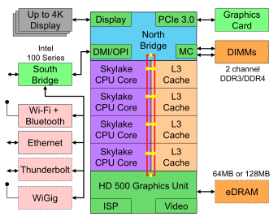
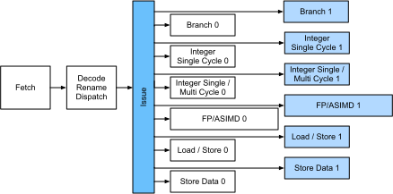
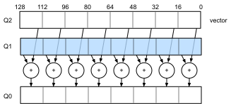
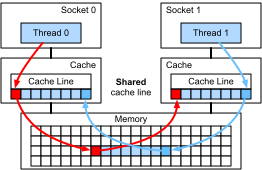

# Hardware
:label:`sec_hardware`

Building systems with great performance requires a good understanding of the algorithms and models to capture the statistical aspects of the problem. At the same time it is also indispensable to have at least a modicum of knowledge of the underlying hardware. The current section is no substitute for a proper course on hardware and systems design. Instead, it might serve as a starting point for understanding why some algorithms are more efficient than others and how to achieve good throughput. Good design can easily make a difference of an order of magnitude and, in turn, this can make the difference between being able to train a network (e.g. in a week) or not at all (in 3 months, thus missing the deadline). We'll start by looking at computers. Then we will zoom in to look more carefully at CPUs and GPUs. Lastly we zoom out to review how multiple computers are connected in a server center or in the cloud. This is not a GPU purchase guide. For this review :numref:`sec_buy_gpu`. An introduction to cloud computing with AWS can be found in :numref:`sec_aws`. 

Impatient readers may be able to get by with the table below. It is taken from Colin Scott's [interactive post](https://people.eecs.berkeley.edu/~rcs/research/interactive_latency.html) which gives a good overview of the progress over the past decade. The original numbers are due to Jeff Dean's [Stanford talk from 2010](https://static.googleusercontent.com/media/research.google.com/en//people/jeff/Stanford-DL-Nov-2010.pdf). The discussion below explains some of the rationale for these numbers and how they can guide us in designing algorithms. The discussion below is very high level and cursory. It is clearly *no substitute* for a proper course but rather just meant to provide enough information for a statistical modeler to make suitable design decisions. For an in-depth overview of computer architecture we refer the reader to :cite:`Hennessy.Patterson.2011` or a recent course on the subject, such as the one by [Arste Asanovic](http://inst.eecs.berkeley.edu/~cs152/sp19/).


## Computers

Most deep learning researchers have access to a computer with a fair amount of memory, compute, some form of an accelerator such as a GPU, or multiples thereof. On the inside the basic unit looks a bit like in the picture below (we marked up the parts relevant for deep learning):


It consists of several key components: 
* A processor, also referred to as CPU which is able to execute the programs we give it (in addition to running an operating system and many other things), typically consisting of 8 or more cores.
* Memory (RAM) to store and retrieve the results from computation, such as weight vectors, activations, often training data.
* An Ethernet network connection (sometimes multiple) with speeds ranging from 1Gbit/s to 100Gbit/s (on high end servers more advanced interconnects can be found).
* A high speed expansion bus (PCIe) to connect the system to one or more GPUs. Severs have up to 8 accelerators, often connected in an advanced topology, desktop systems have 1-2, depending on the budget of the user and the size of the power supply.
* Durable storage, such as a magnetic harddrive (HDD), solid state (SSD), in many cases connected using the PCIe bus, provides efficient transfer of training data to the system and storage of intermediate checkpoints as needed. 


:label:`fig_mobo-symbol`

As Figure :numref:`fig_mobo-symbol` indicates, most components (network, GPU, storage) are connected to the CPU across the PCI Express bus. It consists of multiple lanes that are directly attached to the CPU. For instance AMD's Threadripper 3 has 64 PCIe 4.0 lanes, each of which is capable 16 Gbit/s data transfer in both directions. The memory is directly attached to the CPU with a total bandwidth of up to 100 GB/s. 

When we run code on a computer we need to shuffle data to the processors (CPU or GPU), perform computation and then move the results off the processor back to RAM and durable storage. Hence, in order to get good performance we need to make sure that this works seamlessly without any one of the systems becoming a major bottleneck. For instance, if we cannot load images quickly enough the processor won't have any work to do. Likewise, if we cannot move matrices quickly enough to the CPU (or GPU), its processing elements will starve. Finally, if we want to synchronize multiple computers across the network, the latter shouldn't slow down computation. One option is to interleave communication and computation. Let's have a look at the various components in more detail. 

## Memory

At its most basic memory is used to store data that needs to be readily accessible. At present CPU RAM is typically of the [DDR4](https://en.wikipedia.org/wiki/DDR4_SDRAM) variety, offering 20-25GB/s bandwidth per module. Each module has a 64 bit wide bus. Typically pairs of memory modules are used to allow for multiple channels. CPUs have between 2 and 4 memory channels, i.e. they have between 40GB/s and 100GB/s peak memory bandwidth. Often there are two banks per channel. For instance AMD's Zen 3 Threadripper has 8 slots. 

While these numbers are impressive, indeed, they only tell part of the story. When we want to read a portion from memory we first need to tell the memory module where the information can be found. That is, we first need to send the *address* to RAM. Once this accomplished we can choose to read just a single 64bit record or a long sequence of records. The latter is called *burst read*. In a nutshell, sending an address to memory and setting up the transfer takes approximately 100ns (details depend on the specific timing coefficients of the memory chips used), every subsequent transfer takes only 0.2ns. In short, the first read is 500 times as expensive as subsequent ones! We could perform up to $10,000,000$ random reads per second. This suggests that we avoid random memory access as far as possible and use burst reads (and writes) instead. 

Matters are a bit more complex when we take into account that we have multiple banks. Each bank can read memory largely independently. This means two things: the effective number of random reads is up to 4x higher, provided that they are spread evenly across memory. It also means that it's still a bad idea to perform random reads since burst reads are 4x faster, too. Secondly, due to memory alignment to 64 bit boundaries it is a good idea to align any datastructures with the same boundaries. Compilers do this pretty much [automatically](https://en.wikipedia.org/wiki/Data_structure_alignment) when the appropriate flags are set. Curious readers are encouraged to review a lecture on DRAMs such as the one by [Zeshan Chishti](http://web.cecs.pdx.edu/~zeshan/ece585_lec5.pdf).

GPU memory is subject to even higher bandwidth requirements since they have many more processing elements than CPUs. By and large there are two options to address them. One is to make the memory bus significantly wider. For instance NVIDIA's RTX 2080 Ti has a 352 bit wide bus. This allows for much more information to be transferred at the same time. Secondly, GPUs use specific high-performance memory. Consumer grade devices, such as NVIDIA's RTX and Titan series typically use [GDDR6](https://en.wikipedia.org/wiki/GDDR6_SDRAM) chips with over 500 GB/s aggregate bandwidth. An alternative is to use HBM (high bandwidth memory) modules. They use a very different interface and connect directly with GPUs on a dedicated silicon wafer. This makes them very expensive and their use is typically limited to high end server chips, such as the NVIDIA Volta V100 series of accelerators. Quite unsurprisingly GPU memory is *much* smaller than CPU memory due to its higher cost. For our purposes, by and large their performance characteristics are similar, just a lot faster. We can safely ignore the details for the purpose of this book. They only matter when tuning GPU kernels for high throughput. 

## Storage

We saw that some of the key characteristics of RAM were *bandwidth* and *latency*. The same is true for storage devices, just that the differences can be even more extreme. 

**Hard Disks** have been in use for over half a century. In a nutshell they contain a number of spinning platters with heads that can be positioned to read / write at any given track. High end end disks hold up to 16TB on 9 platters. One of the key benefits of HDDs is that they are relatively inexpensive. One of their many downsides are their typically catastrophic failure modes and their relatively high read latency. 

To understand the latter, consider the fact that HDDs spin at around 7,200 RPM. If they were much faster they would shatter due to the centrifugal force exerted on the platters. This has a major downside when it comes to accessing a specific sector on the disk: we need to wait until the platter has rotated in position (we can move the heads but not accelerate the actual disks). Hence it can take over 8ms until the requested data is available. A common way this is expressed is to say that HDDs can operate at approximately 100 IOPs. This number has essentially remained unchanged for the past two decades. Worse still, it is equally difficult to increase bandwidth (it is in the order of 100-200 MB/s). After all, each head reads a track of bits, hence the bit rate only scales with the square root of the information density. As a result HDDs are quickly becoming relegated to archival storage and low-grade storage for very large datasets. 

**Solid State Drives** use Flash memory to store information persistently. This allows for *much faster* access to stored records. Modern SSDs can operate at 100,000 to 500,000 IOPs, i.e. up to 3 orders of magnitude faster than HDDs. Furthermore, their bandwidth can reach 1-3GB/s, i.e. one order of magnitude faster than HDDs. These improvements sound almost too good to be true. Indeed, they come with a number of caveats, due to the way SSDs are designed. 

* SSDs store information in blocks (256 KB or larger). They can only be written as a whole, which takes significant time. Consequently bit-wise random writes on SSD have very poor performance. Likewise, writing data in general takes significant time since the block has to be read, erased and then rewritten with new information. By now SSD controllers and firmware have developed algorithms to mitigate this. Nonetheless writes can be much slower, in particular for QLC (quad level cell) SSDs. The key for improved performance is to maintain a *queue* of operations, to prefer reads and to write in large blocks if possible. 
* The memory cells in SSDs wear out relatively quickly (often already after a few thousand writes). Wear-level protection algorithms are able to spread the degradation over many cells. That said, it is not recommended to use SSDs for swap files or for large aggregations of log-files. 
* Lastly, the massive increase in bandwidth has forced computer designers to attach SSDs directly to the PCIe bus. The drives capable of handling this, referred to as NVMe (Non Volatile Memory enhanced), can use up to 4 PCIe lanes. This amounts to up to 8GB/s on PCIe 4.0. 

**Cloud Storage** provides a configurable range of performance. That is, the assignment of storage to virtual machines is dynamic, both in terms of quantity and in terms speed, as chosen by the user. We recommend that the user increase the provisioned number of IOPs whenever latency is too high, e.g. during training with many small records.

## CPUs

Central Processing Units (CPUs) are the centerpiece of any computer (as before we give a very high level description focusing primarily on what matters for efficient deep learning models). They consist of a number of key components: processor cores which are able to execute machine code, a bus connecting them (the specific topology differs significantly between processor models, generations and vendors), and caches to allow for higher bandwidth and lower latency memory access than what is possible by reads from main memory. Lastly, almost all modern CPUs contain vector processing units to aid with high performance linear algebra and convolutions, as they are common in media processing and machine learning. 


:label:`fig_skylake`

:numref:`fig_skylake` depicts an Intel Skylake consumer grade quad-core CPU. It has an integrated GPU, caches, and a ringbus connecting the four cores. Peripherals (Ethernet, WiFi, Bluetooth, SSD controller, USB, etc.) are either part of the chipset or directly attached (PCIe) to the CPU. 

### Microarchitecture

Each of the processor cores consists of a rather sophisticated set of components. While details differ between generations and vendors, the basic functionality is pretty much standard. The front end loads instructions and tries to predict which path will be taken (e.g. for control flow). Instructions are then decoded from assembly code to microinstructions. Assembly code is often not the lowest level code that a processor executes. Instead, complex instructions may be decoded into a set of more lower level operations. These are then processed by the actual execution core. Often the latter is capable of performing many operations simultaneously. For instance, the ARM Cortex A77 core of :numref:`fig_cortexa77` is able to perform up to 8 operations simultaneously. 


:width:`400px`
:label:`fig_cortexa77`

This means that efficient programs might be able to perform more than one instruction per clock cycle, *provided that* they can be carried out independently. Not all units are created equal. Some specialize in integer instructions whereas others are optimized for floating point performcne. To increase throughput the processor might also follow  multiple codepaths simultaneously in a branching instruction and then discard the results of the branch not taken. This is why branch prediction units matter (on the frontend) such that only the most promising paths are pursued. 

### Vectorization

Deep learning is extremely compute hungry. Hence, to make CPUs suitable for machine learning one needs to perform many operations in one clock cycle. This is achieved via vector units. They have different names: on ARM they're called NEON, on x86 the latest generation is referred to as [AVX2](https://en.wikipedia.org/wiki/Advanced_Vector_Extensions) units. A common aspect is that they are able to perform SIMD (single instruction multiple data) operations. The diagram below shows how 8 short integers can be added in one clock cycle on ARM.


:label:`fig_neon128`

Depending on architecture choices such registers are up to 512 bit long, allowing for the combination of up to 64 pairs of numbers. For instance, we might be multiplying two numbers and adding them to a third, which is also known as a fused multiply-add. Intel's [OpenVino](https://01.org/openvinotoolkit) uses these to achieve respectable throughput for deep learning on server grade CPUs. Note, though, that this number is entirely dwarved by what GPUs are capable of achieving. For instance, NVIDIA's RTX 2080 Ti has 4,352 CUDA cores, each of which is capable of processing such an operation at any time. 

### Cache

Consider the following situation: we have a modest CPU core with 4 cores as depicted in :numref:`fig_skylake` above, running at 2GHz frequency. Moreover, let's assume that we have an IPC (instructions per clock) count of 1 and that the units have AVX2 with 256bit width enabled. Let's furthermore assume that at least one of the registers used for AVX2 operations needs to be retrieved from memory. This means that the CPU consumes 4x256bit = 1kbit of data per clock cycle. Unless we are able to transfer $2 \cdot 10^9 \cdot 128 = 256 \cdot 10^9$ bytes to the processor per second the processing elements are going to starve. Unfortunately the memory interface of such a chip only supports 20-40 GB/s data transfer, i.e. one order of magnitude less. The fix is to avoid loading *new* data from memory as far as possible and rather to cache it locally on the CPU. This is where caches come in handy (see this [Wikipedia article](https://en.wikipedia.org/wiki/Cache_hierarchy) for a primer). Commonly the following names / concepts are used:

* **Registers** are strictly speaking not part of the cache. They help stage instructions. That said, CPU registers are memory locations that a CPU can access at clock speed without any delay penalty. CPUs have tens of registers. It is up to the compiler (or programmer) to use registers efficiently. For instance the C programming language has a `register` keyword. 
* **L1** caches are the first line of defense against high memory bandwidth requirements. L1 caches are tiny (typical sizes might be 32-64kB) and often split into data and instructions caches. When data is found in the L1 cache access is very fast. If it cannot be found there, the search progresses down the cache hierarchy. 
* **L2** caches are the next stop. Depending on architecture design and processor size they might be exclusive. They might be accessible only by a given core or shared between multiple cores. L2 caches are larger (typically 256-512kB per core) and slower than L1. Furthermore, to access something in L2 we first need to check to realize that the data isn't in L1, which adds a small amount of extra latency. 
* **L3** caches are shared between multiple cores and can be quite large. AMD's Epyc 3 server CPUs have a whopping 256MB of cache spread across multiple chiplets. More typical numbers are in the 4-8MB range. 

Adding caches is a double-edge sword. On one hand they ensure that the processor cores don't starve of data. At the same time they increase chip size, using up area that otherwise could have been spent on increasing processing power. Moreover, *cache misses* can be expensive. Consider the worst case scenario, depicted in :numref:`fig_falsesharing`. A memory location is cached on processor 0 when a thread on processor 1 requests the data. To obtain it, processor 0 needs to stop what it's doing, write the information back to main memory and then let processor 1 read it from memoruy. During this operation both processors wait. Quite potentially such code runs *more slowly* on multiple processors when compared to an efficient single-processor implementation. This is one more reason for why there is a practical limit to cache sizes (besides their physical size).


:label:`fig_falsesharing`

## GPUs

It is not an exaggeration to claim that deep learning would not have been successful without GPUs. By the same token, it is quite reasonable to argue that GPU manufacturers' fortunes have been increased significantly due to deep learning. This co-evolution of hardware and algorithms has led to a situation where for better or worse deep learning is the preferable statistical modeling paradigm. Hence it pays to understand the specific benefits that GPUs and related accelerators such as the TPU :cite:`Jouppi.Young.Patil.ea.2017` offer. Of note is a distinction that is often made in practice: accelerators are optimized either for training or inference. For the former 


[NVIDIA Turing](https://devblogs.nvidia.com/nvidia-turing-architecture-in-depth/)


:width:`400px`
:label:`fig_turing`


:width:`400px`
:label:`fig_tensorcore`


## Networks and Buses

## Embedded and Mobile

## Summary

## Exercises

1. Aliasing
1. Multiple channels
1. Square root read speed for HDDs
1. PCIe multiplexer

```{.python .input}

```
