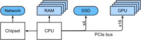
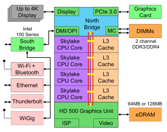
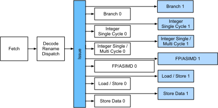

# Matériel
:label:`sec_hardware` 

La construction de systèmes très performants nécessite une bonne compréhension des algorithmes et des modèles permettant de saisir les aspects statistiques du problème. En même temps, il est également indispensable d'avoir au moins un minimum de connaissances sur le matériel sous-jacent. La présente section ne remplace pas un cours approprié sur le matériel et la conception de systèmes. Elle peut plutôt servir de point de départ pour comprendre pourquoi certains algorithmes sont plus efficaces que d'autres et comment obtenir un bon débit. Une bonne conception peut facilement faire une différence d'un ordre de grandeur et, à son tour, cela peut faire la différence entre être capable de former un réseau (par exemple, en une semaine) et pas du tout (en 3 mois, manquant ainsi la date limite). 
Nous commencerons par examiner les ordinateurs. Puis nous ferons un zoom avant pour examiner de plus près les CPU et les GPU. Enfin, nous ferons un zoom arrière pour examiner comment plusieurs ordinateurs sont connectés dans un centre serveur ou dans le nuage. 

:label:`fig_latencynumbers`

Les lecteurs impatients pourront se contenter du site :numref:`fig_latencynumbers`. Il est tiré de l'ouvrage de Colin Scott [interactive post](https://people.eecs.berkeley.edu/~)rcs/research/interactive_latency.html) qui donne un bon aperçu des progrès réalisés au cours de la dernière décennie. Les chiffres originaux sont dus à Jeff Dean ( [Stanford talk from 2010](https://static.googleusercontent.com/media/research.google.com/en//people/jeff/Stanford-DL-Nov-2010.pdf)).
La discussion ci-dessous explique en partie la raison d'être de ces chiffres et comment ils peuvent nous guider dans la conception d'algorithmes. La discussion ci-dessous est de très haut niveau et superficielle. Elle ne remplace évidemment pas un cours approprié, mais vise plutôt à fournir suffisamment d'informations pour qu'un modélisateur statistique puisse prendre des décisions de conception appropriées. Pour un aperçu approfondi de l'architecture des ordinateurs, nous renvoyons le lecteur à :cite:`Hennessy.Patterson.2011` ou à un cours récent sur le sujet, tel que celui de [Arste Asanovic](http://inst.eecs.berkeley.edu/~)cs152/sp19/).

## Ordinateurs

La plupart des chercheurs et praticiens de l'apprentissage profond ont accès à un ordinateur doté d'une quantité raisonnable de mémoire, de calcul, d'une forme d'accélérateur tel qu'un GPU, ou de multiples de ces éléments. Un ordinateur se compose des éléments clés suivants :

* Un processeur (également appelé CPU) capable d'exécuter les programmes que nous lui donnons (en plus de faire tourner un système d'exploitation et bien d'autres choses), généralement constitué de 8 cœurs ou plus.
* Une mémoire (RAM) pour stocker et récupérer les résultats des calculs, tels que les vecteurs de poids et les activations, ainsi que les données d'apprentissage.
* Une connexion réseau Ethernet (parfois multiple) avec des vitesses allant de 1 Go/s à 100 Go/s. Sur les serveurs haut de gamme, on peut trouver des interconnexions plus avancées.
* Un bus d'extension à haut débit (PCIe) pour connecter le système à un ou plusieurs GPU. Les serveurs ont jusqu'à 8 accélérateurs, souvent connectés dans une topologie avancée, tandis que les systèmes de bureau en ont 1 ou 2, selon le budget de l'utilisateur et la taille de l'alimentation électrique.
* Stockage durable, tel qu'un disque dur magnétique, un lecteur à état solide, dans de nombreux cas connectés à l'aide du bus PCIe. Il permet un transfert efficace des données d'entraînement vers le système et le stockage de points de contrôle intermédiaires si nécessaire.

:label:`fig_mobo-symbol`

Comme l'indique le site :numref:`fig_mobo-symbol`, la plupart des composants (réseau, GPU et stockage) sont connectés au CPU par le bus PCIe. Ce dernier se compose de plusieurs voies qui sont directement reliées au CPU. Par exemple, le Threadripper 3 d'AMD possède 64 voies PCIe 4.0, chacune d'entre elles étant capable de transférer des données à 16 Gbit/s dans les deux sens. La mémoire est directement rattachée au CPU avec une bande passante totale pouvant atteindre 100 Go/s.

Lorsque nous exécutons du code sur un ordinateur, nous devons transférer des données vers les processeurs (CPU ou GPU), effectuer des calculs, puis transférer les résultats du processeur vers la RAM et le stockage durable. Par conséquent, pour obtenir de bonnes performances, nous devons nous assurer que tout cela fonctionne de manière transparente, sans qu'aucun des systèmes ne devienne un goulot d'étranglement majeur. Par exemple, si nous ne pouvons pas charger les images assez rapidement, le processeur n'aura pas de travail à faire. De même, si nous ne pouvons pas déplacer les matrices assez rapidement vers le CPU (ou le GPU), ses éléments de traitement seront affamés. Enfin, si nous voulons synchroniser plusieurs ordinateurs sur le réseau, ce dernier ne doit pas ralentir le calcul. Une option consiste à entrelacer la communication et le calcul. Examinons plus en détail les différents composants.

## Mémoire

A la base, la mémoire sert à stocker des données qui doivent être facilement accessibles. À l'heure actuelle, la RAM des processeurs est généralement de type [DDR4](https://en.wikipedia.org/wiki/DDR4_SDRAM), offrant une bande passante de 20 à 25 Go/s par module. Chaque module dispose d'un bus de 64 bits de large. En général, des paires de modules de mémoire sont utilisées pour permettre des canaux multiples. Les processeurs disposent de 2 à 4 canaux de mémoire, c'est-à-dire qu'ils ont une bande passante mémoire de 4 0 Go/s à 100 Go/s en crête. Il y a souvent deux banques par canal. Par exemple, le Zen 3 Threadripper d'AMD dispose de 8 emplacements.

Si ces chiffres sont impressionnants, en effet, ils ne racontent qu'une partie de l'histoire. Lorsque nous voulons lire une partie de la mémoire, nous devons d'abord indiquer au module de mémoire où l'information peut être trouvée. Autrement dit, nous devons d'abord envoyer l'*adresse* à la RAM. Une fois cette opération effectuée, nous pouvons choisir de lire un seul enregistrement de 64 bits ou une longue séquence d'enregistrements. Ce dernier cas est appelé *burst read*. En bref, l'envoi d'une adresse à la mémoire et l'établissement du transfert prennent environ 100 ns (les détails dépendent des coefficients de synchronisation spécifiques des puces mémoire utilisées), chaque transfert ultérieur ne prend que 0,2 ns. En bref, la première lecture est 500 fois plus coûteuse que les suivantes ! Notez que nous pourrions effectuer jusqu'à 10.000.000 de lectures aléatoires par seconde. Cela suggère d'éviter autant que possible les accès aléatoires à la mémoire et d'utiliser plutôt les lectures (et les écritures) en rafale.

Les choses sont un peu plus complexes lorsque nous prenons en compte le fait que nous avons plusieurs *banques*. Chaque banque peut lire la mémoire de manière largement indépendante. Cela signifie deux choses. 
D'une part, le nombre effectif de lectures aléatoires est jusqu'à 4 fois plus élevé, à condition qu'elles soient réparties uniformément sur la mémoire. Cela signifie également que c'est toujours une mauvaise idée d'effectuer des lectures aléatoires puisque les lectures en rafale sont également 4 fois plus rapides. D'autre part, en raison de l'alignement de la mémoire sur les limites de 64 bits, il est judicieux d'aligner toutes les structures de données sur les mêmes limites. Les compilateurs le font pratiquement à l'adresse [automatically](https://en.wikipedia.org/wiki/Data_structure_alignment) lorsque les drapeaux appropriés sont activés. Les lecteurs curieux sont invités à consulter un cours sur les DRAM, comme celui de [Zeshan Chishti](http://web.cecs.pdx.edu/~)zeshan/ece585_lec5.pdf).

La mémoire des GPU est soumise à des exigences de bande passante encore plus élevées, car ils possèdent beaucoup plus d'éléments de traitement que les CPU. Dans l'ensemble, il existe deux options pour y répondre. La première consiste à élargir considérablement le bus mémoire. Par exemple, la RTX 2080 Ti de NVIDIA possède un bus de 352 bits. Cela permet de transférer beaucoup plus d'informations en même temps. Deuxièmement, les GPU utilisent une mémoire spécifique de haute performance. Les appareils grand public, tels que les séries RTX et Titan de NVIDIA, utilisent généralement les puces [GDDR6](https://en.wikipedia.org/wiki/GDDR6_SDRAM) avec une bande passante globale de plus de 500 Go/s. Une alternative consiste à utiliser des modules HBM (mémoire à large bande passante). Ils utilisent une interface très différente et se connectent directement aux GPU sur une tranche de silicium dédiée. Ils sont donc très coûteux et leur utilisation est généralement limitée aux puces de serveur haut de gamme, comme les accélérateurs de la série NVIDIA Volta V100. Comme on pouvait s'y attendre, la mémoire des GPU est généralement *beaucoup* plus petite que celle des CPU en raison du coût plus élevé de la première. En ce qui nous concerne, leurs caractéristiques de performance sont généralement similaires, mais elles sont beaucoup plus rapides. Nous pouvons ignorer les détails dans le cadre de ce livre. Ils n'ont d'importance que lors du réglage des noyaux GPU pour un débit élevé.

## Stockage

Nous avons vu que certaines des caractéristiques clés de la RAM sont la *bande passante* et la *latence*. Il en va de même pour les périphériques de stockage, à ceci près que les différences peuvent être encore plus extrêmes.

### Disques durs

*Les disques durs (HDD) sont utilisés depuis plus d'un demi-siècle. En résumé, ils contiennent un certain nombre de plateaux tournants avec des têtes qui peuvent être positionnées pour lire ou écrire sur une piste donnée. Les disques haut de gamme peuvent contenir jusqu'à 16 To sur 9 plateaux. L'un des principaux avantages des disques durs est qu'ils sont relativement peu coûteux. L'un de leurs nombreux inconvénients est leur mode de défaillance généralement catastrophique et leur latence de lecture relativement élevée.

Pour comprendre ce dernier point, il faut savoir que les disques durs tournent à environ 7 200 tours par minute. S'ils étaient beaucoup plus rapides, ils se briseraient en raison de la force centrifuge exercée sur les plateaux. Cela présente un inconvénient majeur lorsqu'il s'agit d'accéder à un secteur spécifique du disque : il faut attendre que le plateau ait tourné en position (on peut déplacer les têtes mais pas accélérer les disques eux-mêmes). Il peut donc s'écouler plus de 8 ms avant que les données demandées soient disponibles. Une façon courante d'exprimer cela est de dire que les disques durs peuvent fonctionner à environ 100 IOPs (opérations d'entrée/sortie par seconde). Ce chiffre est resté essentiellement inchangé au cours des deux dernières décennies. Pire encore, il est tout aussi difficile d'augmenter la bande passante (elle est de l'ordre de 100--200 MB/s). Après tout, chaque tête lit une piste de bits, et donc le débit binaire n'évolue qu'en fonction de la racine carrée de la densité d'information. Par conséquent, les disques durs sont rapidement relégués au stockage d'archives et au stockage de qualité inférieure pour les très grands ensembles de données.

### Solid State Drives

Les Solid State Drives (SSD) utilisent la mémoire flash pour stocker les informations de manière persistante. Cela permet un accès *beaucoup plus rapide* aux documents stockés. Les SSD modernes peuvent fonctionner à une vitesse de 100 000 à 500 000 IOP, c'est-à-dire jusqu'à 3 ordres de grandeur plus vite que les disques durs. En outre, leur bande passante peut atteindre 1 à 3 Go/s, soit un ordre de grandeur de plus que les disques durs. Ces améliorations semblent presque trop belles pour être vraies. En effet, elles s'accompagnent des mises en garde suivantes, dues à la façon dont les disques SSD sont conçus.

* Les disques SSD stockent les informations par blocs (256 Ko ou plus). Ils ne peuvent être écrits que dans leur ensemble, ce qui prend beaucoup de temps. Par conséquent, les écritures aléatoires bit à bit sur les SSD sont très peu performantes. De même, l'écriture de données en général prend beaucoup de temps, car le bloc doit être lu, effacé, puis réécrit avec de nouvelles informations. Aujourd'hui, les contrôleurs et les microprogrammes des SSD ont développé des algorithmes pour atténuer ce problème. Néanmoins, les écritures peuvent être beaucoup plus lentes, en particulier pour les SSD QLC (quad level cell). La clé pour améliorer les performances est de maintenir une *file d'attente* d'opérations, de préférer les lectures et d'écrire dans de grands blocs si possible.
* Les cellules de mémoire des SSD s'usent relativement vite (souvent déjà après quelques milliers d'écritures). Les algorithmes de protection contre l'usure sont capables de répartir la dégradation sur de nombreuses cellules. Cela dit, il n'est pas recommandé d'utiliser les SSD pour échanger des fichiers ou pour de grandes agrégations de fichiers journaux.
* Enfin, l'augmentation massive de la bande passante a obligé les concepteurs d'ordinateurs à connecter les SSD directement au bus PCIe. Les disques capables de gérer cela, appelés NVMe (Non Volatile Memory enhanced), peuvent utiliser jusqu'à 4 voies PCIe. Cela représente jusqu'à 8 Go/s sur PCIe 4.0.

### Cloud Storage

Le stockage en nuage offre une gamme configurable de performances. En d'autres termes, l'affectation du stockage aux machines virtuelles est dynamique, tant en termes de quantité que de vitesse, au choix des utilisateurs. Nous recommandons aux utilisateurs d'augmenter le nombre d'IOP provisionnés lorsque la latence est trop élevée, par exemple, lors de l'entraînement avec de nombreux petits enregistrements.

## CPUs

Les unités centrales de traitement (CPUs) sont la pièce maîtresse de tout ordinateur. Elles sont constituées d'un certain nombre de composants clés : des *cœurs de processeur* capables d'exécuter du code machine, un *bus* les reliant (la topologie spécifique diffère considérablement selon les modèles, les générations et les fournisseurs de processeurs), et des *caches* permettant un accès à la mémoire à plus grande largeur de bande et à plus faible latence que ce qui est possible en lisant la mémoire principale. Enfin, presque tous les processeurs modernes contiennent des *unités de traitement vectoriel* pour faciliter l'algèbre linéaire et les convolutions à haute performance, qui sont courantes dans le traitement des médias et l'apprentissage automatique.

 
:label:`fig_skylake` 

 :numref:`fig_skylake` représente un processeur quadricœur Intel Skylake de qualité grand public. Il dispose d'un GPU intégré, de caches et d'un bus circulaire reliant les quatre cœurs. Les périphériques, tels que Ethernet, WiFi, Bluetooth, le contrôleur SSD et USB, font partie du chipset ou sont directement reliés (PCIe) au CPU.

### Microarchitecture

Chacun des cœurs de processeur est constitué d'un ensemble assez sophistiqué de composants. Si les détails diffèrent selon les générations et les fournisseurs, la fonctionnalité de base est à peu près standard. Le frontal charge les instructions et essaie de prédire le chemin qui sera emprunté (par exemple, pour le flux de contrôle). Les instructions sont ensuite décodées du code d'assemblage en micro-instructions. Souvent, le code d'assemblage n'est pas le code de plus bas niveau qu'un processeur exécute. Au contraire, les instructions complexes peuvent être décodées en un ensemble d'opérations de plus bas niveau. Celles-ci sont ensuite traitées par le noyau d'exécution proprement dit. Ce dernier est souvent capable d'effectuer de nombreuses opérations simultanément. Par exemple, le cœur ARM Cortex A77 de :numref:`fig_cortexa77` est capable d'effectuer jusqu'à 8 opérations simultanément.

:label:`fig_cortexa77`

Cela signifie que des programmes efficaces peuvent être capables d'exécuter plus d'une instruction par cycle d'horloge, à condition qu'ils puissent être exécutés indépendamment. Toutes les unités ne sont pas créées égales. Certaines sont spécialisées dans les instructions en nombres entiers, tandis que d'autres sont optimisées pour les performances en virgule flottante. Pour augmenter le débit, le processeur peut également suivre plusieurs chemins de code simultanément dans une instruction de branchement, puis rejeter les résultats des branchements non effectués. C'est pourquoi les unités de prédiction de branchement sont importantes (en amont), de sorte que seuls les chemins les plus prometteurs sont suivis.

### Vectorisation

L'apprentissage profond est extrêmement gourmand en ressources informatiques. Par conséquent, pour que les processeurs conviennent à l'apprentissage automatique, il faut effectuer de nombreuses opérations en un cycle d'horloge. On y parvient grâce aux unités vectorielles. Elles portent différents noms : sur ARM, elles sont appelées NEON, sur x86 elles (une génération récente) sont appelées [AVX2](https://en.wikipedia.org/wiki/Advanced_Vector_Extensions) units. Leur point commun est qu'elles sont capables d'effectuer des opérations SIMD (single instruction multiple data). :numref:`fig_neon128` montre comment 8 entiers courts peuvent être ajoutés en un cycle d'horloge sur ARM.

:label:`fig_neon128`

Selon les choix d'architecture, ces registres ont une longueur pouvant atteindre 512 bits, ce qui permet de combiner jusqu'à 64 paires de nombres. Par exemple, nous pouvons multiplier deux nombres et les ajouter à un troisième, ce qui est également connu comme une multiplication-addition fusionnée. Le site [OpenVino](https://01.org/openvinotoolkit) d'Intel les utilise pour obtenir un débit respectable pour l'apprentissage profond sur les processeurs de niveau serveur. Notez, cependant, que ce chiffre est entièrement éclipsé par ce que les GPU sont capables d'atteindre. Par exemple, le RTX 2080 Ti de NVIDIA possède 4 352 cœurs CUDA, chacun d'entre eux étant capable de traiter une telle opération à tout moment.

### Cache

Considérons la situation suivante : nous disposons d'un modeste processeur à 4 cœurs, tel que représenté sur le site :numref:`fig_skylake` ci-dessus, fonctionnant à une fréquence de 2 GHz.
De plus, supposons que le nombre d'IPC (instructions par horloge) est de 1 et que les unités ont AVX2 avec une largeur de 256 bits. Supposons en outre qu'au moins un des registres utilisés pour les opérations AVX2 doive être récupéré de la mémoire. Cela signifie que l'unité centrale consomme $4 \times 256 \text{ bit} = 128 \text{ bytes}$ de données par cycle d'horloge. Si nous ne sommes pas capables de transférer $2 \times 10^9 \times 128 = 256 \times 10^9$ octets au processeur par seconde, les éléments de traitement vont mourir de faim. Malheureusement, l'interface mémoire d'une telle puce ne supporte que 20--40 GB/s de transfert de données, c'est-à-dire un ordre de grandeur de moins. La solution consiste à éviter autant que possible de charger les *nouvelles* données de la mémoire et à les mettre en cache localement sur le processeur. C'est là que les caches sont utiles. Les noms ou concepts suivants sont couramment utilisés :

* **Les registres** ne font pas partie du cache à proprement parler. Ils permettent d'organiser les instructions. Cela dit, les registres de l'UC sont des emplacements de mémoire auxquels l'UC peut accéder à la vitesse de l'horloge sans aucune pénalité de retard. Les CPU ont des dizaines de registres. C'est au compilateur (ou au programmeur) d'utiliser les registres de manière efficace. Par exemple, le langage de programmation C possède un mot-clé `register`.
* **Les caches L1** constituent la première ligne de défense contre les besoins élevés en bande passante mémoire. Les caches L1 sont minuscules (leur taille typique peut être de 32 à 64 Ko) et sont souvent divisés en caches de données et d'instructions. Lorsque les données sont trouvées dans le cache L1, l'accès est très rapide. Si elles ne s'y trouvent pas, la recherche progresse dans la hiérarchie du cache.
* **Les caches L2** sont l'étape suivante. Selon la conception de l'architecture et la taille du processeur, ils peuvent être exclusifs. Ils peuvent être accessibles uniquement par un cœur donné ou partagés entre plusieurs cœurs. Les caches L2 sont plus grands (généralement 256-512 Ko par cœur) et plus lents que L1. De plus, pour accéder à quelque chose dans L2, nous devons d'abord vérifier que les données ne sont pas dans L1, ce qui ajoute une petite quantité de latence supplémentaire.
* **Les caches L3** sont partagés entre plusieurs cœurs et peuvent être assez grands. Les processeurs de serveur Epyc 3 d'AMD disposent d'un énorme 256 Mo de cache répartis sur plusieurs cœurs. Les chiffres les plus courants sont de l'ordre de 4 à 8 Mo.

Prédire quels éléments de mémoire seront nécessaires ensuite est l'un des principaux paramètres d'optimisation dans la conception des puces. Par exemple, il est conseillé de parcourir la mémoire dans le sens *avant* car la plupart des algorithmes de mise en cache essaieront de *lire en avant* plutôt qu'en arrière. De même, garder les modèles d'accès à la mémoire en local est un bon moyen d'améliorer les performances.

L'ajout de caches est une arme à double tranchant. D'une part, ils garantissent que les cœurs du processeur ne manquent pas de données. D'autre part, ils augmentent la taille de la puce, utilisant une surface qui aurait pu être consacrée à l'augmentation de la puissance de traitement. De plus, les *manques de mémoire cache peuvent être coûteux. Considérons le pire scénario, le *faux partage*, tel qu'il est décrit sur le site :numref:`fig_falsesharing`. Un emplacement de mémoire est mis en cache sur le processeur 0 lorsqu'un thread sur le processeur 1 demande les données. Pour l'obtenir, le processeur 0 doit arrêter ce qu'il est en train de faire, réécrire l'information en mémoire principale, puis laisser le processeur 1 la lire en mémoire. Pendant cette opération, les deux processeurs attendent. Il est tout à fait possible qu'un tel code s'exécute *plus lentement* sur plusieurs processeurs par rapport à une implémentation efficace sur un seul processeur. C'est une raison de plus pour laquelle il existe une limite pratique à la taille des caches (outre leur taille physique).

:label:`fig_falsesharing` 

### GPU et autres accélérateurs

Il n'est pas exagéré d'affirmer que l'apprentissage profond n'aurait pas réussi sans les GPU. De même, il est tout à fait raisonnable d'affirmer que la fortune des fabricants de GPU a considérablement augmenté grâce à l'apprentissage profond. Cette coévolution du matériel et des algorithmes a conduit à une situation où, pour le meilleur ou pour le pire, l'apprentissage profond est le paradigme de modélisation statistique à privilégier. Il est donc utile de comprendre les avantages spécifiques des GPU et des accélérateurs connexes tels que le TPU :cite:`Jouppi.Young.Patil.ea.2017`.

Il convient de noter une distinction souvent faite dans la pratique : les accélérateurs sont optimisés soit pour l'apprentissage, soit pour l'inférence. Dans ce dernier cas, il suffit de calculer la propagation vers l'avant dans un réseau. Aucun stockage de données intermédiaires n'est nécessaire pour la rétropropagation. De plus, nous n'avons pas forcément besoin de calculs très précis (FP16 ou INT8 suffisent généralement). En revanche, pendant l'apprentissage, tous les résultats intermédiaires doivent être stockés pour calculer les gradients. De plus, l'accumulation des gradients nécessite une plus grande précision pour éviter un dépassement de capacité numérique (ou un débordement). Cela signifie que la précision FP16 (ou une précision mixte avec FP32) est le minimum requis. Tout cela nécessite une mémoire plus rapide et plus grande (HBM2 contre GDDR6) et une plus grande puissance de traitement. Par exemple, les GPU [Turing](https://devblogs.nvidia.com/nvidia-turing-architecture-in-depth/) T4 de NVIDIA sont optimisés pour l'inférence alors que les GPU V100 sont préférables pour l'entraînement.

Rappelons la vectorisation telle qu'illustrée dans :numref:`fig_neon128`. L'ajout d'unités vectorielles à un cœur de processeur nous a permis d'augmenter considérablement le débit. Par exemple, dans l'exemple de :numref:`fig_neon128`, nous avons pu effectuer 16 opérations simultanément.
Tout d'abord,
et si nous ajoutions des opérations qui optimisent non seulement les opérations entre les vecteurs mais aussi entre les matrices ? Cette stratégie a donné naissance aux noyaux tenseurs (que nous aborderons prochainement). 
Ensuite, que se passerait-il si nous ajoutions beaucoup plus de cœurs ? En un mot, ces deux stratégies résument les décisions de conception des GPU. :numref:`fig_turing_processing_block` donne un aperçu d'un bloc de traitement de base. Il contient 16 unités à virgule flottante et 16 unités à virgule entière. En outre, deux cœurs tenseurs accélèrent un sous-ensemble restreint d'opérations supplémentaires pertinentes pour l'apprentissage profond. Chaque multiprocesseur de streaming est constitué de quatre blocs de ce type.

:width:`150px` 
:label:`fig_turing_processing_block` 

Ensuite, 12 multiprocesseurs de streaming sont regroupés en clusters de traitement graphique qui constituent les processeurs TU102 haut de gamme. De nombreux canaux de mémoire et un cache L2 complètent la configuration. :numref:`fig_turing` contient les détails pertinents. L'une des raisons de la conception d'un tel dispositif est que des blocs individuels peuvent être ajoutés ou retirés selon les besoins pour obtenir des puces plus compactes et pour faire face aux problèmes de rendement (les modules défectueux peuvent ne pas être activés). Heureusement, la programmation de tels dispositifs est bien cachée au chercheur occasionnel en apprentissage profond, sous des couches de code CUDA et de framework. En particulier, plusieurs programmes peuvent être exécutés simultanément sur le GPU, à condition que des ressources soient disponibles. Néanmoins, il est utile d'être conscient des limites des dispositifs pour éviter de choisir des modèles qui ne tiennent pas dans la mémoire du dispositif.

:width:`350px` 
:label:`fig_turing` 

Un dernier aspect qui mérite d'être mentionné plus en détail sont les *cœurs tenseurs*. Ils sont un exemple de la récente tendance à ajouter des circuits plus optimisés et spécifiquement efficaces pour l'apprentissage profond. Par exemple, le TPU a ajouté un réseau systolique :cite:`Kung.1988` pour la multiplication rapide de matrices. Là, la conception était de prendre en charge un très petit nombre (un pour la première génération de TPU) de grandes opérations. Les cœurs tensoriels se situent à l'autre extrémité. Ils sont optimisés pour les petites opérations impliquant entre $4 \times 4$ et $16 \times 16$ matrices, en fonction de leur précision numérique. :numref:`fig_tensorcore` donne une vue d'ensemble des optimisations.

:width:`400px` 
:label:`fig_tensorcore` 

Il est évident que lorsque l'on optimise les calculs, on finit par faire certains compromis. L'un d'eux est que les GPU ne sont pas très bons pour gérer les interruptions et les données éparses. Bien qu'il y ait des exceptions notables, comme [Gunrock](https://github.com/gunrock/gunrock) :cite:`Wang.Davidson.Pan.ea.2016`, le modèle d'accès des matrices et des vecteurs épars ne va pas bien avec les opérations de lecture en rafale à large bande passante où les GPU excellent. L'atteinte de ces deux objectifs fait l'objet de recherches actives. Voir, par exemple, [DGL](http://dgl.ai), une bibliothèque adaptée à l'apprentissage profond sur les graphes.

## Réseaux et bus

Lorsqu'un seul dispositif est insuffisant pour l'optimisation, nous devons transférer des données vers et depuis ce dispositif afin de synchroniser le traitement. C'est là que les réseaux et les bus sont utiles. Nous avons un certain nombre de paramètres de conception : bande passante, coût, distance et flexibilité.
D'un côté, nous avons le WiFi qui a une bonne portée, est très facile à utiliser (pas de fils, après tout), bon marché, mais qui offre une bande passante et une latence relativement médiocres. Aucun chercheur en apprentissage automatique sain d'esprit ne l'utiliserait pour construire un cluster de serveurs. Dans ce qui suit, nous nous concentrons sur les interconnexions qui conviennent à l'apprentissage profond.

* **PCIe** est un bus dédié aux connexions point à point à très haut débit (jusqu'à 32 Go/s sur PCIe 4.0 dans un emplacement à 16 voies) par voie. La latence est de l'ordre de la microseconde à un chiffre (5 μs). Les liaisons PCIe sont précieuses. Les processeurs n'en possèdent qu'un nombre limité : L'EPYC 3 d'AMD dispose de 128 voies, le Xeon d'Intel a jusqu'à 48 voies par puce ; sur les processeurs de qualité bureau, les chiffres sont respectivement de 20 (Ryzen 9) et 16 (Core i9). Comme les GPU ont généralement 16 voies, cela limite le nombre de GPU qui peuvent se connecter au CPU à pleine bande passante. Après tout, ils doivent partager les liaisons avec d'autres périphériques à large bande passante tels que le stockage et Ethernet. Tout comme pour l'accès à la RAM, les transferts en masse sont préférables en raison de la réduction de la surcharge des paquets.
* **Ethernet** est le moyen le plus couramment utilisé pour connecter les ordinateurs. Bien qu'il soit nettement plus lent que PCIe, il est très bon marché et résilient à l'installation et couvre des distances beaucoup plus longues. La bande passante typique pour les serveurs bas de gamme est de 1 GBit/s. Les appareils haut de gamme (par exemple, [C5 instances](https://aws.amazon.com/ec2/instance-types/c5/) dans le nuage) offrent une largeur de bande de 10 à 100 GBit/s. Comme dans tous les cas précédents, la transmission des données entraîne des frais généraux importants. Notez que nous n'utilisons presque jamais l'Ethernet brut directement, mais plutôt un protocole exécuté au-dessus de l'interconnexion physique (comme UDP ou TCP/IP). Cela ajoute une surcharge supplémentaire. Comme PCIe, Ethernet est conçu pour connecter deux appareils, par exemple, un ordinateur et un commutateur.
* **Les commutateurs** nous permettent de connecter plusieurs appareils de manière à ce que n'importe quelle paire d'entre eux puisse effectuer simultanément une connexion point à point (généralement à pleine bande passante). Par exemple, les commutateurs Ethernet peuvent connecter 40 serveurs à une largeur de bande transversale élevée. Notez que les commutateurs ne sont pas propres aux réseaux informatiques traditionnels. Même les couloirs PCIe peuvent être [switched](https://www.broadcom.com/products/pcie-switches-bridges/pcie-switches). Cela se produit, par exemple, pour connecter un grand nombre de GPU à un processeur hôte, comme c'est le cas pour le [P2 instances](https://aws.amazon.com/ec2/instance-types/p2/).
* **NVLink** est une alternative au PCIe lorsqu'il s'agit d'interconnexions à très haut débit. Il offre un taux de transfert de données allant jusqu'à 300 Gbit/s par liaison. Les GPU pour serveurs (Volta V100) ont six liens, tandis que les GPU grand public (RTX 2080 Ti) n'ont qu'un seul lien, fonctionnant à un taux réduit de 100 Gbit/s. Nous recommandons d'utiliser [NCCL](https://github.com/NVIDIA/nccl) pour obtenir un transfert de données élevé entre les GPU.

## Plus de chiffres sur la latence

Le résumé de :numref:`table_latency_numbers` et :numref:`table_latency_numbers_tesla` provient de [Eliot Eshelman](https://gist.github.com/eshelman) qui maintient une version mise à jour des chiffres sous [GitHub gist](https://gist.github.com/eshelman/343a1c46cb3fba142c1afdcdeec17646).

:Chiffres de latence communs.

| Action | Temps | Notes |
| :----------------------------------------- | ----- : | :---------------------------------------------- |
| Référence/attaque dans le cache L1 | 1,5 ns | 4 cycles |
| Addition en virgule flottante/mult/FMA | 1.5 ns | 4 cycles |
| Référence au cache L2 / hit | 5 ns | 12 ~) 17 cycles |
| Erreur de prédiction de branche | 6 ns | 15 ~) 20 cycles |
| Hit du cache L3 (cache non partagé) | 16 ns | 42 cycles |
| Hit du cache L3 (partagé dans un autre cœur) | 25 ns | 65 cycles                                       |
| Verrouillage/déverrouillage Mutex | 25 ns |
| Cache L3 atteint (modifié dans un autre noyau) | 29 ns | 75 cycles |
| Cache L3 atteint (sur un socket de CPU distant) | 40 ns | 100 ~) 300 cycles (40 ~) 116 ns) |
| Saut QPI vers un autre CPU (par saut) | 40 ns | |
| Réf. mémoire 64MB. (CPU local) | 46 ns | TinyMemBench sur Broadwell E5-2690v4 |
| Mémoire de 64MB ref. (CPU distant) | 70 ns | TinyMemBench sur Broadwell E5-2690v4 |
| Mémoire de 256MB ref. (CPU local) | 75 ns | TinyMemBench sur Broadwell E5-2690v4 |
| Ecriture aléatoire Intel Optane | 94 ns | UCSD Non-Volatile Systems Lab |
| Mémoire de 256MB ref. (remote CPU) | 120 ns | TinyMemBench on Broadwell E5-2690v4 |
| Intel Optane random read | 305 ns | UCSD Non-Volatile Systems Lab |
| Send 4KB over 100 Gbps HPC fabric | 1 μs | MVAPICH2 over Intel Omni-Path |
| Compression de 1 Ko avec Google Snappy | 3 μs | |
| Envoi de 4 Ko sur Ethernet 10 Gbps | 10 μs |
| Écriture aléatoire de 4 Ko sur un SSD NVMe | 30 μs | SSD NVMe DC P3608 (QOS 99 % est de 500μs) |
| Transfert de 1 Mo vers/depuis un GPU NVLink | 30 μs | ~)33 Go/s sur NVIDIA 40 Go NVLink |
| Transfert de 1 Mo vers/depuis un GPU PCI-E GPU | 80 μs | ~)12GB/s sur PCIe 3.0 x16 link |
| Lire 4 Ko de manière aléatoire depuis un SSD NVMe | 120 μs | DC P3608 NVMe SSD (QOS 99%) |
| Lire 1 Mo de manière séquentielle depuis un SSD NVMe | 208 μs | ~)4.8GB/s DC P3608 NVMe SSD |
| Ecriture aléatoire de 4KB sur le SATA SSD | 500 μs | DC S3510 SATA SSD (QOS 99,9%) |
| Lecture aléatoire de 4KB depuis le SATA SSD | 500 μs | DC S3510 SATA SSD (QOS 99.9%) |
| Aller-retour dans le même centre de données | 500 μs | Le ping unidirectionnel est de ~)250μs |
| Lire 1MB séquentiellement à partir du SATA SSD | 2 ms | ~)550MB/s DC S3510 SATA SSD |
| Lire 1MB séquentiellement à partir du disque | 5 ms | ~)200MB/s serveur HDD |
| Accès aléatoire au disque (recherche+rotation) | 10 ms | |
| Envoyer un paquet CA-..&gt;Pays-Bas-&gt;CA | 150 ms | |
:label:`table_latency_numbers` 

 :Chiffres de latence pour les GPU NVIDIA Tesla.

| Action | Temps | Notes |
| :------------------------------ | ----- : | :---------------------------------------- |
| Accès à la mémoire partagée du GPU | 30 ns | 30~)90 cycles (les conflits de banques ajoutent de la latence) |
| Accès à la mémoire globale du GPU | 200 ns | 200~)800 cycles |
| Lancement du noyau CUDA sur le GPU | 10 μs | Le CPU de l'hôte demande au GPU de lancer le noyau |
| Transfert de 1 Mo vers/depuis le GPU NVLink | 30 μs | ~)33 Go/s sur NVIDIA 40 Go NVLink |
| Transfert de 1 Mo vers/depuis le GPU PCI-E GPU | 80 μs | ~)12GB/s sur PCI-Express x16 link |
:label:`table_latency_numbers_tesla` 

## Résumé

* Les périphériques ont des frais généraux pour les opérations. Il est donc important de viser un petit nombre de gros transferts plutôt que de nombreux petits. Ceci s'applique à la RAM, aux SSD, aux réseaux et aux GPU.
* La vectorisation est essentielle pour les performances. Assurez-vous de connaître les capacités spécifiques de votre accélérateur. Par exemple, certains CPU Intel Xeon sont particulièrement bons pour les opérations INT8, les GPU NVIDIA Volta excellent dans les opérations matricielles FP16 et NVIDIA Turing brille dans les opérations FP16, INT8 et INT4.
* Le débordement numérique dû aux petits types de données peut être un problème pendant l'entraînement (et dans une moindre mesure pendant l'inférence).
* L'aliasing peut dégrader significativement les performances. Par exemple, l'alignement de la mémoire sur les CPU 64 bits doit être effectué par rapport aux limites de 64 bits. Sur les GPU, c'est une bonne idée de garder les tailles de convolution alignées, par exemple, sur les cœurs de tenseur.
* Adaptez vos algorithmes au matériel (par exemple, l'empreinte mémoire et la bande passante). De grandes accélérations (ordres de grandeur) peuvent être obtenues en intégrant les paramètres dans les caches.
* Nous vous recommandons d'esquisser les performances d'un nouvel algorithme sur papier avant de vérifier les résultats expérimentaux. Des écarts d'un ordre de grandeur ou plus sont des raisons de s'inquiéter.
* Utilisez des profileurs pour déboguer les goulots d'étranglement des performances.
* Les matériels de entrainement et d'inférence ont des points forts différents en termes de prix et de performances.

## Exercices

1. Ecrivez du code C pour tester s'il y a une différence de vitesse entre l'accès à la mémoire alignée ou désalignée par rapport à l'interface de mémoire externe. Conseil : faites attention aux effets de la mise en cache.
1. Testez la différence de vitesse entre l'accès à la mémoire en séquence ou avec un pas donné.
1. Comment pouvez-vous mesurer la taille du cache d'un processeur ?
1. Comment répartir les données sur plusieurs canaux de mémoire pour obtenir une bande passante maximale ? Comment les répartiriez-vous si vous aviez de nombreux petits threads ?
1. Un disque dur de classe entreprise tourne à 10 000 tr/min. Quel est le temps absolument minimal qu'un disque dur doit passer dans le pire des cas avant de pouvoir lire des données (on peut supposer que les têtes se déplacent presque instantanément) ? Pourquoi les disques durs de 2,5" deviennent-ils populaires pour les serveurs commerciaux (par rapport aux disques de 3,5" et 5,25") ?
1. Supposons qu'un fabricant de disques durs augmente la densité de stockage de 1 Tbit par pouce carré à 5 Tbit par pouce carré. Quelle quantité d'informations pouvez-vous stocker sur un anneau d'un disque dur de 2,5 pouces ? Y a-t-il une différence entre les pistes intérieure et extérieure ?
1. Le passage des types de données de 8 bits à 16 bits multiplie par quatre environ la quantité de silicium. Pourquoi ? Pourquoi NVIDIA aurait-elle ajouté des opérations INT4 à ses GPU Turing ?
1. Combien de temps est-il plus rapide de lire en avant dans la mémoire que de lire en arrière ? Ce chiffre diffère-t-il selon les ordinateurs et les fournisseurs de CPU ? Pourquoi ? Ecrivez du code C et expérimentez-le.
1. Pouvez-vous mesurer la taille du cache de votre disque ? Quelle est la taille d'un disque dur typique ? Les disques SSD ont-ils besoin d'un cache ?
1. Mesurez la surcharge des paquets lors de l'envoi de messages sur Ethernet. Cherchez la différence entre les connexions UDP et TCP/IP.
1. L'accès direct à la mémoire permet à des périphériques autres que l'unité centrale d'écrire (et de lire) directement dans (à partir de) la mémoire. Pourquoi est-ce une bonne idée ?
1. Regardez les chiffres de performance du GPU T4 de Turing. Pourquoi les performances doublent-elles "seulement" lorsque vous passez de FP16 à INT8 et INT4 ?
1. Quel est le temps le plus court que devrait prendre un paquet pour faire un aller-retour entre San Francisco et Amsterdam ? Indice : vous pouvez supposer que la distance est de 10 000 km.

[Discussions](https://discuss.d2l.ai/t/363)
