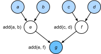

# Compilers and Interpreters
:label:`sec_hybridize`

So far, this book has focused on imperative programming, which makes use of statements such as `print`, `+` or `if` to change a program’s state. Consider the following example of a simple imperative program.

```{.python .input  n=1}
def add(a, b):
    return a + b

def fancy_func(a, b, c, d):
    e = add(a, b)
    f = add(c, d)
    g = add(e, f)
    return g

print(fancy_func(1, 2, 3, 4))
```

Python is an interpreted language. When evaluating `fancy_func` it performs the operations making up the function's body *in sequence*. That is, it will evaluate `e = add(a, b)` and it will store the results as variable `e`, thereby changing the program's state. The next two statements `f = add(c, d)` and `g = add(e, f)` will be excecuted similarly, performing additions and storing the results as variables. :numref:`fig_compute_graph` illustrates the flow of data.


:label:`fig_compute_graph`

Although imperative programming is convenient, it may be inefficient. On one hand, even if the `add` function is repeatedly called throughout `fancy_func`, Python will execute the three function calls individually. If these are executed, say, on a GPU (or even on multiple GPUs), the overhead arising from the Python interpreter can become overwhelming. Moreover, it will need to save the variable values of `e` and `f` until all the statements in `fancy_func` have been executed. This is because we do not know whether the variables `e` and `f` will be used by other parts of the program after the statements `e = add(a, b)` and `f = add(c, d)` have been executed.

## Symbolic Programming

Consider the alternative, symbolic programming where computation is usually performed only once the process has been fully defined. This strategy is used by multiple deep learning frameworks, including Theano, Keras and TensorFlow (the latter two have since acquired imperative extensions). It usually involves the following steps:

1. Define the operations to be executed.
1. Compile the operations into an executable program.
1. Provide the required inputs and call the compiled program for execution.

This allows for a significant amount of optimization. First off, we can skip the Python interpreter in many cases, thus removing a performance bottleneck that can become significant on multiple fast GPUs paired with a single Python thread on a CPU. Secondly, a compiler might optimize and rewrite the above code into `print((1 + 2) + (3 + 4))` or even `print(10)`. This is possible since a compiler gets to see the full code before turning it into machine instructions. For instance, it can release memory (or never allocate it) whenever a variable is no longer needed. Or it can transform the code entirely into an equivalent piece. To get a better idea consider the following simulation of imperative programming (it's Python after all) below.

```{.python .input  n=2}
def add_():
    return '''
def add(a, b):
    return a + b
'''

def fancy_func_():
    return '''
def fancy_func(a, b, c, d):
    e = add(a, b)
    f = add(c, d)
    g = add(e, f)
    return g
'''

def evoke_():
    return add_() + fancy_func_() + 'print(fancy_func(1, 2, 3, 4))'

prog = evoke_()
print(prog)
y = compile(prog, '', 'exec')
exec(y)
```

The differences between imperative (interpreted) programming and symbolic programming are as follows:

* Imperative programming is easier. When imperative programming is used in Python, the majority of the code is straightforward and easy to write. It is also easier to debug imperative programming code. This is because it is easier to obtain and print all relevant intermediate variable values, or use Python’s built-in debugging tools.
* Symbolic programming is more efficient and easier to port. It makes it easier to optimize the code during compilation, while also having the ability to port the program into a format independent of Python. This allows the program to be run in a non-Python environment, thus avoiding any potential performance issues related to the Python interpreter.

## Hybrid Programming

Historically most deep learning frameworks choose between an imperative or a symbolic approach. For example, Theano,  TensorFlow (inspired by the latter), Keras and CNTK formulate models symbolically. Conversely Chainer and PyTorch take an imperative approach. An imperative mode was added TensorFlow 2.0 (via Eiger) and Keras in later revisions. When designing Gluon, developers considered whether it would be possible to combine the benefits of both programming models. This led to a hybrid model that lets users develop and debug using pure imperative programming, while having the ability to convert most programs into symbolic programs to be run when product-level computing performance and deployment are required.

In practice this means that we build models using either the `HybridBlock` or the `HybridSequential` and `HybridConcurrent` classes. By default, they are executed in the same way `Block` or `Sequential` and `Concurrent` classes are executed in imperative programming. `HybridSequential` is a subclass of `HybridBlock` (just like `Sequential` subclasses `Block`). When the `hybridize` function is called, Gluon compiles the model into the form used in symbolic programming. This allows one to optimize the compute-intensive components without sacrifices in the way a model is implemented. We will illustrate the benefits below, focusing on sequential models and blocks only (the concurrent composition works analogously).

## HybridSequential

The easiest way to get a feel for how hybridization works is to consider deep networks with multiple layers. Conventionally the Python interpreter will need to execute the code for all layers to generate an instruction that can then be forwarded to a CPU or a GPU. For a single (fast) compute device this doesn't cause any major issues. On the other hand, if we use an advanced 8-GPU server such as an AWS P3dn.24xlarge instance Python will struggle to keep all GPUs busy. The single-threaded Python interpreter becomes the bottleneck here. Let's see how we can address this for significant parts of the code by replacing `Sequential` by `HybridSequential`. We begin by defining a simple MLP.

```{.python .input  n=3}
import d2l
from mxnet import np, npx
from mxnet.gluon import nn
npx.set_np()

# Factory for networks
def get_net():
    net = nn.HybridSequential()  
    net.add(nn.Dense(256, activation='relu'),
            nn.Dense(128, activation='relu'),
            nn.Dense(2))
    net.initialize()
    return net

x = np.random.normal(size=(1, 512))
net = get_net()
net(x)
```

By calling the `hybridize` function, we are able to compile and optimize the computation in the MLP. The model’s computation result remains unchanged.

```{.python .input  n=4}
net.hybridize()
net(x)
```

This seems almost too good to be true: simply designate a block to be `HybridSequential`, write the same code as before and invoke `hybridize`. Once this happens the network is optimized (we will benchmark the performance below). Unfortunately this doesn't work magically for every layer. That said, the blocks provided by Gluon are by default subclasses of `HybridBlock` and thus hybridizable. A layer will not be optimized if it inherits from the `Block` instead.

### Acceleration by Hybridization

To demonstrate the performance improvement gained by compilation we compare the time needed to evaluate `net(x)` before and after hybridization. Let's define a function to measure this time first. It will come handy throughout the chapter as we set out to measure (and improve) performance.

```{.python .input}
# Saved in the d2l package for later use
class benchmark:    
    def __init__(self, description = 'Done in %.4f sec'):
        self.description = description
        
    def __enter__(self):
        self.timer = d2l.Timer()
        return self

    def __exit__(self, *args):
        print(self.description % self.timer.stop())
```

Now we can invoke the network twice, once with and once without hybridization.

```{.python .input  n=5}
net = get_net()
with benchmark('Without hybridization: %.4f sec'):
    for i in range(1000): net(x)
    npx.waitall()

net.hybridize()
with benchmark('With    hybridization: %.4f sec'):
    for i in range(1000): net(x)
    npx.waitall()
```

As is observed in the above results, after a HybridSequential instance calls the `hybridize` function, computing performance is improved through the use of symbolic programming.


### Serialization

One of the benefits of compiling the models is that we can serialize (save) the model and its parameters to disk. This allows us to store a model in a manner that is independent of the front-end language of choice. This allows us to deploy trained models to other devices and easily use other front-end programming languages. At the same time the code is often faster than what can be achieved in imperative programming. Let's see the `export` method in action.

```{.python .input  n=13}
net.export('my_mlp')
!ls -lh my_mlp*
```

The model is decomposed into a (large binary) parameter file and a JSON description of the program required to execute to compute the model. The files can be read by other front-end languages supported by Python or MXNet, such as C++, R, Scala, and Perl. Let's have a look at the model description.

```{.python .input  n=7}
!head my_mlp-symbol.json
```

Things are slightly more tricky when it comes to models that resemble code more closely. Basically hybridization needs to deal with control flow and Python overhead in a much more immediate manner. Moreover,

Contrary to the Block instance, which needs to use the `forward` function, for a HybridBlock instance we need to use the `hybrid_forward` function.

Earlier, we demonstrated that, after calling the `hybridize` method, the model is able to achieve superior computing performance and portability. Note, though that hybridization can affect model flexibility, in particular in terms of control flow. We will illustrate how to design more general models and also how compilation will remove spurious Python elements.

```{.python .input  n=8}
class HybridNet(nn.HybridBlock):
    def __init__(self, **kwargs):
        super(HybridNet, self).__init__(**kwargs)
        self.hidden = nn.Dense(4)
        self.output = nn.Dense(2)

    def hybrid_forward(self, F, x):
        print('module F: ', F)
        print('value  x: ', x)
        x = F.npx.relu(self.hidden(x))
        print('result  : ', x)
        return self.output(x)
```

The code above implements a simple network with 4 hidden units and 2 outputs. `hybrid_forward` takes an additional argument---the module `F`. This is needed since, depending on whether the code has been hybridized or not, it will use a slightly different library (`ndarray` or `symbol`) for processing. Both classes perform very similar functions and MXNet automatically determines the argument. To understand what is going on we print the arguments as part of the function invocation.

```{.python .input  n=9}
net = HybridNet()
net.initialize()
x = np.random.normal(size=(1, 3))
net(x)
```

Repeating the forward computation will lead to the same output (we omit details). Now let's see what happens if we invoke the `hybridize` method.

```{.python .input  n=10}
net.hybridize()
net(x)
```

Instead of using `ndarray` we now use the `symbol` module for `F`. Moreover, even though the input is of `ndarray` type, the data flowing through the network is now converted to `symbol` type as part of the compilation process. Repeating the function call leads to a surprising outcome:

```{.python .input  n=11}
net(x)
```

This is quite different from what we saw previously. All print statements, as defined in `hybrid_forward` are omitted. Indeed, after hybridization the execution of `net(x)` does not involve the Python interpreter any longer. This means that any spurious Python code is omitted (such as print statements) in favor of a much more streamlined execution and better performance. Instead, MXNet directly calls the C++ backend. Also note that some functions are not supported in the `symbol` module (like `asnumpy`) and operations in-place like `a += b` and `a[:] = a + b` must be rewritten as `a = a + b`. Nonetheless, compilation of models is worth the effort whenever speed matters. The benefit can range from small percentage points to more than twice the speed, depending on the complexity of the model, the speed of the CPU and the speed and number of GPUs.

## Summary

* Imperative programming makes it easy to design new models since it is possible to write code with control flow and the ability to use a large amount of the Python software ecosystem.
* Symbolic programming requires that we specify the program and compile it before executing it. The benefit is improved performance.
* MXNet is able to combine the advantages of both approaches as needed.
* Models constructed by the `HybridSequential` and `HybridBlock` classes are able to convert imperative programs into symbolic programs by calling the `hybridize` method.


## Exercises

1. Design a network using the `HybridConcurrent` class. Alternatively look at :numref:`sec_googlenet` for a network to compose.
1. Add `x.asnumpy()` to the first line of the `hybrid_forward` function of the HybridNet class in this section. Execute the code and observe the errors you encounter. Why do they happen?
1. What happens if we add control flow, i.e., the Python statements `if` and `for` in the `hybrid_forward` function?
1. Review the models that interest you in the previous chapters and use the HybridBlock class or HybridSequential class to implement them.

## [Discussions](https://discuss.mxnet.io/t/2380)


