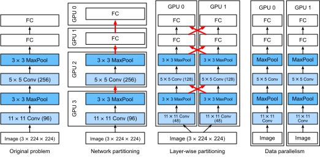

# Formation sur plusieurs GPU
:label:`sec_multi_gpu` 

 Jusqu'à présent, nous avons vu comment former efficacement des modèles sur des CPU et des GPU. Nous avons même montré comment les cadres d'apprentissage profond permettent de paralléliser automatiquement le calcul et la communication entre eux dans :numref:`sec_auto_para` . Nous avons également montré dans :numref:`sec_use_gpu` comment lister tous les GPU disponibles sur un ordinateur à l'aide de la commande `nvidia-smi`.
Ce que nous n'avons *pas* abordé, c'est la manière de paralléliser réellement la formation par apprentissage profond. 
Au lieu de cela, nous avons laissé entendre en passant qu'il était possible de répartir les données sur plusieurs appareils et de faire en sorte que cela fonctionne. La présente section complète les détails et montre comment former un réseau en parallèle en partant de zéro. Les détails sur la façon de tirer parti des fonctionnalités des API de haut niveau sont relégués à :numref:`sec_multi_gpu_concise` .
Nous supposons que vous êtes familier avec les algorithmes de descente de gradient stochastique par lots tels que ceux décrits dans :numref:`sec_minibatch_sgd` .


## Fractionnement du problème

Commençons par un problème de vision par ordinateur simple et un réseau légèrement archaïque, par exemple, avec plusieurs couches de convolutions, de mise en commun, et éventuellement quelques couches entièrement connectées à la fin. 
Autrement dit, commençons par un réseau qui ressemble beaucoup à LeNet :cite:`LeCun.Bottou.Bengio.ea.1998` ou AlexNet :cite:`Krizhevsky.Sutskever.Hinton.2012` . 
Avec plusieurs GPU (2 s'il s'agit d'un serveur de bureau, 4 sur une instance AWS g4dn.12xlarge, 8 sur un p3.16xlarge ou 16 sur un p2.16xlarge), nous voulons partitionner l'entraînement de manière à obtenir une bonne accélération tout en bénéficiant de choix de conception simples et reproductibles. Après tout, les GPU multiples augmentent à la fois la capacité de *mémoire* et de *calcul*. En bref, nous avons les choix suivants, étant donné un mini lot de données d'entraînement que nous voulons classer.

Premièrement, nous pouvons partitionner le réseau sur plusieurs GPU. En d'autres termes, chaque GPU prend en entrée les données qui entrent dans une couche particulière, traite les données dans un certain nombre de couches ultérieures, puis envoie les données au GPU suivant.
Cela nous permet de traiter des données avec des réseaux plus importants que ceux qu'un seul GPU pourrait gérer.
En outre, l'empreinte mémoire de
par GPU peut être bien contrôlée (elle représente une fraction de l'empreinte totale du réseau).

Cependant, l'interface entre les couches (et donc les GPU) nécessite une synchronisation étroite. Cela peut s'avérer délicat, en particulier si les charges de travail de calcul ne sont pas correctement adaptées entre les couches. Le problème est exacerbé pour un grand nombre de GPU.
L'interface entre les couches
nécessite également le transfert de grandes quantités de données,
telles que les activations et les gradients.
Cela peut dépasser la bande passante des bus des GPU.
De plus, les opérations séquentielles à forte intensité de calcul ne sont pas faciles à partitionner. Voir, par exemple, :cite:`Mirhoseini.Pham.Le.ea.2017` pour un meilleur effort à cet égard. Cela reste un problème difficile et il n'est pas clair s'il est possible d'obtenir une bonne mise à l'échelle (linéaire) sur des problèmes non triviaux. Nous ne le recommandons pas, à moins qu'il n'existe un excellent cadre ou système d'exploitation permettant de chaîner plusieurs GPU.


Deuxièmement, nous pourrions diviser le travail en couches. Par exemple, plutôt que de calculer 64 canaux sur un seul GPU, nous pourrions répartir le problème sur 4 GPU, chacun d'entre eux générant des données pour 16 canaux.
De même, pour une couche entièrement connectée, nous pourrions diviser le nombre d'unités de sortie. :numref:`fig_alexnet_original` (extrait de :cite:`Krizhevsky.Sutskever.Hinton.2012` )
illustre cette conception, où cette stratégie a été utilisée pour traiter les GPU qui avaient une très petite empreinte mémoire (2 Go à l'époque).
Cela permet une bonne mise à l'échelle en termes de calcul, à condition que le nombre de canaux (ou d'unités) ne soit pas trop faible.
En outre,
plusieurs GPU peuvent traiter des réseaux de plus en plus grands puisque la mémoire disponible évolue linéairement.


:label:`fig_alexnet_original`

Cependant,
nous avons besoin d'un *très grand* nombre d'opérations de synchronisation ou de barrière puisque chaque couche dépend des résultats de toutes les autres couches.
De plus, la quantité de données à transférer est potentiellement encore plus importante que lors de la distribution des couches sur les GPU. Nous ne recommandons donc pas cette approche en raison de son coût en bande passante et de sa complexité.
    
Enfin, nous pourrions partitionner les données entre plusieurs GPU. De cette façon, tous les GPU effectuent le même type de travail, bien que sur des observations différentes. Les gradients sont agrégés entre les GPU après chaque minibatch de données d'entraînement.
C'est l'approche la plus simple et elle peut être appliquée dans n'importe quelle situation.
Nous avons seulement besoin de synchroniser après chaque minibatch. Cela dit, il est hautement souhaitable de commencer à échanger les paramètres des gradients alors que d'autres sont encore en cours de calcul.
En outre, un plus grand nombre de GPU permet d'augmenter la taille des minibatchs, ce qui accroît l'efficacité de la formation.
Cependant, l'ajout de GPU ne nous permet pas d'entraîner des modèles plus grands.



:label:`fig_splitting`


Une comparaison des différentes méthodes de parallélisation sur plusieurs GPU est présentée sur le site :numref:`fig_splitting` .
Dans l'ensemble, le parallélisme des données est la méthode la plus pratique, à condition d'avoir accès à des GPU dotés d'une mémoire suffisamment grande. Voir également :cite:`Li.Andersen.Park.ea.2014` pour une description détaillée du partitionnement pour la formation distribuée. La mémoire des GPU était un problème au début de l'apprentissage profond. Aujourd'hui, cette question a été résolue pour tous les cas, sauf les plus inhabituels. Nous nous concentrons sur le parallélisme des données dans ce qui suit.

## Parallélisme des données

Supposons qu'il y ait $k$ GPU sur une machine. Étant donné le modèle à entraîner, chaque GPU maintiendra un ensemble complet de paramètres du modèle indépendamment, bien que les valeurs des paramètres entre les GPU soient identiques et synchronisées. 
À titre d'exemple,
:numref:`fig_data_parallel` illustre la formation de 
avec
parallélisme des données lorsque $k=2$.


:label:`fig_data_parallel`

En général, la formation se déroule comme suit :

* Dans toute itération de la formation, étant donné un mini lot aléatoire, nous divisons les exemples du lot en portions $k$ et les distribuons de manière égale entre les GPU.
* Chaque GPU calcule la perte et le gradient des paramètres du modèle en fonction du sous-ensemble de minilots qui lui a été attribué.
* Les gradients locaux de chacun des GPU $k$ sont agrégés pour obtenir le gradient stochastique du minilot actuel.
* Le gradient agrégé est redistribué à chaque GPU.
* Chaque GPU utilise ce gradient stochastique de minilots pour mettre à jour l'ensemble complet des paramètres du modèle qu'il maintient.


Notez qu'en pratique, nous *augmentons* la taille du minibatch $k$-fold lors de l'entraînement sur $k$ GPU de sorte que chaque GPU a la même quantité de travail à faire que si nous nous entraînions sur un seul GPU. Sur un serveur à 16 GPU, cela peut augmenter considérablement la taille des minibatchs et nous devrons peut-être augmenter le taux d'apprentissage en conséquence.
Notez également que la normalisation des lots dans :numref:`sec_batch_norm` doit être ajustée, par exemple en conservant un coefficient de normalisation des lots distinct par GPU.
Dans ce qui suit, nous utiliserons un petit réseau pour illustrer la formation multi-GPU.

```{.python .input}
#@tab mxnet
%matplotlib inline
from d2l import mxnet as d2l
from mxnet import autograd, gluon, np, npx
npx.set_np()
```

```{.python .input}
#@tab pytorch
%matplotlib inline
from d2l import torch as d2l
import torch
from torch import nn
from torch.nn import functional as F
```

## [**A Toy Network**]

Nous utilisons LeNet tel que présenté dans :numref:`sec_lenet` (avec de légères modifications). Nous le définissons à partir de zéro pour illustrer en détail l'échange de paramètres et la synchronisation.

```{.python .input}
#@tab mxnet
# Initialize model parameters
scale = 0.01
W1 = np.random.normal(scale=scale, size=(20, 1, 3, 3))
b1 = np.zeros(20)
W2 = np.random.normal(scale=scale, size=(50, 20, 5, 5))
b2 = np.zeros(50)
W3 = np.random.normal(scale=scale, size=(800, 128))
b3 = np.zeros(128)
W4 = np.random.normal(scale=scale, size=(128, 10))
b4 = np.zeros(10)
params = [W1, b1, W2, b2, W3, b3, W4, b4]

# Define the model
def lenet(X, params):
    h1_conv = npx.convolution(data=X, weight=params[0], bias=params[1],
                              kernel=(3, 3), num_filter=20)
    h1_activation = npx.relu(h1_conv)
    h1 = npx.pooling(data=h1_activation, pool_type='avg', kernel=(2, 2),
                     stride=(2, 2))
    h2_conv = npx.convolution(data=h1, weight=params[2], bias=params[3],
                              kernel=(5, 5), num_filter=50)
    h2_activation = npx.relu(h2_conv)
    h2 = npx.pooling(data=h2_activation, pool_type='avg', kernel=(2, 2),
                     stride=(2, 2))
    h2 = h2.reshape(h2.shape[0], -1)
    h3_linear = np.dot(h2, params[4]) + params[5]
    h3 = npx.relu(h3_linear)
    y_hat = np.dot(h3, params[6]) + params[7]
    return y_hat

# Cross-entropy loss function
loss = gluon.loss.SoftmaxCrossEntropyLoss()
```

```{.python .input}
#@tab pytorch
# Initialize model parameters
scale = 0.01
W1 = torch.randn(size=(20, 1, 3, 3)) * scale
b1 = torch.zeros(20)
W2 = torch.randn(size=(50, 20, 5, 5)) * scale
b2 = torch.zeros(50)
W3 = torch.randn(size=(800, 128)) * scale
b3 = torch.zeros(128)
W4 = torch.randn(size=(128, 10)) * scale
b4 = torch.zeros(10)
params = [W1, b1, W2, b2, W3, b3, W4, b4]

# Define the model
def lenet(X, params):
    h1_conv = F.conv2d(input=X, weight=params[0], bias=params[1])
    h1_activation = F.relu(h1_conv)
    h1 = F.avg_pool2d(input=h1_activation, kernel_size=(2, 2), stride=(2, 2))
    h2_conv = F.conv2d(input=h1, weight=params[2], bias=params[3])
    h2_activation = F.relu(h2_conv)
    h2 = F.avg_pool2d(input=h2_activation, kernel_size=(2, 2), stride=(2, 2))
    h2 = h2.reshape(h2.shape[0], -1)
    h3_linear = torch.mm(h2, params[4]) + params[5]
    h3 = F.relu(h3_linear)
    y_hat = torch.mm(h3, params[6]) + params[7]
    return y_hat

# Cross-entropy loss function
loss = nn.CrossEntropyLoss(reduction='none')
```

## Synchronisation des données

Pour une formation multi-GPU efficace, nous avons besoin de deux opérations de base. 
Tout d'abord, nous devons être en mesure de [**distribuer une liste de paramètres à plusieurs dispositifs**] et d'attacher des gradients (`get_params`). Sans paramètres, il est impossible d'évaluer le réseau sur un GPU.
Deuxièmement, nous devons pouvoir additionner les paramètres entre plusieurs dispositifs, c'est-à-dire qu'il nous faut une fonction `allreduce`.

```{.python .input}
#@tab mxnet
def get_params(params, device):
    new_params = [p.copyto(device) for p in params]
    for p in new_params:
        p.attach_grad()
    return new_params
```

```{.python .input}
#@tab pytorch
def get_params(params, device):
    new_params = [p.to(device) for p in params]
    for p in new_params:
        p.requires_grad_()
    return new_params
```

Essayons-le en copiant les paramètres du modèle sur un GPU.

```{.python .input}
#@tab all
new_params = get_params(params, d2l.try_gpu(0))
print('b1 weight:', new_params[1])
print('b1 grad:', new_params[1].grad)
```

Comme nous n'avons pas encore effectué de calcul, le gradient par rapport au paramètre de biais est toujours nul.
Supposons maintenant que nous ayons un vecteur distribué sur plusieurs GPU. La fonction suivante [**`allreduce` additionne tous les vecteurs et diffuse le résultat à tous les GPU**]. Notez que pour que cela fonctionne, nous devons copier les données sur le périphérique qui accumule les résultats.

```{.python .input}
#@tab mxnet
def allreduce(data):
    for i in range(1, len(data)):
        data[0][:] += data[i].copyto(data[0].ctx)
    for i in range(1, len(data)):
        data[0].copyto(data[i])
```

```{.python .input}
#@tab pytorch
def allreduce(data):
    for i in range(1, len(data)):
        data[0][:] += data[i].to(data[0].device)
    for i in range(1, len(data)):
        data[i][:] = data[0].to(data[i].device)
```

Testons cela en créant des vecteurs avec différentes valeurs sur différents périphériques et en les agrégeant.

```{.python .input}
#@tab mxnet
data = [np.ones((1, 2), ctx=d2l.try_gpu(i)) * (i + 1) for i in range(2)]
print('before allreduce:\n', data[0], '\n', data[1])
allreduce(data)
print('after allreduce:\n', data[0], '\n', data[1])
```

```{.python .input}
#@tab pytorch
data = [torch.ones((1, 2), device=d2l.try_gpu(i)) * (i + 1) for i in range(2)]
print('before allreduce:\n', data[0], '\n', data[1])
allreduce(data)
print('after allreduce:\n', data[0], '\n', data[1])
```

## Distribuer les données

Nous avons besoin d'une fonction utilitaire simple pour [**distribuer un mini-lot de manière égale sur plusieurs GPU**]. Par exemple, sur deux GPU, nous aimerions que la moitié des données soient copiées sur l'un ou l'autre des GPU.
Comme c'est plus pratique et plus concis, nous utilisons la fonction intégrée du cadre d'apprentissage profond pour l'essayer sur une matrice $4 \times 5$.

```{.python .input}
#@tab mxnet
data = np.arange(20).reshape(4, 5)
devices = [npx.gpu(0), npx.gpu(1)]
split = gluon.utils.split_and_load(data, devices)
print('input :', data)
print('load into', devices)
print('output:', split)
```

```{.python .input}
#@tab pytorch
data = torch.arange(20).reshape(4, 5)
devices = [torch.device('cuda:0'), torch.device('cuda:1')]
split = nn.parallel.scatter(data, devices)
print('input :', data)
print('load into', devices)
print('output:', split)
```

Pour une réutilisation ultérieure, nous définissons une fonction `split_batch` qui divise à la fois les données et les étiquettes.

```{.python .input}
#@tab mxnet
#@save
def split_batch(X, y, devices):
    """Split `X` and `y` into multiple devices."""
    assert X.shape[0] == y.shape[0]
    return (gluon.utils.split_and_load(X, devices),
            gluon.utils.split_and_load(y, devices))
```

```{.python .input}
#@tab pytorch
#@save
def split_batch(X, y, devices):
    """Split `X` and `y` into multiple devices."""
    assert X.shape[0] == y.shape[0]
    return (nn.parallel.scatter(X, devices),
            nn.parallel.scatter(y, devices))
```

## Entraînement

Nous pouvons maintenant mettre en œuvre [**l'entraînement multi-GPU sur un seul minibatch**]. Son implémentation est principalement basée sur l'approche du parallélisme des données décrite dans cette section. Nous utiliserons les fonctions auxiliaires dont nous venons de parler, `allreduce` et `split_and_load`, pour synchroniser les données entre plusieurs GPU. Notez que nous n'avons pas besoin d'écrire de code spécifique pour réaliser le parallélisme. Puisque le graphe de calcul n'a pas de dépendances entre les dispositifs d'un minibatch, il est exécuté en parallèle *automatiquement*.

```{.python .input}
#@tab mxnet
def train_batch(X, y, device_params, devices, lr):
    X_shards, y_shards = split_batch(X, y, devices)
    with autograd.record():  # Loss is calculated separately on each GPU
        ls = [loss(lenet(X_shard, device_W), y_shard)
              for X_shard, y_shard, device_W in zip(
                  X_shards, y_shards, device_params)]
    for l in ls:  # Backpropagation is performed separately on each GPU
        l.backward()
    # Sum all gradients from each GPU and broadcast them to all GPUs
    for i in range(len(device_params[0])):
        allreduce([device_params[c][i].grad for c in range(len(devices))])
    # The model parameters are updated separately on each GPU
    for param in device_params:
        d2l.sgd(param, lr, X.shape[0])  # Here, we use a full-size batch
```

```{.python .input}
#@tab pytorch
def train_batch(X, y, device_params, devices, lr):
    X_shards, y_shards = split_batch(X, y, devices)
    # Loss is calculated separately on each GPU
    ls = [loss(lenet(X_shard, device_W), y_shard).sum()
          for X_shard, y_shard, device_W in zip(
              X_shards, y_shards, device_params)]
    for l in ls:  # Backpropagation is performed separately on each GPU
        l.backward()
    # Sum all gradients from each GPU and broadcast them to all GPUs
    with torch.no_grad():
        for i in range(len(device_params[0])):
            allreduce([device_params[c][i].grad for c in range(len(devices))])
    # The model parameters are updated separately on each GPU
    for param in device_params:
        d2l.sgd(param, lr, X.shape[0]) # Here, we use a full-size batch
```

Maintenant, nous pouvons définir [**la fonction d'entraînement**]. Elle est légèrement différente de celles utilisées dans les chapitres précédents : nous devons allouer les GPU et copier tous les paramètres du modèle sur tous les appareils.
Évidemment, chaque lot est traité à l'aide de la fonction `train_batch` pour traiter les GPU multiples. Pour des raisons de commodité (et de concision du code), nous calculons la précision sur un seul GPU, bien que cela soit *inefficace* puisque les autres GPU sont inactifs.

```{.python .input}
#@tab mxnet
def train(num_gpus, batch_size, lr):
    train_iter, test_iter = d2l.load_data_fashion_mnist(batch_size)
    devices = [d2l.try_gpu(i) for i in range(num_gpus)]
    # Copy model parameters to `num_gpus` GPUs
    device_params = [get_params(params, d) for d in devices]
    num_epochs = 10
    animator = d2l.Animator('epoch', 'test acc', xlim=[1, num_epochs])
    timer = d2l.Timer()
    for epoch in range(num_epochs):
        timer.start()
        for X, y in train_iter:
            # Perform multi-GPU training for a single minibatch
            train_batch(X, y, device_params, devices, lr)
            npx.waitall()
        timer.stop()
        # Evaluate the model on GPU 0
        animator.add(epoch + 1, (d2l.evaluate_accuracy_gpu(
            lambda x: lenet(x, device_params[0]), test_iter, devices[0]),))
    print(f'test acc: {animator.Y[0][-1]:.2f}, {timer.avg():.1f} sec/epoch '
          f'on {str(devices)}')
```

```{.python .input}
#@tab pytorch
def train(num_gpus, batch_size, lr):
    train_iter, test_iter = d2l.load_data_fashion_mnist(batch_size)
    devices = [d2l.try_gpu(i) for i in range(num_gpus)]
    # Copy model parameters to `num_gpus` GPUs
    device_params = [get_params(params, d) for d in devices]
    num_epochs = 10
    animator = d2l.Animator('epoch', 'test acc', xlim=[1, num_epochs])
    timer = d2l.Timer()
    for epoch in range(num_epochs):
        timer.start()
        for X, y in train_iter:
            # Perform multi-GPU training for a single minibatch
            train_batch(X, y, device_params, devices, lr)
            torch.cuda.synchronize()
        timer.stop()
        # Evaluate the model on GPU 0
        animator.add(epoch + 1, (d2l.evaluate_accuracy_gpu(
            lambda x: lenet(x, device_params[0]), test_iter, devices[0]),))
    print(f'test acc: {animator.Y[0][-1]:.2f}, {timer.avg():.1f} sec/epoch '
          f'on {str(devices)}')
```

Voyons comment cela fonctionne [**sur un seul GPU**].
Nous utilisons d'abord une taille de lot de 256 et un taux d'apprentissage de 0,2.

```{.python .input}
#@tab all
train(num_gpus=1, batch_size=256, lr=0.2)
```

En gardant la taille de lot et le taux d'apprentissage inchangés et en [**augmentant le nombre de GPU à 2**], nous pouvons voir que la précision du test reste à peu près la même par rapport à
l'expérience précédente.
En ce qui concerne les algorithmes d'optimisation, ils sont identiques. Malheureusement, il n'y a pas de gain de vitesse significatif à réaliser ici : le modèle est tout simplement trop petit ; de plus, nous n'avons qu'un petit ensemble de données, où notre approche peu sophistiquée pour mettre en œuvre l'entraînement multi-GPU a souffert d'une surcharge significative de Python. Nous allons rencontrer des modèles plus complexes et des méthodes de parallélisation plus sophistiquées à l'avenir.
Voyons néanmoins ce qui se passe pour Fashion-MNIST.

```{.python .input}
#@tab all
train(num_gpus=2, batch_size=256, lr=0.2)
```

## Résumé

* Il existe plusieurs façons de répartir l'entraînement des réseaux profonds sur plusieurs GPU. Nous pouvons les répartir entre les couches, entre les couches ou entre les données. Les deux premières requièrent des transferts de données étroitement chorégraphiés. Le parallélisme des données est la stratégie la plus simple.
* L'entraînement en parallèle des données est simple. Cependant, elle augmente la taille effective des minibatchs pour être efficace.
* Dans le parallélisme des données, les données sont réparties entre plusieurs GPU, où chaque GPU exécute sa propre opération en avant et en arrière, puis les gradients sont agrégés et les résultats sont diffusés aux GPU.
* Nous pouvons utiliser des taux d'apprentissage légèrement plus élevés pour des minibatchs plus importants.

## Exercices

1. Lors de l'apprentissage sur $k$ GPU, changez la taille des minibatchs de $b$ à $k \cdot b$, c'est-à-dire augmentez-la du nombre de GPU.
1. Comparez la précision pour différents taux d'apprentissage. Comment cela évolue-t-il avec le nombre de GPU ?
1. Implémentez une fonction `allreduce` plus efficace qui agrège différents paramètres sur différents GPU ? Pourquoi est-elle plus efficace ?
1. Implémenter le calcul de la précision des tests multi-GPU.

:begin_tab:`mxnet`
[Discussions](https://discuss.d2l.ai/t/364)
:end_tab:

:begin_tab:`pytorch`
[Discussions](https://discuss.d2l.ai/t/1669)
:end_tab:
